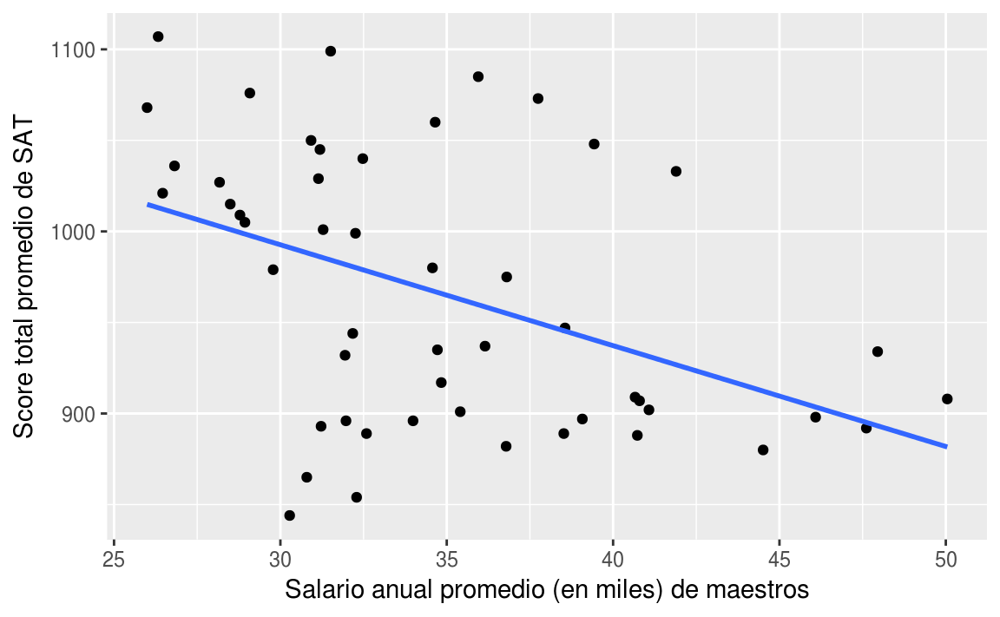
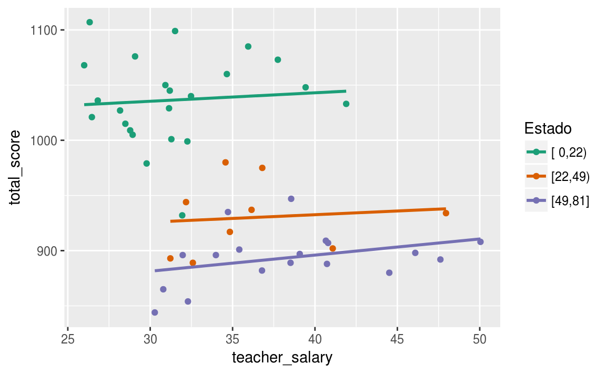
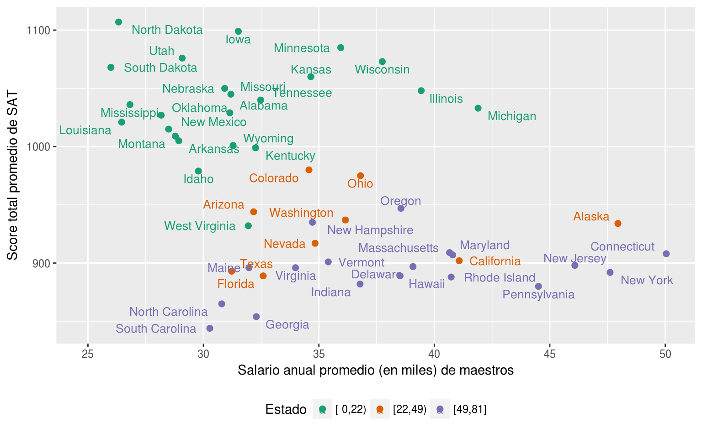
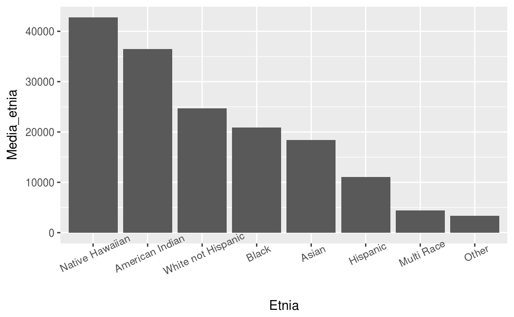
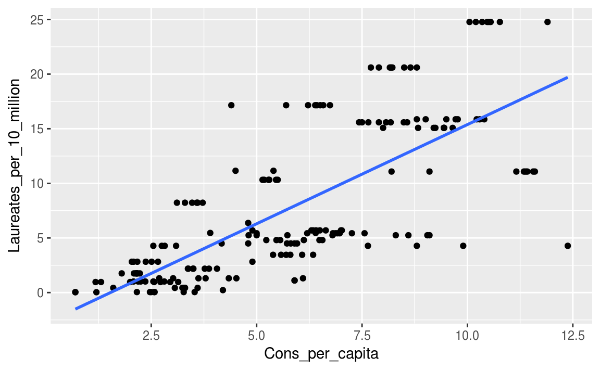

# Introducción {#intro}

<style>
  .espacio {
     margin-bottom: 1cm;
  }
</style>

<style>
  .espacio3 {
     margin-bottom: 3cm;
  }
</style>

La investigación científica es un proceso de aprendizaje iterativo. Para explicar un fenómeno físico o social primero se deben especificar los objetivos de una investigación y luego probar los objetivos a través de la recopilación y el análisis de datos pertinentes. A su vez, el análisis de los datos recopilados (experimentalmente o mediante observación) generalmente sugerirá una explicación modificada del fenómeno.

A lo largo de este proceso iterativo, generalmente se añaden o se excluyen variables del análisis. Por lo tanto, la complejidad de la mayoría de los fenómenos requieren que el investigador recolecte muchas variables de las observaciones. En este curso veremos una introducción a los modelos estadísticos que son _multivariados_, es decir, modelos en los cuales los datos corresponden a mediciones en _muchas variables_.

## ¿Por qué un análisis multivariado?

Las razones por las cuales se utilizan modelos multivariados son generalmente [@johnson2014applied]:

(1) Factores de _"confusión"_. Un factor de confusión (o _confound_ variable) es una variable que puede correlacionarse con otra variable de interés. Las correlaciones espurias son un posible tipo de confusión, donde el factor de confusión hace que una variable sin importancia real parezca ser importante. Pero las confusiones pueden ocultar variables reales importantes tan fácilmente como pueden producir falsas. Un ejemplo de esto, conocido como la _"paradoja"_ de Simpson, consiste de datos en los cuales la dirección de una aparente asociación entre un predictor y la variable respuesta se puede revertir al considerar un factor de confusión.

## La paradoja de Simpson

La paradoja de Simpson, también conocida como el _efecto Yule-Simpson_, ocurre cuando existe una asociación entre dos variables en varios grupos pero la dirección de esta asociación se invierte cuando los datos se combinan para formar un solo grupo.

En un análisis de los scores de SAT (examen de posicionamiento para la universidad) en Estados Unidos en 1997 se encontró que había una relación negativa entre el salario promedio anual de los maestros y el score total promedio de los alumnos que presentaron el SAT:


```r
library(tidyverse)
sat <- read_csv("datos/sat.csv")
ggplot(sat, aes(x = teacher_salary, y = total_score)) +
  geom_point() +
  geom_smooth(method = "lm", se = F) +
  xlab("Salario anual promedio (en miles) de maestros") +
  ylab("Score total promedio de SAT")
```



Podemos revisar el resultado de la regresión lineal (haciendo uso del paquete `stargazer`):


```r
library(stargazer)
out1 <- lm(formula = total_score ~ teacher_salary, data = sat)
stargazer(out1, type = 'html', style = "all", single.row = T,
          title = "Regresión lineal del promedio de sueldo de maestros vs SAT promedio")
```


<table style="text-align:center"><caption><strong>Regresión lineal del promedio de sueldo de maestros vs SAT promedio</strong></caption>
<tr><td colspan="2" style="border-bottom: 1px solid black"></td></tr><tr><td style="text-align:left"></td><td><em>Dependent variable:</em></td></tr>
<tr><td></td><td colspan="1" style="border-bottom: 1px solid black"></td></tr>
<tr><td style="text-align:left"></td><td>total_score</td></tr>
<tr><td colspan="2" style="border-bottom: 1px solid black"></td></tr><tr><td style="text-align:left">teacher_salary</td><td>-5.540<sup>***</sup> (1.630)</td></tr>
<tr><td style="text-align:left"></td><td>t = -3.390</td></tr>
<tr><td style="text-align:left"></td><td>p = 0.002</td></tr>
<tr><td style="text-align:left">Constant</td><td>1,159.000<sup>***</sup> (57.700)</td></tr>
<tr><td style="text-align:left"></td><td>t = 20.100</td></tr>
<tr><td style="text-align:left"></td><td>p = 0.000</td></tr>
<tr><td colspan="2" style="border-bottom: 1px solid black"></td></tr><tr><td style="text-align:left">Observations</td><td>50</td></tr>
<tr><td style="text-align:left">R<sup>2</sup></td><td>0.193</td></tr>
<tr><td style="text-align:left">Adjusted R<sup>2</sup></td><td>0.177</td></tr>
<tr><td style="text-align:left">Residual Std. Error</td><td>67.900 (df = 48)</td></tr>
<tr><td style="text-align:left">F Statistic</td><td>11.500<sup>***</sup> (df = 1; 48) (p = 0.002)</td></tr>
<tr><td colspan="2" style="border-bottom: 1px solid black"></td></tr><tr><td style="text-align:left"><em>Note:</em></td><td style="text-align:right"><sup>*</sup>p<0.1; <sup>**</sup>p<0.05; <sup>***</sup>p<0.01</td></tr>
</table>

<p class="espacio">
</p>

Podemos observar que el coeficiente de la variable salario es $-5.54$ y es significartivo según la prueba de hipótesis correspondiente.

Desafortunadamente, la asociación entre salario y score de SAT parece ser negativa: a medida que aumenta el salario, se predice que el score SAT promedio disminuye.

Afortunadamente para los maestros, una vez que se cuenta la variable de la fracción de alumnos que presentan el SAT, vemos una relación positiva estadísticamente significativa:


```r
out2 <- lm(formula = total_score ~ teacher_salary + perc_take_sat, data = sat)
stargazer(out2, type = 'html', style = "all", single.row = T,
          title = "Incluyendo el factor de confusión")
```


<table style="text-align:center"><caption><strong>Incluyendo el factor de confusión</strong></caption>
<tr><td colspan="2" style="border-bottom: 1px solid black"></td></tr><tr><td style="text-align:left"></td><td><em>Dependent variable:</em></td></tr>
<tr><td></td><td colspan="1" style="border-bottom: 1px solid black"></td></tr>
<tr><td style="text-align:left"></td><td>total_score</td></tr>
<tr><td colspan="2" style="border-bottom: 1px solid black"></td></tr><tr><td style="text-align:left">teacher_salary</td><td>2.180<sup>**</sup> (1.030)</td></tr>
<tr><td style="text-align:left"></td><td>t = 2.120</td></tr>
<tr><td style="text-align:left"></td><td>p = 0.040</td></tr>
<tr><td style="text-align:left">perc_take_sat</td><td>-2.780<sup>***</sup> (0.228)</td></tr>
<tr><td style="text-align:left"></td><td>t = -12.200</td></tr>
<tr><td style="text-align:left"></td><td>p = 0.000</td></tr>
<tr><td style="text-align:left">Constant</td><td>988.000<sup>***</sup> (31.900)</td></tr>
<tr><td style="text-align:left"></td><td>t = 31.000</td></tr>
<tr><td style="text-align:left"></td><td>p = 0.000</td></tr>
<tr><td colspan="2" style="border-bottom: 1px solid black"></td></tr><tr><td style="text-align:left">Observations</td><td>50</td></tr>
<tr><td style="text-align:left">R<sup>2</sup></td><td>0.806</td></tr>
<tr><td style="text-align:left">Adjusted R<sup>2</sup></td><td>0.797</td></tr>
<tr><td style="text-align:left">Residual Std. Error</td><td>33.700 (df = 47)</td></tr>
<tr><td style="text-align:left">F Statistic</td><td>97.400<sup>***</sup> (df = 2; 47) (p = 0.000)</td></tr>
<tr><td colspan="2" style="border-bottom: 1px solid black"></td></tr><tr><td style="text-align:left"><em>Note:</em></td><td style="text-align:right"><sup>*</sup>p<0.1; <sup>**</sup>p<0.05; <sup>***</sup>p<0.01</td></tr>
</table>

Podemos ver que el coeficiente de la regresión lineal correspondiente al salario de los maestros se invierte. Gráficamente podemos visualizar este efecto:




Vemos que dentro de cada grupo, la pendiente es positiva (o al menos no negativa). También podríamos agregar etiquetas:




Otro ejemplo de este fenómeno es cuando la Universidad de California, Berkeley fue demandada por discrimanción hacia mujeres que habían solicitado admisión a un posgrado en 1973. De acuerdo con las estadísticas de admisión, los hombres que presentaron la solicitud tenían mayor probabilidad de ser admitidos que las mujeres, y la diferencia era tan sustancial que uno podría concluir que efectivamente había existido dicha discriminación. Sin embargo, al examinar los datos individualmente por departamento, parecía que no había una diferencia significativa en contra de las mujeres.


```r
ucb <- UCBAdmissions %>% as.tibble()
ucb %>%
  head(10) %>%
  knitr::kable()
```


Admit      Gender   Dept      n
---------  -------  -----  ----
Admitted   Male     A       512
Rejected   Male     A       313
Admitted   Female   A        89
Rejected   Female   A        19
Admitted   Male     B       353
Rejected   Male     B       207
Admitted   Female   B        17
Rejected   Female   B         8
Admitted   Male     C       120
Rejected   Male     C       205

Los datos contienen el número de solicitudes y admisiones por género a seis escuelas de postgrado diferentes. Analicemos una tabla de contingencia entre la variable género y la variable admitido:


```r
tab <- ucb %>% 
  group_by(Gender, Admit) %>%
  summarise(p = sum(n)) %>%
  spread(Admit, p) 

tab %>% knitr::kable()
```


Gender    Admitted   Rejected
-------  ---------  ---------
Female         557       1278
Male          1198       1493

Los solicitantes masculinos tenían una tasa de aceptación del 44.52%, en comparación con solo el 30.35% de las mujeres, condicionando en la variable de género:


```r
tab %>% 
  gather(Admit, n, -Gender) %>% 
  mutate(prop = round(prop.table(n) * 100,2)) %>% 
  select(-n) %>%
  spread(Admit, prop) %>%
  knitr::kable()
```


Gender    Admitted   Rejected
-------  ---------  ---------
Female        30.4       69.7
Male          44.5       55.5

Incluso podemos proporcionar una prueba estadística para apoyar la afirmación de que hubo sesgo en las admisiones. En R, se puede realizar una prueba de proporciones a través de la función `prop.test()`:


```r
prop.test(tab %>% ungroup() %>% select(-Gender) %>% as.matrix())
#> 
#> 	2-sample test for equality of proportions with continuity
#> 	correction
#> 
#> data:  tab %>% ungroup() %>% select(-Gender) %>% as.matrix()
#> X-squared = 90, df = 1, p-value <2e-16
#> alternative hypothesis: two.sided
#> 95 percent confidence interval:
#>  -0.170 -0.113
#> sample estimates:
#> prop 1 prop 2 
#>  0.304  0.445
```

A partir de la prueba de hipótesis realizada anteriormente, se puede concluir que hay una diferencias significativa entre la proporción de hombres admitidos y la proporción de mujeres admitidas en los programas de posgrado.

Sin embargo, si hacemos el mismo análisis por departamento, veremos que las diferencias ya no son tan significativas:


```r
ucb %>% 
  spread(Admit, n) %>%
  mutate(total = Admitted + Rejected,
         porc = round(Admitted/total*100,2)) %>%
  select(Gender,Dept,porc) %>%
  spread(Gender, porc) %>%
  knitr::kable()
```


Dept    Female   Male
-----  -------  -----
A        82.41   62.1
B        68.00   63.0
C        34.06   36.9
D        34.93   33.1
E        23.92   27.8
F         7.04    5.9


Condicionando por departamento ahora vemos que las mujeres realmente tienen mayores tasas de admisión en cuatro de los seis departamentos (A, B, D, F). ¿Cómo puede ser esto? En realidad las diferencias tienen que ver con el porcentaje de solicitantes (hombres y mujeres) que son admitidos por departamentos, es decir, hay departamentos más competitivos que otros.


Consideremos un modelo log-lineal. Sea $p_{ijk}$ la proporción de la población en la celda $(i,j,k)$. Por ejemplo, $p_{112}$ es la proporción de solicitantes que son admitidos, son hombres y se postulan para el Departamento B.


```r
tab <- xtabs(n ~ ., ucb)
llout <- loglin(tab, list(1:2,c(1,3),2:3),param=TRUE)
#> 9 iterations: deviation 0.0492
```

Los efectos globales de la variable de admitidos son:


```r
llout$param$Admit %>% knitr::kable()
```

                 x
---------  -------
Admitted    -0.321
Rejected     0.321


Los efectos globales de la variable Departamento, por ejemplo, nos dicen qué departamentos tienden a tener más solicitantes (el A, el C y el D), aunque en realidad esto no sea tan relevante:


```r
llout$param$Dept %>% knitr::kable()
```

           x
---  -------
A      0.154
B     -0.765
C      0.540
D      0.430
E     -0.029
F     -0.330


Los efectos globales de la variable género también nos dicen que el número de solicitantes hombres es mayor que el número de solicitantes que son mujeres:


```r
llout$param$Gender %>% knitr::kable()
```

               x
-------  -------
Female    -0.329
Male       0.329


Analicemos ahora los términos de interacciones entre variables. Como la variable que nos interesa es la de admisión, veamos la interacción de Admit-Gender y Admit-Department:


```r
llout$param$Admit.Gender %>% knitr::kable()
```

            Female     Male
---------  -------  -------
Admitted     0.025   -0.025
Rejected    -0.025    0.025


```r
llout$param$Admit.Dept %>% knitr::kable()
```

                 A        B        C       D        E       F
---------  -------  -------  -------  ------  -------  ------
Admitted     0.637    0.615    0.006   -0.01   -0.232   -1.02
Rejected    -0.637   -0.615   -0.006    0.01    0.232    1.02

En términos de asociación con la variable de admisión, la relación con la variable de departamento es mucho más fuerte que con la de género, lo que significa que la mayoría de los parámetros estimados son mucho más grandes en el primer caso. En otras palabras, el departamento es la variable más importante, no el género. Más aún, los resultados anteriores también muestran que existe una interacción Admit-Female positiva, es decir, que a las mujeres les va un poco mejor que a los hombres en cuanto a la admisión.

## Modelos log-lineales

Denotemos los 3 factores por $X^{(s)}$, $s=1,2,3$. En este caso particular, $X^{(1)}$ es la variable de admisión `Admit`, y toma valores de $1$ y $2$, admitido y no admitido respectivamente. $X^{(2)}$ la variable género tomaría valores $1$ y $2$ para hombre y mujer respectivamente, mientras que $X^{(3)}$, la variable de departamento, toma valores del $1$ al $6$ para representar los departamentos A al F. En esta notación no estamos usando variables indicadoras. Estamos trabajando con variables estrictamente categóricas, cuyos valores son meramente etiquetas.

Sea $X_r^{(s)}$ el valor de $X^{(s)}$ para el $i$-ésimo solicitante en la muestra, para $r=1,2,\ldots,n$. Aquí el número de observaciones es el número de solicitantes $n=$4526. Nuestros datos son los conteos en todas las categorías:

$$
N_{ijk} = \mbox{nú}\;\mbox{mero de solicitantes }r\mbox{ tales que }X_r^{(1)}=i, X_r^{(2)}=j,\mbox{ y } X_r^{(3)}=k.
$$

A esto le llamamos una __tabla de contigencias__ en tres variables. Cada valor $N_{ijk}$ es una celda de la tabla.

Sea $p_{ijk}$ la proporción poblacional de un solicitante elegido al azar en la celda $(i,j,k)$, es decir,

$$
p_{ijk} = P(X^{(1)}=i \mbox{ y } X^{(2)}=j \mbox{ y } X^{(3)}=k) = E(N_{ijk})/n.
$$


Como se mencionó, nos interesan las relaciones entre las factores, en forma de independencia, tanto plena como parcial. De hecho, es común que un analista ajuste sucesivamente modelos más refinados a los datos, asumiendo cada uno una estructura de dependencia más compleja que la anterior. Esto se desarrollará en detalle a continuación.

Considere primero el modelo que asume la independencia total:
$$
\begin{eqnarray*}
p_{ijk} & = & P(X^{(1)}=i \mbox{ y } X^{(2)}=j \mbox{ y } X^{(3)}=k) \\
&=& P(X^{(1)}=i) \cdot P(X^{(2)}=j) \cdot P(X^{(3)}=k). 
\end{eqnarray*}
$$
Tomando logaritmo de ambos lados, vemos que la independencia de los tres factores es equivalente a escribir una ecuación de la forma
$$
\mbox{log}(p_{ijk}) = a_i + b_j + c_k,
$$
donde $a_i,b_j,c_k$ son cantidades estimadas. Por ejemplo,
$$
b_j = \mbox{log}\left(P(X^{(2)}=j)\right).
$$
El punto es que el modelo es similar a un modelo de regresión lineal sin interacciones. El análogo de que no haya interacción entre las variables aquí está representado por el supuesto de independencia.

Por ejemplo, si suponemos que Departamento es independiente de Admisión y Género, pero que Admisión y Género _no_ son independientes entre sí, el modelo incluiría un término de interacción  $i-j$:
$$
p_{ijk} = P(X^{(1)}=i,  X^{(2)}=j)\cdot P(X^{(3)} = k),
$$
por lo que el modelo sería
$$
\mbox{log}(p_{ijk}) = a_{ij} + b_k.
$$
La mayoría de los modelos formales reescriben esto como
$$
a_{ij} = u + v_i + w_j + r_{ij},
$$
de tal forma que el término de interacción $P(X^{(1)}=i \mbox{ y } X^{(2)}=j)$ es una suma de un "efecto global" $u$, "efectos principales" $v_i$ y $w_j$ y "efectos de interacción" $r_{ij}$, nuevamente de forma análoga a la regresión lineal.

Sin embargo, tenga en cuenta que esto en realidad nos da demasiados parámetros. Para el término de interacción $a_{ij}$ del modelo, tenemos $2 \times 3 = 6$ probabilidades reales, pero $1 + 2 + 2 + 2\times   2 = 9$ parámetros (1 para $u$, 2 para $v_i$ y así sucesivamente). Por esta razón, generalmente los modelos tienen restricciones de la forma
$$
\displaystyle{\sum_i{v_i}}=0.
$$
Es posible enumerar todas las restricciones, aunque en la mayoría de los modelos aún con restricciones el número de parámetros puede ser muy grande.

 
<div class="centered">
<p class="espacio">
</p>
¿Qué modelo es más apropiado en el ejemplo anterior?

(a) $p_{ijk} = P(X^{(1)}=i) \cdot P(X^{(2)}=j, X^{(3)}=k)$

(b) $p_{ijk} = P(X^{(1)}=i, X^{(2)}=j, X^{(3)}=k)$

(c) $p_{ijk} = P(X^{(1)}=i)\cdot P(X^{(2)}=j)\cdot P(X^{(3)}=k)$

(d) $p_{ijk} = P(X^{(1)}=i, X^{(3)}=k) \cdot P(X^{(2)}=j)$

<p class="espacio3">
</p>
</div>

Otro posible modelo tendría Admitido y Género condicionalmente independientes, dado Departamento, lo que significa que en cualquier género, la proporción de admitidos y su género, no están relacionados. Escribimos el modelo de esta manera

$$
\begin{eqnarray*}
p_{ijk} &=& P(X^{(1)}=i, X^{(2)}=j, X^{(3)}=k) \\
&=& P(X^{(1)}=i, X^{(2)}=j|X^{(3)}=k) \cdot P(X^{(3)}=k) \\
&=& P(X^{(1)}=i|X^{(3)}=k) \cdot P(X^{(2)}=j|X^{(3)}=k) \cdot P(X^{(3)}=k),
\end{eqnarray*}
$$
y el modelo sería de la forma
$$
\mbox{log}(p_{ijk}) = u + a_i + f_{ik} + b_j + h_{jk} + c_k.
$$


<div class="centered">
<p class="espacio">
</p>
¿Cuántos parámetros tendría este modelo?

(a) 30

(b) 35

(c) 40

(d) 45

<p class="espacio3">
</p>
</div>

## Interpretación de parámetros

Consideremos los modelos:

$$
\begin{eqnarray*}
\mbox{(1)} & \qquad & \mbox{log}(p_{ijk}) = a_{ij} + b_k, \\
\mbox{(2)} & \qquad & \mbox{log}(p_{ijk}) = u + a_i + f_{ik} + b_j + h_{jk} + c_k.
\end{eqnarray*}
$$

La independencia que representa el modelo (1) tiene una interpretación muy diferente a las independencias representadas por el modelo (2).


### Ejemplo: dos monedas

Supongamos que tenemos una gran caja con monedas de dos tipos. Las monedas de tipo 1 tienen probabilidad $p$ de salir águila, y las monedas tipo 2 tienen probabilidad $q$ de salir águila. Una proporción $r$ de las monedas es del tipo 1. Seleccionamos una moneda al azar de la caja, lanzamos esa moneda $M$ veces, y observamos $N$ águilas. ¿Cuál es la distribución de $N$?
$$
p_N(k) = r \dbinom{M}{k}p^k (1-p)^{M-k} + (1-r) \dbinom{M}{k}q^k (1-q)^{M-k},
$$
donde $k=0,1,\ldots,M$. Es fácil ver por qué a esta distribución se le conoce como _modelo de mezcla_. Esta función de distribución de probabilidad es una mezcla de dos funciones de distribución de probabilidad binomiales, con proporciones de mezcla $r$ y $1-r$.

Si $M$ es una variable aleatoria con soporte (o rango) $R$ y $\left\{g_t\right\}_{t\in R}$ es una colección de funciones de densidad, entonces se dice que $h$ es una función de densidad de mezcla
si
$$
h = \displaystyle{\sum_{k\in R}p_M(k)g_k},
$$
cuando $M$ es una variable aleatoria discreta, o si
$$
h = \displaystyle{\int_{t\in R}f_M(t)g_t(u)\;\;dt},
$$
cuando $M$ es una variable aleatoria continua.

En el ejemplo de la moneda:

- $Y = N$

- $S = \{1,2\}$

- $p_M(1) = r, \quad p_M(2) = 1-r$

- $g_1$ es la fn de densidad de una va $\mbox{Binomial}(M,p)$

- $g_2$ es la fn de densidad de una va $\mbox{Binomial}(M,q)$

Dada la elección de moneda, el resultado de la moneda 1 es independiente del resultado de la oneda 2. Sin embargo, los resultados de las monedas no son independientes si no se sabe qué moneda fue seleccionada. Este ejemplo es como el del modelo (2) mencionado arriba. 

Por otro lado, se sabe que la estatura y el peso están asociadas linealmente, pero ambas son independientes de la preferenvia por algún sabor de helado, una situación similar a la del modelo (1).

Es importante considerar las interacciones que están consideradas en el modelo, por ejemplo:

- en el modelo (1) hay una interacción entre los factores $i,j$ pero no hay interacción con el factor $k$, por lo que $i$ y $j$ se modelan como completamente independientes de $k$ y no entre sí, mientras que

- en el modelo (2) $i$ y $j$ tienen una interacción con $k$ y no entre sí, por lo que $i$ y $j$ no son independientes entre sí, pero sí los son dado $k$.


<div class="centered">
<p class="espacio">
</p>
Consideremos ahora el modelo
$$
\mbox{log}(p_{ijk}) = u + a_i + f_{ik} + b_j + h_{jk} + l_{ij} + c_k,
$$
¿cuál de las siguientes afirmaciones es cierta?

(a) $i$ y $j$ son dependientes dado $k$.

(b) $i$ y $j$ son independientes dado $k$.

(c) $i$ y $k$ son dependientes dado $j$.

(d) $i$ y $k$ son independientes dado $j$.

<p class="espacio3">
</p>
</div>

Si hubiéramos incluido un término $m_{ijk}$, que ahora haría que el modelo estuviera lleno (o saturado), entonces sería posible que los factores $i$ y $j$ estuvieran altamente relacionados para algunos valores de $k$, y menos relacionados para otros. Claramente, cuantas más variables tengamos, y cuanto mayor sea el orden de las interacciones que incluimos, más difícil será interpretar el modelo.

## Otros ejemplos

### Discriminación de residentes hispanos con discapacidades

La mayoría de los estados en los Estados Unidos proporcionan servicios y apoyo a personas con
discapacidades (por ejemplo, discapacidad intelectual, parálisis cerebral, autismo, etc.) y sus familias. La
agencia a través de la cual el estado de California sirve al desarrollo de la población discapacitada es
el Departamento de Servicios de Desarrollo de California (DDS).

Una de las responsabilidades de DDS es asignar fondos que respalden a más de 250,000 residentes con discapacidades de desarrollo (denominados "consumidores"). Hace algunos años, se hizo una alegación de discriminación presentando un análisis univariado que examinaba los gastos anuales promedio de los consumidores por etnia. El análisis reveló que el gasto anual promedio en consumidores hispanos (Hispanic) era aproximadamente un tercera parte (1/3) del gasto promedio en consumidores blancos no hispanos (White non-Hispanic). Este hallazgo fue el catalizador para una mayor investigación; posteriormente, los legisladores estatales y los gerentes de departamento buscaron servicios de consultoría de un estadístico.

El conjunto de datos utilizado en el análisis contiene seis variables: 

- ID: identificador único por consumidor,

- Categoría de edad: es una variable importante porque, aunque la edad suele ser causa de discriminación legal, en este caso, para la población específica de Hispanos no americanos la edad no se consideraría relacionada con los casos de  discriminación. El propósito de estas ayudas es que los que viven con alguna discapacidad puedan vivir igual que los que no tienen ninguna discapacidad. Es lógico, por lo tanto, que mientras las personas tienen mayor edad requieran de mayor ayuda económica. Los _seis_ grupos de edad utilizados en este ámbito son: 0 a 5 años de edad, 6 a 12, 13 a 17, 18 a 21, 22 a 50, y más de 51.

- Edad: edad del consumidor,

- Género: se incluye en los datos como una variable a considerar porque el género es otro factor sujeto a discriminación,

- Gastos: el gasto anual que el gobierno le dedica a un consumidor para apoyar a estos individuos y sus familias. El gasto se dedica a: ayuda a la familia, servicios psicológicos, gastos médicos, transporte y costos relacionados a la vivienda como la renta.

- Origen étnico: es la variable más importante ya que con respecto a esta variable se presentaron las supuestas alegaciones por discriminación. 

Los primeros 10 renglones de la tabla se muestran a continuación:


```r
dds <- read_csv("datos/californiaDDSData.csv") 
dds %>%
  head(10) %>%
  knitr::kable()
```

    Id  Age Cohort    Age  Gender    Expenditures  Ethnicity          
------  -----------  ----  -------  -------------  -------------------
 10210  13-17          17  Female            2113  White not Hispanic 
 10409  22-50          37  Male             41924  White not Hispanic 
 10486  0-5             3  Male              1454  Hispanic           
 10538  18-21          19  Female            6400  Hispanic           
 10568  13-17          13  Male              4412  White not Hispanic 
 10690  13-17          15  Female            4566  Hispanic           
 10711  13-17          13  Female            3915  White not Hispanic 
 10778  13-17          17  Male              3873  Black              
 10820  13-17          14  Female            5021  White not Hispanic 
 10823  13-17          13  Male              2887  Hispanic           

Se puede ver que la columna "Age Cohort" tiene la categoría de edad a la cual correponde la observación.

También podemos utilizar la función `glimpse()` del paquete `tibble`:

```r
glimpse(dds)
#> Observations: 1,000
#> Variables: 6
#> $ Id           <int> 10210, 10409, 10486, 10538, 10568, 10690, 10711, ...
#> $ `Age Cohort` <chr> "13-17", "22-50", "0-5", "18-21", "13-17", "13-17...
#> $ Age          <int> 17, 37, 3, 19, 13, 15, 13, 17, 14, 13, 13, 14, 15...
#> $ Gender       <chr> "Female", "Male", "Male", "Female", "Male", "Fema...
#> $ Expenditures <int> 2113, 41924, 1454, 6400, 4412, 4566, 3915, 3873, ...
#> $ Ethnicity    <chr> "White not Hispanic", "White not Hispanic", "Hisp...
```

Podemos ver que el conjunto de datos contiene una muestra de exactamente 1000 observaciones que fueron seleccionadas aleatoriamente.


Veamos una tabla del gasto promedio por etnicidad:


```r
dds %>%
  group_by(Ethnicity) %>%
  summarise(Gasto_promedio = round(mean(Expenditures),0)) %>%
  knitr::kable()
```


Ethnicity             Gasto_promedio
-------------------  ---------------
American Indian                36438
Asian                          18392
Black                          20885
Hispanic                       11066
Multi Race                      4457
Native Hawaiian                42782
Other                           3316
White not Hispanic             24698

Podemos comparar también con el promedio de todos los consumidores:


```r
mean(dds$Expenditures)
#> [1] 18066
```

Es común hacer gráficas de barras para representar _medias_, aunque en realidad, esto no es lo más recomendable:

```r
media_por_etnia <- dds %>%
  group_by(Ethnicity) %>%
  summarise(Media_etnia = mean(Expenditures))
media_por_etnia$Etnia <- reorder(media_por_etnia$Ethnicity, -media_por_etnia$Media_etnia, FUN = median)
ggplot(media_por_etnia, aes(x = Etnia, y = Media_etnia)) +
  geom_bar(stat = 'identity') +
  theme(axis.text.x = element_text(angle=25))
```




<div class="centered">
<p class="espacio">
</p>
¿Se puede concluir que existe evidencia de discriminación contra los Hispanos en comparación con los blancos no hispanos?

(a) Sí

(b) No

<p class="espacio3">
</p>
</div>

Con respecto a discriminación de género, usualmente concluiríamos que no hay evidencia de discriminación:


```r
dds %>%
  group_by(Gender) %>%
  summarise(Gasto_promedio = round(mean(Expenditures),0)) %>%
  knitr::kable()
```


Gender    Gasto_promedio
-------  ---------------
Female             18130
Male               18001

Las necesidades de los consumidores aumentan conforme envejecen, lo que resulta en mayores gastos para personas de mayor edad:


```r
dds$Age_Cohort <- ordered(dds$`Age Cohort`, levels=c("0-5","6-12","13-17","18-21","22-50","51+"))
dds %>%
  group_by(Age_Cohort) %>%
  summarise(Gasto_promedio = round(mean(Expenditures),0)) %>%
  knitr::kable()
```


Age_Cohort    Gasto_promedio
-----------  ---------------
0-5                     1415
6-12                    2227
13-17                   3923
18-21                   9889
22-50                  40209
51+                    53522

El problema de que haya discrimnación o no se puede analizar más a fondo viendo, por ejemplo, qué porcentaje de consumidores pertenecen a cada etnia, tal como sucedió en el ejemplo de la controversia de Berkeley:


```r
dds %>%
  group_by(Ethnicity) %>%
  summarise(num_cons = n(),
            porc_cons = paste0(num_cons/10,'%')) %>%
  knitr::kable()
```


Ethnicity             num_cons  porc_cons 
-------------------  ---------  ----------
American Indian              4  0.4%      
Asian                      129  12.9%     
Black                       59  5.9%      
Hispanic                   376  37.6%     
Multi Race                  26  2.6%      
Native Hawaiian              3  0.3%      
Other                        2  0.2%      
White not Hispanic         401  40.1%     

Podemos observar que los dos grandes grupos pertenecen a las 2 etnias del problema de discriminación que estamos analizando de blancos no hispanos vs hispanos.

Examinemos de nuevo las medias y el porcentaje de consumidores de estos dos grupos:


```r
dds_blancos_hispanos <- dds %>%
  filter(Ethnicity %in% c("Hispanic","White not Hispanic"))
dds_blancos_hispanos %>%  
  group_by(Ethnicity) %>%
  summarise(media_gasto = mean(Expenditures),
            porc_consum = n()/10) %>%
  knitr::kable()
```


Ethnicity             media_gasto   porc_consum
-------------------  ------------  ------------
Hispanic                    11066          37.6
White not Hispanic          24698          40.1


Tiende a haber un consenso general de que hay una diferencia significativa en la cantidad promedio de gastos entre el grupo de blancos no hispanos y el de hispanos. ¿Por qué podría haber diferencias en los promedios? ¿Se puede determinar si realmente existe discriminación?

Algunas razones que sugieren normalmente son:

- Los hispanos tienen más apoyo familiar, y por lo tanto, es menos probable que busquen asistencia financiada por el gobierno,

- Los hispanos están menos informados sobre cómo buscar ayuda.

Ambas razones son difíciles de modelar y podrían apoyar alegaciones de discriminación, en vez de negarlas.

Analicemos ahora diferencias para cada grupo de edad entre hispanos y blancos:


```r
dds_blancos_hispanos %>%
  group_by(Ethnicity, Age_Cohort) %>%
  summarise(media_gasto = mean(Expenditures)) %>%
  spread(Ethnicity, media_gasto)
#> # A tibble: 6 x 3
#>   Age_Cohort Hispanic `White not Hispanic`
#>   <ord>         <dbl>                <dbl>
#> 1 0-5           1393.                1367.
#> 2 6-12          2312.                2052.
#> 3 13-17         3955.                3904.
#> 4 18-21         9960.               10133.
#> 5 22-50        40924.               40188.
#> 6 51+          55585.               52670.
```

¿Se puede concluir que el típico hispano recibe menos fondos (es decir, gastos) que el típico blanco?

Dado que la cantidad típica de gastos para los hispanos (en todos excepto un grupo de edad) es más alta que la cantidad típica de gastos para los blancos que no son hispanos en cada grupo de edad (excepto en uno), la hipótesis de discriminación sería refutada. Si un consumidor hispano fuera a reclamar discriminación porque es hispano (frente a blancos no hispanos), podría hacerlo con base en el promedio general de gastos para todos los consumidores de su grupo.

Podemos entender mejor por qué esta aparente asociación desaparece cuando consideramos la variable de grupo de edad si analizamos el porcentaje de consumidores en cada categoría de edad para los grupos de hispanos y blancos:


```r
dds_blancos_hispanos %>%
  group_by(Ethnicity) %>%
  mutate(num_etnia = n()) %>%
  ungroup() %>%
  group_by(Ethnicity, Age_Cohort) %>%
  summarise(porc_grupo_edad = round(n()/first(num_etnia)*100,2)) %>%
  spread(Ethnicity, porc_grupo_edad)
#> # A tibble: 6 x 3
#>   Age_Cohort Hispanic `White not Hispanic`
#>   <ord>         <dbl>                <dbl>
#> 1 0-5           11.7                  4.99
#> 2 6-12          24.2                 11.5 
#> 3 13-17         27.4                 16.7 
#> 4 18-21         20.7                 17.2 
#> 5 22-50         11.4                 33.2 
#> 6 51+            4.52                16.5
```

Veamos estas medias como un promedio ponderado por grupo de edad:

$$
\bar{X}_k = \displaystyle{\sum_{i=1}^{m}w_{ki}\bar{X}_{ki}},
$$
donde $\bar{X}_k$ es la media del $k$-ésimo grupo étnico, $w_{ki}$ es el porcentaje del $k$-ésimo grupo étnico en el $i$-ésimo grupo de edad, y $\bar{X}_{ki}$ es la media de gasto del $k$-ésimo grupo étnico en el $i$-ésimo grupo de edad. 

Los pesos $w_{ki}$ para la población hispana son más altos para los 4 grupos de edad más jóvenes y más bajas para los 2 grupos de edad más viejos, en comparación con la población blanca no hispana. En otras palabras, la población total de consumidores hispanos es relativamente más joven en comparación con la población de consumidores blancos no hispanos. Dado que los gastos para los consumidores más jóvenes son más bajos, el promedio general de los gastos para los hispanos (frente a los blancos no hispanos) es menor.


(2) Factores de causa común. Incluso cuando no hay factores de confusión, un fenómeno puede realmente surgir de múltiples causas. Puede ocurrir que exista una correlación entre dos variables, sin embargo, es posible que esto no te diga nada cuando estos dos factores tienen como causa común a un tercer factor. Además, cuando la causalidad es múltiple, una causa puede ocultar a otra. 

### Consumo de chocolate y premios Nobel

En un artículo reciente se publicó un resultado que demuestra una correlación estadísticamente significativa entre el consumo de chocolate per capita y el número de premios Nobel del país por 10 millones de habitantes. El artículo se puede consultar aquí: [Messerli, 2012](http://www.biostat.jhsph.edu/courses/bio621/misc/Chocolate%20consumption%20cognitive%20function%20and%20nobel%20laurates%20(NEJM).pdf).

En el artículo está publicada esta gráfica:
<p class="espacio3">
</p>


<p class="espacio">
</p>

Los datos de consumo de chocolate per cápita provienen de fuentes de datos distintas: [confectionerynews.com](https://www.confectionerynews.com/Article/2013/07/30/Who-eats-the-most-chocolate), [theobroma-cacao.de](https://www.theobroma-cacao.de/wissen/wirtschaft/international/konsum/), y
[caobisco](https://www.mah.se/PageFiles/55093/caobisco-statistical%20bulletin%202013.pdf).

Por otro lado, los datos del número de premios Nobel por cada 10 millones de habitantes están publicados en [Wikipedia](https://en.wikipedia.org/wiki/List_of_countries_by_Nobel_laureates_per_capita). 

Mientras que Messerli advierte en su artículo que la existencia de una correlación no implica causalidad, esto no impidió que los medios populares publicaran historias con estos titulares:

["Eating Chocolate May Help You Win Nobel Prize"](http://www.cbsnews.com/8301-204_162-57530422/eating-chocolate-may-help-you-win-nobel-prize/) - CBS News

[There's A Shocking Connection Between Eating More Chocolate And Winning The Nobel Prize](http://www.businessinsider.com/chocolate-consumption-vs-nobel-prizes-2014-4) - Business Insider

["Why Chocolate Makes You Smart (or Peaceful)"](https://www.psychologytoday.com/blog/birth-babies-and-beyond/201210/why-chocolate-makes-you-smart-or-peaceful) - Psychology Today

["Study links eating chocolate to winning Nobels"](http://www.usatoday.com/story/news/nation/2012/10/10/nobel-prizes-chocolate/1625403/) - USA Today

Como describimos anteriormente, se tienen datos para varios años del consumo per capita de chocolate (en kg). 


```r
chocolate_nobel <- read_csv("datos/chocolate_nobel.csv")
chocolate_nobel %>% sample_n(10) %>% knitr::kable()
```


Country        Year   Cons_per_capita   Nobel_Laureates   Population_2017   Laureates_per_10_million
------------  -----  ----------------  ----------------  ----------------  -------------------------
US             2004              5.30               335          3.24e+08                     10.325
Ireland        2006              7.64                 2          4.67e+06                      4.281
Switzerland    2011             10.55                21          8.48e+06                     24.776
Hungary        2009              3.58                 8          9.72e+06                      8.229
Austria        2007              8.22                18          8.74e+06                     20.606
Germany        2011             11.60                91          8.21e+07                     11.082
Netherlands    2012              5.40                19          1.70e+07                     11.153
Spain          2007              3.27                 2          4.64e+07                      0.431
Finland        2009              6.87                 3          5.52e+06                      5.432
US             2012              5.50               335          3.24e+08                     10.325


Podemos ver una gráfica del consumo de chocolate vs el número de premios nobel:


```r
ggplot(chocolate_nobel, aes(x=Cons_per_capita, y = Laureates_per_10_million)) +
  geom_point() +
  geom_smooth(method = 'lm', se = F)
```



El artículo original era más una nota sarcástica, que un artículo de investigación. Muchos artículos, blogs y medios mostraron que esta aparente correlación no tiene sentido. Estas críticas muestran que el número de Nobel para 10 millones de habitantes también está "correlacionado" con el PIB per cápita, el índice de desarrollo humano, el consumo de todo tipo de bienes de lujo, etc.


(3) Factores de interacción. Incluso cuando las variables no están correlacionadas por completo, la importancia de cada una puede depender de la otra. Por ejemplo, las plantas se benefician tanto de la luz como del agua. Pero en ausencia de cualquiera, el otro no es en absoluto beneficioso. Tales interacciones ocurren en una gran cantidad de sistemas. Por lo tanto, la inferencia efectiva sobre una variable generalmente dependerá de la consideración de otras variables. 


**Inferencia causal.** A pesar de su importancia central, todavía no existe un enfoque unificado para hacer inferencia causal en las ciencias o en estadística. Incluso hay personas que argumentan que la _causa realmente no existe_, que es una ilusión psíquica. Por ejemplo, en sistemas dinámicos complejos todo parece causar todo lo demás, por lo que el término "causa" pierde valor intuitivo. Sin embargo, existe un acuerdo general: la inferencia causal siempre depende de supuestos no verificables. Otra forma de decir esto es que siempre nos será posible imaginar alguna forma en la que la inferencia sobre la causa sea incorrecta, sin importar qué tan cuidadosamente se haya realizado el diseño o el análisis. En este curso nuestros análisis jamás van a pretender hacer alguna inferencia sobre la causa de los fenómenos observados; únicamente se harán afirmaciones sobre las asociaciones, interacciones y relaciones entre las variables en los datos observados.

La mayoría de nuestros análisis se van a enfocar en datos que fueron obtenidos sin que activamente se controlara o manipulara cualquiera de las variables en las cuales se hicieron las mediciones. Los diseños estadísticos en los cuales se controla alguna de las variables observadas en los datos se estudian en el curso de __Diseño de experimentos__. Generalmente vamos a suponer que los factores (o variables) observados son aleatorios. Esto quiere decir que nuestro análisis va a estar basado en el supuesto de que los datos provienen de una muestra aleatoria de la población de interés en un momento determinado del tiempo.

En muchas ramas de la estadística, contar con datos temporales es muy importante. Por ejemplo, en el curso de __Análisis de supervivencia__ se estudia el uso de modelos estadísticos en aplicaciones en las cuáles se desea estimar la distribución de un período entre dos eventos, como la duración del empleo (tiempo transcurrido entre el contrato y el abandono de la empresa), del tiempo de vida de un paciente, la diferencia en algún beneficio terapéutico sobre la prolongación de la vida para un nuevo tratamiento con respecto al tratamiento tradicional, o el tiempo de falla en un sistema mecánico.

Hoy en día, el uso de herramientas computacionales ha adquirido importancia en la ciencia estadística. Esto resultó en el desarrollo de nuevas técnicas computacionales para fines estadísticos, tales como el uso de muestreo para estimar cantidades estadísticas o parámetros (bootstrap), la simulación de variables aleatorias, la simulación de modelos probabilísticos, la simulación de modelos multivariados, y la inferencia de gráficas estadísticas. Estos temas se ven en el curso de __Estadística computacional__. La técnica de simulación ha sido esencial en los últimos años. Se ha desarrollado una clase de métodos de simulación para poder calcular la distribución posterior, estos se conocen como cadenas de Markov via Monte Carlo (MCMC por sus siglas en inglés). El desarrollo de los métodos MCMC es lo que ha propiciado el desarrollo de la estadística bayesiana en años recientes.

En el curso de __Estadística bayesiana__ se estudia la teoría básica que sirve de fundamento para la estadística bayesiana: la teoría de decisión, la probabilidad subjetiva, la utilidad, la inferencia como problema de decisión, y la inferencia paramétrica bayesiana. El curso de __Regresión avanzada__ está diseñado para estudiar inferencia bayesiana y el uso de modelos estadísticos bayesianos en el análisis de aplicaciones reales actuales. El enfoque es en modelos lineales generalizados, modelos dinámicos y modelos jerárquicos o multinivel.

El uso de la estadística computacional con el fin de hacer predicciones, aprovecha la optimización numérica para estudiar métodos que son útiles para reconocer patrones. En el curso de __Aprendizaje estadístico__ se estudian modelos lineales para reconocimiento de patrones, clasificación, y predicción, la regresión múltiple y descenso en gradiente, las redes neuronales (y deep learning), máquinas de soporte vectorial, los árboles y bosques aleatorios. En el curso de __Métodos analíticos__ se ven otras técnicas de minería de datos, tales como el análisis de market basket, local sensitivity hashing (LHS), la minería de flujos de datos, los algoritmos de recomendación y la minería de texto.

Finalmente, debido a la importancia antes mencionada del uso de varias variables en los modelos estadísticos actuales, hay nuevas técnicas estadísticas para estudiar fenómenos multivariados desde una perspectiva bayesiana, como las redes bayesianas, los modelos gráficos no dirigidos, las redes markovianas, los modelos para datos faltantes, modelos de variables latentes, como los modelos de rasgos latentes (LTM), los modelos de perfiles latentes (LPM), los modelos de clases latentes (LCM), y los modelos markovianos de estados ocultos (HMM). Todas estas técnicas se ven en el curso de __Estadística multivariada__. En este curso nuestro enfoque tendrá una persepctiva frecuentista.

## Tarea

Recordemos que la devianza la definimos como $-2$ multiplicado por la log-verosimilitud:

$$
D = -2\, \mbox{log}{\left(p(X|\hat{\theta})\right)}
$$
donde $X$ son los datos observados y $\hat{\theta}$ es el parámetro a estimar.

Generalmente nos interesa disminuir la devianza. Con los datos del ejemplo de discriminación a hispanos modela la probabilidad $p_{ijk}$ de cada categoría $(i,j,k)$ correspondiente al gasto, raza y categoría de edad, respectivamente.

Puedes utilizar la función `loglin` vista en clase o la función `loglm` del paquete `MASS`. Esta última te permite especificar el modelo en forma de función. Puedes ver la ayuda así:


```r
library(MASS)
?loglm
```

Filtra los datos para aquellas observaciones que sólo sean de hispanos o blancos no hispanos y llena la siguiente tabla utilizando factores de interacción como lo vimos anteriormente con las variables G (categoría del gasto del gobierno en discapacitados), H (Hispano o Blanco no hispano), y E (Categoría de edad). Para esto deberás crear una variable de categoría de gasto del gobierno. Puede hacerlo utilizando cuantiles con la función `cut2` del paquete `Hmisc`. Puedes usar el número de grupos que creas que es más adecuado.

Por ejemplo, el modelo "G + H + E" representa el modelo de independencias. Para el modelo "GH + GE + HE" hay interacciones entre:

- GH: gasto en discapacitados y si es hispano,

- GE: gasto y edad, y 

- HE: hispano y edad.

El último modelo tendría parámetros $u$, $a_i$, $b_{ij}$, $c_j$, $d_{ik}$, $e_{jk}$, y $f_k$ tales que

$$
\mbox{log}(p_{ijk}) = u + a_i + b_{ij} + c_j + d_{ik} + e_{jk} + f_k.
$$


| Modelo       | Devianza | Grados de libertad | Número de parámetros |
|--------------|----------|--------------------|----------------------|
| G + H + E    |          |                    |                      |
| GH + E       |          |                    |                      |
| GE + H       |          |                    |                      |
| G + HE       |          |                    |                      |
| GH + GE      |          |                    |                      |
| GH + HE      |          |                    |                      |
| GH + GE + HE |          |                    |                      |

Di qué modelo es mejor, tanto en términos del ajuste de la devianza y su interpretabilidad y explica por qué. ¿Hay algún modelo que no esté en la lista que sea el más apropiado para ajustar los datos?

Manda tu tarea por correo electrónico a: [andreuboadadeatela@gmail.com](andreuboadadeatela@gmail.com) con el asunto "EAPLICADA3-Tarea-[XX]-[clave única 1]-[clave única 2]" donde [XX] es el número de la tarea (en este caso es la tarea 01), y [clave única 1] y [clave única 2] son tu clave y la de tu compañero con quien vas a trabajar durante el semestre.
