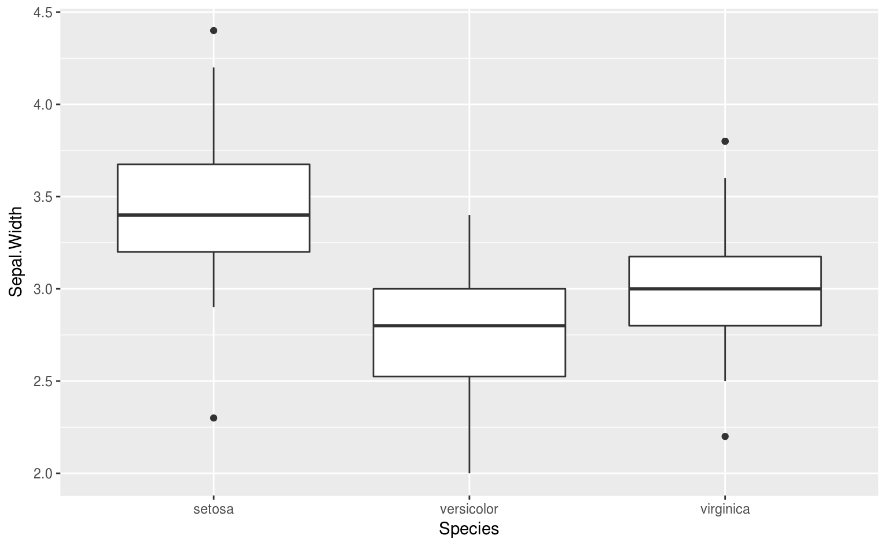

# Temas selectos de R {#Rintro}

<style>
  .espacio {
     margin-bottom: 1cm;
  }
</style>

<style>
  .espacio3 {
     margin-bottom: 3cm;
  }
</style>


El lenguaje de programación [R](https://cran.r-project.org) ha surgido como un avance en el desarrollo de software para análisis estadítico. Hace unos años era común el uso de productos de software proprietario, tales como [GAUSS](https://www.aptech.com/), [RATS](https://estima.com/ratsmain.shtml), [EVIEWS](http://www.eviews.com/home.html), [SPSS](https://www.ibm.com/products/spss-statistics), [SAS](https://www.sas.com/es_mx/home.html), [Matlab](https://www.mathworks.com/products/matlab.html), [Minitab](http://www.minitab.com/en-us/products/minitab/), [Stata](https://www.stata.com/) y software que en principio ni siquiera es apropiado para el análisis de datos, como Microsoft Excel. Estos programas generalmente son demasiado costosos y tienen un rendimiento bajo. Si es necesario hacer un análisis más complejo, entonces los archivos se vuelven demasiado grandes y el todo el proceso se vuelve infactible.

## ¿Qué ventajas tiene R?

R es la herramienta más sobresaliente para la estadística, el análisis de datos y el aprendizaje estadístico. Es más que un paquete estadístico; es un _lenguaje de programación_, por lo que puede crear sus propios objetos, funciones y paquetes. 

Hablando de paquetes, hay más de 12,000 innovadores paquetes aportados por los usuarios, y que están disponibles en [CRAN](https://cran.r-project.org/) (The Comprehensive R Archive Network), eso sin mencionar [Bioconductor](https://www.bioconductor.org/). Para tener una idea de qué paquetes hay disponibles, puedes leer posts en [R-bloggers](https://www.r-bloggers.com/) y ver el [](https://www.rstudio.com/products/shiny/shiny-user-showcase/). Muchos paquetes son enviados por miembros prominentes de sus respectivos campos.

Al igual que todos los programas, los programas de R documentan explícitamente los pasos de su análisis y esto facilita la reproducibilidad del análisis estadístico. Además, provee de herramientas para probar rápidamente muchas ideas y corregir fácilmente los problemas que puedan surgir. 
 
R puedes usarlo fácilmente en cualquier lugar. Es independiente de la plataforma, por lo que puede usarlo en cualquier sistema operativo. Y es gratis, por lo que puede usarlo en cualquier empleador sin tener que persuadir a su jefe para comprar una licencia.

### R es gratuito y de código abierto

R está disponible bajo una licencia de código abierto, lo que significa que cualquiera puede descargar y modificar el código. Esta libertad a menudo se conoce como la de software libre ("free as in speech"). R también está disponible de manera gratuita ("free as in beer"). En términos prácticos, esto significa que podemos descargar y usar R gratis.

Otro beneficio, aunque un poco más indirecto, es que cualquiera puede acceder al código fuente, modificarlo y mejorarlo. Como resultado, muchos programadores excelentes han contribuido con mejoras y correcciones al código de R. Por esta razón, R es muy _estable_ y _confiable_.

Cualquier libertad también tiene asociadas ciertas obligaciones. En el caso de R, estas obligaciones se describen en las condiciones de la licencia bajo la cual se publica: Licencia Pública General de GNU (GPL), Versión 2. Estas obligaciones te pertienen si solamente haces _uso_ de R. Sin embargo, si haces cambios en su código fuente R y lo _redistribuyes_, entonces estos cambios se deben poner a disposición de todos los usuarios.

### R tiene una comunidad comprometida

Muchas personas que usan R eventualmente comienzan a ayudar a los nuevos usuarios y proponen el uso de R en sus lugares de trabajo y círculos profesionales. Por ejemplo, si tienes dudas sobre algún aspecto de R, podrás encontrar ayuda en [Stack Overflow](http://www.stackoverflow.com/questions/tagged/r). [R-Ladies CDMX](https://www.meetup.com/rladiescdmx/) es parte de [R-Ladies Global](https://rladies.org/), una organización mundial que busca generar una comunidad fuerte para compartir dudas, habilidades y apoyo sobre #RStats en una comunidad con perspectiva de género.

## Flujo básico de trabajo para el análisis de datos en R.

En el análisis de datos nos interesan técnicas cuantitativas cómo: recolectar, organizar, entender, interpretar y extraer información de colecciones de datos predominantemente numéricos. Estas tareas se resumen en el proceso de análisis del siguiente diagrama:


<p class="espacio">
</p>

Primero debe __importar__ los datos en R. Esto generalmente significa llevar los datos almacenados en un archivo, una base de datos, o uan Web API, a un __data frame__ de R.

__Limpiar__ y __transformar__ los datos es necesario, para que la forma en que se almacenan los datos coincida con la semántica de los datos. En términos generales, cada columna debe ser una variable y cada rengón una observación.

La __visualización__ es una actividad fundamentalmente humana. Una buena visualización te puede mostrar cosas que no esperabas y puede ayudarte a plantear nuevas preguntas acerca de los datos. Una buena visualización también puede ayudar a determinar si se está haciendo una pregunta equivocada sobre los datos, o si es encesario recolectar más datos, o bien, obtener datos de fuentes distintas. Las visualizaciones pueden sorprenderte, pero requieren de un ser humano para interpretarlas.

Por otro lado, los __modelos__ son una herramienta para complementar las visualizaciones. Los modelos los utilizamos como un instrumento matemático y computacional para responder preguntas precisas acerca de los datos.

Por último, la __comunicación__ de los resultados es una parte absolutamente crítica para cualquier proyecto de análisis de datos. 

## Introducción a R como lenguaje de programación, y la plataforma interactiva de RStudio.

---

> Notas basadas en el material de [Teresa Ortiz](https://github.com/tereom) y [Sonia Mendizábal](https://github.com/songeo) 
> y en el libro “R for Data Science” escrito por Hadley Wickham y Garret Grolemund [@wickham2016r]. 

---

Hay cuatro cosas que necesitan para ejecutar el código en este taller: R, RStudio, una colección de paquetes de R, llamada __tidyverse__, y otros paquetes que vamos a ir instalando progresivamente. Los paquetes son la unidad fundamental del código reproducible en R. Incluyen funciones que se pueden utilizar en un ámbito general, su documentación que describe cómo usarlas y datos de ejemplo con código de ejemplo como ayuda para los usuarios.

### ¿Cómo entender R?

* Hay una sesión de R corriendo. La consola de R es la interfaz entre R y nosotros. 

* En la sesión hay objetos. Todo en R es un objeto: vectores, tablas, funciones, etc.

* Operamos aplicando funciones a los objetos y creando nuevos objetos.

### ¿Por qué R?

* R funciona en casi todas las plataformas (Mac, Windows, Linux e incluso en 
Playstation 3).

* R promueve la investigación reproducible.

* R está actualizado gracias a que tiene una activa comunidad.

* R se puede combinar con otras herramientas. R permite integrar otros lenguajes (C/C++, Java, Julia, Python) y puede interactuar con muchas fuentes de datos: bases de datos compatibles con ODBC y paquetes estadísticos.


#### Descargar R: versión 3.4.3

Sigue las instrucciones del instalador:

- OSX: <http://cran.stat.ucla.edu/bin/macosx/R-3.4.3.pkg>

- Windows: <http://cran.stat.ucla.edu/bin/windows/base/R-3.4.3-win.exe>


#### Descargar RStudio: versión 1.1.414

- OSX: <https://download1.rstudio.org/RStudio-1.1.414.dmg>

- Windows: <https://download1.rstudio.org/RStudio-1.1.414.exe>


RStudio es libre y gratis. Es un ambiente de desarrollo integrado para R: incluye una consola, un editor de texto y un conjunto de herramientas para administrar el espacio de 
trabajo cuando se  utiliza R.


<p class="espacio">
</p>

Algunos _shortcuts_ útiles en RStudio son:

**En el editor**  

* command/ctrl + enter: enviar código a la consola  
* ctrl + 2: mover el cursor a la consola

**En la consola**  

* flecha hacia arriba: recuperar comandos pasados  
* ctrl + flecha hacia arriba: búsqueda en los comandos  
* ctrl + 1: mover el cursor al editor  

**Más**

* alt + shift + k: muestra los _shortcuts_ disponibles.

<p class="espacio">
</p>

Para que el código sea __reproducible__ es importante que RStudio únicamente guarde lo relevante para hacer los cálculos, es decir, los scripts y _no los cálculos en sí_. Con tus scripts de R (y los datos), siempre podemos volver a crear las variables de ambiente. Sin embargo, es casi imposible recuperar un script únicamente a partir de tus variables de ambiente. Por lo tanto, se recomienda ampliamente configurar RStudio para que jamás guarde el ambiente en memoria.


<p class="espacio">
</p>


#### Paquetes de R 

Una de las ventajas de R es la gran comunidad que aporta al desarrollo por medio de paquetes que dan funcionalidad adicional. Esta es la mejor manera de usar R para análisis de datos.

Existen dos formas de instalar paquetes:
  
* Desde RStudio:


<p class="espacio">
</p>
  
* Desde la consola:
  

```r
install.packages('tidyverse')
```

Una vez instalados los paquetes, se cargan a la sesión de R mediante `library`. Por ejemplo, para cargar el paquete `readr` que instalamos anteriormente, hacemos:
  

```r
library('tidyverse')
print(read_csv)
#> function (file, col_names = TRUE, col_types = NULL, locale = default_locale(), 
#>     na = c("", "NA"), quoted_na = TRUE, quote = "\"", comment = "", 
#>     trim_ws = TRUE, skip = 0, n_max = Inf, guess_max = min(1000, 
#>         n_max), progress = show_progress()) 
#> {
#>     tokenizer <- tokenizer_csv(na = na, quoted_na = TRUE, quote = quote, 
#>         comment = comment, trim_ws = trim_ws)
#>     read_delimited(file, tokenizer, col_names = col_names, col_types = col_types, 
#>         locale = locale, skip = skip, comment = comment, n_max = n_max, 
#>         guess_max = guess_max, progress = progress)
#> }
#> <environment: namespace:readr>
```

Como el paquete `readr` está cargado en la sesión podemos llamar a la función `read_csv` que se usará más adelante.

**Importante**: Los paquetes se instalan una vez únicamente después de descargar una nueva versión de R. Las librerías se cargan en cada sesión de R nueva. 

<br>

<br>

#### Ayuda en R
  
Existen diferentes formas de pedir ayuda en R.

* `help.start()`: ayuda en general

* `help(fun)` o `?fun`: ayuda sobre la función *fun*

* `apropos("fun")`: lista de funciones que contiene la palabra *fun*

* `example(fun)`: muestra un ejemplo de la función *fun*
  

```r
help(read_csv)
?read_csv2
```

<br>

<br>

## Estructuras de datos

> Todo lo que existe en R es un objeto.

En R se puede trabajar con distintas estructuras de datos, algunas son de una sola dimensión y otras permiten más, como indica el siguiente diagrama:


<p class="espacio">
</p>

### Vectores

Los vectores son estructuras de datos de una dimensión. Un vector se define con la función `c()`, que _concatena_ diferentes elementos del mismo tipo, esto determina el tipo del vector.


**Nota:** En R, la asignación de un nombre al vector, o en general a cualquier objeto, se realiza con el símbolo `<-`. Se recomienda usar el shortcut  **alt -** genera `<-`.

<br>

Los vectores en R pueden ser de diferentes tipos o clases, a continuación se presentan algunos casos. En R, la clase de cada vector se extrae con la función `class()`.

*  __Vectores numéricos__:


```r
a <- c(1,2.5,3,4.5,5,6.9)
a
#> [1] 1.0 2.5 3.0 4.5 5.0 6.9
# clase del vector
class(a)
#> [1] "numeric"
```


* __Vectores lógicos__:


```r
bool <- c(T, F, TRUE, FALSE)
bool
#> [1]  TRUE FALSE  TRUE FALSE
# clase del vector
class(bool)
#> [1] "logical"
```

* __Vectores de caracteres__:


```r
fruits <- c("apple", "banana", "orange", "pineapple", "lemon", "kiwi")
fruits
#> [1] "apple"     "banana"    "orange"    "pineapple" "lemon"     "kiwi"
class(fruits)
#> [1] "character"
```

Para la manipulación de caracteres es recomendable el paquete **stringr** que permite realizar operaciones sobre este tipo de elementos. Más adelante se presenta un ejemplo.

<br>

La **selección de elementos** de un vector se realiza con **`[ ]`** para indicar la posición. A diferencia de otros lenguajes de programación las posiciones en R incian en 1.


```r
# elemento en la posición 1
fruits[1]
#> [1] "apple"
# elemento en la posición 1 y 5
fruits[c(1,5)]
#> [1] "apple" "lemon"
```

<br>

En R es posible extraer un valor del vector indexándolo con posiciones negativas:


```r
# omitir el elemento en la primera posición
fruits[-1]
#> [1] "banana"    "orange"    "pineapple" "lemon"     "kiwi"
```

<br>

Una característica particular de vectores en R, es que cada elemento puede ser nombrado. Para hacer esto se usa la función `names()`. Por ejemplo, al vector *fruits* agregemos el nombre en español de la fruta para como el nombre de cada elemento. 


```r
names(fruits) <- c('manzana', 'platano', 'naranja', 'piña', 'limón', 'kiwi')
fruits
#>     manzana     platano     naranja        piña       limón        kiwi 
#>     "apple"    "banana"    "orange" "pineapple"     "lemon"      "kiwi"
# cada elemento tiene un nombre asignado
fruits[5]
#>   limón 
#> "lemon"
```

<br>

Para eliminar los nombres asignados a cada elemento, se asigna `NULL` a los nombres del vector:


```
#> NULL
#> [1] "apple"     "banana"    "orange"    "pineapple" "lemon"     "kiwi"
```

<br>

<br>

Los tipos que pueden tener los vectores se muestran en la siguiente figura. 

<p class="espacio">
</p>


<p class="espacio">
</p>

Veamos que regresan los siguientes comandos:


```r
typeof(TRUE)
typeof(1L)
typeof(1.5)
typeof("a")
```


Cada vector tiene 3 propiedades:


```r
x <- 1:5
```

- Tipo


```r
typeof(x)
#> [1] "integer"
```

- Longitud


```r
length(x)
#> [1] 5
```

- Atributos


```r
attributes(x)
#> NULL
```


Existe la función `is.vector(x)` para determinar si un objeto es un vector:


```r
is.vector(1:3)
#> [1] TRUE
```

<br>

 
<div class="centered">
<p class="espacio">
</p>
¿Qué regresa `ìs.vector(factor(1:3))`?

(a) TRUE

(b) FALSE

(c) NA

(d) Ninguna de las anteriores

<p class="espacio3">
</p>
</div>

<br>

<br>

**Ejemplo**

Del vector de seis frutas diferentes llamado *fruits*, localiza únicamente las frutas que tengan la letra **w**.


```r
# Cargamos la librería
library(stringr)
fruits <- c("apple", "banana", "orange", "pineapple", "lemon", "kiwi")
fruits
#> [1] "apple"     "banana"    "orange"    "pineapple" "lemon"     "kiwi"
```

Esto es posible con la función `str_detect()`, que regresa un vector booleano para cada elemento del vector donde encontró el patron **w**. 


```r
str_detect(fruits, pattern = 'w')
#> [1] FALSE FALSE FALSE FALSE FALSE  TRUE
```

Ahora, seleccionamos únicamente los elementos del vector que tienen la letra **w**:


```r
# Selecciona el elemento con valor TRUE: kiwi
fruits[str_detect(fruits, pattern = 'w')]
#> [1] "kiwi"
```

<br>

#### Operaciones de vectores

En R las **operaciones de vectores** son componente a componente. 

- Sumas, multiplicaciones y potencias:

```r
# Suma del vector longitud 6 y un vector longitud 1
a <- c(1, 2.5, 3, 4.5, 5, 6.9)
b <- 1
a + b 
#> [1] 2.0 3.5 4.0 5.5 6.0 7.9
```


```r
# Multiplicaciones componente a componente misma longitud
a <- c(1, 2.5, 3, 4.5, 5, 6.9)
a*a
#> [1]  1.00  6.25  9.00 20.25 25.00 47.61
```


```r
# Multiplicaciones y potencias
a <- c(1, 2.5, 3, 4.5, 5, 6.9)
c <- (a^2 + 5)*3
c
#> [1]  18.0  33.8  42.0  75.8  90.0 157.8
```

<br>


- Comparaciones: En este tipo de operación se obtiene un vector lógico dependiendo si la condición se cumple o no. 


```r
# Comparar el vector dado un valor específico
a > 3 
#> [1] FALSE FALSE FALSE  TRUE  TRUE  TRUE
a[a > 3] # únicamente elementos que cumple la condicion de ser mayores a 3
#> [1] 4.5 5.0 6.9
fruits != 'apple'
#> [1] FALSE  TRUE  TRUE  TRUE  TRUE  TRUE
fruits[fruits != 'apple'] # únicamente elementos que no son apple
#> [1] "banana"    "orange"    "pineapple" "lemon"     "kiwi"
```


```r
# Comparar el vector dado otro vector de la misma dimensión
x <- c(1, 2, 3, 4, 5, 6)
a == x
#> [1]  TRUE FALSE  TRUE FALSE  TRUE FALSE
a[a == x] # unicamente los elementos iguales y en la misma posición entre a y x
#> [1] 1 3 5
```

<br>

- Funciones predeterminadas: 

Algunas funciones predeterminadas del paquete básico de R son muy útiles para la manipulación de vectores y el análisis de datos. A continuación se enlistan algunasde las más comúnes:

* `length`: número de elementos en el vector

* `class`: clase del vector

* `summary`: resumen de información del vector

* `unique`: valores unicos del vector

* `table`: tabla de frecuencias para cada elemento del vector

* `sum`: suma de los elementos del vector

* `mean`: promedio de elementos del vector

* `sd`: desviación estándar de los elementos del vector

* `cumsum`: suma acumulada de elemento anterior del vector

<br>

<br>

  Aplica las funciones comúnes enlistadas antes en el vector  `x <- c(1, 2, 3, 4, 5, 6)` 

<br>

<br>

#### Otros tipos de vectores: 

Existen tipos de vectores con características importantes:

* __Secuencias__: los vectores de secuencias se pueden crear con la función `seq()` o con `:`, de la siguiente forma:


```r
# secuecia de 1 al 10 
1:10
#>  [1]  1  2  3  4  5  6  7  8  9 10
# secuecia de pares de 0 al 10 
seq(0, 10, by = 2)
#> [1]  0  2  4  6  8 10
```

<br>

* __Vectores de fechas__: se pueden hacer operaciones y algunas funciones definidas de fechas. El paquete _lubridate_ permite manejar fechas con mayor facilidad.


Se incia la secuencia el 08 de agosto de 2016 y se asigna la clase de fecha con la función `as.Date()`. Se generan en total 10 fechas `length.out = 10` y con una distancua semanal `by="1 week"`, es decir, se tiene la fecha de 10 semanas consecutivas:


```r
library(lubridate)
tenweeks <- seq( as.Date("2016-08-08"), length.out = 10,  by="1 week")
tenweeks
#>  [1] "2016-08-08" "2016-08-15" "2016-08-22" "2016-08-29" "2016-09-05"
#>  [6] "2016-09-12" "2016-09-19" "2016-09-26" "2016-10-03" "2016-10-10"
class(tenweeks)
#> [1] "Date"
```

Se pueden hacer algunas operaciones como se ejemplifica en el siguiente código.


```r
# Aumenta un día a cada fecha
tenweeks + 1
#>  [1] "2016-08-09" "2016-08-16" "2016-08-23" "2016-08-30" "2016-09-06"
#>  [6] "2016-09-13" "2016-09-20" "2016-09-27" "2016-10-04" "2016-10-11"
# Aumenta un día a cada fecha
tenweeks 
#>  [1] "2016-08-08" "2016-08-15" "2016-08-22" "2016-08-29" "2016-09-05"
#>  [6] "2016-09-12" "2016-09-19" "2016-09-26" "2016-10-03" "2016-10-10"
weekdays(tenweeks) # Día de la semana de cada fecha
#>  [1] "Monday" "Monday" "Monday" "Monday" "Monday" "Monday" "Monday"
#>  [8] "Monday" "Monday" "Monday"
```

<br>

* __Vectores de factores__: este tipo de vector es usado comúnmente para variables categóricas. En R existe la clase **factor** que se asigna con la función homónima `factor()` o `as.factor()`.

Un vector de factores tiene dos elementos importantes, *levels* o niveles y *labels* o etiquetas. Los niveles determinan las categorías únicas del vector y pueden ser etiquetadas, como se muestra en le siguiente código  para un vector de frutas. 

En este ejemplo se tienen valores de frutas repetidos, se asigna un orden de niveles específicos y etiquetas específicas para cada nivel.


```r
fruits <- c("banana", "apple", "banana", "orange", "pineapple", "lemon", "kiwi", "apple")
# Vector de caracteres a vector de factores
fruits.fac <- factor(fruits, 
                   levels = c("apple", "banana", "orange", "pineapple", "lemon", "kiwi"),
                   labels = c('manzana', 'platano', 'naranja', 'piña', 'limón', 'kiwi')
)
fruits.fac
#> [1] platano manzana platano naranja piña    limón   kiwi    manzana
#> Levels: manzana platano naranja piña limón kiwi
# Clase
class(fruits.fac)
#> [1] "factor"
# Niveles etiquetados
levels(fruits.fac)
#> [1] "manzana" "platano" "naranja" "piña"    "limón"   "kiwi"
# Niveles únicos
as.numeric(fruits.fac)
#> [1] 2 1 2 3 4 5 6 1
# Agregar un nuevo valor
fruits.fac[7] <- 'melon'
#> Warning in `[<-.factor`(`*tmp*`, 7, value = "melon"): invalid factor level,
#> NA generated
fruits.fac
#> [1] platano manzana platano naranja piña    limón   <NA>    manzana
#> Levels: manzana platano naranja piña limón kiwi
```

<br>

**Importante:** En R los vectores no pueden combinar diferentes tipos de elementos. El tipo de elementos es lo que define la clase del vector. Es por esto que en el ejemplo, al sustituir la posición 7 por *melon* se obtiene un `NA`, melón no está incluído en los niveles definidos del vector. 

Existen también los __factores ordenados__. Por ejemplo, consideremos los datos de flores de iris de Fisher:


```r
library(forcats)
iris %>% sample_n(10) %>% knitr::kable()
```

       Sepal.Length   Sepal.Width   Petal.Length   Petal.Width  Species    
----  -------------  ------------  -------------  ------------  -----------
13              4.8           3.0            1.4           0.1  setosa     
125             6.7           3.3            5.7           2.1  virginica  
89              5.6           3.0            4.1           1.3  versicolor 
24              5.1           3.3            1.7           0.5  setosa     
2               4.9           3.0            1.4           0.2  setosa     
68              5.8           2.7            4.1           1.0  versicolor 
72              6.1           2.8            4.0           1.3  versicolor 
42              4.5           2.3            1.3           0.3  setosa     
105             6.5           3.0            5.8           2.2  virginica  
109             6.7           2.5            5.8           1.8  virginica  

Este conjunto de datos multivariados fue presentado por el estadístico y biólogo británico Ronald Fisher en su artículo de 1936 "El uso de mediciones múltiples en problemas taxonómicos como un ejemplo de análisis discriminante lineal". Edgar Anderson recopiló los datos para cuantificar la variación morfológica de las flores de iris de tres especies relacionadas. Los datos fueron recolectadas en la Península de Gaspé. [@fisher1936use]

<p class="espacio">
</p>


<p class="espacio">
</p>

El conjunto de datos consiste de 50 observaciones de _cada_ una de las tres especies de Iris (Iris setosa, Iris virginica e Iris versicolor). Se midieron cuatro características de cada muestra: la longitud y el ancho de los sépalos y pétalos, en centímetros. Con base en la combinación de estas cuatro características, Fisher desarrolló un modelo discriminante lineal para distinguir las especies entre sí.

Supongamos que queremos analizar la distribución del ancho del sépalo por especie de flor de iris:



Esto ocurre porque los factores están ordenados alfabéticamente:


```r
levels(iris$Species)
#> [1] "setosa"     "versicolor" "virginica"
```


Sería mejor que las especies estuvieran _ordenadas_ por la mediana de la distribución para poder hacer mejores comparaciones. Notemos el uso de la función `fct_reorder` del paquete `forcats`.


```r
library(forcats)
iris$Species_ord <- fct_reorder(iris$Species, iris$Sepal.Width, fun = median)
levels(iris$Species_ord)
#> [1] "versicolor" "virginica"  "setosa"
```


### Data Frames

Un __data.frame__ es un conjunto de vectores del mismo tamaño agrupado en una tabla. Son estructuras rectangulares donde cada columna tiene elementos de la misma clase, pero columnas distintas pueden tener diferentes clases.

Por ejemplo:


```r
tabla <- data.frame(
n = 1:6,
frutas = fruits[1:6], 
valor = c(1, 2.5, 3, 4.5, 5, 6.9)
)
tabla
#>   n    frutas valor
#> 1 1    banana   1.0
#> 2 2     apple   2.5
#> 3 3    banana   3.0
#> 4 4    orange   4.5
#> 5 5 pineapple   5.0
#> 6 6     lemon   6.9
```

Similar a las funciones de vectores, en _data.frames_ existen funciones predeterminadas que ayudan a su manipulación.

* `head` permite ver los primeros 6 elemento del data.frame:


```r
head(mtcars)
#>                    mpg cyl disp  hp drat   wt qsec vs am gear carb
#> Mazda RX4         21.0   6  160 110 3.90 2.62 16.5  0  1    4    4
#> Mazda RX4 Wag     21.0   6  160 110 3.90 2.88 17.0  0  1    4    4
#> Datsun 710        22.8   4  108  93 3.85 2.32 18.6  1  1    4    1
#> Hornet 4 Drive    21.4   6  258 110 3.08 3.21 19.4  1  0    3    1
#> Hornet Sportabout 18.7   8  360 175 3.15 3.44 17.0  0  0    3    2
#> Valiant           18.1   6  225 105 2.76 3.46 20.2  1  0    3    1
```

* `str` describe el tipo de variables en el data.frame:


```r
str(mtcars)
#> 'data.frame':	32 obs. of  11 variables:
#>  $ mpg : num  21 21 22.8 21.4 18.7 18.1 14.3 24.4 22.8 19.2 ...
#>  $ cyl : num  6 6 4 6 8 6 8 4 4 6 ...
#>  $ disp: num  160 160 108 258 360 ...
#>  $ hp  : num  110 110 93 110 175 105 245 62 95 123 ...
#>  $ drat: num  3.9 3.9 3.85 3.08 3.15 2.76 3.21 3.69 3.92 3.92 ...
#>  $ wt  : num  2.62 2.88 2.32 3.21 3.44 ...
#>  $ qsec: num  16.5 17 18.6 19.4 17 ...
#>  $ vs  : num  0 0 1 1 0 1 0 1 1 1 ...
#>  $ am  : num  1 1 1 0 0 0 0 0 0 0 ...
#>  $ gear: num  4 4 4 3 3 3 3 4 4 4 ...
#>  $ carb: num  4 4 1 1 2 1 4 2 2 4 ...
```

* `dim` muestra la dimensión (renglones, columnas) del data.frame:


```r
dim(mtcars)
#> [1] 32 11
```

* `colnames` y `names` muestran los nombres de las columnas del data.frame:


```r
names(mtcars)
#>  [1] "mpg"  "cyl"  "disp" "hp"   "drat" "wt"   "qsec" "vs"   "am"   "gear"
#> [11] "carb"
```

* `rownames` muestra el nombre de los renglones del data.frame:


```r
rownames(mtcars)
#>  [1] "Mazda RX4"           "Mazda RX4 Wag"       "Datsun 710"         
#>  [4] "Hornet 4 Drive"      "Hornet Sportabout"   "Valiant"            
#>  [7] "Duster 360"          "Merc 240D"           "Merc 230"           
#> [10] "Merc 280"            "Merc 280C"           "Merc 450SE"         
#> [13] "Merc 450SL"          "Merc 450SLC"         "Cadillac Fleetwood" 
#> [16] "Lincoln Continental" "Chrysler Imperial"   "Fiat 128"           
#> [19] "Honda Civic"         "Toyota Corolla"      "Toyota Corona"      
#> [22] "Dodge Challenger"    "AMC Javelin"         "Camaro Z28"         
#> [25] "Pontiac Firebird"    "Fiat X1-9"           "Porsche 914-2"      
#> [28] "Lotus Europa"        "Ford Pantera L"      "Ferrari Dino"       
#> [31] "Maserati Bora"       "Volvo 142E"
```


* La forma de indexar data.frames es similar a la de un vector __`[ ]`__, pero en este caso es posible indexar renglones y columnas:


```r
# por posiciones de renglones
mtcars[1:4, ]
#>                 mpg cyl disp  hp drat   wt qsec vs am gear carb
#> Mazda RX4      21.0   6  160 110 3.90 2.62 16.5  0  1    4    4
#> Mazda RX4 Wag  21.0   6  160 110 3.90 2.88 17.0  0  1    4    4
#> Datsun 710     22.8   4  108  93 3.85 2.32 18.6  1  1    4    1
#> Hornet 4 Drive 21.4   6  258 110 3.08 3.21 19.4  1  0    3    1
# por posiciones de columnas
mtcars[1:4, c(1, 4, 6)]
#>                 mpg  hp   wt
#> Mazda RX4      21.0 110 2.62
#> Mazda RX4 Wag  21.0 110 2.88
#> Datsun 710     22.8  93 2.32
#> Hornet 4 Drive 21.4 110 3.21
# por nombre de renglones específico
mtcars[c('Mazda RX4', 'Mazda RX4 Wag'), ]
#>               mpg cyl disp  hp drat   wt qsec vs am gear carb
#> Mazda RX4      21   6  160 110  3.9 2.62 16.5  0  1    4    4
#> Mazda RX4 Wag  21   6  160 110  3.9 2.88 17.0  0  1    4    4
mtcars[str_detect(rownames(mtcars), "Mazda" ), ]
#>               mpg cyl disp  hp drat   wt qsec vs am gear carb
#> Mazda RX4      21   6  160 110  3.9 2.62 16.5  0  1    4    4
#> Mazda RX4 Wag  21   6  160 110  3.9 2.88 17.0  0  1    4    4
```

* También se puede seleccionar o filtrar el data.frame dado una condición:


```r
mtcars[mtcars$cyl == 6, ] # Selecciona los carros con número de cilindros mayor a 6
#>                 mpg cyl disp  hp drat   wt qsec vs am gear carb
#> Mazda RX4      21.0   6  160 110 3.90 2.62 16.5  0  1    4    4
#> Mazda RX4 Wag  21.0   6  160 110 3.90 2.88 17.0  0  1    4    4
#> Hornet 4 Drive 21.4   6  258 110 3.08 3.21 19.4  1  0    3    1
#> Valiant        18.1   6  225 105 2.76 3.46 20.2  1  0    3    1
#> Merc 280       19.2   6  168 123 3.92 3.44 18.3  1  0    4    4
#> Merc 280C      17.8   6  168 123 3.92 3.44 18.9  1  0    4    4
#> Ferrari Dino   19.7   6  145 175 3.62 2.77 15.5  0  1    5    6
```


* `rbind` permite unir dos data.frames por renglones, si y solo si, tiene el mismo número de columnas:


```r
rbind(mtcars[str_detect(rownames(mtcars), "Mazda" ), ],
      mtcars[str_detect(rownames(mtcars), "Hornet"), ])
#>                    mpg cyl disp  hp drat   wt qsec vs am gear carb
#> Mazda RX4         21.0   6  160 110 3.90 2.62 16.5  0  1    4    4
#> Mazda RX4 Wag     21.0   6  160 110 3.90 2.88 17.0  0  1    4    4
#> Hornet 4 Drive    21.4   6  258 110 3.08 3.21 19.4  1  0    3    1
#> Hornet Sportabout 18.7   8  360 175 3.15 3.44 17.0  0  0    3    2
```

* `cbind` permite unir dos data.frames por columna, si y solo si, tiene el mismo número de renglones:


```r
tabla <- data.frame(
n = 1:6,
frutas = c("apple", "banana", "orange", "pineapple", "lemon", "apple"), 
valor = runif(6)
)
tabla
#>   n    frutas  valor
#> 1 1     apple 0.8746
#> 2 2    banana 0.1749
#> 3 3    orange 0.0342
#> 4 4 pineapple 0.3204
#> 5 5     lemon 0.4023
#> 6 6     apple 0.1957
tabla.color <-  data.frame(
peso = rnorm(6),
color =   c('rojo', 'amarillo', 'naranje', 'amarillo', 'amarillo', 'rojo')
)
tabla.color
#>     peso    color
#> 1 -0.244     rojo
#> 2 -0.283 amarillo
#> 3 -0.554  naranje
#> 4  0.629 amarillo
#> 5  2.065 amarillo
#> 6 -1.631     rojo
cbind(tabla, tabla.color)
#>   n    frutas  valor   peso    color
#> 1 1     apple 0.8746 -0.244     rojo
#> 2 2    banana 0.1749 -0.283 amarillo
#> 3 3    orange 0.0342 -0.554  naranje
#> 4 4 pineapple 0.3204  0.629 amarillo
#> 5 5     lemon 0.4023  2.065 amarillo
#> 6 6     apple 0.1957 -1.631     rojo
```


**Nota:** Una forma de seleccionar una columna es con el símbolo **$** (pesitos) y el nombre de la columna.

<br>

<br>

  `Ejercicio`: Del data.frame **mtcars** realiza lo siguiente:

1. Calcula el promedio de cilindros _cyl_ en los datos.

2. Calcula el número de autos con peso _wt_ mayor a 2.

3. Extrae la información de los coches _Merc_.

4. Calcula el promedio de millas por galón _mpg_ de los autos _Merc_.


<br>


### Listas

La lista es una estructura de datos de una dimensión que permite distintas clases de elementos en el objeto. La función `list()` permite crear objetos de esta clase. Por ejemplo:


```r
lista <- list( n = 100, x = 'hello', 
             frutas = fruits, tabla = tabla, 
             ejemlista = list(a = 15:20, b = 1:5)
)
lista
#> $n
#> [1] 100
#> 
#> $x
#> [1] "hello"
#> 
#> $frutas
#> [1] "banana"    "apple"     "banana"    "orange"    "pineapple" "lemon"    
#> [7] "kiwi"      "apple"    
#> 
#> $tabla
#>   n    frutas  valor
#> 1 1     apple 0.8746
#> 2 2    banana 0.1749
#> 3 3    orange 0.0342
#> 4 4 pineapple 0.3204
#> 5 5     lemon 0.4023
#> 6 6     apple 0.1957
#> 
#> $ejemlista
#> $ejemlista$a
#> [1] 15 16 17 18 19 20
#> 
#> $ejemlista$b
#> [1] 1 2 3 4 5
```

La lista anterior contiene numeros, caracteres, vectores, data.frames e incluso otra lista con distintas secuencias.

Se puede indexar una lista de varias formas: 

- Usando **`[ ]`**: extrae el objeto como una lista, incluyendo el nombre asignado:


```r
lista[1]
#> $n
#> [1] 100
```

- Usando **`[[ ]]`**: extrae únicamente el objeto respetando la clase de éste y sin incluir nombres:


```r
lista[[1]]
#> [1] 100
```

- Usando **$** mas el nombre: extrae únicamente el objeto:


```r
lista$ejemlista$a
#> [1] 15 16 17 18 19 20
```

<br>

## R Markdown

R Markdown es un sistema para crear documentos, en los cuales se combina tu código de R, los resultados y el texto que escribes como comentario en forma de prosa. 

Algunas ventajas y características de R Markdown son:

* cualquier R markdown __Rmd__ es totalmente reproducible

* admite docenas de formatos de salida, como archivos PDF, Word, presentaciones de diapositivas y más.

* es muy útil para los tomadores de decisiones, quienes quieren enfocarse en las conclusiones, no en el código detrás del análisis.

* permite colaborar con otras personas de estadística que estén interesadas en tus conclusiones y cómo llegaste a ellas

### ¿Qué es R Markdown?

R Markdown integra código de R, comandos de TeX y muchas herramientas externas. Cuando construyes el documento, R Markdown envía un archivo con formato .Rmd a otro paquete llamado **knitr**, [http://yihui.name/knitr/](http://yihui.name/knitr/), que ejecuta el código de todos los chunks y crea un nuevo archivo de **markdown** con formato _md_ que ya incluye el código y los resultados. Este archivo de markdown generado por knitr después es procesado por **pandoc**, [http://pandoc.org/](http://pandoc.org/), que es el que crea el archivo final. La ventaja de este flujo de trabajo de dos pasos es que te permite crear una amplia gama de formatos de salida.


<p class="espacio">
</p>

### Estructura básica de R Markdown

Éste es un R Markdown, un archivo de texto sin formato que tiene la extensión `.Rmd`:


```r
cat(htmltools::includeText("rmarkdown/ejemplo.Rmd"))
#> ---
#> title: "Ejemplo de R Markdown"
#> date: 2018-01-22
#> output: html_document
#> ---
#> 
#> Veamos unos datos de diamantes para analizar la distribución
#> del quilataje de aquellos diamantes que tiene quilataje 
#> menor a 2.5: 
#> 
#> ```{r setup, include = FALSE}
#> library(ggplot2)
#> library(dplyr)
#> 
#> smaller <- diamonds %>% 
#>   filter(carat <= 2.5)
#> ```
#> 
#> En el __chunk__ de arriba se hizo el filtro adecuado, ahora
#> veamos una muestra de tamaño 10 de los datos:
#> 
#> ```{r, echo = FALSE}
#> smaller %>%
#>   sample_n(10) %>%
#>   knitr::kable()
#> ```
#> 
#> Los datos corresponde a `r nrow(diamonds)` diamantes. Solamente
#> `r nrow(diamonds) - nrow(smaller)` son de más de 2.5 quilates.
#> La distribución de los diamantes de menor quilataje se muestra abajo:
#> 
#> ```{r, echo = FALSE}
#> smaller %>% 
#>   ggplot(aes(carat)) + 
#>   geom_freqpoly(binwidth = 0.01)
#> ```
```

Contiene tres tipos importantes de contenido:

1 Un encabezado en formato __YAML__ rodeado por `---`s..

2. __Chunks__ de código de R rodeados por  ```` ``` ````.

3. Texto mezclado con formato de texto simple como `# heading` y `_italics_`.

Cuando abres un `.Rmd`, RStudio muestra una interfaz de tipo _notebook_ en la cual tanto el código como la salida están intercalados. Puedes ejecutars cada _chunk_ de código presionando el botón de "Run" (en la parte superior derecha de la ventana de script), o bien, Cmd/Ctrl + Shift + Enter. RStudio ejecuta el código y muestra los resultados junto con el código.

Para generar un informe completo que contenga todo el texto, el código y los resultados, presiona el botón "Knit", o bien, Cmd/Ctrl + Shift + K. Esto generará un reporte en una nueva ventana y creará un archivo HTML independiente que podrás compartir con los demás.


Para comenzar con tu propio archivo `.Rmd`, selecciona _File > New File > R Markdown..._ en la barra superior. RStudio te mostrará un asistente que puedes usar para crear un archivo de R Markdown con ejemplos básicos.

Como R Markdown integara varias herramientas, entonces no es posible que la ayuda esté autocontenida en RStudio. Esto significa que gran parte de la ayuda no la podrás encontrar a través de `?`. Hay mucha documentación en línea y un recurso es particularmente útil son los _cheatsheets_ de RStudio, que están disponibles en [http://rstudio.com/cheatsheets.](http://rstudio.com/cheatsheets)


## Proyectos de RStudio

Los proyectos de RStudio son útiles para mantener juntos todos los archivos asociados a un análisis (o proyecto) específico: datos de entrada, scripts de R, resultados, gráficas, datos de salida. Ésta es una práctica limpia y ordenada de trabajar y RStudio tiene soporte integrado para esto a través de los _proyectos_.


Hagamos un proyecto. Para esto debes presionar _File > New Project_, luego:


<br>

Puedes cerrar el proyecto y después hacer doble click en el archivo `.Rproj` para volver a abrir el proyecto. Observa que regresas a donde estabas, en el mismo directorio de trabajo, con el mismo historial de comandos, y todos los archivos en los que estaba trabajando siguen abiertos.

En resumen, los proyectos de RStudio te brindan un flujo de trabajo sólido que te servirá en el futuro:

- Creas un proyecto de RStudio para cada proyecto de análisis de datos.

- Mantienes los archivos de datos ahí mismo para después cargarlos en un script.

- Mantienes tus scripts organizados en el mismo directorio, y los puedes encontrar fácilmente para editarlos y ejecutarlos.

- Puedes guardar ahí mismo las salidas del código, como gráficas y datos limpios.

- Solamente utilizas rutas relativas, no absolutas.

Todo lo que necesitas está en un solo lugar y separado de los demás proyectos en los que estés trabajando.

## Otros aspectos importantes de R

### Valores faltantes

En R los datos faltantes se expresan como `NA`. La función `is.na()` regresa un vector lógico sobre los valores que son o no `NA`.


```r
is.na(c(4, 2, NA))
#> [1] FALSE FALSE  TRUE
```

\BeginKnitrBlock{comentario}<div class="comentario">El default de R es propagar los valores faltantes, esto es, si se desconoce el valor de una de las componentes de un vector, también se desconoce la suma del mismo, en general, cualquier operación.</div>\EndKnitrBlock{comentario}


```r
sum(c(4, 2, NA))
#> [1] NA
```


```r
mean(c(4, 2, NA))
#> [1] NA
```


```r
3 > NA
#> [1] NA
```


```r
(NA == NA)
#> [1] NA
```

Sin embargo, muchas funciones tienen un argumento `na.rm` para removerlos. 

```r
sum(c(4, 2, NA), na.rm = T)
#> [1] 6
mean(c(4, 2, NA), na.rm = T)
#> [1] 3
```

<br>

---

### Funciones

> Todo lo que sucede en R es una función.

R es un _lenguaje de programación funcional_. Es decir, proporciona muchas herramientas para la creación y manipulación de funciones.

En R las funciones, al igual que los vectores, se pueden asignar a variables, guardarlas en listas, usarlas como argumentos en otras funciones, crearlas dentro de otras funciones, e incluso regresar como resultado de una función más funciones.

#### Una caja negra {-}

\BeginKnitrBlock{information}<div class="information">Una función puede verse como una caja negra que realiza un proceso o serie de instrucciones condicionadas a un valor de entrada, y cuyo resultado es un valor de salida. </div>\EndKnitrBlock{information}


En R existen algunas funciones pre cargadas que ya hemos usado, por ejemplo, .la función `mean()`.


```r
input <- c(1:5)
output <- mean( input )
output
#> [1] 3
```


Sin embargo, también es posible escribir nuestras propias funciones. 

<br>

#### Escibir una función {-}

En R es posible escribir funciones y es muy recomendable para dar soluciones a problemas simples. 

Existen ocasiones en las que al programar copias y pegas cierto código varias veces para una meta en especial. En ese momento, es necesario pasar el código a una función. 


\BeginKnitrBlock{nota}<div class="nota">Una función soluciona un problema en particular. </div>\EndKnitrBlock{nota}

La función `function()` nos permite crear funciones con la siguiente estructura:


```r
my_fun <- function( arg1 ){
  
  body
  
  return()
}
```


\BeginKnitrBlock{warning}<div class="warning">En general, esta estructura se respeta en las funciones predeterminadas de R.</div>\EndKnitrBlock{warning}

Creamos una función que sume uno a cualquier número. 


```r
suma_uno_fun <- function( x ){
   y = x + 1
   return(y)
}
```

Aplicamos la función:


```r
suma_uno_fun(5)
#> [1] 6
```

Podemos ver que en nuestra sesión ya existe la función con la función `ls()`. 

```r
ls()
#>  [1] "a"            "b"            "bool"         "c"           
#>  [5] "fruits"       "fruits.fac"   "input"        "iris"        
#>  [9] "lista"        "output"       "suma_uno_fun" "tabla"       
#> [13] "tabla.color"  "tenweeks"     "x"
```

Esta función en lista los objetos existente en la sesión actual.

<br>

#### Argumentos de funciones {-}

En R los argumentos de las funciones pueden llamarse por **posición** o **nombre**. Consideremos la siguiente función en la que se eleva un numero a un exponente determinado.


```r
potencia_fun <- function(base, exponente){
  base^exponente
}
```

Los argumentos pueden indicarse por posición:

```r
potencia_fun(2, 3)
#> [1] 8
```

O bien por nombre:

```r
potencia_fun(exponente = 2, base = 3)
#> [1] 9
```

<br> 

#### Argumentos predeterminados {-}

En una función es posible asignar valores predeterminados a los argumentos.

Por ejemplo, modificamos la función para asignar un valor predeterminado del exponente.

```r
potencia_default_fun <- function(base, exponente = 2){
  base^exponente
}
```

Al llamar la función, no es necesario definir un valor para el exponente y en automático tomará el valor `exponente = 2`.


```r
potencia_default_fun(2)
#> [1] 4
```

<br>

#### Argumentos nulos {-}

Una función puede no tener argumentos y simplemente correr un proceso. 

En este caso, usaremos la función `sample()` que elige una muestra aleatoria de tamaño 1 de un vector de 1 a 6 imitando un dado dentro la la función `lanza_dado()`.

```r
lanza_dado <- function() {
  numero <- sample(1:6, size = 1)
  numero
}
```

Ahora tiraremos dos veces los dados.

**Primer lanzamiento:**


```r
lanza_dado()
#> [1] 5
```

**Segundo lanzamiento:**


```r
lanza_dado()
#> [1] 5
```

---

<br>

#### Alcance de la función {-}

Es importante mencionar que las variables que son definidas dentro de la función no son accesibles fuera de la función. Es decir, las funciones en R tienen un **ambiente local**.

Por ejemplo, al correr la siguiente función e intentar imprimir el objeto `x` regresa un error.


```r
xs_fun <- function(a){
  x <- 2
  a*x
}
xs_fun(2)
#> [1] 4
# print(x)
```

La función crea un ambiente nuevo dentro de la misma, en caso de no encontrar el valor de la variable en el ambiente local, **sube un nivel**. 

Este nuevo nivel puede ser el ambiente global. Por ejemplo:


```r
y <- 10
ys_fun <- function(a){
  a*y
}
ys_fun(2)
#> [1] 20
```

Si la función está contenida en otra función, primero buscará en el ambiente local, después en el ambiente local de la función superior y luego en el ambiente global.

Por ejemplo:


```r
y <- 10
mas_uno_fun <- function(a){
  c <- 1
  y <- 1
  ys_add_fun <- function(a){
    a*y + c
  }
  ys_add_fun(a)
}
```

Si llamamos la función con un valor `a = 2` al igual que en el ejemplo anterior, ¿por qué da el siguiente resultado y no 21 o 20?


```r
mas_uno_fun(a = 2)
#> [1] 3
```

<br>

---

#### Funciones para funciones {-}

O bien funciones para entender las partes de la función. 

- `body()`

```r
body(suma_uno_fun)
#> {
#>     y = x + 1
#>     return(y)
#> }
```

- `args()`

```r
args(mean.default)
#> function (x, trim = 0, na.rm = FALSE, ...) 
#> NULL
```

- `if()`
Una función que se usa al programar funciones es `if()` que permite agregar una condición. 


```r
divide_fun <- function(num, den){
  if(den == 0){
    return("Denominador es cero")
  }else{
    return(num/den)
  }
}
```

Al ejecutar la función y tener cero en el denominador imprime el string.


```r
divide_fun(10, 0)
#> [1] "Denominador es cero"
```

Al no tener cero en el denominador la operación se ejecuta.


```r
divide_fun(10, 2)
#> [1] 5
```

<br>

---

<br>

Todas las operaciones en R son producto de la llamada a una función, esto incluye operaciones como +, operadores que controlan flujo como for, if y while, e incluso operadores para obtener subconjuntos como `[ ]` y `$`.


```r
x <- 3
y <- 4
`+`(x, y)
#> [1] 7
```


```r
for (i in 1:2) print(i)
#> [1] 1
#> [1] 2
```


```r
`for`(i, 1:2, print(i))
#> [1] 1
#> [1] 2
```

<br>

Cuando llamamos a una función podemos especificar los argumentos con base en la posición, el nombre completo o el nombre parcial:


```r
f <- function(abcdef, bcde1, bcde2) {
  list(a = abcdef, b1 = bcde1, b2 = bcde2)
}
str(f(1, 2, 3))
#> List of 3
#>  $ a : num 1
#>  $ b1: num 2
#>  $ b2: num 3
```


```r
str(f(2, 3, abcdef = 1))
#> List of 3
#>  $ a : num 1
#>  $ b1: num 2
#>  $ b2: num 3
```

<br>

Podemos abreviar el nombre de los argumentos:


```r
str(f(2, 3, a = 1))
#> List of 3
#>  $ a : num 1
#>  $ b1: num 2
#>  $ b2: num 3
```

Siempre y cuando la abreviación no sea ambigua:


```r
#f(1, 3, b = 1)
```

Los argumentos de las funciones en R se evaluan conforme se necesitan:


```r
f <- function(a, b){
  a ^ 2
}
f(2)
#> [1] 4
```

La función anterior nunca utiliza el argumento b, de tal manera que f(2) no produce ningún error.

<br>

### Funcionales

La familia de funciones **apply** pertenece a la librería `base` en R y facilitan la manipulación de datos de forma repetitiva.

Las funciones de esta familia son: `apply()`, `lapply()`, `sapply()`, `vapply()`, `mapply()`, `rapply()`, y `tapply()`.

\BeginKnitrBlock{comentario}<div class="comentario">La estructura de los datos de entrada y el formato del resultado o salida determinarán cual función usar. </div>\EndKnitrBlock{comentario}

En este taller solo se verán las primeras tres funciones. 

---

#### apply() {-}

Esta es la función que manipula arreglos homogéneos, en particular, se revisa el caso de matrices que son arreglos de dos dimensiones.

La función tiene los siguientes argumentos: `apply(X, MARGIN, FUN, ...)`

- `X` representa el arreglo de dos dimensiones.

- `MARGIN` representa la dimensión sobre la que se va a resumir la información. Donde **1 = renglon o primera dimensión** y **2 = columna o segunda dimensión**.

- `FUN` representa la función que resume la información.

Tomemos la siguiente matriz de simulaciones:


```r
set.seed(1)
mat_norm <- matrix(rnorm(24, mean = 0, sd = 1), nrow = 4, ncol = 6)
mat_norm
#>        [,1]   [,2]   [,3]    [,4]    [,5]    [,6]
#> [1,] -0.626  0.330  0.576 -0.6212 -0.0162  0.9190
#> [2,]  0.184 -0.820 -0.305 -2.2147  0.9438  0.7821
#> [3,] -0.836  0.487  1.512  1.1249  0.8212  0.0746
#> [4,]  1.595  0.738  0.390 -0.0449  0.5939 -1.9894
```

<br>

**Deseamos obtener la suma de cada columna de la matriz.**

<br>

El primer método, quizá el mas intuitivo en este momento, es obtener cada elemento o columna, aplicar la función a cada elemento y concatenar:


```r
prom_col_m1 <- c(sum(mat_norm[, 1]), 
                 sum(mat_norm[, 2]), 
                 sum(mat_norm[, 3]), 
                 sum(mat_norm[, 4]),
                 sum(mat_norm[, 5]),
                 sum(mat_norm[, 6]))
prom_col_m1
#> [1]  0.317  0.735  2.172 -1.756  2.343 -0.214
```

Segundo método:


```r
prom_col_m2 <- vector( length = ncol(mat_norm))
for(j in 1:ncol(mat_norm)){
  prom_col_m2[j] <- sum(mat_norm[, j])
}
prom_col_m2
#> [1]  0.317  0.735  2.172 -1.756  2.343 -0.214
```

Tercer método:


```r
prom_col_m3 <- apply(X = mat_norm, MARGIN = 2, FUN = sum)
prom_col_m3
#> [1]  0.317  0.735  2.172 -1.756  2.343 -0.214
```

Cuarto método:


```r
prom_col_m4 <- colSums(mat_norm)
prom_col_m4
#> [1]  0.317  0.735  2.172 -1.756  2.343 -0.214
```

<br>

Ahora, para obtener la suma por renglón usando el tercer método de la función `apply()`, únicamente es necesario cambiar la dimensión sobre la que voy a resumir con el argumento `MARGIN = 1`.


```r
prom_row_m3 <- apply(mat_norm, 1, sum)
prom_row_m3
#> [1]  0.56 -1.43  3.18  1.28
```

Esto es equivalente al primer método que usamos:


```r
prom_row_m1 <- c(sum(mat_norm[1, ]), 
                 sum(mat_norm[2, ]), 
                 sum(mat_norm[3, ]), 
                 sum(mat_norm[4, ]))
prom_row_m1
#> [1]  0.56 -1.43  3.18  1.28
```


La ventaja de usar la función `apply()` es que se puede usar cualquier función. Por ejemplo, obtener la desviación estándar.


```r
apply(mat_norm, 1, sd)
#> [1] 0.634 1.172 0.834 1.207
```


O bien, una crear una función propia (definida por el usuario) con la función `function()`:


```r
cv_vec_m3 <- apply(mat_norm, 1, function(reng){
  cv <- mean(reng)/sd(reng)
  return(cv)
})
cv_vec_m3
#> [1]  0.147 -0.204  0.636  0.177
```

\BeginKnitrBlock{nota}<div class="nota">**Funciones Anónimas:**

A este tipo de funciones se les llama
**funciones anónimas** porque no se nombran ni guardan en
el ambiente de R
y únicamente funcionan dentro del
comando que las llama.</div>\EndKnitrBlock{nota}

---

#### lapply() {-}

La función `lapply()` aplica una función sobre una lista o un vector y regresa el resultado en otra lista.

Vector de ciudades:

```r
ciudades_vec <- c("Aguascalientes", "Monterrey", "Guadalajara", "México")
ciudades_vec
#> [1] "Aguascalientes" "Monterrey"      "Guadalajara"    "México"
```


```r
res_nchar_l <- lapply(ciudades_vec, nchar)
res_nchar_l
#> [[1]]
#> [1] 14
#> 
#> [[2]]
#> [1] 9
#> 
#> [[3]]
#> [1] 11
#> 
#> [[4]]
#> [1] 6
```


\BeginKnitrBlock{comentario}<div class="comentario">Esta función permite implementar funciones que regresen objetos de diferentes tipos, porque la listas permiten almacenar contenido heterogéneo.</div>\EndKnitrBlock{comentario}

<br>

La función `lapply()` permite incluir argumentos de las funciones que implementa. Estos argumentos se incluyen dentro de `lapply()` después de la función a implementar.

Por ejemplo, usamos la función potencia que se creó antes.


```r
potencia_fun <- function(base, exponente){
  base^exponente
}
```

El objetivo es aplicar a cada elemento de la  siguiente lista la función potencia y elevarlo al cubo.


```r
nums_lista <- list(1, 3, 4)
nums_lista
#> [[1]]
#> [1] 1
#> 
#> [[2]]
#> [1] 3
#> 
#> [[3]]
#> [1] 4
```

En la función `lapply()` se agrega el argumento `exponente = 3` como último argumento.


```r
potencia_lista <- lapply(nums_lista, potencia_fun, exponente = 3)
potencia_lista
#> [[1]]
#> [1] 1
#> 
#> [[2]]
#> [1] 27
#> 
#> [[3]]
#> [1] 64
```


Una forma de reducir la lista obtenida a un vector es con la función `unlist()` que vimos antes.


```r
unlist(potencia_lista)
#> [1]  1 27 64
```

<br>

---

#### sapply() {-}

La función `sapply()` es muy similar a `lapply()`. La única diferencia es la **s** que surge de **simplified apply**. 

Al igual que `lapply()` aplica una función sobre una lista o un vector pero simplifica el resultado en un arreglo.


```r
res_nchar_s <- sapply(ciudades_vec, nchar)
res_nchar_s
#> Aguascalientes      Monterrey    Guadalajara         México 
#>             14              9             11              6
```

\BeginKnitrBlock{warning}<div class="warning">Esta función es *peligrosa* ya que únicamente simplifica la estructura del resultado cuando es posible, de lo contrario, regresará una lista igual que `lapply()`.</div>\EndKnitrBlock{warning}

#### Funciones `map`

Un problema con `sapply()` y `lapply()` es que puedes no tener control sobre el _tipo_ que obtienes y esto es importante si el código está dentro de una función:


```r
x1 <- list(
  c(0.27, 0.37, 0.57, 0.91, 0.20),
  c(0.90, 0.94, 0.66, 0.63, 0.06), 
  c(0.21, 0.18, 0.69, 0.38, 0.77)
)
x2 <- list(
  c(0.50, 0.72, 0.99, 0.38, 0.78), 
  c(0.93, 0.21, 0.65, 0.13, 0.27), 
  c(0.39, 0.01, 0.38, 0.87, 0.34)
)

threshold <- function(x, cutoff = 0.8) x[x > cutoff]
x1 %>% sapply(threshold) %>% str()
#> List of 3
#>  $ : num 0.91
#>  $ : num [1:2] 0.9 0.94
#>  $ : num(0)
```


```r
x2 %>% sapply(threshold) %>% str()
#>  num [1:3] 0.99 0.93 0.87
```

Las funciones del paquete `purrr` son útiles porque hacen que los _loops_ sobre vectores sean sencillos:

- tienen nombres similares, y 

- tienen argumentos consistentes.


Hay una función para cada tipo de salida:

* `map()` crea una lista.

* `map_lgl()` crea un vector lógico.

* `map_int()` crea un vector de enteros.

* `map_dbl()` crea un vector numérico.

* `map_chr()` crea un vector de tipo caracter.

Cada función toma un vector como entrada, aplica una función a cada elemento y luego devuelve un nuevo vector que tiene la misma longitud (y tiene los mismos nombres) que la entrada, y el tipo de vector está determinado por el sufijo de la función.

Por ejemplo, supongamos que deseamos calcular el número de valores únicos en cada columna de `iris`. Utilizamos, entonces, la función `map_int` porque deseamos obtener como resultado un vector de enteros donde cada entero represente el número de valores únicos en cada columna:


```r
map_int(.x = iris, .f = function(x){length(unique(x))
})
#> Sepal.Length  Sepal.Width Petal.Length  Petal.Width      Species 
#>           35           23           43           22            3 
#>  Species_ord 
#>            3
```

Para generar cuatro vectores cada uno de tamaño 5 de valores que provienen de una distribución normal con medias $\mu=-10, 0, 10, 100$ podemos utilizar la función `map`:


```r
mu <- list(-10, 0, 10, 100)
mu %>% 
  map(rnorm, n = 5) %>% 
  str()
#> List of 4
#>  $ : num [1:5] -9.38 -10.06 -10.16 -11.47 -10.48
#>  $ : num [1:5] 0.4179 1.3587 -0.1028 0.3877 -0.0538
#>  $ : num [1:5] 8.62 9.59 9.61 9.94 11.1
#>  $ : num [1:5] 100.8 99.8 99.7 100.7 100.6
```

Podemos usar `map2()` para iterar sobre dos vectores en paralelo:


```r
sigma <- list(1, 5, 10, 100)
map2(mu, sigma, rnorm, n = 5) %>% str()
#> List of 4
#>  $ : num [1:5] -10.69 -10.71 -9.64 -9.23 -10.11
#>  $ : num [1:5] 4.41 1.99 -3.06 1.71 -5.65
#>  $ : num [1:5] 24.33 29.804 6.328 -0.441 15.697
#>  $ : num [1:5] 86.5 340.2 96.1 169 102.8
```

Las funciones de `map` también preservan nombres:


```r
z <- list(x = 1:3, y = 4:5)
map_int(z, length)
#> x y 
#> 3 2
```

Hay algunos _shortcuts_ que podemos usar con `.f` para guardar un poco de tipeo. Supongamos que queremos ajustar un modelo lineal a cada subconjunto en un conjunto de datos. Pensemos en los datos de `mtcars` divididos en tres subconjuntos (uno para cada valor de cilindro) y se ajusta el mismo modelo lineal en cada subconjunto (millas por galón `mpg` vs peso `wt`):


```r
models <- mtcars %>% 
  split(.$cyl) %>% 
  map(~lm(mpg ~ wt, data = .))
```

Con el símbolo `~` se puede declarar una **función anónima** con un argumento al cual se hace referencia después utilizando el `.`.

Cuando vemos muchos modelos, generalmente deseamos extraer un resumen estadístico como la $R^2$. Para hacer eso necesitamos ejecutar primero `summary()` y luego extraer el componente llamado `r.squared`. Podríamos hacer eso usando la abreviatura de funciones anónimas:


```r
models %>% 
  map(summary) %>% 
  map_dbl(~.$r.squared)
#>     4     6     8 
#> 0.509 0.465 0.423
```

Pero `purrr` tiene un shortcut para extraer estos componentes en una cadena:


```r
models %>% 
  map(summary) %>% 
  map_dbl("r.squared")
#>     4     6     8 
#> 0.509 0.465 0.423
```

También se puede usar un número entero para seleccionar elementos por posición:


```r
x <- list(list(1, 2, 3), list(4, 5, 6), list(7, 8, 9))
x %>% map_dbl(2)
#> [1] 2 5 8
```

La función `pmap()` recibe una lista de argumentos para aplicarlos a una función:


```r
params <- tribble(
  ~mean, ~sd, ~n,
    5,     1,  1,
   10,     5,  3,
   -3,    10,  5
)
params %>% 
  pmap(rnorm)
#> [[1]]
#> [1] 4.26
#> 
#> [[2]]
#> [1] 10.944  0.975 17.328
#> 
#> [[3]]
#> [1]  -1.47  18.73   1.76 -10.10   3.11
```

Hay un paso más en la complejidad: además de variar los argumentos para una función, también puedes variar la función misma y para esto se usa la función `invoke_map()`:


```r
sim <- tribble(
  ~f,      ~params,
  "runif", list(min = -1, max = 1),
  "rnorm", list(sd = 5),
  "rpois", list(lambda = 10)
)
sim %>% 
  mutate(sim = invoke_map(f, params, n = 10)) %>% 
  str()
#> Classes 'tbl_df', 'tbl' and 'data.frame':	3 obs. of  3 variables:
#>  $ f     : chr  "runif" "rnorm" "rpois"
#>  $ params:List of 3
#>   ..$ :List of 2
#>   .. ..$ min: num -1
#>   .. ..$ max: num 1
#>   ..$ :List of 1
#>   .. ..$ sd: num 5
#>   ..$ :List of 1
#>   .. ..$ lambda: num 10
#>  $ sim   :List of 3
#>   ..$ : num  -0.65 0.493 -0.79 0.729 0.229 ...
#>   ..$ : num  0.372 -2.948 -2.843 -0.676 5.89 ...
#>   ..$ : int  11 10 8 13 13 12 15 11 5 10
```

### Rendimiento en R

> “We should forget about small efficiencies, say about 97% of the time: premature optimization is the root of all evil. Yet we should not pass up our opportunities in that critical 3%. A good programmer will not be lulled into complacency by such reasoning, he will be wise to look carefully at the critical code; but only after that code has been identified.” -Donald Knuth

Diseña primero, luego optimiza. La optimización del código es un proceso iterativo:

1. Encuentra el cuello de botella (más importante).

2. Intenta eliminarlo (no siempre se puede).

3. Repite hasta que tu código sea lo suficientemente rápido.


#### Diagnosticar {-}

Una vez que tienes código que se puede leer y funciona, el perfilamiento (profiling) del código es un método sistemático que nos permite conocer cuanto tiempo se esta usando en diferentes partes del programa.

Comenzaremos con la función system.time (no es perfilamiento aún), esta calcula el timepo en segundos que toma ejecutar una expresión (si hay un error, regresa el tiempo hasta que ocurre el error):


```r
library(Lahman)
Batting %>% sample_n(10) %>% knitr::kable()
```

        playerID     yearID   stint  teamID   lgID      G    AB     R     H   X2B   X3B   HR   RBI   SB   CS   BB    SO   IBB   HBP   SH   SF   GIDP
------  ----------  -------  ------  -------  -----  ----  ----  ----  ----  ----  ----  ---  ----  ---  ---  ---  ----  ----  ----  ---  ---  -----
86418   gilesma01      2005       1  ATL      NL      152   577   104   168    45     4   15    63   16    3   64   108     1     5    4    4     13
32692   weathro01      1946       1  NYA      AL        2     2     0     1     0     0    0     0    0    0    0     0    NA     0    0   NA      0
80489   tynerja01      2000       2  TBA      AL       37    83     6    20     2     0    0     8    6    1    4    12     0     1    5    1      1
27504   stephwa01      1937       1  PHI      NL       10    23     1     6     0     0    0     2    0   NA    2     3    NA     0    0   NA      1
22480   cohenan01      1928       1  NY1      NL      129   504    64   138    24     7    9    59    3   NA   31    17    NA     2   11   NA     NA
53133   lemonch01      1975       1  CHA      AL        9    35     2     9     2     0    0     1    1    0    2     6     0     0    1    0      0
27651   chapmsa01      1938       1  PHA      AL      114   406    60   105    17     7   17    63    3    4   55    94    NA     4    1   NA     NA
18626   weavebu01      1920       1  CHA      AL      151   629   102   208    34     8    2    75   19   17   28    23    NA     6   27   NA     NA
53314   perezto01      1975       1  CIN      NL      137   511    74   144    28     3   20   109    1    2   54   101     6     3    0    6     12
57859   littljo01      1980       1  SLN      NL       52    11     1     0     0     0    0     0    0    0    0     3     0     0    1    0      0


```r
system.time(lm(R ~ AB + teamID, Batting))
#>    user  system elapsed 
#>   2.849   0.068   2.917
```

- __user time__: Tiempo usado por el CPU(s) para evaluar esta expresión, tiempo que experimenta la computadora.

- __elapsed time__: tiempo en el reloj, tiempo que experimenta la persona.

El tiempo de usuario (user) usualmente es menor que el tiempo transcurrido:


```r
system.time(readLines("http://www.jhsph.edu"))
#>    user  system elapsed 
#>   0.021   0.001   2.503
```


```r
library(parallel)
system.time(mclapply(2000:2006, 
  function(x){
    sub <- subset(Batting, yearID == x)
    lm(R ~ AB, sub)
}, mc.cores = 5))
#>    user  system elapsed 
#>   0.053   0.049   0.078
```

Comparemos la velocidad de dplyr con funciones que se encuentran en R estándar y plyr.


```r
# dplyr
dplyr_st <- system.time({
  Batting %>%
  group_by(playerID) %>%
  summarise(total = sum(R, na.rm = TRUE), n = n()) %>%
  dplyr::arrange(desc(total))
})

# plyr
plyr_st <- system.time({
    Batting %>% 
    plyr::ddply("playerID", plyr::summarise, total = sum(R, na.rm = TRUE), n = length(R)) %>% 
    dplyr::arrange(-total)
})

# estándar lento
est_l_st <- system.time({
  players <- unique(Batting$playerID)
  n_players <- length(players)
  total <- rep(NA, n_players)
  n <- rep(NA, n_players)
  for(i in 1:n_players){
    sub_batting <- Batting[Batting$playerID == players[i], ]
    total[i] <- sum(sub_batting$R, na.rm = TRUE)
    n[i] <- nrow(sub_batting)
  }
  batting_2 <- data.frame(playerID = players, total = total, n = n)
  batting_2[order(batting_2$total, decreasing = TRUE), ]
})

# estándar rápido
est_r_st <- system.time({
  batting_2 <- aggregate(. ~ playerID, data = Batting[, c("playerID", "R")], sum)
  batting_ord <- batting_2[order(batting_2$R, decreasing = TRUE), ]
})

dplyr_st
#>    user  system elapsed 
#>   0.124   0.000   0.124
```


```r
plyr_st
#>    user  system elapsed 
#>   6.961   0.008   6.969
```


```r
est_l_st
#>    user  system elapsed 
#>   75.99    1.76   77.75
```


```r
est_r_st
#>    user  system elapsed 
#>   0.786   0.012   0.798
```

La función `system.time` supone que sabes donde buscar, es decir, que expresiones debes evaluar, una función que puede ser más útil cuando uno desconoce cuál es la función que alenta un programa es `Rprof()`.

Rprof es un perfilador de muestreo que registra cambios en la pila de funciones, funciona tomando muestras a intervalos regulares y tabula cuánto tiempo se lleva en cada función.


```r
Rprof("out/lm_rprof.out", interval = 0.015, line.profiling = TRUE)
mod <- lm(R ~ AB + teamID, Batting)
Rprof(NULL)
```

Usamos la función `summaryRprof para tabular las salidas de Rprof y calcular cuánto tiempo se toma en cada función.


```r
summaryRprof("out/lm_rprof.out")
#> $by.self
#>                         self.time self.pct total.time total.pct
#> "lm.fit"                     5.04    95.18       5.05     95.47
#> ".External2"                 0.16     3.12       0.20      3.68
#> "as.character"               0.04     0.85       0.04      0.85
#> "anyDuplicated.default"      0.03     0.57       0.03      0.57
#> "c"                          0.02     0.28       0.02      0.28
#> 
#> $by.total
#>                         total.time total.pct self.time self.pct
#> "<Anonymous>"                 5.29    100.00      0.00     0.00
#> "block_exec"                  5.29    100.00      0.00     0.00
#> "call_block"                  5.29    100.00      0.00     0.00
#> "do.call"                     5.29    100.00      0.00     0.00
#> "eval.parent"                 5.29    100.00      0.00     0.00
#> "eval"                        5.29    100.00      0.00     0.00
#> "evaluate_call"               5.29    100.00      0.00     0.00
#> "evaluate"                    5.29    100.00      0.00     0.00
#> "handle"                      5.29    100.00      0.00     0.00
#> "in_dir"                      5.29    100.00      0.00     0.00
#> "knitr::knit"                 5.29    100.00      0.00     0.00
#> "lm"                          5.29    100.00      0.00     0.00
#> "local"                       5.29    100.00      0.00     0.00
#> "process_file"                5.29    100.00      0.00     0.00
#> "process_group.block"         5.29    100.00      0.00     0.00
#> "process_group"               5.29    100.00      0.00     0.00
#> "timing_fn"                   5.29    100.00      0.00     0.00
#> "withCallingHandlers"         5.29    100.00      0.00     0.00
#> "withVisible"                 5.29    100.00      0.00     0.00
#> "lm.fit"                      5.05     95.47      5.04    95.18
#> ".External2"                  0.20      3.68      0.16     3.12
#> "model.matrix.default"        0.16      3.12      0.00     0.00
#> "model.matrix"                0.16      3.12      0.00     0.00
#> "as.character"                0.04      0.85      0.04     0.85
#> "model.response"              0.04      0.85      0.00     0.00
#> "anyDuplicated.default"       0.03      0.57      0.03     0.57
#> "[.data.frame"                0.03      0.57      0.00     0.00
#> "["                           0.03      0.57      0.00     0.00
#> "anyDuplicated"               0.03      0.57      0.00     0.00
#> "model.frame.default"         0.03      0.57      0.00     0.00
#> "na.omit.data.frame"          0.03      0.57      0.00     0.00
#> "na.omit"                     0.03      0.57      0.00     0.00
#> "stats::model.frame"          0.03      0.57      0.00     0.00
#> "c"                           0.02      0.28      0.02     0.28
#> 
#> $sample.interval
#> [1] 0.015
#> 
#> $sampling.time
#> [1] 5.29
```

Hay dos métodos para normalizar los datos de Rprof:

1. **by.total** divide el tiempo que se toma en cada función entre el tiempo total en correr.

2. **by.self** similar a **by.total** pero primero resta el tiempo que se toman las funciones en la cima de la pila.


```r
Rprof("out/plyr_rprof.out")
Batting %>%
    plyr::ddply("playerID", plyr::summarise, total = sum(R, na.rm = TRUE), n = length(R)) %>%
    plyr::arrange(-total) %>%
    head()
Rprof(NULL)
summaryRprof("out/plyr_rprof.out")$by.self[1:10, ]
```


```r
# Rprof("out/slow_rprof.out")
#     players <- unique(batting$playerID)
#     n_players <- length(players)
#     total <- rep(NA, n_players)
#     n <- rep(NA, n_players)
#     for(i in 1:n_players){
#       sub_batting <- batting[batting$playerID == players[i], ]
#       total[i] <- sum(sub_batting$R)
#       n[i] <- nrow(sub_batting)
#     }
#     batting_2 <- data.frame(playerID = players, total = total, n = n)
#     batting_2[order(batting_2$total, decreasing = TRUE), ]
# Rprof(NULL)

summaryRprof("out/slow_rprof.out")$by.self[1:10, ]
#>                 self.time self.pct total.time total.pct
#> "[.data.frame"      45.50    54.74      82.74     99.54
#> "=="                24.78    29.81      24.78     29.81
#> "attr"               6.70     8.06       6.70      8.06
#> "NextMethod"         3.42     4.11       3.44      4.14
#> "[["                 1.32     1.59       2.12      2.55
#> "[[.data.frame"      0.22     0.26       0.80      0.96
#> "<Anonymous>"        0.20     0.24       0.46      0.55
#> "all"                0.10     0.12       0.10      0.12
#> "sys.call"           0.10     0.12       0.10      0.12
#> "%in%"               0.08     0.10       0.22      0.26
```


#### Estrategias para mejorar desempeño {-}

1. Utilizar apropiadamente funciones de R, o funciones de paquetes que muchas veces están mejor escritas de lo que nosotros podríamos hacer.

2. Hacer lo menos posible.

3. Usar funciones vectorizadas en R (casi siempre). No hacer crecer objetos (es preferible definir su tamaño antes de operar en ellos).

4. Paralelizar.

5. La más simple y muchas veces la más barata: conseguie una máquina más grande (por ejemplo [Amazon Web Services](https://aws.amazon.com/)).


**1 Utilizar apropiadamente funciones de R**

Si el cuello de botella es la función de un paquete vale la pena buscar alternativas, CRAN task views es un buen lugar para buscar.


**2 Hacer lo menos posible**

Utiliza funciones más específicas, por ejemplo:

* rowSums(), colSums(), rowMeans() y colMeans() son más rápidas que las invocaciones equivalentes de apply().

* Si quieres checar si un vector contiene un valor any(x == 10) es más veloz que 10 %in% x, esto es porque examinar igualdad es más sencillo que examinar inclusión en un conjunto. Este conocimiento requiere que conozcas alternativas, para ello debes construir tu vocabulario, puedes comenzar por lo [básico](http://adv-r.had.co.nz/Vocabulary.html#vocabulary) e ir incrementando conforme lees código.

Otro caso es cuando las funciones son más rápidas cunado les das más información del problema, por ejemplo: 

* read.csv(), especificar las clases de las columnas con colClasses.

* factor() especifica los niveles con el argumento levels.

**3.1 Usar funciones vectorizadas en R**

Es común escuchar que en R vectorizar es conveniente, el enfoque vectorizado va más allá que evitar ciclos for:

* Pensar en objetos, en lugar de enfocarse en las compoentes de un vector, se piensa únicamente en el vector completo.
  
* Los ciclos en las funciones vectorizadas de R están escritos en C, lo que los hace más veloces.

Las funciones vectorizadas programadas en R pueden mejorar la interfaz de una función pero no necesariamente mejorar el desempeño. Usar vectorización para desempeño implica encontrar funciones de R implementadas en C.

Al igual que en el punto anterior, vectorizar requiere encontrar las funciones apropiadas, algunos ejemplos incluyen: _rowSums(), colSums(), rowMeans() y colMeans().

**3.2 Evitar copias**

Otro aspecto importante es que generalmente conviene asignar objetos en lugar de hacerlos crecer (es más eficiente asignar toda la memoria necesaria antes del cálculo que asignarla sucesivamente). Esto es porque cuando se usan instrucciones para crear un objeto más grande (e.g. append(), cbind(), c(), rbind()) R debe primero asignar espacio a un nuevo objeto y luego copiar al nuevo lugar. Para leer más sobre esto [The R Inferno](http://www.burns-stat.com/pages/Tutor/R_inferno.pdf) es una buena referencia.

Veamos unos ejemplos de vectorización y de asignar objetos.


```r
aciertos <- FALSE 
system.time(
  for (i in 1:1e+05) {
    if (runif(1) < 0.3)
        aciertos[i] <- TRUE
})
#>    user  system elapsed 
#>   0.366   0.000   0.367
```


```r
aciertos <- rep(FALSE, 1e+06) 
system.time(
  for (i in 1:1e+05) {
    if (runif(1) < 0.3)
        aciertos[i] <- TRUE
})
#>    user  system elapsed 
#>   0.350   0.000   0.351
```

Usando `rbind`:


```r
crecer_rbind <- function(){
mi.df <- data.frame(a = character(0), b = numeric(0)) 
  for(i in 1:1e3) {
    mi.df <- rbind(mi.df, data.frame(a = sample(letters, 1), b = runif(1)))
  }
mi.df
}
system.time(mi.df.1 <- crecer_rbind())
#>    user  system elapsed 
#>    1.05    0.00    1.05
```

Si definimos el tamaño del data.frame obtenemos mejoras:


```r
crecer_rbind_2 <- function() {
mi.df <- data.frame(a = rep(NA, 1000), b = rep(NA, 1000)) 
  for (i in 1:1000) {
    mi.df$a[i] <- sample(letters, 1)
    mi.df$b[i] <- runif(1) 
  }
  mi.df
}
system.time(mi.df.1 <- crecer_rbind_2())
#>    user  system elapsed 
#>   0.115   0.000   0.115
```

Finalmente, veamos un enfoque totalmente vectorizado


```r
porcolumna_df <- function(){
  a <- sample(letters, 1000, replace = TRUE) 
  b <- runif(1000)
  mi.df <- data.frame(a = a, b = b)
  mi.df
}
system.time(mi.df.2 <- porcolumna_df())
#>    user  system elapsed 
#>   0.001   0.000   0.001
```

A pesar de que aumentamos la velocidad conforme aumentamos el nivel de vectorización, este incremento conlleva un costo en memoria. Si comparamos la versión mas lenta con la más rápida, en la última debemos asignar a, b y mi.df. Entonces, no siempre es mejor vectorizar, pues si consumimos la memoria, entonces la versión vectorizada puede enfrentarse al problema de uso de memoria en disco, que tiene aun más grandes penalizaciones en el desempeño que los ciclos que hemos visto.

**4 Paralelizar**

Paralelizar usa varios cores para trabajar de manera simultánea en varias secciones de un problema, no reduce el tiempo computacional pero incrementa el tiempo del usuario pues aprovecha los recursos. Como referencia está [Parallel Computing for Data Science](https://www.amazon.com/Parallel-Computing-Data-Science-Examples/dp/1466587016) de Norm Matloff.

## Tarea

1.  Considerando la lista siguiente,


```r
cdmx_list <- list(
  pop = 8918653,
  delegaciones = c("Alvaro Obregón", "Azcapotzalco" ,"Benito Juárez" ,
                   "Coyoacán" ,"Cuajimalpa de Morelos" ,"Cuauhtémoc" ,
                   "Gustavo A. Madero" ,
                   "Iztacalco" ,"Iztapalapa" ,
                   "Magdalena Contreras" ,"Miguel Hidalgo" ,"Milpa Alta" ,
                   "Tláhuac" ,"Tlalpan" ,
                   "Venustiano Carranza" ,"Xochimilco"),
  capital = TRUE
)
```

obtén la clase de cada elemento con la función `lapply()`.


```r
lapply( , class)
```

<br>

---

2. La siguiente función extrae la letra de menor posición y mayor posición en orden alfabético.


```r
min_max_fun <- function(nombre){
  nombre_sinespacios <- gsub(" ", "", nombre)
  letras <- strsplit(nombre_sinespacios, split = "")[[1]]
  c(minimo = min(letras), maximo = max(letras))
}
```

Es decir, si incluimos las letras `abcz` la letra *mínima* es a y la *máxima* es z.

```r
min_max_fun("abcz")
#> minimo maximo 
#>    "a"    "z"
```

El siguiente vector incluye el nombre de las 16 delegaciones de la Ciudad de México.


```r
delegaciones <- c("Alvaro Obregon", "Azcapotzalco" ,"Benito Juarez" ,
                   "Coyoacan" ,"Cuajimalpa de Morelos" ,"Cuauhtemoc" ,
                   "Gustavo Madero" ,
                   "Iztacalco" ,"Iztapalapa" ,
                   "Magdalena Contreras" ,"Miguel Hidalgo" ,"Milpa Alta" ,
                   "Tlahuac" ,"Tlalpan" ,
                   "Venustiano Carranza" ,"Xochimilco")
```

Aplica la función `sapply()` para obtener un arreglo con la letra máxima y mínima de cada nombre. 


```r
sapply(, )
```


<br>

---

3.  El siguiente vector incluye el precio de la gasolina en diferentes estados del país en julio de 2017. 


```r
gas_cdmx <- c(15.82, 15.77, 15.83, 15.23, 14.95, 15.42, 15.55)
gas_cdmx
#> [1] 15.8 15.8 15.8 15.2 14.9 15.4 15.6
```

1. Crea una función que convierta el precio a dolares suponiendo que un dolar equivale a 17.76 pesos.


```r
conv_fun <- function(precio){
  /17.76
  return()
}
```


2. Usando la función `lapply()` convierte el precio de la gasolina a dolares.


```r
gas_cdmx_usd_lista <- lapply(, conv_fun)
```


3. Usa la función `unlist()` para convertir la lista a un vector. 


```r
gas_cdmx_usd <- unlist()
print(gas_cdmx_usd)
```


<br>

---

4. Estadísticos importantes


```r
estadisticos <- c("GAUSS:1777", "BAYES:1702", "FISHER:1890", "PEARSON:1857")
split_estadisticos <- strsplit(estadisticos, split = ":")
split_estadisticos
#> [[1]]
#> [1] "GAUSS" "1777" 
#> 
#> [[2]]
#> [1] "BAYES" "1702" 
#> 
#> [[3]]
#> [1] "FISHER" "1890"  
#> 
#> [[4]]
#> [1] "PEARSON" "1857"
```

Utiliza la función predefinida `tolower()` y `lapply()` para convertir a minúsculas cada letra de la lista `split_estadisticos`.


```r
split_lower <- lapply( , )
print(split_lower)
```

<br>

---

5.  Usando el vector `split_estadísticos` del ejercicio anterior.


```r
str(split_estadisticos)
#> List of 4
#>  $ : chr [1:2] "GAUSS" "1777"
#>  $ : chr [1:2] "BAYES" "1702"
#>  $ : chr [1:2] "FISHER" "1890"
#>  $ : chr [1:2] "PEARSON" "1857"
```

1. Crea una función que regrese la primera posición. 


```r
primera_pos_fun <- function(lista){
  
}
```

2. Crea una función que regrese la segunda posición.

```r
segunda_pos_fun <- function(lista){
  
}
```

3. Usando `lapply()` crea una lista con los nombres de los estadísticos y otra con la fecha de nacimiento. 


```r
nombres <- lapply()
fechas <- lapply()
```

<br>

---

6.  Usando una función anónima y el vector `split_estadísticos` en un solo `lapply()` o `sapply()` obtén un vector compuesto de la primera posición, es decir el nombre, en minúsculas. 

Tip: si usas `lapply()` recuerda usar la función `unlist()`.


```r
nombre_estadisticos <- (split_estadisticos, function(elemento){
  tolower()
})
nombre_estadisticos
```

<br>

---

7.  En la siguiente lista se presenta el registro de temperatura de tres ciudades a las 07:00 am, 10:00 am, 01:00 pm, 04:00 pm y  07:00 pm.


```r
temp_lista <- list(
  cdmx = c(13, 15, 19, 22, 20),
  guadalajara = c(18, 18, 22, 26, 27),
  tuxtla_gtz = c(22, 24, 29, 32, 28)
)
str(temp_lista)
#> List of 3
#>  $ cdmx       : num [1:5] 13 15 19 22 20
#>  $ guadalajara: num [1:5] 18 18 22 26 27
#>  $ tuxtla_gtz : num [1:5] 22 24 29 32 28
```

Completa la siguiente función que obtiene el promedio entre el valor mínimo y máximo registrados.


```r
promedio_extremos_fun <-  function(x) {
  ( min() + max() ) / 2
}
```

Aplica la función a la lista y obtén la temperatura promedio de extremos para cada ciudad usando `lapply()` y `sapply()`.


```r
lapply(,)
```


```r
sapply(,)
```


<br>

---

8.  Crea una función en la que _mientras_ la velocidad sea mayor a 50 km/hr se reduzca de la siguiente forma:

- Si es mayor a 80 km/hr se reducen 20 km/hr e imprime **¡Demasido rápido!**.

- Si es menor o igual a 80km/hr se reducen únicamente 5 km/hr.


```r
velocidad_act <- 140
while(velocidad_act > ){
  
  if(velocidad_act > ){
    print()
    velocidad_act <- 
  }
  if(velocidad_act < ){
    velocidad_act <- 
  }
  
  velocidad_act
}
```


