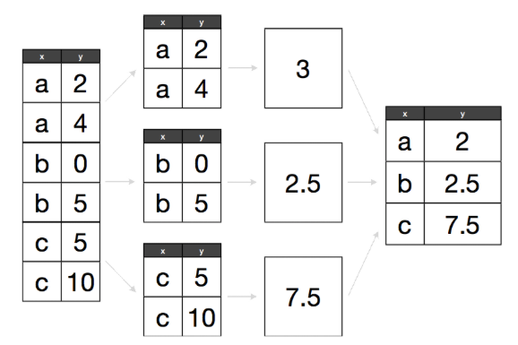

# Manipulación y visualización de datos 

<style>
  .espacio {
     margin-bottom: 1cm;
  }
</style>

<style>
  .espacio3 {
     margin-bottom: 3cm;
  }
</style>

<br>

> "Happy families are all alike; every unhappy family is unhappy
> in its own way." — Leo Tolstoy

> "Tidy datasets are all alike; but every messy dataset is messy
> in its own way." — Hadley Wickham

<br>

Comencemos nuevamente cargando el paquete ``tidyverse``:

```{r, comment=NA, message=FALSE, warning=FALSE}
library(tidyverse)
```

La visualización es una herramienta importante para generar información. Sin embargo, es muy raro obtener los datos exactamente en la forma en que se necesitan. Es común tener que crear nuevas variables o hacer resúmenes a partir de algunas variables, o tal vez sólo sea necesario cambiar el nombre de las variables o reordenar las observaciones con el fin de facilitar el análisis de datos.

#### Pipeline {-}


La idea de *pipeline* intenta hacer el desarrollo de código más fácil, en menor tiempo, fácil de leerlo, y por lo tanto, más fácil mantenerlo.

En el análisis de datos es común hacer varias operaciones y se vuelve difícil leer y entender el código. La dificultad radica en que usualmente los parámetros se asignan después del nombre de la función usando `()`.

La forma en que esta idea logra hacer las cosas más faciles es con el operador **forwad pipe** `%>%`que envía un valor a una expresión o función. Este cambio en el orden funciona como el parámetro que precede a la función es enviado ("piped") a la función. Es decir, supongamos `x` es una valor y sea `f` una función, entonces, **`x %>% f` es igual a `f(x)`.**


Por ejemplo, sea $f(x)$ la función de probabilidad de la distribución normal con media $\mu = 0$ y desviación estándar $\sigma = 1$:
\[
f(x) = \dfrac{ 1 }{\sqrt{2\pi}} e^{- \frac{1}{2} x^2 }
\]

```{r}
f <- function(x){
  exp(-(x^2)/2)/sqrt(2*pi)
}
# Con el operador de pipe
0 %>% f
```

que de forma tradicional se realiza:
```{r}
# Forma tradicional
f(0)
```


En resumen `%>%` funciona como se muestra en la siguiente figura:

```{r echo=FALSE, fig.align='center', dpi = 25}
knitr::include_graphics("figuras/pipe-function.png")
```

**Nota:** Se puede insertar el pipe `%>%` utilizando: Cmd/Ctrl + Shift + M.

<br>
<br>

  ¿Qué hace el siguiente código? ¿Qué hace `.`?

```{r, eval = F}
df <- data_frame(
  x = runif(5),
  y = rnorm(5)
)
df %>% .$x
df %>%
  ggplot(data = ., aes(x = x, y = y)) +
    geom_point()
```

<p class="espacio">
</p>
<br>

#### Tibbles {-}

Tibbles son dataframes con algunas modificaciones que permitirán trabajar mejor con los paquetes de limpieza y manipulación de datos `tidyr` y `dplyr`.

Una diferencia son los tipos de columnas que maneja:

* `lgl:` vectores de valores lógicos, vectores que contienen TRUE o FALSE.
* `int`: vectores de números enteros.
* `dbl`: vectores de números reales.
* `chr`: vectores de caracteres, *strings*.

<br>

  Imprime `ds` y `as.data.frame(ds)`. ¿Cuál es la diferencia entre ambas?

```{r, eval = F}
ds <- tbl_df(mtcars)
ds
as.data.frame(ds)
```

<p class="espacio">
</p>

```{block2, type = "information"}
**Nota:** Para mayor información de este tipo de dataframes consulta la documentación de la libreria `tibble`.
```


## El principio de datos limpios

Los principios de datos limpios ([Tidy Data de Hadley Wickham](http://vita.had.co.nz/papers/tidy-data.pdf)) proveen una manera estándar de organizar la información:

1. Cada variable forma una columna.

2. Cada observación forma un renglón.

3. Cada tipo de unidad observacional forma una tabla.

**Nota:** La mayor parte de las bases de datos en estadística tienen forma rectangular por lo que únicamente se trataran este tipo de estructura de datos.

Una **base de datos** es una colección de valores numéricos o categóricos. Cada valor pertenece a una variable y a una observación. Una **variable** contiene los valores del atributo (genero, fabricante, ingreso) de la variable por unidad. Una **observación** contiene todos los valores medidos por la misma unidad (personas, día, autos, municipios) para diferentes atributos.

<br>

### Ejemplo: {-}

Supongamos un experimento con 3 pacientes cada uno tiene resultados de dos tratamientos (A y B):


||tratamientoA|tratamientoB
----|------------|---------
Juan Aguirre|- |2
Ana Bernal  |16|11
José López  |3 |1


La tabla anterior también se puede estructurar de la siguiente manera:

 ||Juan Aguirre| Ana Bernal|José López
--|------------|-----------|----------
tratamientoA|- |    16     |   3
tratamientoB|2 |    11     |   1


Si vemos los principios, entonces ¿las tablas anteriores los cumplen? Para responder la pregunta veamos:

- **¿Cuáles son los valores?**
En total se tienen 18 valores en el conjunto de datos.

- **¿Cuáles son las variables?**
Se tienen tres variables:

1. Persona/nombre: Juan Aguirre, Ana Bernal, y José López
2. Tratamiento: A y B
3. Resultado: -, 2, 16, 11, 3, 1

- **¿Cuáles son las observaciones?**
Existen 6 observaciones.

Entonces, siguiendo los principios de _datos limpios_ obtenemos la siguiente estructura:

nombre|tratamiento|resultado
------------|-----|---------
Juan Aguirre|a    |-
Ana Bernal  |a    |16
José López  |a    |3
Juan Aguirre|b    |2
Ana Bernal  |b    |11
José López  |b    |1

<br>

Una vez que identificamos los problemas de una base de datos podemos proceder a la limpieza.

## Limpieza de datos

Algunos de los problemas más comunes en las bases de datos que no están _limpias_ son:

* Los encabezados de las columnas son valores y no nombres de variables.

* Más de una variable por columna. 

* Las variables están organizadas tanto en filas como en columnas.

* Más de un tipo de observación en una tabla.

* Una misma unidad observacional está almacenada en múltiples tablas. 

La mayor parte de estos problemas se pueden arreglar con pocas herramientas, a continuación veremos como _limpiar_ datos usando dos funciones del paquete *tidyr* de Hadley Wickham:

* **gather**: recibe múltiples columnas y las junta en pares de nombres y valores, convierte los datos anchos en largos.

* **spread**: recibe 2 columnas y las separa, haciendo los datos más anchos.

---

Repasaremos los problemas más comunes que se encuentran en conjuntos de datos sucios y mostraremos cómo se puede manipular la tabla de datos (usando las funciones *gather* y *spread*) con el fin de estructurarla para que cumpla los principios de datos limpios.

<br>
<br>
---

#### 1. Los encabezados de las columnas son valores  {-}

Analicemos los datos que provienen de una encuesta de [Pew Research](http://www.pewforum.org/2009/01/30/income-distribution-within-us-religious-groups/) que investiga la relación entre ingreso y afiliación religiosa. ¿Cuáles son las variables en estos datos?

```{r}
pew <- read_csv("datos/pew.csv")
knitr::kable(pew)
```

Para _limpiarla_ es necesario apilar las columnas, es decir, pasar los datos a _forma larga_. Esto lo realizaremos con la función `gather()`:

```{r}
pew_tidy <- pew %>%
  gather(income, frequency, -religion)
# vemos las primeras líneas de nuestros datos alargados
head(pew_tidy)
```

La nueva estructura de la base de datos nos permite, por ejemplo, hacer fácilmente una gráfica donde podemos comparar las diferencias en las frecuencias.

```{r, fig.height = 4.5, fig.width = 8.5, warning = FALSE}
ggplot(pew_tidy, aes(x = income, y = frequency, color = religion, group = religion)) +
  geom_line(size = 1) +
  theme(axis.text.x = element_text(angle = 90, hjust = 1)) +
  guides(color = guide_legend(ncol=2))
```

<br>

Podemos hacer gráficas más interesantes si creamos nuevas variables:

```{r, fig.height = 4, fig.width = 7.7}
library(dplyr)
by_religion <- group_by(pew_tidy, religion)
pew_tidy_2 <- pew_tidy %>%
  filter(income != "Don't know/refused") %>%
  group_by(religion) %>%
  mutate(percent = frequency / sum(frequency)) %>% 
  filter(sum(frequency) > 1000)

head(pew_tidy_2)

ggplot(pew_tidy_2, aes(x = income, y = percent, group = religion)) +
  facet_wrap(~ religion, nrow = 1) +
  geom_bar(stat = "identity", fill = "darkgray") + 
  theme(axis.text.x = element_text(angle = 90, hjust = 1))
```

En el código de arriba utilizamos las funciones `group_by`, `filter` y `mutate` que estudiaremos más adelante.

Otro ejemplo,

```{r}
billboard <- tbl_df(read.csv("datos/billboard.csv", stringsAsFactors = FALSE))
billboard %>% sample_n(5) %>% knitr::kable()
```

Queremos apilar las semanas de manera que sea una sola columna (nuevamente alargamos los datos):
  
```{r}
library(tidyr)
billboard_long <- gather(billboard, week, rank, wk1:wk76,na.rm=TRUE)
billboard_long
```

La instrucción na.rm = TRUE se utiliza para eliminar los valores faltantes en 
las columnas wk1 a wk76. Realizamos una limpieza adicional creando mejores 
variables de fecha.

```{r}
billboard_tidy <- billboard_long %>%
  mutate(
    week = extract_numeric(week),
    date = as.Date(date.entered) + 7 * (week - 1)) %>%
  select(-date.entered)
billboard_tidy %>% sample_n(10) %>% knitr::kable()
```


Nuevamente, podemos hacer gráficas facilmente.

```{r, fig.height = 3.8, fig.width = 7.7}
tracks <- billboard_tidy %>%
  filter(track %in% c("Come On Over Baby (A...", "What A Girl Wants", "Say My Name", "Jumpin' Jumpin'", "Bye Bye Bye"))

ggplot(tracks, aes(x = date, y = rank)) +
  geom_line() + 
  facet_wrap(~track, nrow = 1) + 
  theme(axis.text.x = element_text(angle = 90, hjust = 1))
```

<br>
<br>
---

#### 2. Una columna asociada a más de una variable {-}

La siguiente base de datos proviene de la Organización Mundial de la Salud y contiene el número de casos confirmados de tuberculosis por país y año, la información esta por grupo demográfico de acuerdo a sexo (m, f), y edad (0-4, 5-14, etc).

```{r message=F, warning=F, paged.print=FALSE}
library(countrycode)
tb <- read_csv("datos/tb.csv")
tb$country_name <- countrycode(tb$iso2, 'iso2c', 'country.name')
tb %>% sample_n(5) %>% knitr::kable()
```

De manera similar, utilizando la función `gather()` se busca apilar las columnas correspondientes a sexo-edad.

**¿Cómo podemos separar la "variable" sexo-edad en dos columnas?**

```{r}
tb_long <- tb %>%
  gather(demog, casos, new_sp_m04:new_sp_fu, na.rm=TRUE)
tb_long %>% sample_n(10) %>% knitr::kable()
```


Las variables sexo y edad se obtienen separando la columna **demog**, para esto se usa la función `separate()`con los siguientes argumentos: `tidyr::separate(data, col = name_variabletoseparate, into = c(vector with names using ""), sep)`

```{r}
tb_tidy <- tb_long %>%
  separate(col = demog, into = c("sex", "age"), sep = 8)
knitr::kable(tb_tidy %>% head(20))
```

Ahora para hacer mejor variable **sex** y **age** usaremos la función `mutate()` que permite crear nuevas variables sin modificar la dimensión del dataframe.

```{r}
library(stringr)
tb_tidy <- tb_long %>%
  separate(col = demog, into = c("sex", "age"), sep = 8) %>%
  mutate(sex = str_sub(sex, 8, 8),
         age = factor(age,
                       levels = c("014", "04", "1524", "2534", "3544",
                                  "4554", "514",  "5564", "65","u"),
                       labels = c("0-14", "0-4", "15-24", "25-34", "35-44",
                                  "45-54", "5-14",  "55-64", "65+","unknown")
                       )
          )
knitr::kable(tb_tidy %>% head(20))
```

<br>

Se puede separar la columna `demog` en dos variables, sexo y edad, utilizando la función _separate_. Se debe indicar la posición de donde deseamos "cortar":

```{r}
tb_tidy <- tidyr::separate(tb_long, demog, c("sex", "age"), 8)
tb_tidy %>% sample_n(10) %>% knitr::kable()
```

<br>
<br>
---

#### 3. Variables almacenadas en filas y columnas {-}

El problema más difícil es cuando las variables están tanto en filas como encolumnas, veamos una base de datos de clima en Cuernavaca. ¿Cuáles son las variables en estos datos?

```{r}
clima <- tbl_df(read.delim("datos/clima.txt", stringsAsFactors=FALSE))
clima
```

Estos datos tienen variables en columnas individuales (id, año, mes), en múltiples columnas (día, d1-d31) y en filas (tmin, tmax). Comencemos por apilar las columnas.

```{r}
clima_long <- clima %>%
  gather(day, value, d1:d31, na.rm = TRUE)
head(clima_long)
```

Podemos crear algunas variables adicionales.
```{r}
clima_vars <- clima_long %>% 
  mutate(day = extract_numeric(day), value = value / 10)  %>%
  select(id, year, month, day, element, value) %>%
  arrange(id, year, month, day)
head(clima_vars)
```

Finalmente, la columna *element* no es una variable, sino que almacena el nombre de dos variables, la operación que debemos aplicar (spread) es el inverso de apilar (gather):
  
```{r}
clima_tidy <- clima_vars %>%
  spread(element, value)
head(clima_tidy)
```

Ahora es inmediato no solo hacer gráficas sino también ajustar un modelo.

```{r}
# ajustamos un modelo lineal donde la variable respuesta es temperatura 
# máxima, y la variable explicativa es el mes
clima_lm <- lm(TMAX ~ factor(month), data = clima_tidy)
summary(clima_lm)
```

#### 4. Mas de un tipo de observación en una misma tabla {-}

En ocasiones las bases de datos involucran valores en diferentes niveles, endiferentes tipos de unidad observacional. En la limpieza de datos, cada unidad observacional debe estar almacenada en su propia tabla (esto esta ligado a normalización de una base de datos), es importante para evitar inconsistencias en los datos.

¿Cuáles son las unidades observacionales de los datos de billboard?

```{r}
billboard_tidy %>% sample_n(5) %>% select(artist, track, year, time) %>% knitr::kable()
```

Separemos esta base de datos en dos: la tabla canción que almacena artista, nombre de la canción y duración; la tabla rank que almacena el ranking de la canción en cada semana.

```{r}
song <- billboard_tidy %>% 
  select(artist, track, year, time) %>%
  unique() %>%
  arrange(artist) %>%
  mutate(song_id = row_number(artist))
```


```{r}
rank <- billboard_tidy %>%
  left_join(song, c("artist", "track", "year", "time")) %>%
  select(song_id, date, week, rank) %>%
  arrange(song_id, date) %>%
  tbl_df
rank %>% knitr::kable()
```

#### 5. Una misma unidad observacional está almacenada en múltiples tablas {-}

También es común que los valores sobre una misma unidad observacional estén separados en muchas tablas o archivos, es común que estas tablas esten divididas de acuerdo a una variable, de tal manera que cada archivo representa a una persona, año o ubicación. Para juntar los archivos hacemos lo siguiente:
  
1. Leemos los archivos en una lista de tablas.

2. Para cada tabla agregamos una columna que registra el nombre del archivo original.

3. Combinamos las tablas en un solo data frame.  

Veamos un ejemplo, la carpeta specdata contiene 332 archivos csv que almacenan información de monitoreo de contaminación en 332 ubicaciones de EUA. Cada archivo contiene información de una unidad de monitoreo y el número de identificación del monitor es el nombre del archivo.

Los pasos en R (usando el paquete plyr), primero creamos un vector con los nombres de los archivos en un directorio, aligiendo aquellos que contengan las letras ".csv".

```{r}
paths <- dir("datos/specdata", pattern = "\\.csv$", full.names = TRUE)
```

Después le asignamos el nombre del csv al nombre de cada elemento del vector. Este paso se realiza para preservar los nmobres de los archivos ya que estos los asignaremos a una variable mas adelante.

```{r}
names(paths) <- basename(paths)
```

La función `map_df` del paquete `purrr` itera sobre cada dirección, lee el csv en dicha dirección y los combina en un data frame.

```{r}
specdata_US <- map_df(paths, read.csv, stringsAsFactors = FALSE)

specdata <- specdata_US %>%
  mutate(monitor = extract_numeric(ID), date = as.Date(Date)) %>%
  select(id = ID, monitor, date, sulfate, nitrate)

specdata %>% sample_n(20) %>% knitr::kable()
```

#### 6. Otras consideraciones {-}

En las buenas prácticas es importante tomar en cuenta los siguientes puntos:

* Incluir un encabezado con el nombre de las variables.

* Los nombres de las variables deben ser entendibles (e.g. age_at_diagnosis es mejor que AgeDx).

* En general los datos se deben guardar en un archivo por tabla.

* Escribir un script con las modificaciones que se hicieron a los _datos crudos_ (reproducibilidad).

* Otros aspectos importantes en la _limpieza_ de datos son: selección del tipo de variables (por ejemplo fechas), datos faltantes, _typos_ y detección de valores atípicos.


---

## *Split-apply-combine*

```{r, echo = F, fig.align='center', out.width='12%'}
knitr::include_graphics("figures/lib-dplyr.png")
```

Muchos problemas de análisis de datos involucran la aplicación de la estrategia **_split-apply-combine_** de [Hadley Whickam, 2011](http://www.jstatsoft.org/v40/i01/paper). Esto se traduce en realizar filtros, cálculos y agregación de datos.


```{block2, type = "nota"}
**_Split-apply-combine_**
  
1. **Separa** la base de datos original.

2. **Aplica** funciones a cada subconjunto.

3. **Combina** los resultados en una nueva base de datos.

Consiste en romper un problema en pedazos (de acuerdo a una variable de interés), operar sobre cada subconjunto de manera independiente (calcular la media de cada grupo) y después unir los pedazos nuevamente. 
```

```{r, echo = F, fig.align='center', dpi=100}

```


Cuando pensamos como implementar la estrategia divide-aplica-combina es natural pensar en iteraciones para recorrer cada grupo de interés y aplicar las funciones. 


```{block2, type = "comentario"}
Para esto usaremos la librería `dplyr` que 
contiene funciones que facilitan la implementación de la 
estrategia.
```

En este taller se estudiarán las siguientes funciones de la librería `dplyr`:
  
* **filter**: obtiene un subconjunto de las filas de acuerdo a una condición.
* **select**: selecciona columnas de acuerdo al nombre.
* **arrange**: re ordena las filas.
* **mutate**: agrega nuevas variables.
* **summarise**: reduce variables a valores (crear nuevas bases de datos).

Para mostrar las funciones se usará el siguiente dataframe.
  
```{r}
df_ej <- data.frame(genero = c("mujer", "hombre", "mujer", "mujer", "hombre"), 
                    estatura = c(1.65, 1.80, 1.70, 1.60, 1.67))
df_ej
```

#### Filtrar {-}

Filtrar una base de datos dependiendo de una condición requiere la función `filter()` que tiene los siguientes argumentos `dplyr::filter(data, condition)`. 

```{r}
df_ej %>% filter(genero == "mujer")
```


#### Seleccionar {-}

Elegir columnas de un conjunto de datos se puede hacer con la función `select()` que tiene los siguientes argumentos `dplyr::select(data, seq_variables)`. 

```{r}
df_ej %>% select(genero)
```

También, existen funciones que se usan exclusivamente en `select()`:

- `starts_with(x, ignore.case = TRUE)`: los nombres empiezan con _x_.

- `ends_with(x, ignore.case = TRUE)`: los nombres terminan con _x_.

- `contains(x, ignore.case = TRUE)`: selecciona las variable que contengan _x_.

- `matches(x, ignore.case = TRUE)`: selecciona las variable que igualen la expresión regular _x_.

- `num_range("x", 1:5, width = 2)`: selecciona las variables (numéricamente) de x01 a x05.

- `one_of("x", "y", "z")`: selecciona las variables que estén en un vector de caracteres.

- `everything()`: selecciona todas las variables.

Por ejemplo:

```{r}
df_ej %>% select(starts_with("g"))
```

#### Arreglar {-}

Arreglar u ordenar de acuerdo al valor de una o más variables es posible con la función `arrange()` que tiene los siguientes argumentos `dplyr::arrange(data, variables_por_las_que_ordenar)`. La función `desc()` permite que se ordene de forma descendiente. 
  
```{r}
df_ej %>% arrange(desc(estatura))
```


#### Mutar {-}

Mutar consiste en crear nuevas variables  con la función `mutate()` que tiene los siguientes argumentos `dplyr::mutate(data, nuevas_variables = operaciones)`:

```{r}
df_ej %>% mutate(estatura_cm = estatura * 100) 
```

#### Resumir {-}

Los resúmenes permiten crear nuevas bases de datos que son agregaciones de los datos originales. 

La función `summarise()` permite realizar este resumen`dplyr::summarise(data, nuevas_variables = operaciones)`:

```{r}
df_ej %>% dplyr::summarise(promedio = mean(estatura))
```


También es posible hacer resúmenes agrupando por variables determinadas de la base de datos. Pero,  primero es necesario crear una base agrupada con la función `group_by()` con argumentos `dplyr::group_by(data, add = variables_por_agrupar)`:
  
```{r}
df_ej %>% 
  group_by(genero)
```

Después se opera sobre cada grupo, creando un resumen a nivel grupo y uniendo los subconjuntos en una base nueva:

```{r}
df_ej %>% 
  group_by(genero) %>% 
  dplyr::summarise(promedio = mean(estatura))
```

<br>

---


