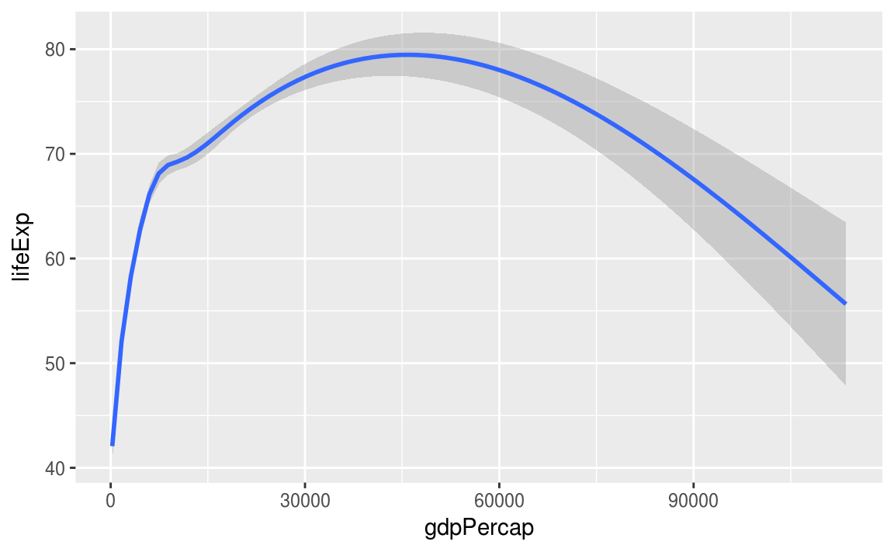
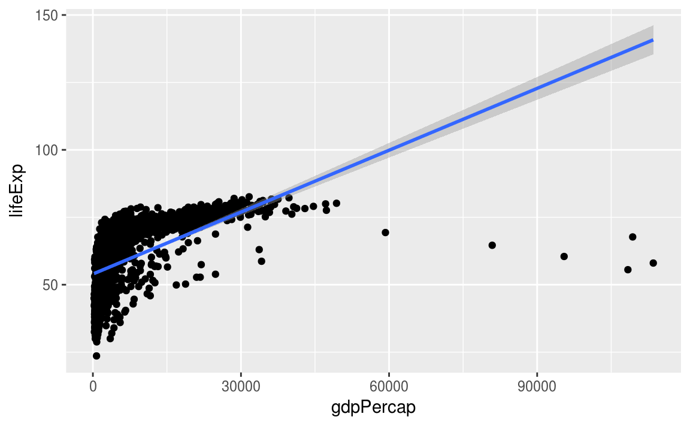
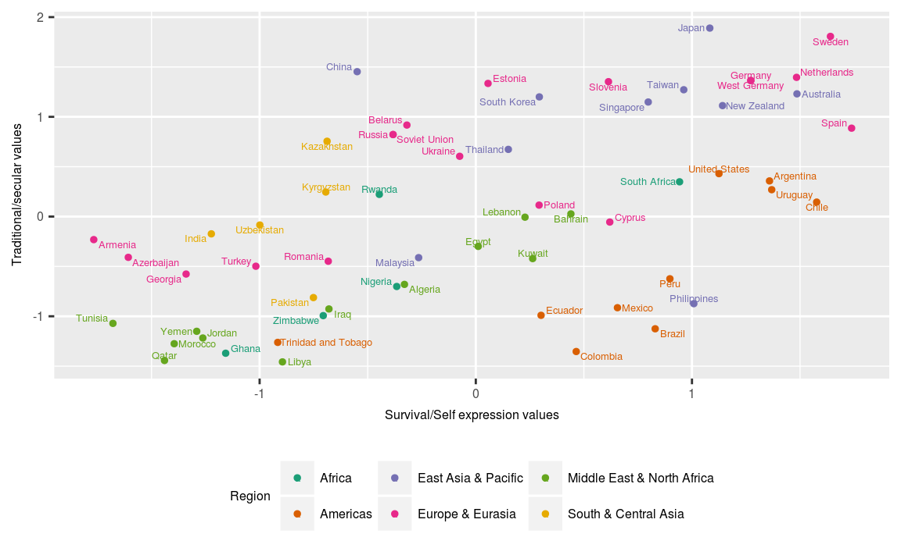

# Manipulación y visualización de datos 

<style>
  .espacio {
     margin-bottom: 1cm;
  }
</style>

<style>
  .espacio3 {
     margin-bottom: 3cm;
  }
</style>

<br>

> "Happy families are all alike; every unhappy family is unhappy
> in its own way." — Leo Tolstoy

> "Tidy datasets are all alike; but every messy dataset is messy
> in its own way." — Hadley Wickham

<br>

Comencemos nuevamente cargando el paquete ``tidyverse``:


```r
library(tidyverse)
```

La visualización es una herramienta importante para generar información. Sin embargo, es muy raro obtener los datos exactamente en la forma en que se necesitan. Es común tener que crear nuevas variables o hacer resúmenes a partir de algunas variables, o tal vez sólo sea necesario cambiar el nombre de las variables o reordenar las observaciones con el fin de facilitar el análisis de datos.

#### Pipeline {-}


La idea de *pipeline* intenta hacer el desarrollo de código más fácil, en menor tiempo, fácil de leerlo, y por lo tanto, más fácil mantenerlo.

En el análisis de datos es común hacer varias operaciones y se vuelve difícil leer y entender el código. La dificultad radica en que usualmente los parámetros se asignan después del nombre de la función usando `()`.

La forma en que esta idea logra hacer las cosas más faciles es con el operador **forwad pipe** `%>%`que envía un valor a una expresión o función. Este cambio en el orden funciona como el parámetro que precede a la función es enviado ("piped") a la función. Es decir, supongamos `x` es una valor y sea `f` una función, entonces, **`x %>% f` es igual a `f(x)`.**


Por ejemplo, sea $f(x)$ la función de probabilidad de la distribución normal con media $\mu = 0$ y desviación estándar $\sigma = 1$:
\[
f(x) = \dfrac{ 1 }{\sqrt{2\pi}} e^{- \frac{1}{2} x^2 }
\]


```r
f <- function(x){
  exp(-(x^2)/2)/sqrt(2*pi)
}
# Con el operador de pipe
0 %>% f
#> [1] 0.399
```

que de forma tradicional se realiza:

```r
# Forma tradicional
f(0)
#> [1] 0.399
```


En resumen `%>%` funciona como se muestra en la siguiente figura:


**Nota:** Se puede insertar el pipe `%>%` utilizando: Cmd/Ctrl + Shift + M.

<br>
<br>

  ¿Qué hace el siguiente código? ¿Qué hace `.`?


```r
df <- data_frame(
  x = runif(5),
  y = rnorm(5)
)
df %>% .$x
df %>%
  ggplot(data = ., aes(x = x, y = y)) +
    geom_point()
```

<p class="espacio">
</p>
<br>

#### Tibbles {-}

Tibbles son dataframes con algunas modificaciones que permitirán trabajar mejor con los paquetes de limpieza y manipulación de datos `tidyr` y `dplyr`.

Una diferencia son los tipos de columnas que maneja:

* `lgl:` vectores de valores lógicos, vectores que contienen TRUE o FALSE.
* `int`: vectores de números enteros.
* `dbl`: vectores de números reales.
* `chr`: vectores de caracteres, *strings*.

<br>

  Imprime `ds` y `as.data.frame(ds)`. ¿Cuál es la diferencia entre ambas?


```r
ds <- tbl_df(mtcars)
ds
as.data.frame(ds)
```

<p class="espacio">
</p>

\BeginKnitrBlock{information}<div class="information">**Nota:** Para mayor información de este tipo de dataframes consulta la documentación de la libreria `tibble`.</div>\EndKnitrBlock{information}

<br>

<br>

## El principio de datos limpios

Los principios de datos limpios ([Tidy Data de Hadley Wickham](http://vita.had.co.nz/papers/tidy-data.pdf)) proveen una manera estándar de organizar la información:

1. Cada variable forma una columna.

2. Cada observación forma un renglón.

3. Cada tipo de unidad observacional forma una tabla.

**Nota:** La mayor parte de las bases de datos en estadística tienen forma rectangular por lo que únicamente se trataran este tipo de estructura de datos.

Una **base de datos** es una colección de valores numéricos o categóricos. Cada valor pertenece a una variable y a una observación. Una **variable** contiene los valores del atributo (genero, fabricante, ingreso) de la variable por unidad. Una **observación** contiene todos los valores medidos por la misma unidad (personas, día, autos, municipios) para diferentes atributos.

<br>

### Ejemplo: {-}

Supongamos un experimento con 3 pacientes cada uno tiene resultados de dos tratamientos (A y B):


||tratamientoA|tratamientoB
----|------------|---------
Juan Aguirre|- |2
Ana Bernal  |16|11
José López  |3 |1


La tabla anterior también se puede estructurar de la siguiente manera:

 ||Juan Aguirre| Ana Bernal|José López
--|------------|-----------|----------
tratamientoA|- |    16     |   3
tratamientoB|2 |    11     |   1


Si vemos los principios, entonces ¿las tablas anteriores los cumplen? Para responder la pregunta veamos:

- **¿Cuáles son los valores?**
En total se tienen 18 valores en el conjunto de datos.

- **¿Cuáles son las variables?**
Se tienen tres variables:

1. Persona/nombre: Juan Aguirre, Ana Bernal, y José López
2. Tratamiento: A y B
3. Resultado: -, 2, 16, 11, 3, 1

- **¿Cuáles son las observaciones?**
Existen 6 observaciones.

Entonces, siguiendo los principios de _datos limpios_ obtenemos la siguiente estructura:

nombre|tratamiento|resultado
------------|-----|---------
Juan Aguirre|a    |-
Ana Bernal  |a    |16
José López  |a    |3
Juan Aguirre|b    |2
Ana Bernal  |b    |11
José López  |b    |1

<br>

Una vez que identificamos los problemas de una base de datos podemos proceder a la limpieza.

## Limpieza de datos

Algunos de los problemas más comunes en las bases de datos que no están _limpias_ son:

* Los encabezados de las columnas son valores y no nombres de variables.

* Más de una variable por columna. 

* Las variables están organizadas tanto en filas como en columnas.

* Más de un tipo de observación en una tabla.

* Una misma unidad observacional está almacenada en múltiples tablas. 

La mayor parte de estos problemas se pueden arreglar con pocas herramientas, a continuación veremos como _limpiar_ datos usando dos funciones del paquete *tidyr* de Hadley Wickham:

* **gather**: recibe múltiples columnas y las junta en pares de nombres y valores, convierte los datos anchos en largos.

* **spread**: recibe 2 columnas y las separa, haciendo los datos más anchos.

Repasaremos los problemas más comunes que se encuentran en conjuntos de datos sucios y mostraremos cómo se puede manipular la tabla de datos (usando las funciones *gather* y *spread*) con el fin de estructurarla para que cumpla los principios de datos limpios.

<br>

---

#### 1. Los encabezados de las columnas son valores  {-}

Analicemos los datos que provienen de una encuesta de [Pew Research](http://www.pewforum.org/2009/01/30/income-distribution-within-us-religious-groups/) que investiga la relación entre ingreso y afiliación religiosa. ¿Cuáles son las variables en estos datos?


```r
pew <- read_csv("datos/pew.csv")
knitr::kable(pew)
```


religion                   <$10k   $10-20k   $20-30k   $30-40k   $40-50k   $50-75k   $75-100k   $100-150k   >150k   Don't know/refused
------------------------  ------  --------  --------  --------  --------  --------  ---------  ----------  ------  -------------------
Agnostic                      27        34        60        81        76       137        122         109      84                   96
Atheist                       12        27        37        52        35        70         73          59      74                   76
Buddhist                      27        21        30        34        33        58         62          39      53                   54
Catholic                     418       617       732       670       638      1116        949         792     633                 1489
Don’t know/refused            15        14        15        11        10        35         21          17      18                  116
Evangelical Prot             575       869      1064       982       881      1486        949         723     414                 1529
Hindu                          1         9         7         9        11        34         47          48      54                   37
Historically Black Prot      228       244       236       238       197       223        131          81      78                  339
Jehovah's Witness             20        27        24        24        21        30         15          11       6                   37
Jewish                        19        19        25        25        30        95         69          87     151                  162
Mainline Prot                289       495       619       655       651      1107        939         753     634                 1328
Mormon                        29        40        48        51        56       112         85          49      42                   69
Muslim                         6         7         9        10         9        23         16           8       6                   22
Orthodox                      13        17        23        32        32        47         38          42      46                   73
Other Christian                9         7        11        13        13        14         18          14      12                   18
Other Faiths                  20        33        40        46        49        63         46          40      41                   71
Other World Religions          5         2         3         4         2         7          3           4       4                    8
Unaffiliated                 217       299       374       365       341       528        407         321     258                  597

Para _limpiarla_ es necesario apilar las columnas, es decir, pasar los datos a _forma larga_. Esto lo realizaremos con la función `gather()`:


```r
pew_tidy <- pew %>%
  gather(income, frequency, -religion)
# vemos las primeras líneas de nuestros datos alargados
pew_tidy %>% head() %>% knitr::kable()
```


religion             income    frequency
-------------------  -------  ----------
Agnostic             <$10k            27
Atheist              <$10k            12
Buddhist             <$10k            27
Catholic             <$10k           418
Don’t know/refused   <$10k            15
Evangelical Prot     <$10k           575

La nueva estructura de la base de datos nos permite, por ejemplo, hacer fácilmente una gráfica donde podemos comparar las diferencias en las frecuencias.


```r
library(dplyr)
by_religion <- group_by(pew_tidy, religion)
pew_tidy_2 <- pew_tidy %>%
  filter(income != "Don't know/refused") %>%
  group_by(religion) %>%
  mutate(percent = frequency / sum(frequency)) %>% 
  filter(sum(frequency) > 1000)

ggplot(pew_tidy_2, aes(x = income, y = percent, group = religion)) +
  facet_wrap(~ religion) +
  geom_bar(stat = "identity", fill = "darkgray") + 
  theme(axis.text.x = element_text(angle = 90, hjust = 1))
```


En el código de arriba utilizamos las funciones `group_by`, `filter` y `mutate` que estudiaremos más adelante.

<br>

---

Otro ejemplo,


```r
billboard <- tbl_df(read.csv("datos/billboard.csv", stringsAsFactors = FALSE))
billboard %>% sample_n(5) %>% knitr::kable()
```


 year  artist                 track                     time   date.entered    wk1   wk2   wk3   wk4   wk5   wk6   wk7   wk8   wk9   wk10   wk11   wk12   wk13   wk14   wk15   wk16   wk17   wk18   wk19   wk20   wk21   wk22   wk23   wk24   wk25   wk26   wk27   wk28   wk29   wk30   wk31   wk32   wk33   wk34   wk35   wk36   wk37   wk38   wk39   wk40   wk41   wk42   wk43   wk44   wk45   wk46   wk47   wk48   wk49   wk50   wk51   wk52   wk53   wk54   wk55   wk56   wk57   wk58   wk59   wk60   wk61   wk62   wk63   wk64   wk65  wk66   wk67   wk68   wk69   wk70   wk71   wk72   wk73   wk74   wk75   wk76 
-----  ---------------------  ------------------------  -----  -------------  ----  ----  ----  ----  ----  ----  ----  ----  ----  -----  -----  -----  -----  -----  -----  -----  -----  -----  -----  -----  -----  -----  -----  -----  -----  -----  -----  -----  -----  -----  -----  -----  -----  -----  -----  -----  -----  -----  -----  -----  -----  -----  -----  -----  -----  -----  -----  -----  -----  -----  -----  -----  -----  -----  -----  -----  -----  -----  -----  -----  -----  -----  -----  -----  -----  -----  -----  -----  -----  -----  -----  -----  -----  -----  -----  -----
 2000  Backstreet Boys, The   The One                   3:46   2000-05-27       58    50    43    37    31    30    39    47    55     61     76     90     93     93    100     NA     NA     NA     NA     NA     NA     NA     NA     NA     NA     NA     NA     NA     NA     NA     NA     NA     NA     NA     NA     NA     NA     NA     NA     NA     NA     NA     NA     NA     NA     NA     NA     NA     NA     NA     NA     NA     NA     NA     NA     NA     NA     NA     NA     NA     NA     NA     NA     NA     NA  NA     NA     NA     NA     NA     NA     NA     NA     NA     NA     NA   
 2000  Sisqo                  Incomplete                3:52   2000-06-24       77    66    61    61    61    55     2     1     1      2      2      4      5      5      7      8     10     10      9     14     17     20     25     31     32     46     NA     NA     NA     NA     NA     NA     NA     NA     NA     NA     NA     NA     NA     NA     NA     NA     NA     NA     NA     NA     NA     NA     NA     NA     NA     NA     NA     NA     NA     NA     NA     NA     NA     NA     NA     NA     NA     NA     NA  NA     NA     NA     NA     NA     NA     NA     NA     NA     NA     NA   
 2000  Madison Avenue         Don't Call Me Baby        3:44   2000-07-08       98    96    93    93    93    92    92    92    90     92     88     88     88     95     93     98     93     92     90     97     NA     NA     NA     NA     NA     NA     NA     NA     NA     NA     NA     NA     NA     NA     NA     NA     NA     NA     NA     NA     NA     NA     NA     NA     NA     NA     NA     NA     NA     NA     NA     NA     NA     NA     NA     NA     NA     NA     NA     NA     NA     NA     NA     NA     NA  NA     NA     NA     NA     NA     NA     NA     NA     NA     NA     NA   
 2000  Cagle, Chris           My Love Goes On And ...   3:02   2000-10-21       99    94    94    87    84    83    76    76    79     83     91     NA     NA     NA     NA     NA     NA     NA     NA     NA     NA     NA     NA     NA     NA     NA     NA     NA     NA     NA     NA     NA     NA     NA     NA     NA     NA     NA     NA     NA     NA     NA     NA     NA     NA     NA     NA     NA     NA     NA     NA     NA     NA     NA     NA     NA     NA     NA     NA     NA     NA     NA     NA     NA     NA  NA     NA     NA     NA     NA     NA     NA     NA     NA     NA     NA   
 2000  3 Doors Down           Kryptonite                3:53   2000-04-08       81    70    68    67    66    57    54    53    51     51     51     51     47     44     38     28     22     18     18     14     12      7      6      6      6      5      5      4      4      4      4      3      3      3      4      5      5      9      9     15     14     13     14     16     17     21     22     24     28     33     42     42     49     NA     NA     NA     NA     NA     NA     NA     NA     NA     NA     NA     NA  NA     NA     NA     NA     NA     NA     NA     NA     NA     NA     NA   

Queremos apilar las semanas de manera que sea una sola columna (nuevamente alargamos los datos):
  

```r
library(tidyr)
billboard_long <- gather(billboard, week, rank, wk1:wk76, na.rm=TRUE)
billboard_long %>% sample_n(10) %>% knitr::kable()
```


 year  artist                track                     time   date.entered   week    rank
-----  --------------------  ------------------------  -----  -------------  -----  -----
 2000  Lil' Zane             Callin' Me                3:43   2000-07-29     wk9       45
 2000  DMX                   Party Up (Up In Here...   3:45   2000-02-26     wk10      27
 2000  Aguilera, Christina   Come On Over Baby (A...   3:38   2000-08-05     wk6       18
 2000  Thomas, Carl          Emotional                 4:31   2000-11-25     wk15      63
 2000  Amber                 Sexual                    4:38   1999-07-17     wk17      98
 2000  Goo Goo Dolls         Broadway                  3:54   2000-04-22     wk20      87
 2000  Westlife              Swear It Again            4:07   2000-04-01     wk3       66
 2000  Lonestar              What About Now            3:30   2000-06-10     wk1       78
 2000  Madonna               Music                     3:45   2000-08-12     wk6        1
 2000  DMX                   Party Up (Up In Here...   3:45   2000-02-26     wk8       32

La instrucción `na.rm = TRUE` se utiliza para eliminar los valores faltantes en las columnas wk1 a wk76. Realizamos una limpieza adicional creando mejores variables de fecha.


```r
billboard_tidy <- billboard_long %>%
  mutate(
    week = extract_numeric(week),
    date = as.Date(date.entered) + 7 * (week - 1)) %>%
  select(-date.entered)
billboard_tidy %>% sample_n(10) %>% knitr::kable()
```


 year  artist                track                     time    week   rank  date       
-----  --------------------  ------------------------  -----  -----  -----  -----------
 2000  Ginuwine              The Best Man I Can B...   4:06       4     94  2000-01-29 
 2000  Dion, Celine          That's The Way It Is      4:03       8     30  2000-01-01 
 2000  Avant                 Separated                 4:13       2     32  2000-05-06 
 2000  Vassar, Phil          Carlene                   4:07       7     47  2000-04-15 
 2000  Creed                 With Arms Wide Open       3:52      35      5  2001-01-06 
 2000  Aguilera, Christina   Come On Over Baby (A...   3:38       6     18  2000-09-09 
 2000  Jagged Edge           Let's Get Married         4:23      14     14  2000-08-05 
 2000  Walker, Clay          The Chain Of Love         5:03      15     71  2000-07-22 
 2000  Creed                 Higher                    5:16      65     49  2000-12-02 
 2000  Lonestar              Amazed                    4:25      37     18  2000-02-12 


Nuevamente, podemos hacer gráficas fácilmente.


```r
tracks <- billboard_tidy %>%
  filter(track %in% c("Come On Over Baby (A...", "What A Girl Wants", "Say My Name", "Jumpin' Jumpin'", "Bye Bye Bye"))

ggplot(tracks, aes(x = date, y = rank)) +
  geom_line() + 
  facet_wrap(~track, nrow = 1) + 
  theme(axis.text.x = element_text(angle = 90, hjust = 1))
```


---

<br>


#### 2. Una columna asociada a más de una variable {-}

La siguiente base de datos proviene de la Organización Mundial de la Salud y contiene el número de casos confirmados de tuberculosis por país y año, la información esta por grupo demográfico de acuerdo a sexo (m, f), y edad (0-4, 5-14, etc).


```r
library(countrycode)
tb <- read_csv("datos/tb.csv")
tb$country_name <- countrycode(tb$iso2, 'iso2c', 'country.name')
tb %>% sample_n(5) %>% knitr::kable()
```


iso2    year   new_sp_m04   new_sp_m514   new_sp_m014   new_sp_m1524   new_sp_m2534   new_sp_m3544   new_sp_m4554   new_sp_m5564   new_sp_m65   new_sp_mu   new_sp_f04   new_sp_f514   new_sp_f014   new_sp_f1524   new_sp_f2534   new_sp_f3544   new_sp_f4554   new_sp_f5564   new_sp_f65   new_sp_fu  country_name 
-----  -----  -----------  ------------  ------------  -------------  -------------  -------------  -------------  -------------  -----------  ----------  -----------  ------------  ------------  -------------  -------------  -------------  -------------  -------------  -----------  ----------  -------------
PT      1980           NA            NA            NA             NA             NA             NA             NA             NA           NA          NA           NA            NA            NA             NA             NA             NA             NA             NA           NA          NA  Portugal     
AT      2002           NA            NA             1              8             14             32             43             20           25          NA           NA            NA             0              8             13              7              5              7           21          NA  Austria      
LU      1984           NA            NA            NA             NA             NA             NA             NA             NA           NA          NA           NA            NA            NA             NA             NA             NA             NA             NA           NA          NA  Luxembourg   
OM      1999           NA            NA             2             10             11             23             15              7           10          NA           NA            NA             3             16              4              6              1              4            8          NA  Oman         
NZ      1985           NA            NA            NA             NA             NA             NA             NA             NA           NA          NA           NA            NA            NA             NA             NA             NA             NA             NA           NA          NA  New Zealand  

De manera similar, utilizando la función `gather()` se busca apilar las columnas correspondientes a sexo-edad.

**¿Cómo podemos separar la "variable" sexo-edad en dos columnas?**


```r
tb_long <- tb %>%
  gather(demog, casos, new_sp_m04:new_sp_fu, na.rm=TRUE)
tb_long %>% sample_n(10) %>% knitr::kable()
```


iso2    year  country_name           demog           casos
-----  -----  ---------------------  -------------  ------
BZ      2001  Belize                 new_sp_m014         0
AN      2004  Netherlands Antilles   new_sp_m3544        4
CA      1991  Canada                 new_sp_m4554       37
NP      2002  Nepal                  new_sp_f1524     1203
RO      2006  Romania                new_sp_m65        580
BH      1995  Bahrain                new_sp_m65          3
PH      1998  Philippines            new_sp_f2534      109
GN      2004  Guinea                 new_sp_f65         63
GU      2001  Guam                   new_sp_m2534        4
TM      1999  Turkmenistan           new_sp_m2534      225


Las variables sexo y edad se obtienen separando la columna **demog**, para esto se usa la función `separate()`con los siguientes argumentos: `tidyr::separate(data, col = name_variabletoseparate, into = c(vector with names using ""), sep)`


```r
tb_tidy <- tb_long %>%
  separate(col = demog, into = c("sex", "age"), sep = 8)
tb_tidy %>% sample_n(10) %>% knitr::kable()
```


iso2    year  country_name                       sex        age     casos
-----  -----  ---------------------------------  ---------  -----  ------
GN      2004  Guinea                             new_sp_f   2534      521
NG      2008  Nigeria                            new_sp_m   u           0
PY      2006  Paraguay                           new_sp_f   1524      130
AT      2007  Austria                            new_sp_f   2534       14
BO      1997  Bolivia (Plurinational State of)   new_sp_m   1524     1214
MR      1999  Mauritania                         new_sp_f   3544      110
NI      2007  Nicaragua                          new_sp_f   3544      100
VU      2005  Vanuatu                            new_sp_f   65          2
NG      2005  Nigeria                            new_sp_f   65        415
JO      2006  Jordan                             new_sp_m   5564        4

Ahora para hacer mejor variable **sex** y **age** usaremos la función `mutate()` que permite crear nuevas variables sin modificar la dimensión del dataframe.


```r
library(stringr)
tb_tidy <- tb_long %>%
  separate(col = demog, into = c("sex", "age"), sep = 8) %>%
  mutate(sex = str_sub(sex, 8, 8),
         age = factor(age,
                       levels = c("014", "04", "1524", "2534", "3544",
                                  "4554", "514",  "5564", "65","u"),
                       labels = c("0-14", "0-4", "15-24", "25-34", "35-44",
                                  "45-54", "5-14",  "55-64", "65+","unknown")
                       )
          )
tb_tidy %>% sample_n(10) %>% knitr::kable()
```


iso2    year  country_name   sex   age      casos
-----  -----  -------------  ----  ------  ------
LB      2004  Lebanon        m     65+          6
GT      2007  Guatemala      m     45-54      203
EG      2007  Egypt          m     25-34      853
BS      2003  Bahamas        f     0-14         2
ZW      2007  Zimbabwe       m     65+        153
SG      1999  Singapore      f     35-44       18
PA      1999  Panama         m     25-34      209
SL      1998  Sierra Leone   f     25-34      294
MX      2000  Mexico         m     0-14       214
UA      1999  Ukraine        m     45-54     1825

<br>

Se puede separar la columna `demog` en dos variables, sexo y edad, utilizando la función _separate_. Se debe indicar la posición de donde deseamos "cortar":


```r
tb_tidy <- tidyr::separate(tb_long, demog, c("sex", "age"), 8)
tb_tidy %>% sample_n(10) %>% knitr::kable()
```


iso2    year  country_name    sex        age     casos
-----  -----  --------------  ---------  -----  ------
KZ      1998  Kazakhstan      new_sp_f   4554      204
PL      2001  Poland          new_sp_m   3544      603
NR      2003  Nauru           new_sp_f   014         0
NC      1996  New Caledonia   new_sp_m   4554        5
BH      2008  Bahrain         new_sp_f   1524       12
LK      1995  Sri Lanka       new_sp_m   2534      361
GH      2000  Ghana           new_sp_f   65        176
ES      2002  Spain           new_sp_f   014        17
GA      1998  Gabon           new_sp_f   014        15
SE      1999  Sweden          new_sp_m   3544       12

<br>

<br>

---

#### 3. Variables almacenadas en filas y columnas {-}

El problema más difícil es cuando las variables están tanto en filas como encolumnas, veamos una base de datos de clima en Cuernavaca. ¿Cuáles son las variables en estos datos?


```r
clima <- tbl_df(read.delim("datos/clima.txt", stringsAsFactors=FALSE))
clima %>% sample_n(10) %>% knitr::kable()
```


id             year   month  element     d1    d2   d3    d4    d5    d6   d7   d8  d9    d10   d11  d12    d13   d14   d15   d16   d17  d18   d19   d20   d21   d22    d23  d24    d25   d26   d27   d28   d29   d30   d31
------------  -----  ------  --------  ----  ----  ---  ----  ----  ----  ---  ---  ---  ----  ----  ----  ----  ----  ----  ----  ----  ----  ----  ----  ----  ----  ----  ----  ----  ----  ----  ----  ----  ----  ----
MX000017004    2010       5  TMIN        NA    NA   NA    NA    NA    NA   NA   NA  NA     NA    NA  NA      NA    NA    NA    NA    NA  NA    NA    NA    NA    NA      NA  NA      NA    NA   182    NA    NA    NA    NA
MX000017004    2010       4  TMIN        NA    NA   NA    NA    NA    NA   NA   NA  NA     NA    NA  NA      NA    NA    NA    NA    NA  NA    NA    NA    NA    NA      NA  NA      NA    NA   167    NA    NA    NA    NA
MX000017004    2010       1  TMAX        NA    NA   NA    NA    NA    NA   NA   NA  NA     NA    NA  NA      NA    NA    NA    NA    NA  NA    NA    NA    NA    NA      NA  NA      NA    NA    NA    NA    NA   278    NA
MX000017004    2010       5  TMAX        NA    NA   NA    NA    NA    NA   NA   NA  NA     NA    NA  NA      NA    NA    NA    NA    NA  NA    NA    NA    NA    NA      NA  NA      NA    NA   332    NA    NA    NA    NA
MX000017004    2010      12  TMAX       299    NA   NA    NA    NA   278   NA   NA  NA     NA    NA  NA      NA    NA    NA    NA    NA  NA    NA    NA    NA    NA      NA  NA      NA    NA    NA    NA    NA    NA    NA
MX000017004    2010      11  TMIN        NA   163   NA   120    79    NA   NA   NA  NA     NA    NA  NA      NA    NA    NA    NA    NA  NA    NA    NA    NA    NA      NA  NA      NA   121   142    NA    NA    NA    NA
MX000017004    2010       4  TMAX        NA    NA   NA    NA    NA    NA   NA   NA  NA     NA    NA  NA      NA    NA    NA    NA    NA  NA    NA    NA    NA    NA      NA  NA      NA    NA   363    NA    NA    NA    NA
MX000017004    2010      11  TMAX        NA   313   NA   272   263    NA   NA   NA  NA     NA    NA  NA      NA    NA    NA    NA    NA  NA    NA    NA    NA    NA      NA  NA      NA   281   277    NA    NA    NA    NA
MX000017004    2010       6  TMIN        NA    NA   NA    NA    NA    NA   NA   NA  NA     NA    NA  NA      NA    NA    NA    NA   175  NA    NA    NA    NA    NA      NA  NA      NA    NA    NA    NA   180    NA    NA
MX000017004    2010       3  TMIN        NA    NA   NA    NA   142    NA   NA   NA  NA    168    NA  NA      NA    NA    NA   176    NA  NA    NA    NA    NA    NA      NA  NA      NA    NA    NA    NA    NA    NA    NA

Estos datos tienen variables en columnas individuales (id, año, mes), en múltiples columnas (día, d1-d31) y en filas (tmin, tmax). Comencemos por apilar las columnas.


```r
clima_long <- clima %>%
  gather(day, value, d1:d31, na.rm = TRUE)
head(clima_long) %>% knitr::kable()
```


id             year   month  element   day    value
------------  -----  ------  --------  ----  ------
MX000017004    2010      12  TMAX      d1       299
MX000017004    2010      12  TMIN      d1       138
MX000017004    2010       2  TMAX      d2       273
MX000017004    2010       2  TMIN      d2       144
MX000017004    2010      11  TMAX      d2       313
MX000017004    2010      11  TMIN      d2       163

Podemos crear algunas variables adicionales.

```r
clima_vars <- clima_long %>% 
  mutate(day = extract_numeric(day), value = value / 10)  %>%
  select(id, year, month, day, element, value) %>%
  arrange(id, year, month, day)
#> extract_numeric() is deprecated: please use readr::parse_number() instead
head(clima_vars) %>% knitr::kable()
```


id             year   month   day  element    value
------------  -----  ------  ----  --------  ------
MX000017004    2010       1    30  TMAX        27.8
MX000017004    2010       1    30  TMIN        14.5
MX000017004    2010       2     2  TMAX        27.3
MX000017004    2010       2     2  TMIN        14.4
MX000017004    2010       2     3  TMAX        24.1
MX000017004    2010       2     3  TMIN        14.4

Finalmente, la columna *element* no es una variable, sino que almacena el nombre de dos variables, la operación que debemos aplicar (spread) es el inverso de apilar (gather):
  

```r
clima_tidy <- clima_vars %>%
  spread(element, value)
clima_tidy %>% sample_n(10) %>% knitr::kable()
```


id             year   month   day   TMAX   TMIN
------------  -----  ------  ----  -----  -----
MX000017004    2010       8    23   26.4   15.0
MX000017004    2010       8    29   28.0   15.3
MX000017004    2010       4    27   36.3   16.7
MX000017004    2010      11    27   27.7   14.2
MX000017004    2010       7    14   29.9   16.5
MX000017004    2010      10    28   31.2   15.0
MX000017004    2010       6    17   28.0   17.5
MX000017004    2010       3     5   32.1   14.2
MX000017004    2010       8    13   29.8   16.5
MX000017004    2010       2     2   27.3   14.4

Ahora es inmediato no solo hacer gráficas sino también ajustar un modelo.


```r
# ajustamos un modelo lineal donde la variable respuesta es temperatura 
# máxima, y la variable explicativa es el mes
clima_lm <- lm(TMAX ~ factor(month), data = clima_tidy)
summary(clima_lm)
#> 
#> Call:
#> lm(formula = TMAX ~ factor(month), data = clima_tidy)
#> 
#> Residuals:
#>    Min     1Q Median     3Q    Max 
#>  -3.65  -0.92  -0.02   1.05   3.18 
#> 
#> Coefficients:
#>                 Estimate Std. Error t value Pr(>|t|)    
#> (Intercept)       27.800      1.861   14.94  5.3e-13 ***
#> factor(month)2    -0.050      2.081   -0.02   0.9810    
#> factor(month)3     4.767      2.149    2.22   0.0372 *  
#> factor(month)4     8.500      2.632    3.23   0.0039 ** 
#> factor(month)5     5.400      2.632    2.05   0.0523 .  
#> factor(month)6     1.250      2.279    0.55   0.5889    
#> factor(month)7     1.450      2.279    0.64   0.5312    
#> factor(month)8     0.471      1.990    0.24   0.8149    
#> factor(month)10    1.100      2.039    0.54   0.5949    
#> factor(month)11    0.320      2.039    0.16   0.8767    
#> factor(month)12    1.050      2.279    0.46   0.6496    
#> ---
#> Signif. codes:  0 '***' 0.001 '**' 0.01 '*' 0.05 '.' 0.1 ' ' 1
#> 
#> Residual standard error: 1.86 on 22 degrees of freedom
#> Multiple R-squared:  0.618,	Adjusted R-squared:  0.445 
#> F-statistic: 3.56 on 10 and 22 DF,  p-value: 0.0062
```

<br>

---

#### 4. Mas de un tipo de observación en una misma tabla {-}

En ocasiones las bases de datos involucran valores en diferentes niveles, endiferentes tipos de unidad observacional. En la limpieza de datos, cada unidad observacional debe estar almacenada en su propia tabla (esto esta ligado a normalización de una base de datos), es importante para evitar inconsistencias en los datos.

¿Cuáles son las unidades observacionales de los datos de billboard?


```r
billboard_tidy %>% arrange(artist, track, year, time) %>% head(20)
#> # A tibble: 20 x 7
#>    year artist track                   time   week  rank date      
#>   <int> <chr>  <chr>                   <chr> <dbl> <int> <date>    
#> 1  2000 2 Pac  Baby Don't Cry (Keep... 4:22   1.00    87 2000-02-26
#> 2  2000 2 Pac  Baby Don't Cry (Keep... 4:22   2.00    82 2000-03-04
#> 3  2000 2 Pac  Baby Don't Cry (Keep... 4:22   3.00    72 2000-03-11
#> 4  2000 2 Pac  Baby Don't Cry (Keep... 4:22   4.00    77 2000-03-18
#> 5  2000 2 Pac  Baby Don't Cry (Keep... 4:22   5.00    87 2000-03-25
#> 6  2000 2 Pac  Baby Don't Cry (Keep... 4:22   6.00    94 2000-04-01
#> # ... with 14 more rows
```

Separemos esta base de datos en dos: la tabla canción que almacena artista, nombre de la canción y duración; la tabla rank que almacena el ranking de la canción en cada semana.


```r
song <- billboard_tidy %>% 
  select(artist, track, year, time) %>%
  unique() %>%
  arrange(artist) %>%
  mutate(song_id = row_number(artist))
song %>% sample_n(10) %>% knitr::kable()
```


artist           track                   year  time    song_id
---------------  ---------------------  -----  -----  --------
Zombie Nation    Kernkraft 400           2000  3:30        316
Brooks, Garth    Do What You Gotta Do    2000  2:56         48
Larrieux, Amel   Get Up                  2000  4:02        167
Sisqo            Thong Song              2000  4:05        265
Next             Wifey                   2000  4:03        224
Diffie, Joe      The Quittin' Kind       2000  3:23         79
Lil Wayne        Tha Block Is Hot        2000  4:13        172
SheDaisy         This Woman Needs        2000  3:20        258
Aaliyah          Try Again               2000  4:03          9
Jay-Z            Big Pimpin'             2000  3:55        145


```r
rank <- billboard_tidy %>%
  left_join(song, c("artist", "track", "year", "time")) %>%
  select(song_id, date, week, rank) %>%
  arrange(song_id, date) %>%
  tbl_df
rank %>% sample_n(10) %>% knitr::kable()
```


 song_id  date          week   rank
--------  -----------  -----  -----
     253  2000-07-15      23     26
     255  2000-03-11      21      4
     126  2000-04-08       8     77
      65  2000-09-23       1     97
     131  1999-10-30       4     43
     214  2000-10-28       8     10
     156  2000-09-16       7     36
     211  2000-12-02      13     45
     157  2000-08-19       3     75
     264  2000-07-01       2     66

<br>

<br>

---

#### 5. Una misma unidad observacional está almacenada en múltiples tablas {-}

También es común que los valores sobre una misma unidad observacional estén separados en muchas tablas o archivos, es común que estas tablas esten divididas de acuerdo a una variable, de tal manera que cada archivo representa a una persona, año o ubicación. Para juntar los archivos hacemos lo siguiente:
  
1. Leemos los archivos en una lista de tablas.

2. Para cada tabla agregamos una columna que registra el nombre del archivo original.

3. Combinamos las tablas en un solo data frame.  

Veamos un ejemplo, la carpeta specdata contiene 332 archivos csv que almacenan información de monitoreo de contaminación en 332 ubicaciones de EUA. Cada archivo contiene información de una unidad de monitoreo y el número de identificación del monitor es el nombre del archivo.

Los pasos en R (usando el paquete plyr), primero creamos un vector con los nombres de los archivos en un directorio, aligiendo aquellos que contengan las letras ".csv".


```r
paths <- dir("datos/specdata", pattern = "\\.csv$", full.names = TRUE)
```

Después le asignamos el nombre del csv al nombre de cada elemento del vector. Este paso se realiza para preservar los nmobres de los archivos ya que estos los asignaremos a una variable mas adelante.


```r
names(paths) <- basename(paths)
```

La función `map_df` del paquete `purrr` itera sobre cada dirección, lee el csv en dicha dirección y los combina en un data frame.


```r
specdata_US <- map_df(paths, read.csv, stringsAsFactors = FALSE)

specdata <- specdata_US %>%
  mutate(monitor = extract_numeric(ID), date = as.Date(Date)) %>%
  select(id = ID, monitor, date, sulfate, nitrate)

glimpse(specdata)
#> Observations: 772,087
#> Variables: 5
#> $ id      <int> 1, 1, 1, 1, 1, 1, 1, 1, 1, 1, 1, 1, 1, 1, 1, 1, 1, 1, ...
#> $ monitor <dbl> 1, 1, 1, 1, 1, 1, 1, 1, 1, 1, 1, 1, 1, 1, 1, 1, 1, 1, ...
#> $ date    <date> 2003-01-01, 2003-01-02, 2003-01-03, 2003-01-04, 2003-...
#> $ sulfate <dbl> NA, NA, NA, NA, NA, NA, NA, NA, NA, NA, NA, NA, NA, NA...
#> $ nitrate <dbl> NA, NA, NA, NA, NA, NA, NA, NA, NA, NA, NA, NA, NA, NA...
```

<br>

---

#### 6. Otras consideraciones {-}

En las buenas prácticas es importante tomar en cuenta los siguientes puntos:

* Incluir un encabezado con el nombre de las variables.

* Los nombres de las variables deben ser entendibles (e.g. age_at_diagnosis es mejor que AgeDx).

* En general los datos se deben guardar en un archivo por tabla.

* Escribir un script con las modificaciones que se hicieron a los _datos crudos_ (reproducibilidad).

* Otros aspectos importantes en la _limpieza_ de datos son: selección del tipo de variables (por ejemplo fechas), datos faltantes, _typos_ y detección de valores atípicos.

<br>

---

## *Separa-aplica-combina*

Muchos problemas de análisis de datos involucran la aplicación de la estrategia **_split-apply-combine_** de [Hadley Whickam, 2011](http://www.jstatsoft.org/v40/i01/paper). Esto se traduce en realizar filtros, cálculos y agregación de datos.

\BeginKnitrBlock{nota}<div class="nota">**_Split-apply-combine_**
  
1. **Separa** la base de datos original.

2. **Aplica** funciones a cada subconjunto.

3. **Combina** los resultados en una nueva base de datos.

Consiste en romper un problema en pedazos (de acuerdo a una variable de interés), operar sobre cada subconjunto de manera independiente (calcular la media de cada grupo) y después unir los pedazos nuevamente. </div>\EndKnitrBlock{nota}


Cuando pensamos como implementar la estrategia divide-aplica-combina es natural pensar en iteraciones para recorrer cada grupo de interés y aplicar las funciones. 


\BeginKnitrBlock{comentario}<div class="comentario">Para esto usaremos la librería `dplyr` que contiene funciones que facilitan la implementación de la  estrategia.</div>\EndKnitrBlock{comentario}

Son importantes las siguientes funciones de la librería `dplyr`:
  
* **filter**: obtiene un subconjunto de las filas de acuerdo a una condición.

* **select**: selecciona columnas de acuerdo al nombre.

* **arrange**: re ordena las filas.

* **mutate**: agrega nuevas variables.

* **summarise**: reduce variables a valores (crear nuevas bases de datos).

Para mostrar las funciones se usará el siguiente dataframe.
  

```r
df_ej <- data.frame(genero = c("mujer", "hombre", "mujer", "mujer", "hombre"), 
                    estatura = c(1.65, 1.80, 1.70, 1.60, 1.67))
df_ej %>% knitr::kable()
```


genero    estatura
-------  ---------
mujer         1.65
hombre        1.80
mujer         1.70
mujer         1.60
hombre        1.67

#### Filtrar {-}

Filtrar una base de datos dependiendo de una condición requiere la función `filter()` que tiene los siguientes argumentos `dplyr::filter(data, condition)`. 


```r
df_ej %>% filter(genero == "mujer")
#>   genero estatura
#> 1  mujer     1.65
#> 2  mujer     1.70
#> 3  mujer     1.60
```


#### Seleccionar {-}

Elegir columnas de un conjunto de datos se puede hacer con la función `select()` que tiene los siguientes argumentos `dplyr::select(data, seq_variables)`. 


```r
df_ej %>% select(genero)
#>   genero
#> 1  mujer
#> 2 hombre
#> 3  mujer
#> 4  mujer
#> 5 hombre
```

También, existen funciones que se usan exclusivamente en `select()`:

- `starts_with(x, ignore.case = TRUE)`: los nombres empiezan con _x_.

- `ends_with(x, ignore.case = TRUE)`: los nombres terminan con _x_.

- `contains(x, ignore.case = TRUE)`: selecciona las variable que contengan _x_.

- `matches(x, ignore.case = TRUE)`: selecciona las variable que igualen la expresión regular _x_.

- `num_range("x", 1:5, width = 2)`: selecciona las variables (numéricamente) de x01 a x05.

- `one_of("x", "y", "z")`: selecciona las variables que estén en un vector de caracteres.

- `everything()`: selecciona todas las variables.

Por ejemplo:


```r
df_ej %>% select(starts_with("g"))
#>   genero
#> 1  mujer
#> 2 hombre
#> 3  mujer
#> 4  mujer
#> 5 hombre
```

#### Arreglar {-}

Arreglar u ordenar de acuerdo al valor de una o más variables es posible con la función `arrange()` que tiene los siguientes argumentos `dplyr::arrange(data, variables_por_las_que_ordenar)`. La función `desc()` permite que se ordene de forma descendiente. 
  

```r
df_ej %>% arrange(desc(estatura))
#>   genero estatura
#> 1 hombre     1.80
#> 2  mujer     1.70
#> 3 hombre     1.67
#> 4  mujer     1.65
#> 5  mujer     1.60
```


#### Mutar {-}

Mutar consiste en crear nuevas variables  con la función `mutate()` que tiene los siguientes argumentos `dplyr::mutate(data, nuevas_variables = operaciones)`:


```r
df_ej %>% mutate(estatura_cm = estatura * 100) 
#>   genero estatura estatura_cm
#> 1  mujer     1.65         165
#> 2 hombre     1.80         180
#> 3  mujer     1.70         170
#> 4  mujer     1.60         160
#> 5 hombre     1.67         167
```

#### Resumir {-}

Los resúmenes permiten crear nuevas bases de datos que son agregaciones de los datos originales. 

La función `summarise()` permite realizar este resumen`dplyr::summarise(data, nuevas_variables = operaciones)`:


```r
df_ej %>% dplyr::summarise(promedio = mean(estatura))
#>   promedio
#> 1     1.68
```


También es posible hacer resúmenes agrupando por variables determinadas de la base de datos. Pero,  primero es necesario crear una base agrupada con la función `group_by()` con argumentos `dplyr::group_by(data, add = variables_por_agrupar)`:
  

```r
df_ej %>% 
  group_by(genero)
#> # A tibble: 5 x 2
#> # Groups:   genero [2]
#>   genero estatura
#>   <fct>     <dbl>
#> 1 mujer      1.65
#> 2 hombre     1.80
#> 3 mujer      1.70
#> 4 mujer      1.60
#> 5 hombre     1.67
```

Después se opera sobre cada grupo, creando un resumen a nivel grupo y uniendo los subconjuntos en una base nueva:


```r
df_ej %>% 
  group_by(genero) %>% 
  dplyr::summarise(promedio = mean(estatura))
#> # A tibble: 2 x 2
#>   genero promedio
#>   <fct>     <dbl>
#> 1 hombre     1.74
#> 2 mujer      1.65
```

<br>

---

## Muertes por armas de fuego en EUA

Los datos que vamos a utilizar provienen principalmente de la base de datos de causas múltiples de la muerte de los Centros para el Control y Prevención de la Enfermedad (CDCs) de Estados Unidos, de certificados de defunción de los 50 estados. Se considera que esta fuente de información es la base de datos más completa de muertes por armas de fuego.

Para más información puedes leer el artículo: <https://fivethirtyeight.com/features/gun-deaths/>

Comencemos leyendo los datos para los años 2012, 2013 y 2014:


```r
guns_12 <- read_csv("datos/guns_12.csv", na = "")
guns_13 <- read_csv("datos/guns_13.csv", na = "")
guns_14 <- read_csv("datos/guns_14.csv", na = "")
```

Las tres tablas tienen las mismas variables en el mismo orden. Examinemos la tabla para el año 2012:


```r
glimpse(guns_12)
#> Observations: 33,096
#> Variables: 40
#> $ res_status       <int> 1, 3, 1, 1, 1, 1, 2, 1, 1, 1, 1, 1, 1, 1, 1, ...
#> $ education_89     <chr> "16", "13", "16", "17", "12", "10", "12", "12...
#> $ education_03     <chr> "NA", "NA", "NA", "NA", "NA", "NA", "NA", "NA...
#> $ education_flag   <int> 0, 0, 0, 0, 0, 0, 0, 0, 0, 0, 0, 0, 0, 0, 0, ...
#> $ month            <chr> "01", "01", "01", "02", "02", "02", "02", "03...
#> $ sex              <chr> "M", "F", "M", "M", "M", "M", "M", "M", "M", ...
#> $ detail_age       <int> 1034, 1021, 1060, 1064, 1031, 1017, 1048, 104...
#> $ age_flag         <chr> "NA", "NA", "NA", "NA", "NA", "NA", "NA", "NA...
#> $ age_recode       <int> 32, 30, 38, 38, 32, 29, 35, 34, 36, 32, 30, 3...
#> $ age_recode2      <chr> "12", "10", "18", "18", "12", "09", "15", "14...
#> $ age_group        <chr> "05", "04", "08", "08", "05", "04", "07", "06...
#> $ age_infant       <chr> "NA", "NA", "NA", "NA", "NA", "NA", "NA", "NA...
#> $ death_place      <int> 4, 7, 7, 4, 7, 4, 1, 7, 7, 4, 4, 4, 2, 4, 4, ...
#> $ marital          <chr> "S", "S", "M", "S", "U", "S", "W", "M", "M", ...
#> $ day_of_week      <int> 6, 4, 7, 7, 1, 7, 5, 1, 7, 5, 1, 5, 4, 4, 5, ...
#> $ data_year        <int> 2012, 2012, 2012, 2012, 2012, 2012, 2012, 201...
#> $ at_work          <chr> "N", "N", "N", "N", "N", "N", "N", "N", "N", ...
#> $ death_manner     <chr> "2", "2", "2", "2", "2", "2", "5", "2", "1", ...
#> $ burial           <chr> "U", "U", "U", "U", "U", "U", "U", "U", "U", ...
#> $ autopsy          <chr> "N", "N", "N", "N", "Y", "N", "N", "N", "N", ...
#> $ activity         <int> 9, 9, 9, 9, 9, 9, 9, 9, 9, 9, 9, 9, 9, 9, 9, ...
#> $ injury_place     <int> 0, 4, 8, 0, 8, 0, 0, 0, 8, 0, 0, 0, 0, 0, 0, ...
#> $ underlying_cause <chr> "X74", "X74", "X72", "X74", "X72", "X73", "Y2...
#> $ cause_recode358  <int> 429, 429, 429, 429, 429, 429, 446, 429, 407, ...
#> $ cause_recode113  <int> 125, 125, 125, 125, 125, 125, 132, 125, 119, ...
#> $ cause_recode130  <chr> "NA", "NA", "NA", "NA", "NA", "NA", "NA", "NA...
#> $ cause_recode39   <int> 40, 40, 40, 40, 40, 40, 42, 40, 39, 40, 40, 4...
#> $ race             <chr> "68", "01", "01", "01", "01", "03", "01", "03...
#> $ race_bridged     <chr> "NA", "NA", "NA", "NA", "NA", "NA", "NA", "NA...
#> $ race_flag        <chr> "NA", "NA", "NA", "NA", "NA", "NA", "NA", "NA...
#> $ race_recode      <int> 2, 1, 1, 1, 1, 2, 1, 2, 1, 1, 2, 1, 2, 1, 2, ...
#> $ race_recode2     <int> 4, 1, 1, 1, 1, 3, 1, 3, 1, 1, 3, 1, 3, 1, 3, ...
#> $ hispanic         <int> 100, 100, 100, 100, 100, 100, 100, 100, 100, ...
#> $ hispanic_recode  <int> 8, 6, 6, 6, 6, 8, 6, 8, 6, 6, 8, 6, 8, 6, 8, ...
#> $ intent           <chr> "Suicide", "Suicide", "Suicide", "Suicide", "...
#> $ police           <int> 0, 0, 0, 0, 0, 0, 0, 0, 0, 0, 0, 0, 0, 0, 0, ...
#> $ weapon           <chr> "Other/unknown", "Other/unknown", "Handgun", ...
#> $ year             <int> 2012, 2012, 2012, 2012, 2012, 2012, 2012, 201...
#> $ age              <int> 34, 21, 60, 64, 31, 17, 48, 41, 50, 30, 21, 4...
#> $ place            <chr> "Home", "Street", "Other specified", "Home", ...
```


Para pegar las tablas para los 3 años vamos a utilizar la función `bind_rows()` del paquete `dplyr`:


```r
guns <- guns_12 %>%
  bind_rows(guns_13) %>%
  bind_rows(guns_14)
```


Veamos otro ejemplo de cómo recodificar variables categóricas, en este caso para la variable de nivel educativo:


```r
guns <- guns %>%
  mutate(education = ifelse(education_flag == 1,
                            cut(as.numeric(education_03), breaks = c(0, 2, 3, 5, 8, 9, labels = c("Less than HS", "HS/GED", "Some college", "BA+", NA))),
                            cut(as.numeric(education_89), breaks = c(0, 11, 12, 15, 17, 99), labels = c("Less than HS", "HS/GED", "Some college", "BA+", NA))))
```


Otro ejemplo, para la variable de raza:


```r
guns <- guns %>%
  mutate(race = as.integer(race),
         race = ifelse(hispanic > 199 & hispanic <996, "Hispanic",
                       ifelse(race == "01", "White",
                              ifelse(race == "02", "Black",
                                     ifelse(as.numeric(race) >= 4 & as.numeric(race) <= 78, "Asian/Pacific Islander","Native American/Native Alaskan")))),
         race = ifelse(is.na(race), "Unknown", race))
```


Para quedarnos con las variables con las que vamos a trabajar utilizamos la función `select()`:


```r
guns <- guns %>%
  select(year, month, intent, police, sex, age, race, hispanic, place, education)
```

Veamos de nuevo cómo es la estructura de la tabla:


```r
str(guns)
#> Classes 'tbl_df', 'tbl' and 'data.frame':	99396 obs. of  10 variables:
#>  $ year     : int  2012 2012 2012 2012 2012 2012 2012 2012 2012 2012 ...
#>  $ month    : chr  "01" "01" "01" "02" ...
#>  $ intent   : chr  "Suicide" "Suicide" "Suicide" "Suicide" ...
#>  $ police   : int  0 0 0 0 0 0 0 0 0 0 ...
#>  $ sex      : chr  "M" "F" "M" "M" ...
#>  $ age      : int  34 21 60 64 31 17 48 41 50 30 ...
#>  $ race     : chr  "Asian/Pacific Islander" "Native American/Native Alaskan" "Native American/Native Alaskan" "Native American/Native Alaskan" ...
#>  $ hispanic : int  100 100 100 100 100 100 100 100 100 100 ...
#>  $ place    : chr  "Home" "Street" "Other specified" "Home" ...
#>  $ education: int  4 3 4 4 2 1 2 2 3 3 ...
```

Supongamos que nos interesa analizar el número de suicidios por arma de fuego para cada uno de los tres años. Esto quiere decir que es necesario agrupar y usar una función de resumen:


```r
guns %>%
  filter(intent == "Suicide") %>%
  group_by(year) %>%
  summarize(suicides = n())
#> # A tibble: 3 x 2
#>    year suicides
#>   <int>    <int>
#> 1  2012    20663
#> 2  2013    21172
#> 3  2014    21333
```


Supongamos que deseamos filtar (quitar las observaciones) de homicidios para los cuales se tiene la categoría de "Other", para ello utilizamos la función `filter()`:


```r
guns_sin_especificar <- guns %>%
  filter(place != "Other unspecified" & place != "Other specified")
```


Podemos analizar la siguiente gráfica de mosaico:


```r
ggplot(guns_sin_especificar, aes(x=as.factor(place), fill=as.factor(intent))) +
    geom_bar(position='fill') +
    coord_flip() +
    theme(aspect.ratio = 1,legend.position="bottom",
          axis.text.y=element_text(color='black',size=10),
          axis.text.x=element_text(color='black',size=10),
          axis.title.x=element_text(size=10),
          axis.title.y=element_text(size=10),
          legend.text=element_text(size=10)) +
    scale_fill_discrete("") +
    ylab('Proporción') + xlab("Lugar") +
    ggtitle("Lugar de homicidios por intención")
```


Se podría concluir, por ejemplo, que si un homicidio ocurrió en una granja, entonces lo más probable es que haya sido un suicidio.

<br>

---

## El Cuarteto de Anscombe

> "The simple graph has brought more information to the data analyst’s mind 
> than any other device." --- John Tukey

En 1971 un estadístico llamado Frank Anscombe (fundador del departamento de Estadística de la Universidad de Yale) encontró cuatro conjuntos de datos (I, II, III y IV). Cada uno consiste de 11 observaciones y tienen las mismas propiedades estadísticas.


```r
anscombe
```

<center>

+------+-------+-------+-------+-------+-------+------+-------+
|$x_1$ |$y_1$  |$x_2$  |$y_2$  |$x_3$  |$y_3$  |$x_4$ |$y_4$  |
+======+=======+=======+=======+=======+=======+======+=======+
| 10.0 |  8.04 |  10.0 |  9.14 |  10.0 |  7.46 |  8.0 |  6.58 |
+------+-------+-------+-------+-------+-------+------+-------+
|  8.0 |  6.95 |  8.0  |  8.14 |  8.0  |  6.77 |  8.0 |  5.76 |
+------+-------+-------+-------+-------+-------+------+-------+
| 13.0 |  7.58 | 13.0  |  8.74 | 13.0  | 12.74 |  8.0 |  7.71 |
+------+-------+-------+-------+-------+-------+------+-------+
|  9.0 |  8.81 |  9.0  |  8.77 |  9.0  |  7.11 |  8.0 |  8.84 |
+------+-------+-------+-------+-------+-------+------+-------+
| 11.0 |  8.33 | 11.0  |  9.26 | 11.0  |  7.81 |  8.0 |  8.47 |
+------+-------+-------+-------+-------+-------+------+-------+
| 14.0 |  9.96 | 14.0  |  8.10 | 14.0  |  8.84 |  8.0 |  7.04 |
+------+-------+-------+-------+-------+-------+------+-------+
|  6.0 |  7.24 |  6.0  |  6.13 |  6.0  |  6.08 |  8.0 |  5.25 |
+------+-------+-------+-------+-------+-------+------+-------+
|  4.0 |  4.26 |  4.0  |  3.10 |  4.0  |  5.39 | 19.0 | 12.50 |
+------+-------+-------+-------+-------+-------+------+-------+
| 12.0 | 10.84 | 12.0  |  9.13 | 12.0  |  8.15 |  8.0 |  5.56 |
+------+-------+-------+-------+-------+-------+------+-------+
|  7.0 |  4.82 |  7.0  |  7.26 |  7.0  |  6.42 |  8.0 |  7.91 |
+------+-------+-------+-------+-------+-------+------+-------+
|  5.0 |  5.68 |  5.0  |  4.74 |  5.0  |  5.73 |  8.0 |  6.89 |
+------+-------+-------+-------+-------+-------+------+-------+

</center>

Por ejemplo, todos los conjuntos de datos I, II, III, y IV, tienen exactamente misma media de $x$, $\bar{x}_i = \bar{x}_j$, y misma media de $y$, $\bar{y}_i = \bar{y}_j$ para toda $i,j=1,2,3,4$. Además, se puede ver que todos tienen misma varianza muestral de $x$ y de $y$. En cada conjunto de datos la correlación entre $x$ y $y$ es la misma, y por consiguiente, los coeficientes de la regresión lineal $\beta_0$ y $\beta_1$ también son iguales. 

<center>

+-----------------------------+-------------------+
|Propiedad                    |Valor              |
+=============================+===================+
|Media de $x$                 |9                  |
+-----------------------------+-------------------+
|Varianza muestral de $x$     |11                 |
+-----------------------------+-------------------+
|Media de $y$                 |7.50               |
+-----------------------------+-------------------+
|Varianza muestral de $y$     |4.12               |
+-----------------------------+-------------------+
|Correlación entre $x$ y $y$  |0.816              |
+-----------------------------+-------------------+
|Línea de regresión lineal    |$y = 3.00 + 0.500x$|
+-----------------------------+-------------------+

</center>

¿En qué son diferentes estos conjuntos de datos? ¿Es posible con la información anterior concluir que los cuatro conjuntos de datos deben ser similares? ¿Que tengan estadísticas similares asegura que provienen de un mismo modelo?

Cuando analizamos los datos de manera gráfica en un histograma encontramos rápidamente que los conjuntos de datos son muy distintos.

<div style="text-align: center;">**“Una imagen dice más que mil palabras.”**</div>


<p class="espacio">
</p>

En la gráfica del primer conjunto de datos, se ven datos como los que se tendrían en una relación lineal simple con un modelo que cumple los supuestos de normalidad. La segunda gráfica (la de arriba a la derecha) muestra unos datos que tienen una asociación pero definitivamente no es lineal y el coeficiente de correlación no es relevante en este caso. En la tercera gráfica (abajo a la izquierda) están puntos alineados perfectamente en una línea recta, excepto por uno de ellos. En la última gráfica podemos ver un ejemplo en el cual basta tener una observación atípica para que se produzca un coeficiente de correlación alto aún cuando en realidad no existe una asociación lineal entre las dos variables.  

Edward Tufte usó el cuarteto en la primera página del primer capítulo de su libro The Visual Display of Quantitative Information, para enfatizar la importancia de mirar los datos antes de analizarlos. [@tufte2014visual]

## The _Grammar of Graphics_ de Leland Wilkinson

Una ventaje de ggplot es que implementa una gramática de gráficas de forma organizada y con sentido orientada a esta forma de asociar variables con geometrías (Wilkinson 2005). En lugar de tener una lista enorme y conceptualmente plana de opciones para hacer gráficas, ggplot parte en varios pasos el procedimiento para realizar una gráfica:

1. primero, se debe proporcionar información a la función sobre qué datos y qué variables se van a utilizar.

2. segundo, se debe vincular las variables que se van a utilizar en la gráfica con las características específicas que se requiere tener en la gráfica.

3. tercero, se debe elegir una función `geom_` para indicar qué tipo de gráfica se dibujará, un diagrama de dispersión, una gráfica de barras o un diagrama de caja.

En general, según Leland Wilkinson, hay dos principios generales que se deben seguir:

- La geometría utilizada debe coincidir con los datos que se están visualizando.

- La geometría utilizada debe ser fácil de interpretar.

<br>

---

## ggplot

Vamos a ver cómo visualizar los datos usando ggplot2. R tiene varios sistemas para hacer gráficas, pero ggplot2 es uno de los más elegantes y versátiles. ggplot2 implementa la __gramática de gráficas__,  un sistema consistente para describir y construir gráficas. Con ggplot2, pueden hacerse cosas más rápido, aprendiendo un único sistema consistente, y aplicándolo de muchas formas.

Para mayor información sobre los fundamentos teóricos de `ggplot2` se recomienda leer el artículo titulado "The Layered Grammar of Graphics", visitando la siguiente liga: <http://vita.had.co.nz/papers/layered-grammar.pdf>.

Lo más importante para entender ggplot es comprender la estructura y la lógica para hacer una gráfica. El código debe decir cuáles son las conexiones entre las variables en los datos y los elementos de la gráfica tal como los vamos a ver en la pantalla, los puntos, los colores y las formas. En ggplot, estas conexiones lógicas entre los datos y los elementos de la gráfica se denominan *asignaciones estéticas* o simplemente *estéticas*. Se comienza una gráfica indicando a ggplot cuáles son los datos, qué variables en los datos se van a usar y luego cómo las variables en estos datos se mapean lógicamente en la estética de la gráfica. Luego, toma el resultado y se indica qué tipo de gráfica se desea, por ejemplo, un diagrama de dispersión, una gráfica de barras, o una gráfica de línea. En ggplot este tipo general de gráficas se llama `geom`. Cada *geom* tiene una función que lo crea. Por ejemplo, `geom_point()` hace diagramas de dispersión, `geom_bar()` hace gráficas de barras, `geom_line()` hace gráficas de línea, y así sucesivamente. Para combinar estas dos piezas, el objeto `ggplot()` y el `geom` se suman literalmente en una expresión, utilizando el símbolo "`+`".
 
<div style="text-align: center;">**¿Qué geometrías son más adecuadas para cada tipo de variable?**</div>


<p class="espacio">
</p>

Usaremos los datos de `gapminder` para hacer nuestras primeras gráficas. Vamos a asegurarnos de que la biblioteca que contiene los datos esté cargada:


```r
library(gapminder)
```

Esto hace que una tabla de datos esté disponible para su uso. Para ver un pedazo de la tabla utilizamos la función `glimpse()`:


```r
library(tidyverse)
glimpse(gapminder)
#> Observations: 1,704
#> Variables: 6
#> $ country   <fct> Afghanistan, Afghanistan, Afghanistan, Afghanistan, ...
#> $ continent <fct> Asia, Asia, Asia, Asia, Asia, Asia, Asia, Asia, Asia...
#> $ year      <int> 1952, 1957, 1962, 1967, 1972, 1977, 1982, 1987, 1992...
#> $ lifeExp   <dbl> 28.8, 30.3, 32.0, 34.0, 36.1, 38.4, 39.9, 40.8, 41.7...
#> $ pop       <int> 8425333, 9240934, 10267083, 11537966, 13079460, 1488...
#> $ gdpPercap <dbl> 779, 821, 853, 836, 740, 786, 978, 852, 649, 635, 72...
```

Supongamos que queremos graficar la esperanza de vida vs el PIB per cápita para todos los años y países en los datos. Haremos esto creando un objeto que contenga parte de la información necesario y a partir de ahí vamos a construir nuestra gráfica. Primero debemos indicarle a la función `ggplot()` qué datos estamos utilizando:


```r
p <- ggplot(data = gapminder)
p
```


En este punto, ggplot sabe cuáles son nuestros datos, pero no cuál es el mapeo, es decir, qué variables de los datos deben correlacionarse con qué elementos visuales de la trama. Tampoco sabe qué tipo de trama queremos. En ggplot, las asignaciones se especifican utilizando la función `aes()`. Me gusta esta:

Hasta este punto ggplot conoce qué datos se van a utilizar para hacer la gráfico, pero no el *mapeo* o *asociación* de qué variables se van a relacionar con los elementos visuales de la gráfica. Tampoco se sabe qué tipo de gráfica se va a hacer. En ggplot, las asignaciones se especifican utilizando la función `aes()`:


```r
p <- ggplot(data = gapminder,
            mapping = aes(x = gdpPercap,
                          y = lifeExp))
```

El argumento `mapping = aes(...)` _vincula variables a cosas que se van a ver en la gráfica_. Los valores de $x$ y $y$ son los más obvios. Otras asignaciones estéticas pueden incluir, por ejemplo, el color, la forma, el tamaño y el tipo de línea (si una línea es sólida o discontinua, o algún otro patrón). Un mapeo no dice directamente qué formas o colores van a aparecer en la gráfica. Más bien, dicen qué _variables_ en los datos serán _representadas_ por los elementos visuales como color, forma o un punto.

¿Qué sucede si simplemente escribimos `p` en la consola y ejecutamos?


```r
p
```


El objeto `p` ha sido creado por la función `ggplot()`, y ya tiene información sobre las asignaciones que queremos, junto con mucha otra información añadida por defecto. (Si quiere ver cuánta información hay en el objeto `p`, intente solicitar `str(p)`). Sin embargo, no le hemos dado ninguna instrucción acerca de qué tipo de diagrama dibujar. Necesitamos agregar una capa a la trama. Esto significa elegir una función `geom_*`. Usaremos `geom_point()`. Sabe cómo tomar valores xey y trazarlos en un diagrama de dispersión.

Se ha creado el objeto `p` utilizando la función `ggplot()` y este objeto ya tiene información de las asignacionesque queremos. Sin embargo, no se le ha dado ninguna instrucción sobre qué tipo de gráfica se quiere dibujar. Necesitamos agregar una capa a la gráfica. Esto se hace mediante el símbolo `+`. Esto significa elegir una función `geom_`. Utilizaremos `geom_point()` para hacer un diagrama de dispersión. 


```r
p + geom_point()
```


El mapeo de las propiedades estéticas se denomina *escalamiento* y depende del tipo de variable, las variables discretas (por ejemplo, genero, escolaridad, país) se mapean a distintas escalas que las variables continuas (variables numéricas como edad, estatura, etc.), los *defaults* para algunos atributos son (estos se pueden modificar):

<center>

aes       |Discreta      |Continua  
----------|--------------|---------
Color (`color`)|Arcoiris de colores         |Gradiente de colores  
Tamaño (`size`)  |Escala discreta de tamaños  |Mapeo lineal entre el área y el valor  
Forma (`shape`)    |Distintas formas            |No aplica
Transparencia (`alpha`) | No aplica | Mapeo lineal a la transparencia 

</center>

Los *_geoms_* controlan el tipo de gráfica:


```r
p + geom_smooth()
```



Podemos ver de inmediato que algunos de estos `geoms` hacen mucho más que simplemente poner puntos en una cuadrícula. Aquí `geom_smooth()` ha calculado una línea suavizada y la región sombreada representa el error estándar de la línea suavizada. Si queremos ver los puntos de datos y la línea juntos, simplemente agregamos `geom_point()` de nuevo como una capa adicional utilizando `+`:


```r
p <- ggplot(data = gapminder,
            mapping = aes(x = gdpPercap,
                          y=lifeExp))
p + geom_point() + geom_smooth()
```


El mensaje de la consola de R nos dice que la función `geom_smooth()` está utilizando un método llamado gam, que en este caso significa que se ajusta a un modelo aditivo generalizado. Esto sugiere que tal vez haya otros métodos en `geom_smooth()`. Podemos intentar agregar `method = "lm"` (para "modelo lineal") como un argumento para `geom_smooth()`:


```r
p <- ggplot(data = gapminder,
            mapping = aes(x = gdpPercap,
                          y=lifeExp))
p + geom_point() + geom_smooth(method="lm")
```



Se puede agregar al mapeo del color de la línea el continente y del relleno de los puntos (fill) también el continente para obtener una gráfica que nos dé una idea más general de como se tiene esta relación por continente.


```r
p <- ggplot(data = gapminder,
            mapping = aes(x = gdpPercap,
                          y = lifeExp,
                          color = continent,
                          fill = continent))
p + geom_point(size = 0.5) +
    geom_smooth(method='loess') +
    scale_x_log10()
```


<p class="espacio">
</p>

## Un histograma de las muertes en Iraq

Iraq Body Count (IBC) mantiene la base de datos pública más grande sobre muertes violentas de civiles desde la invasión en Iraq del 2003. Los datos de IBC provienen de informes de medios cruzados, de hospitales, morgue, ONG y cifras o registros oficiales.

Para mayor información puedes visitar <https://www.iraqbodycount.org/>.

Los datos los leemos con la función `read_csv()` de la librería `readr`:

```r
ibc <- read_csv("datos/ibc-incidents-2016-8-8.csv")
ibc %>% sample_n(10) %>% 
  knitr::kable("html") %>%
  kableExtra::kable_styling(font_size = 10)
```

<table class="table" style="font-size: 10px; margin-left: auto; margin-right: auto;">
 <thead>
  <tr>
   <th style="text-align:left;"> IBC_code </th>
   <th style="text-align:left;"> Start_Date </th>
   <th style="text-align:left;"> End_Date </th>
   <th style="text-align:left;"> Time </th>
   <th style="text-align:left;"> Location </th>
   <th style="text-align:left;"> Target </th>
   <th style="text-align:left;"> Weapons </th>
   <th style="text-align:right;"> Deaths_recorded </th>
   <th style="text-align:left;"> Sources </th>
  </tr>
 </thead>
<tbody>
  <tr>
   <td style="text-align:left;"> m2046 </td>
   <td style="text-align:left;"> 2-Sep-13 </td>
   <td style="text-align:left;"> 2-Sep-13 </td>
   <td style="text-align:left;"> PM </td>
   <td style="text-align:left;"> 13 Street, Al-Bayaa, southwest Baghdad </td>
   <td style="text-align:left;"> employee at the Ministry of Education in front of his home </td>
   <td style="text-align:left;"> gunfire </td>
   <td style="text-align:right;"> 1 </td>
   <td style="text-align:left;"> AIN 2 Sep, Sotaliraq 2 Sep </td>
  </tr>
  <tr>
   <td style="text-align:left;"> d2329 </td>
   <td style="text-align:left;"> 9-Feb-07 </td>
   <td style="text-align:left;"> 9-Feb-07 </td>
   <td style="text-align:left;"> NA </td>
   <td style="text-align:left;"> near Al-Shimal Garage, Mosul </td>
   <td style="text-align:left;"> NA </td>
   <td style="text-align:left;"> explosive device </td>
   <td style="text-align:right;"> 1 </td>
   <td style="text-align:left;"> MO 09 Feb, WP 04 Apr (MoH) </td>
  </tr>
  <tr>
   <td style="text-align:left;"> k7919 </td>
   <td style="text-align:left;"> 29-Oct-07 </td>
   <td style="text-align:left;"> 29-Oct-07 </td>
   <td style="text-align:left;"> 8:00-9:00 AM </td>
   <td style="text-align:left;"> Ishbilliyah Square, central Baquba </td>
   <td style="text-align:left;"> police recruits awaiting training </td>
   <td style="text-align:left;"> suicide bomber </td>
   <td style="text-align:right;"> 28 </td>
   <td style="text-align:left;"> AFP 31 Oct, NINA 29 Oct, REU 29 Oct, DPA 29 Oct </td>
  </tr>
  <tr>
   <td style="text-align:left;"> s1254 </td>
   <td style="text-align:left;"> 22-Apr-15 </td>
   <td style="text-align:left;"> 22-Apr-15 </td>
   <td style="text-align:left;"> NA </td>
   <td style="text-align:left;"> Al-Mansour, west Baghdad </td>
   <td style="text-align:left;"> civilian in Al-Mansour </td>
   <td style="text-align:left;"> drive-by shooting </td>
   <td style="text-align:right;"> 1 </td>
   <td style="text-align:left;"> NINA 22 Apr </td>
  </tr>
  <tr>
   <td style="text-align:left;"> h0379 </td>
   <td style="text-align:left;"> 25-Feb-14 </td>
   <td style="text-align:left;"> 25-Feb-14 </td>
   <td style="text-align:left;"> NA </td>
   <td style="text-align:left;"> Saba' Abkar, north Baghdad </td>
   <td style="text-align:left;"> Mohamed Taha Mohamed, Iraqi Sports Channel Director </td>
   <td style="text-align:left;"> car in hit-and-run </td>
   <td style="text-align:right;"> 0 </td>
   <td style="text-align:left;"> AIN 25 Feb, INN 25 Feb </td>
  </tr>
  <tr>
   <td style="text-align:left;"> k18626 </td>
   <td style="text-align:left;"> 13-Mar-12 </td>
   <td style="text-align:left;"> 14-Mar-12 </td>
   <td style="text-align:left;"> NA </td>
   <td style="text-align:left;"> Hoswa, Karma, east of Falluja </td>
   <td style="text-align:left;"> civilian car </td>
   <td style="text-align:left;"> roadside bomb </td>
   <td style="text-align:right;"> 1 </td>
   <td style="text-align:left;"> AKnews 14 Mar, Al-Shorfa 13 Mar </td>
  </tr>
  <tr>
   <td style="text-align:left;"> k1708 </td>
   <td style="text-align:left;"> 1-Aug-05 </td>
   <td style="text-align:left;"> 1-Aug-05 </td>
   <td style="text-align:left;"> PM </td>
   <td style="text-align:left;"> west Baghdad </td>
   <td style="text-align:left;"> Shaikh Akil al-Ma'adhidi, a cleric from al-Muhajirin mosque, brother also killed </td>
   <td style="text-align:left;"> gunfire </td>
   <td style="text-align:right;"> 2 </td>
   <td style="text-align:left;"> Al-Jaz 02 Aug, AFP 02 Aug </td>
  </tr>
  <tr>
   <td style="text-align:left;"> k10200 </td>
   <td style="text-align:left;"> 15-Apr-08 </td>
   <td style="text-align:left;"> 15-Apr-08 </td>
   <td style="text-align:left;"> NA </td>
   <td style="text-align:left;"> al-Zahraa, east Mosul </td>
   <td style="text-align:left;"> 'operator for a private electricity generator' </td>
   <td style="text-align:left;"> gunfire </td>
   <td style="text-align:right;"> 1 </td>
   <td style="text-align:left;"> VOI 15 Apr </td>
  </tr>
  <tr>
   <td style="text-align:left;"> m3013 </td>
   <td style="text-align:left;"> 2-Dec-13 </td>
   <td style="text-align:left;"> 2-Dec-13 </td>
   <td style="text-align:left;"> AM </td>
   <td style="text-align:left;"> Refaq, east Mosul </td>
   <td style="text-align:left;"> civilian in his car </td>
   <td style="text-align:left;"> magnetic bomb </td>
   <td style="text-align:right;"> 1 </td>
   <td style="text-align:left;"> AIN 2 Dec, NINA 2 Dec </td>
  </tr>
  <tr>
   <td style="text-align:left;"> k3289e </td>
   <td style="text-align:left;"> 18-Jun-06 </td>
   <td style="text-align:left;"> 18-Jun-06 </td>
   <td style="text-align:left;"> NA </td>
   <td style="text-align:left;"> Al-Sha'b, Baghdad </td>
   <td style="text-align:left;"> bodies found shot, tortured </td>
   <td style="text-align:left;"> gunfire, executed, tortured </td>
   <td style="text-align:right;"> 1 </td>
   <td style="text-align:left;"> Al-Shar 18 Jun, DPA 18 Jun </td>
  </tr>
</tbody>
</table>

Primero filtramos los incidentes en los que hubo al menos cinco fatalidades:


```r
ibc_fatalidades <- ibc %>%
  filter(Deaths_recorded >= 5)
```

Una forma fácil de dibujar un histograma es utilizando la geometría `geom_histogram()`:


```r
ggplot(ibc_fatalidades, aes(x=Deaths_recorded)) +
  geom_histogram() +
  scale_x_log10()
#> `stat_bin()` using `bins = 30`. Pick better value with `binwidth`.
```


## Inglehart–Welzel: un mapa cultural del mundo

Los teóricos de la modernización de Karl Marx a Daniel Bell han sostenido que el desarrollo económico trae cambios culturales penetrantes. Pero otros, desde Max Weber hasta Samuel Huntington, han afirmado que los valores culturales son una influencia duradera y autónoma sobre la sociedad. 

En un artículo de la ciencia política, los autores Inglehart y Welzel de la Universidad de Michigan, afirman que el desarrollo económico está vinculado a cambios sistemáticos en los valores culturales. Utilizando los datos de la encuesta de valores mundiales WVS (World Values Survey), crearon dos índices: uno que pone énfasis en valores tradicionales y otro que pone énfasis en valores de supervivencia.

Características de valores tradicionales en una sociedad:

- fuerte sentimiento de orgullo nacional

- le da más importancia a que un niño aprenda obediencia y fé religiosa en lugar de independencia y determinación

- el aborta nunca es justificada

- fuerte sentido de orgullo nacional

- favorece más el respeto por la autoridad.


Los valores seculares o racionales enfatizan lo opuesto.

Características de valores de supervivencia en una sociedad:

- le da prioridad a la economía sobre la calidad de vida

- se describe como no muy feliz

- aún no ha firmado o jamás firmaría una petición

- la homosexualidad nuna es justificada

- se debe ser muy cuidadoso al confiar en las personas.


Los valores de autoexpresión enfatizan lo opuesto.


Ronald Inglehart en su artículo de 1971 __The silent revolution in Europe. Intergenerational change in post-industrial societies.__ publicado en el __American Political Science Review__, propone una medida de los valores postmaterialistas de una sociedad. Esta medida se conoce como índice post-materialista de Inglehart (4-item) .

La siguiente pregunta de la encuesta es el punto de partida para medir el materialismo o el post-materialismo: "Si tuvieras que elegir entre las siguientes cosas, ¿cuáles son las dos que te parecen más deseables?"

- Mantener el orden en la nación.

- Dando a la gente más voz en importantes decisiones políticas.

- La lucha contra el aumento de los precios.

- Proteger la libertad de expresión.

La medida se basa entonces en la observación de que dos de las cuatro opciones, la primera y la tercera, se consideran como "preferencia hacia el valor adquisitivo en relación con la protección y adquisición de bienes". Si se eligen las dos opciones postmaterialistas, entonces la puntuación es 3. Si se elige sólo una opción post-materialista, entonces la puntuación es 2, y de lo contrario es 1. Como todas las opciones podrían ser deseables, la medida se relaciona con la "prioridad relativa" de las elecciones materialistas sobre la segunda y cuarta y aborda las concesiones que típicamente conllevan las decisiones políticas. La conceptualización del postmaterialismo a lo largo de un continuo unidimensional está cerca del concepto de la "jerarquía de necesidades" propuesta por Maslow.


```r
library(tidyverse)
factores_inglehart <- read_csv(file = "datos/factores_inglehart.csv")
glimpse(factores_inglehart)
#> Observations: 60
#> Variables: 6
#> $ country_code            <int> 112, 12, 152, 156, 158, 170, 196, 218,...
#> $ country                 <chr> "Belarus", "Algeria", "Chile", "China"...
#> $ region                  <chr> "Eastern Europe", "Northern Africa", "...
#> $ reg                     <chr> "Europe & Eurasia", "Middle East & Nor...
#> $ traditional_secular     <dbl> 0.91766, -0.68003, 0.14525, 1.45307, 1...
#> $ survival_selfexpression <dbl> -0.3187, -0.3300, 1.5769, -0.5487, 0.9...
```

### Creando un ggplot

Para graficar `factores_inglehart`, ejecuta este código para poner `survival_selfexpression` en el eje x (eje horizontal) y `traditional_secular` en el eje y (eje vertical):


```r
ggplot(data = factores_inglehart) + 
  geom_point(mapping = aes(x = survival_selfexpression, y = traditional_secular))
```


### Mapeos: Aesthetics

> "The greatest value of a picture is when it forces us to notice what we
> never expected to see." --- John Tukey

En la gráfica de abajo, un grupo de puntos (en rojo) parece estar fuera de la tendencia lineal. Estos países tienen menores valores de supervivencia de lo que esperaríamos de acuerdo a sus mayores valores de tradicionalismo.


Podemos formular la hipótesis de que se trata de países latinoamericanos. Una forma de probar esta hipótesis es con la variable `reg`. La variable `reg` del conjunto de datos `factores_inglehart` clasifica a los países de acuerdo a su región geográfica.

Podemos agregar una tercera variable, como `reg`, a un diagrama de dispersión bidimensional asignándolo a un __aesthetic__ o mapeo. Un mapeo es una propiedad visual de los objetos en la gráfica. 

Un mapeo incluye cosas como el tamaño, la forma o el color de los puntos. Puede mostrar un punto (como el que se muestra a continuación) de diferentes maneras cambiando los valores de sus propiedades de mapeos. 

Aquí cambiamos los niveles de tamaño, forma y color de un punto para hacer que el punto sea pequeño, triangular o azul:


Podemos transmitir información sobre los datos mapeando los aesthetics en la gráfica a las variables del data frame. Por ejemplo, podemos asignar los colores de los puntos a la variable `reg` para revelar la región de cada país.


```r
ggplot(data = factores_inglehart) + 
  geom_point(mapping = aes(x = survival_selfexpression, y = traditional_secular, color=reg))
```


Para asignar una característica a una variable, asociamos el nombre del mapeo al nombre de la variable dentro de `aes()`. `ggplot2` asignará automáticamente un nivel único de dicha característica (o mapeo) a cada valor único de la variable, un proceso conocido como __escalamiento__. ggplot2 también agregará una leyenda que explique qué niveles corresponden a qué valores.

También podríamos agregar etiquetas:




#### Objetos geométricos

¿En qué se parecen las siguiente dos gráficas? 


Ambas gráficas contienen la misma variable x, la misma variable y, y ambas describen los mismos datos. Pero las gráficas no son idénticas. Cada una utiliza un objeto visual diferente para representar los datos. En la sintaxis de ggplot2, decimos que usan diferentes __geoms__.

Un __geom__ es un objeto geométrico que una gráfica utiliza para representar a los datos. La gente a menudo describe las gráficas por el tipo de geometría que usa la gráfica. Por ejemplo, las gráficas de barras usan geometrías de barras, los gráficos de línea utilizan geoms de línea, los boxplots usan geoms de boxplot, y así sucesivamente. Los diagramas de dispersión rompen la tendencia; Utilizan la geometría de punto. 

La gráfica de la izquierda utiliza el punto geom, y la gráfica de la derecha utiliza el geom de smooth, una línea ajustada a los datos. Para hacer las gráficas mostradas arriba se puede utilizar el siguiente código.


```r
#izquierda
ggplot(data = factores_inglehart) + 
  geom_point(mapping = aes(x = survival_selfexpression, y = traditional_secular))

#derecha
ggplot(data = factores_inglehart) + 
  geom_smooth(mapping = aes(x = survival_selfexpression, y = traditional_secular), method = "loess")
```

Cada función geom en ggplot2 toma un argumento `mapping`. Sin embargo, no todas las propiedades de __aesthetics__ funciona con cada geom. Podríamos cambiar la forma de un punto, pero no la "forma" de una línea. Por otro lado, podríamos establecer el tipo de línea de una línea. `geom_smooth()` dibujará una línea diferente, con un tipo de línea diferente, para cada valor único de la variable que se asigna al tipo de línea.


```r
ggplot(data = factores_inglehart) + 
  geom_smooth(mapping = aes(x = survival_selfexpression, y = traditional_secular, linetype = reg), method = "loess", se = F, span = 1)
```


Aquí `geom_smooth()` separa los países en líneas basándose en su valor de `reg` (región geográfica).

Podemos superponer las líneas encima de los datos sin procesar y luego coloreándolo todo de acuerdo a `reg`.


Para mostrar varios geoms en la misma gráfica, agregamos varias funciones geom a `ggplot()`:


```r
ggplot(data = factores_inglehart) + 
  geom_point(mapping = aes(x = survival_selfexpression, y = traditional_secular)) +
  geom_smooth(mapping = aes(x = survival_selfexpression, y = traditional_secular), method = "loess")
```


Este código genera la misma gráfica que el código anterior:


```r
ggplot(data = factores_inglehart, mapping = aes(x = survival_selfexpression, y = traditional_secular)) + 
  geom_point() + 
  geom_smooth(method = "loess")
```

Si colocan asignaciones en una función `geom`, `ggplot2` las tratará como asignaciones locales para cada capa, de tal forma que usará estas asignaciones para extender o sobrescribir las asignaciones globales _para esa capa solamente_. Esto hace posible visualizar elementos diferentes en diferentes capas.


```r
ggplot(data = factores_inglehart, mapping = aes(x = survival_selfexpression, y = traditional_secular)) + 
  geom_point(mapping = aes(color = reg)) + 
  geom_smooth(method = "loess")
```


<br>

---

## Poniendo todo junto

El Billboard Hot 100 es un ranking semanal publicado en Estados Unidos y es utilizado en la industria de la música como una medida del rendimiento de las canciones en ventas y en streaming en el país.

<p class="espacio">
</p>

Por ejemplo, en la página [https://www.billboard.com/charts/hot-100/2000-03-18](https://www.billboard.com/charts/hot-100/2000-03-18) se puede consultar el chart en la semana del 18 de marzo del año 2000.


<br>

Con el siguiente código podemos descargar los datos del Billboard Hot 100 para cada semana para obtener un conjunto de datos que vamos a utilizar más adelante.


```r
suppressPackageStartupMessages({
  library(tidyverse)
  library(rvest)
  library(lubridate)
})


extract_song_info <- function(html_row) {
  
  node_primary <- html_row %>% 
    html_node(css = '.chart-row__primary')
  
  node_secondary <- html_row %>%
    html_node(css = '.chart-row__secondary')
  
  song_features <- c(
    '.chart-row__history--rising',
    '.chart-row__bullet',
    '.chart-row__history--falling',
    '.chart-row__award-indicator',
    '.chart-row__new-indicator',
    '.chart-row__history--steady')
  
  feat_search <- map(.x = song_features, .f = function(y) {
    node_primary %>%
      html_nodes(css = y)
  })
  
  song_node <- node_primary %>% 
    html_node(css = '.chart-row__main-display')
  
  info_node <- song_node %>%
    html_node(css = '.chart-row__container')
  
  song_name_node <- info_node %>%
    html_node(css = '.chart-row__song')
  
  song_artist_node <- info_node %>%
    html_node(css = '.chart-row__artist')
  
  song_stats <- node_secondary %>%
    html_node(css = '.chart-row__stats')
  
  last_week <- song_stats %>%
    html_node(css = '.chart-row__last-week .chart-row__value') %>%
    html_text()
  
  peak_position <- song_stats %>%
    html_node(css = '.chart-row__top-spot .chart-row__value') %>%
    html_text()
  
  wks_on_chart <- song_stats %>%
    html_node(css = '.chart-row__weeks-on-chart .chart-row__value') %>%
    html_text()
  
  current_week_rank <- node_primary %>%
    html_node(css = '.chart-row__current-week') %>%
    html_text()
  
  artist <- song_artist_node %>% html_text() %>% str_replace_all('\n','')
  name <- song_name_node %>% html_text() %>% str_replace_all('\n','')
  
  song <- tibble(current_week_rank = as.character(current_week_rank),
                 name = str_trim(as.character(name)),
                 artist = str_trim(as.character(artist)),
                 rising = length(feat_search[[1]]) > 0,
                 steady = length(feat_search[[6]]) > 0,
                 falling = length(feat_search[[3]]) > 0,
                 gains_performance = length(feat_search[[2]]) > 0,
                 award = length(feat_search[[4]]) > 0,
                 hot_debut = length(feat_search[[5]]) > 0,
                 last_week = as.character(last_week),
                 peak_position = as.character(peak_position),
                 wks_on_chart = as.character(wks_on_chart)
  )
  cat(sprintf('%-3s\t %-40s\t%s\n', song$current_week_rank, song$artist, song$name))
  
  song
}


billboard_weekchart <- function(fecha){
  cat(sprintf('\n\n Fecha: \t%s\n\n', toString(fecha)))
  # url base del Billboard Hot 100
  base_url <- "http://www.billboard.com/charts/hot-100/"
  current_url <- paste0(base_url, fecha)
  
  webpage <- tryCatch(
    {
      Sys.sleep(5)
      read_html(current_url);
    },
    error=function(cond) {
      message("Error: Webpage did not respond succesfully.")
      message(cond)
      cat('\n\n')
      return(NA)
    },
    finally={
      cat('\n')
    }
  )
  
  if(length(webpage) > 1){
    chart <- html_nodes(webpage, css='.chart-data')
    rows <-html_nodes(chart, css='.chart-row')
    week_songs <- map_df(.x = rows, .f = extract_song_info)
    fecha_df <- data.frame(fecha=rep(fecha,nrow(week_songs)))
    week_songs <- cbind(fecha_df, week_songs)
  }else{
    write(toString(fecha), file="/home/andreu/scripts/billboard/missing.txt", append = T)
    Sys.sleep(60)
    week_songs <- NULL
  }
  
  if(length(week_songs) > 0){
    write_csv(x = week_songs, path = paste0("/home/andreu/scripts/billboard/data/",fecha,".csv"))
    val = T
  }else{
    val = F
  }
  
  val
}


billboard_alltime <- function(start_date = ymd('1958-08-04'), current_date = ymd('2018-02-03')){
  file.create("/home/andreu/scripts/billboard/missing.txt")
  fechas <- seq(start_date, current_date, by = '1 week')
  alltime_songs <- map_lgl(.x = fechas, .f = billboard_weekchart)
  
  alltime_songs
}

alltime_songs <- billboard_alltime(start_date = ymd('2018-02-03'))

paths <- dir("/home/andreu/scripts/billboard/data/", pattern = "\\.csv$", full.names = TRUE)
billboard <- map_df(paths, read_csv, col_types=paste(rep('c', 13), collapse=''))
```


No es necesario entender a profundidad el código utilizado para parsear el html de cada página de Billboard, sin embargo, es interesante ver el uso de las funciones `map`, `map_lgl`, y `map_df` en el fragmento de código anteior.

1. La función `map` se utiliza en la llamada a la primera función `extract_song_info`. Primero se definen tags del html que se necesitan parsear y posteriormente se utiliza `map` para buscar cada uno dentro del texto plano en html.

2. La función `map_df` se utiliza para aplicar cada elemento (rengón) del html en una fecha dada la función `extract_song_info` y el resultado de aplicar esta función a cada renglón del html da como resultado un data frame con los datos de la información de cada canción para cada fecha. Posteriormente, este conjunto de datos se guarda en formato csv.

3. La función `map_lgl` aplica la función `billboard_weekchart` a cada elemento de la lista de fecha y regresa un vector lógico que indica si el parseo del html tuvo éxito para cada una de las fechas.

4. La función `map_df` al final del fragmento de código lee todos los archivos correspondientes a las fechas utilizadas y como resultado junta todos los data frames en uno solo.

Una muestra de los datos obtenidos se puede ver en la siguiente tabla:


```r
billboard %>% sample_n(10) %>% 
  knitr::kable("html") %>%
  kableExtra::kable_styling(font_size = 10)
```

<table class="table" style="font-size: 10px; margin-left: auto; margin-right: auto;">
 <thead>
  <tr>
   <th style="text-align:left;"> fecha </th>
   <th style="text-align:right;"> current_week_rank </th>
   <th style="text-align:left;"> name </th>
   <th style="text-align:left;"> artist </th>
   <th style="text-align:left;"> rising </th>
   <th style="text-align:left;"> steady </th>
   <th style="text-align:left;"> falling </th>
   <th style="text-align:left;"> gains_performance </th>
   <th style="text-align:left;"> award </th>
   <th style="text-align:left;"> hot_debut </th>
   <th style="text-align:left;"> last_week </th>
   <th style="text-align:right;"> peak_position </th>
   <th style="text-align:right;"> wks_on_chart </th>
  </tr>
 </thead>
<tbody>
  <tr>
   <td style="text-align:left;"> 2010-06-21 </td>
   <td style="text-align:right;"> 23 </td>
   <td style="text-align:left;"> Undo It </td>
   <td style="text-align:left;"> Carrie Underwood </td>
   <td style="text-align:left;"> TRUE </td>
   <td style="text-align:left;"> FALSE </td>
   <td style="text-align:left;"> FALSE </td>
   <td style="text-align:left;"> TRUE </td>
   <td style="text-align:left;"> FALSE </td>
   <td style="text-align:left;"> FALSE </td>
   <td style="text-align:left;"> 25 </td>
   <td style="text-align:right;"> 23 </td>
   <td style="text-align:right;"> 7 </td>
  </tr>
  <tr>
   <td style="text-align:left;"> 1996-11-18 </td>
   <td style="text-align:right;"> 59 </td>
   <td style="text-align:left;"> Knocks Me Off My Feet </td>
   <td style="text-align:left;"> Donell Jones </td>
   <td style="text-align:left;"> TRUE </td>
   <td style="text-align:left;"> FALSE </td>
   <td style="text-align:left;"> FALSE </td>
   <td style="text-align:left;"> TRUE </td>
   <td style="text-align:left;"> FALSE </td>
   <td style="text-align:left;"> FALSE </td>
   <td style="text-align:left;"> 67 </td>
   <td style="text-align:right;"> 59 </td>
   <td style="text-align:right;"> 4 </td>
  </tr>
  <tr>
   <td style="text-align:left;"> 2007-04-23 </td>
   <td style="text-align:right;"> 19 </td>
   <td style="text-align:left;"> Go Getta </td>
   <td style="text-align:left;"> Young Jeezy Featuring R. Kelly </td>
   <td style="text-align:left;"> FALSE </td>
   <td style="text-align:left;"> FALSE </td>
   <td style="text-align:left;"> TRUE </td>
   <td style="text-align:left;"> FALSE </td>
   <td style="text-align:left;"> FALSE </td>
   <td style="text-align:left;"> FALSE </td>
   <td style="text-align:left;"> 18 </td>
   <td style="text-align:right;"> 18 </td>
   <td style="text-align:right;"> 13 </td>
  </tr>
  <tr>
   <td style="text-align:left;"> 1996-07-01 </td>
   <td style="text-align:right;"> 13 </td>
   <td style="text-align:left;"> Twisted </td>
   <td style="text-align:left;"> Keith Sweat </td>
   <td style="text-align:left;"> TRUE </td>
   <td style="text-align:left;"> FALSE </td>
   <td style="text-align:left;"> FALSE </td>
   <td style="text-align:left;"> TRUE </td>
   <td style="text-align:left;"> FALSE </td>
   <td style="text-align:left;"> FALSE </td>
   <td style="text-align:left;"> 21 </td>
   <td style="text-align:right;"> 13 </td>
   <td style="text-align:right;"> 3 </td>
  </tr>
  <tr>
   <td style="text-align:left;"> 1968-04-22 </td>
   <td style="text-align:right;"> 41 </td>
   <td style="text-align:left;"> She's Lookin' Good </td>
   <td style="text-align:left;"> Wilson Pickett </td>
   <td style="text-align:left;"> TRUE </td>
   <td style="text-align:left;"> FALSE </td>
   <td style="text-align:left;"> FALSE </td>
   <td style="text-align:left;"> FALSE </td>
   <td style="text-align:left;"> FALSE </td>
   <td style="text-align:left;"> FALSE </td>
   <td style="text-align:left;"> 45 </td>
   <td style="text-align:right;"> 41 </td>
   <td style="text-align:right;"> 3 </td>
  </tr>
  <tr>
   <td style="text-align:left;"> 1980-04-21 </td>
   <td style="text-align:right;"> 18 </td>
   <td style="text-align:left;"> Hurt So Bad </td>
   <td style="text-align:left;"> Linda Ronstadt </td>
   <td style="text-align:left;"> TRUE </td>
   <td style="text-align:left;"> FALSE </td>
   <td style="text-align:left;"> FALSE </td>
   <td style="text-align:left;"> FALSE </td>
   <td style="text-align:left;"> FALSE </td>
   <td style="text-align:left;"> FALSE </td>
   <td style="text-align:left;"> 23 </td>
   <td style="text-align:right;"> 18 </td>
   <td style="text-align:right;"> 3 </td>
  </tr>
  <tr>
   <td style="text-align:left;"> 1965-12-27 </td>
   <td style="text-align:right;"> 3 </td>
   <td style="text-align:left;"> I Got You (I Feel Good) </td>
   <td style="text-align:left;"> James Brown And The Famous Flames </td>
   <td style="text-align:left;"> FALSE </td>
   <td style="text-align:left;"> TRUE </td>
   <td style="text-align:left;"> FALSE </td>
   <td style="text-align:left;"> FALSE </td>
   <td style="text-align:left;"> FALSE </td>
   <td style="text-align:left;"> FALSE </td>
   <td style="text-align:left;"> 3 </td>
   <td style="text-align:right;"> 3 </td>
   <td style="text-align:right;"> 8 </td>
  </tr>
  <tr>
   <td style="text-align:left;"> 2006-01-16 </td>
   <td style="text-align:right;"> 45 </td>
   <td style="text-align:left;"> Heard 'Em Say </td>
   <td style="text-align:left;"> Kanye West Featuring Adam Levine </td>
   <td style="text-align:left;"> FALSE </td>
   <td style="text-align:left;"> FALSE </td>
   <td style="text-align:left;"> TRUE </td>
   <td style="text-align:left;"> FALSE </td>
   <td style="text-align:left;"> FALSE </td>
   <td style="text-align:left;"> FALSE </td>
   <td style="text-align:left;"> 40 </td>
   <td style="text-align:right;"> 26 </td>
   <td style="text-align:right;"> 13 </td>
  </tr>
  <tr>
   <td style="text-align:left;"> 1967-04-24 </td>
   <td style="text-align:right;"> 8 </td>
   <td style="text-align:left;"> The Happening </td>
   <td style="text-align:left;"> The Supremes </td>
   <td style="text-align:left;"> TRUE </td>
   <td style="text-align:left;"> FALSE </td>
   <td style="text-align:left;"> FALSE </td>
   <td style="text-align:left;"> FALSE </td>
   <td style="text-align:left;"> FALSE </td>
   <td style="text-align:left;"> FALSE </td>
   <td style="text-align:left;"> 11 </td>
   <td style="text-align:right;"> 8 </td>
   <td style="text-align:right;"> 4 </td>
  </tr>
  <tr>
   <td style="text-align:left;"> 1980-04-14 </td>
   <td style="text-align:right;"> 75 </td>
   <td style="text-align:left;"> Steal Away </td>
   <td style="text-align:left;"> Robbie Dupree </td>
   <td style="text-align:left;"> TRUE </td>
   <td style="text-align:left;"> FALSE </td>
   <td style="text-align:left;"> FALSE </td>
   <td style="text-align:left;"> FALSE </td>
   <td style="text-align:left;"> FALSE </td>
   <td style="text-align:left;"> FALSE </td>
   <td style="text-align:left;"> 85 </td>
   <td style="text-align:right;"> 75 </td>
   <td style="text-align:right;"> 2 </td>
  </tr>
</tbody>
</table>

Veamos de qué tipos son cada una de las columnas en los datos. Podemos usar nuevamente la función `glimpse`:


```r
glimpse(billboard)
#> Observations: 310,500
#> Variables: 13
#> $ fecha             <date> 1958-08-04, 1958-08-04, 1958-08-04, 1958-08...
#> $ current_week_rank <int> 1, 2, 3, 4, 5, 6, 7, 8, 9, 10, 11, 12, 13, 1...
#> $ name              <chr> "Poor Little Fool", "Patricia", "Splish Spla...
#> $ artist            <chr> "Ricky Nelson", "Perez Prado And His Orchest...
#> $ rising            <lgl> FALSE, FALSE, FALSE, FALSE, FALSE, FALSE, FA...
#> $ steady            <lgl> FALSE, FALSE, FALSE, FALSE, FALSE, FALSE, FA...
#> $ falling           <lgl> FALSE, FALSE, FALSE, FALSE, FALSE, FALSE, FA...
#> $ gains_performance <lgl> FALSE, FALSE, FALSE, FALSE, FALSE, FALSE, FA...
#> $ award             <lgl> FALSE, FALSE, FALSE, FALSE, FALSE, FALSE, FA...
#> $ hot_debut         <lgl> FALSE, FALSE, FALSE, FALSE, FALSE, FALSE, FA...
#> $ last_week         <chr> "--", "--", "--", "--", "--", "--", "--", "-...
#> $ peak_position     <int> 1, 2, 3, 4, 5, 6, 7, 8, 9, 10, 11, 12, 13, 1...
#> $ wks_on_chart      <int> 1, 1, 1, 1, 1, 1, 1, 1, 1, 1, 1, 1, 1, 1, 1,...
```

Supongamos que deseamos hacer una gráfica de barras del número de semanas en el top 10 para los 20 artistas que más semanas han permanecido en el top 10.


```r
artistas_top10 <- billboard %>%
  filter(current_week_rank >= 10) %>%
  group_by(artist) %>%
  summarise(num_semanas_top_10 = n()) %>%
  arrange(desc(num_semanas_top_10)) %>%
  top_n(20, wt = num_semanas_top_10)
```

Para hacer la gráfica con `ggplot` debemos primero ordenar los artistas de manera descendente por el número de semanas en el top 10. Para esto utilizamos la función de `fct_reorder` del paquete `forcats`.


```r
artistas_top10$artist <- forcats::fct_reorder(f = artistas_top10$artist,
                                          x = artistas_top10$num_semanas_top_10,
                                          .desc = T)
```

Por último, hacemos la gráfica indicando a `geom_bar` que la transformación estadística que debe usar es la de _identity_, es decir, la longitud de la barra corresponde al valor absoluto de la variable `num_semanas_top_10`:


```r
ggplot(artistas_top10, aes(x = artist, y = num_semanas_top_10)) + 
  geom_bar(stat = 'identity') +
  theme(axis.text.x = element_text(angle = 45, hjust = 1, vjust = 1))
```


## Tarea

Utiliza los datos del Billboard Hot 100 para contestar las siguientes preguntas:

1. ¿Cuáles son los 10 artistas que han tenido más #1's en la historia de Billboard? 

3. ¿Cuáles son los 10 artistas que han tenido más #1's en los últimos 10 años? Realiza una gráfica de barras para responder a la pregunta.

4. ¿Cómo se ha comportado el número promedio de semanas que una canción permanece en el #1 a través de la historia?

4. ¿Existe alguna relación entre el número de presentaciones en vivo (`gains_performance`) y el número de semanas que permance una canción en #1?

5. Para algunos _últimos_ singles que han permanecido más semanas en el Hot 100 en algunos meses realiza una gráfica de su posición en el tiempo semana a semana. Puedes elegir alguna fecha que te interese, la fecha de tu cumpleaños o la fecha en que estuvo en #1 tu canción favorita.
