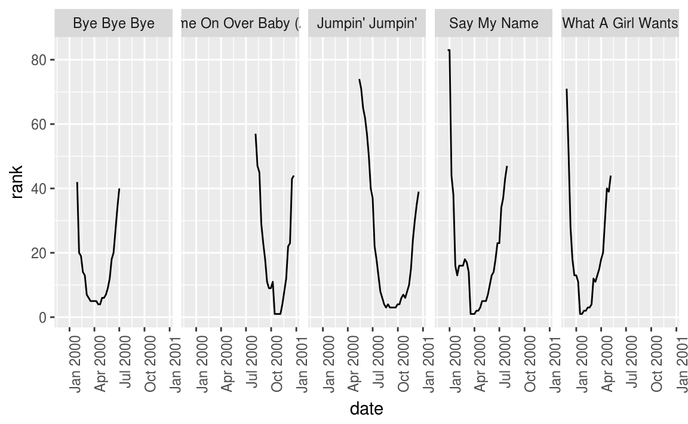

# Manipulación y visualización de datos 

<style>
  .espacio {
     margin-bottom: 1cm;
  }
</style>

<style>
  .espacio3 {
     margin-bottom: 3cm;
  }
</style>

<br>

> "Happy families are all alike; every unhappy family is unhappy
> in its own way." — Leo Tolstoy

> "Tidy datasets are all alike; but every messy dataset is messy
> in its own way." — Hadley Wickham

<br>

Comencemos nuevamente cargando el paquete ``tidyverse``:


```r
library(tidyverse)
```

La visualización es una herramienta importante para generar información. Sin embargo, es muy raro obtener los datos exactamente en la forma en que se necesitan. Es común tener que crear nuevas variables o hacer resúmenes a partir de algunas variables, o tal vez sólo sea necesario cambiar el nombre de las variables o reordenar las observaciones con el fin de facilitar el análisis de datos.

#### Pipeline {-}


La idea de *pipeline* intenta hacer el desarrollo de código más fácil, en menor tiempo, fácil de leerlo, y por lo tanto, más fácil mantenerlo.

En el análisis de datos es común hacer varias operaciones y se vuelve difícil leer y entender el código. La dificultad radica en que usualmente los parámetros se asignan después del nombre de la función usando `()`.

La forma en que esta idea logra hacer las cosas más faciles es con el operador **forwad pipe** `%>%`que envía un valor a una expresión o función. Este cambio en el orden funciona como el parámetro que precede a la función es enviado ("piped") a la función. Es decir, supongamos `x` es una valor y sea `f` una función, entonces, **`x %>% f` es igual a `f(x)`.**


Por ejemplo, sea $f(x)$ la función de probabilidad de la distribución normal con media $\mu = 0$ y desviación estándar $\sigma = 1$:
\[
f(x) = \dfrac{ 1 }{\sqrt{2\pi}} e^{- \frac{1}{2} x^2 }
\]


```r
f <- function(x){
  exp(-(x^2)/2)/sqrt(2*pi)
}
# Con el operador de pipe
0 %>% f
```

```
## [1] 0.3989423
```

que de forma tradicional se realiza:

```r
# Forma tradicional
f(0)
```

```
## [1] 0.3989423
```


En resumen `%>%` funciona como se muestra en la siguiente figura:


**Nota:** Se puede insertar el pipe `%>%` utilizando: Cmd/Ctrl + Shift + M.

<br>
<br>

  ¿Qué hace el siguiente código? ¿Qué hace `.`?


```r
df <- data_frame(
  x = runif(5),
  y = rnorm(5)
)
df %>% .$x
df %>%
  ggplot(data = ., aes(x = x, y = y)) +
    geom_point()
```

<p class="espacio">
</p>
<br>

#### Tibbles {-}

Tibbles son dataframes con algunas modificaciones que permitirán trabajar mejor con los paquetes de limpieza y manipulación de datos `tidyr` y `dplyr`.

Una diferencia son los tipos de columnas que maneja:

* `lgl:` vectores de valores lógicos, vectores que contienen TRUE o FALSE.
* `int`: vectores de números enteros.
* `dbl`: vectores de números reales.
* `chr`: vectores de caracteres, *strings*.

<br>

  Imprime `ds` y `as.data.frame(ds)`. ¿Cuál es la diferencia entre ambas?


```r
ds <- tbl_df(mtcars)
ds
as.data.frame(ds)
```

<p class="espacio">
</p>

\BeginKnitrBlock{information}<div class="information">**Nota:** Para mayor información de este tipo de dataframes consulta la documentación de la libreria `tibble`.</div>\EndKnitrBlock{information}


## El principio de datos limpios

Los principios de datos limpios ([Tidy Data de Hadley Wickham](http://vita.had.co.nz/papers/tidy-data.pdf)) proveen una manera estándar de organizar la información:

1. Cada variable forma una columna.

2. Cada observación forma un renglón.

3. Cada tipo de unidad observacional forma una tabla.

**Nota:** La mayor parte de las bases de datos en estadística tienen forma rectangular por lo que únicamente se trataran este tipo de estructura de datos.

Una **base de datos** es una colección de valores numéricos o categóricos. Cada valor pertenece a una variable y a una observación. Una **variable** contiene los valores del atributo (genero, fabricante, ingreso) de la variable por unidad. Una **observación** contiene todos los valores medidos por la misma unidad (personas, día, autos, municipios) para diferentes atributos.

<br>

### Ejemplo: {-}

Supongamos un experimento con 3 pacientes cada uno tiene resultados de dos tratamientos (A y B):


||tratamientoA|tratamientoB
----|------------|---------
Juan Aguirre|- |2
Ana Bernal  |16|11
José López  |3 |1


La tabla anterior también se puede estructurar de la siguiente manera:

 ||Juan Aguirre| Ana Bernal|José López
--|------------|-----------|----------
tratamientoA|- |    16     |   3
tratamientoB|2 |    11     |   1


Si vemos los principios, entonces ¿las tablas anteriores los cumplen? Para responder la pregunta veamos:

- **¿Cuáles son los valores?**
En total se tienen 18 valores en el conjunto de datos.

- **¿Cuáles son las variables?**
Se tienen tres variables:

1. Persona/nombre: Juan Aguirre, Ana Bernal, y José López
2. Tratamiento: A y B
3. Resultado: -, 2, 16, 11, 3, 1

- **¿Cuáles son las observaciones?**
Existen 6 observaciones.

Entonces, siguiendo los principios de _datos limpios_ obtenemos la siguiente estructura:

nombre|tratamiento|resultado
------------|-----|---------
Juan Aguirre|a    |-
Ana Bernal  |a    |16
José López  |a    |3
Juan Aguirre|b    |2
Ana Bernal  |b    |11
José López  |b    |1

<br>

Una vez que identificamos los problemas de una base de datos podemos proceder a la limpieza.

## Limpieza de datos

Algunos de los problemas más comunes en las bases de datos que no están _limpias_ son:

* Los encabezados de las columnas son valores y no nombres de variables.

* Más de una variable por columna. 

* Las variables están organizadas tanto en filas como en columnas.

* Más de un tipo de observación en una tabla.

* Una misma unidad observacional está almacenada en múltiples tablas. 

La mayor parte de estos problemas se pueden arreglar con pocas herramientas, a continuación veremos como _limpiar_ datos usando dos funciones del paquete *tidyr* de Hadley Wickham:

* **gather**: recibe múltiples columnas y las junta en pares de nombres y valores, convierte los datos anchos en largos.

* **spread**: recibe 2 columnas y las separa, haciendo los datos más anchos.

---

Repasaremos los problemas más comunes que se encuentran en conjuntos de datos sucios y mostraremos cómo se puede manipular la tabla de datos (usando las funciones *gather* y *spread*) con el fin de estructurarla para que cumpla los principios de datos limpios.

#### 1. Los encabezados de las columnas son valores  {-}

Analicemos los datos que provienen de una encuesta de [Pew Research](http://www.pewforum.org/2009/01/30/income-distribution-within-us-religious-groups/) que investiga la relación entre ingreso y afiliación religiosa. ¿Cuáles son las variables en estos datos?


```r
pew <- read_csv("datos/pew.csv")
```

```
## Parsed with column specification:
## cols(
##   religion = col_character(),
##   `<$10k` = col_integer(),
##   `$10-20k` = col_integer(),
##   `$20-30k` = col_integer(),
##   `$30-40k` = col_integer(),
##   `$40-50k` = col_integer(),
##   `$50-75k` = col_integer(),
##   `$75-100k` = col_integer(),
##   `$100-150k` = col_integer(),
##   `>150k` = col_integer(),
##   `Don't know/refused` = col_integer()
## )
```

```r
knitr::kable(pew)
```


religion                   <$10k   $10-20k   $20-30k   $30-40k   $40-50k   $50-75k   $75-100k   $100-150k   >150k   Don't know/refused
------------------------  ------  --------  --------  --------  --------  --------  ---------  ----------  ------  -------------------
Agnostic                      27        34        60        81        76       137        122         109      84                   96
Atheist                       12        27        37        52        35        70         73          59      74                   76
Buddhist                      27        21        30        34        33        58         62          39      53                   54
Catholic                     418       617       732       670       638      1116        949         792     633                 1489
Don’t know/refused            15        14        15        11        10        35         21          17      18                  116
Evangelical Prot             575       869      1064       982       881      1486        949         723     414                 1529
Hindu                          1         9         7         9        11        34         47          48      54                   37
Historically Black Prot      228       244       236       238       197       223        131          81      78                  339
Jehovah's Witness             20        27        24        24        21        30         15          11       6                   37
Jewish                        19        19        25        25        30        95         69          87     151                  162
Mainline Prot                289       495       619       655       651      1107        939         753     634                 1328
Mormon                        29        40        48        51        56       112         85          49      42                   69
Muslim                         6         7         9        10         9        23         16           8       6                   22
Orthodox                      13        17        23        32        32        47         38          42      46                   73
Other Christian                9         7        11        13        13        14         18          14      12                   18
Other Faiths                  20        33        40        46        49        63         46          40      41                   71
Other World Religions          5         2         3         4         2         7          3           4       4                    8
Unaffiliated                 217       299       374       365       341       528        407         321     258                  597

Para _limpiarla_ es necesario apilar las columnas, es decir, pasar los datos a _forma larga_. Esto lo realizaremos con la función `gather()`:


```r
pew_tidy <- pew %>%
  gather(income, frequency, -religion)
# vemos las primeras líneas de nuestros datos alargados
head(pew_tidy)
```

```
## # A tibble: 6 x 3
##   religion           income frequency
##   <chr>              <chr>      <int>
## 1 Agnostic           <$10k         27
## 2 Atheist            <$10k         12
## 3 Buddhist           <$10k         27
## 4 Catholic           <$10k        418
## 5 Don’t know/refused <$10k         15
## 6 Evangelical Prot   <$10k        575
```

La nueva estructura de la base de datos nos permite, por ejemplo, hacer fácilmente una gráfica donde podemos comparar las diferencias en las frecuencias.


```r
ggplot(pew_tidy, aes(x = income, y = frequency, color = religion, group = religion)) +
  geom_line(size = 1) +
  theme(axis.text.x = element_text(angle = 90, hjust = 1)) +
  guides(color = guide_legend(ncol=2))
```


<br>

Podemos hacer gráficas más interesantes si creamos nuevas variables:


```r
library(dplyr)
by_religion <- group_by(pew_tidy, religion)
pew_tidy_2 <- pew_tidy %>%
  filter(income != "Don't know/refused") %>%
  group_by(religion) %>%
  mutate(percent = frequency / sum(frequency)) %>% 
  filter(sum(frequency) > 1000)

head(pew_tidy_2)
```

```
## # A tibble: 6 x 4
## # Groups:   religion [5]
##   religion                income  frequency percent
##   <chr>                   <chr>       <int>   <dbl>
## 1 Catholic                <$10k         418  0.0637
## 2 Evangelical Prot        <$10k         575  0.0724
## 3 Historically Black Prot <$10k         228  0.138 
## 4 Mainline Prot           <$10k         289  0.0471
## 5 Unaffiliated            <$10k         217  0.0698
## 6 Catholic                $10-20k       617  0.0940
```

```r
ggplot(pew_tidy_2, aes(x = income, y = percent, group = religion)) +
  facet_wrap(~ religion, nrow = 1) +
  geom_bar(stat = "identity", fill = "darkgray") + 
  theme(axis.text.x = element_text(angle = 90, hjust = 1))
```


En el código de arriba utilizamos las funciones `group_by`, `filter` y `mutate` que estudiaremos más adelante.

Otro ejemplo, 

```r
billboard <- tbl_df(read.csv("datos/billboard.csv", stringsAsFactors = FALSE))
billboard
```

```
## # A tibble: 317 x 81
##     year artist   track   time  date.entered   wk1   wk2   wk3   wk4   wk5
##    <int> <chr>    <chr>   <chr> <chr>        <int> <int> <int> <int> <int>
##  1  2000 2 Pac    Baby D… 4:22  2000-02-26      87    82    72    77    87
##  2  2000 2Ge+her  The Ha… 3:15  2000-09-02      91    87    92    NA    NA
##  3  2000 3 Doors… Krypto… 3:53  2000-04-08      81    70    68    67    66
##  4  2000 3 Doors… Loser   4:24  2000-10-21      76    76    72    69    67
##  5  2000 504 Boyz Wobble… 3:35  2000-04-15      57    34    25    17    17
##  6  2000 98^0     Give M… 3:24  2000-08-19      51    39    34    26    26
##  7  2000 A*Teens  Dancin… 3:44  2000-07-08      97    97    96    95   100
##  8  2000 Aaliyah  I Don'… 4:15  2000-01-29      84    62    51    41    38
##  9  2000 Aaliyah  Try Ag… 4:03  2000-03-18      59    53    38    28    21
## 10  2000 Adams, … Open M… 5:30  2000-08-26      76    76    74    69    68
## # ... with 307 more rows, and 71 more variables: wk6 <int>, wk7 <int>,
## #   wk8 <int>, wk9 <int>, wk10 <int>, wk11 <int>, wk12 <int>, wk13 <int>,
## #   wk14 <int>, wk15 <int>, wk16 <int>, wk17 <int>, wk18 <int>,
## #   wk19 <int>, wk20 <int>, wk21 <int>, wk22 <int>, wk23 <int>,
## #   wk24 <int>, wk25 <int>, wk26 <int>, wk27 <int>, wk28 <int>,
## #   wk29 <int>, wk30 <int>, wk31 <int>, wk32 <int>, wk33 <int>,
## #   wk34 <int>, wk35 <int>, wk36 <int>, wk37 <int>, wk38 <int>,
## #   wk39 <int>, wk40 <int>, wk41 <int>, wk42 <int>, wk43 <int>,
## #   wk44 <int>, wk45 <int>, wk46 <int>, wk47 <int>, wk48 <int>,
## #   wk49 <int>, wk50 <int>, wk51 <int>, wk52 <int>, wk53 <int>,
## #   wk54 <int>, wk55 <int>, wk56 <int>, wk57 <int>, wk58 <int>,
## #   wk59 <int>, wk60 <int>, wk61 <int>, wk62 <int>, wk63 <int>,
## #   wk64 <int>, wk65 <int>, wk66 <lgl>, wk67 <lgl>, wk68 <lgl>,
## #   wk69 <lgl>, wk70 <lgl>, wk71 <lgl>, wk72 <lgl>, wk73 <lgl>,
## #   wk74 <lgl>, wk75 <lgl>, wk76 <lgl>
```

Queremos apilar las semanas de manera que sea una sola columna (nuevamente alargamos los datos):
  

```r
library(tidyr)
billboard_long <- gather(billboard, week, rank, wk1:wk76,na.rm=TRUE)
billboard_long
```

```
## # A tibble: 5,307 x 7
##     year artist         track               time  date.entered week   rank
##  * <int> <chr>          <chr>               <chr> <chr>        <chr> <int>
##  1  2000 2 Pac          Baby Don't Cry (Ke… 4:22  2000-02-26   wk1      87
##  2  2000 2Ge+her        The Hardest Part O… 3:15  2000-09-02   wk1      91
##  3  2000 3 Doors Down   Kryptonite          3:53  2000-04-08   wk1      81
##  4  2000 3 Doors Down   Loser               4:24  2000-10-21   wk1      76
##  5  2000 504 Boyz       Wobble Wobble       3:35  2000-04-15   wk1      57
##  6  2000 98^0           Give Me Just One N… 3:24  2000-08-19   wk1      51
##  7  2000 A*Teens        Dancing Queen       3:44  2000-07-08   wk1      97
##  8  2000 Aaliyah        I Don't Wanna       4:15  2000-01-29   wk1      84
##  9  2000 Aaliyah        Try Again           4:03  2000-03-18   wk1      59
## 10  2000 Adams, Yolanda Open My Heart       5:30  2000-08-26   wk1      76
## # ... with 5,297 more rows
```

La instrucción na.rm = TRUE se utiliza para eliminar los valores faltantes en 
las columnas wk1 a wk76. Realizamos una limpieza adicional creando mejores 
variables de fecha.


```r
billboard_tidy <- billboard_long %>%
  mutate(
    week = extract_numeric(week),
    date = as.Date(date.entered) + 7 * (week - 1)) %>%
  select(-date.entered)
```

```
## extract_numeric() is deprecated: please use readr::parse_number() instead
```

```r
billboard_tidy
```

```
## # A tibble: 5,307 x 7
##     year artist         track                 time   week  rank date      
##    <int> <chr>          <chr>                 <chr> <dbl> <int> <date>    
##  1  2000 2 Pac          Baby Don't Cry (Keep… 4:22   1.00    87 2000-02-26
##  2  2000 2Ge+her        The Hardest Part Of … 3:15   1.00    91 2000-09-02
##  3  2000 3 Doors Down   Kryptonite            3:53   1.00    81 2000-04-08
##  4  2000 3 Doors Down   Loser                 4:24   1.00    76 2000-10-21
##  5  2000 504 Boyz       Wobble Wobble         3:35   1.00    57 2000-04-15
##  6  2000 98^0           Give Me Just One Nig… 3:24   1.00    51 2000-08-19
##  7  2000 A*Teens        Dancing Queen         3:44   1.00    97 2000-07-08
##  8  2000 Aaliyah        I Don't Wanna         4:15   1.00    84 2000-01-29
##  9  2000 Aaliyah        Try Again             4:03   1.00    59 2000-03-18
## 10  2000 Adams, Yolanda Open My Heart         5:30   1.00    76 2000-08-26
## # ... with 5,297 more rows
```


Nuevamente, podemos hacer gráficas facilmente.


```r
tracks <- billboard_tidy %>%
  filter(track %in% c("Higher", "Amazed", "Kryptonite", "Breathe", "With Arms Wide Open"))

ggplot(tracks, aes(x = date, y = rank)) +
  geom_line() + 
  facet_wrap(~track, nrow = 1) + 
  theme(axis.text.x = element_text(angle = 90, hjust = 1))
```




#### 2. Una columna asociada a más de una variable {-}

La siguiente base de datos proviene de la Organización Mundial de la Salud y
contiene el número de casos confirmados de tuberculosis por país y año, la
información esta por grupo demográfico de acuerdo a sexo (m, f), y
edad (0-4, 5-14, etc).


```r
library(countrycode)
tb <- read_csv("datos/tb.csv")
tb$country_name <- countrycode(tb$iso2, 'iso2c', 'country.name')
tb %>% sample_n(5) %>% knitr::kable()
```


iso2    year   new_sp_m04   new_sp_m514   new_sp_m014   new_sp_m1524   new_sp_m2534   new_sp_m3544   new_sp_m4554   new_sp_m5564   new_sp_m65   new_sp_mu   new_sp_f04   new_sp_f514   new_sp_f014   new_sp_f1524   new_sp_f2534   new_sp_f3544   new_sp_f4554   new_sp_f5564   new_sp_f65   new_sp_fu  country_name 
-----  -----  -----------  ------------  ------------  -------------  -------------  -------------  -------------  -------------  -----------  ----------  -----------  ------------  ------------  -------------  -------------  -------------  -------------  -------------  -----------  ----------  -------------
PA      1981           NA            NA            NA             NA             NA             NA             NA             NA           NA          NA           NA            NA            NA             NA             NA             NA             NA             NA           NA          NA  Panama       
IQ      1995           NA            NA          1125            862           1409           1085            863            900          271          NA           NA            NA           725            304           1208            915            800            886          200          NA  Iraq         
NP      1989           NA            NA            NA             NA             NA             NA             NA             NA           NA          NA           NA            NA            NA             NA             NA             NA             NA             NA           NA          NA  Nepal        
TH      1987           NA            NA            NA             NA             NA             NA             NA             NA           NA          NA           NA            NA            NA             NA             NA             NA             NA             NA           NA          NA  Thailand     
GR      2006            0             0             0             11             32             22             24             22           27           3            0             0             0             13             12              8              5              6           24           1  Greece       

De manera similar, utilizando la función `gather()` se busca apilar las columnas correspondientes a sexo-edad.

**¿Cómo podemos separar la "variable" sexo-edad en dos columnas?**


```r
tb_long <- tb %>%
  gather(demog, casos, new_sp_m04:new_sp_fu, na.rm=TRUE)
knitr::kable(tb_long %>% head(20))
```


iso2    year  country_name           demog         casos
-----  -----  ---------------------  -----------  ------
AD      2005  Andorra                new_sp_m04        0
AD      2006  Andorra                new_sp_m04        0
AD      2008  Andorra                new_sp_m04        0
AE      2006  United Arab Emirates   new_sp_m04        0
AE      2007  United Arab Emirates   new_sp_m04        0
AE      2008  United Arab Emirates   new_sp_m04        0
AG      2007  Antigua and Barbuda    new_sp_m04        0
AL      2005  Albania                new_sp_m04        0
AL      2006  Albania                new_sp_m04        1
AL      2007  Albania                new_sp_m04        0
AL      2008  Albania                new_sp_m04        1
AM      2005  Armenia                new_sp_m04        1
AM      2006  Armenia                new_sp_m04        0
AM      2007  Armenia                new_sp_m04        0
AM      2008  Armenia                new_sp_m04        0
AN      2006  Netherlands Antilles   new_sp_m04        0
AR      2006  Argentina              new_sp_m04       19
AR      2007  Argentina              new_sp_m04       14
AR      2008  Argentina              new_sp_m04       11
AT      2005  Austria                new_sp_m04        1


Las variables sexo y edad se obtienen separando la columna **demog**, para esto se usa la función `separate()`con los siguientes argumentos: `tidyr::separate(data, col = name_variabletoseparate, into = c(vector with names using ""), sep)`


```r
tb_tidy <- tb_long %>%
  separate(col = demog, into = c("sex", "age"), sep = 8)
knitr::kable(tb_tidy %>% head(20))
```


iso2    year  country_name           sex        age    casos
-----  -----  ---------------------  ---------  ----  ------
AD      2005  Andorra                new_sp_m   04         0
AD      2006  Andorra                new_sp_m   04         0
AD      2008  Andorra                new_sp_m   04         0
AE      2006  United Arab Emirates   new_sp_m   04         0
AE      2007  United Arab Emirates   new_sp_m   04         0
AE      2008  United Arab Emirates   new_sp_m   04         0
AG      2007  Antigua and Barbuda    new_sp_m   04         0
AL      2005  Albania                new_sp_m   04         0
AL      2006  Albania                new_sp_m   04         1
AL      2007  Albania                new_sp_m   04         0
AL      2008  Albania                new_sp_m   04         1
AM      2005  Armenia                new_sp_m   04         1
AM      2006  Armenia                new_sp_m   04         0
AM      2007  Armenia                new_sp_m   04         0
AM      2008  Armenia                new_sp_m   04         0
AN      2006  Netherlands Antilles   new_sp_m   04         0
AR      2006  Argentina              new_sp_m   04        19
AR      2007  Argentina              new_sp_m   04        14
AR      2008  Argentina              new_sp_m   04        11
AT      2005  Austria                new_sp_m   04         1

Ahora para hacer mejor variable **sex** y **age** usaremos la función `mutate()` que permite crear nuevas variables sin modificar la dimensión del dataframe.


```r
library(stringr)
tb_tidy <- tb_long %>%
  separate(col = demog, into = c("sex", "age"), sep = 8) %>%
  mutate(sex = str_sub(sex, 8, 8),
         age = factor(age,
                       levels = c("014", "04", "1524", "2534", "3544",
                                  "4554", "514",  "5564", "65","u"),
                       labels = c("0-14", "0-4", "15-24", "25-34", "35-44",
                                  "45-54", "5-14",  "55-64", "65+","unknown")
                       )
          )
knitr::kable(tb_tidy %>% head(20))
```


iso2    year  country_name           sex   age    casos
-----  -----  ---------------------  ----  ----  ------
AD      2005  Andorra                m     0-4        0
AD      2006  Andorra                m     0-4        0
AD      2008  Andorra                m     0-4        0
AE      2006  United Arab Emirates   m     0-4        0
AE      2007  United Arab Emirates   m     0-4        0
AE      2008  United Arab Emirates   m     0-4        0
AG      2007  Antigua and Barbuda    m     0-4        0
AL      2005  Albania                m     0-4        0
AL      2006  Albania                m     0-4        1
AL      2007  Albania                m     0-4        0
AL      2008  Albania                m     0-4        1
AM      2005  Armenia                m     0-4        1
AM      2006  Armenia                m     0-4        0
AM      2007  Armenia                m     0-4        0
AM      2008  Armenia                m     0-4        0
AN      2006  Netherlands Antilles   m     0-4        0
AR      2006  Argentina              m     0-4       19
AR      2007  Argentina              m     0-4       14
AR      2008  Argentina              m     0-4       11
AT      2005  Austria                m     0-4        1

<br>

Se puede separar la columna `demog` en dos variables, sexo y edad, utilizando la función _separate_. Se debe indicar la posición de donde deseamos "cortar":


```r
tb_tidy <- tidyr::separate(tb_long, demog, c("sex", "age"), 8)
tb_tidy %>% sample_n(10) %>% knitr::kable()
```


iso2    year  country_name                       sex        age     casos
-----  -----  ---------------------------------  ---------  -----  ------
BW      1999  Botswana                           new_sp_f   2534      434
SI      2008  Slovenia                           new_sp_m   4554       17
MW      2004  Malawi                             new_sp_m   4554      508
CM      1995  Cameroon                           new_sp_f   5564      106
AT      2000  Austria                            new_sp_m   4554       42
HN      2003  Honduras                           new_sp_m   4554      227
CU      1996  Cuba                               new_sp_m   1524       54
PK      2008  Pakistan                           new_sp_f   3544     8146
JO      2008  Jordan                             new_sp_m   3544        3
GM      1999  Gambia (Islamic Republic of the)   new_sp_f   65         13


#### 3. Variables almacenadas en filas y columnas {-}

El problema más difícil es cuando las variables están tanto en filas como encolumnas, veamos una base de datos de clima en Cuernavaca. ¿Cuáles son las variables en estos datos?


```r
clima <- tbl_df(read.delim("datos/clima.txt", stringsAsFactors=FALSE))
clima
```

```
## # A tibble: 22 x 35
##    id         year month element    d1    d2    d3    d4    d5    d6    d7
##    <chr>     <int> <int> <chr>   <int> <int> <int> <int> <int> <int> <int>
##  1 MX000017…  2010     1 TMAX       NA    NA    NA    NA    NA    NA    NA
##  2 MX000017…  2010     1 TMIN       NA    NA    NA    NA    NA    NA    NA
##  3 MX000017…  2010     2 TMAX       NA   273   241    NA    NA    NA    NA
##  4 MX000017…  2010     2 TMIN       NA   144   144    NA    NA    NA    NA
##  5 MX000017…  2010     3 TMAX       NA    NA    NA    NA   321    NA    NA
##  6 MX000017…  2010     3 TMIN       NA    NA    NA    NA   142    NA    NA
##  7 MX000017…  2010     4 TMAX       NA    NA    NA    NA    NA    NA    NA
##  8 MX000017…  2010     4 TMIN       NA    NA    NA    NA    NA    NA    NA
##  9 MX000017…  2010     5 TMAX       NA    NA    NA    NA    NA    NA    NA
## 10 MX000017…  2010     5 TMIN       NA    NA    NA    NA    NA    NA    NA
## # ... with 12 more rows, and 24 more variables: d8 <int>, d9 <lgl>,
## #   d10 <int>, d11 <int>, d12 <lgl>, d13 <int>, d14 <int>, d15 <int>,
## #   d16 <int>, d17 <int>, d18 <lgl>, d19 <lgl>, d20 <lgl>, d21 <lgl>,
## #   d22 <lgl>, d23 <int>, d24 <lgl>, d25 <int>, d26 <int>, d27 <int>,
## #   d28 <int>, d29 <int>, d30 <int>, d31 <int>
```

Estos datos tienen variables en columnas individuales (id, año, mes), en múltiples columnas (día, d1-d31) y en filas (tmin, tmax). Comencemos por apilar las columnas.


```r
clima_long <- clima %>%
  gather(day, value, d1:d31, na.rm = TRUE)
head(clima_long)
```

```
## # A tibble: 6 x 6
##   id           year month element day   value
##   <chr>       <int> <int> <chr>   <chr> <int>
## 1 MX000017004  2010    12 TMAX    d1      299
## 2 MX000017004  2010    12 TMIN    d1      138
## 3 MX000017004  2010     2 TMAX    d2      273
## 4 MX000017004  2010     2 TMIN    d2      144
## 5 MX000017004  2010    11 TMAX    d2      313
## 6 MX000017004  2010    11 TMIN    d2      163
```

Podemos crear algunas variables adicionales.

```r
clima_vars <- clima_long %>% 
  mutate(day = extract_numeric(day), value = value / 10)  %>%
  select(id, year, month, day, element, value) %>%
  arrange(id, year, month, day)
```

```
## extract_numeric() is deprecated: please use readr::parse_number() instead
```

```r
head(clima_vars)
```

```
## # A tibble: 6 x 6
##   id           year month   day element value
##   <chr>       <int> <int> <dbl> <chr>   <dbl>
## 1 MX000017004  2010     1 30.0  TMAX     27.8
## 2 MX000017004  2010     1 30.0  TMIN     14.5
## 3 MX000017004  2010     2  2.00 TMAX     27.3
## 4 MX000017004  2010     2  2.00 TMIN     14.4
## 5 MX000017004  2010     2  3.00 TMAX     24.1
## 6 MX000017004  2010     2  3.00 TMIN     14.4
```

Finalmente, la columna *element* no es una variable, sino que almacena el nombre de dos variables, la operación que debemos aplicar (spread) es el inverso de apilar (gather):
  

```r
clima_tidy <- clima_vars %>%
  spread(element, value)
head(clima_tidy)
```

```
## # A tibble: 6 x 6
##   id           year month   day  TMAX  TMIN
##   <chr>       <int> <int> <dbl> <dbl> <dbl>
## 1 MX000017004  2010     1 30.0   27.8  14.5
## 2 MX000017004  2010     2  2.00  27.3  14.4
## 3 MX000017004  2010     2  3.00  24.1  14.4
## 4 MX000017004  2010     2 11.0   29.7  13.4
## 5 MX000017004  2010     2 23.0   29.9  10.7
## 6 MX000017004  2010     3  5.00  32.1  14.2
```

Ahora es inmediato no solo hacer gráficas sino también ajustar un modelo.


```r
# ajustamos un modelo lineal donde la variable respuesta es temperatura 
# máxima, y la variable explicativa es el mes
clima_lm <- lm(TMAX ~ factor(month), data = clima_tidy)
summary(clima_lm)
```

```
## 
## Call:
## lm(formula = TMAX ~ factor(month), data = clima_tidy)
## 
## Residuals:
##    Min     1Q Median     3Q    Max 
##  -3.65  -0.92  -0.02   1.05   3.18 
## 
## Coefficients:
##                 Estimate Std. Error t value Pr(>|t|)    
## (Intercept)      27.8000     1.8610  14.938 5.34e-13 ***
## factor(month)2   -0.0500     2.0807  -0.024  0.98104    
## factor(month)3    4.7667     2.1489   2.218  0.03717 *  
## factor(month)4    8.5000     2.6319   3.230  0.00385 ** 
## factor(month)5    5.4000     2.6319   2.052  0.05228 .  
## factor(month)6    1.2500     2.2793   0.548  0.58892    
## factor(month)7    1.4500     2.2793   0.636  0.53123    
## factor(month)8    0.4714     1.9895   0.237  0.81488    
## factor(month)10   1.1000     2.0386   0.540  0.59491    
## factor(month)11   0.3200     2.0386   0.157  0.87670    
## factor(month)12   1.0500     2.2793   0.461  0.64955    
## ---
## Signif. codes:  0 '***' 0.001 '**' 0.01 '*' 0.05 '.' 0.1 ' ' 1
## 
## Residual standard error: 1.861 on 22 degrees of freedom
## Multiple R-squared:  0.6182,	Adjusted R-squared:  0.4447 
## F-statistic: 3.563 on 10 and 22 DF,  p-value: 0.006196
```

#### 4. Mas de un tipo de observación en una misma tabla {-}

En ocasiones las bases de datos involucran valores en diferentes niveles, endiferentes tipos de unidad observacional. En la limpieza de datos, cada unidad observacional debe estar almacenada en su propia tabla (esto esta ligado a normalización de una base de datos), es importante para evitar inconsistencias en los datos.

¿Cuáles son las unidades observacionales de los datos de billboard?


```r
billboard_tidy %>% sample_n(20) %>% knitr::kable()
```


 year  artist              track                     time    week   rank  date       
-----  ------------------  ------------------------  -----  -----  -----  -----------
 2000  Blaque              Bring It All To Me        3:46      15      5  2000-01-29 
 2000  DMX                 Party Up (Up In Here...   3:45      19     44  2000-07-01 
 2000  Smash Mouth         Then The Morning Com...   3:04      22     31  2000-03-25 
 2000  Anthony, Marc       My Baby You               3:59       5     82  2000-10-14 
 2000  Joe                 I Wanna Know              4:57      44     45  2000-10-28 
 2000  Keith, Toby         Country Comes To Tow...   3:39      11     54  2000-10-14 
 2000  McEntire, Reba      I'll Be                   4:23      11     52  2000-07-22 
 2000  Lonestar            Smile                     3:33       9     39  2000-02-12 
 2000  Limp Bizkit         Rollin'                   4:04       6     65  2000-12-16 
 2000  Rimes, LeAnn        Big Deal                  3:03       8     37  1999-12-04 
 2000  Carter, Aaron       Aaron's Party (Come ...   3:23      11     67  2000-11-04 
 2000  Keith, Toby         Country Comes To Tow...   3:39       4     69  2000-08-26 
 2000  Rimes, LeAnn        I Need You                3:42       5     59  2000-06-24 
 2000  Rimes, LeAnn        Can't Fight The Moon...   3:33       2     71  2000-09-16 
 2000  Dixie Chicks, The   Cowboy Take Me Away       4:51       3     70  1999-12-11 
 2000  Hanson              This Time Around          4:14       3     20  2000-05-06 
 2000  Blige, Mary J.      Deep Inside               5:26       4     75  1999-12-04 
 2000  Loveless, Patty     That's The Kind Of M...   3:27      11     71  2000-11-25 
 2000  Chesney, Kenny      What I Need To Do         4:05       6     69  2000-05-06 
 2000  Aaliyah             I Don't Wanna             4:15       7     35  2000-03-11 


Separemos esta base de datos en dos: la tabla canción que almacena artista, nombre de la canción y duración; la tabla rank que almacena el ranking de la canción en cada semana.


```r
song <- billboard_tidy %>% 
  select(artist, track, year, time) %>%
  unique() %>%
  arrange(artist) %>%
  mutate(song_id = row_number(artist))
song %>% knitr::kable()
```


artist                         track                      year  time    song_id
-----------------------------  ------------------------  -----  -----  --------
2 Pac                          Baby Don't Cry (Keep...    2000  4:22          1
2Ge+her                        The Hardest Part Of ...    2000  3:15          2
3 Doors Down                   Kryptonite                 2000  3:53          3
3 Doors Down                   Loser                      2000  4:24          4
504 Boyz                       Wobble Wobble              2000  3:35          5
98^0                           Give Me Just One Nig...    2000  3:24          6
A*Teens                        Dancing Queen              2000  3:44          7
Aaliyah                        I Don't Wanna              2000  4:15          8
Aaliyah                        Try Again                  2000  4:03          9
Adams, Yolanda                 Open My Heart              2000  5:30         10
Adkins, Trace                  More                       2000  3:05         11
Aguilera, Christina            Come On Over Baby (A...    2000  3:38         12
Aguilera, Christina            I Turn To You              2000  4:00         13
Aguilera, Christina            What A Girl Wants          2000  3:18         14
Alice Deejay                   Better Off Alone           2000  6:50         15
Allan, Gary                    Smoke Rings In The D...    2000  4:18         16
Amber                          Sexual                     2000  4:38         17
Anastacia                      I'm Outta Love             2000  4:01         18
Anthony, Marc                  My Baby You                2000  3:59         19
Anthony, Marc                  You Sang To Me             2000  3:50         20
Avant                          My First Love              2000  4:28         21
Avant                          Separated                  2000  4:13         22
Backstreet Boys, The           Shape Of My Heart          2000  3:49         24
Backstreet Boys, The           Show Me The Meaning ...    2000  3:54         25
Backstreet Boys, The           The One                    2000  3:46         26
Badu, Erkyah                   Bag Lady                   2000  5:03         27
Baha Men                       Who Let The Dogs Out       2000  3:17         28
Barenaked Ladies               Pinch Me                   2000  3:46         29
BBMak                          Back Here                  2000  3:35         23
Beenie Man                     Girls Dem Sugar            2000  4:17         30
Before Dark                    Monica                     2000  4:04         31
Bega, Lou                      Tricky Tricky              2000  3:23         32
Big Punisher                   It's So Hard               2000  3:25         33
Black Rob                      Whoa!                      2000  4:04         34
Black, Clint                   Been There                 2000  5:28         35
Blaque                         Bring It All To Me         2000  3:46         36
Blige, Mary J.                 Deep Inside                2000  5:26         37
Blige, Mary J.                 Give Me You                2000  5:00         38
Blink-182                      All The Small Things       2000  2:52         39
Bloodhound Gang                The Bad Touch              2000  4:20         40
Bon Jovi                       It's My Life               2000  3:44         41
Braxton, Toni                  He Wasn't Man Enough       2000  4:21         42
Braxton, Toni                  Just Be A Man About ...    2000  4:10         43
Braxton, Toni                  Spanish Guitar             2000  4:24         44
Brock, Chad                    A Country Boy Can Su...    2000  3:54         45
Brock, Chad                    Yes!                       2000  3:22         46
Brooks & Dunn                  You'll Always Be Lov...    2000  2:58         47
Brooks, Garth                  Do What You Gotta Do       2000  2:56         48
Byrd, Tracy                    Put Your Hand In Min...    2000  4:30         49
Cagle, Chris                   My Love Goes On And ...    2000  3:02         50
Cam'ron                        What Means The World...    2000  4:38         51
Carey, Mariah                  Crybaby                    2000  5:19         52
Carey, Mariah                  Thank God I Found Yo...    2000  4:14         53
Carter, Aaron                  Aaron's Party (Come ...    2000  3:23         54
Carter, Torrey                 Take That                  2000  3:43         55
Changing Faces                 That Other Woman           2000  4:00         56
Chesney, Kenny                 I Lost It                  2000  3:54         57
Chesney, Kenny                 What I Need To Do          2000  4:05         58
Clark Family Experience        Meanwhile Back At Th...    2000  2:56         59
Clark, Terri                   A Little Gasoline          2000  3:07         60
Common                         The Light                  2000  3:55         61
Counting Crows                 Hanginaround               2000  4:07         62
Creed                          Higher                     2000  5:16         63
Creed                          With Arms Wide Open        2000  3:52         64
Cyrus, Billy Ray               You Won't Be Lonely ...    2000  3:45         65
D'Angelo                       Left & Right               2000  4:35         66
D'Angelo                       Untitled (How Does I...    2000  7:10         67
Da Brat                        That's What I'm Look...    2000  3:44         71
Da Brat                        What'Chu Like              2000  3:57         72
Davidson, Clay                 Unconditional              2000  3:56         73
De La Soul                     All Good?                  2000  5:02         74
Destiny's Child                Independent Women Pa...    2000  3:38         75
Destiny's Child                Jumpin' Jumpin'            2000  3:48         76
Destiny's Child                Say My Name                2000  4:31         77
Diffie, Joe                    It's Always Somethin...    2000  2:55         78
Diffie, Joe                    The Quittin' Kind          2000  3:23         79
Dion, Celine                   That's The Way It Is       2000  4:03         80
Dixie Chicks, The              Cold Day In July           2000  5:12         81
Dixie Chicks, The              Cowboy Take Me Away        2000  4:51         82
Dixie Chicks, The              Goodbye Earl               2000  4:19         83
Dixie Chicks, The              Without You                2000  3:32         84
DMX                            Party Up (Up In Here...    2000  3:45         68
DMX                            What You Want              2000  4:05         69
DMX                            What's My Name             2000  3:50         70
Dr. Dre                        Forgot About Dre           2000  3:42         85
Dr. Dre                        The Next Episode           2000  2:38         86
Drama                          Left, Right, Left          2000  3:37         87
Dream                          He Loves U Not             2000  3:43         88
Eastsidaz, The                 G'D Up                     2000  4:27         89
Eastsidaz, The                 Got Beef                   2000  3:58         90
Eiffel 65                      Blue                       2000  3:29         91
Elliott, Missy "Misdemeanor"   Hot Boyz                   2000  3:51         92
Eminem                         Stan                       2000  5:26         93
Eminem                         The Real Slim Shady        2000  4:42         94
Eminem                         The Way I Am               2000  4:40         95
En Vogue                       Riddle                     2000  5:10         96
Estefan, Gloria                No Me Dejes De Quere...    2000  3:25         97
Evans, Sara                    Born To Fly                2000  5:36         98
Eve                            Got It All                 2000  3:48         99
Eve                            Love Is Blind              2000  3:51        100
Everclear                      Wonderful                  2000  4:30        101
Fabian, Lara                   I Will Love Again          2000  3:43        102
Fatboy Slim                    The Rockafeller Skan...    2000  4:00        103
Filter                         Take A Picture             2000  4:23        104
Foo Fighters                   Learn To Fly               2000  3:55        105
Fragma                         Toca's Miracle             2000  3:22        106
Funkmaster Flex                Do You                     2000  4:14        107
Ghostface Killah               Cherchez LaGhost           2000  3:04        108
Gill, Vince                    Feels Like Love            2000  4:13        109
Gilman, Billy                  One Voice                  2000  4:07        110
Ginuwine                       None Of Ur Friends B...    2000  4:12        111
Ginuwine                       The Best Man I Can B...    2000  4:06        112
Goo Goo Dolls                  Broadway                   2000  3:54        113
Gray, Macy                     I Try                      2000  3:52        114
Griggs, Andy                   She's More                 2000  3:19        115
Guy                            Dancin'                    2000  4:08        116
Hanson                         This Time Around           2000  4:14        117
Hart, Beth                     L.A. Song                  2000  3:47        118
Heatherly, Eric                Flowers On The Wall        2000  3:16        119
Henley, Don                    Taking You Home            2000  4:08        120
Herndon, Ty                    No Mercy                   2000  4:43        121
Hill, Faith                    Breathe                    2000  4:04        122
Hill, Faith                    Let's Make Love            2000  4:11        123
Hoku                           Another Dumb Blonde        2000  3:47        124
Hollister, Dave                Can't Stay                 2000  6:17        125
Hot Boys                       I Need A Hot Girl          2000  4:16        126
Houston, Whitney               Could I Have This Ki...    2000  3:54        127
Houston, Whitney               I Learned From The B...    2000  4:18        128
Houston, Whitney               My Love Is Your Love       2000  4:16        129
Houston, Whitney               Same Script, Differe...    2000  4:45        130
Ice Cube                       You Can Do It              2000  4:20        132
Ideal                          Whatever                   2000  3:48        133
Iglesias, Enrique              Be With You                2000  3:36        134
Iglesias, Enrique              Rhythm Divine              2000  7:35        135
IMx                            Stay The Night             2000  3:37        131
J-Shin                         One Night Stand            2000  4:34        136
Ja Rule                        Between Me And You         2000  4:05        137
Jackson, Alan                  It Must Be Love            2000  2:53        138
Jackson, Alan                  Pop A Top                  2000  3:04        139
Jackson, Alan                  www.memory                 2000  2:36        140
Jagged Edge                    He Can't Love U            2000  3:30        141
Jagged Edge                    Let's Get Married          2000  4:23        142
Janet                          Doesn't Really Matte...    2000  4:17        143
Jay-Z                          Anything                   2000  3:41        144
Jay-Z                          Big Pimpin'                2000  3:55        145
Jay-Z                          Do It Again (Put Ya ...    2000  3:47        146
Jay-Z                          Hey Papi                   2000  3:40        147
Jay-Z                          I Just Wanna Love U ...    2000  3:50        148
Jean, Wyclef                   911                        2000  4:00        149
Joe                            I Wanna Know               2000  4:57        150
Joe                            Treat Her Like A Lad...    2000  4:12        151
John, Elton                    Someday Out Of The B...    2000  4:41        152
Jones, Donell                  Where I Wanna Be           2000  6:22        153
Jordan, Montell                Get It On.. Tonite         2000  4:34        154
Juvenile                       U Understand               2000  3:51        155
Kandi                          Don't Think I'm Not        2000  3:50        156
Keith, Toby                    Country Comes To Tow...    2000  3:39        157
Keith, Toby                    How Do You Like Me N...    2000  3:29        158
Kelis                          Caught Out There           2000  4:09        159
Kenny G                        Auld Lang Syne (The ...    2000  7:50        160
Kid Rock                       Only God Knows Why         2000  5:27        161
Kravitz, Lenny                 I Belong To You            2000  4:17        162
Kumbia Kings                   U Don't Love Me            2000  3:50        163
Larrieux, Amel                 Get Up                     2000  4:02        167
Lawrence, Tracy                Lessons Learned            2000  2:55        168
Levert, Gerald                 Baby U Are                 2000  4:10        169
Levert, Gerald                 Mr. Too Damn Good          2000  4:06        170
LFO                            I Don't Wanna Kiss Y...    2000  5:00        164
LFO                            West Side Story            2000  3:27        165
Lil Bow Wow                    Bounce With Me             2000  3:22        171
Lil Wayne                      Tha Block Is Hot           2000  4:13        172
Lil' Kim                       How Many Licks?            2000  3:50        173
Lil' Kim                       No Matter What They ...    2000  4:12        174
Lil' Mo                        Ta Da                      2000  4:17        175
Lil' Zane                      Callin' Me                 2000  3:43        176
Limp Bizkit                    N 2 Gether Now             2000  3:55        177
Limp Bizkit                    Re-Arranged                2000  4:08        178
Limp Bizkit                    Rollin'                    2000  4:04        179
LL Cool J                      Imagine That               2000  4:00        166
Lonestar                       Amazed                     2000  4:25        180
Lonestar                       Smile                      2000  3:33        181
Lonestar                       What About Now             2000  3:30        182
Lopez, Jennifer                Feelin' Good               2000  4:28        183
Loveless, Patty                That's The Kind Of M...    2000  3:27        184
Lox                            Ryde or Die, Chick         2000  3:56        185
Lucy Pearl                     Dance Tonight              2000  3:45        186
Ludacris                       What's Your Fantasy        2000  4:16        187
M2M                            Don't Say You Love M...    2000  3:41        188
M2M                            Mirror Mirror              2000  3:19        189
Madison Avenue                 Don't Call Me Baby         2000  3:44        190
Madonna                        American Pie               2000  4:30        191
Madonna                        Music                      2000  3:45        192
Martin, Ricky                  Private Emotion            2000  4:02        193
Martin, Ricky                  Shake Your Bon-Bon         2000  3:08        194
Martin, Ricky                  She Bangs                  2000  4:02        195
Mary Mary                      Shackles (Praise You...    2000  3:12        196
Master P                       Souljas                    2000  3:33        197
matchbox twenty                Bent                       2000  4:12        317
McBride, Martina               Love's The Only Hous...    2000  5:13        198
McBride, Martina               There You Are              2000  3:26        199
McEntire, Reba                 I'll Be                    2000  4:23        200
McEntire, Reba                 What Do You Say            2000  3:26        201
McGraw, Tim                    My Best Friend             2000  4:33        202
McGraw, Tim                    My Next Thirty Years       2000  3:37        203
McGraw, Tim                    Some Things Never Ch...    2000  3:56        204
McKnight, Brian                Stay Or Let It Go          2000  4:32        205
Messina, Jo Dee                Because You Love Me        2000  3:50        206
Messina, Jo Dee                That's The Way             2000  3:17        207
Metallica                      I Disappear                2000  4:26        208
Metallica                      No Leaf Clover (Live...    2000  5:43        209
Montgomery Gentry              Daddy Won't Sell The...    2000  4:18        210
Montgomery, John Michael       The Little Girl            2000  3:52        211
Moore, Chante                  Straight Up                2000  3:40        212
Moore, Mandy                   I Wanna Be With You        2000  4:12        213
Mumba, Samantha                Gotta Tell You             2000  3:19        214
Musiq                          Just Friends               2000  4:02        215
Mya                            Case Of The Ex (What...    2000  3:50        216
Mya                            The Best Of Me             2000  4:12        217
Mystikal                       Shake Ya Ass               2000  4:46        218
N'Sync                         Bye Bye Bye                2000  3:15        219
N'Sync                         It's Gonna Be Me           2000  3:10        220
N'Sync                         This I Promise You         2000  4:23        221
Nas                            You Owe Me                 2000  3:51        222
Nelly                          (Hot S**t) Country G...    2000  4:17        223
Next                           Wifey                      2000  4:03        224
Nine Days                      Absolutely (Story Of...    2000  3:09        225
Nine Days                      If I Am                    2000  4:18        226
No Doubt                       Simple Kind Of Life        2000  4:11        227
Nu Flavor                      3 Little Words             2000  3:54        228
Offspring, The                 Original Prankster         2000  3:42        229
Paisley, Brad                  Me Neither                 2000  3:19        230
Paisley, Brad                  We Danced                  2000  3:45        231
Papa Roach                     Last Resort                2000  3:19        232
Pearl Jam                      Nothing As It Seems        2000  5:20        233
Pink                           Most Girls                 2000  4:06        234
Pink                           There U Go                 2000  3:23        235
Price, Kelly                   As We Lay                  2000  6:20        236
Price, Kelly                   Love Sets You Free         2000  3:46        237
Price, Kelly                   You Should've Told M...    2000  3:12        238
Profyle                        Liar                       2000  3:57        239
Puff Daddy                     Best Friend                2000  5:33        240
Q-Tip                          Breathe And Stop           2000  4:06        241
R.E.M.                         The Great Beyond           2000  4:10        242
Rascal Flatts                  Prayin' For Daylight       2000  3:36        243
Raye, Collin                   Couldn't Last A Mome...    2000  3:40        244
Red Hot Chili Peppers          Californication            2000  5:21        245
Red Hot Chili Peppers          Otherside                  2000  4:13        246
Rimes, LeAnn                   Big Deal                   2000  3:03        247
Rimes, LeAnn                   Can't Fight The Moon...    2000  3:33        248
Rimes, LeAnn                   I Need You                 2000  3:42        249
Rogers, Kenny                  Buy Me A Rose              2000  3:46        250
Ruff Endz                      No More                    2000  3:56        251
Sammie                         I Like It                  2000  4:09        252
Santana                        Maria, Maria               2000  4:18        253
Savage Garden                  Crash And Burn             2000  4:41        254
Savage Garden                  I Knew I Loved You         2000  4:07        255
SheDaisy                       Deck The Halls             2000  3:46        256
SheDaisy                       I Will.. But               2000  3:40        257
SheDaisy                       This Woman Needs           2000  3:20        258
Sheist, Shade                  Where I Wanna Be           2000  4:16        259
Shyne                          Bad Boyz                   2000  4:22        260
Simpson, Jessica               I Think I'm In Love ...    2000  3:32        261
Simpson, Jessica               Where You Are              2000  3:51        262
Sisqo                          Got To Get It              2000  3:52        263
Sisqo                          Incomplete                 2000  3:52        264
Sisqo                          Thong Song                 2000  4:05        265
Sister Hazel                   Change Your Mind           2000  4:02        266
Smash Mouth                    Then The Morning Com...    2000  3:04        267
Smith, Will                    Freakin' It                2000  3:58        268
Son By Four                    A Puro Dolor (Purest...    2000  3:30        269
Sonique                        It Feels So Good           2000  3:48        270
SoulDecision                   Faded                      2000  3:25        271
Spears, Britney                From The Bottom Of M...    2000  4:30        272
Spears, Britney                Lucky                      2000  3:23        273
Spears, Britney                Oops!.. I Did It Aga...    2000  3:30        274
Spencer, Tracie                Still In My Heart          2000  4:11        275
Splender                       I Think God Can Expl...    2000  3:55        276
Sting                          Desert Rose                2000  3:52        277
Stone Temple Pilots            Sour Girl                  2000  4:16        278
Stone, Angie                   No More Rain (In Thi...    2000  4:42        279
Strait, George                 Go On                      2000  3:48        280
Strait, George                 The Best Day               2000  3:24        281
Sugar Ray                      Falls Apart                2000  4:15        282
Tamar                          If You Don't Wanna L...    2000  4:02        284
Tamia                          Can't Go For That          2000  3:38        285
Third Eye Blind                Deep Inside Of You         2000  4:10        286
Third Eye Blind                Never Let You Go           2000  3:57        287
Thomas, Carl                   Emotional                  2000  4:31        288
Thomas, Carl                   I Wish                     2000  3:50        289
Thomas, Carl                   Summer Rain                2000  4:57        290
Tippin, Aaron                  Kiss This                  2000  2:53        291
TLC                            Dear Lie                   2000  4:36        283
Train                          Meet Virginia              2000  3:55        292
Trick Daddy                    Shut Up                    2000  4:17        293
Trina                          Pull Over                  2000  2:58        294
Tritt, Travis                  Best Of Intentions         2000  4:15        295
Tuesday                        I Know                     2000  4:06        296
Urban, Keith                   Your Everything            2000  4:10        297
Usher                          Pop Ya Collar              2000  3:36        298
Vassar, Phil                   Carlene                    2000  4:07        299
Vassar, Phil                   Just Another Day In ...    2000  3:54        300
Vertical Horizon               Everything You Want        2000  4:01        301
Vertical Horizon               You're A God               2000  3:45        302
Vitamin C                      Graduation (Friends ...    2000  4:23        303
Vitamin C                      The Itch                   2000  3:30        304
Walker, Clay                   Live, Laugh, Love          2000  4:06        305
Walker, Clay                   The Chain Of Love          2000  5:03        306
Wallflowers, The               Sleepwalker                2000  3:29        307
Westlife                       Swear It Again             2000  4:07        308
Williams, Robbie               Angels                     2000  3:56        309
Wills, Mark                    Back At One                2000  4:00        310
Worley, Darryl                 When You Need My Lov...    2000  3:35        311
Wright, Chely                  It Was                     2000  3:51        312
Yankee Grey                    Another Nine Minutes       2000  3:10        313
Yearwood, Trisha               Real Live Woman            2000  3:55        314
Ying Yang Twins                Whistle While You Tw...    2000  4:19        315
Zombie Nation                  Kernkraft 400              2000  3:30        316


```r
rank <- billboard_tidy %>%
  left_join(song, c("artist", "track", "year", "time")) %>%
  select(song_id, date, week, rank) %>%
  arrange(song_id, date) %>%
  tbl_df
rank %>% knitr::kable()
```


 song_id  date          week   rank
--------  -----------  -----  -----
       1  2000-02-26       1     87
       1  2000-03-04       2     82
       1  2000-03-11       3     72
       1  2000-03-18       4     77
       1  2000-03-25       5     87
       1  2000-04-01       6     94
       1  2000-04-08       7     99
       2  2000-09-02       1     91
       2  2000-09-09       2     87
       2  2000-09-16       3     92
       3  2000-04-08       1     81
       3  2000-04-15       2     70
       3  2000-04-22       3     68
       3  2000-04-29       4     67
       3  2000-05-06       5     66
       3  2000-05-13       6     57
       3  2000-05-20       7     54
       3  2000-05-27       8     53
       3  2000-06-03       9     51
       3  2000-06-10      10     51
       3  2000-06-17      11     51
       3  2000-06-24      12     51
       3  2000-07-01      13     47
       3  2000-07-08      14     44
       3  2000-07-15      15     38
       3  2000-07-22      16     28
       3  2000-07-29      17     22
       3  2000-08-05      18     18
       3  2000-08-12      19     18
       3  2000-08-19      20     14
       3  2000-08-26      21     12
       3  2000-09-02      22      7
       3  2000-09-09      23      6
       3  2000-09-16      24      6
       3  2000-09-23      25      6
       3  2000-09-30      26      5
       3  2000-10-07      27      5
       3  2000-10-14      28      4
       3  2000-10-21      29      4
       3  2000-10-28      30      4
       3  2000-11-04      31      4
       3  2000-11-11      32      3
       3  2000-11-18      33      3
       3  2000-11-25      34      3
       3  2000-12-02      35      4
       3  2000-12-09      36      5
       3  2000-12-16      37      5
       3  2000-12-23      38      9
       3  2000-12-30      39      9
       3  2001-01-06      40     15
       3  2001-01-13      41     14
       3  2001-01-20      42     13
       3  2001-01-27      43     14
       3  2001-02-03      44     16
       3  2001-02-10      45     17
       3  2001-02-17      46     21
       3  2001-02-24      47     22
       3  2001-03-03      48     24
       3  2001-03-10      49     28
       3  2001-03-17      50     33
       3  2001-03-24      51     42
       3  2001-03-31      52     42
       3  2001-04-07      53     49
       4  2000-10-21       1     76
       4  2000-10-28       2     76
       4  2000-11-04       3     72
       4  2000-11-11       4     69
       4  2000-11-18       5     67
       4  2000-11-25       6     65
       4  2000-12-02       7     55
       4  2000-12-09       8     59
       4  2000-12-16       9     62
       4  2000-12-23      10     61
       4  2000-12-30      11     61
       4  2001-01-06      12     59
       4  2001-01-13      13     61
       4  2001-01-20      14     66
       4  2001-01-27      15     72
       4  2001-02-03      16     76
       4  2001-02-10      17     75
       4  2001-02-17      18     67
       4  2001-02-24      19     73
       4  2001-03-03      20     70
       5  2000-04-15       1     57
       5  2000-04-22       2     34
       5  2000-04-29       3     25
       5  2000-05-06       4     17
       5  2000-05-13       5     17
       5  2000-05-20       6     31
       5  2000-05-27       7     36
       5  2000-06-03       8     49
       5  2000-06-10       9     53
       5  2000-06-17      10     57
       5  2000-06-24      11     64
       5  2000-07-01      12     70
       5  2000-07-08      13     75
       5  2000-07-15      14     76
       5  2000-07-22      15     78
       5  2000-07-29      16     85
       5  2000-08-05      17     92
       5  2000-08-12      18     96
       6  2000-08-19       1     51
       6  2000-08-26       2     39
       6  2000-09-02       3     34
       6  2000-09-09       4     26
       6  2000-09-16       5     26
       6  2000-09-23       6     19
       6  2000-09-30       7      2
       6  2000-10-07       8      2
       6  2000-10-14       9      3
       6  2000-10-21      10      6
       6  2000-10-28      11      7
       6  2000-11-04      12     22
       6  2000-11-11      13     29
       6  2000-11-18      14     36
       6  2000-11-25      15     47
       6  2000-12-02      16     67
       6  2000-12-09      17     66
       6  2000-12-16      18     84
       6  2000-12-23      19     93
       6  2000-12-30      20     94
       7  2000-07-08       1     97
       7  2000-07-15       2     97
       7  2000-07-22       3     96
       7  2000-07-29       4     95
       7  2000-08-05       5    100
       8  2000-01-29       1     84
       8  2000-02-05       2     62
       8  2000-02-12       3     51
       8  2000-02-19       4     41
       8  2000-02-26       5     38
       8  2000-03-04       6     35
       8  2000-03-11       7     35
       8  2000-03-18       8     38
       8  2000-03-25       9     38
       8  2000-04-01      10     36
       8  2000-04-08      11     37
       8  2000-04-15      12     37
       8  2000-04-22      13     38
       8  2000-04-29      14     49
       8  2000-05-06      15     61
       8  2000-05-13      16     63
       8  2000-05-20      17     62
       8  2000-05-27      18     67
       8  2000-06-03      19     83
       8  2000-06-10      20     86
       9  2000-03-18       1     59
       9  2000-03-25       2     53
       9  2000-04-01       3     38
       9  2000-04-08       4     28
       9  2000-04-15       5     21
       9  2000-04-22       6     18
       9  2000-04-29       7     16
       9  2000-05-06       8     14
       9  2000-05-13       9     12
       9  2000-05-20      10     10
       9  2000-05-27      11      9
       9  2000-06-03      12      8
       9  2000-06-10      13      6
       9  2000-06-17      14      1
       9  2000-06-24      15      2
       9  2000-07-01      16      2
       9  2000-07-08      17      2
       9  2000-07-15      18      2
       9  2000-07-22      19      3
       9  2000-07-29      20      4
       9  2000-08-05      21      5
       9  2000-08-12      22      5
       9  2000-08-19      23      6
       9  2000-08-26      24      9
       9  2000-09-02      25     13
       9  2000-09-09      26     14
       9  2000-09-16      27     16
       9  2000-09-23      28     23
       9  2000-09-30      29     22
       9  2000-10-07      30     33
       9  2000-10-14      31     36
       9  2000-10-21      32     43
      10  2000-08-26       1     76
      10  2000-09-02       2     76
      10  2000-09-09       3     74
      10  2000-09-16       4     69
      10  2000-09-23       5     68
      10  2000-09-30       6     67
      10  2000-10-07       7     61
      10  2000-10-14       8     58
      10  2000-10-21       9     57
      10  2000-10-28      10     59
      10  2000-11-04      11     66
      10  2000-11-11      12     68
      10  2000-11-18      13     61
      10  2000-11-25      14     67
      10  2000-12-02      15     59
      10  2000-12-09      16     63
      10  2000-12-16      17     67
      10  2000-12-23      18     71
      10  2000-12-30      19     79
      10  2001-01-06      20     89
      11  2000-04-29       1     84
      11  2000-05-06       2     84
      11  2000-05-13       3     75
      11  2000-05-20       4     73
      11  2000-05-27       5     73
      11  2000-06-03       6     69
      11  2000-06-10       7     68
      11  2000-06-17       8     65
      11  2000-06-24       9     73
      11  2000-07-01      10     83
      11  2000-07-08      11     92
      12  2000-08-05       1     57
      12  2000-08-12       2     47
      12  2000-08-19       3     45
      12  2000-08-26       4     29
      12  2000-09-02       5     23
      12  2000-09-09       6     18
      12  2000-09-16       7     11
      12  2000-09-23       8      9
      12  2000-09-30       9      9
      12  2000-10-07      10     11
      12  2000-10-14      11      1
      12  2000-10-21      12      1
      12  2000-10-28      13      1
      12  2000-11-04      14      1
      12  2000-11-11      15      4
      12  2000-11-18      16      8
      12  2000-11-25      17     12
      12  2000-12-02      18     22
      12  2000-12-09      19     23
      12  2000-12-16      20     43
      12  2000-12-23      21     44
      13  2000-04-15       1     50
      13  2000-04-22       2     39
      13  2000-04-29       3     30
      13  2000-05-06       4     28
      13  2000-05-13       5     21
      13  2000-05-20       6     19
      13  2000-05-27       7     20
      13  2000-06-03       8     17
      13  2000-06-10       9     17
      13  2000-06-17      10     17
      13  2000-06-24      11     17
      13  2000-07-01      12      3
      13  2000-07-08      13      3
      13  2000-07-15      14      7
      13  2000-07-22      15     10
      13  2000-07-29      16     17
      13  2000-08-05      17     25
      13  2000-08-12      18     29
      13  2000-08-19      19     29
      13  2000-08-26      20     40
      13  2000-09-02      21     43
      13  2000-09-09      22     50
      14  1999-11-27       1     71
      14  1999-12-04       2     51
      14  1999-12-11       3     28
      14  1999-12-18       4     18
      14  1999-12-25       5     13
      14  2000-01-01       6     13
      14  2000-01-08       7     11
      14  2000-01-15       8      1
      14  2000-01-22       9      1
      14  2000-01-29      10      2
      14  2000-02-05      11      2
      14  2000-02-12      12      3
      14  2000-02-19      13      3
      14  2000-02-26      14      4
      14  2000-03-04      15     12
      14  2000-03-11      16     11
      14  2000-03-18      17     13
      14  2000-03-25      18     15
      14  2000-04-01      19     18
      14  2000-04-08      20     20
      14  2000-04-15      21     30
      14  2000-04-22      22     40
      14  2000-04-29      23     39
      14  2000-05-06      24     44
      15  2000-04-08       1     79
      15  2000-04-15       2     65
      15  2000-04-22       3     53
      15  2000-04-29       4     48
      15  2000-05-06       5     45
      15  2000-05-13       6     36
      15  2000-05-20       7     34
      15  2000-05-27       8     29
      15  2000-06-03       9     27
      15  2000-06-10      10     30
      15  2000-06-17      11     36
      15  2000-06-24      12     37
      15  2000-07-01      13     39
      15  2000-07-08      14     49
      15  2000-07-15      15     57
      15  2000-07-22      16     63
      15  2000-07-29      17     65
      15  2000-08-05      18     68
      15  2000-08-12      19     79
      15  2000-08-19      20     86
      16  2000-01-22       1     80
      16  2000-01-29       2     78
      16  2000-02-05       3     76
      16  2000-02-12       4     77
      16  2000-02-19       5     92
      17  1999-07-17       1     99
      17  1999-07-24       2     99
      17  1999-07-31       3     96
      17  1999-08-07       4     96
      17  1999-08-14       5    100
      17  1999-08-21       6     93
      17  1999-08-28       7     93
      17  1999-09-04       8     96
      17  1999-09-25      11     99
      17  1999-10-09      13     96
      17  1999-10-16      14     96
      17  1999-10-23      15     99
      17  1999-10-30      16     98
      17  1999-11-06      17     98
      17  1999-11-20      19     95
      17  1999-11-27      20     88
      17  1999-12-04      21     88
      17  1999-12-11      22     79
      17  1999-12-18      23     76
      17  1999-12-25      24     69
      17  2000-01-01      25     69
      17  2000-01-08      26     59
      17  2000-01-15      27     58
      17  2000-01-22      28     58
      17  2000-01-29      29     49
      17  2000-02-05      30     44
      17  2000-02-12      31     42
      17  2000-02-19      32     46
      17  2000-02-26      33     50
      18  2000-04-01       1     92
      18  2000-04-22       4     95
      18  2000-06-17      12     97
      19  2000-09-16       1     82
      19  2000-09-23       2     76
      19  2000-09-30       3     76
      19  2000-10-07       4     70
      19  2000-10-14       5     82
      19  2000-10-21       6     81
      19  2000-10-28       7     74
      19  2000-11-04       8     80
      19  2000-11-11       9     76
      19  2000-11-18      10     76
      19  2000-11-25      11     73
      19  2000-12-02      12     74
      19  2000-12-09      13     87
      19  2000-12-16      14     83
      19  2000-12-23      15     89
      19  2000-12-30      16     93
      19  2001-01-06      17     94
      19  2001-01-13      18     94
      19  2001-01-20      19     91
      19  2001-01-27      20     90
      20  2000-02-26       1     77
      20  2000-03-04       2     54
      20  2000-03-11       3     50
      20  2000-03-18       4     43
      20  2000-03-25       5     30
      20  2000-04-01       6     27
      20  2000-04-08       7     21
      20  2000-04-15       8     18
      20  2000-04-22       9     15
      20  2000-04-29      10     13
      20  2000-05-06      11     13
      20  2000-05-13      12     13
      20  2000-05-20      13     13
      20  2000-05-27      14      5
      20  2000-06-03      15      2
      20  2000-06-10      16      2
      20  2000-06-17      17      5
      20  2000-06-24      18      7
      20  2000-07-01      19      9
      20  2000-07-08      20     12
      20  2000-07-15      21     12
      20  2000-07-22      22     16
      20  2000-07-29      23     20
      20  2000-08-05      24     20
      20  2000-08-12      25     22
      20  2000-08-19      26     25
      20  2000-08-26      27     26
      20  2000-09-02      28     29
      20  2000-09-09      29     35
      20  2000-09-16      30     33
      20  2000-09-23      31     40
      20  2000-09-30      32     44
      21  2000-11-04       1     70
      21  2000-11-11       2     62
      21  2000-11-18       3     56
      21  2000-11-25       4     43
      21  2000-12-02       5     39
      21  2000-12-09       6     33
      21  2000-12-16       7     26
      21  2000-12-23       8     26
      21  2000-12-30       9     26
      21  2001-01-06      10     31
      21  2001-01-13      11     32
      21  2001-01-20      12     31
      21  2001-01-27      13     38
      21  2001-02-03      14     38
      21  2001-02-10      15     52
      21  2001-02-17      16     57
      21  2001-02-24      17     64
      21  2001-03-03      18     73
      21  2001-03-10      19     81
      21  2001-03-17      20     79
      22  2000-04-29       1     62
      22  2000-05-06       2     32
      22  2000-05-13       3     30
      22  2000-05-20       4     23
      22  2000-05-27       5     26
      22  2000-06-03       6     30
      22  2000-06-10       7     35
      22  2000-06-17       8     32
      22  2000-06-24       9     32
      22  2000-07-01      10     25
      22  2000-07-08      11     23
      22  2000-07-15      12     28
      22  2000-07-22      13     27
      22  2000-07-29      14     29
      22  2000-08-05      15     27
      22  2000-08-12      16     31
      22  2000-08-19      17     31
      22  2000-08-26      18     33
      22  2000-09-02      19     40
      22  2000-09-09      20     51
      23  2000-04-29       1     99
      23  2000-05-06       2     86
      23  2000-05-13       3     60
      23  2000-05-20       4     52
      23  2000-05-27       5     38
      23  2000-06-03       6     34
      23  2000-06-10       7     28
      23  2000-06-17       8     21
      23  2000-06-24       9     18
      23  2000-07-01      10     18
      23  2000-07-08      11     19
      23  2000-07-15      12     15
      23  2000-07-22      13     18
      23  2000-07-29      14     13
      23  2000-08-05      15     16
      23  2000-08-12      16     15
      23  2000-08-19      17     16
      23  2000-08-26      18     16
      23  2000-09-02      19     17
      23  2000-09-09      20     15
      23  2000-09-16      21     18
      23  2000-09-23      22     17
      23  2000-09-30      23     16
      23  2000-10-07      24     22
      23  2000-10-14      25     24
      23  2000-10-21      26     30
      23  2000-10-28      27     36
      23  2000-11-04      28     37
      23  2000-11-11      29     42
      23  2000-11-18      30     45
      23  2000-11-25      31     49
      24  2000-10-14       1     39
      24  2000-10-21       2     25
      24  2000-10-28       3     24
      24  2000-11-04       4     15
      24  2000-11-11       5     12
      24  2000-11-18       6     12
      24  2000-11-25       7     10
      24  2000-12-02       8      9
      24  2000-12-09       9     10
      24  2000-12-16      10     12
      24  2000-12-23      11     17
      24  2000-12-30      12     19
      24  2001-01-06      13     29
      24  2001-01-13      14     26
      24  2001-01-20      15     24
      24  2001-01-27      16     31
      24  2001-02-03      17     52
      24  2001-02-10      18     63
      24  2001-02-17      19     62
      24  2001-02-24      20     70
      25  2000-01-01       1     74
      25  2000-01-08       2     62
      25  2000-01-15       3     55
      25  2000-01-22       4     25
      25  2000-01-29       5     16
      25  2000-02-05       6     14
      25  2000-02-12       7     12
      25  2000-02-19       8     10
      25  2000-02-26       9     12
      25  2000-03-04      10      9
      25  2000-03-11      11      7
      25  2000-03-18      12      6
      25  2000-03-25      13      6
      25  2000-04-01      14      6
      25  2000-04-08      15      8
      25  2000-04-15      16      9
      25  2000-04-22      17     13
      25  2000-04-29      18     19
      25  2000-05-06      19     23
      25  2000-05-13      20     26
      25  2000-05-20      21     32
      25  2000-05-27      22     34
      25  2000-06-03      23     45
      25  2000-06-10      24     47
      26  2000-05-27       1     58
      26  2000-06-03       2     50
      26  2000-06-10       3     43
      26  2000-06-17       4     37
      26  2000-06-24       5     31
      26  2000-07-01       6     30
      26  2000-07-08       7     39
      26  2000-07-15       8     47
      26  2000-07-22       9     55
      26  2000-07-29      10     61
      26  2000-08-05      11     76
      26  2000-08-12      12     90
      26  2000-08-19      13     93
      26  2000-08-26      14     93
      26  2000-09-02      15    100
      27  2000-08-19       1     67
      27  2000-08-26       2     53
      27  2000-09-02       3     42
      27  2000-09-09       4     41
      27  2000-09-16       5     48
      27  2000-09-23       6     42
      27  2000-09-30       7     34
      27  2000-10-07       8      6
      27  2000-10-14       9      9
      27  2000-10-21      10      9
      27  2000-10-28      11      8
      27  2000-11-04      12     11
      27  2000-11-11      13     15
      27  2000-11-18      14     21
      27  2000-11-25      15     26
      27  2000-12-02      16     29
      27  2000-12-09      17     26
      27  2000-12-16      18     38
      27  2000-12-23      19     56
      27  2000-12-30      20     66
      28  2000-07-22       1     99
      28  2000-07-29       2     92
      28  2000-08-05       3     85
      28  2000-08-12       4     76
      28  2000-08-19       5     65
      28  2000-08-26       6     54
      28  2000-09-02       7     61
      28  2000-09-09       8     58
      28  2000-09-16       9     54
      28  2000-09-23      10     54
      28  2000-09-30      11     53
      28  2000-10-07      12     53
      28  2000-10-14      13     43
      28  2000-10-21      14     40
      28  2000-10-28      15     44
      28  2000-11-04      16     41
      28  2000-11-11      17     51
      28  2000-11-18      18     65
      28  2000-11-25      19     78
      28  2000-12-02      20     84
      29  2000-09-09       1     77
      29  2000-09-16       2     76
      29  2000-09-23       3     69
      29  2000-09-30       4     45
      29  2000-10-07       5     51
      29  2000-10-14       6     37
      29  2000-10-21       7     33
      29  2000-10-28       8     29
      29  2000-11-04       9     26
      29  2000-11-11      10     25
      29  2000-11-18      11     16
      29  2000-11-25      12     15
      29  2000-12-02      13     15
      29  2000-12-09      14     19
      29  2000-12-16      15     19
      29  2000-12-23      16     20
      29  2000-12-30      17     22
      29  2001-01-06      18     20
      29  2001-01-13      19     21
      29  2001-01-20      20     34
      29  2001-01-27      21     44
      30  2000-10-21       1     72
      30  2000-10-28       2     72
      30  2000-11-04       3     63
      30  2000-11-11       4     56
      30  2000-11-18       5     62
      30  2000-11-25       6     63
      30  2000-12-02       7     54
      30  2000-12-09       8     60
      30  2000-12-16       9     69
      30  2000-12-23      10     75
      30  2000-12-30      11     84
      30  2001-01-06      12     92
      30  2001-01-13      13     85
      30  2001-01-20      14     84
      30  2001-01-27      15     95
      31  2000-05-20       1     95
      31  2000-05-27       2     87
      31  2000-06-03       3     80
      31  2000-06-10       4     80
      31  2000-06-17       5     77
      31  2000-06-24       6     87
      31  2000-07-01       7     91
      31  2000-07-08       8     91
      31  2000-07-15       9    100
      32  2000-01-29       1     75
      32  2000-02-05       2     74
      32  2000-02-12       3     87
      33  2000-04-22       1     96
      33  2000-04-29       2     87
      33  2000-05-06       3     75
      33  2000-05-13       4     79
      33  2000-05-20       5     81
      33  2000-05-27       6     81
      33  2000-06-03       7     76
      33  2000-06-10       8     76
      33  2000-06-17       9     78
      33  2000-06-24      10     84
      33  2000-07-01      11     90
      33  2000-07-08      12     88
      33  2000-07-15      13     94
      33  2000-07-22      14     98
      33  2000-07-29      15    100
      34  2000-03-04       1     78
      34  2000-03-11       2     59
      34  2000-03-18       3     53
      34  2000-03-25       4     52
      34  2000-04-01       5     47
      34  2000-04-08       6     46
      34  2000-04-15       7     43
      34  2000-04-22       8     47
      34  2000-04-29       9     47
      34  2000-05-06      10     58
      34  2000-05-13      11     54
      34  2000-05-20      12     57
      34  2000-05-27      13     70
      34  2000-06-03      14     85
      34  2000-06-10      15     84
      34  2000-06-17      16     93
      34  2000-06-24      17     97
      35  2000-02-19       1     87
      35  2000-02-26       2     73
      35  2000-03-04       3     62
      35  2000-03-11       4     58
      35  2000-03-18       5     58
      35  2000-03-25       6     57
      35  2000-04-01       7     51
      35  2000-04-08       8     47
      35  2000-04-15       9     44
      35  2000-04-22      10     44
      35  2000-04-29      11     44
      35  2000-05-06      12     55
      35  2000-05-13      13     53
      35  2000-05-20      14     53
      35  2000-05-27      15     63
      35  2000-06-03      16     84
      35  2000-06-10      17     85
      35  2000-06-17      18     87
      35  2000-06-24      19     95
      35  2000-07-01      20    100
      36  1999-10-23       1     73
      36  1999-10-30       2     63
      36  1999-11-06       3     50
      36  1999-11-13       4     42
      36  1999-11-20       5     24
      36  1999-11-27       6     19
      36  1999-12-04       7     17
      36  1999-12-11       8     14
      36  1999-12-18       9     11
      36  1999-12-25      10      9
      36  2000-01-01      11      9
      36  2000-01-08      12      9
      36  2000-01-15      13     10
      36  2000-01-22      14      5
      36  2000-01-29      15      5
      36  2000-02-05      16      6
      36  2000-02-12      17      8
      36  2000-02-19      18      9
      36  2000-02-26      19     15
      36  2000-03-04      20     15
      36  2000-03-11      21     18
      36  2000-03-18      22     17
      36  2000-03-25      23     18
      36  2000-04-01      24     19
      36  2000-04-08      25     19
      36  2000-04-15      26     22
      36  2000-04-22      27     26
      36  2000-04-29      28     32
      36  2000-05-06      29     42
      37  1999-11-13       1     83
      37  1999-11-20       2     80
      37  1999-11-27       3     80
      37  1999-12-04       4     75
      37  1999-12-11       5     75
      37  1999-12-18       6     73
      37  1999-12-25       7     64
      37  2000-01-01       8     64
      37  2000-01-08       9     65
      37  2000-01-15      10     67
      37  2000-01-22      11     63
      37  2000-01-29      12     67
      37  2000-02-05      13     75
      37  2000-02-12      14     85
      37  2000-02-19      15     94
      38  2000-04-15       1     97
      38  2000-04-22       2     94
      38  2000-04-29       3     77
      38  2000-05-06       4     76
      38  2000-05-13       5     68
      38  2000-05-20       6     77
      38  2000-05-27       7     89
      38  2000-06-03       8     90
      38  2000-06-17      10    100
      39  1999-12-04       1     89
      39  1999-12-11       2     76
      39  1999-12-18       3     69
      39  1999-12-25       4     59
      39  2000-01-01       5     59
      39  2000-01-08       6     51
      39  2000-01-15       7     50
      39  2000-01-22       8     35
      39  2000-01-29       9     26
      39  2000-02-05      10     15
      39  2000-02-12      11      7
      39  2000-02-19      12      6
      39  2000-02-26      13      8
      39  2000-03-04      14      8
      39  2000-03-11      15      9
      39  2000-03-18      16     11
      39  2000-03-25      17     14
      39  2000-04-01      18     16
      39  2000-04-08      19     18
      39  2000-04-15      20     23
      39  2000-04-22      21     33
      39  2000-04-29      22     41
      39  2000-05-06      23     43
      40  2000-03-18       1     70
      40  2000-03-25       2     62
      40  2000-04-01       3     55
      40  2000-04-08       4     55
      40  2000-04-15       5     52
      40  2000-04-22       6     57
      40  2000-04-29       7     72
      40  2000-05-06       8     80
      40  2000-05-13       9     82
      40  2000-05-20      10     92
      40  2000-05-27      11     96
      40  2000-06-03      12     98
      41  2000-08-12       1     64
      41  2000-08-19       2     58
      41  2000-08-26       3     51
      41  2000-09-02       4     51
      41  2000-09-09       5     48
      41  2000-09-16       6     45
      41  2000-09-23       7     36
      41  2000-09-30       8     33
      41  2000-10-07       9     34
      41  2000-10-14      10     34
      41  2000-10-21      11     35
      41  2000-10-28      12     34
      41  2000-11-04      13     39
      41  2000-11-11      14     44
      41  2000-11-18      15     51
      41  2000-11-25      16     58
      41  2000-12-02      17     61
      41  2000-12-09      18     84
      41  2000-12-16      19     85
      41  2000-12-23      20     87
      42  2000-03-18       1     63
      42  2000-03-25       2     55
      42  2000-04-01       3     48
      42  2000-04-08       4     39
      42  2000-04-15       5     35
      42  2000-04-22       6     24
      42  2000-04-29       7      3
      42  2000-05-06       8      2
      42  2000-05-13       9      2
      42  2000-05-20      10      4
      42  2000-05-27      11      4
      42  2000-06-03      12      5
      42  2000-06-10      13     11
      42  2000-06-17      14     12
      42  2000-06-24      15     16
      42  2000-07-01      16     15
      42  2000-07-08      17     14
      42  2000-07-15      18     14
      42  2000-07-22      19     12
      42  2000-07-29      20     10
      42  2000-08-05      21     11
      42  2000-08-12      22     13
      42  2000-08-19      23     13
      42  2000-08-26      24     13
      42  2000-09-02      25     15
      42  2000-09-09      26     16
      42  2000-09-16      27     14
      42  2000-09-23      28     13
      42  2000-09-30      29     17
      42  2000-10-07      30     19
      42  2000-10-14      31     23
      42  2000-10-21      32     29
      42  2000-10-28      33     37
      42  2000-11-04      34     33
      42  2000-11-11      35     34
      42  2000-11-18      36     41
      42  2000-11-25      37     48
      43  2000-07-29       1     76
      43  2000-08-05       2     69
      43  2000-08-12       3     51
      43  2000-08-19       4     42
      43  2000-08-26       5     37
      43  2000-09-02       6     32
      43  2000-09-09       7     32
      43  2000-09-16       8     34
      43  2000-09-23       9     34
      43  2000-09-30      10     38
      43  2000-10-07      11     50
      43  2000-10-14      12     53
      43  2000-10-21      13     53
      43  2000-10-28      14     63
      43  2000-11-04      15     65
      43  2000-11-11      16     72
      43  2000-11-18      17     79
      43  2000-11-25      18     84
      43  2000-12-02      19     89
      43  2000-12-09      20     90
      44  2000-12-02       1     98
      44  2000-12-09       2     98
      44  2000-12-16       3     98
      45  2000-01-01       1     93
      45  2000-01-08       2     75
      45  2000-01-15       3     92
      46  2000-04-08       1     90
      46  2000-04-15       2     77
      46  2000-04-22       3     66
      46  2000-04-29       4     61
      46  2000-05-06       5     59
      46  2000-05-13       6     47
      46  2000-05-20       7     39
      46  2000-05-27       8     33
      46  2000-06-03       9     32
      46  2000-06-10      10     31
      46  2000-06-17      11     28
      46  2000-06-24      12     27
      46  2000-07-01      13     22
      46  2000-07-08      14     27
      46  2000-07-15      15     31
      46  2000-07-22      16     39
      46  2000-07-29      17     45
      46  2000-08-05      18     50
      46  2000-08-12      19     53
      46  2000-08-19      20     59
      47  2000-06-10       1     95
      47  2000-06-17       2     85
      47  2000-06-24       3     85
      47  2000-07-01       4     85
      47  2000-07-08       5     83
      47  2000-07-15       6     83
      47  2000-07-22       7     82
      47  2000-07-29       8     74
      47  2000-08-05       9     74
      47  2000-08-12      10     68
      47  2000-08-19      11     62
      47  2000-08-26      12     56
      47  2000-09-02      13     56
      47  2000-09-09      14     55
      47  2000-09-16      15     62
      47  2000-09-23      16     71
      47  2000-09-30      17     86
      47  2000-10-07      18    100
      47  2000-10-14      19     98
      48  2000-02-19       1     86
      48  2000-02-26       2     81
      48  2000-03-04       3     72
      48  2000-03-11       4     70
      48  2000-03-18       5     69
      48  2000-03-25       6     77
      49  2000-01-29       1     81
      49  2000-02-05       2     77
      49  2000-02-12       3     76
      49  2000-02-19       4     76
      49  2000-02-26       5     86
      49  2000-03-04       6     88
      49  2000-03-11       7     92
      49  2000-03-18       8     99
      50  2000-10-21       1     99
      50  2000-10-28       2     94
      50  2000-11-04       3     94
      50  2000-11-11       4     87
      50  2000-11-18       5     84
      50  2000-11-25       6     83
      50  2000-12-02       7     76
      50  2000-12-09       8     76
      50  2000-12-16       9     79
      50  2000-12-23      10     83
      50  2000-12-30      11     91
      51  2000-10-14       1     94
      51  2000-10-21       2     94
      51  2000-10-28       3     96
      51  2000-11-04       4     91
      51  2000-11-11       5     84
      51  2000-11-18       6     83
      51  2000-11-25       7     88
      51  2000-12-02       8     87
      51  2000-12-09       9     95
      51  2000-12-16      10     92
      52  2000-06-24       1     28
      52  2000-07-01       2     34
      52  2000-07-08       3     48
      52  2000-07-15       4     62
      52  2000-07-22       5     77
      52  2000-07-29       6     90
      52  2000-08-05       7     95
      53  1999-12-11       1     82
      53  1999-12-18       2     68
      53  1999-12-25       3     50
      53  2000-01-01       4     50
      53  2000-01-08       5     41
      53  2000-01-15       6     37
      53  2000-01-22       7     26
      53  2000-01-29       8     22
      53  2000-02-05       9     22
      53  2000-02-12      10      2
      53  2000-02-19      11      1
      53  2000-02-26      12      2
      53  2000-03-04      13      4
      53  2000-03-11      14     13
      53  2000-03-18      15     21
      53  2000-03-25      16     28
      53  2000-04-01      17     43
      53  2000-04-08      18     57
      53  2000-04-15      19     82
      53  2000-04-22      20     89
      54  2000-08-26       1     99
      54  2000-09-02       2     75
      54  2000-09-09       3     57
      54  2000-09-16       4     35
      54  2000-09-23       5     35
      54  2000-09-30       6     37
      54  2000-10-07       7     43
      54  2000-10-14       8     79
      54  2000-10-21       9     51
      54  2000-10-28      10     55
      54  2000-11-04      11     67
      54  2000-11-11      12     83
      54  2000-11-18      13     86
      54  2000-11-25      14     92
      54  2000-12-02      15    100
      55  2000-06-24       1     94
      55  2000-07-01       2     88
      55  2000-07-08       3     86
      55  2000-07-15       4     91
      55  2000-07-22       5     89
      55  2000-07-29       6     87
      55  2000-08-05       7     99
      56  2000-09-30       1     80
      56  2000-10-07       2     72
      56  2000-10-14       3     66
      56  2000-10-21       4     66
      56  2000-10-28       5     64
      56  2000-11-04       6     76
      56  2000-11-11       7     65
      56  2000-11-18       8     66
      56  2000-11-25       9     75
      56  2000-12-02      10     85
      56  2000-12-09      11     97
      57  2000-10-21       1     75
      57  2000-10-28       2     67
      57  2000-11-04       3     61
      57  2000-11-11       4     58
      57  2000-11-18       5     58
      57  2000-11-25       6     53
      57  2000-12-02       7     47
      57  2000-12-09       8     47
      57  2000-12-16       9     40
      57  2000-12-23      10     34
      57  2000-12-30      11     36
      57  2001-01-06      12     45
      57  2001-01-13      13     42
      57  2001-01-20      14     45
      57  2001-01-27      15     60
      57  2001-02-03      16     70
      57  2001-02-10      17     82
      57  2001-02-17      18     88
      57  2001-02-24      19     89
      57  2001-03-03      20     92
      58  2000-04-01       1     79
      58  2000-04-08       2     74
      58  2000-04-15       3     68
      58  2000-04-22       4     72
      58  2000-04-29       5     69
      58  2000-05-06       6     69
      58  2000-05-13       7     62
      58  2000-05-20       8     58
      58  2000-05-27       9     57
      58  2000-06-03      10     57
      58  2000-06-10      11     56
      58  2000-06-17      12     56
      58  2000-06-24      13     56
      58  2000-07-01      14     72
      58  2000-07-08      15     80
      58  2000-07-15      16     93
      58  2000-07-22      17     95
      59  2000-11-18       1     87
      59  2000-11-25       2     86
      59  2000-12-02       3     81
      59  2000-12-09       4     92
      59  2000-12-16       5     80
      59  2000-12-23       6     80
      59  2000-12-30       7     82
      59  2001-01-06       8     84
      59  2001-01-13       9     82
      59  2001-01-20      10     81
      59  2001-01-27      11     85
      59  2001-02-03      12     91
      60  2000-12-16       1     75
      60  2000-12-23       2     82
      60  2000-12-30       3     88
      60  2001-01-06       4     96
      60  2001-01-13       5     99
      60  2001-01-20       6     99
      61  2000-08-05       1     75
      61  2000-08-12       2     55
      61  2000-08-19       3     53
      61  2000-08-26       4     49
      61  2000-09-02       5     46
      61  2000-09-09       6     44
      61  2000-09-16       7     49
      61  2000-09-23       8     51
      61  2000-09-30       9     51
      61  2000-10-07      10     56
      61  2000-10-14      11     52
      61  2000-10-21      12     56
      61  2000-10-28      13     70
      61  2000-11-04      14     82
      61  2000-11-11      15     86
      61  2000-11-18      16     89
      61  2000-11-25      17     93
      61  2000-12-02      18     93
      61  2000-12-09      19     99
      62  1999-11-06       1     84
      62  1999-11-13       2     70
      62  1999-11-20       3     66
      62  1999-11-27       4     60
      62  1999-12-04       5     46
      62  1999-12-11       6     37
      62  1999-12-18       7     35
      62  1999-12-25       8     35
      62  2000-01-01       9     35
      62  2000-01-08      10     32
      62  2000-01-15      11     29
      62  2000-01-22      12     29
      62  2000-01-29      13     28
      62  2000-02-05      14     32
      62  2000-02-12      15     38
      62  2000-02-19      16     48
      62  2000-02-26      17     56
      62  2000-03-04      18     59
      62  2000-03-11      19     61
      62  2000-03-18      20     66
      63  1999-09-11       1     81
      63  1999-09-18       2     77
      63  1999-09-25       3     73
      63  1999-10-02       4     63
      63  1999-10-09       5     61
      63  1999-10-16       6     58
      63  1999-10-23       7     56
      63  1999-10-30       8     52
      63  1999-11-06       9     56
      63  1999-11-13      10     57
      63  1999-11-20      11     57
      63  1999-11-27      12     57
      63  1999-12-04      13     57
      63  1999-12-11      14     57
      63  1999-12-18      15     60
      63  1999-12-25      16     61
      63  2000-01-01      17     61
      63  2000-01-08      18     57
      63  2000-01-15      19     60
      63  2000-01-22      20     61
      63  2000-03-25      29     43
      63  2000-04-01      30     41
      63  2000-04-08      31     34
      63  2000-04-15      32     28
      63  2000-04-22      33     25
      63  2000-04-29      34     23
      63  2000-05-06      35     22
      63  2000-05-13      36     16
      63  2000-05-20      37     16
      63  2000-05-27      38     18
      63  2000-06-03      39     14
      63  2000-06-10      40     13
      63  2000-06-17      41     13
      63  2000-06-24      42     11
      63  2000-07-01      43     11
      63  2000-07-08      44      9
      63  2000-07-15      45      9
      63  2000-07-22      46      7
      63  2000-07-29      47      7
      63  2000-08-05      48      9
      63  2000-08-12      49      9
      63  2000-08-19      50     12
      63  2000-08-26      51     14
      63  2000-09-02      52     16
      63  2000-09-09      53     17
      63  2000-09-16      54     17
      63  2000-09-23      55     21
      63  2000-09-30      56     26
      63  2000-10-07      57     29
      63  2000-10-14      58     32
      63  2000-10-21      59     39
      63  2000-10-28      60     39
      63  2000-11-04      61     43
      63  2000-11-11      62     47
      63  2000-11-18      63     50
      63  2000-11-25      64     50
      63  2000-12-02      65     49
      64  2000-05-13       1     84
      64  2000-05-20       2     78
      64  2000-05-27       3     76
      64  2000-06-03       4     74
      64  2000-06-10       5     70
      64  2000-06-17       6     68
      64  2000-06-24       7     74
      64  2000-07-01       8     75
      64  2000-07-08       9     69
      64  2000-07-15      10     74
      64  2000-07-22      11     70
      64  2000-07-29      12     79
      64  2000-08-05      13     84
      64  2000-08-12      14     86
      64  2000-08-19      15     76
      64  2000-08-26      16     62
      64  2000-09-02      17     45
      64  2000-09-09      18     29
      64  2000-09-16      19     19
      64  2000-09-23      20     11
      64  2000-09-30      21     10
      64  2000-10-07      22      7
      64  2000-10-14      23      5
      64  2000-10-21      24      3
      64  2000-10-28      25      3
      64  2000-11-04      26      3
      64  2000-11-11      27      1
      64  2000-11-18      28      2
      64  2000-11-25      29      2
      64  2000-12-02      30      3
      64  2000-12-09      31      3
      64  2000-12-16      32      3
      64  2000-12-23      33      4
      64  2000-12-30      34      5
      64  2001-01-06      35      5
      64  2001-01-13      36      5
      64  2001-01-20      37      5
      64  2001-01-27      38      9
      64  2001-02-03      39     12
      64  2001-02-10      40     13
      64  2001-02-17      41     13
      64  2001-02-24      42     17
      64  2001-03-03      43     22
      64  2001-03-10      44     26
      64  2001-03-17      45     28
      64  2001-03-24      46     37
      64  2001-03-31      47     41
      65  2000-09-23       1     97
      65  2000-09-30       2     97
      65  2000-10-07       3     97
      65  2000-10-14       4     92
      65  2000-10-21       5     91
      65  2000-10-28       6     88
      65  2000-11-04       7     85
      65  2000-11-11       8     80
      65  2000-11-18       9     82
      65  2000-11-25      10     80
      65  2000-12-02      11     80
      65  2000-12-09      12     89
      65  2000-12-16      13     95
      66  1999-12-11       1     93
      66  1999-12-18       2     77
      66  1999-12-25       3     75
      66  2000-01-01       4     70
      66  2000-01-08       5     91
      67  2000-01-22       1     77
      67  2000-01-29       2     56
      67  2000-02-05       3     35
      67  2000-02-12       4     26
      67  2000-02-19       5     25
      67  2000-02-26       6     25
      67  2000-03-04       7     28
      67  2000-03-11       8     28
      67  2000-03-18       9     31
      67  2000-03-25      10     35
      67  2000-04-01      11     39
      67  2000-04-08      12     44
      67  2000-04-15      13     51
      67  2000-04-22      14     60
      67  2000-04-29      15     73
      67  2000-05-06      16     79
      67  2000-05-13      17     94
      68  2000-02-26       1     88
      68  2000-03-04       2     74
      68  2000-03-11       3     62
      68  2000-03-18       4     56
      68  2000-03-25       5     49
      68  2000-04-01       6     44
      68  2000-04-08       7     38
      68  2000-04-15       8     32
      68  2000-04-22       9     27
      68  2000-04-29      10     27
      68  2000-05-06      11     27
      68  2000-05-13      12     27
      68  2000-05-20      13     27
      68  2000-05-27      14     28
      68  2000-06-03      15     28
      68  2000-06-10      16     33
      68  2000-06-17      17     35
      68  2000-06-24      18     42
      68  2000-07-01      19     44
      68  2000-07-08      20     46
      68  2000-07-15      21     43
      69  2000-07-01       1     98
      69  2000-07-08       2     95
      69  2000-07-15       3     95
      69  2000-07-22       4     87
      69  2000-07-29       5     86
      69  2000-08-05       6     79
      69  2000-08-12       7     62
      69  2000-08-19       8     60
      69  2000-08-26       9     58
      69  2000-09-02      10     57
      69  2000-09-09      11     52
      69  2000-09-16      12     55
      69  2000-09-23      13     49
      69  2000-09-30      14     57
      69  2000-10-07      15     62
      69  2000-10-14      16     65
      69  2000-10-21      17     87
      69  2000-10-28      18     89
      69  2000-11-04      19     99
      69  2000-11-11      20    100
      70  2000-01-15       1     98
      70  2000-01-22       2     76
      70  2000-01-29       3     69
      70  2000-02-05       4     69
      70  2000-02-12       5     67
      70  2000-02-19       6     73
      70  2000-02-26       7     76
      70  2000-03-04       8     90
      70  2000-03-11       9     90
      70  2000-03-18      10     94
      70  2000-03-25      11    100
      71  2000-02-26       1     93
      71  2000-03-04       2     73
      71  2000-03-11       3     60
      71  2000-03-18       4     60
      71  2000-03-25       5     60
      71  2000-04-01       6     60
      71  2000-04-08       7     63
      71  2000-04-15       8     56
      71  2000-04-22       9     58
      71  2000-04-29      10     70
      71  2000-05-06      11     71
      71  2000-05-13      12     72
      71  2000-05-20      13     90
      71  2000-05-27      14     94
      71  2000-06-03      15     94
      71  2000-06-10      16     94
      71  2000-06-17      17     94
      71  2000-06-24      18    100
      72  2000-06-03       1     71
      72  2000-06-10       2     65
      72  2000-06-17       3     54
      72  2000-06-24       4     54
      72  2000-07-01       5     51
      72  2000-07-08       6     41
      72  2000-07-15       7     41
      72  2000-07-22       8     33
      72  2000-07-29       9     28
      72  2000-08-05      10     31
      72  2000-08-12      11     26
      72  2000-08-19      12     28
      72  2000-08-26      13     36
      72  2000-09-02      14     39
      72  2000-09-09      15     49
      72  2000-09-16      16     58
      72  2000-09-23      17     62
      72  2000-09-30      18     65
      72  2000-10-07      19     68
      72  2000-10-14      20     68
      73  2000-03-25       1     97
      73  2000-04-01       2     97
      73  2000-04-08       3     97
      73  2000-04-15       4     90
      73  2000-04-22       5     83
      73  2000-04-29       6     78
      73  2000-05-06       7     74
      73  2000-05-13       8     69
      73  2000-05-20       9     60
      73  2000-05-27      10     56
      73  2000-06-03      11     54
      73  2000-06-10      12     50
      73  2000-06-17      13     49
      73  2000-06-24      14     55
      73  2000-07-01      15     52
      73  2000-07-08      16     51
      73  2000-07-15      17     51
      73  2000-07-22      18     62
      73  2000-07-29      19     63
      73  2000-08-05      20     83
      74  2000-12-23       1     96
      74  2000-12-30       2     96
      74  2001-01-06       3    100
      75  2000-09-23       1     78
      75  2000-09-30       2     63
      75  2000-10-07       3     49
      75  2000-10-14       4     33
      75  2000-10-21       5     23
      75  2000-10-28       6     15
      75  2000-11-04       7      7
      75  2000-11-11       8      5
      75  2000-11-18       9      1
      75  2000-11-25      10      1
      75  2000-12-02      11      1
      75  2000-12-09      12      1
      75  2000-12-16      13      1
      75  2000-12-23      14      1
      75  2000-12-30      15      1
      75  2001-01-06      16      1
      75  2001-01-13      17      1
      75  2001-01-20      18      1
      75  2001-01-27      19      1
      75  2001-02-03      20      2
      75  2001-02-10      21      3
      75  2001-02-17      22      7
      75  2001-02-24      23     10
      75  2001-03-03      24     12
      75  2001-03-10      25     15
      75  2001-03-17      26     22
      75  2001-03-24      27     29
      75  2001-03-31      28     31
      76  2000-05-13       1     74
      76  2000-05-20       2     71
      76  2000-05-27       3     65
      76  2000-06-03       4     62
      76  2000-06-10       5     57
      76  2000-06-17       6     50
      76  2000-06-24       7     40
      76  2000-07-01       8     37
      76  2000-07-08       9     22
      76  2000-07-15      10     18
      76  2000-07-22      11     13
      76  2000-07-29      12      8
      76  2000-08-05      13      6
      76  2000-08-12      14      4
      76  2000-08-19      15      3
      76  2000-08-26      16      4
      76  2000-09-02      17      3
      76  2000-09-09      18      3
      76  2000-09-16      19      3
      76  2000-09-23      20      3
      76  2000-09-30      21      4
      76  2000-10-07      22      4
      76  2000-10-14      23      6
      76  2000-10-21      24      7
      76  2000-10-28      25      6
      76  2000-11-04      26      8
      76  2000-11-11      27     10
      76  2000-11-18      28     15
      76  2000-11-25      29     24
      76  2000-12-02      30     30
      76  2000-12-09      31     35
      76  2000-12-16      32     39
      77  1999-12-25       1     83
      77  2000-01-01       2     83
      77  2000-01-08       3     44
      77  2000-01-15       4     38
      77  2000-01-22       5     16
      77  2000-01-29       6     13
      77  2000-02-05       7     16
      77  2000-02-12       8     16
      77  2000-02-19       9     16
      77  2000-02-26      10     18
      77  2000-03-04      11     17
      77  2000-03-11      12     14
      77  2000-03-18      13      1
      77  2000-03-25      14      1
      77  2000-04-01      15      1
      77  2000-04-08      16      2
      77  2000-04-15      17      2
      77  2000-04-22      18      3
      77  2000-04-29      19      5
      77  2000-05-06      20      5
      77  2000-05-13      21      5
      77  2000-05-20      22      7
      77  2000-05-27      23     10
      77  2000-06-03      24     13
      77  2000-06-10      25     14
      77  2000-06-17      26     18
      77  2000-06-24      27     23
      77  2000-07-01      28     23
      77  2000-07-08      29     34
      77  2000-07-15      30     37
      77  2000-07-22      31     43
      77  2000-07-29      32     47
      78  2000-08-12       1     81
      78  2000-08-19       2     78
      78  2000-08-26       3     67
      78  2000-09-02       4     63
      78  2000-09-09       5     60
      78  2000-09-16       6     57
      78  2000-09-23       7     63
      78  2000-09-30       8     69
      78  2000-10-07       9     78
      78  2000-10-14      10     85
      78  2000-10-21      11     92
      78  2000-10-28      12     92
      78  2000-11-11      14     99
      78  2000-11-18      15    100
      79  2000-01-01       1     98
      79  2000-01-08       2    100
      79  2000-01-15       3    100
      79  2000-01-22       4     90
      79  2000-01-29       5     93
      79  2000-02-05       6     94
      80  1999-11-13       1     74
      80  1999-11-20       2     68
      80  1999-11-27       3     65
      80  1999-12-04       4     49
      80  1999-12-11       5     44
      80  1999-12-18       6     34
      80  1999-12-25       7     30
      80  2000-01-01       8     30
      80  2000-01-08       9     17
      80  2000-01-15      10     14
      80  2000-01-22      11     11
      80  2000-01-29      12      8
      80  2000-02-05      13      9
      80  2000-02-12      14     10
      80  2000-02-19      15     11
      80  2000-02-26      16     11
      80  2000-03-04      17      6
      80  2000-03-11      18      8
      80  2000-03-18      19      7
      80  2000-03-25      20      7
      80  2000-04-01      21      9
      80  2000-04-08      22     10
      80  2000-04-15      23     14
      80  2000-04-22      24     16
      80  2000-04-29      25     26
      80  2000-05-06      26     31
      80  2000-05-13      27     35
      80  2000-05-20      28     42
      81  2000-06-24       1     80
      81  2000-07-01       2     79
      81  2000-07-08       3     76
      81  2000-07-15       4     72
      81  2000-07-22       5     68
      81  2000-07-29       6     68
      81  2000-08-05       7     65
      81  2000-08-12       8     70
      81  2000-08-19       9     84
      81  2000-08-26      10     91
      82  1999-11-27       1     79
      82  1999-12-04       2     72
      82  1999-12-11       3     70
      82  1999-12-18       4     61
      82  1999-12-25       5     52
      82  2000-01-01       6     52
      82  2000-01-08       7     52
      82  2000-01-15       8     39
      82  2000-01-22       9     31
      82  2000-01-29      10     27
      82  2000-02-05      11     27
      82  2000-02-12      12     27
      82  2000-02-19      13     31
      82  2000-02-26      14     37
      82  2000-03-04      15     40
      82  2000-03-11      16     47
      82  2000-03-18      17     51
      82  2000-03-25      18     56
      82  2000-04-01      19     59
      82  2000-04-08      20     59
      83  2000-03-18       1     40
      83  2000-03-25       2     29
      83  2000-04-01       3     24
      83  2000-04-08       4     24
      83  2000-04-15       5     20
      83  2000-04-22       6     20
      83  2000-04-29       7     20
      83  2000-05-06       8     19
      83  2000-05-13       9     38
      83  2000-05-20      10     61
      83  2000-05-27      11     86
      83  2000-06-03      12     88
      83  2000-06-10      13     96
      83  2000-06-17      14     96
      83  2000-06-24      15     98
      84  2000-10-07       1     80
      84  2000-10-14       2     70
      84  2000-10-21       3     63
      84  2000-10-28       4     56
      84  2000-11-04       5     50
      84  2000-11-11       6     49
      84  2000-11-18       7     48
      84  2000-11-25       8     46
      84  2000-12-02       9     41
      84  2000-12-09      10     40
      84  2000-12-16      11     35
      84  2000-12-23      12     31
      84  2000-12-30      13     33
      84  2001-01-06      14     44
      84  2001-01-13      15     36
      84  2001-01-20      16     35
      84  2001-01-27      17     37
      84  2001-02-03      18     43
      84  2001-02-10      19     51
      84  2001-02-17      20     54
      85  2000-01-22       1     75
      85  2000-01-29       2     55
      85  2000-02-05       3     47
      85  2000-02-12       4     36
      85  2000-02-19       5     36
      85  2000-02-26       6     30
      85  2000-03-04       7     30
      85  2000-03-11       8     31
      85  2000-03-18       9     26
      85  2000-03-25      10     25
      85  2000-04-01      11     25
      85  2000-04-08      12     26
      85  2000-04-15      13     26
      85  2000-04-22      14     28
      85  2000-04-29      15     34
      85  2000-05-06      16     47
      85  2000-05-13      17     58
      85  2000-05-20      18     68
      85  2000-05-27      19     80
      85  2000-06-03      20     82
      86  2000-05-27       1     78
      86  2000-06-03       2     67
      86  2000-06-10       3     58
      86  2000-06-17       4     53
      86  2000-06-24       5     46
      86  2000-07-01       6     41
      86  2000-07-08       7     32
      86  2000-07-15       8     27
      86  2000-07-22       9     26
      86  2000-07-29      10     23
      86  2000-08-05      11     26
      86  2000-08-12      12     27
      86  2000-08-19      13     32
      86  2000-08-26      14     32
      86  2000-09-02      15     44
      86  2000-09-09      16     46
      86  2000-09-16      17     47
      86  2000-09-23      18     50
      86  2000-09-30      19     52
      86  2000-10-07      20     58
      87  2000-02-12       1    100
      87  2000-02-19       2     98
      87  2000-02-26       3     89
      87  2000-03-04       4     80
      87  2000-03-11       5     75
      87  2000-03-18       6     73
      87  2000-03-25       7     80
      87  2000-04-01       8     86
      87  2000-04-08       9     91
      87  2000-04-15      10     96
      87  2000-04-22      11    100
      87  2000-04-29      12     98
      87  2000-05-06      13     96
      88  2000-09-30       1     99
      88  2000-10-07       2     92
      88  2000-10-14       3     81
      88  2000-10-21       4     59
      88  2000-10-28       5     47
      88  2000-11-04       6     42
      88  2000-11-11       7     32
      88  2000-11-18       8     27
      88  2000-11-25       9     18
      88  2000-12-02      10     18
      88  2000-12-09      11     11
      88  2000-12-16      12      8
      88  2000-12-23      13      5
      88  2000-12-30      14      2
      88  2001-01-06      15      2
      88  2001-01-13      16      3
      88  2001-01-20      17      3
      88  2001-01-27      18      3
      88  2001-02-03      19      7
      88  2001-02-10      20      9
      88  2001-02-17      21     10
      88  2001-02-24      22     11
      88  2001-03-03      23     10
      88  2001-03-10      24     19
      88  2001-03-17      25     23
      88  2001-03-24      26     28
      88  2001-03-31      27     38
      88  2001-04-07      28     46
      89  2000-01-08       1     77
      89  2000-01-15       2     77
      89  2000-01-22       3     89
      89  2000-01-29       4     64
      89  2000-02-05       5     57
      89  2000-02-12       6     47
      89  2000-02-19       7     47
      89  2000-02-26       8     55
      89  2000-03-04       9     65
      89  2000-03-11      10     69
      89  2000-03-18      11     83
      89  2000-03-25      12     82
      89  2000-04-01      13     90
      89  2000-04-08      14     94
      90  2000-07-01       1     99
      90  2000-07-08       2     99
      91  1999-12-11       1     67
      91  1999-12-18       2     29
      91  1999-12-25       3     16
      91  2000-01-01       4     16
      91  2000-01-08       5     13
      91  2000-01-15       6     11
      91  2000-01-22       7      9
      91  2000-01-29       8      6
      91  2000-02-05       9      7
      91  2000-02-12      10      9
      91  2000-02-19      11     13
      91  2000-02-26      12     19
      91  2000-03-04      13     21
      91  2000-03-11      14     24
      91  2000-03-18      15     32
      91  2000-03-25      16     42
      91  2000-04-01      17     56
      91  2000-04-08      18     60
      91  2000-04-15      19     76
      91  2000-04-22      20     88
      92  1999-11-27       1     36
      92  1999-12-04       2     21
      92  1999-12-11       3     13
      92  1999-12-18       4      9
      92  1999-12-25       5      7
      92  2000-01-01       6      7
      92  2000-01-08       7      5
      92  2000-01-15       8      7
      92  2000-01-22       9      7
      92  2000-01-29      10      7
      92  2000-02-05      11      8
      92  2000-02-12      12     11
      92  2000-02-19      13      7
      92  2000-02-26      14     10
      92  2000-03-04      15     11
      92  2000-03-11      16     12
      92  2000-03-18      17     15
      92  2000-03-25      18     17
      92  2000-04-01      19     23
      92  2000-04-08      20     30
      92  2000-04-15      21     38
      93  2000-11-04       1     78
      93  2000-11-11       2     67
      93  2000-11-18       3     57
      93  2000-11-25       4     57
      93  2000-12-02       5     51
      93  2000-12-09       6     51
      93  2000-12-16       7     51
      93  2000-12-23       8     57
      93  2000-12-30       9     55
      93  2001-01-06      10     70
      93  2001-01-13      11     69
      93  2001-01-20      12     77
      93  2001-01-27      13     88
      93  2001-02-03      14     93
      93  2001-02-10      15    100
      94  2000-05-06       1     70
      94  2000-05-13       2     32
      94  2000-05-20       3     20
      94  2000-05-27       4     16
      94  2000-06-03       5     11
      94  2000-06-10       6      7
      94  2000-06-17       7      6
      94  2000-06-24       8      4
      94  2000-07-01       9      5
      94  2000-07-08      10      4
      94  2000-07-15      11      8
      94  2000-07-22      12      9
      94  2000-07-29      13     16
      94  2000-08-05      14     30
      94  2000-08-12      15     49
      94  2000-08-19      16     68
      94  2000-08-26      17     83
      94  2000-09-02      18     88
      94  2000-09-09      19     98
      95  2000-08-26       1     87
      95  2000-09-02       2     74
      95  2000-09-09       3     59
      95  2000-09-16       4     65
      95  2000-09-23       5     59
      95  2000-09-30       6     58
      95  2000-10-07       7     59
      95  2000-10-14       8     62
      95  2000-10-21       9     89
      95  2000-10-28      10     86
      96  2000-06-17       1     92
      96  2000-06-24       2     92
      96  2000-07-01       3     97
      96  2000-07-08       4    100
      97  2000-06-10       1     77
      98  2000-10-21       1     77
      98  2000-10-28       2     71
      98  2000-11-04       3     64
      98  2000-11-11       4     57
      98  2000-11-18       5     55
      98  2000-11-25       6     51
      98  2000-12-02       7     46
      98  2000-12-09       8     44
      98  2000-12-16       9     36
      98  2000-12-23      10     39
      98  2000-12-30      11     34
      98  2001-01-06      12     46
      98  2001-01-13      13     44
      98  2001-01-20      14     36
      98  2001-01-27      15     42
      98  2001-02-03      16     53
      98  2001-02-10      17     58
      98  2001-02-17      18     74
      98  2001-02-24      19     81
      98  2001-03-03      20     86
      99  2000-07-15       1     89
      99  2000-07-22       2     88
      99  2000-07-29       3     88
      99  2000-08-05       4     91
      99  2000-08-12       5     95
     100  2000-01-08       1     94
     100  2000-01-15       2     91
     100  2000-01-22       3     57
     100  2000-01-29       4     46
     100  2000-02-05       5     46
     100  2000-02-12       6     40
     100  2000-02-19       7     34
     100  2000-02-26       8     39
     100  2000-03-04       9     42
     100  2000-03-11      10     46
     100  2000-03-18      11     50
     100  2000-03-25      12     59
     100  2000-04-01      13     66
     100  2000-04-08      14     78
     100  2000-04-15      15     87
     100  2000-04-22      16     99
     101  2000-07-08       1     77
     101  2000-07-15       2     69
     101  2000-07-22       3     53
     101  2000-07-29       4     37
     101  2000-08-05       5     33
     101  2000-08-12       6     25
     101  2000-08-19       7     24
     101  2000-08-26       8     23
     101  2000-09-02       9     22
     101  2000-09-09      10     25
     101  2000-09-16      11     28
     101  2000-09-23      12     25
     101  2000-09-30      13     11
     101  2000-10-07      14     13
     101  2000-10-14      15     13
     101  2000-10-21      16     11
     101  2000-10-28      17     18
     101  2000-11-04      18     28
     101  2000-11-11      19     36
     101  2000-11-18      20     39
     101  2000-11-25      21     45
     102  2000-06-10       1     91
     102  2000-06-17       2     80
     102  2000-06-24       3     75
     102  2000-07-01       4     61
     102  2000-07-08       5     60
     102  2000-07-15       6     52
     102  2000-07-22       7     45
     102  2000-07-29       8     40
     102  2000-08-05       9     36
     102  2000-08-12      10     32
     102  2000-08-19      11     37
     102  2000-08-26      12     45
     102  2000-09-02      13     68
     102  2000-09-09      14     80
     102  2000-09-16      15     80
     102  2000-09-23      16     89
     102  2000-09-30      17     96
     103  1999-11-13       1     94
     103  1999-11-20       2     94
     103  1999-11-27       3     94
     103  1999-12-04       4     87
     103  1999-12-11       5     77
     103  1999-12-18       6     77
     103  1999-12-25       7     83
     103  2000-01-01       8     82
     103  2000-01-08       9     82
     103  2000-01-15      10     92
     103  2000-01-22      11     76
     103  2000-01-29      12     95
     104  1999-11-27       1     91
     104  1999-12-04       2     74
     104  1999-12-11       3     64
     104  1999-12-18       4     52
     104  1999-12-25       5     38
     104  2000-01-01       6     38
     104  2000-01-08       7     34
     104  2000-01-15       8     31
     104  2000-01-22       9     21
     104  2000-01-29      10     19
     104  2000-02-05      11     12
     104  2000-02-12      12     13
     104  2000-02-19      13     15
     104  2000-02-26      14     20
     104  2000-03-04      15     19
     104  2000-03-11      16     22
     104  2000-03-18      17     23
     104  2000-03-25      18     24
     104  2000-04-01      19     31
     104  2000-04-08      20     42
     105  1999-10-16       1     80
     105  1999-10-23       2     69
     105  1999-10-30       3     68
     105  1999-11-06       4     63
     105  1999-11-13       5     60
     105  1999-11-20       6     52
     105  1999-11-27       7     42
     105  1999-12-04       8     32
     105  1999-12-11       9     30
     105  1999-12-18      10     25
     105  1999-12-25      11     22
     105  2000-01-01      12     22
     105  2000-01-08      13     26
     105  2000-01-15      14     20
     105  2000-01-22      15     19
     105  2000-01-29      16     20
     105  2000-02-05      17     26
     105  2000-02-12      18     30
     105  2000-02-19      19     35
     105  2000-02-26      20     42
     105  2000-03-04      21     50
     106  2000-10-28       1     99
     107  2000-11-11       1     92
     107  2000-11-18       2     92
     107  2000-11-25       3     95
     107  2000-12-02       4     91
     107  2000-12-09       5     91
     107  2000-12-16       6     94
     107  2000-12-23       7    100
     108  2000-08-05       1     98
     109  2000-09-02       1     82
     109  2000-09-09       2     76
     109  2000-09-16       3     74
     109  2000-09-23       4     73
     109  2000-09-30       5     73
     109  2000-10-07       6     65
     109  2000-10-14       7     59
     109  2000-10-21       8     58
     109  2000-10-28       9     54
     109  2000-11-04      10     54
     109  2000-11-11      11     53
     109  2000-11-18      12     52
     109  2000-11-25      13     55
     109  2000-12-02      14     52
     109  2000-12-09      15     57
     109  2000-12-16      16     76
     109  2000-12-23      17     91
     109  2000-12-30      18     99
     109  2001-01-13      20     91
     109  2001-01-20      21     89
     110  2000-06-17       1     86
     110  2000-06-24       2     86
     110  2000-07-01       3     82
     110  2000-07-08       4     72
     110  2000-07-15       5     65
     110  2000-07-22       6     56
     110  2000-07-29       7     56
     110  2000-08-05       8     55
     110  2000-08-12       9     44
     110  2000-08-19      10     44
     110  2000-08-26      11     43
     110  2000-09-02      12     38
     110  2000-09-09      13     40
     110  2000-09-16      14     44
     110  2000-09-23      15     61
     110  2000-09-30      16     77
     110  2000-10-07      17     85
     110  2000-10-14      18     95
     110  2000-10-21      19     97
     111  1999-12-11       1     94
     111  1999-12-18       2     84
     111  1999-12-25       3     71
     111  2000-01-01       4     71
     111  2000-01-08       5     60
     111  2000-01-15       6     63
     111  2000-01-22       7     48
     111  2000-01-29       8     48
     111  2000-02-05       9     48
     111  2000-02-12      10     55
     111  2000-02-19      11     64
     111  2000-02-26      12     71
     111  2000-03-04      13     85
     111  2000-03-11      14     85
     111  2000-03-18      15     92
     112  2000-01-08       1     97
     112  2000-01-15       2     97
     112  2000-01-22       3     83
     112  2000-01-29       4     94
     112  2000-02-05       5     84
     112  2000-02-12       6     88
     112  2000-02-19       7     85
     112  2000-02-26       8     82
     112  2000-03-04       9     77
     112  2000-03-11      10     77
     112  2000-03-18      11     85
     112  2000-03-25      12     89
     113  2000-04-22       1     74
     113  2000-04-29       2     58
     113  2000-05-06       3     53
     113  2000-05-13       4     42
     113  2000-05-20       5     35
     113  2000-05-27       6     31
     113  2000-06-03       7     29
     113  2000-06-10       8     25
     113  2000-06-17       9     29
     113  2000-06-24      10     26
     113  2000-07-01      11     24
     113  2000-07-08      12     33
     113  2000-07-15      13     46
     113  2000-07-22      14     48
     113  2000-07-29      15     57
     113  2000-08-05      16     62
     113  2000-08-12      17     74
     113  2000-08-19      18     82
     113  2000-08-26      19     85
     113  2000-09-02      20     87
     114  2000-02-19       1     68
     114  2000-02-26       2     51
     114  2000-03-04       3     47
     114  2000-03-11       4     36
     114  2000-03-18       5     30
     114  2000-03-25       6     20
     114  2000-04-01       7     15
     114  2000-04-08       8     12
     114  2000-04-15       9      8
     114  2000-04-22      10      7
     114  2000-04-29      11      7
     114  2000-05-06      12      7
     114  2000-05-13      13      6
     114  2000-05-20      14      5
     114  2000-05-27      15      6
     114  2000-06-03      16      9
     114  2000-06-10      17     10
     114  2000-06-17      18     11
     114  2000-06-24      19     14
     114  2000-07-01      20     16
     114  2000-07-08      21     16
     114  2000-07-15      22     16
     114  2000-07-22      23     21
     114  2000-07-29      24     27
     114  2000-08-05      25     34
     114  2000-08-12      26     40
     114  2000-08-19      27     46
     115  2000-03-11       1     81
     115  2000-03-18       2     76
     115  2000-03-25       3     69
     115  2000-04-01       4     67
     115  2000-04-08       5     62
     115  2000-04-15       6     55
     115  2000-04-22       7     52
     115  2000-04-29       8     51
     115  2000-05-06       9     51
     115  2000-05-13      10     48
     115  2000-05-20      11     47
     115  2000-05-27      12     43
     115  2000-06-03      13     42
     115  2000-06-10      14     37
     115  2000-06-17      15     41
     115  2000-06-24      16     50
     115  2000-07-01      17     69
     115  2000-07-08      18     73
     115  2000-07-15      19     77
     115  2000-07-22      20     85
     116  1999-12-18       1     46
     116  1999-12-25       2     29
     116  2000-01-01       3     19
     116  2000-01-08       4     22
     116  2000-01-15       5     36
     116  2000-01-22       6     44
     116  2000-01-29       7     58
     116  2000-02-05       8     58
     116  2000-02-12       9     68
     116  2000-02-19      10     75
     116  2000-02-26      11     94
     117  2000-04-22       1     22
     117  2000-04-29       2     22
     117  2000-05-06       3     20
     117  2000-05-13       4     45
     117  2000-05-20       5     87
     117  2000-05-27       6     71
     117  2000-06-03       7     95
     118  1999-11-27       1     99
     118  1999-12-04       2    100
     118  1999-12-11       3     98
     118  1999-12-18       4     99
     118  1999-12-25       5     99
     118  2000-01-01       6     99
     118  2000-01-08       7     98
     118  2000-01-15       8     90
     118  2000-01-22       9     99
     118  2000-01-29      10     97
     118  2000-02-05      11     91
     118  2000-02-12      12     97
     119  2000-04-29       1     95
     119  2000-05-06       2     88
     119  2000-05-13       3     88
     119  2000-05-20       4     82
     119  2000-05-27       5     82
     119  2000-06-03       6     77
     119  2000-06-10       7     72
     119  2000-06-17       8     67
     119  2000-06-24       9     65
     119  2000-07-01      10     65
     119  2000-07-08      11     65
     119  2000-07-15      12     60
     119  2000-07-22      13     60
     119  2000-07-29      14     53
     119  2000-08-05      15     51
     119  2000-08-12      16     50
     119  2000-08-19      17     57
     119  2000-08-26      18     77
     119  2000-09-02      19     83
     119  2000-09-09      20     89
     120  2000-06-24       1     79
     120  2000-07-01       2     77
     120  2000-07-08       3     74
     120  2000-07-15       4     73
     120  2000-07-22       5     66
     120  2000-07-29       6     62
     120  2000-08-05       7     58
     120  2000-08-12       8     58
     120  2000-08-19       9     61
     120  2000-08-26      10     68
     120  2000-09-02      11     71
     120  2000-09-09      12     71
     120  2000-09-16      13     79
     120  2000-09-23      14     83
     120  2000-09-30      15     85
     120  2000-10-07      16     87
     120  2000-10-14      17     83
     120  2000-10-21      18     90
     120  2000-10-28      19     87
     120  2000-11-04      20     87
     121  2000-03-18       1    100
     121  2000-03-25       2     99
     121  2000-04-01       3     99
     121  2000-04-22       6     98
     121  2000-04-29       7     94
     121  2000-05-06       8     92
     121  2000-05-13       9     95
     121  2000-05-20      10     96
     122  1999-11-06       1     81
     122  1999-11-13       2     68
     122  1999-11-20       3     62
     122  1999-11-27       4     51
     122  1999-12-04       5     42
     122  1999-12-11       6     35
     122  1999-12-18       7     28
     122  1999-12-25       8     28
     122  2000-01-01       9     28
     122  2000-01-08      10     43
     122  2000-01-15      11     30
     122  2000-01-22      12     23
     122  2000-01-29      13     23
     122  2000-02-05      14     21
     122  2000-02-12      15     21
     122  2000-02-19      16     21
     122  2000-02-26      17      5
     122  2000-03-04      18      3
     122  2000-03-11      19      3
     122  2000-03-18      20      4
     122  2000-03-25      21      4
     122  2000-04-01      22      3
     122  2000-04-08      23      3
     122  2000-04-15      24      3
     122  2000-04-22      25      2
     122  2000-04-29      26      2
     122  2000-05-06      27      3
     122  2000-05-13      28      3
     122  2000-05-20      29      2
     122  2000-05-27      30      2
     122  2000-06-03      31      3
     122  2000-06-10      32      4
     122  2000-06-17      33      2
     122  2000-06-24      34      5
     122  2000-07-01      35      8
     122  2000-07-08      36     11
     122  2000-07-15      37     13
     122  2000-07-22      38     14
     122  2000-07-29      39     18
     122  2000-08-05      40     22
     122  2000-08-12      41     23
     122  2000-08-19      42     22
     122  2000-08-26      43     24
     122  2000-09-02      44     30
     122  2000-09-09      45     31
     122  2000-09-16      46     31
     122  2000-09-23      47     38
     122  2000-09-30      48     39
     122  2000-10-07      49     42
     122  2000-10-14      50     49
     122  2000-10-21      51     49
     122  2000-10-28      52     48
     122  2000-11-04      53     47
     123  2000-08-12       1     83
     123  2000-08-19       2     83
     123  2000-08-26       3     73
     123  2000-09-02       4     73
     123  2000-09-09       5     67
     123  2000-09-16       6     60
     123  2000-09-23       7     60
     123  2000-09-30       8     60
     123  2000-10-07       9     57
     123  2000-10-14      10     55
     123  2000-10-21      11     54
     123  2000-10-28      12     69
     123  2000-11-04      13     88
     123  2000-11-11      14     91
     124  2000-02-19       1     69
     124  2000-02-26       2     49
     124  2000-03-04       3     49
     124  2000-03-11       4     34
     124  2000-03-18       5     34
     124  2000-03-25       6     34
     124  2000-04-01       7     30
     124  2000-04-08       8     27
     124  2000-04-15       9     36
     124  2000-04-22      10     41
     124  2000-04-29      11     53
     124  2000-05-06      12     56
     124  2000-05-13      13     80
     124  2000-05-20      14    100
     125  2000-03-25       1     84
     125  2000-04-01       2     84
     125  2000-04-08       3     93
     125  2000-04-15       4     98
     126  2000-02-19       1     77
     126  2000-02-26       2     75
     126  2000-03-04       3     71
     126  2000-03-11       4     65
     126  2000-03-18       5     65
     126  2000-03-25       6     70
     126  2000-04-01       7     69
     126  2000-04-08       8     77
     126  2000-04-15       9     79
     126  2000-04-22      10     90
     126  2000-04-29      11     92
     126  2000-05-06      12     95
     126  2000-05-13      13    100
     127  2000-06-17       1     74
     127  2000-06-24       2     68
     127  2000-07-01       3     68
     127  2000-07-08       4     67
     127  2000-07-15       5     59
     127  2000-07-22       6     59
     127  2000-07-29       7     60
     127  2000-08-05       8     52
     127  2000-08-12       9     54
     127  2000-08-19      10     56
     127  2000-08-26      11     59
     127  2000-09-02      12     70
     127  2000-09-09      13     69
     127  2000-09-16      14     81
     127  2000-09-23      15     87
     127  2000-09-30      16     95
     127  2000-10-07      17     98
     127  2000-10-14      18    100
     127  2000-10-28      20     97
     128  2000-02-19       1     83
     128  2000-02-26       2     83
     128  2000-03-04       3     83
     128  2000-03-11       4     40
     128  2000-03-18       5     28
     128  2000-03-25       6     27
     128  2000-04-01       7     28
     128  2000-04-08       8     36
     128  2000-04-15       9     53
     128  2000-04-22      10     73
     128  2000-04-29      11     82
     129  1999-09-04       1     81
     129  1999-09-11       2     68
     129  1999-09-18       3     44
     129  1999-09-25       4     16
     129  1999-10-02       5     11
     129  1999-10-09       6      9
     129  1999-10-16       7      8
     129  1999-10-23       8      7
     129  1999-10-30       9      8
     129  1999-11-06      10      7
     129  1999-11-13      11      8
     129  1999-11-20      12      8
     129  1999-11-27      13      6
     129  1999-12-04      14      6
     129  1999-12-11      15      5
     129  1999-12-18      16      5
     129  1999-12-25      17      5
     129  2000-01-01      18      5
     129  2000-01-08      19      4
     129  2000-01-15      20      6
     129  2000-01-22      21     10
     129  2000-01-29      22     10
     129  2000-02-05      23     11
     129  2000-02-12      24     20
     129  2000-02-19      25     22
     129  2000-02-26      26     27
     129  2000-03-04      27     34
     129  2000-03-11      28     49
     130  2000-06-17       1     71
     130  2000-06-24       2     71
     130  2000-07-01       3     71
     130  2000-07-08       4     71
     130  2000-07-15       5     70
     130  2000-07-22       6     75
     130  2000-07-29       7     77
     130  2000-08-05       8     88
     130  2000-08-12       9     91
     131  1999-10-09       1     84
     131  1999-10-16       2     61
     131  1999-10-23       3     45
     131  1999-10-30       4     43
     131  1999-11-06       5     40
     131  1999-11-13       6     38
     131  1999-11-20       7     36
     131  1999-11-27       8     31
     131  1999-12-04       9     34
     131  1999-12-11      10     34
     131  1999-12-18      11     40
     131  1999-12-25      12     36
     131  2000-01-01      13     36
     131  2000-01-08      14     23
     131  2000-01-15      15     41
     131  2000-01-22      16     62
     131  2000-01-29      17     70
     131  2000-02-05      18     71
     131  2000-02-12      19     79
     131  2000-02-19      20     78
     132  1999-12-04       1     86
     132  1999-12-11       2     66
     132  1999-12-18       3     50
     132  1999-12-25       4     42
     132  2000-01-01       5     42
     132  2000-01-08       6     40
     132  2000-01-15       7     35
     132  2000-01-22       8     46
     132  2000-01-29       9     45
     132  2000-02-05      10     54
     132  2000-02-12      11     73
     132  2000-02-19      12     89
     133  2000-06-10       1     75
     133  2000-06-17       2     75
     133  2000-06-24       3     67
     133  2000-07-01       4     73
     133  2000-07-08       5     64
     133  2000-07-15       6     56
     133  2000-07-22       7     54
     133  2000-07-29       8     54
     133  2000-08-05       9     54
     133  2000-08-12      10     48
     133  2000-08-19      11     47
     133  2000-08-26      12     50
     133  2000-09-02      13     60
     133  2000-09-09      14     68
     133  2000-09-16      15     73
     133  2000-09-23      16     81
     133  2000-09-30      17     92
     133  2000-10-07      18     90
     134  2000-04-01       1     63
     134  2000-04-08       2     45
     134  2000-04-15       3     34
     134  2000-04-22       4     23
     134  2000-04-29       5     17
     134  2000-05-06       6     12
     134  2000-05-13       7      9
     134  2000-05-20       8      8
     134  2000-05-27       9      8
     134  2000-06-03      10      6
     134  2000-06-10      11      5
     134  2000-06-17      12      4
     134  2000-06-24      13      1
     134  2000-07-01      14      1
     134  2000-07-08      15      1
     134  2000-07-15      16      3
     134  2000-07-22      17     11
     134  2000-07-29      18     14
     134  2000-08-05      19     24
     134  2000-08-12      20     28
     135  1999-12-04       1     90
     135  1999-12-11       2     84
     135  1999-12-18       3     79
     135  1999-12-25       4     67
     135  2000-01-01       5     67
     135  2000-01-08       6     39
     135  2000-01-15       7     33
     135  2000-01-22       8     32
     135  2000-01-29       9     38
     135  2000-02-05      10     38
     135  2000-02-12      11     49
     135  2000-02-19      12     51
     135  2000-02-26      13     61
     135  2000-03-04      14     61
     135  2000-03-11      15     66
     135  2000-03-18      16     88
     135  2000-03-25      17     96
     136  1999-12-25       1     96
     136  2000-01-01       2     96
     136  2000-01-08       3     69
     136  2000-01-15       4     74
     136  2000-01-22       5     72
     136  2000-01-29       6     62
     136  2000-02-05       7     49
     136  2000-02-12       8     45
     136  2000-02-19       9     38
     136  2000-02-26      10     34
     136  2000-03-04      11     38
     136  2000-03-11      12     45
     136  2000-03-18      13     47
     136  2000-03-25      14     58
     136  2000-04-01      15     68
     136  2000-04-08      16     88
     136  2000-04-15      17     99
     137  2000-09-16       1     85
     137  2000-09-23       2     74
     137  2000-09-30       3     61
     137  2000-10-07       4     37
     137  2000-10-14       5     27
     137  2000-10-21       6     22
     137  2000-10-28       7     22
     137  2000-11-04       8     16
     137  2000-11-11       9     14
     137  2000-11-18      10     11
     137  2000-11-25      11     11
     137  2000-12-02      12     14
     137  2000-12-09      13     17
     137  2000-12-16      14     18
     137  2000-12-23      15     18
     137  2000-12-30      16     21
     137  2001-01-06      17     30
     137  2001-01-13      18     30
     137  2001-01-20      19     42
     137  2001-01-27      20     53
     138  2000-06-24       1     76
     138  2000-07-01       2     74
     138  2000-07-08       3     68
     138  2000-07-15       4     63
     138  2000-07-22       5     57
     138  2000-07-29       6     49
     138  2000-08-05       7     44
     138  2000-08-12       8     39
     138  2000-08-19       9     39
     138  2000-08-26      10     38
     138  2000-09-02      11     37
     138  2000-09-09      12     37
     138  2000-09-16      13     40
     138  2000-09-23      14     47
     138  2000-09-30      15     62
     138  2000-10-07      16     64
     138  2000-10-14      17     75
     138  2000-10-21      18     80
     138  2000-10-28      19     84
     138  2000-11-04      20     89
     139  1999-11-13       1     79
     139  1999-11-20       2     73
     139  1999-11-27       3     70
     139  1999-12-04       4     64
     139  1999-12-11       5     63
     139  1999-12-18       6     57
     139  1999-12-25       7     55
     139  2000-01-01       8     55
     139  2000-01-08       9     63
     139  2000-01-15      10     52
     139  2000-01-22      11     43
     139  2000-01-29      12     47
     139  2000-02-05      13     55
     139  2000-02-12      14     78
     139  2000-02-19      15     95
     139  2000-02-26      16    100
     139  2000-03-11      18    100
     140  2000-11-04       1     75
     140  2000-11-11       2     59
     140  2000-11-18       3     59
     140  2000-11-25       4     54
     140  2000-12-02       5     50
     140  2000-12-09       6     49
     140  2000-12-16       7     47
     140  2000-12-23       8     45
     140  2000-12-30       9     49
     140  2001-01-06      10     69
     140  2001-01-13      11     63
     140  2001-01-20      12     67
     140  2001-01-27      13     77
     140  2001-02-03      14     89
     140  2001-02-10      15     99
     141  1999-12-11       1     54
     141  1999-12-18       2     32
     141  1999-12-25       3     17
     141  2000-01-01       4     17
     141  2000-01-08       5     15
     141  2000-01-15       6     18
     141  2000-01-22       7     18
     141  2000-01-29       8     18
     141  2000-02-05       9     18
     141  2000-02-12      10     25
     141  2000-02-19      11     24
     141  2000-02-26      12     24
     141  2000-03-04      13     26
     141  2000-03-11      14     33
     141  2000-03-18      15     44
     141  2000-03-25      16     51
     141  2000-04-01      17     53
     141  2000-04-08      18     65
     141  2000-04-15      19     69
     141  2000-04-22      20     77
     142  2000-05-06       1     77
     142  2000-05-13       2     66
     142  2000-05-20       3     55
     142  2000-05-27       4     45
     142  2000-06-03       5     38
     142  2000-06-10       6     42
     142  2000-06-17       7     33
     142  2000-06-24       8     29
     142  2000-07-01       9     28
     142  2000-07-08      10     26
     142  2000-07-15      11     23
     142  2000-07-22      12     15
     142  2000-07-29      13     11
     142  2000-08-05      14     14
     142  2000-08-12      15     14
     142  2000-08-19      16     17
     142  2000-08-26      17     20
     142  2000-09-02      18     20
     142  2000-09-09      19     21
     142  2000-09-16      20     23
     142  2000-09-23      21     24
     142  2000-09-30      22     29
     142  2000-10-07      23     36
     142  2000-10-14      24     47
     143  2000-06-17       1     59
     143  2000-06-24       2     52
     143  2000-07-01       3     43
     143  2000-07-08       4     30
     143  2000-07-15       5     29
     143  2000-07-22       6     22
     143  2000-07-29       7     15
     143  2000-08-05       8     10
     143  2000-08-12       9     10
     143  2000-08-19      10      5
     143  2000-08-26      11      1
     143  2000-09-02      12      1
     143  2000-09-09      13      1
     143  2000-09-16      14      2
     143  2000-09-23      15      2
     143  2000-09-30      16      3
     143  2000-10-07      17      3
     143  2000-10-14      18      7
     143  2000-10-21      19      8
     143  2000-10-28      20     20
     143  2000-11-04      21     25
     143  2000-11-11      22     37
     143  2000-11-18      23     40
     143  2000-11-25      24     41
     144  2000-02-26       1     72
     144  2000-03-04       2     58
     144  2000-03-11       3     55
     144  2000-03-18       4     55
     144  2000-03-25       5     63
     144  2000-04-01       6     74
     144  2000-04-08       7     86
     144  2000-04-15       8     92
     145  2000-04-22       1     69
     145  2000-04-29       2     52
     145  2000-05-06       3     39
     145  2000-05-13       4     33
     145  2000-05-20       5     28
     145  2000-05-27       6     25
     145  2000-06-03       7     25
     145  2000-06-10       8     23
     145  2000-06-17       9     20
     145  2000-06-24      10     19
     145  2000-07-01      11     21
     145  2000-07-08      12     18
     145  2000-07-15      13     20
     145  2000-07-22      14     20
     145  2000-07-29      15     26
     145  2000-08-05      16     29
     145  2000-08-12      17     35
     145  2000-08-19      18     33
     145  2000-08-26      19     41
     145  2000-09-02      20     50
     146  2000-01-15       1     95
     146  2000-01-22       2     68
     146  2000-01-29       3     65
     146  2000-02-05       4     65
     146  2000-02-12       5     74
     146  2000-02-19       6     84
     146  2000-02-26       7     92
     146  2000-03-04       8     96
     146  2000-03-11       9     95
     147  2000-08-12       1     98
     147  2000-08-19       2    100
     147  2000-08-26       3     98
     147  2000-09-02       4     94
     147  2000-09-09       5     83
     147  2000-09-16       6     83
     147  2000-09-23       7     80
     147  2000-09-30       8     78
     147  2000-10-07       9     76
     147  2000-10-14      10     77
     147  2000-10-21      11     85
     147  2000-10-28      12     91
     147  2000-11-04      13     93
     147  2000-11-11      14     88
     147  2000-11-18      15     94
     148  2000-10-28       1     58
     148  2000-11-04       2     45
     148  2000-11-11       3     35
     148  2000-11-18       4     26
     148  2000-11-25       5     23
     148  2000-12-02       6     19
     148  2000-12-09       7     14
     148  2000-12-16       8     14
     148  2000-12-23       9     13
     148  2000-12-30      10     11
     148  2001-01-06      11     12
     148  2001-01-13      12     12
     148  2001-01-20      13     12
     148  2001-01-27      14     15
     148  2001-02-03      15     15
     148  2001-02-10      16     19
     148  2001-02-17      17     24
     148  2001-02-24      18     28
     148  2001-03-03      19     29
     148  2001-03-10      20     30
     148  2001-03-17      21     40
     149  2000-10-07       1     77
     149  2000-10-14       2     74
     149  2000-10-21       3     64
     149  2000-10-28       4     61
     149  2000-11-04       5     53
     149  2000-11-11       6     48
     149  2000-11-18       7     43
     149  2000-11-25       8     38
     149  2000-12-02       9     42
     149  2000-12-09      10     38
     149  2000-12-16      11     44
     149  2000-12-23      12     49
     149  2000-12-30      13     53
     149  2001-01-06      14     61
     149  2001-01-13      15     66
     149  2001-01-20      16     68
     149  2001-01-27      17     80
     149  2001-02-03      18     85
     149  2001-02-10      19     96
     150  2000-01-01       1     94
     150  2000-01-08       2     86
     150  2000-01-15       3     69
     150  2000-01-22       4     50
     150  2000-01-29       5     41
     150  2000-02-05       6     33
     150  2000-02-12       7     32
     150  2000-02-19       8     28
     150  2000-02-26       9     28
     150  2000-03-04      10     27
     150  2000-03-11      11     27
     150  2000-03-18      12     25
     150  2000-03-25      13     23
     150  2000-04-01      14     20
     150  2000-04-08      15     17
     150  2000-04-15      16     15
     150  2000-04-22      17     14
     150  2000-04-29      18     11
     150  2000-05-06      19     11
     150  2000-05-13      20     14
     150  2000-05-20      21     11
     150  2000-05-27      22     11
     150  2000-06-03      23     10
     150  2000-06-10      24     12
     150  2000-06-17      25     10
     150  2000-06-24      26      6
     150  2000-07-01      27      4
     150  2000-07-08      28      5
     150  2000-07-15      29      4
     150  2000-07-22      30      5
     150  2000-07-29      31      5
     150  2000-08-05      32      7
     150  2000-08-12      33      6
     150  2000-08-19      34      8
     150  2000-08-26      35      5
     150  2000-09-02      36      6
     150  2000-09-09      37      9
     150  2000-09-16      38      9
     150  2000-09-23      39      8
     150  2000-09-30      40     14
     150  2000-10-07      41     16
     150  2000-10-14      42     20
     150  2000-10-21      43     32
     150  2000-10-28      44     45
     151  2000-08-05       1     77
     151  2000-08-12       2     75
     151  2000-08-19       3     63
     151  2000-08-26       4     63
     151  2000-09-02       5     69
     151  2000-09-09       6     64
     151  2000-09-16       7     68
     151  2000-09-23       8     67
     151  2000-09-30       9     72
     151  2000-10-07      10     79
     151  2000-10-14      11     78
     151  2000-10-21      12     84
     151  2000-10-28      13     85
     151  2000-11-04      14     90
     151  2000-11-11      15     89
     151  2000-11-18      16     99
     151  2000-11-25      17    100
     152  2000-04-22       1     56
     152  2000-04-29       2     56
     152  2000-05-06       3     49
     152  2000-05-13       4     59
     152  2000-05-20       5     67
     152  2000-05-27       6     60
     152  2000-06-03       7     64
     152  2000-06-10       8     73
     152  2000-06-17       9     81
     152  2000-06-24      10     90
     152  2000-07-01      11     93
     152  2000-07-08      12     89
     152  2000-07-15      13     98
     152  2000-07-22      14     94
     152  2000-07-29      15     99
     153  2000-04-22       1     81
     153  2000-04-29       2     71
     153  2000-05-06       3     65
     153  2000-05-13       4     50
     153  2000-05-20       5     41
     153  2000-05-27       6     41
     153  2000-06-03       7     36
     153  2000-06-10       8     41
     153  2000-06-17       9     38
     153  2000-06-24      10     35
     153  2000-07-01      11     33
     153  2000-07-08      12     29
     153  2000-07-15      13     36
     153  2000-07-22      14     34
     153  2000-07-29      15     34
     153  2000-08-05      16     40
     153  2000-08-12      17     42
     153  2000-08-19      18     49
     153  2000-08-26      19     55
     153  2000-09-02      20     62
     154  1999-10-23       1     92
     154  1999-10-30       2     80
     154  1999-11-06       3     72
     154  1999-11-13       4     69
     154  1999-11-20       5     67
     154  1999-11-27       6     61
     154  1999-12-04       7     54
     154  1999-12-11       8     43
     154  1999-12-18       9     38
     154  1999-12-25      10     24
     154  2000-01-01      11     24
     154  2000-01-08      12     20
     154  2000-01-15      13     19
     154  2000-01-22      14     15
     154  2000-01-29      15     15
     154  2000-02-05      16      5
     154  2000-02-12      17      4
     154  2000-02-19      18      4
     154  2000-02-26      19      7
     154  2000-03-04      20     10
     154  2000-03-11      21      5
     154  2000-03-18      22      9
     154  2000-03-25      23      9
     154  2000-04-01      24      7
     154  2000-04-08      25      9
     154  2000-04-15      26     10
     154  2000-04-22      27     10
     154  2000-04-29      28     15
     154  2000-05-06      29     18
     154  2000-05-13      30     23
     154  2000-05-20      31     30
     154  2000-05-27      32     42
     155  2000-02-05       1     85
     155  2000-02-12       2     83
     155  2000-02-19       3    100
     155  2000-02-26       4     98
     155  2000-03-04       5     97
     155  2000-03-11       6     96
     156  2000-08-05       1     66
     156  2000-08-12       2     66
     156  2000-08-19       3     66
     156  2000-08-26       4     61
     156  2000-09-02       5     49
     156  2000-09-09       6     42
     156  2000-09-16       7     36
     156  2000-09-23       8     33
     156  2000-09-30       9     28
     156  2000-10-07      10     24
     156  2000-10-14      11     26
     156  2000-10-21      12     26
     156  2000-10-28      13     28
     156  2000-11-04      14     29
     156  2000-11-11      15     27
     156  2000-11-18      16     31
     156  2000-11-25      17     31
     156  2000-12-02      18     26
     156  2000-12-09      19     25
     156  2000-12-16      20     25
     156  2000-12-23      21     30
     156  2000-12-30      22     40
     156  2001-01-06      23     36
     156  2001-01-13      24     41
     157  2000-08-05       1     82
     157  2000-08-12       2     78
     157  2000-08-19       3     75
     157  2000-08-26       4     69
     157  2000-09-02       5     66
     157  2000-09-09       6     62
     157  2000-09-16       7     59
     157  2000-09-23       8     58
     157  2000-09-30       9     55
     157  2000-10-07      10     55
     157  2000-10-14      11     54
     157  2000-10-21      12     62
     157  2000-10-28      13     81
     157  2000-11-04      14     95
     157  2000-11-11      15     93
     158  2000-01-29       1     77
     158  2000-02-05       2     72
     158  2000-02-12       3     59
     158  2000-02-19       4     53
     158  2000-02-26       5     45
     158  2000-03-04       6     43
     158  2000-03-11       7     41
     158  2000-03-18       8     36
     158  2000-03-25       9     36
     158  2000-04-01      10     32
     158  2000-04-08      11     31
     158  2000-04-15      12     31
     158  2000-04-22      13     35
     158  2000-04-29      14     35
     158  2000-05-06      15     38
     158  2000-05-13      16     43
     158  2000-05-20      17     45
     158  2000-05-27      18     51
     158  2000-06-03      19     52
     158  2000-06-10      20     54
     159  1999-12-04       1     84
     159  1999-12-11       2     68
     159  1999-12-18       3     67
     159  1999-12-25       4     63
     159  2000-01-01       5     63
     159  2000-01-08       6     54
     159  2000-01-15       7     56
     159  2000-01-22       8     59
     159  2000-01-29       9     68
     159  2000-02-05      10     67
     159  2000-02-12      11     75
     159  2000-02-19      12     90
     160  1999-12-25       1     89
     160  2000-01-01       2     89
     160  2000-01-08       3      7
     160  2000-01-15       4      8
     160  2000-01-22       5     66
     161  2000-02-19       1     63
     161  2000-02-26       2     47
     161  2000-03-04       3     46
     161  2000-03-11       4     39
     161  2000-03-18       5     35
     161  2000-03-25       6     26
     161  2000-04-01       7     26
     161  2000-04-08       8     23
     161  2000-04-15       9     19
     161  2000-04-22      10     19
     161  2000-04-29      11     21
     161  2000-05-06      12     25
     161  2000-05-13      13     25
     161  2000-05-20      14     29
     161  2000-05-27      15     32
     161  2000-06-03      16     44
     161  2000-06-10      17     52
     161  2000-06-17      18     62
     161  2000-06-24      19     69
     161  2000-07-01      20     78
     162  2000-03-25       1     78
     162  2000-04-01       2     77
     162  2000-04-08       3     71
     162  2000-04-15       4     71
     162  2000-04-22       5     71
     162  2000-04-29       6     83
     162  2000-05-06       7     90
     162  2000-05-13       8     90
     162  2000-05-20       9     93
     163  2000-03-04       1     81
     163  2000-03-11       2     64
     163  2000-03-18       3     62
     163  2000-03-25       4     67
     163  2000-04-01       5     70
     163  2000-04-08       6     70
     163  2000-04-15       7     75
     163  2000-04-22       8     87
     163  2000-04-29       9     89
     163  2000-05-06      10    100
     164  2000-04-15       1     63
     164  2000-04-22       2     61
     164  2000-04-29       3     68
     164  2000-05-06       4     73
     164  2000-05-13       5     91
     165  2000-08-05       1     96
     165  2000-08-12       2     84
     165  2000-08-19       3     88
     165  2000-08-26       4     96
     166  2000-08-12       1     99
     166  2000-08-19       2     98
     167  2000-03-04       1    100
     167  2000-03-11       2     97
     167  2000-03-18       3     97
     168  2000-01-29       1     80
     168  2000-02-05       2     73
     168  2000-02-12       3     61
     168  2000-02-19       4     61
     168  2000-02-26       5     48
     168  2000-03-04       6     48
     168  2000-03-11       7     48
     168  2000-03-18       8     48
     168  2000-03-25       9     44
     168  2000-04-01      10     42
     168  2000-04-08      11     40
     168  2000-04-15      12     40
     168  2000-04-22      13     50
     168  2000-04-29      14     66
     168  2000-05-06      15     81
     168  2000-05-13      16     93
     168  2000-05-20      17     94
     168  2000-05-27      18     99
     168  2000-06-03      19     99
     168  2000-06-10      20    100
     169  2000-08-19       1     96
     169  2000-08-26       2     89
     169  2000-09-02       3     92
     169  2000-09-09       4     96
     169  2000-09-16       5     96
     170  2000-03-18       1     84
     170  2000-03-25       2     83
     170  2000-04-01       3     83
     170  2000-04-08       4     76
     170  2000-04-15       5     86
     170  2000-04-22       6     86
     170  2000-04-29       7     88
     170  2000-05-06       8     97
     171  2000-08-19       1     48
     171  2000-08-26       2     35
     171  2000-09-02       3     24
     171  2000-09-09       4     24
     171  2000-09-16       5     20
     171  2000-09-23       6     20
     171  2000-09-30       7     20
     171  2000-10-07       8     20
     171  2000-10-14       9     22
     171  2000-10-21      10     27
     171  2000-10-28      11     27
     171  2000-11-04      12     36
     171  2000-11-11      13     40
     171  2000-11-18      14     53
     171  2000-11-25      15     61
     171  2000-12-02      16     69
     171  2000-12-09      17     80
     171  2000-12-16      18     90
     171  2000-12-23      19     99
     171  2001-01-13      22    100
     172  1999-12-04       1     99
     172  1999-12-11       2     89
     172  1999-12-18       3     92
     172  1999-12-25       4     84
     172  2000-01-01       5     84
     172  2000-01-08       6     72
     172  2000-01-15       7     81
     172  2000-01-22       8     81
     172  2000-01-29       9     86
     172  2000-02-05      10     87
     172  2000-02-12      11     95
     173  2000-11-25       1     79
     173  2000-12-02       2     75
     173  2000-12-09       3     77
     173  2000-12-16       4     86
     173  2000-12-23       5     86
     173  2000-12-30       6     89
     173  2001-01-20       9     96
     173  2001-01-27      10     96
     173  2001-02-03      11     96
     174  2000-07-15       1     80
     174  2000-07-22       2     72
     174  2000-07-29       3     67
     174  2000-08-05       4     60
     174  2000-08-12       5     65
     174  2000-08-19       6     73
     174  2000-08-26       7     81
     174  2000-09-02       8     86
     174  2000-09-09       9     90
     174  2000-09-16      10     97
     175  2000-08-12       1    100
     175  2000-08-19       2     99
     175  2000-08-26       3     97
     175  2000-09-02       4     97
     175  2000-09-09       5    100
     175  2000-09-16       6     95
     175  2000-09-23       7     99
     176  2000-07-29       1     83
     176  2000-08-05       2     89
     176  2000-08-12       3     57
     176  2000-08-19       4     40
     176  2000-08-26       5     34
     176  2000-09-02       6     21
     176  2000-09-09       7     33
     176  2000-09-16       8     46
     176  2000-09-23       9     45
     176  2000-09-30      10     59
     176  2000-10-07      11     67
     176  2000-10-14      12     84
     176  2000-10-21      13     95
     177  1999-12-04       1     94
     177  1999-12-11       2     88
     177  1999-12-18       3     85
     177  1999-12-25       4     78
     177  2000-01-01       5     78
     177  2000-01-08       6     73
     177  2000-01-15       7     84
     177  2000-01-22       8     86
     177  2000-01-29       9     90
     177  2000-02-05      10     97
     177  2000-02-12      11     96
     178  1999-12-04       1     91
     178  1999-12-11       2     91
     178  1999-12-18       3     90
     178  1999-12-25       4     95
     178  2000-01-01       5     95
     178  2000-01-08       6     99
     178  2000-01-15       7     96
     178  2000-01-22       8     96
     178  2000-01-29       9     92
     178  2000-02-05      10     88
     178  2000-02-12      11     89
     178  2000-02-19      12     93
     178  2000-02-26      13     91
     178  2000-03-04      14     91
     178  2000-03-11      15     89
     178  2000-03-18      16     90
     178  2000-03-25      17     93
     178  2000-04-01      18    100
     179  2000-11-11       1     77
     179  2000-11-18       2     73
     179  2000-11-25       3     72
     179  2000-12-02       4     66
     179  2000-12-09       5     65
     179  2000-12-16       6     65
     179  2000-12-23       7     67
     179  2000-12-30       8     73
     179  2001-01-06       9     74
     179  2001-01-13      10     78
     179  2001-01-20      11     80
     179  2001-01-27      12     86
     179  2001-02-03      13     86
     179  2001-02-10      14     91
     179  2001-02-17      15     93
     179  2001-02-24      16     96
     179  2001-03-03      17    100
     180  1999-06-05       1     81
     180  1999-06-12       2     54
     180  1999-06-19       3     44
     180  1999-06-26       4     39
     180  1999-07-03       5     38
     180  1999-07-10       6     33
     180  1999-07-17       7     29
     180  1999-07-24       8     29
     180  1999-07-31       9     32
     180  1999-08-07      10     27
     180  1999-08-14      11     26
     180  1999-08-21      12     24
     180  1999-08-28      13     27
     180  1999-09-04      14     32
     180  1999-09-11      15     33
     180  1999-09-18      16     35
     180  1999-09-25      17     35
     180  1999-10-02      18     40
     180  1999-10-09      19     43
     180  1999-10-16      20     50
     180  1999-12-25      30     45
     180  2000-01-01      31     45
     180  2000-01-08      32     45
     180  2000-01-15      33     23
     180  2000-01-22      34     17
     180  2000-01-29      35     14
     180  2000-02-05      36     17
     180  2000-02-12      37     18
     180  2000-02-19      38     18
     180  2000-02-26      39      3
     180  2000-03-04      40      1
     180  2000-03-11      41      1
     180  2000-03-18      42      2
     180  2000-03-25      43      3
     180  2000-04-01      44      4
     180  2000-04-08      45      4
     180  2000-04-15      46      5
     180  2000-04-22      47      6
     180  2000-04-29      48      8
     180  2000-05-06      49      9
     180  2000-05-13      50     10
     180  2000-05-20      51     12
     180  2000-05-27      52     15
     180  2000-06-03      53     20
     180  2000-06-10      54     22
     180  2000-06-17      55     22
     180  2000-06-24      56     25
     180  2000-07-01      57     26
     180  2000-07-08      58     31
     180  2000-07-15      59     32
     180  2000-07-22      60     37
     180  2000-07-29      61     42
     180  2000-08-05      62     42
     180  2000-08-12      63     45
     180  2000-08-19      64     50
     181  1999-12-18       1     89
     181  1999-12-25       2     80
     181  2000-01-01       3     80
     181  2000-01-08       4     80
     181  2000-01-15       5     65
     181  2000-01-22       6     47
     181  2000-01-29       7     44
     181  2000-02-05       8     42
     181  2000-02-12       9     39
     181  2000-02-19      10     39
     181  2000-02-26      11     43
     181  2000-03-04      12     41
     181  2000-03-11      13     43
     181  2000-03-18      14     45
     181  2000-03-25      15     50
     181  2000-04-01      16     58
     181  2000-04-08      17     67
     181  2000-04-15      18     78
     181  2000-04-22      19     85
     181  2000-04-29      20     91
     182  2000-06-10       1     78
     182  2000-06-17       2     72
     182  2000-06-24       3     66
     182  2000-07-01       4     64
     182  2000-07-08       5     56
     182  2000-07-15       6     50
     182  2000-07-22       7     47
     182  2000-07-29       8     39
     182  2000-08-05       9     37
     182  2000-08-12      10     34
     182  2000-08-19      11     30
     182  2000-08-26      12     30
     182  2000-09-02      13     35
     182  2000-09-09      14     36
     182  2000-09-16      15     37
     182  2000-09-23      16     43
     182  2000-09-30      17     54
     182  2000-10-07      18     60
     182  2000-10-14      19     61
     182  2000-10-21      20     69
     183  2000-02-19       1     79
     183  2000-02-26       2     79
     183  2000-03-04       3     66
     183  2000-03-11       4     54
     183  2000-03-18       5     54
     183  2000-03-25       6     54
     183  2000-04-01       7     54
     183  2000-04-08       8     51
     183  2000-04-15       9     61
     183  2000-04-22      10     79
     183  2000-04-29      11     96
     183  2000-05-20      14     64
     183  2000-05-27      15     74
     183  2000-06-03      16     73
     183  2000-06-10      17     79
     183  2000-06-17      18     82
     183  2000-06-24      19     96
     184  2000-09-16       1     98
     184  2000-09-23       2     93
     184  2000-09-30       3     93
     184  2000-10-07       4     93
     184  2000-10-14       5     88
     184  2000-10-21       6     88
     184  2000-10-28       7     82
     184  2000-11-04       8     81
     184  2000-11-11       9     73
     184  2000-11-18      10     71
     184  2000-11-25      11     71
     184  2000-12-02      12     72
     184  2000-12-09      13     85
     184  2000-12-16      14     91
     185  2000-03-18       1     86
     185  2000-03-25       2     73
     185  2000-04-01       3     80
     185  2000-04-08       4     84
     185  2000-04-15       5     91
     185  2000-04-22       6     97
     185  2000-04-29       7     97
     186  2000-05-20       1     80
     186  2000-05-27       2     75
     186  2000-06-03       3     63
     186  2000-06-10       4     59
     186  2000-06-17       5     55
     186  2000-06-24       6     49
     186  2000-07-01       7     42
     186  2000-07-08       8     42
     186  2000-07-15       9     40
     186  2000-07-22      10     40
     186  2000-07-29      11     36
     186  2000-08-05      12     43
     186  2000-08-12      13     46
     186  2000-08-19      14     54
     186  2000-08-26      15     72
     186  2000-09-02      16     84
     186  2000-09-09      17     84
     186  2000-09-16      18     86
     186  2000-09-23      19     92
     187  2000-09-30       1     89
     187  2000-10-07       2     83
     187  2000-10-14       3     63
     187  2000-10-21       4     55
     187  2000-10-28       5     49
     187  2000-11-04       6     40
     187  2000-11-11       7     33
     187  2000-11-18       8     32
     187  2000-11-25       9     30
     187  2000-12-02      10     25
     187  2000-12-09      11     22
     187  2000-12-16      12     21
     187  2000-12-23      13     24
     187  2000-12-30      14     24
     187  2001-01-06      15     24
     187  2001-01-13      16     27
     187  2001-01-20      17     25
     187  2001-01-27      18     34
     187  2001-02-03      19     32
     187  2001-02-10      20     35
     187  2001-02-17      21     41
     187  2001-02-24      22     47
     188  1999-11-20       1     72
     188  1999-11-27       2     53
     188  1999-12-04       3     62
     188  1999-12-11       4     46
     188  1999-12-18       5     54
     188  1999-12-25       6     44
     188  2000-01-01       7     44
     188  2000-01-08       8     21
     188  2000-01-15       9     64
     188  2000-01-22      10     92
     188  2000-01-29      11     98
     188  2000-02-05      12     98
     189  2000-04-01       1     87
     189  2000-04-08       2     87
     189  2000-04-15       3     94
     189  2000-04-22       4     91
     189  2000-04-29       5     75
     189  2000-05-06       6     68
     189  2000-05-13       7     65
     189  2000-05-20       8     86
     189  2000-05-27       9     62
     189  2000-06-03      10     70
     189  2000-06-10      11     74
     189  2000-06-17      12     70
     189  2000-06-24      13     70
     189  2000-07-01      14     80
     189  2000-07-08      15     82
     189  2000-07-15      16     87
     189  2000-07-22      17     90
     189  2000-07-29      18     96
     190  2000-07-08       1     98
     190  2000-07-15       2     96
     190  2000-07-22       3     93
     190  2000-07-29       4     93
     190  2000-08-05       5     93
     190  2000-08-12       6     92
     190  2000-08-19       7     92
     190  2000-08-26       8     92
     190  2000-09-02       9     90
     190  2000-09-09      10     92
     190  2000-09-16      11     88
     190  2000-09-23      12     88
     190  2000-09-30      13     88
     190  2000-10-07      14     95
     190  2000-10-14      15     93
     190  2000-10-21      16     98
     190  2000-10-28      17     93
     190  2000-11-04      18     92
     190  2000-11-11      19     90
     190  2000-11-18      20     97
     191  2000-02-19       1     43
     191  2000-02-26       2     35
     191  2000-03-04       3     29
     191  2000-03-11       4     29
     191  2000-03-18       5     33
     191  2000-03-25       6     32
     191  2000-04-01       7     40
     191  2000-04-08       8     58
     191  2000-04-15       9     88
     192  2000-08-12       1     41
     192  2000-08-19       2     23
     192  2000-08-26       3     18
     192  2000-09-02       4     14
     192  2000-09-09       5      2
     192  2000-09-16       6      1
     192  2000-09-23       7      1
     192  2000-09-30       8      1
     192  2000-10-07       9      1
     192  2000-10-14      10      2
     192  2000-10-21      11      2
     192  2000-10-28      12      2
     192  2000-11-04      13      2
     192  2000-11-11      14      2
     192  2000-11-18      15      4
     192  2000-11-25      16      8
     192  2000-12-02      17     11
     192  2000-12-09      18     16
     192  2000-12-16      19     20
     192  2000-12-23      20     25
     192  2000-12-30      21     27
     192  2001-01-06      22     27
     192  2001-01-13      23     29
     192  2001-01-20      24     44
     193  2000-03-11       1     76
     193  2000-03-18       2     67
     193  2000-03-25       3     71
     193  2000-04-01       4     78
     193  2000-04-08       5     89
     194  1999-11-20       1     74
     194  1999-11-27       2     66
     194  1999-12-04       3     52
     194  1999-12-11       4     39
     194  1999-12-18       5     39
     194  1999-12-25       6     39
     194  2000-01-01       7     39
     194  2000-01-08       8     46
     194  2000-01-15       9     47
     194  2000-01-22      10     54
     194  2000-01-29      11     91
     194  2000-02-05      12     28
     194  2000-02-12      13     22
     194  2000-02-19      14     33
     194  2000-02-26      15     46
     194  2000-03-04      16     70
     194  2000-03-11      17     87
     194  2000-03-18      18     93
     195  2000-10-07       1     38
     195  2000-10-14       2     28
     195  2000-10-21       3     21
     195  2000-10-28       4     21
     195  2000-11-04       5     18
     195  2000-11-11       6     16
     195  2000-11-18       7     13
     195  2000-11-25       8     13
     195  2000-12-02       9     12
     195  2000-12-09      10     20
     195  2000-12-16      11     22
     195  2000-12-23      12     29
     195  2000-12-30      13     43
     195  2001-01-06      14     54
     195  2001-01-13      15     55
     195  2001-01-20      16     73
     195  2001-01-27      17     92
     195  2001-02-03      18    100
     196  2000-03-25       1     90
     196  2000-04-01       2     76
     196  2000-04-08       3     72
     196  2000-04-15       4     54
     196  2000-04-22       5     43
     196  2000-04-29       6     37
     196  2000-05-06       7     34
     196  2000-05-13       8     28
     196  2000-05-20       9     33
     196  2000-05-27      10     30
     196  2000-06-03      11     31
     196  2000-06-10      12     39
     196  2000-06-17      13     43
     196  2000-06-24      14     53
     196  2000-07-01      15     60
     196  2000-07-08      16     70
     196  2000-07-15      17     71
     196  2000-07-22      18     76
     196  2000-07-29      19     84
     196  2000-08-05      20     94
     197  2000-11-18       1     98
     198  2000-02-05       1     79
     198  2000-02-12       2     69
     198  2000-02-19       3     65
     198  2000-02-26       4     58
     198  2000-03-04       5     53
     198  2000-03-11       6     52
     198  2000-03-18       7     52
     198  2000-03-25       8     48
     198  2000-04-01       9     45
     198  2000-04-08      10     43
     198  2000-04-15      11     42
     198  2000-04-22      12     42
     198  2000-04-29      13     50
     198  2000-05-06      14     60
     198  2000-05-13      15     64
     198  2000-05-20      16     75
     198  2000-05-27      17     91
     198  2000-06-03      18     93
     198  2000-06-10      19     92
     198  2000-06-17      20     90
     199  2000-09-09       1     79
     199  2000-09-16       2     75
     199  2000-09-23       3     75
     199  2000-09-30       4     75
     199  2000-10-07       5     73
     199  2000-10-14       6     64
     199  2000-10-21       7     60
     199  2000-10-28       8     60
     199  2000-11-04       9     60
     199  2000-11-11      10     63
     199  2000-11-18      11     63
     199  2000-11-25      12     82
     199  2000-12-02      13     92
     200  2000-05-13       1     89
     200  2000-05-20       2     79
     200  2000-05-27       3     79
     200  2000-06-03       4     72
     200  2000-06-10       5     69
     200  2000-06-17       6     64
     200  2000-06-24       7     61
     200  2000-07-01       8     57
     200  2000-07-08       9     55
     200  2000-07-15      10     55
     200  2000-07-22      11     52
     200  2000-07-29      12     51
     200  2000-08-05      13     53
     200  2000-08-12      14     60
     200  2000-08-19      15     81
     200  2000-08-26      16     84
     200  2000-09-02      17     93
     200  2000-09-09      18     91
     200  2000-09-16      19     94
     200  2000-09-23      20    100
     201  1999-10-30       1     88
     201  1999-11-06       2     76
     201  1999-11-13       3     71
     201  1999-11-20       4     71
     201  1999-11-27       5     69
     201  1999-12-04       6     63
     201  1999-12-11       7     56
     201  1999-12-18       8     51
     201  1999-12-25       9     46
     201  2000-01-01      10     46
     201  2000-01-08      11     53
     201  2000-01-15      12     43
     201  2000-01-22      13     33
     201  2000-01-29      14     31
     201  2000-02-05      15     34
     201  2000-02-12      16     41
     201  2000-02-19      17     50
     201  2000-02-26      18     60
     201  2000-03-04      19     68
     201  2000-03-11      20     71
     202  1999-11-27       1     85
     202  1999-12-04       2     76
     202  1999-12-11       3     71
     202  1999-12-18       4     64
     202  1999-12-25       5     54
     202  2000-01-01       6     54
     202  2000-01-08       7     55
     202  2000-01-15       8     46
     202  2000-01-22       9     38
     202  2000-01-29      10     29
     202  2000-02-05      11     29
     202  2000-02-12      12     33
     202  2000-02-19      13     32
     202  2000-02-26      14     31
     202  2000-03-04      15     36
     202  2000-03-11      16     38
     202  2000-03-18      17     39
     202  2000-03-25      18     41
     202  2000-04-01      19     46
     202  2000-04-08      20     49
     202  2000-04-15      21     48
     203  2000-10-21       1     73
     203  2000-10-28       2     62
     203  2000-11-04       3     56
     203  2000-11-11       4     52
     203  2000-11-18       5     46
     203  2000-11-25       6     40
     203  2000-12-02       7     36
     203  2000-12-09       8     31
     203  2000-12-16       9     27
     203  2000-12-23      10     27
     203  2000-12-30      11     28
     203  2001-01-06      12     40
     203  2001-01-13      13     33
     203  2001-01-20      14     33
     203  2001-01-27      15     39
     203  2001-02-03      16     40
     203  2001-02-10      17     48
     203  2001-02-17      18     53
     203  2001-02-24      19     58
     203  2001-03-03      20     62
     204  2000-05-13       1     76
     204  2000-05-20       2     66
     204  2000-05-27       3     66
     204  2000-06-03       4     65
     204  2000-06-10       5     63
     204  2000-06-17       6     60
     204  2000-06-24       7     60
     204  2000-07-01       8     58
     204  2000-07-08       9     58
     204  2000-07-15      10     58
     204  2000-07-22      11     58
     204  2000-07-29      12     59
     204  2000-08-05      13     70
     204  2000-08-12      14     93
     205  2000-02-26       1     95
     205  2000-03-04       2     92
     205  2000-03-11       3     82
     205  2000-03-18       4     78
     205  2000-03-25       5     76
     205  2000-04-01       6     88
     205  2000-04-08       7    100
     205  2000-04-15       8     93
     206  2000-01-29       1     83
     206  2000-02-05       2     78
     206  2000-02-12       3     71
     206  2000-02-19       4     71
     206  2000-02-26       5     66
     206  2000-03-04       6     55
     206  2000-03-11       7     53
     206  2000-03-18       8     57
     206  2000-03-25       9     61
     206  2000-04-01      10     61
     206  2000-04-08      11     61
     206  2000-04-15      12     72
     206  2000-04-22      13     93
     207  2000-06-24       1     78
     207  2000-07-01       2     67
     207  2000-07-08       3     63
     207  2000-07-15       4     54
     207  2000-07-22       5     50
     207  2000-07-29       6     44
     207  2000-08-05       7     38
     207  2000-08-12       8     30
     207  2000-08-19       9     27
     207  2000-08-26      10     25
     207  2000-09-02      11     31
     207  2000-09-09      12     28
     207  2000-09-16      13     30
     207  2000-09-23      14     28
     207  2000-09-30      15     32
     207  2000-10-07      16     35
     207  2000-10-14      17     48
     207  2000-10-21      18     46
     207  2000-10-28      19     51
     207  2000-11-04      20     59
     208  2000-05-13       1     86
     208  2000-05-20       2     84
     208  2000-05-27       3     88
     208  2000-06-03       4     81
     208  2000-06-10       5     81
     208  2000-06-17       6     76
     208  2000-06-24       7     81
     208  2000-07-01       8     81
     208  2000-07-08       9     78
     208  2000-07-15      10     84
     208  2000-07-22      11     83
     208  2000-07-29      12     82
     208  2000-08-05      13     87
     208  2000-08-12      14     88
     208  2000-08-19      15     91
     208  2000-08-26      16     94
     208  2000-09-02      17     98
     208  2000-09-09      18     95
     208  2000-09-16      19     89
     208  2000-09-23      20     95
     209  2000-02-12       1     86
     209  2000-02-19       2     81
     209  2000-02-26       3     78
     209  2000-03-04       4     76
     209  2000-03-11       5     74
     209  2000-03-18       6     80
     209  2000-03-25       7     86
     209  2000-04-01       8     93
     209  2000-04-08       9     95
     209  2000-04-15      10     95
     210  2000-03-04       1     87
     210  2000-03-11       2     83
     210  2000-03-18       3     81
     210  2000-03-25       4     79
     210  2000-04-01       5     81
     210  2000-04-08       6     96
     211  2000-09-09       1     81
     211  2000-09-16       2     67
     211  2000-09-23       3     64
     211  2000-09-30       4     56
     211  2000-10-07       5     45
     211  2000-10-14       6     41
     211  2000-10-21       7     41
     211  2000-10-28       8     35
     211  2000-11-04       9     35
     211  2000-11-11      10     38
     211  2000-11-18      11     37
     211  2000-11-25      12     42
     211  2000-12-02      13     45
     211  2000-12-09      14     50
     211  2000-12-16      15     57
     211  2000-12-23      16     63
     211  2000-12-30      17     62
     211  2001-01-06      18     83
     211  2001-01-13      19     74
     211  2001-01-20      20     74
     212  2000-10-28       1     98
     212  2000-11-04       2     98
     212  2000-11-11       3     97
     212  2000-11-18       4     90
     212  2000-11-25       5     85
     212  2000-12-02       6     83
     212  2000-12-09       7     83
     212  2000-12-16       8     97
     212  2000-12-23       9     98
     213  2000-06-17       1     69
     213  2000-06-24       2     63
     213  2000-07-01       3     54
     213  2000-07-08       4     50
     213  2000-07-15       5     45
     213  2000-07-22       6     42
     213  2000-07-29       7     31
     213  2000-08-05       8     28
     213  2000-08-12       9     24
     213  2000-08-19      10     34
     213  2000-08-26      11     42
     213  2000-09-02      12     53
     213  2000-09-09      13     65
     213  2000-09-16      14     66
     213  2000-09-23      15     77
     213  2000-09-30      16     94
     213  2000-10-07      17     99
     213  2000-11-11      22     93
     213  2000-11-18      23     91
     213  2000-11-25      24     91
     213  2000-12-02      25     90
     213  2000-12-09      26     89
     213  2000-12-16      27     86
     214  2000-09-09       1     85
     214  2000-09-16       2     72
     214  2000-09-23       3     65
     214  2000-09-30       4     49
     214  2000-10-07       5     39
     214  2000-10-14       6     25
     214  2000-10-21       7     20
     214  2000-10-28       8     10
     214  2000-11-04       9      9
     214  2000-11-11      10      8
     214  2000-11-18      11      6
     214  2000-11-25      12      5
     214  2000-12-02      13      7
     214  2000-12-09      14      4
     214  2000-12-16      15      6
     214  2000-12-23      16      7
     214  2000-12-30      17     13
     214  2001-01-06      18     17
     214  2001-01-13      19     17
     214  2001-01-20      20     23
     214  2001-01-27      21     29
     214  2001-02-03      22     36
     215  2000-10-14       1     89
     215  2000-10-21       2     83
     215  2000-10-28       3     65
     215  2000-11-04       4     55
     215  2000-11-11       5     54
     215  2000-11-18       6     54
     215  2000-11-25       7     52
     215  2000-12-02       8     44
     215  2000-12-09       9     41
     215  2000-12-16      10     34
     215  2000-12-23      11     32
     215  2000-12-30      12     31
     215  2001-01-06      13     35
     215  2001-01-13      14     34
     215  2001-01-20      15     41
     215  2001-01-27      16     41
     215  2001-02-03      17     48
     215  2001-02-10      18     54
     215  2001-02-17      19     58
     215  2001-02-24      20     68
     216  2000-08-19       1     72
     216  2000-08-26       2     57
     216  2000-09-02       3     52
     216  2000-09-09       4     47
     216  2000-09-16       5     42
     216  2000-09-23       6     31
     216  2000-09-30       7     24
     216  2000-10-07       8     18
     216  2000-10-14       9     17
     216  2000-10-21      10     17
     216  2000-10-28      11     17
     216  2000-11-04      12     10
     216  2000-11-11      13      9
     216  2000-11-18      14      9
     216  2000-11-25      15      7
     216  2000-12-02      16      2
     216  2000-12-09      17      2
     216  2000-12-16      18      2
     216  2000-12-23      19      3
     216  2000-12-30      20      4
     216  2001-01-06      21      4
     216  2001-01-13      22      4
     216  2001-01-20      23      4
     216  2001-01-27      24      8
     216  2001-02-03      25     11
     216  2001-02-10      26     15
     216  2001-02-17      27     19
     216  2001-02-24      28     24
     216  2001-03-03      29     23
     216  2001-03-10      30     35
     217  2000-04-15       1     85
     217  2000-04-22       2     70
     217  2000-04-29       3     65
     217  2000-05-06       4     62
     217  2000-05-13       5     55
     217  2000-05-20       6     50
     217  2000-05-27       7     50
     217  2000-06-03       8     56
     217  2000-06-10       9     61
     217  2000-06-17      10     61
     217  2000-06-24      11     72
     217  2000-07-01      12     84
     217  2000-07-08      13     81
     217  2000-07-15      14     86
     217  2000-07-22      15     86
     217  2000-07-29      16     94
     217  2000-08-05      17     97
     218  2000-08-12       1     97
     218  2000-08-19       2     90
     218  2000-08-26       3     65
     218  2000-09-02       4     41
     218  2000-09-09       5     34
     218  2000-09-16       6     25
     218  2000-09-23       7     22
     218  2000-09-30       8     15
     218  2000-10-07       9     15
     218  2000-10-14      10     14
     218  2000-10-21      11     14
     218  2000-10-28      12     13
     218  2000-11-04      13     13
     218  2000-11-11      14     13
     218  2000-11-18      15     17
     218  2000-11-25      16     19
     218  2000-12-02      17     24
     218  2000-12-09      18     30
     218  2000-12-16      19     42
     218  2000-12-23      20     58
     219  2000-01-29       1     42
     219  2000-02-05       2     20
     219  2000-02-12       3     19
     219  2000-02-19       4     14
     219  2000-02-26       5     13
     219  2000-03-04       6      7
     219  2000-03-11       7      6
     219  2000-03-18       8      5
     219  2000-03-25       9      5
     219  2000-04-01      10      5
     219  2000-04-08      11      5
     219  2000-04-15      12      4
     219  2000-04-22      13      4
     219  2000-04-29      14      6
     219  2000-05-06      15      6
     219  2000-05-13      16      7
     219  2000-05-20      17      9
     219  2000-05-27      18     12
     219  2000-06-03      19     18
     219  2000-06-10      20     20
     219  2000-06-17      21     27
     219  2000-06-24      22     34
     219  2000-07-01      23     40
     220  2000-05-06       1     82
     220  2000-05-13       2     70
     220  2000-05-20       3     51
     220  2000-05-27       4     39
     220  2000-06-03       5     26
     220  2000-06-10       6     19
     220  2000-06-17       7     15
     220  2000-06-24       8      9
     220  2000-07-01       9      7
     220  2000-07-08      10      7
     220  2000-07-15      11      5
     220  2000-07-22      12      4
     220  2000-07-29      13      1
     220  2000-08-05      14      1
     220  2000-08-12      15      3
     220  2000-08-19      16      4
     220  2000-08-26      17      6
     220  2000-09-02      18     10
     220  2000-09-09      19     13
     220  2000-09-16      20     15
     220  2000-09-23      21     18
     220  2000-09-30      22     23
     220  2000-10-07      23     28
     220  2000-10-14      24     38
     220  2000-10-21      25     48
     221  2000-09-30       1     68
     221  2000-10-07       2     31
     221  2000-10-14       3     19
     221  2000-10-21       4     15
     221  2000-10-28       5     11
     221  2000-11-04       6      6
     221  2000-11-11       7      7
     221  2000-11-18       8      7
     221  2000-11-25       9      6
     221  2000-12-02      10      5
     221  2000-12-09      11      6
     221  2000-12-16      12      7
     221  2000-12-23      13     10
     221  2000-12-30      14     12
     221  2001-01-06      15     11
     221  2001-01-13      16      9
     221  2001-01-20      17     11
     221  2001-01-27      18     12
     221  2001-02-03      19     20
     221  2001-02-10      20     22
     221  2001-02-17      21     26
     221  2001-02-24      22     30
     221  2001-03-03      23     30
     221  2001-03-10      24     39
     221  2001-03-17      25     41
     221  2001-03-24      26     49
     222  2000-03-25       1     74
     222  2000-04-01       2     72
     222  2000-04-08       3     68
     222  2000-04-15       4     59
     222  2000-04-22       5     59
     222  2000-04-29       6     59
     222  2000-05-06       7     67
     222  2000-05-13       8     67
     222  2000-05-20       9     63
     222  2000-05-27      10     69
     222  2000-06-03      11     75
     222  2000-06-10      12     82
     222  2000-06-17      13     79
     222  2000-06-24      14     88
     222  2000-07-01      15     95
     222  2000-07-08      16     96
     223  2000-04-29       1    100
     223  2000-05-06       2     99
     223  2000-05-13       3     96
     223  2000-05-20       4     76
     223  2000-05-27       5     55
     223  2000-06-03       6     37
     223  2000-06-10       7     24
     223  2000-06-17       8     24
     223  2000-06-24       9     30
     223  2000-07-01      10     36
     223  2000-07-08      11     37
     223  2000-07-15      12     30
     223  2000-07-22      13     23
     223  2000-07-29      14     21
     223  2000-08-05      15     17
     223  2000-08-12      16     17
     223  2000-08-19      17     15
     223  2000-08-26      18     11
     223  2000-09-02      19     11
     223  2000-09-09      20     10
     223  2000-09-16      21      7
     223  2000-09-23      22      7
     223  2000-09-30      23      8
     223  2000-10-07      24     10
     223  2000-10-14      25     11
     223  2000-10-21      26     12
     223  2000-10-28      27     12
     223  2000-11-04      28     17
     223  2000-11-11      29     19
     223  2000-11-18      30     23
     223  2000-11-25      31     33
     223  2000-12-02      32     37
     223  2000-12-09      33     36
     223  2000-12-16      34     49
     224  2000-05-27       1     85
     224  2000-06-03       2     61
     224  2000-06-10       3     46
     224  2000-06-17       4     40
     224  2000-06-24       5     36
     224  2000-07-01       6     31
     224  2000-07-08       7     25
     224  2000-07-15       8     22
     224  2000-07-22       9     25
     224  2000-07-29      10     24
     224  2000-08-05      11     21
     224  2000-08-12      12     20
     224  2000-08-19      13     19
     224  2000-08-26      14     19
     224  2000-09-02      15      8
     224  2000-09-09      16      7
     224  2000-09-16      17     10
     224  2000-09-23      18     12
     224  2000-09-30      19     21
     224  2000-10-07      20     25
     224  2000-10-14      21     35
     225  2000-05-06       1     85
     225  2000-05-13       2     71
     225  2000-05-20       3     59
     225  2000-05-27       4     52
     225  2000-06-03       5     39
     225  2000-06-10       6     34
     225  2000-06-17       7     26
     225  2000-06-24       8     20
     225  2000-07-01       9     17
     225  2000-07-08      10     13
     225  2000-07-15      11     11
     225  2000-07-22      12      6
     225  2000-07-29      13      6
     225  2000-08-05      14      8
     225  2000-08-12      15      8
     225  2000-08-19      16      7
     225  2000-08-26      17      8
     225  2000-09-02      18      9
     225  2000-09-09      19     11
     225  2000-09-16      20     12
     225  2000-09-23      21     14
     225  2000-09-30      22     18
     225  2000-10-07      23     26
     225  2000-10-14      24     30
     225  2000-10-21      25     36
     225  2000-10-28      26     41
     225  2000-11-04      27     48
     226  2000-12-02       1     68
     226  2000-12-09       2     68
     226  2000-12-16       3     81
     226  2000-12-23       4     94
     226  2000-12-30       5    100
     227  2000-07-01       1     50
     227  2000-07-08       2     40
     227  2000-07-15       3     39
     227  2000-07-22       4     38
     227  2000-07-29       5     38
     227  2000-08-05       6     48
     227  2000-08-12       7     52
     227  2000-08-19       8     55
     227  2000-08-26       9     80
     227  2000-09-02      10     85
     227  2000-09-09      11     88
     227  2000-09-16      12    100
     227  2000-09-23      13     98
     228  2000-06-03       1     97
     228  2000-06-10       2     97
     228  2000-06-17       3     89
     228  2000-06-24       4     89
     228  2000-07-01       5     94
     228  2000-07-08       6     90
     228  2000-07-15       7     99
     228  2000-07-22       8     97
     228  2000-07-29       9     98
     229  2000-11-25       1     74
     229  2000-12-02       2     71
     229  2000-12-09       3     70
     229  2000-12-16       4     70
     229  2000-12-23       5     77
     229  2000-12-30       6     78
     229  2001-01-06       7     91
     229  2001-01-13       8     89
     229  2001-01-20       9     92
     230  2000-05-13       1     87
     230  2000-05-20       2     85
     230  2000-05-27       3     90
     230  2000-06-03       4     92
     231  2000-10-14       1     71
     231  2000-10-21       2     68
     231  2000-10-28       3     52
     231  2000-11-04       4     52
     231  2000-11-11       5     45
     231  2000-11-18       6     42
     231  2000-11-25       7     39
     231  2000-12-02       8     34
     231  2000-12-09       9     34
     231  2000-12-16      10     29
     231  2000-12-23      11     36
     231  2000-12-30      12     42
     231  2001-01-06      13     55
     231  2001-01-13      14     53
     231  2001-01-20      15     57
     231  2001-01-27      16     64
     231  2001-02-03      17     72
     231  2001-02-10      18     84
     231  2001-02-17      19     83
     231  2001-02-24      20     86
     232  2000-07-29       1     75
     232  2000-08-05       2     71
     232  2000-08-12       3     69
     232  2000-08-19       4     69
     232  2000-08-26       5     66
     232  2000-09-02       6     64
     232  2000-09-09       7     61
     232  2000-09-16       8     61
     232  2000-09-23       9     66
     232  2000-09-30      10     64
     232  2000-10-07      11     63
     232  2000-10-14      12     60
     232  2000-10-21      13     65
     232  2000-10-28      14     66
     232  2000-11-04      15     62
     232  2000-11-11      16     66
     232  2000-11-18      17     64
     232  2000-11-25      18     64
     232  2000-12-02      19     57
     232  2000-12-09      20     72
     233  2000-05-13       1     49
     233  2000-05-20       2     70
     233  2000-05-27       3     84
     233  2000-06-03       4     89
     233  2000-06-10       5     93
     233  2000-06-17       6     91
     234  2000-08-12       1     85
     234  2000-08-19       2     70
     234  2000-08-26       3     52
     234  2000-09-02       4     36
     234  2000-09-09       5     27
     234  2000-09-16       6     21
     234  2000-09-23       7     15
     234  2000-09-30       8     13
     234  2000-10-07       9     12
     234  2000-10-14      10      8
     234  2000-10-21      11      5
     234  2000-10-28      12      5
     234  2000-11-04      13      5
     234  2000-11-11      14      6
     234  2000-11-18      15      5
     234  2000-11-25      16      4
     234  2000-12-02      17      6
     234  2000-12-09      18      8
     234  2000-12-16      19     11
     234  2000-12-23      20     14
     234  2000-12-30      21     14
     234  2001-01-06      22     16
     234  2001-01-13      23     18
     234  2001-01-20      24     21
     234  2001-01-27      25     26
     234  2001-02-03      26     39
     234  2001-02-10      27     46
     235  2000-03-04       1     25
     235  2000-03-11       2     15
     235  2000-03-18       3     12
     235  2000-03-25       4     11
     235  2000-04-01       5     11
     235  2000-04-08       6      7
     235  2000-04-15       7      7
     235  2000-04-22       8     12
     235  2000-04-29       9     14
     235  2000-05-06      10     15
     235  2000-05-13      11     15
     235  2000-05-20      12     17
     235  2000-05-27      13     19
     235  2000-06-03      14     16
     235  2000-06-10      15     15
     235  2000-06-17      16     14
     235  2000-06-24      17     12
     235  2000-07-01      18     10
     235  2000-07-08      19     10
     235  2000-07-15      20     10
     235  2000-07-22      21      8
     235  2000-07-29      22      9
     235  2000-08-05      23     12
     235  2000-08-12      24     16
     235  2000-08-19      25     20
     235  2000-08-26      26     22
     235  2000-09-02      27     33
     235  2000-09-09      28     39
     235  2000-09-16      29     39
     235  2000-09-23      30     41
     235  2000-09-30      31     46
     235  2000-10-07      32     44
     236  2000-07-15       1     82
     236  2000-07-22       2     69
     236  2000-07-29       3     69
     236  2000-08-05       4     64
     236  2000-08-12       5     71
     236  2000-08-19       6     79
     236  2000-08-26       7     82
     236  2000-09-02       8     89
     237  2000-05-13       1     92
     237  2000-05-20       2     91
     237  2000-05-27       3     98
     237  2000-06-03       4    100
     238  2000-09-23       1     91
     238  2000-09-30       2     91
     238  2000-10-07       3     91
     238  2000-10-14       4     87
     238  2000-10-21       5     86
     238  2000-10-28       6     79
     238  2000-11-04       7     79
     238  2000-11-11       8     75
     238  2000-11-18       9     70
     238  2000-11-25      10     68
     238  2000-12-02      11     64
     238  2000-12-09      12     64
     238  2000-12-16      13     68
     238  2000-12-23      14     70
     238  2000-12-30      15     74
     238  2001-01-06      16     90
     238  2001-01-13      17     86
     238  2001-01-20      18     85
     238  2001-01-27      19     93
     238  2001-02-03      20     92
     239  2000-09-16       1     52
     239  2000-09-23       2     32
     239  2000-09-30       3     25
     239  2000-10-07       4     17
     239  2000-10-14       5     16
     239  2000-10-21       6     16
     239  2000-10-28       7     14
     239  2000-11-04       8     19
     239  2000-11-11       9     24
     239  2000-11-18      10     33
     239  2000-11-25      11     35
     239  2000-12-02      12     43
     239  2000-12-09      13     54
     239  2000-12-16      14     61
     239  2000-12-23      15     69
     239  2000-12-30      16     75
     239  2001-01-06      17     86
     239  2001-01-13      18     81
     239  2001-01-20      19     94
     239  2001-01-27      20     99
     240  2000-02-12       1     65
     240  2000-02-19       2     59
     240  2000-02-26       3     62
     240  2000-03-04       4     79
     240  2000-03-11       5     99
     241  2000-01-22       1     71
     241  2000-01-29       2     71
     241  2000-02-05       3     81
     241  2000-02-12       4     82
     241  2000-02-19       5     96
     242  1999-12-25       1     79
     242  2000-01-01       2     79
     242  2000-01-08       3     70
     242  2000-01-15       4     62
     242  2000-01-22       5     60
     242  2000-01-29       6     57
     242  2000-02-05       7     61
     242  2000-02-12       8     66
     242  2000-02-19       9     60
     242  2000-02-26      10     59
     242  2000-03-04      11     60
     242  2000-03-11      12     63
     242  2000-03-18      13     79
     242  2000-03-25      14     91
     243  2000-05-06       1     87
     243  2000-05-13       2     78
     243  2000-05-20       3     72
     243  2000-05-27       4     68
     243  2000-06-03       5     66
     243  2000-06-10       6     64
     243  2000-06-17       7     58
     243  2000-06-24       8     58
     243  2000-07-01       9     56
     243  2000-07-08      10     54
     243  2000-07-15      11     49
     243  2000-07-22      12     46
     243  2000-07-29      13     46
     243  2000-08-05      14     41
     243  2000-08-12      15     38
     243  2000-08-19      16     38
     243  2000-08-26      17     47
     243  2000-09-02      18     65
     243  2000-09-09      19     72
     243  2000-09-16      20     77
     244  2000-03-18       1     91
     244  2000-03-25       2     85
     244  2000-04-01       3     75
     244  2000-04-08       4     73
     244  2000-04-15       5     67
     244  2000-04-22       6     63
     244  2000-04-29       7     63
     244  2000-05-06       8     63
     244  2000-05-13       9     56
     244  2000-05-20      10     49
     244  2000-05-27      11     48
     244  2000-06-03      12     46
     244  2000-06-10      13     44
     244  2000-06-17      14     44
     244  2000-06-24      15     43
     244  2000-07-01      16     45
     244  2000-07-08      17     53
     244  2000-07-15      18     66
     244  2000-07-22      19     73
     244  2000-07-29      20     89
     245  2000-07-29       1     72
     245  2000-08-05       2     72
     245  2000-08-12       3     72
     245  2000-08-19       4     77
     245  2000-08-26       5     79
     245  2000-09-02       6     77
     245  2000-09-09       7     75
     245  2000-09-16       8     84
     245  2000-09-23       9     85
     245  2000-09-30      10     79
     245  2000-10-07      11     74
     245  2000-10-14      12     69
     245  2000-10-21      13     74
     245  2000-10-28      14     75
     245  2000-11-04      15     77
     245  2000-11-11      16     71
     245  2000-11-18      17     78
     245  2000-11-25      18     89
     245  2000-12-02      19     97
     246  2000-02-12       1     80
     246  2000-02-19       2     72
     246  2000-02-26       3     65
     246  2000-03-04       4     52
     246  2000-03-11       5     51
     246  2000-03-18       6     49
     246  2000-03-25       7     40
     246  2000-04-01       8     37
     246  2000-04-08       9     32
     246  2000-04-15      10     29
     246  2000-04-22      11     29
     246  2000-04-29      12     29
     246  2000-05-06      13     29
     246  2000-05-13      14     24
     246  2000-05-20      15     18
     246  2000-05-27      16     14
     246  2000-06-03      17     15
     246  2000-06-10      18     16
     246  2000-06-17      19     19
     246  2000-06-24      20     22
     246  2000-07-01      21     29
     246  2000-07-08      22     45
     247  1999-10-16       1     71
     247  1999-10-23       2     52
     247  1999-10-30       3     51
     247  1999-11-06       4     51
     247  1999-11-13       5     51
     247  1999-11-20       6     48
     247  1999-11-27       7     41
     247  1999-12-04       8     37
     247  1999-12-11       9     29
     247  1999-12-18      10     26
     247  1999-12-25      11     26
     247  2000-01-01      12     23
     247  2000-01-08      13     30
     247  2000-01-15      14     28
     247  2000-01-22      15     27
     247  2000-01-29      16     25
     247  2000-02-05      17     31
     247  2000-02-12      18     43
     247  2000-02-19      19     56
     247  2000-02-26      20     70
     248  2000-09-09       1     82
     248  2000-09-16       2     71
     248  2000-09-23       3     79
     248  2000-09-30       4     83
     248  2000-10-07       5     96
     248  2000-10-14       6     99
     248  2000-10-21       7     78
     248  2000-10-28       8     78
     248  2000-11-04       9     83
     248  2000-11-11      10     79
     248  2000-11-18      11     77
     248  2000-11-25      12     76
     248  2000-12-02      13     79
     248  2000-12-09      14     81
     248  2000-12-16      15     88
     248  2000-12-23      16     85
     248  2000-12-30      17     86
     248  2001-01-06      18     79
     248  2001-01-13      19     87
     248  2001-01-20      20     93
     249  2000-05-27       1     77
     249  2000-06-03       2     68
     249  2000-06-10       3     67
     249  2000-06-17       4     63
     249  2000-06-24       5     59
     249  2000-07-01       6     59
     249  2000-07-08       7     59
     249  2000-07-15       8     53
     249  2000-07-22       9     51
     249  2000-07-29      10     50
     249  2000-08-05      11     13
     249  2000-08-12      12     11
     249  2000-08-19      13     11
     249  2000-08-26      14     15
     249  2000-09-02      15     12
     249  2000-09-09      16     12
     249  2000-09-16      17     13
     249  2000-09-23      18     16
     249  2000-09-30      19     19
     249  2000-10-07      20     21
     249  2000-10-14      21     21
     249  2000-10-21      22     24
     249  2000-10-28      23     25
     249  2000-11-04      24     30
     249  2000-11-11      25     41
     250  2000-03-11       1     79
     250  2000-03-18       2     72
     250  2000-03-25       3     65
     250  2000-04-01       4     65
     250  2000-04-08       5     54
     250  2000-04-15       6     46
     250  2000-04-22       7     46
     250  2000-04-29       8     43
     250  2000-05-06       9     40
     250  2000-05-13      10     40
     250  2000-05-20      11     46
     250  2000-05-27      12     54
     250  2000-06-03      13     58
     250  2000-06-10      14     66
     250  2000-06-17      15     73
     250  2000-06-24      16     82
     250  2000-07-01      17     86
     250  2000-07-08      18     84
     250  2000-07-15      19     88
     250  2000-07-22      20     91
     251  2000-07-01       1     76
     251  2000-07-08       2     38
     251  2000-07-15       3     19
     251  2000-07-22       4     17
     251  2000-07-29       5     12
     251  2000-08-05       6     15
     251  2000-08-12       7     12
     251  2000-08-19       8     10
     251  2000-08-26       9      7
     251  2000-09-02      10      5
     251  2000-09-09      11      8
     251  2000-09-16      12      8
     251  2000-09-23      13     10
     251  2000-09-30      14     12
     251  2000-10-07      15     14
     251  2000-10-14      16     15
     251  2000-10-21      17     19
     251  2000-10-28      18     23
     251  2000-11-04      19     21
     251  2000-11-11      20     18
     251  2000-11-18      21     19
     251  2000-11-25      22     22
     251  2000-12-02      23     23
     251  2000-12-09      24     24
     251  2000-12-16      25     33
     251  2000-12-23      26     38
     252  2000-01-29       1     85
     252  2000-02-05       2     68
     252  2000-02-12       3     58
     252  2000-02-19       4     44
     252  2000-02-26       5     40
     252  2000-03-04       6     33
     252  2000-03-11       7     30
     252  2000-03-18       8     29
     252  2000-03-25       9     37
     252  2000-04-01      10     29
     252  2000-04-08      11     29
     252  2000-04-15      12     24
     252  2000-04-22      13     36
     252  2000-04-29      14     46
     252  2000-05-06      15     52
     252  2000-05-13      16     61
     252  2000-05-20      17     83
     252  2000-05-27      18     93
     252  2000-06-03      19     91
     252  2000-06-10      20     89
     253  2000-02-12       1     15
     253  2000-02-19       2      8
     253  2000-02-26       3      6
     253  2000-03-04       4      5
     253  2000-03-11       5      2
     253  2000-03-18       6      3
     253  2000-03-25       7      2
     253  2000-04-01       8      2
     253  2000-04-08       9      1
     253  2000-04-15      10      1
     253  2000-04-22      11      1
     253  2000-04-29      12      1
     253  2000-05-06      13      1
     253  2000-05-13      14      1
     253  2000-05-20      15      1
     253  2000-05-27      16      1
     253  2000-06-03      17      1
     253  2000-06-10      18      1
     253  2000-06-17      19      8
     253  2000-06-24      20     15
     253  2000-07-01      21     19
     253  2000-07-08      22     21
     253  2000-07-15      23     26
     253  2000-07-22      24     36
     253  2000-07-29      25     48
     253  2000-08-05      26     47
     254  2000-04-08       1     75
     254  2000-04-15       2     58
     254  2000-04-22       3     51
     254  2000-04-29       4     36
     254  2000-05-06       5     33
     254  2000-05-13       6     31
     254  2000-05-20       7     26
     254  2000-05-27       8     24
     254  2000-06-03       9     24
     254  2000-06-10      10     29
     254  2000-06-17      11     34
     254  2000-06-24      12     39
     254  2000-07-01      13     46
     254  2000-07-08      14     47
     254  2000-07-15      15     48
     254  2000-07-22      16     49
     254  2000-07-29      17     58
     254  2000-08-05      18     63
     254  2000-08-12      19     73
     254  2000-08-19      20     87
     255  1999-10-23       1     71
     255  1999-10-30       2     48
     255  1999-11-06       3     43
     255  1999-11-13       4     31
     255  1999-11-20       5     20
     255  1999-11-27       6     13
     255  1999-12-04       7      7
     255  1999-12-11       8      6
     255  1999-12-18       9      4
     255  1999-12-25      10      4
     255  2000-01-01      11      4
     255  2000-01-08      12      6
     255  2000-01-15      13      4
     255  2000-01-22      14      2
     255  2000-01-29      15      1
     255  2000-02-05      16      1
     255  2000-02-12      17      1
     255  2000-02-19      18      2
     255  2000-02-26      19      1
     255  2000-03-04      20      2
     255  2000-03-11      21      4
     255  2000-03-18      22      8
     255  2000-03-25      23      8
     255  2000-04-01      24     12
     255  2000-04-08      25     14
     255  2000-04-15      26     17
     255  2000-04-22      27     21
     255  2000-04-29      28     24
     255  2000-05-06      29     30
     255  2000-05-13      30     34
     255  2000-05-20      31     37
     255  2000-05-27      32     46
     255  2000-06-03      33     47
     256  1999-12-25       1     97
     256  2000-01-01       2     61
     257  2000-07-15       1     78
     257  2000-07-22       2     74
     257  2000-07-29       3     70
     257  2000-08-05       4     61
     257  2000-08-12       5     59
     257  2000-08-19       6     52
     257  2000-08-26       7     48
     257  2000-09-02       8     47
     257  2000-09-09       9     45
     257  2000-09-16      10     43
     257  2000-09-23      11     44
     257  2000-09-30      12     43
     257  2000-10-07      13     52
     257  2000-10-14      14     56
     257  2000-10-21      15     70
     257  2000-10-28      16     80
     257  2000-11-04      17     86
     257  2000-11-11      18     81
     257  2000-11-18      19     85
     257  2000-11-25      20     87
     258  2000-02-05       1     82
     258  2000-02-12       2     70
     258  2000-02-19       3     70
     258  2000-02-26       4     67
     258  2000-03-04       5     57
     258  2000-03-11       6     57
     258  2000-03-18       7     61
     258  2000-03-25       8     68
     258  2000-04-01       9     82
     259  2000-11-11       1     96
     259  2000-11-18       2     95
     259  2000-11-25       3     99
     259  2000-12-02       4     99
     259  2000-12-09       5    100
     260  2000-09-09       1     94
     260  2000-09-16       2     87
     260  2000-09-23       3     90
     260  2000-09-30       4     90
     260  2000-10-07       5     82
     260  2000-10-14       6     67
     260  2000-10-21       7     61
     260  2000-10-28       8     57
     260  2000-11-04       9     71
     260  2000-11-11      10     78
     260  2000-11-18      11     74
     260  2000-11-25      12     81
     260  2000-12-02      13     88
     260  2000-12-09      14     96
     260  2000-12-16      15    100
     261  2000-07-01       1     63
     261  2000-07-08       2     52
     261  2000-07-15       3     44
     261  2000-07-22       4     29
     261  2000-07-29       5     25
     261  2000-08-05       6     23
     261  2000-08-12       7     21
     261  2000-08-19       8     21
     261  2000-08-26       9     21
     261  2000-09-02      10     27
     261  2000-09-09      11     38
     261  2000-09-16      12     38
     261  2000-09-23      13     57
     261  2000-09-30      14     74
     261  2000-10-07      15     89
     261  2000-10-14      16     96
     262  2000-04-01       1     73
     262  2000-04-08       2     66
     262  2000-04-15       3     62
     262  2000-04-22       4     62
     262  2000-04-29       5     76
     262  2000-05-06       6     93
     263  1999-11-20       1     92
     263  1999-11-27       2     76
     263  1999-12-04       3     73
     263  1999-12-11       4     58
     263  1999-12-18       5     48
     263  1999-12-25       6     48
     263  2000-01-01       7     48
     263  2000-01-08       8     48
     263  2000-01-15       9     49
     263  2000-01-22      10     40
     263  2000-01-29      11     43
     263  2000-02-05      12     51
     263  2000-02-12      13     50
     263  2000-02-19      14     57
     263  2000-02-26      15     63
     263  2000-03-04      16     64
     263  2000-03-11      17     68
     263  2000-03-18      18     82
     263  2000-03-25      19     88
     263  2000-04-01      20     95
     264  2000-06-24       1     77
     264  2000-07-01       2     66
     264  2000-07-08       3     61
     264  2000-07-15       4     61
     264  2000-07-22       5     61
     264  2000-07-29       6     55
     264  2000-08-05       7      2
     264  2000-08-12       8      1
     264  2000-08-19       9      1
     264  2000-08-26      10      2
     264  2000-09-02      11      2
     264  2000-09-09      12      4
     264  2000-09-16      13      5
     264  2000-09-23      14      5
     264  2000-09-30      15      7
     264  2000-10-07      16      8
     264  2000-10-14      17     10
     264  2000-10-21      18     10
     264  2000-10-28      19      9
     264  2000-11-04      20     14
     264  2000-11-11      21     17
     264  2000-11-18      22     20
     264  2000-11-25      23     25
     264  2000-12-02      24     31
     264  2000-12-09      25     32
     264  2000-12-16      26     46
     265  2000-01-29       1     74
     265  2000-02-05       2     63
     265  2000-02-12       3     35
     265  2000-02-19       4     26
     265  2000-02-26       5     26
     265  2000-03-04       6     23
     265  2000-03-11       7     20
     265  2000-03-18       8     16
     265  2000-03-25       9     13
     265  2000-04-01      10     10
     265  2000-04-08      11      6
     265  2000-04-15      12      6
     265  2000-04-22      13      5
     265  2000-04-29      14      4
     265  2000-05-06      15      4
     265  2000-05-13      16      4
     265  2000-05-20      17      3
     265  2000-05-27      18      3
     265  2000-06-03      19      4
     265  2000-06-10      20      3
     265  2000-06-17      21      7
     265  2000-06-24      22      8
     265  2000-07-01      23     13
     265  2000-07-08      24     17
     265  2000-07-15      25     24
     265  2000-07-22      26     31
     265  2000-07-29      27     43
     265  2000-08-05      28     46
     266  2000-07-15       1     75
     266  2000-07-22       2     67
     266  2000-07-29       3     66
     266  2000-08-05       4     59
     266  2000-08-12       5     63
     266  2000-08-19       6     71
     266  2000-08-26       7     78
     266  2000-09-02       8     81
     266  2000-09-09       9     78
     266  2000-09-16      10     78
     266  2000-09-23      11     84
     266  2000-09-30      12     87
     266  2000-10-07      13     94
     266  2000-10-14      14     91
     266  2000-10-21      15     93
     266  2000-10-28      16     95
     266  2000-11-04      17    100
     266  2000-11-11      18     98
     266  2000-11-18      19     96
     266  2000-11-25      20     98
     267  1999-10-30       1     83
     267  1999-11-06       2     59
     267  1999-11-13       3     56
     267  1999-11-20       4     46
     267  1999-11-27       5     27
     267  1999-12-04       6     23
     267  1999-12-11       7     19
     267  1999-12-18       8     16
     267  1999-12-25       9     14
     267  2000-01-01      10     14
     267  2000-01-08      11     16
     267  2000-01-15      12     15
     267  2000-01-22      13     12
     267  2000-01-29      14     11
     267  2000-02-05      15     13
     267  2000-02-12      16     17
     267  2000-02-19      17     20
     267  2000-02-26      18     23
     267  2000-03-04      19     24
     267  2000-03-11      20     25
     267  2000-03-18      21     27
     267  2000-03-25      22     31
     267  2000-04-01      23     33
     267  2000-04-08      24     35
     267  2000-04-15      25     41
     267  2000-04-22      26     48
     268  2000-02-12       1     99
     268  2000-02-19       2     99
     268  2000-02-26       3     99
     268  2000-03-04       4     99
     269  2000-04-08       1     80
     269  2000-04-15       2     80
     269  2000-04-22       3     80
     269  2000-04-29       4     79
     269  2000-05-06       5     72
     269  2000-05-13       6     73
     269  2000-05-20       7     65
     269  2000-05-27       8     64
     269  2000-06-03       9     60
     269  2000-06-10      10     60
     269  2000-06-17      11     48
     269  2000-06-24      12     48
     269  2000-07-01      13     48
     269  2000-07-08      14     43
     269  2000-07-15      15     35
     269  2000-07-22      16     32
     269  2000-07-29      17     30
     269  2000-08-05      18     32
     269  2000-08-12      19     37
     269  2000-08-19      20     26
     269  2000-08-26      21     31
     269  2000-09-02      22     28
     269  2000-09-09      23     30
     269  2000-09-16      24     32
     269  2000-09-23      25     39
     269  2000-09-30      26     35
     270  2000-01-22       1     67
     270  2000-01-29       2     52
     270  2000-02-05       3     30
     270  2000-02-12       4     23
     270  2000-02-19       5     19
     270  2000-02-26       6     17
     270  2000-03-04       7     16
     270  2000-03-11       8     16
     270  2000-03-18       9     14
     270  2000-03-25      10     12
     270  2000-04-01      11     13
     270  2000-04-08      12     13
     270  2000-04-15      13     11
     270  2000-04-22      14      8
     270  2000-04-29      15     10
     270  2000-05-06      16     10
     270  2000-05-13      17     11
     270  2000-05-20      18     14
     270  2000-05-27      19     17
     270  2000-06-03      20     19
     270  2000-06-10      21     21
     270  2000-06-17      22     31
     270  2000-06-24      23     38
     270  2000-07-01      24     49
     271  2000-07-08       1     94
     271  2000-07-15       2     90
     271  2000-07-22       3     81
     271  2000-07-29       4     64
     271  2000-08-05       5     56
     271  2000-08-12       6     43
     271  2000-08-19       7     35
     271  2000-08-26       8     27
     271  2000-09-02       9     25
     271  2000-09-09      10     22
     271  2000-09-16      11     22
     271  2000-09-23      12     27
     271  2000-09-30      13     27
     271  2000-10-07      14     27
     271  2000-10-14      15     31
     271  2000-10-21      16     31
     271  2000-10-28      17     30
     271  2000-11-04      18     34
     271  2000-11-11      19     31
     271  2000-11-18      20     34
     271  2000-11-25      21     34
     271  2000-12-02      22     38
     271  2000-12-09      23     45
     271  2000-12-16      24     50
     272  2000-01-29       1     76
     272  2000-02-05       2     59
     272  2000-02-12       3     52
     272  2000-02-19       4     52
     272  2000-02-26       5     14
     272  2000-03-04       6     14
     272  2000-03-11       7     17
     272  2000-03-18       8     24
     272  2000-03-25       9     33
     272  2000-04-01      10     35
     272  2000-04-08      11     41
     272  2000-04-15      12     45
     272  2000-04-22      13     54
     272  2000-04-29      14     64
     272  2000-05-06      15     64
     272  2000-05-13      16     81
     272  2000-05-20      17     97
     272  2000-05-27      18     92
     272  2000-06-03      19     86
     272  2000-06-10      20     90
     273  2000-08-12       1     61
     273  2000-08-19       2     41
     273  2000-08-26       3     28
     273  2000-09-02       4     26
     273  2000-09-09       5     23
     273  2000-09-16       6     29
     273  2000-09-23       7     30
     273  2000-09-30       8     40
     273  2000-10-07       9     66
     273  2000-10-14      10     86
     273  2000-10-21      11    100
     274  2000-04-22       1     67
     274  2000-04-29       2     38
     274  2000-05-06       3     26
     274  2000-05-13       4     19
     274  2000-05-20       5     15
     274  2000-05-27       6     13
     274  2000-06-03       7     12
     274  2000-06-10       8      9
     274  2000-06-17       9      9
     274  2000-06-24      10     10
     274  2000-07-01      11     14
     274  2000-07-08      12     15
     274  2000-07-15      13     17
     274  2000-07-22      14     24
     274  2000-07-29      15     35
     274  2000-08-05      16     49
     274  2000-08-12      17     77
     274  2000-08-19      18     85
     274  2000-08-26      19     90
     274  2000-09-02      20     96
     275  2000-03-04       1     95
     275  2000-03-11       2     88
     275  2000-03-18       3     98
     276  2000-06-10       1     71
     276  2000-06-17       2     66
     276  2000-06-24       3     62
     276  2000-07-01       4     62
     276  2000-07-08       5     62
     276  2000-07-15       6     64
     276  2000-07-22       7     65
     276  2000-07-29       8     71
     276  2000-08-05       9     81
     276  2000-08-12      10     89
     276  2000-08-19      11     95
     276  2000-08-26      12    100
     277  2000-05-13       1     98
     277  2000-05-20       2     88
     277  2000-05-27       3     72
     277  2000-06-03       4     59
     277  2000-06-10       5     55
     277  2000-06-17       6     52
     277  2000-06-24       7     45
     277  2000-07-01       8     35
     277  2000-07-08       9     24
     277  2000-07-15      10     21
     277  2000-07-22      11     19
     277  2000-07-29      12     19
     277  2000-08-05      13     19
     277  2000-08-12      14     19
     277  2000-08-19      15     18
     277  2000-08-26      16     17
     277  2000-09-02      17     19
     277  2000-09-09      18     19
     277  2000-09-16      19     24
     277  2000-09-23      20     26
     277  2000-09-30      21     30
     277  2000-10-07      22     32
     277  2000-10-14      23     42
     277  2000-10-21      24     45
     277  2000-10-28      25     42
     277  2000-11-04      26     49
     278  2000-07-08       1     79
     278  2000-07-15       2     79
     278  2000-07-22       3     79
     278  2000-07-29       4     78
     278  2000-08-05       5     78
     278  2000-08-12       6     87
     278  2000-08-19       7     89
     278  2000-08-26       8     88
     278  2000-09-02       9     95
     278  2000-09-09      10     93
     278  2000-09-16      11     91
     278  2000-09-23      12     94
     278  2000-09-30      13     98
     279  1999-12-25       1     86
     279  2000-01-01       2     86
     279  2000-01-08       3     74
     279  2000-01-15       4     66
     279  2000-01-22       5     56
     279  2000-01-29       6     60
     279  2000-02-05       7     56
     279  2000-02-12       8     60
     279  2000-02-19       9     67
     279  2000-02-26      10     69
     279  2000-03-04      11     63
     279  2000-03-11      12     73
     279  2000-03-18      13     71
     279  2000-03-25      14     81
     279  2000-04-01      15     89
     279  2000-04-08      16     98
     279  2000-04-15      17    100
     280  2000-08-26       1     71
     280  2000-09-02       2     67
     280  2000-09-09       3     63
     280  2000-09-16       4     56
     280  2000-09-23       5     53
     280  2000-09-30       6     48
     280  2000-10-07       7     46
     280  2000-10-14       8     46
     280  2000-10-21       9     44
     280  2000-10-28      10     40
     280  2000-11-04      11     44
     280  2000-11-11      12     46
     280  2000-11-18      13     49
     280  2000-11-25      14     56
     280  2000-12-02      15     56
     280  2000-12-09      16     71
     280  2000-12-16      17     78
     280  2000-12-23      18     88
     280  2000-12-30      19     95
     280  2001-01-13      21     97
     281  2000-01-29       1     73
     281  2000-02-05       2     64
     281  2000-02-12       3     54
     281  2000-02-19       4     45
     281  2000-02-26       5     44
     281  2000-03-04       6     44
     281  2000-03-11       7     44
     281  2000-03-18       8     41
     281  2000-03-25       9     39
     281  2000-04-01      10     34
     281  2000-04-08      11     33
     281  2000-04-15      12     33
     281  2000-04-22      13     31
     281  2000-04-29      14     33
     281  2000-05-06      15     36
     281  2000-05-13      16     39
     281  2000-05-20      17     43
     281  2000-05-27      18     49
     281  2000-06-03      19     53
     281  2000-06-10      20     62
     282  2000-01-15       1     70
     282  2000-01-22       2     64
     282  2000-01-29       3     54
     282  2000-02-05       4     40
     282  2000-02-12       5     34
     282  2000-02-19       6     29
     282  2000-02-26       7     29
     282  2000-03-04       8     32
     282  2000-03-11       9     32
     282  2000-03-18      10     37
     282  2000-03-25      11     47
     282  2000-04-01      12     49
     282  2000-04-08      13     52
     282  2000-04-15      14     60
     282  2000-04-22      15     76
     282  2000-04-29      16     80
     282  2000-05-06      17     89
     282  2000-05-13      18     97
     282  2000-05-20      19     98
     282  2000-05-27      20    100
     283  2000-02-12       1     63
     283  2000-02-19       2     55
     283  2000-02-26       3     52
     283  2000-03-04       4     51
     283  2000-03-11       5     56
     283  2000-03-18       6     74
     283  2000-03-25       7     92
     284  2000-03-25       1     98
     284  2000-04-01       2     98
     284  2000-04-08       3     92
     284  2000-04-15       4     89
     284  2000-04-22       5     92
     284  2000-04-29       6     93
     285  2000-09-16       1     90
     285  2000-09-23       2     86
     285  2000-09-30       3     84
     285  2000-10-07       4     88
     285  2000-10-14       5     97
     286  2000-09-02       1     80
     286  2000-09-09       2     73
     286  2000-09-16       3     70
     286  2000-09-23       4     70
     286  2000-09-30       5     70
     286  2000-10-07       6     69
     286  2000-10-14       7     72
     286  2000-10-21       8     79
     286  2000-10-28       9     90
     286  2000-11-04      10     97
     286  2000-11-11      11     95
     286  2000-11-18      12     93
     287  2000-01-22       1     65
     287  2000-01-29       2     32
     287  2000-02-05       3     25
     287  2000-02-12       4     24
     287  2000-02-19       5     23
     287  2000-02-26       6     22
     287  2000-03-04       7     22
     287  2000-03-11       8     21
     287  2000-03-18       9     19
     287  2000-03-25      10     16
     287  2000-04-01      11     14
     287  2000-04-08      12     16
     287  2000-04-15      13     16
     287  2000-04-22      14     17
     287  2000-04-29      15     18
     287  2000-05-06      16     21
     287  2000-05-13      17     22
     287  2000-05-20      18     25
     287  2000-05-27      19     27
     287  2000-06-03      20     33
     287  2000-06-10      21     45
     287  2000-06-17      22     46
     288  2000-11-25       1     77
     288  2000-12-02       2     63
     288  2000-12-09       3     61
     288  2000-12-16       4     58
     288  2000-12-23       5     54
     288  2000-12-30       6     47
     288  2001-01-06       7     53
     288  2001-01-13       8     52
     288  2001-01-20       9     49
     288  2001-01-27      10     52
     288  2001-02-03      11     60
     288  2001-02-10      12     62
     288  2001-02-17      13     69
     288  2001-02-24      14     69
     288  2001-03-03      15     63
     288  2001-03-10      16     76
     288  2001-03-17      17     87
     288  2001-03-24      18     82
     288  2001-03-31      19     91
     288  2001-04-07      20     99
     289  2000-03-25       1     75
     289  2000-04-01       2     64
     289  2000-04-08       3     48
     289  2000-04-15       4     39
     289  2000-04-22       5     32
     289  2000-04-29       6     28
     289  2000-05-06       7     24
     289  2000-05-13       8     20
     289  2000-05-20       9     22
     289  2000-05-27      10     21
     289  2000-06-03      11     22
     289  2000-06-10      12     26
     289  2000-06-17      13     23
     289  2000-06-24      14     24
     289  2000-07-01      15     27
     289  2000-07-08      16     28
     289  2000-07-15      17     42
     289  2000-07-22      18     44
     289  2000-07-29      19     52
     289  2000-08-05      20     67
     290  2000-09-23       1     82
     290  2000-09-30       2     82
     290  2000-10-07       3     86
     290  2000-10-14       4     80
     290  2000-10-21       5     82
     290  2000-10-28       6     83
     290  2000-11-04       7     84
     290  2000-11-11       8     82
     290  2000-11-18       9     88
     290  2000-11-25      10     94
     290  2000-12-02      11     95
     291  2000-08-26       1     74
     291  2000-09-02       2     72
     291  2000-09-09       3     66
     291  2000-09-16       4     53
     291  2000-09-23       5     52
     291  2000-09-30       6     47
     291  2000-10-07       7     47
     291  2000-10-14       8     45
     291  2000-10-21       9     42
     291  2000-10-28      10     46
     291  2000-11-04      11     51
     291  2000-11-11      12     60
     291  2000-11-18      13     68
     291  2000-11-25      14     69
     291  2000-12-02      15     78
     291  2000-12-09      16     94
     291  2000-12-16      17     87
     291  2000-12-23      18     92
     291  2000-12-30      19     97
     291  2001-01-06      20     99
     292  1999-10-09       1     76
     292  1999-10-16       2     67
     292  1999-10-23       3     59
     292  1999-10-30       4     54
     292  1999-11-06       5     48
     292  1999-11-13       6     45
     292  1999-11-20       7     40
     292  1999-11-27       8     32
     292  1999-12-04       9     26
     292  1999-12-11      10     24
     292  1999-12-18      11     22
     292  1999-12-25      12     21
     292  2000-01-01      13     21
     292  2000-01-08      14     24
     292  2000-01-15      15     21
     292  2000-01-22      16     20
     292  2000-01-29      17     21
     292  2000-02-05      18     24
     292  2000-02-12      19     28
     292  2000-02-19      20     30
     292  2000-02-26      21     32
     292  2000-03-04      22     37
     292  2000-03-11      23     37
     292  2000-03-18      24     42
     292  2000-03-25      25     46
     292  2000-04-01      26     50
     292  2000-04-08      27     50
     293  2000-05-20       1     99
     293  2000-05-27       2     95
     293  2000-06-03       3     87
     293  2000-06-10       4     87
     293  2000-06-17       5     83
     293  2000-06-24       6     83
     293  2000-07-01       7     89
     293  2000-07-08       8     87
     293  2000-07-15       9     92
     293  2000-07-22      10     92
     293  2000-07-29      11     97
     294  2000-09-09       1     97
     294  2000-09-16       2     93
     294  2000-09-23       3     96
     294  2000-09-30       4    100
     295  2000-08-19       1     97
     295  2000-08-26       2     86
     295  2000-09-02       3     79
     295  2000-09-09       4     70
     295  2000-09-16       5     63
     295  2000-09-23       6     56
     295  2000-09-30       7     50
     295  2000-10-07       8     48
     295  2000-10-14       9     51
     295  2000-10-21      10     38
     295  2000-10-28      11     33
     295  2000-11-04      12     31
     295  2000-11-11      13     28
     295  2000-11-18      14     28
     295  2000-11-25      15     28
     295  2000-12-02      16     27
     295  2000-12-09      17     29
     295  2000-12-16      18     31
     295  2000-12-23      19     37
     295  2000-12-30      20     45
     295  2001-01-06      21     49
     295  2001-01-13      22     48
     296  2000-12-30       1     98
     296  2001-01-06       2     98
     297  2000-07-15       1     81
     297  2000-07-22       2     80
     297  2000-07-29       3     73
     297  2000-08-05       4     73
     297  2000-08-12       5     67
     297  2000-08-19       6     64
     297  2000-08-26       7     60
     297  2000-09-02       8     59
     297  2000-09-09       9     53
     297  2000-09-16      10     51
     297  2000-09-23      11     55
     297  2000-09-30      12     66
     297  2000-10-07      13     84
     297  2000-10-14      14     90
     297  2000-10-21      15     96
     297  2000-10-28      16    100
     298  2000-11-04       1     68
     298  2000-11-11       2     64
     298  2000-11-18       3     60
     298  2000-11-25       4     60
     298  2000-12-02       5     62
     298  2000-12-09       6     79
     298  2000-12-16       7     93
     299  2000-03-04       1     75
     299  2000-03-11       2     67
     299  2000-03-18       3     64
     299  2000-03-25       4     64
     299  2000-04-01       5     57
     299  2000-04-08       6     53
     299  2000-04-15       7     47
     299  2000-04-22       8     45
     299  2000-04-29       9     45
     299  2000-05-06      10     50
     299  2000-05-13      11     52
     299  2000-05-20      12     56
     299  2000-05-27      13     59
     299  2000-06-03      14     78
     299  2000-06-10      15     83
     299  2000-06-17      16     84
     299  2000-06-24      17     91
     299  2000-07-01      18     96
     299  2000-07-08      19     93
     300  2000-09-30       1     81
     300  2000-10-07       2     81
     300  2000-10-14       3     76
     300  2000-10-21       4     67
     300  2000-10-28       5     53
     300  2000-11-04       6     46
     300  2000-11-11       7     43
     300  2000-11-18       8     38
     300  2000-11-25       9     36
     300  2000-12-02      10     35
     300  2000-12-09      11     43
     300  2000-12-16      12     41
     300  2000-12-23      13     46
     300  2000-12-30      14     51
     300  2001-01-06      15     62
     300  2001-01-13      16     58
     300  2001-01-20      17     63
     300  2001-01-27      18     70
     300  2001-02-03      19     74
     300  2001-02-10      20     79
     301  2000-01-22       1     70
     301  2000-01-29       2     61
     301  2000-02-05       3     53
     301  2000-02-12       4     46
     301  2000-02-19       5     40
     301  2000-02-26       6     33
     301  2000-03-04       7     31
     301  2000-03-11       8     26
     301  2000-03-18       9     22
     301  2000-03-25      10     19
     301  2000-04-01      11     17
     301  2000-04-08      12     15
     301  2000-04-15      13     13
     301  2000-04-22      14      9
     301  2000-04-29      15      9
     301  2000-05-06      16      8
     301  2000-05-13      17      8
     301  2000-05-20      18      6
     301  2000-05-27      19      7
     301  2000-06-03      20      7
     301  2000-06-10      21      8
     301  2000-06-17      22      3
     301  2000-06-24      23      3
     301  2000-07-01      24      6
     301  2000-07-08      25      6
     301  2000-07-15      26      1
     301  2000-07-22      27      2
     301  2000-07-29      28      3
     301  2000-08-05      29      4
     301  2000-08-12      30      7
     301  2000-08-19      31      9
     301  2000-08-26      32     10
     301  2000-09-02      33     18
     301  2000-09-09      34     20
     301  2000-09-16      35     27
     301  2000-09-23      36     29
     301  2000-09-30      37     36
     301  2000-10-07      38     40
     301  2000-10-14      39     50
     301  2000-10-21      40     47
     301  2000-10-28      41     50
     302  2000-08-26       1     64
     302  2000-09-02       2     55
     302  2000-09-09       3     43
     302  2000-09-16       4     41
     302  2000-09-23       5     37
     302  2000-09-30       6     31
     302  2000-10-07       7     30
     302  2000-10-14       8     29
     302  2000-10-21       9     28
     302  2000-10-28      10     26
     302  2000-11-04      11     23
     302  2000-11-11      12     23
     302  2000-11-18      13     25
     302  2000-11-25      14     32
     302  2000-12-02      15     32
     302  2000-12-09      16     37
     302  2000-12-16      17     37
     302  2000-12-23      18     41
     302  2000-12-30      19     46
     302  2001-01-06      20     48
     302  2001-01-13      21     49
     303  2000-04-15       1     81
     303  2000-04-22       2     64
     303  2000-04-29       3     54
     303  2000-05-06       4     54
     303  2000-05-13       5     46
     303  2000-05-20       6     40
     303  2000-05-27       7     40
     303  2000-06-03       8     40
     303  2000-06-10       9     38
     303  2000-06-17      10     42
     303  2000-06-24      11     57
     303  2000-07-01      12     87
     304  2000-12-02       1     86
     304  2000-12-09       2     48
     304  2000-12-16       3     45
     304  2000-12-23       4     52
     304  2000-12-30       5     57
     304  2001-01-06       6     58
     304  2001-01-13       7     76
     304  2001-01-20       8     95
     304  2001-01-27       9    100
     305  1999-12-04       1     95
     305  1999-12-11       2     95
     305  1999-12-18       3     94
     305  1999-12-25       4     94
     305  2000-01-01       5     94
     305  2000-01-08       6     95
     305  2000-01-15       7     82
     305  2000-01-22       8     74
     305  2000-01-29       9     79
     305  2000-02-05      10     92
     305  2000-02-12      11     98
     306  2000-04-15       1     73
     306  2000-04-22       2     65
     306  2000-04-29       3     57
     306  2000-05-06       4     57
     306  2000-05-13       5     51
     306  2000-05-20       6     48
     306  2000-05-27       7     44
     306  2000-06-03       8     43
     306  2000-06-10       9     40
     306  2000-06-17      10     45
     306  2000-06-24      11     44
     306  2000-07-01      12     53
     306  2000-07-08      13     57
     306  2000-07-15      14     68
     306  2000-07-22      15     71
     306  2000-07-29      16     81
     306  2000-08-05      17     90
     306  2000-08-12      18     94
     306  2000-08-19      19     94
     306  2000-08-26      20     95
     307  2000-10-28       1     73
     307  2000-11-04       2     73
     307  2000-11-11       3     74
     307  2000-11-18       4     80
     307  2000-11-25       5     90
     307  2000-12-02       6     96
     308  2000-04-01       1     96
     308  2000-04-08       2     82
     308  2000-04-15       3     66
     308  2000-04-22       4     55
     308  2000-04-29       5     55
     308  2000-05-06       6     46
     308  2000-05-13       7     44
     308  2000-05-20       8     44
     308  2000-05-27       9     37
     308  2000-06-03      10     35
     308  2000-06-10      11     32
     308  2000-06-17      12     25
     308  2000-06-24      13     21
     308  2000-07-01      14     20
     308  2000-07-08      15     20
     308  2000-07-15      16     25
     308  2000-07-22      17     30
     308  2000-07-29      18     33
     308  2000-08-05      19     45
     308  2000-08-12      20     56
     309  1999-11-20       1     85
     309  1999-11-27       2     77
     309  1999-12-04       3     69
     309  1999-12-11       4     69
     309  1999-12-18       5     62
     309  1999-12-25       6     56
     309  2000-01-01       7     56
     309  2000-01-08       8     64
     309  2000-01-15       9     54
     309  2000-01-22      10     53
     309  2000-01-29      11     72
     309  2000-02-05      12     83
     309  2000-02-12      13     81
     309  2000-02-19      14     88
     309  2000-02-26      15     96
     309  2000-03-04      16     93
     309  2000-03-11      17     91
     309  2000-03-18      18     89
     309  2000-03-25      19     95
     310  2000-01-15       1     89
     310  2000-01-22       2     55
     310  2000-01-29       3     51
     310  2000-02-05       4     43
     310  2000-02-12       5     37
     310  2000-02-19       6     37
     310  2000-02-26       7     36
     310  2000-03-04       8     39
     310  2000-03-11       9     42
     310  2000-03-18      10     46
     310  2000-03-25      11     45
     310  2000-04-01      12     52
     310  2000-04-08      13     64
     310  2000-04-15      14     74
     310  2000-04-22      15     84
     310  2000-04-29      16     90
     310  2000-05-06      17     94
     310  2000-05-13      18     99
     311  2000-06-17       1     98
     311  2000-06-24       2     88
     311  2000-07-01       3     93
     311  2000-07-08       4     92
     311  2000-07-15       5     85
     311  2000-07-22       6     85
     311  2000-07-29       7     84
     311  2000-08-05       8     80
     311  2000-08-12       9     80
     311  2000-08-19      10     80
     311  2000-08-26      11     80
     311  2000-09-02      12     75
     311  2000-09-09      13     78
     311  2000-09-16      14     86
     311  2000-09-23      15     99
     312  2000-03-04       1     86
     312  2000-03-11       2     78
     312  2000-03-18       3     75
     312  2000-03-25       4     72
     312  2000-04-01       5     71
     312  2000-04-08       6     69
     312  2000-04-15       7     64
     312  2000-04-22       8     75
     312  2000-04-29       9     85
     312  2000-05-06      10     98
     313  2000-04-29       1     86
     313  2000-05-06       2     83
     313  2000-05-13       3     77
     313  2000-05-20       4     74
     313  2000-05-27       5     83
     313  2000-06-03       6     79
     313  2000-06-10       7     88
     313  2000-06-17       8     95
     314  2000-04-01       1     85
     314  2000-04-08       2     83
     314  2000-04-15       3     83
     314  2000-04-22       4     82
     314  2000-04-29       5     81
     314  2000-05-06       6     91
     315  2000-03-18       1     95
     315  2000-03-25       2     94
     315  2000-04-01       3     91
     315  2000-04-08       4     85
     315  2000-04-15       5     84
     315  2000-04-22       6     78
     315  2000-04-29       7     74
     315  2000-05-06       8     78
     315  2000-05-13       9     85
     315  2000-05-20      10     89
     315  2000-05-27      11     97
     315  2000-06-03      12     96
     315  2000-06-10      13     99
     315  2000-06-17      14     99
     316  2000-09-02       1     99
     316  2000-09-09       2     99
     317  2000-04-29       1     60
     317  2000-05-06       2     37
     317  2000-05-13       3     29
     317  2000-05-20       4     24
     317  2000-05-27       5     22
     317  2000-06-03       6     21
     317  2000-06-10       7     18
     317  2000-06-17       8     16
     317  2000-06-24       9     13
     317  2000-07-01      10     12
     317  2000-07-08      11      8
     317  2000-07-15      12      6
     317  2000-07-22      13      1
     317  2000-07-29      14      2
     317  2000-08-05      15      3
     317  2000-08-12      16      2
     317  2000-08-19      17      2
     317  2000-08-26      18      3
     317  2000-09-02      19      4
     317  2000-09-09      20      5
     317  2000-09-16      21      4
     317  2000-09-23      22      4
     317  2000-09-30      23      6
     317  2000-10-07      24      9
     317  2000-10-14      25     12
     317  2000-10-21      26     13
     317  2000-10-28      27     19
     317  2000-11-04      28     20
     317  2000-11-11      29     20
     317  2000-11-18      30     24
     317  2000-11-25      31     29
     317  2000-12-02      32     28
     317  2000-12-09      33     27
     317  2000-12-16      34     30
     317  2000-12-23      35     33
     317  2000-12-30      36     37
     317  2001-01-06      37     38
     317  2001-01-13      38     38
     317  2001-01-20      39     48

#### 5. Una misma unidad observacional está almacenada en múltiples tablas {-}

También es común que los valores sobre una misma unidad observacional estén separados en muchas tablas o archivos, es común que estas tablas esten divididas de acuerdo a una variable, de tal manera que cada archivo representa a una persona, año o ubicación. Para juntar los archivos hacemos lo siguiente:
  
1. Leemos los archivos en una lista de tablas.

2. Para cada tabla agregamos una columna que registra el nombre del archivo original.

3. Combinamos las tablas en un solo data frame.  

Veamos un ejemplo, la carpeta specdata contiene 332 archivos csv que almacenan información de monitoreo de contaminación en 332 ubicaciones de EUA. Cada archivo contiene información de una unidad de monitoreo y el número de identificación del monitor es el nombre del archivo.

Los pasos en R (usando el paquete plyr), primero creamos un vector con los nombres de los archivos en un directorio, aligiendo aquellos que contengan las letras ".csv".


```r
paths <- dir("datos/specdata", pattern = "\\.csv$", full.names = TRUE)
```

Después le asignamos el nombre del csv al nombre de cada elemento del vector. Este paso se realiza para preservar los nmobres de los archivos ya que estos los asignaremos a una variable mas adelante.


```r
names(paths) <- basename(paths)
```

La función `map_df` del paquete `purrr` itera sobre cada dirección, lee el csv en dicha dirección y los combina en un data frame.


```r
specdata_US <- map_df(paths, read.csv, stringsAsFactors = FALSE)

specdata <- specdata_US %>%
  mutate(monitor = extract_numeric(ID), date = as.Date(Date)) %>%
  select(id = ID, monitor, date, sulfate, nitrate)
```

```
## extract_numeric() is deprecated: please use readr::parse_number() instead
```

```r
specdata %>% sample_n(20) %>% knitr::kable()
```

           id   monitor  date          sulfate   nitrate
-------  ----  --------  -----------  --------  --------
176720     73        73  2000-11-13         NA        NA
266268    113       113  2004-01-22       3.08      1.58
533034    228       228  2001-06-19         NA        NA
582851    248       248  2006-11-14         NA        NA
53536      25        25  2007-07-31         NA        NA
225138     94        94  2009-06-08         NA        NA
641650    272       272  2003-11-15         NA        NA
252420    106       106  2010-02-20         NA        NA
662374    280       280  2003-08-13       2.60        NA
511812    219       219  2003-05-12         NA        NA
337235    144       144  2007-05-13         NA        NA
504549    215       215  2008-06-21         NA        NA
467917    199       199  2006-03-05         NA        NA
405687    176       176  2005-10-14         NA        NA
386784    168       168  2006-01-11       5.98      4.54
83236      34        34  2000-11-24         NA        NA
248504    104       104  2005-06-01         NA        NA
653299    277       277  2003-10-08         NA        NA
265532    112       112  2006-01-16         NA        NA
660508    279       279  2009-07-04         NA        NA


