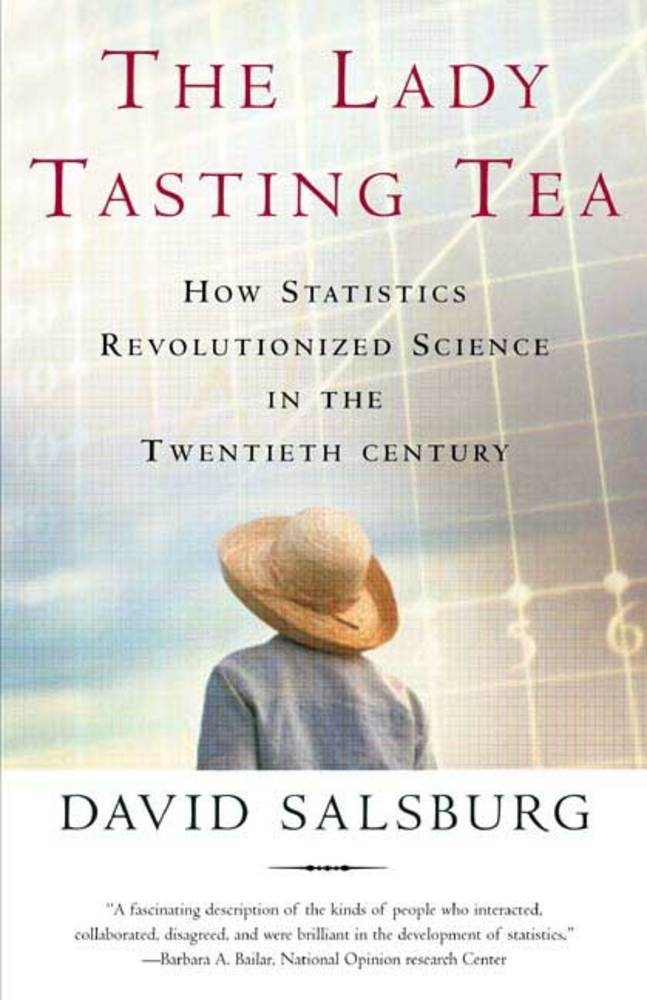

# Análisis de datos categóricos

<style>
  .espacio {
     margin-bottom: 1cm;
  }
</style>

<style>
  .espacio3 {
     margin-bottom: 3cm;
  }
</style>

Sólo necesitas instalar un paquete una vez, pero debes volver a cargarlo cada vez que inicies una nueva sesión.

```{r, message=FALSE, warning=FALSE}
library(tidyverse)
```

Las variables categóricas están por doquier. Desde ayudar a decidir cuándo un tratamiento médico es mejor hasta evaluar los factores que afectan nuestras opiniones y conductas, hoy en día los analistas encuentran innumerables usos para los métodos de datos categóricos. Primero vamos a repasar algunos conceptos de probabilidad.

## Repaso y algunos conceptos

Recordemos la **distribución multinomial**. Supongamos que cada uno de $n$ ensayos independientes e idénticos tiene realizaciones en $c$ categorías. Definimos $y_{ij}$ como
$$
y_{ij} = \left\{ \begin{array}{cl}
1 & \text{si el }\; i\,\,\text{-ésimo ensayo cae en la categoria }j,\\
0 & \text{en otro caso.}
\end{array}\right.
$$

Entonces $y_i=(y_{i1},y_{i2},\ldots,y_{ic})$ representa _un_ ensayo multinomial, done
$$
\displaystyle{\sum_j{y_{ij}}}=1.
$$

Notemos que $y_{ic}=1-(y_{i1}+\cdots+y_{i,c-1})$ es redundante. Sea $n_j=\displaystyle{\sum_i{y_{ij}}}$ el número de ensayos que caen en la categoría $j$. Los conteos $(n_1,n_2,\ldots,n_c)$ tienen una distribución multinomial.

Sea $\pi_{j}=P(Y_{ij}=1)$, la probabilidad de éxito en la categoría $j$. La función de masa de probabilidad de $(n_1,n_2,\ldots,n_c)$ es 
$$
p(n_1,n_2,\ldots,n_c) = \dfrac{n!}{n_1!n_2!\cdots n_c!}\pi_1^{n_1}\pi_2^{n_2}\cdots \pi_c^{n_c}.
$$

Sea $n=\displaystyle{\sum_j{n_j}}$. Recordemos que esta ecuación es de dimensión $c-1$ porque 
$$
n_c = n - (n_1 + n_2 + \cdots + n_{c-1}).
$$

Se puede ver que
$$
\begin{eqnarray*}
E(n_j) =n\pi_j, \quad && V(n_j)=n\pi_j(1-\pi_j),\\
C(n_i,n_j)=-n\pi_i \pi_j&\quad&\mbox{si } i\neq j
\end{eqnarray*}
$$

**Modelo Poisson**

Sean $(Y_1,Y_2,\ldots,Y_c)$ variables aleatorias Poisson independientes con parámetros $(\mu_1,\mu_2,\ldots,\mu_c)$. La función de masa de probabilidad conjunta es
$$
P(Y_1=n_1, Y_2=n_2, \ldots, Y_c=n_c) = \prod_i{\mbox{exp}(-\mu_i)\dfrac{\mu_i^{n_i}}{n_i!}}.
$$ 

El total $n=\displaystyle{\sum_i{Y_i}}$ también tiene una distribución Poisson con media $\displaystyle{\sum_i{\mu_i}}$. Como $n$ también es una variable aleatoria, al condicionar en $n$, $\{Y_i\}$ ya no tienen una distribución Poisson, pues cada $Y_i$ no puede exceder $n$.

La distribución condicional es
$$
\begin{eqnarray*}
P\left(Y_1=n_1,\ldots,Y_c=n_c \,\middle|\,  \sum_j{Y_j}=n\right) &=& \dfrac{P(Y_1=n_1,\ldots,Y_c=n_c)}{P\left(\sum_j{Y_j}\right)} \\
&=& \dfrac{\prod_i \mbox{exp}(-\mu_i)\mu_i^{n_i}/n_i!}{\mbox{exp}\left(-\sum_j{\mu_j}\right)\left(\sum_j {\mu_j}\right)^n/n!} \\
&=& \dfrac{n!}{\prod_i n_i!} \prod_i{\pi_i^{n_i}}
\end{eqnarray*}
$$
con $\pi_i = \dfrac{\mu_i}{\sum_i \mu_i}$, es decir, se trata de una distribución multinomial con parámetros $(n, \{\pi_i\})$.

Muchos análisis de datos categóricos suponen una distribución multinomial. Tales análisis usualmente tineen resultados similres a aquellos análisis que suponen una distribución Poisson, por las similitudes en sus funciones de verosimilitud.

---

<br>


En la estimación de parámetros a menudo se utilizan dos métodos para obtener intervalos de confianza:

1. Método de Wald

En el caso univariado se utiliza como estimador de la varianza $-E\left(\dfrac{d^2 L(\theta)}{d\theta^2}\right)$ y el estadístico es 
$$z=(\hat{\theta} - \theta_0)/\mbox{SE} \sim N(0,1)$$
o en el caso multivariado,
$$
W = \left(\hat{\theta}- \theta_0\right)^T\left[\mbox{Cov}\left(\hat{\theta}\right)\right]^{-1}\left(\hat{\theta}- \theta_0\right),
$$
y como $\hat{\theta}$ se distribuye normal asintóticamente, entonces la distribución de $W$ es $\chi^2$ con grados de libertad igual al rango de $\mbox{Cov}\left(\hat{\theta}\right)$, el número de parámetros no redundantes.

2. Método de cociente de verosimilitud

Si $l_0$ es el máximo valor de la función de verosimilitud bajo $H_0$ y $l_1$ es el valor máximo sobre el espacio de parámetros (que contiene también el valor bajo $H_0$), entonces $l_0 \leq l_1$ y el estadístico es

$$-2\,  \mbox{log}(\Lambda) = -2\,  \mbox{log}(l_0/l_1)=-2(L_0-L_1) \sim \chi^2_n$$
donde los grados de libertad equivalen a la diferencia de dimensiones de los espacios de parámetros.

### Caso binomial

Definimos la función de verosimilitud de una variable aleatoria binomial con $n$ realizaciones y $x$ éxitos:

$$
L(\theta) = \mbox{log}(\theta^x(1-\theta)^{n-x}) = x\mbox{log}(\theta) + (n-x)\mbox{log}(1-\theta)
$$

```{r}
likelihood <- function(x, n){
  function(theta){x*log(theta) + (n-x)*log(1-theta)}
}
```

Creamos nuestra función de verosimilitud para $x=3$ y $n=10$:

```{r}
mi_likelihood <- likelihood(3, 10)
```

Graficamos la función:

```{r}
ggplot(data = data.frame(x = 0), mapping = aes(x = x)) +
  stat_function(fun = mi_likelihood) + xlim(0.001,0.999)
```

El estadístico de Wald da como resultado el invervalo

$$
\hat{\theta} \pm z_{\alpha/2}\sqrt{\dfrac{\hat{\theta}(1-\hat{\theta})}{n}}
$$

El estadístico del cociente de verosimilitud es:

$$
2x\left[x\mbox{log}\left(\dfrac{\hat{\theta}}{\theta_0}\right)+(n-x)\mbox{log}\left(\dfrac{1-\hat{\theta}}{1-\theta_0}\right)\right] = \chi^2_{1,\alpha}
$$

Se puede expresar como

$$
2\sum{\mbox{observado} \,\left[\,\mbox{log}\left(\dfrac{\mbox{observado}}{\mbox{ajustado}}\right)\right]}
$$

Existen varios métodos para obtener intervalos de confianza. Utilizando la función `ciAllx` del paquete `proportion` podemos obtener intervalos de confianza para $\hat{\theta}$ a partir de 6 métodos:

```{r}
library(proportion)
intervalos <- ciAllx(x = 3, n = 10, alp = 0.05) 
intervalos %>% knitr::kable()
```

Los intervalos de confianza para todos los métodos son realmente muy similares. Si el tamaño de muestra $n$ es grande, los 6 métodos dan como resultado intervalos de confianza prácticamente idénticos.

```{r, out.width='60%'}
ggplot(intervalos, aes(y = method)) + 
  geom_segment(aes(x = LowerLimit, xend = UpperLimit, y = method, yend = method)) + 
  geom_vline(xintercept = 0.3, color = 'red') +
  xlab('Intervalo de confianza para cada método')
```

---

<br>

### Estimación de parámetros multinomiales {-}

Definimos la función de verosimilitud
$$
l(n_1,n_2,\ldots,n_c | \pi_1, \pi_2, \ldots, \pi_c) = c \prod_j \pi_j^{n_j}
$$
donde $\pi_j \geq 0$ y $\sum_j{\pi_j}=1$. 

Para estimar $\{\pi_j\}$ maximizamos la log-verosimilitud
$$
L(\pi) = \sum_j{n_j \mbox{log}(\pi_j)}.
$$

Para no tener redundancias vemos $L$ como función de $\pi_1,\pi_2,\ldots,\pi_{c-1}$ pues $\pi_c=1-(\pi_1+ \pi_2+\cdots+\pi_{c-1})$. Por lo tanto,
$$
\dfrac{d \pi_c}{d \pi_j} = -1 \qquad \mbox{para }\; j=1,2,\ldots,c-1.
$$
Por la regla de la cadena,
$$
\dfrac{d\,\mbox{log}(\pi_c)}{d\,\pi_j}=\dfrac{1}{\pi_c} \cdot \dfrac{d\, \pi_c}{d\, \pi_j}=-\dfrac{1}{\pi_c}.
$$
Ahora diferenciamos $L$ con respecto a $\pi_j$
$$
\dfrac{d\, L(\pi)}{d\, \pi_j}=\dfrac{n_j}{\pi_j} - \dfrac{n_c}{\pi_c} = 0.
$$
Por lo que los estimadores de máxima verosimilitud satisfacen que
$$
\dfrac{\hat{\pi}_j}{\hat{\pi}_c} = \dfrac{n_j}{n_c}.
$$
Ahora bien,
$$
1 = \sum_j{\pi_j}= \dfrac{\hat{\pi}_c\left(\sum_j n_j\right)}{n_c}=\dfrac{\hat{\pi}_c n}{n_c},
$$
y se tiene que $\hat{\pi_c}=n_c/n$ y $\hat{\pi_j}=n_j/n$ para $j=1,2,\ldots,c-1$.

Se puede verificar que estos estimadores efectivamente maximizan la verosimilitud. Notemos que $\hat{\pi_j}=n_j/n$ son las proporciones muestrales.

## La $\chi^2$ de Pearson de una multinomial

En 1900 el estadístico Karl Pearson definió una prueba de hipótesis para la multinomial. Su motivación inicial fue analizar las probabilidades de ocurrencias de varias realizaciones en el juego de la ruleta. Consideramos para $j=1,2,\ldots,c$ 
$$
H_0:\pi_j =\pi_{j0} \qquad H_1:\pi_j \neq \pi_{j0}.
$$

Bajo $H_0$, los valores esperados de $\{n_j\}$, llamadas _frecuencias esperadas_ son $\mu_j=n\pi_{j0}$, $j=1,\ldots,c$. El estadístico propueto es
$$
X^2 = \sum_j{\dfrac{(n_j - \mu_j)^2}{\mu_j}} \sim \chi^2_{(c-1)}.
$$

Si las diferencias $\{n_j - \mu_j\}$ son más grandes, esto produce valores $X^2$ más grandes para una $n$ fija. Si $X_o^2$ es el valor observado de $X^2$ entonces el valor p es $P(X^2 \geq X_o^2)$. Si $n$ es grande, $X^2$ tiene una distribución $\chi^2_{c-1}$.


### Cociente de verosimilitud de una multinomial

Bajo $H_0$ la verosimilitud se maximiza cuando $\hat{\pi}_j=\pi_{j0}$ y en el caso general cuando $\hat{pi}_j=\frac{n_j}{n}$. El cociente de verosimilitud es

$$
\Lambda = \dfrac{\prod_j{\pi_{j0}^{n_j}}}{\prod_j{(n_j/n)^{n_j}}}.
$$
Por lo tanto, el estadístico del cociente de verosimilitud es

$$
G^2 = -2\,\mbox{log}(\Lambda) = 2\, \sum_j{n_j \mbox{log}\left(\dfrac{n_j}{n\pi_{j0}}\right)}.
$$

A este estadístico se le llama _estadístico $\chi^2$ de verosimilitud_. Entre más grande sea el valor de $G^2$ hay mayor evidencia en contra de $H_0$. En el caso general, el espacio de parámetros consiste de $\{\pi_j\}$ sujeto a que $\sum_j{\pi_j}=1$, por lo que la dimensión es $c-1$. Bajo $H_0$, se especifica por completo $\{\pi_j\}$, por lo que la dimensión es $0$. La diferencia entre estas dimensiones es $(c-1)$. Si $n$ es grande, entonces $G^2$ tiene una distribución $\chi^2$ con $(c-1)$ grados de libertad.

## Definiciones

Supongamos que se tiene una tabla de contingencias. A continuación introduciremos una notación y algunas definiciones.

### Notación

Sea $\pi_{ij}$ la probabilidad de que una observación $(X,Y)$ esté en la celdilla ($i$,$j$). Las densidades marginales las denotamos por:
$$
\pi_{i+}=\sum_j{\pi_{ij}},\qquad \pi_{+j}  = \sum_i{\pi_{ij}}
$$
Cuando ambas variables son aleatorias, se pueden definir las densidades marginales:
$$
\pi_{j|i} = \pi_{ij}/\pi_{i+}, \qquad \mbox{para toda }i\mbox{ y }j
$$

Se dice que las variables son **independientes** si 
$$
\pi_{ij} = \pi_{i+}\pi_{+j} \quad \mbox{para }\; i=1,\ldots,I\; \mbox{ y para }\; j=1,\ldots,J.
$$
Cuando son independientes se cumple que
$$
\pi_{j|i}=\pi_{ij}/\pi_{i+}=(\pi_{i+}\pi_{+j})/\pi_{i+}=\pi_{+j} \quad \mbox{para }i=1,\ldots,I.
$$

### Razón de momios

```{block2, type = "nota"}
Para una probabilidad de éxito $\pi$ se definen los _momios_ (o _chances_) como
$$
\Omega = \dfrac{\pi}{1-\pi}
$$
Los momios siempre son no negativos.
```

**Ejemplo**

Un **sitio de apuestas** escribe:

> Momio 7/1: Ganas $7 por cada $1 apostado. Si apuestas $10, cobras $70 más tu apuesta, es decir, $80.

> Momio 5/2: Ganas $5 por cada $2 apostados. Si apuestas $10, cobras $25 más tu apuesta, es decir, $35.

> Momio 3/5: Ganas $3 por cada $5 apostados. Si apuestas $10, cobras $6 más tu apuesta, es decir, $16.


<p class="espacio">
</p>


```{r, echo = F, out.width='45%'}

```

<p class="espacio">
</p>

<br>

 
<div class="centered">
<p class="espacio">
</p>
Si el momio es menor que 1 entonces...

(a) La probabilidad de éxito es cero.

(b) La probabilidad de éxito es menor que $1/2$.

(c) El éxito es más probable que el fracaso.

(d) Todas la anteriores.

<p class="espacio3">
</p>
</div>
<br>

```{block2, type = "information"}
Si $\Omega > 1$, entonces es más probable el éxito que el fracaso. Por ejemplo, cuando $\pi=0.75$ entonces $\Omega = 0.75/0.25 =3$, un éxito es 3 veces más probable que un fracaso, y esperaríamos 3 éxitos por cada fracaso. Cuando $\Omega = \frac{1}{3}$ un fracaso es tres veces más verosímil que un éxito.
```

<br>


Inversamente, 

$$
\pi = \dfrac{\Omega}{\Omega + 1}.
$$

Pensemos nuevamente en una tabla de contingencias de $2\times 2$, en la $i$-ésima fila los momios de éxito en vez de fracaso son $\Omega_i=\pi_i/(1-\pi_i)$. La **razón de momios** de $\Omega_1$ y $\Omega_2$ en ambas filas es:

$$
\theta = \dfrac{\Omega_1}{\Omega_2}=\dfrac{\pi_1/(1-\pi_1)}{\pi_2/(1-\pi_2)}
$$

Si se tiene una tabla con probabilidades conjuntas $\{\pi_{ij}\}$ la definición equivalente de momio para cada fila es $\Omega_i=\pi_{i1}/\pi_{i2}$, $i=1,2$. Entonces la razón de momios es:

$$
\theta = \dfrac{\pi_{11}/\pi_{12}}{\pi_{21}/\pi_{22}}=\dfrac{\pi_{11}\pi_{22}}{\pi_{12}\pi_{21}}
$$

A $\theta$ se le conoce también como la _razón del producto cruzado_.

```{block2, type = "nota"}
¿Cómo interpretamos este número?

* Si $\theta=1$ (o $\Omega_1=\Omega_2$), entonces las variables son independientes.

* Si $\theta > 1$, entonces las observaciones en el renglón 1 tienen más probabilidad de éxito que observaciones en en renglón 2, es decir, $\pi_1 > \pi_2$.
  
* Si $\theta < 1$, entonces $\pi_1 < \pi_2$.
```

Para conteos en una tabla de contingencia, la _razón de momios muestral_ es:

$$
\hat{\theta} = \dfrac{n_{11}n_{22}}{n_{12}n_{21}}
$$

Regresemos a los datos de billboard:

```{r message=FALSE, warning=FALSE}
billboard <- read_csv("datos/billboard_alltime.csv")
```

```{r}
OR <- function(var1, var2){
  n <- table(var1, var2)
  
  (n[1,1] / n[1,2])*(n[2,2] / n[2,1])
}
OR(billboard$gains_performance, billboard$rising)
```

Los chances de éxito (subir una o más posiciones en el chart) cuando no hubo una presentación en vivo (rengón 1) son equivalentes a 2.75 veces los chances de éxito (incremento en el chart) que cuando no hubo presentación en vivo (renglón 2).

```{r, echo=FALSE, eval=FALSE}
ORWald <- function(var1, var2, alpha = 0.05){
  tab <- table(var1, var2)
  siglog <- sqrt((1/tab[1,1]) + (1/tab[1,2]) + (1/tab[2,1]) + (1/tab[2,2]))
  zalph <- qnorm(1 - alpha/2)
  logOR <- log(OR(var1, var2))
  loglo <- logOR - zalph * siglog
  loghi <- logOR + zalph * siglog
  
  ORlo <- exp(loglo)
  ORhi <- exp(loghi)
  
  tibble(LowerCI = ORlo, OR = OR(var1, var2), UpperCI = ORhi, alpha = alpha)
}

ORWald(billboard$gains_performance, billboard$rising)
```


Con la función `odds.ratio` del paquete `questionr` se puede calcular la razón de momios y el paquete hace una prueba de hipótesis conocida como **prueba exacta de Fisher**:

```{r}
library(questionr)
odds.ratio(table(billboard$gains_performance, billboard$rising))
```


```{block2, type = "comentario"}
* Valores de $\theta$ más alejados de $1$ reflejan un mayor grado de asociación entre las variables.

* Dos valores representan la misma asociación pero en direcciones opuestas, cuando uno es el recíproco del otro.

* Por ejemplo, cuando $\theta=0.25$ los chances de éxito en el renglón 1 son 0.25 veces los chances en el renglón 2, o equivalentemente, los chances de éxito en el renglón 2 son 1/0.25 = 4 veces los chances en el renglón 1.
```

<p class="espacio">
</p>

 
<div class="centered">
<p class="espacio">
</p>
Si se invierte el orden de los renglones o de las columnas, entonces $\theta$

(a) no cambia.

(b) debe ser necesariamente $1$.

(c) es el recíproco de su valor original.

(d) puede tomar cualquier valor.

<p class="espacio3">
</p>
</div>
<br>

Para hacer inferencia es conveniente usar $\mbox{log}(\theta)$. Este tiene las siguientes propiedades:

1. El caso de independencia corresponde a $\mbox{log}(\theta) = 0$.

2. El logaritmo de la razón de momios es simétrico alrededor de $0$. 

3. Si se invierten los renglones o las columnas, entonces $\mbox{log}(\theta)$ cambia de signo pero tiene la misma magnitud. Por ejemplo, dos valores de $\mbox{log}(\theta)$ que tienen misma magnitud pero signos contrarios, como $\mbox{log}(4)=1.39$ y $\mbox{log}(0.25)=-1.39$, representan el mismo grado de asociación.


## Asociación en tablas de tamaño $I\times J$

En tablas de $2\times 2$ un sólo número como la razón de momios puede ser suficiente para resumir la asociación. En tablas $I\times J$ usualmente no es posible resumir la asociación entre las dos variables con un sólo número sin alguna pérdida de información. Sin embargo, un conjunto de razones de momios, o bien, algun otro estadístico de resumen pueden ser útil para describir la asociación entre las variables.

### Razones de momios en tablas $I\times J$

Se puede utiliar los $\dbinom{I}{2}$ pares de renglones en combinación con los $\dbinom{J}{2}$ pares de columnas. Para renglones $a$ y $b$ y columnas $c$ y $d$ la razón de momios utiliza 4 valores en casillas en un patrón rectangular:

$$
\dfrac{\pi_{ab}\pi_{bd}}{\pi_{bc}\pi_{ad}}
$$

Consideremos el subconjunto de $(I-1)(J-1)$ _razones de momios locales_:

$$
\theta_{ij} = \dfrac{\pi_{ij}\pi_{i+1,j+1}}{\pi_{i,j+1}\pi_{i+1,j}},  \qquad i=1,\ldots, I-1,\;\;\; j=1,\ldots,J-1.
$$

Estos $(I-1)(J-1)$ razones de momios determinan las razones de momios entre pares de renglones y pares de columnas. 

### Ejemplo: mushrooms  

Este conjunto de datos incluye descripciones de muestras correspondientes a 23 especies de setas de las familias Agaricus y Lepiota. 

Cada especie está identificada como definitivamente comestible, definitivamente venenosa, o de comestibilidad desconocida y no recomendada su ingesta.

Las otras variables se presentan en la siguiente tabla:

| Variable                 | Categorías
|--------------------------|----------------------------------------------------------------------------------------------------|
| cap-shape                | bell=b,conical=c,convex=x,flat=f,knobbed=k,sunken=s                                                |
| cap-surface              | fibrous=f,grooves=g,scaly=y,smooth=s                                                               |
| cap-color                | brown=n,buff=b,cinnamon=c,gray=g,green=r,pink=p,purple=u,red=e,white=w,yellow=y                    |
| bruises                  | bruises=t,no=f                                                                                     |
| odor                     | almond=a,anise=l,creosote=c,fishy=y,foul=f,musty=m,none=n,pungent=p,spicy=s                        |
| gill-attachment          | attached=a,descending=d,free=f,notched=n                                                           |
| gill-spacing             | close=c,crowded=w,distant=d                                                                        |
| gill-size                | broad=b,narrow=n                                                                                   |
| gill-color               | black=k,brown=n,buff=b,chocolate=h,gray=g,green=r,orange=o,pink=p,purple=u,red=e,white=w,yellow=y  |
| stalk-shape              | enlarging=e,tapering=t                                                                             |
| stalk-root               | bulbous=b,club=c,cup=u,equal=e,rhizomorphs=z,rooted=r,missing=?                                    |
| stalk-surface-above-ring | fibrous=f,scaly=y,silky=k,smooth=s                                                                 |
| stalk-surface-below-ring | fibrous=f,scaly=y,silky=k,smooth=s                                                                 |
| stalk-color-above-ring   | brown=n,buff=b,cinnamon=c,gray=g,orange=o,pink=p,red=e,white=w,yellow=y                            |
| stalk-color-below-ring   | brown=n,buff=b,cinnamon=c,gray=g,orange=o,pink=p,red=e,white=w,yellow=y                            |
| veil-type                | partial=p,universal=u                                                                              |
| veil-color               | brown=n,orange=o,white=w,yellow=y                                                                  |
| ring-number              | none=n,one=o,two=t                                                                                 |
| ring-type                | cobwebby=c,evanescent=e,flaring=f,large=l,none=n,pendant=p,sheathing=s,zone=z                      |
| spore-print-color        | black=k,brown=n,buff=b,chocolate=h,green=r,orange=o,purple=u,white=w,yellow=y                      |
| population               | abundant=a,clustered=c,numerous=n,scattered=s,several=v,solitary=y                                 |
| habitat                  | grasses=g,leaves=l,meadows=m,paths=p,urban=u,waste=w,woods=d                                       |

```{r message=FALSE, warning=FALSE}
mushrooms <- read_csv("datos/mushrooms.csv")
glimpse(mushrooms)
```


```{r message=FALSE, warning=FALSE, results='hide'}
library(oddsratio)
mushrooms_1 <- mushrooms %>%
  mutate(edibility = 1*(edibility == 'e'))
fit_glm <- glm(edibility ~ `cap-color`, data=mushrooms_1, family='binomial')
or_mushrooms <- or_glm(data = mushrooms_1, model = fit_glm)
```

```{r}
or_mushrooms %>% knitr::kable()
```

En esta tabla se tienen dos columnas donde "e" siginifica que la seta es comestible y "p" que la seta es venenosa. En los renglones están los colores de las setas codificados de acuerdo con la tabla anterior. En las columnas están las razones de momio para cada color para aquellas setas que son comestibles.

Veamos la tabla de color y comestibilidad:

```{r}
table(mushrooms$edibility, mushrooms$`cap-color`)
```

Podemos ver que la razón de momios para p=pink y u=purple es "infinita" porque hay muy pocas observaciones para setas de esos colores. De cualquier forma, con los momios podemos concluir que aquellas setas de colores c=cinnamon y w=white aumentan los chances de que sean comestibles en 6.7 y 5.6, respectivamente.


## Intervalos de confianza para los parámetros de asociación

La precisión de los esitmadores de asociación está caracterizada por las distribuciones muestrales de los errores estándar. Para tablas de $2\times 2$ recordemos que 
$$
\hat{\theta} = \dfrac{n_{11}n_{22}}{n_{12}n_{21}}
$$

Se puede demostrar que $\hat{\theta}$ tiene una distribución normal asinotóticamente alrededor de $\theta$. A menos que $n$ sea grande, la distribución muestral generalmente es sesgada.


### Error estándar de la razón de momios

Utilizando la transformación de logaritmo, la estructura multiplicativa converge muy rápidamente a la normalidad. Una aproximación del error estándar para $\mbox{log}(\hat{\theta})$ es

$$
\hat{\sigma}(\mbox{log}\hat{\theta}) = \sqrt{\dfrac{1}{n_{11}}+\dfrac{1}{n_{12}}+\dfrac{1}{n_{21}}+\dfrac{1}{n_{22}}}.
$$

Como consecuencia de la normalidad de la distribución de $\mbox{log}(\hat{\theta})$,

$$
\mbox{log}(\hat{\theta}) \pm z_{\alpha/2}\hat{\sigma}(\mbox{log}\hat{\theta})
$$

## Prueba de independencia 

Suponemos que se tiene resultados obtenidos de una distribución multinomial y probabilidades conjuntas $\{\pi_{ij}\}$ en una tabla de contingencia de dimensiones $I\times J$.

```{block2, type = "nota"}
La hipótesis nula de independencia estadística es:
$$
H_0:\pi_{ij}=\pi_{i+}\pi_{+j},\qquad \text{ para toda }\;\; i \;\;\text{ y }\;\; j.
$$
```

### La prueba $\chi^2$ de Pearson

Ya estudiamos la prueba para valores específicos de probabilidades multinomiales. Una prueba de $H_0:\mbox{independencia}$ utiliza la $\chi^2$ con $n_{ij}$ en lugar de $n_i$ y con $\mu_{ij}=n\pi_{i+}\pi_{+j}$ en lugar de $\mu_i$. 

```{block2, type = "information"}
Bajo $H_0$:
  
$$E(n_{ij}) = \mu_{ij}$$
  
Usualmente $\{\pi_{i+}\}$ y $\{\pi_{+j}\}$ son _conocidas_. Sus estimadores de máxima verosimilitud son $\hat{\pi}_{i+}=n_{i+}/n$ y $\hat{\pi}_{+j}=n_{+j}/n$.

Las frecuencias esperadas estimadas son
$$
\{\hat{\mu}_{ij} = n\hat{\pi}_{i+}\hat{\pi}_{+j}=n_{i+}n_{+j}/n^2\}
$$
  
Por lo tanto, el estadístico de Pearson es:
$$
X^2 = \displaystyle{\sum_{i}\sum_{j}{\dfrac{(n_{ij}-\hat{\mu}_{ij})^2}{\hat{\mu}_{ij}}}}.
$$
```

En 1900, el mismo Karl Pearson argumento que reemplazar las $\{\mu_{ij}\}$ por sus estimadores $\{\hat{\mu}_{ij}\}$ no afectaría la distribución muestral cuando se tiene una muestra grande. Como la tabla de contingencia tiene $IJ$ categorías, Pearson argumentó que la $X^2$ se distribuye como _chi cuadrada_ asintóticamente con grados de libertad $IJ-1$. 

```{block2, type = "nota"}
Sin embargo, años después (en 1922) Fisher publicó un artículo corrigiendo el error de Pearson. Lo que sucede es lo siguiente: estimar $\{\hat{\mu}_{ij}\}$ requiere de estimar $\{\pi_{i+}\}$ y $\{\pi_{+j}\}$, por lo que los grados de libertad son:

$$
(IJ - 1) - (I-1) - (J-1) = (I-1)(J-1).
$$
```

**El estadístico de cociente de verosimilitud**

Para una muestra multinomial, el kernel de la verosimilitud es

$$
\prod_i \prod_j{\pi_{ij}^{n_{ij}}},\qquad \;\text{donde todas }\;\; \pi_{ij}\geq0\;\; \mbox{y}\;\;\sum_i \sum_j{\pi_{ij}}=1.
$$

Bajo $H_0:\text{independencia}$, $\hat{\pi}_{ij}=\hat{\pi}_{i+}\hat{\pi}_{+j}=n_{i+}n_{+j}/n^2$. En el caso general, $\hat{\pi}_{ij}=n_{ij}/n$. El cociente de verosimilitud es igual a

$$
\Lambda = \dfrac{\prod_i \prod_j (n_{i+}n_{+j})^{n_{ij}}}{n^n\prod_i\prod_j{n_{ij}^{n_{ij}}}}.
$$

El estadístico del cociente de verosimilitud es $-2\mbox{log}(\Lambda)$. Denotado por $G^2$, es igual a:

$$
G^2 = -2\mbox{log}(\Lambda) = 2\sum_i\sum_j{n_{ij}\mbox{log}(n_{ij}/\hat{\mu}_{ij})}
$$

Entre más grandes sean los valores de $G^2$ y $X^2$, mayor evidencia de independencia. En el caso general el espacio consiste de $\{\pi_{ij}\}$ sujeto a la restricción lineal de que deben sumar $1$. El espacio de parámetros tiene dimensión $IJ-1$. Bajo $H_0$ el espacio está determinado por $\{\pi_{i+}\}$ y $\{\pi_{+j}\}$, por lo que su dimensión es de $(I-1) + (J-1)$. La diferencia entre estas dimensiones es $(I-1)(J-1)$. Para muestras grandes, $G^2$ tiene una distribución nula $\chi^2$ con grados de libertad $(I-1)(J-1)$. Por lo que $G^2$ y $X^2$ tienen la misma distribución límite. De hecho, son asintóticamente equivalentes: $X^2 - G^2$ converge en probabilidad a $0$.


### Ejemplo: brecha de género

```{r message=FALSE, warning=FALSE, paged.print=FALSE}
gendergap <- matrix(c(279,73,225,165,47,191), byrow = T, ncol = 3)
dimnames(gendergap) <- list(Gender=c("Female","Male"), PartyID=c("Democrat","Independent","Republican"))
gendergap %>% knitr::kable()
```

La prueba de $\chi^2$ de Pearson se puede realizar con la función `chisq.test` que ya está en R base:

```{r}
chisq.test(gendergap)
```


## General Social Survey 1972 - 2016

La Encuesta Social General (GSS) es una encuesta sociológica creada y recopilada desde 1972 por el Centro Nacional de Investigación de Opinión de la Universidad de Chicago. La GSS recopila información y mantiene un registro histórico de las preocupaciones, experiencias, actitudes y prácticas de los residentes de los Estados Unidos.


Consideremos las variables de interés de la siguiente tabla:

| Variable | Descripción                              | Niveles                                                                                                                                          |
|----------|------------------------------------------|--------------------------------------------------------------------------------------------------------------------------------------------------|
| YEAR     | Año del encuestado                       | 1972 - 2016                                                                                                                                      |
| GOD      | Grado de creencia en Dios                |  No cree, no hay forma de saberlo, cree un un ser superior, cree en ocasiones, cree pero con dudas, sabe que existe.                             |
| PARTYID  | Identificación con un partido político.  | Fuertemente democrático, algo democrático, independiente, algo republicano, fuertemente republicano, otro partido                                |
| EDUC     | Educación del encuestado                 | Años de educación desde 1ro de primaria hasta 8 años de educación universitaria                                                                  |
| HAPPY    | Grado de felicidad del encuestado        | Muy feliz, algo feliz, no muy feliz,                                                                                                             |
| POSTLIFE | Creencia de la vida después de la muerte | Sí, No                                                                                                                                           |
| WRKSTAT  | Tipo de situación laboral                | Tiempo completo, tiempo parcial, con trabajo pero de vacaciones o incapacidad, desempleado, retirado, en la escuela, al cuidado de la casa, otra |
| FINRELA  | Ingreso con respecto a la media nacional | Muy por debajo, debajo, promedio, encima, muy por encima del promedio                                                                            |

Más información en: [http://gss.norc.org/](http://gss.norc.org/).

```{r message=FALSE, warning=FALSE}
gss <- read_csv("datos/gss.csv")
```

Veamos los datos de la encuesta del 2006 al 2016. Creamos una variable categórica para analizar la variable de educación más facilamente:

```{r}
gss_0616 <- gss %>% 
  filter(YEAR >= 2006 & YEAR <= 2016) %>%
  mutate(EDUC1 = ifelse(EDUC < 12, "Some HS", 
                        ifelse(EDUC == 12, "HS",
                               ifelse(EDUC < 16, "Some College", 
                                      ifelse(EDUC == 16, "College", "Graduate")))),
         EDUC1 = ordered(EDUC1, levels=c("Some HS","HS", "Some College", "College", "Graduate")),
         GOD1 = ordered(GOD, levels=c("DONT BELIEVE","NO WAY TO FIND OUT","SOME HIGHER POWER",
                                      "BELIEVE SOMETIMES","BELIEVE BUT DOUBTS","KNOW GOD EXISTS"))) %>%
  select(EDUC1, GOD1) %>%
  drop_na()
```

Veamos la tabla de contingencias:

```{r}
table(gss_0616$EDUC1, gss_0616$GOD1) %>% knitr::kable()
```

A esta gráfica le llamamos _gráfica de mosaicos_:

```{r, eval=FALSE}
ggplot(gss_0616, aes(x=EDUC1, fill=GOD1)) +
    geom_bar(position='fill') +
    coord_flip() +
    theme(aspect.ratio = 1,legend.position="bottom",
          axis.text.y=element_text(color='black',size=10),
          axis.text.x=element_text(color='black',size=10),
          axis.title.x=element_text(size=12),
          axis.title.y=element_text(size=12),
          legend.text=element_text(size=11)) +
    scale_fill_discrete("") +
    ylab('Proporción')
```


Comparamos pruebas de hipótesis con los estadísticos $G^2$ y $X^2$:

```{r message=FALSE, warning=FALSE}
library(Deducer)
likelihood.test(gss_0616$EDUC1, gss_0616$GOD1)
```


```{r}
chisq.test(gss_0616$EDUC1, gss_0616$GOD1)
```

Estas estadísticas pueden ser evidencia de una asociación estadística fuerte.

Para entender mejor la naturaleza de la evidencia en contra de $H_0$ es necesario comparar casilla por casilla las frecuencias estimadas y observadas. 

Definimos los residuales ajustados como

$$
r_{ij} = \dfrac{n_{ij} - \hat{\mu}_{ij}}{\sqrt{\hat{\mu}_{ij}(1-p_{i+})(1-p_{+j})}}.
$$

```{block2, type = "nota"}
* Bajo $H_0$ cada $r_{ij}$ tiene una distribución muestral aproximada normal estándar. 
  
* Si en una casilla $r_{ij}$ excede 2 en valor absoluto, entonces esto significa que en esa casilla el modelo de independencia ($H_0$) no es muy apropiado.

* El signo describe la naturaleza de la asociación. 
```

Veamos el cálculo de los residuales:

```{r}
tabla <- table(gss_0616$EDUC1, gss_0616$GOD1)
rowsum <- apply(tabla,1,sum)
colsum <- apply(tabla,2,sum)
n <- sum(tabla)
gd <- outer(rowsum, colsum/n)
rowp <- rowsum/n #Prob. margimales renglón 
colp <- colsum/n #Prob. marginales columna
pd <- outer(1-rowp,1-colp)
resid <- (tabla-gd)/sqrt(gd*pd)
resid %>% knitr::kable()
```


En la columna "God Know Exists" observamos residuales particularmente grandes:

* con signo positivo: 12.70 para "Some HS" y 8.25 para "HS", significa que el número observado de personas que "saben que Dios existe" entre los encuestados con secundario o menor grado de estudios es mayor que el esperado.

* con signo negativo: -7.59 para "Collge" y -13.96 "Graduate", significa que el número observado de personas que "saben que Dios existe" entre las que fueron a la universidad (licenciatura o posgrado) es menor que el esperado.

De la tabla se podría concluir que el grado de estudios tiene una asociación negativ con el gardo de creencia en la existencia de Dios.

---

<br>

## La catadora de té

Una tarde del verano de 1920 en Cambridge, Inglaterra, Ronald Fisher tomaba el té en la terraza con sus colegas y amigos. 

```{r, echo = F, out.width='25%'}

```

La reunión había progresado complacientemente y en una ocasión cuando las tazas de té las volvían a llenar, Lady Muriel Bristol abruptadmente le dijo al mesero que parara de rellenar su taza.

```{r, echo = F, out.width='45%'}
knitr::include_graphics("figuras/tea_or_milk.png")
```

Lady Bristol indicó con desdeño que el mesero había puesto en la taza primero la leche y luego el té, en lugar de cumplir con una preferencia ampliamente conocida de té primero y luego leche.

Miradas de reojo fueron intercambiadas por numerosos miembros del grupo, preguntándose qué diferencia podría haber con que se añadiera a la taza primero la leche o primero el té. Hacía toda la diferencia, según Lady Bristol, afirmando que fácilmente ella podía decir si se había vertido primero en la taza la leche o el té.

Muy a salvo de la vista de Lady Bristol, se prepararon 8 tazas de té, en las cuales en 4 se virtió primero la leche y luego el té, y en las 4 restantes se virtió primero la leche y luego el té, siempre en las mismas proporciones.

```{r, echo = F, out.width='45%'}
knitr::include_graphics("figuras/tea_cups.png")
```

Muy amablemente, Lady Bristol _cató_ las 8 tazas de té y dio su veredicto sobre cuáles de las 4 tazas eran aquellas en las q se sirvió primero la leche y luego el té. Los resultados obtenidos a partir de esta cata de té se muestran en la siguiente tabla:

```{r}
Poured <- c("Milk","Milk","Tea","Tea")
Guess <- c("Milk","Tea","Milk","Tea")
count <- c(3,1,1,3)
teadata <- tibble(Poured, Guess, count)
tea <- xtabs(count ~Poured + Guess, data = teadata)
tea %>% knitr::kable()
```

Utilizando el método de la $\chi^2$ de Pearson hacemos la prueba de independencia $H_0:\theta=1$:

```{r}
chisq.test(tea, correct = FALSE)
```

Obtenemos el mensaje de que la prueba podría ser incorrecta. Esto no nos sorprende ya que la prueba no tiene mucha potencia debido al poco número de observaciones. ¡Fisher no le daría a probar 30 tazas a Lady Bristol sin convertirse en el objeto de su desdeño!

El método de `R` implementa la prueba de $\chi^2$ utilizando la _corrección de Yates_ cuando el tamaño de muestra es pequeño:

$$
X^2_Y = \sum_{i}\sum_j{\dfrac{(|n_{ij}-\hat{\mu}_{ij}|-\frac{1}{2})^2}{\hat{\mu}_{ij}}}\sim\chi^2_{(I-1)(J-1)}
$$


En el libro _The Lady Tasting Tea: How Statistics Revolutionized Science in the Twentieth Century_ escrito por David Salsburg, se describe con detalle este suceso y los _experimentos diseñados_ por Ronald Fisher para probar las afirmaciones de Lady Bristol.

<center>

[{width=150px}](https://www.amazon.com/Lady-Tasting-Tea-Statistics-Revolutionized/dp/0805071342)

</center>

---

<br>

## Modelos multinomiales para conteos 

Condicional a la suma $n$ de conteos de casillas en tablas de contingencia, los modelos log-lineales Poisson para $\{\mu_{ij}\}$ se convierten en modelos multinomiales para las probabilidades de las casillas
$$
\left\{\pi_{ij} = \mu_{ij}/\sum_a\sum_b{\mu_{ab}}\right\}
$$

Por ejemplo, para el _modelo saturado_:

$$
\pi_{ij} = \dfrac{\mbox{exp}(\lambda + \lambda_i^X + \lambda_j^Y + \lambda_{ij}^{XY})}{\sum_a\sum_b{\mbox{exp}(\lambda+\lambda_a^X+\lambda_b^Y+\lambda_{ab}^{XY})}}.
$$

El parámetro de intercepto $\lambda$ se cancela en este modelo multinomial. Este parámetro está relacionado con el tamaño total de la muestra, que es aleatorio en el modelo Poisson, pero no lo es en el modelo multinomial. Por esta razón, el modelo multinomial _saturado_ tiene $IJ-1$ parámetros, que representa la restricción usual de las probabilidades, o sea, $\sum_i\sum_j{\pi_{ij}}=1$.

Por esta razón ajustar un modelo lineal Poisson con función liga $\eta = log(\mu)$. Veremos esto con más detalle en las siguientes clases. Recordemos el ejemplo de las admisiones de posgrado de Berkeley.

```{r}
library(MASS)
UCBAdmissions %>% as.data.frame() %>% knitr::kable()
```

Ajustamos los parámetros para el modelo 

```{r}

llmFit <- loglm(~ Admit + Gender + Dept, data = UCBAdmissions)
coef(llmFit)
```

Comparamos utilizando el modelo Poisson:

```{r}
UCBdf <- as.data.frame(UCBAdmissions)
glmFit <- glm(Freq ~ Admit + Gender + Dept, family=poisson(link = "log"),
              contrasts=list(Admit=contr.sum, Gender=contr.sum, Dept=contr.sum),
              data=UCBdf)
coef(glmFit)
```


## Modelos log lineales con tres variables categóricas

En la primera clase vimos ejemplos de modelos log lineales con tres variables categóricas. Sabemos construir las tablas de contingencia de tres variables con la función `xtabs()` y ajustar los modelos con las funciones `loglin()`, `loglm()`, y `glm()`. Vimos que se podía ajustar modelos de independencia y en general, de diferentes tipos de asociaciones.

Una tabla de contingencia de $I\times J \times K$ con variables de respuesta $X, Y$ y $Z$ potencialmente tiene varios tipos de independencias.

Los modelos se aplican a la distribución multinomial con probabilidades de celdillas $\{\pi_{ijk}\}$ en las cuales $\sum_i\sum_j\sum_k\pi_{ijk}=1$ y también a muestreo con Poisson con medias $\mu_{ijk}$.

### Tipos de independencia

**Independencia mutua**

Las tres variables son _mutuamente independientes_ cuando
$$
\pi_{ijk}=\pi_{i++}\pi_{+j+}\pi_{++k}\qquad\;\text{para toda}\;i,j,\,\mbox{ y }\, k.
$$

Para frecuencias esperadas $\mu_{ijk}$, la independencia mutua tiene un modelo loglineal de la forma

$$
\mbox{log}\,\mu_{ijk} = \lambda+\lambda_{i}^X+\lambda_j^Y+\lambda_k^Z.
$$

**Independencia conjunta**

La variable $Y$ es _conjuntamente independiente_ de $X$ y $Z$ cuando

$$
\pi_{ijk}=\pi_{i+k}\pi_{+j+}\qquad\;\text{para toda}\;i,j,\,\mbox{ y }\, k.
$$

Esto es equivalente a tener independencia entre la variable $Y$ y una variable con las $IK$ combinaciones de los niveles de $X$ y $Z$. El modelo loglineal es:

$$
\mbox{log}\,\mu_{ijk} = \lambda+\lambda_{i}^X+\lambda_j^Y+\lambda_k^Z + \lambda_{ik}^{XZ}.
$$

Similarmente, $X$ podría ser conjuntamente independiente de $Y$ y $Z$, o bien, $Z$ podría ser conjuntamente independiente de $X$ y $Y$. La independencia mutua implica independencia conjunta de cualquier variable con las otras dos.


**Independencia condicional**

Las variables categóricas $X$ y $Y$ son _condicionalmente independientes dado_ $Z$ cuando se cumple la independencia para cada tabla parcial cuando cada $Z$ permanece fija. Esto es, si $\pi_{ij|k}=P(X=i,Y=j|Z=k)$, entonces

$$
\pi_{ij|k}=\pi_{i+|k}\pi_{+j|k}\qquad\;\text{para toda}\;i,j,\,\mbox{ y }\, k.
$$

Para probabilidades conjuntas en toda la tabla esto es equivalente:

$$
\pi_{ijk}=\pi_{i+k}\pi_{+jk}/\pi_{++k}\qquad\;\text{para toda}\;i,j,\,\mbox{ y }\, k.
$$

La independencia condicional de $X$ y $Y$, dado $Z$, tiene un modelo loglineal de la forma

$$
\mbox{log}\,\mu_{ijk} = \lambda+\lambda_i^X+\lambda_j^Y + \lambda_k^Z+ \lambda_{ik}^{XZ} + \lambda_{jk}^{YZ}.
$$

Esta es una condición más débil de independencia conjunta. La independencia mutua implica que $Y$ es conjuntamente independiente de $X$ y $Z$, la cual implica que $X$ y $Y$ son condicionalmente independientes. 

En la siguiente tabla resumimos los tres tipos de independencia:

<center>

|	Modelo	| Forma probabilística para $\pi_{ijk}$ | Términos de asociación en el modelo loglineal | Interpretación                                  |
|-----------|---------------------------------------|-----------------------------------------------|-------------------------------------------------|
|	 1      | $\pi_{i++}\pi_{+j+}\pi_{++k}$                                    | Ninguno                                       | Independencia mutua de $X,Y,Z$                  |
|	 2  	| $\pi_{i+k}\pi_{+j+}$                                    |     $\lambda_{ik}^{XZ}$                                          | Independencia conjunta de $Y$ con $X,Z$         |
|	 3		| $\pi_{i+k}\pi_{+jk}/\pi_{++k}$                                    |  $\lambda_{ik}^{XZ}+\lambda_{jk}^{YZ}$                                              | Independencia condicional de $X$ y $Y$ dado $Z$ |

</center>

---

<br>

### Asociación homogénea e interacciones de 3 factores

Los modelos (1), (2), y (3) tienen tres, dos, y un par de variables condicionalmente independientes, respectivamente. En los modelos (2) y (3) los parámetros con doble subíndice (tales como $\lambda_{ij}^{XY}$) representan dependencias condicionales entre las variables. 

Un modelo con las tres dependencias condicionales es

$$
\mbox{log}\,\mu_{ijk} = \lambda + \lambda_i^X + \lambda_j^Y + \lambda_k^Z + \lambda_{ij}^{XY} + \lambda_{ik}^{XZ} + \lambda_{jk}^{YZ}.
$$

Si exponenciamos ambas partes de la ecuación, las probabilidades en cada casilla tienen la forma

$$
\pi_{ijk} = \psi_{ij}\phi_{jk}\omega_{ik}.
$$

No existe una expresión cerrada para los tres factores en términos de los márgenes de las $\{\pi_{ijk}\}$ en el caso general. Se puede demostrar que las razones de momios entre caulesquiera dos pares de variables son idénticos en cada categoría de la tercera variable. A este modelo se le llama el modelo _loglineal de asociación homogénea_, o bien, el modelo de _no interacción entre los 3 factores_.

El modelo _loglineal general_ es 

$$
\mbox{log}\, \mu_{ijk} = \lambda + \lambda_i^X + \lambda_j^Y + \lambda_k^Z + \lambda_{ij}^{XY} + \lambda_{jk}^{YZ} + \lambda_{jk}^{YZ} + \lambda_{ijk}^{XYZ}
$$

Con variables indicadoras, $\lambda_{ijk}^{XYZ}$ es el coeficiente del producto de la $i$-ésima variable indicadora de $X$, la $j$-ésima de $Y$, y la $k$-ésima de $Z$. El número total de parámetros no redundates es

\begin{eqnarray*}
1 &+& (I-1) + (J-1) + (K-1) + (I-1)(J-1) + (I-1)(K-1) \\
&+& (J-1)(I-1) + (I-1)(J-1)(K-1) = IJK,
\end{eqnarray*}

que es el número total de conteos de casillas. Este modelo tiene tantos parámetros como observaciones y es saturado. Describe todas las posibles $\{\mu_{ijk}\}$. Cada par de variables pueden ser condicionalmente dependientes, y las razones de momios para cada par pueden variar a lo largo de todas las categorías de la tercera variable.

Poniendo algunos términos como cero obtenemos cualquiera de los modelos anteriores. En la siguiente tabla resumimos los modelos. Para facilitar cuando nos referimos a ellos en la tabla le asignamos un símbolo que pone en la lista únicamente el (los) términos de mayor orden para cada variable. Por ejemplo, el modelo (3) de independencia condicional se codifica como (XZ, YZ), porque sus términos de mayor orden son $\lambda_{ik}^{XZ}$ y $\lambda_{jk}^{YZ}$.

<center>

| Fórmula del modelo loglineal                                                                                                                                   | Símbolo    |
|----------------------------------------------------------------------------------------------------------------------------------------------------------------|------------|
| $\mbox{log}\, \mu_{ijk} = \lambda + \lambda_i^X + \lambda_j^Y,+,\lambda_k^Z$                                                                                   | (X,Y,Z)    |
| $\mbox{log}\, \mu_{ijk} = \lambda + \lambda_i^X + \lambda_j^Y,+,\lambda_k^Z + \lambda_{ij}^{XY}$                                                               | (XY,Z)     |
| $\mbox{log}\, \mu_{ijk} = \lambda + \lambda_i^X + \lambda_j^Y,+,\lambda_k^Z + \lambda_{ij}^{XY} + \lambda_{jk}^{YZ}$                                           | (XY,YZ)    |
| $\mbox{log}\, \mu_{ijk} = \lambda + \lambda_i^X + \lambda_j^Y +,\lambda_k^Z + \lambda_{ij}^{XY} + \lambda_{jk}^{YZ} + \lambda_{jk}^{YZ}$                       | (XY,YZ,XZ) |
| $\mbox{log}\, \mu_{ijk} = \lambda + \lambda_i^X + \lambda_j^Y + \lambda_k^Z + \lambda_{ij}^{XY} + \lambda_{jk}^{YZ} + \lambda_{jk}^{YZ} + \lambda_{ijk}^{XYZ}$ | (XYZ)      |

</center>

<br>

Finalmente, en la siguiente tabla resumímos el número de grados de libertad de los estadísticos $G^2$ y $X^2$ que tienen una distribución muestral aproximada a $\chi^2$. El número de grados de libertad es igual a la diferencia entre el número de parámetros en el caso general y cuando el modelo se cumple. En el caso general hay $IJK-1$ parámetros.

<center>

| Modelo       | Grados de libertad    |
|--------------|-----------------------|
| $(X,Y,Z)$| $IJK - I - J - K + 2$|
| $(XY,Z)$| $(K-1)(IJ-1)$|
| $(XZ,Y)$| $(J-1)(IK-1)$|
| $(YZ,X)$| $(I-1)(JK-1)$|
| $(XY,YZ)$| $J(I-1)(K-1)$|
| $(XZ,YZ)$| $K(I-1)(J-1)$|
| $(XY,XZ)$| $I(J-1)(K-1)$|
| $(XY,XZ,YZ)$| $(I-1)(J-1)(K-1)$|
| $(XYZ)$| $0$|

</center>

## Ejemplo: sensitividad y especificidad

En la siguiente tabla se muestran resultados de un artículo reciente sobre varios métodos para tratar de diagnosticar el VIH.

<center>

| El paciente tiene VIH | Diagnóstico positivo | Diagnóstico negativo | Total |
|-----------------------|----------------------|----------------------|-------|
| Sí                    | 0.99                 | 0.01                 | 1.0   |
| No                    | 0.05                 | 0.95                 | 1.0   |

Table: Delaney, K. P., Branson, B. M., Uniyal, A., Phillips, S., Candal, D., Owen, S. M., & Kerndt, P. R. (2011). Evaluation of the performance characteristics of 6 rapid HIV antibody tests. Clinical Infectious Diseases, 52(2), 257-263.

</center>

Con base en una revisión de la literatura, los autores concluyen que, como el rendimiento fue similar para todas las pruebas rápidas y todos los tipos de especímenes, entonces otras características, como la conveniencia, el tiempo para obtener el resultado, la vida útil y el costo serán factores determinantes para la selección de una prueba rápida de detección del VIH para una aplicación específica.

Sea $X=$ verdadero valor de la enfermedad (si el paciente tiene VIH o no) y sea $Y=$ diagnóstico (positivo o negativo), donde un diagnóstico positivo predice que el individuo tiene VIH. Las probabilidades mostradas en la tabla son _probabilidades condicionales_ de $Y$ dado $X$.

Con una prueba de diagnóstico de una enfermedad, los dos diagnósticos correctos son:

- un resultado positivo de la prueba cuando el individuo tiene la enfermedad, y 

- un resultado negativo cuando el individuo no la tiene.

```{block2, type = "nota"}
* Dado que el individuo tiene la enfermedad, la probabilidad condicional de que la prueba de diagnóstico sea positiva se denomina _sensibilidad_. 

* Dado que el individuo __no__ tiene la enfermedad, la probabilidad condicional de que la prueba sea negativa se llama _especificidad_. 

Idealmente, estos son altos.
```

En una tabla de $2\times 2$ como la que se muestra arriba, la sensibilidad es $\pi_{1|1}$ y la especificidad es $\pi_{2|2}$. En la tabla de de arriba, la sensibilidad estimada de las pruebas rápidas del VIH es $0.99$. Entre los individuos con VIH, el 99% es diagnosticado correctamente. La especificidad estimada es 0.95. Entre los individuos que __no__ tienen VIH, el 95% es diagnosticado correctamente.

---

<br>

## Ejemplo: horóscopos

Supongamos que deseamo saber si los horóscopos son realmente sólo un figmento de la imaginación de las personas.

Se hizo una encuesta con 2201 personas. Se les pidió su signo zodiacal (esta variable, obviamente, tiene 12 categorías: Capricornio, Acuario, Piscis, Aries, Tauro, Géminis, Cáncer, Leo, Virgo, Libra, Escorpio y Sagitario) y que contestaran si creían en los horóscopos (estas dos variables tienen dos categorías: creen o no creen).

Posteriormente a todos los sujetos se les envió exactamente el mismo horóscopo sobre cómo sería el siguiente mes y al finalizar el mes se les preguntó si su horóscopo se cumplió o no. Buscamos realizar un análisis loglineal para ver si existe una relación entre el signo zodiacal de la persona, si cree en los horóscopos y si el horóscopo se hizo realidad.

Comenzamos leyendo los datos:

```{r}
horoscopos <- read_csv("datos/horoscopos.csv")
horoscopos %>% head() %>% knitr::kable()
```

Hacemos la tabla de contingencia con la función `xtabs()` y 

```{r}
tabla_horoscopos <- xtabs(Frequency ~ Star_Sign + Believe + True, data = horoscopos)
tabla_horoscopos
```


Comenzamos el análisis con el modelo saturado:

```{r}
horoscopo_saturado <- loglm(Frequency ~ Star_Sign*Believe*True, data = tabla_horoscopos)
summary(horoscopo_saturado)
```

Podemos ver que el número de grados de libertad es cero, esto es, el número de parámetros es igual al número de observaciones. 

Quitamos la interacción de los 3 factores:

```{r}
horoscopo_homogeneo <- update(horoscopo_saturado, .~. -Star_Sign:Believe:True)
summary(horoscopo_homogeneo)
```

Podemos comparar la diferencia entre ambos modelos utilizando la función `anova()`:

```{r}
anova(horoscopo_saturado, horoscopo_homogeneo)
```


Ahora podemos quitar las interacciones una a la vez:

```{r}
BelieveTrue <- update(horoscopo_homogeneo, .~. -Believe:True)
Star_SignTrue <- update(horoscopo_homogeneo, .~. -Star_Sign:True)
Star_SignBelieve <- update(horoscopo_homogeneo, .~. -Star_Sign:Believe)
```

Podemos ver nuevamente las diferencias de cada uno con respecto al modelo de asociación homogénea:

```{r}
anova(horoscopo_homogeneo, Star_SignTrue)
```


```{r}
anova(horoscopo_homogeneo, BelieveTrue)
```

```{r}
anova(horoscopo_homogeneo, Star_SignBelieve)
```

Ahora generamos una tabla de contingencias para las variables Believe y True:

```{r}
(BelieveTrue_tabla <-xtabs(Frequency ~ Believe + True, data = horoscopos))
```

Y hacemos una prueba de $\chi^2$:

```{r}
chisq.test(horoscopos$Believe, horoscopos$True)
```

Ahora generamos una tabla de contingencias para las variables Believe y Star_Sign:

```{r}
(BelieveStar_Sign_tabla <-xtabs(Frequency ~ Believe + Star_Sign, data = horoscopos))
```

Y hacemos una prueba de $\chi^2$:

```{r}
chisq.test(horoscopos$Believe, horoscopos$Star_Sign)
```

Por lo tanto, el modelo final (que consideraríamos más apropiado sería aquel que no incluye la interacción de Star_Sign y True:

```{r}
horoscopo_final <- loglm(Frequency ~ Star_Sign + Believe + True + Believe:True + Star_Sign:Believe, data = tabla_horoscopos)
```

Veamos el resumen del modelo final:

```{r}
summary(horoscopo_final)
```

Vemos la diferencia con todos los modelos:

```{r}
anova(horoscopo_saturado, horoscopo_homogeneo, BelieveTrue, Star_SignTrue, Star_SignBelieve, horoscopo_final)
```

Elegimos el Modelo 1 (modelo final) que también es el Modelo 3 (Star_Sign:True) porque tiene menor devianza para un número de parámetros aceptable (el número de grados de libertad es mayor). Esto implica que no hay asociación entre si es verdad el horóscopo y su signo zodiacal, sin embargo sí existe una relación entre el signo zodiacal y si creen que el horóscopo es verdad. 

Por ejemplo, los Aries tienden a creer mucho en su horóscopo, pero los Géminis no.

```{r}
horoscopo_final$param$Star_Sign.Believe
```

---

<br>

## Tarea (opcional)

1. Demuestra que si $(n_1,n_2,\ldots,n_c)$ sigue una distribución multinomial, entonces $\mbox{Cov}(n_i,n_j)=-n\pi_i \pi_j$ para toda $i\neq j$. Para esto, define $Y_{ij}$ como
$$
Y_{ij} = \left\{ \begin{array}{cl}
1 & \text{si la }\; i\,\,\text{-ésima observacion es la categoria }j,\\
0 & \text{en otro caso.}
\end{array}\right.
$$

Sea $Y_i=(Y_{i1},\ldots,Y_{ic})$ el vector aleatorio correspondiente a la observación $i$, tal que cada $Y_i$ tiene parámetros
$$
\pi = E(Y_i), \qquad \Sigma=\mbox{Cov}(Y_i),\quad i=1,\ldots,n.
$$

$Y_1,Y_2,\ldots,Y_n$ son independientes e idénticamente distribuidos.

a. Calcula $\sigma_{jk}$ para $j\neq k$ y $\sigma_{jj}$. Escribe $\mbox{Cov}(Y_i) = \sigma$ en forma matricial.

b. Define $p=(n_1,\ldots,n_c)$ en términos de $(Y_1, \ldots, Y_n)$.

c. Calcula $\mbox{Cov}(p)$ y concluye que $\mbox{Cov}(n_i,n_j)=-n\pi_i\pi_j$ si $i\neq j$.


2. Para probar $H_0:\pi_j = \pi_{j0}$, $j=1,\ldots,c$ con proporciones multinomiales muestrales $\{\hat{\pi}_j\}$ el estadístico del cociente de verosimilitud es 
$$
G^2 = -2n \sum_j{\hat{\pi}_j}\,\mbox{log}\left(\pi_{j0}/\hat{\pi}_j\right).
$$

Demuestra que $G^2 \neq 0$ y que la igualdad se da si y sólo si $\hat{\pi}_j=\pi_{j0}$ para toda $j$. Para demostrar esto aplica la desigualdad de Jensen a $E(-2n\,\mbox{log}(X))$, donde $X$ es igual a $\pi_{j0}/\hat{\pi_j}$ con probabilidad $\hat{\pi}_j$.

3. Para probar independencia, muestra que $X^2 \leq n \,\cdot\,\mbox{min}(I-1,J-1)$. Por lo cual, 
$$
V^2=\dfrac{X^2}{n \,\cdot\,\mbox{min}(I-1,J-1)}
$$
está entre $0$ y $1$. A $V^2$ se le llama la _V de Cramér_.

4. Con los datos de la encuesta GSS realiza un análisis para responder las siguientes preguntas.

a. ¿Las personas que creen en la vida después de la muerte son más felices?

b. ¿Está asociada la creencia en la existencia de Dios con la afiliación política? Para esto combina las categorías de `PARTYID` de la siguiente forma: las categorías $0,1$ para Demócratas, $2,3,4$ para Independientes, y $5,6$ para Republicanos.
