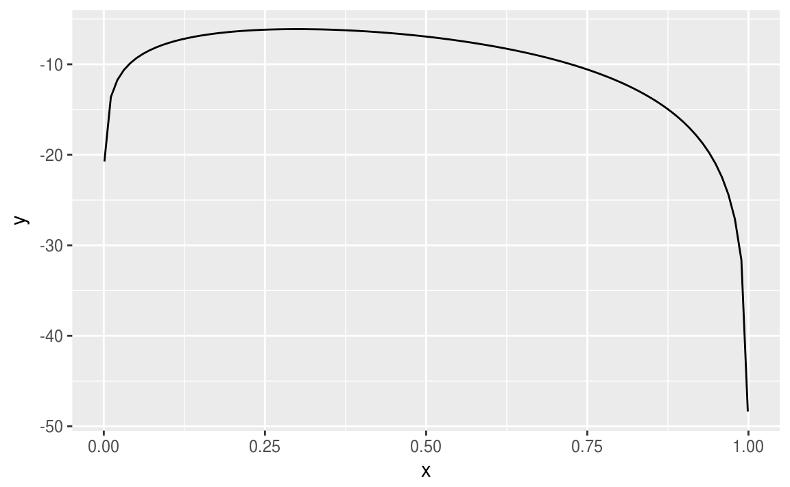

# Análisis de datos categóricos

<style>
  .espacio {
     margin-bottom: 1cm;
  }
</style>

<style>
  .espacio3 {
     margin-bottom: 3cm;
  }
</style>

Sólo necesitas instalar un paquete una vez, pero debes volver a cargarlo cada vez que inicies una nueva sesión.


```r
library(tidyverse)
```

Las variables categóricas están por doquier. Desde ayudar a decidir cuándo un tratamiento médico es mejor hasta evaluar los factores que afectan nuestras opiniones y conductas, hoy en día los analistas encuentran innumerables usos para los métodos de datos categóricos. Primero vamos a repasar algunos conceptos de probabilidad.

## Repaso y algunos conceptos

Recordemos la **distribución multinomial**. Supongamos que cada uno de $n$ ensayos independientes e idénticos tiene realizaciones en $c$ categorías. Definimos $y_{ij}$ como
$$
y_{ij} = \left\{ \begin{array}{cl}
1 & \text{si el }\; i\text{-ésimo ensayo cae en la categoría }j,\\
0 & \text{en otro caso.}
\end{array}\right.
$$

Entonces $y_i=(y_{i1},y_{i2},\ldots,y_{ic})$ representa _un_ ensayo multinomial, done
$$
\displaystyle{\sum_j{y_{ij}}}=1.
$$

Notemos que $y_{ic}=1-(y_{i1}+\cdots+y_{i,c-1})$ es redundante. Sea $n_j=\displaystyle{\sum_i{y_{ij}}}$ el número de ensayos que caen en la categoría $j$. Los conteos $(n_1,n_2,\ldots,n_c)$ tienen una distribución multinomial.

Sea $\pi_{j}=P(Y_{ij}=1)$, la probabilidad de éxito en la categoría $j$. La función de masa de probabilidad de $(n_1,n_2,\ldots,n_c)$ es 
$$
p(n_1,n_2,\ldots,n_c) = \dfrac{n!}{n_1!n_2!\cdots n_c!}\pi_1^{n_1}\pi_2^{n_2}\cdots \pi_c^{n_c}.
$$

Sea $n=\displaystyle{\sum_j{n_j}}$. Recordemos que esta ecuación es de dimensión $c-1$ porque 
$$
n_c = n - (n_1 + n_2 + \cdots + n_{c-1}).
$$

Se puede ver que
$$
\begin{eqnarray*}
E(n_j) =n\pi_j, \quad && V(n_j)=n\pi_j(1-\pi_j),\\
C(n_i,n_j)=-n\pi_i \pi_j&\quad&\mbox{si } i\neq j
\end{eqnarray*}
$$

**Modelo Poisson**

Sean $(Y_1,Y_2,\ldots,Y_c)$ variables aleatorias Poisson independientes con parámetros $(\mu_1,\mu_2,\ldots,\mu_c)$. La función de masa de probabilidad conjunta es
$$
P(Y_1=n_1, Y_2=n_2, \ldots, Y_c=n_c) = \prod_i{\mbox{exp}(-\mu_i)\dfrac{\mu_i^{n_i}}{n_i!}}.
$$ 

El total $n=\displaystyle{\sum_i{Y_i}}$ también tiene una distribución Poisson con media $\displaystyle{\sum_i{\mu_i}}$. Como $n$ también es una variable aleatoria, al condicionar en $n$, $\{Y_i\}$ ya no tienen una distribución Poisson, pues cada $Y_i$ no puede exceder $n$.

La distribución condicional es
$$
\begin{eqnarray*}
P\left(Y_1=n_1,\ldots,Y_c=n_c \,\middle|\,  \sum_j{Y_j}=n\right) &=& \dfrac{P(Y_1=n_1,\ldots,Y_c=n_c)}{P\left(\sum_j{Y_j}\right)} \\
&=& \dfrac{\prod_i \mbox{exp}(-\mu_i)\mu_i^{n_i}/n_i!}{\mbox{exp}\left(-\sum_j{\mu_j}\right)\left(\sum_j {\mu_j}\right)^n/n!} \\
&=& \dfrac{n!}{\prod_i n_i!} \prod_i{\pi_i^{n_i}}
\end{eqnarray*}
$$
con $\pi_i = \dfrac{\mu_i}{\sum_i \mu_i}$, es decir, se trata de una distribución multinomial con parámetros $(n, \{\pi_i\})$.

Muchos análisis de datos categóricos suponen una distribución multinomial. Tales análisis usualmente tineen resultados similres a aquellos análisis que suponen una distribución Poisson, por las similitudes en sus funciones de verosimilitud.

---

<br>


En la estimación de parámetros a menudo se utilizan dos métodos para obtener intervalos de confianza:

1. Método de Wald

En el caso univariado se utiliza como estimador de la varianza $-E\left(\dfrac{d^2 L(\theta)}{d\theta^2}\right)$ y el estadístico es 
$$z=(\hat{\theta} - \theta_0)/\mbox{SE} \sim N(0,1)$$
o en el caso multivariado,
$$
W = \left(\hat{\theta}- \theta_0\right)^T\left[\mbox{Cov}\left(\hat{\theta}\right)\right]^{-1}\left(\hat{\theta}- \theta_0\right),
$$
y como $\hat{\theta}$ se distribuye normal asintóticamente, entonces la distribución de $W$ es $\chi^2$ con grados de libertad igual al rango de $\mbox{Cov}\left(\hat{\theta}\right)$, el número de parámetros no redundantes.

2. Método de cociente de verosimilitud

Si $l_0$ es el máximo valor de la función de verosimilitud bajo $H_0$ y $l_1$ es el valor máximo sobre el espacio de parámetros (que contiene también el valor bajo $H_0$), entonces $l_0 \leq l_1$ y el estadístico es

$$-2\,  \mbox{log}(\Lambda) = -2\,  \mbox{log}(l_0/l_1)=-2(L_0-L_1) \sim \chi^2_n$$
donde los grados de libertad equivalen a la diferencia de dimensiones de los espacios de parámetros.

### Caso binomial

Definimos la función de verosimilitud de una variable aleatoria binomial con $n$ realizaciones y $x$ éxitos:

$$
L(\theta) = \mbox{log}(\theta^x(1-\theta)^{n-x}) = x\mbox{log}(\theta) + (n-x)\mbox{log}(1-\theta)
$$


```r
likelihood <- function(x, n){
  function(theta){x*log(theta) + (n-x)*log(1-theta)}
}
```

Creamos nuestra función de verosimilitud para $x=3$ y $n=10$:


```r
mi_likelihood <- likelihood(3, 10)
```

Graficamos la función:


```r
ggplot(data = data.frame(x = 0), mapping = aes(x = x)) +
  stat_function(fun = mi_likelihood) + xlim(0.001,0.999)
```



El estadístico de Wald da como resultado el invervalo

$$
\hat{\theta} \pm z_{\alpha/2}\sqrt{\dfrac{\hat{\theta}(1-\hat{\theta})}{n}}
$$

El estadístico del cociente de verosimilitud es:

$$
2x\left[x\mbox{log}\left(\dfrac{\hat{\theta}}{\theta_0}\right)+(n-x)\mbox{log}\left(\dfrac{1-\hat{\theta}}{1-\theta_0}\right)\right] = \chi^2_{1,\alpha}
$$

Se puede expresar como

$$
2\sum{\mbox{observado} \,\left[\,\mbox{log}\left(\dfrac{\mbox{observado}}{\mbox{ajustado}}\right)\right]}
$$

Existen varios métodos para obtener intervalos de confianza. Utilizando la función `ciAllx` del paquete `proportion` podemos obtener intervalos de confianza para $\hat{\theta}$ a partir de 6 métodos:


```r
library(proportion)
intervalos <- ciAllx(x = 3, n = 10, alp = 0.05) 
intervalos %>% knitr::kable()
```


method         x   LowerLimit   UpperLimit  LowerAbb   UpperAbb   ZWI 
-----------  ---  -----------  -----------  ---------  ---------  ----
Wald           3        0.016        0.584  NO         NO         NO  
ArcSine        3        0.071        0.603  NO         NO         NO  
Likelihood     3        0.085        0.607  NO         NO         NO  
Score          3        0.108        0.603  NO         NO         NO  
Logit-Wald     3        0.100        0.624  NO         NO         NO  
Wald-T         3        0.002        0.598  NO         NO         NO  

Los intervalos de confianza para todos los métodos son realmente muy similares. Si el tamaño de muestra $n$ es grande, los 6 métodos dan como resultado intervalos de confianza prácticamente idénticos.


```r
ggplot(intervalos, aes(y = method)) + 
  geom_segment(aes(x = LowerLimit, xend = UpperLimit, y = method, yend = method)) + 
  geom_vline(xintercept = 0.3, color = 'red') +
  xlab('Intervalo de confianza para cada método')
```


---

<br>

### Estimación de parámetros multinomiales {-}

Definimos la función de verosimilitud
$$
l(n_1,n_2,\ldots,n_c | \pi_1, \pi_2, \ldots, \pi_c) = c \prod_j \pi_j^{n_j}
$$
donde $\pi_j \geq 0$ y $\sum_j{\pi_j}=1$. 

Para estimar $\{\pi_j\}$ maximizamos la log-verosimilitud
$$
L(\pi) = \sum_j{n_j \mbox{log}(\pi_j)}.
$$

Para no tener redundancias vemos $L$ como función de $\pi_1,\pi_2,\ldots,\pi_{c-1}$ pues $\pi_c=1-(\pi_1+ \pi_2+\cdots+\pi_{c-1})$. Por lo tanto,
$$
\dfrac{d \pi_c}{d \pi_j} = -1 \qquad \mbox{para }\; j=1,2,\ldots,c-1.
$$
Por la regla de la cadena,
$$
\dfrac{d\,\mbox{log}(\pi_c)}{d\,\pi_j}=\dfrac{1}{\pi_c} \cdot \dfrac{d\, \pi_c}{d\, \pi_j}=-\dfrac{1}{\pi_c}.
$$
Ahora diferenciamos $L$ con respecto a $\pi_j$
$$
\dfrac{d\, L(\pi)}{d\, \pi_j}=\dfrac{n_j}{\pi_j} - \dfrac{n_c}{\pi_c} = 0.
$$
Por lo que los estimadores de máxima verosimilitud satisfacen que
$$
\dfrac{\hat{\pi}_j}{\hat{\pi}_c} = \dfrac{n_j}{n_c}.
$$
Ahora bien,
$$
1 = \sum_j{\pi_j}= \dfrac{\hat{\pi}_c\left(\sum_j n_j\right)}{n_c}=\dfrac{\hat{\pi}_c n}{n_c},
$$
y se tiene que $\hat{\pi_c}=n_c/n$ y $\hat{\pi_j}=n_j/n$ para $j=1,2,\ldots,c-1$.

Se puede verificar que estos estimadores efectivamente maximizan la verosimilitud. Notemos que $\hat{\pi_j}=n_j/n$ son las proporciones muestrales.

## La $\chi^2$ de Pearson de una multinomial

En 1900 el estadístico Karl Pearson definió una prueba de hipótesis para la multinomial. Su motivación inicial fue analizar las probabilidades de ocurrencias de varias realizaciones en el juego de la ruleta. Consideramos para $j=1,2,\ldots,c$ 
$$
H_0:\pi_j =\pi_{j0} \qquad H_1:\pi_j \neq \pi_{j0}.
$$

Bajo $H_0$, los valores esperados de $\{n_j\}$, llamadas _frecuencias esperadas_ son $\mu_j=n\pi_{j0}$, $j=1,\ldots,c$. El estadístico propueto es
$$
X^2 = \sum_j{\dfrac{(n_j - \mu_j)^2}{\mu_j}} \sim \chi^2_{(c-1)}.
$$

Si las diferencias $\{n_j - \mu_j\}$ son más grandes, esto produce valores $X^2$ más grandes para una $n$ fija. Si $X_o^2$ es el valor observado de $X^2$ entonces el valor p es $P(X^2 \geq X_o^2)$. Si $n$ es grande, $X^2$ tiene una distribución $\chi^2_{c-1}$.


### Cociente de verosimilitud de una multinomial

Bajo $H_0$ la verosimilitud se maximiza cuando $\hat{\pi}_j=\pi_{j0}$ y en el caso general cuando $\hat{pi}_j=\frac{n_j}{n}$. El cociente de verosimilitud es

$$
\Lambda = \dfrac{\prod_j{\pi_{j0}^{n_j}}}{\prod_j{(n_j/n)^{n_j}}}.
$$
Por lo tanto, el estadístico del cociente de verosimilitud es

$$
G^2 = -2\,\mbox{log}(\Lambda) = 2\, \sum_j{n_j \mbox{log}\left(\dfrac{n_j}{n}\pi_{j0}\right)}.
$$

A este estadístico se le llama _estadístico $\chi^2$ de verosimilitud_. Entre más grande sea el valor de $G^2$ hay mayor evidencia en contra de $H_0$. En el caso general, el espacio de parámetros consiste de $\{\pi_j\}$ sujeto a que $\sum_j{\pi_j}=1$, por lo que la dimensión es $c-1$. Bajo $H_0$, se especifica por completo $\{\pi_j\}$, por lo que la dimensión es $0$. La diferencia entre estas dimensiones es $(c-1)$. Si $n$ es grande, entonces $G^2$ tiene una distribución $\chi^2$ con $(c-1)$ grados de libertad.

## Definiciones

Supongamos que se tiene una tabla de contingencias. A continuación introduciremos una notación y algunas definiciones.

### Notación

Sea $\pi_{ij}$ la probabilidad de que una observación $(X,Y)$ esté en la celdilla ($i$,$j$). Las densidades marginales las denotamos por:
$$
\pi_{i+}=\sum_j{\pi_{ij}},\qquad \pi_{+j}  = \sum_i{\pi_{ij}}
$$
Cuando ambas variables son aleatorias, se pueden definir las densidades marginales:
$$
\pi_{j|i} = \pi_{ij}/\pi_{i+}, \qquad \mbox{para toda }i\mbox{ y }j
$$

Se dice que las variables son **independientes** si 
$$
\pi_{ij} = \pi_{i+}\pi_{+j} \quad \mbox{para }\; i=1,\ldots,I\; \mbox{ y para }\; j=1,\ldots,J.
$$
Cuando son independientes se cumple que
$$
\pi_{j|i}=\pi_{ij}/\pi_{i+}=(\pi_{i+}\pi_{+j})/\pi_{i+}=\pi_{+j} \quad \mbox{para }i=1,\ldots,I.
$$

### Razón de momios

\BeginKnitrBlock{nota}<div class="nota">Para una probabilidad de éxito $\pi$ se definen los _momios_ (o _chances_) como
$$
\Omega = \dfrac{\pi}{1-\pi}
$$
Los momios siempre son no negativos.</div>\EndKnitrBlock{nota}

**Ejemplo**

Un **sitio de apuestas** escribe:

> Momio 7/1: Ganas $7 por cada $1 apostado. Si apuestas $10, cobras $70 más tu apuesta, es decir, $80.
> Momio 5/2: Ganas $5 por cada $2 apostados. Si apuestas $10, cobras $25 más tu apuesta, es decir, $35.
> Momio 3/5: Ganas $3 por cada $5 apostados. Si apuestas $10, cobras $6 más tu apuesta, es decir, $16.


<p class="espacio">
</p>


<p class="espacio">
</p>

 
<div class="centered">
<p class="espacio">
</p>
Si el momio es menor que 1 entonces...

(a) La probabilidad de éxito es cero.

(b) La probabilidad de éxito es menor que $1/2$.

(c) El éxito es más probable que el fracaso.

(d) Todas la anteriores.

<p class="espacio3">
</p>
</div>
<br>

\BeginKnitrBlock{information}<div class="information">Si $\Omega > 1$, entonces es más probable el éxito que el fracaso. Por ejemplo, cuando $\pi=0.75$ entonces $\Omega = 0.75/0.25 =3$, un éxito es 3 veces más probable que un fracaso, y esperaríamos 3 éxitos por cada fracaso. Cuando $\Omega = \frac{1}{3}$ un fracaso es tres veces más verosímil que un éxito.</div>\EndKnitrBlock{information}

<br>


Inversamente, 

$$
\pi = \dfrac{\Omega}{\Omega + 1}.
$$

Pensemos nuevamente en una tabla de contingencias de $2\times 2$, en la $i$-ésima fila los momios de éxito en vez de fracaso son $\Omega_i=\pi_i/(1-\pi_i)$. La **razón de momios** de $\Omega_1$ y $\Omega_2$ en ambas filas es:

$$
\theta = \dfrac{\Omega_1}{\Omega_2}=\dfrac{\pi_1/(1-\pi_1)}{\pi_2/(1-\pi_2)}
$$

Si se tiene una tabla con probabilidades conjuntas $\{\pi_{ij}\}$ la definición equivalente de momio para cada fila es $\Omega_i=\pi_{i1}/\pi_{i2}$, $i=1,2$. Entonces la razón de momios es:

$$
\theta = \dfrac{\pi_{11}/\pi_{12}}{\pi_{21}/\pi_{22}}=\dfrac{\pi_{11}\pi_{22}}{\pi_{12}\pi_{21}}
$$

A $\theta$ se le conoce también como la _razón del producto cruzado_.

\BeginKnitrBlock{nota}<div class="nota">¿Cómo interpretamos este número?

* Si $\theta=1$ (o $\Omega_1=\Omega_2$), entonces las variables son independientes.

* Si $\theta > 1$, entonces las observaciones en el renglón 1 tienen más probabilidad de éxito que observaciones en en renglón 2, es decir, $\pi_1 > \pi_2$.
  
* Si $\theta < 1$, entonces $\pi_1 < \pi_2$.</div>\EndKnitrBlock{nota}

Para conteos en una tabla de contingencia, la _razón de momios muestral_ es:

$$
\hat{\theta} = \dfrac{n_{11}n_{22}}{n_{12}n_{21}}
$$

Regresemos a los datos de billboard:


```r
billboard <- read_csv("datos/billboard_alltime.csv")
```


```r
OR <- function(var1, var2){
  n <- table(var1, var2)
  
  (n[1,1] / n[1,2])*(n[2,2] / n[2,1])
}
OR(billboard$gains_performance, billboard$rising)
#> [1] 2.75
```

Los chances de éxito (subir una o más posiciones en el chart) cuando no hubo una presentación en vivo (rengón 1) son equivalentes a 4 veces los chances de éxito (incremento en el chart) que cuando no hubo presentación en vivo (renglón 2).


```r
ORWald <- function(var1, var2, alpha = 0.05){
  tab <- table(var1, var2)
  siglog <- sqrt((1/tab[1,1]) + (1/tab[1,2]) + (1/tab[2,1]) + (1/tab[2,2]))
  zalph <- qnorm(1 - alpha/2)
  logOR <- log(OR(var1, var2))
  loglo <- logOR - zalph * siglog
  loghi <- logOR + zalph * siglog
  
  ORlo <- exp(loglo)
  ORhi <- exp(loghi)
  
  tibble(LowerCI = ORlo, OR = OR(var1, var2), UpperCI = ORhi, alpha = alpha)
}

ORWald(billboard$gains_performance, billboard$rising)
```


Con la función `odds.ratio` del paquete `questionr` se puede calcular la razón de momios y el paquete hace una prueba de hipótesis conocida como **prueba exacta de Fisher**:


```r
library(questionr)
odds.ratio(table(billboard$gains_performance, billboard$rising))
#>                 OR 2.5 % 97.5 %      p    
#> Fisher's test 2.75  2.70    2.8 <2e-16 ***
#> ---
#> Signif. codes:  0 '***' 0.001 '**' 0.01 '*' 0.05 '.' 0.1 ' ' 1
```


\BeginKnitrBlock{comentario}<div class="comentario">* Valores de $\theta$ más alejados de $1$ reflejan un mayor grado de asociación entre las variables.

* Dos valores representan la misma asociación pero en direcciones opuestas, cuando uno es el recíproco del otro.

  - Por ejemplo, cuando $\theta=0.25$ los chances de éxito en el renglón 1 son 0.25 veces los chances en el renglón 2, o equivalentemente, los chances de éxito en el renglón 2 son 1/0.25 = 4 veces los chances en el renglón 1.</div>\EndKnitrBlock{comentario}

<p class="espacio">
</p>

 
<div class="centered">
<p class="espacio">
</p>
Si se invierte el orden de los renglones o de las columnas, entonces $\theta$

(a) no cambia.

(b) debe ser necesariamente $1$.

(c) es el recíproco de su valor original.

(d) puede tomar cualquier valor.

<p class="espacio3">
</p>
</div>
<br>

Para hacer inferencia es conveniente usar $\mbox{log}(\theta)$. Este tiene las siguientes propiedades:

1. El caso de independencia corresponde a $\mbox{log}(\theta) = 0$.

2. El logaritmo de la razón de momios es simétrico alrededor de $0$. 

3. Si se invierten los renglones o las columnas, entonces $\mbox{log}(\theta)$ cambia de signo pero tiene la misma magnitud. Por ejemplo, dos valores de $\mbox{log}(\theta)$ que tienen misma magnitud pero signos contrarios, como $\mbox{log}(4)=1.39$ y $\mbox{log}(0.25)=-1.39$, representan el mismo grado de asociación.


## Asociación en tablas de tamaño $I\times J$

En tablas de $2\times 2$ un sólo número como la razón de momios puede ser suficiente para resumir la asociación. En tablas $I\times J$ usualmente no es posible resumir la asociación entre las dos variables con un sólo número sin alguna pérdida de información. Sin embargo, un conjunto de razones de momios, o bien, algun otro estadístico de resumen pueden ser útil para describir la asociación entre las variables.

### Razones de momios en tablas $I\times J$

Se puede utiliar los $\dbinom{I}{2}$ pares de renglones en combinación con los $\dbinom{J}{2}$ pares de columnas. Para renglones $a$ y $b$ y columnas $c$ y $d$ la razón de momios utiliza 4 valores en casillas en un patrón rectangular:

$$
\dfrac{\pi_{ab}\pi_{bd}}{\pi_{bc}\pi_{ad}}
$$

Consideremos el subconjunto de $(I-1)(J-1)$ _razones de momios locales_:

$$
\theta_{ij} = \dfrac{\pi_{ij}\pi_{i+1,j+1}}{\pi_{i,j+1}\pi_{i+1,j}},  \qquad i=1,\ldots, I-1,\;\;\; j=1,\ldots,J-1.
$$

Estos $(I-1)(J-1)$ razones de momios determinan las razones de momios entre pares de renglones y pares de columnas. 

### Ejemplo: mushrooms  

Este conjunto de datos incluye descripciones de muestras correspondientes a 23 especies de setas de las familias Agaricus y Lepiota. 

Cada especie está identificada como definitivamente comestible, definitivamente venenosa, o de comestibilidad desconocida y no recomendada su ingesta.

Las otras variables se presentan en la siguiente tabla:

| Variable                 | Categorías
|--------------------------|----------------------------------------------------------------------------------------------------|
| cap-shape                | bell=b,conical=c,convex=x,flat=f,knobbed=k,sunken=s                                                |
| cap-surface              | fibrous=f,grooves=g,scaly=y,smooth=s                                                               |
| cap-color                | brown=n,buff=b,cinnamon=c,gray=g,green=r,pink=p,purple=u,red=e,white=w,yellow=y                    |
| bruises                  | bruises=t,no=f                                                                                     |
| odor                     | almond=a,anise=l,creosote=c,fishy=y,foul=f,musty=m,none=n,pungent=p,spicy=s                        |
| gill-attachment          | attached=a,descending=d,free=f,notched=n                                                           |
| gill-spacing             | close=c,crowded=w,distant=d                                                                        |
| gill-size                | broad=b,narrow=n                                                                                   |
| gill-color               | black=k,brown=n,buff=b,chocolate=h,gray=g,green=r,orange=o,pink=p,purple=u,red=e,white=w,yellow=y  |
| stalk-shape              | enlarging=e,tapering=t                                                                             |
| stalk-root               | bulbous=b,club=c,cup=u,equal=e,rhizomorphs=z,rooted=r,missing=?                                    |
| stalk-surface-above-ring | fibrous=f,scaly=y,silky=k,smooth=s                                                                 |
| stalk-surface-below-ring | fibrous=f,scaly=y,silky=k,smooth=s                                                                 |
| stalk-color-above-ring   | brown=n,buff=b,cinnamon=c,gray=g,orange=o,pink=p,red=e,white=w,yellow=y                            |
| stalk-color-below-ring   | brown=n,buff=b,cinnamon=c,gray=g,orange=o,pink=p,red=e,white=w,yellow=y                            |
| veil-type                | partial=p,universal=u                                                                              |
| veil-color               | brown=n,orange=o,white=w,yellow=y                                                                  |
| ring-number              | none=n,one=o,two=t                                                                                 |
| ring-type                | cobwebby=c,evanescent=e,flaring=f,large=l,none=n,pendant=p,sheathing=s,zone=z                      |
| spore-print-color        | black=k,brown=n,buff=b,chocolate=h,green=r,orange=o,purple=u,white=w,yellow=y                      |
| population               | abundant=a,clustered=c,numerous=n,scattered=s,several=v,solitary=y                                 |
| habitat                  | grasses=g,leaves=l,meadows=m,paths=p,urban=u,waste=w,woods=d                                       |


```r
mushrooms <- read_csv("datos/mushrooms.csv")
glimpse(mushrooms)
#> Observations: 8,124
#> Variables: 23
#> $ edibility                  <chr> "p", "e", "e", "p", "e", "e", "e", ...
#> $ `cap-shape`                <chr> "x", "x", "b", "x", "x", "x", "b", ...
#> $ `cap-surface`              <chr> "s", "s", "s", "y", "s", "y", "s", ...
#> $ `cap-color`                <chr> "n", "y", "w", "w", "g", "y", "w", ...
#> $ bruises                    <chr> "t", "t", "t", "t", "f", "t", "t", ...
#> $ odor                       <chr> "p", "a", "l", "p", "n", "a", "a", ...
#> $ `gill-attachment`          <chr> "f", "f", "f", "f", "f", "f", "f", ...
#> $ `gill-spacing`             <chr> "c", "c", "c", "c", "w", "c", "c", ...
#> $ `gill-size`                <chr> "n", "b", "b", "n", "b", "b", "b", ...
#> $ `gill-color`               <chr> "k", "k", "n", "n", "k", "n", "g", ...
#> $ `stalk-shape`              <chr> "e", "e", "e", "e", "t", "e", "e", ...
#> $ `stalk-root`               <chr> "e", "c", "c", "e", "e", "c", "c", ...
#> $ `stalk-surface-above-ring` <chr> "s", "s", "s", "s", "s", "s", "s", ...
#> $ `stalk-surface-below-ring` <chr> "s", "s", "s", "s", "s", "s", "s", ...
#> $ `stalk-color-above-ring`   <chr> "w", "w", "w", "w", "w", "w", "w", ...
#> $ `stalk-color-below-ring`   <chr> "w", "w", "w", "w", "w", "w", "w", ...
#> $ `veil-type`                <chr> "p", "p", "p", "p", "p", "p", "p", ...
#> $ `veil-color`               <chr> "w", "w", "w", "w", "w", "w", "w", ...
#> $ `ring-number`              <chr> "o", "o", "o", "o", "o", "o", "o", ...
#> $ `ring-type`                <chr> "p", "p", "p", "p", "e", "p", "p", ...
#> $ `spore-print-color`        <chr> "k", "n", "n", "k", "n", "k", "k", ...
#> $ population                 <chr> "s", "n", "n", "s", "a", "n", "n", ...
#> $ habitat                    <chr> "u", "g", "m", "u", "g", "g", "m", ...
```


```r
library(oddsratio)
mushrooms_1 <- mushrooms %>%
  mutate(edibility = 1*(edibility == 'e'))
fit_glm <- glm(edibility ~ `cap-color`, data=mushrooms_1, family='binomial')
or_glm(data = mushrooms_1, model = fit_glm)
```


En esta tabla se tienen dos columnas donde "e" siginifica que la seta es comestible y "p" que la seta es venenosa. En los renglones están los colores de las setas codificados de acuerdo con la tabla anterior. En las columnas están las razones de momio para cada color para aquellas setas que son comestibles.


Veamos la tabla de color y comestibilidad:


```r
table(mushrooms$edibility, mushrooms$`cap-color`)
#>    
#>        b    c    e    g    n    p    r    u    w    y
#>   e   48   32  624 1032 1264   56   16   16  720  400
#>   p  120   12  876  808 1020   88    0    0  320  672
```

Podemos ver que la razón de momios para p=pink y u=purple es "infinita" porque hay muy pocas observaciones para setas de esos colores. De cualquier forma, con los momios podemos concluir que aquellas setas de colores c=cinnamon y w=white aumentan los chances de que sean comestibles en 6.7 y 5.6, respectivamente.


## Intervalos de confianza para los parámetros de asociación

La precisión de los esitmadores de asociación está caracterizada por las distribuciones muestrales de los errores estándar. Para tablas de $2\times 2$ recordemos que 
$$
\hat{\theta} = \dfrac{n_{11}n_{22}}{n_{12}n_{21}}
$$

Se puede demostrar que $\hat{\theta}$ tiene una distribución normal asinotóticamente alrededor de $\theta$. A menos que $n$ sea grande, la distribución muestral generalmente es sesgada.


### Error estándar de la razón de momios

Utilizando la transformación de logaritmo, la estructura multiplicativa converge muy rápidamente a la normalidad. Una aproximación del error estándar para $\mbox{log}(\hat{\theta})$ es

$$
\hat{\sigma}(\mbox{log}\hat{\theta}) = \sqrt{\dfrac{1}{n_{11}}+\dfrac{1}{n_{12}}+\dfrac{1}{n_{21}}+\dfrac{1}{n_{22}}}.
$$

Como consecuencia de la normalidad de la distribución de $\mbox{log}(\hat{\theta})$,

$$
\mbox{log}(\hat{\theta}) \pm z_{\alpha/2}\hat{\sigma}(\mbox{log}\hat{\theta})
$$

## Prueba de independencia 

Suponemos que se tiene resultados obtenidos de una distribución multinomial y probabilidades conjuntas $\{\pi_{ij}\}$ en una tabla de contingencia de dimensiones $I\times J$.

\BeginKnitrBlock{nota}<div class="nota">La hipótesis nula de independencia estadística es:
$$
H_0:\pi_{ij}=\pi_{i+}\pi_{+j},\qquad \text{ para toda }\;\; i \;\;\text{ y }\;\; j.
$$</div>\EndKnitrBlock{nota}

### La prueba $\chi^2$ de Pearson

Ya estudiamos la prueba para valores específicos de probabilidades multinomiales. Una prueba de $H_0:\mbox{independencia}$ utiliza la $\chi^2$ con $n_{ij}$ en lugar de $n_i$ y con $\mu_{ij}=n\pi_{i+}\pi_{+j}$ en lugar de $\mu_i$. 

\BeginKnitrBlock{information}<div class="information">Bajo $H_0$:
  
$$E(n_{ij}) = \mu_{ij}$$
  
Usualmente $\{\pi_{i+}\}$ y $\{\pi_{+j}\}$ son _conocidas_. Sus estimadores de máxima verosimilitud son $\hat{\pi}_{i+}=n_{i+}/n$ y $\hat{\pi}_{+j}=n_{+j}/n$.

Las frecuencias esperadas estimadas son
$$
\{\hat{\mu}_{ij} = n\hat{\pi}_{i+}\hat{\pi}_{+j}=n_{i+}n_{+j}/n^2\}
$$
  
Por lo tanto, el estadístico de Pearson es:
$$
\chi^2 = \displaystyle{\sum_{i}\sum_{j}{\dfrac{(n_{ij}-\hat{\mu}_{ij})^2}{\hat{\mu}_{ij}}}}.
$$</div>\EndKnitrBlock{information}

En 1900, el mismo Karl Pearson argumento que reemplazar las $\{\mu_{ij}\}$ por sus estimadores $\{\hat{\mu}_{ij}\}$ no afectaría la distribución muestral cuando se tiene una muestra grande. Como la tabla de contingencia tiene $IJ$ categorías, Pearson argumentó que la $\chi^2$ se distribuye como _chi cuadrada_ asintóticamente con grados de libertad $IJ-1$. 

\BeginKnitrBlock{nota}<div class="nota">Sin embargo, años después (en 1922) Fisher publicó un artículo corrigiendo el error de Pearson. Lo que sucede es lo siguiente: estimar $\{\hat{\mu}_{ij}\}$ requiere de estimar $\{\pi_{i+}\}$ y $\{\pi_{+j}\}$, por lo que los grados de libertad son:

$$
(IJ - 1) - (I-1) - (J-1) = (I-1)(J-1).
$$</div>\EndKnitrBlock{nota}

**El estadístico de cociente de verosimilitud**

Para una muestra multinomial, el kernel de la verosimilitud es

$$
\prod_i \prod_j{\pi_{ij}^{n_{ij}}},\qquad \;\text{donde todas }\;\; \pi_{ij}\geq0\;\; \mbox{y}\;\;\sum_i \sum_j{\pi_{ij}}=1.
$$

Bajo $H_0:\text{independencia}$, $\hat{\pi}_{ij}=\hat{\pi}_{i+}\hat{\pi}_{+j}=n_{i+}n_{+j}/n^2$. En el caso general, $\hat{\pi}_{ij}=n_{ij}/n$. El cociente de verosimilitud es igual a

$$
\Lambda = \dfrac{\prod_i \prod_j (n_{i+}n_{+j})^{n_{ij}}}{n^n\prod_i\prod_j{n_{ij}^{n_{ij}}}}.
$$

El estadístico del cociente de verosimilitud es $-2\mbox{log}(\Lambda)$. Denotado por $G^2$, es igual a:

$$
G^2 = -2\mbox{log}(\Lambda) = 2\sum_i\sum_j{n_{ij}\mbox{log}(n_{ij}/\hat{\mu}_{ij})}
$$

Entre más grandes sean los valores de $G^2$ y $X^2$, mayor evidencia de independencia. En el caso general el espacio consiste de $\{\pi_{ij}\}$ sujeto a la restricción lineal de que deben sumar $1$. El espacio de parámetros tiene dimensión $IJ-1$. Bajo $H_0$ el espacio está determinado por $\{\pi_{i+}\}$ y $\{\pi_{+j}\}$, por lo que su dimensión es de $(I-1) + (J-1)$. La diferencia entre estas dimensiones es $(I-1)(J-1)$. Para muestras grandes, $G^2$ tiene una distribución nula $\chi^2$ con grados de libertad $(I-1)(J-1)$. Por lo que $G^2$ y $X^2$ tienen la misma distribución límite. De hecho, son asintóticamente equivalentes: $X^2 - G^2$ converge en probabilidad a $0$.


### Ejemplo: brecha de género


```r
gendergap <- matrix(c(279,73,225,165,47,191), byrow = T, ncol = 3)
dimnames(gendergap) <- list(Gender=c("Female","Male"), PartyID=c("Democrat","Independent","Republican"))
gendergap %>% knitr::kable()
```

          Democrat   Independent   Republican
-------  ---------  ------------  -----------
Female         279            73          225
Male           165            47          191

La prueba de $\chi^2$ de Pearson se puede obtener con la función `chisq.test` que ya está en R base:


```r
chisq.test(gendergap)
#> 
#> 	Pearson's Chi-squared test
#> 
#> data:  gendergap
#> X-squared = 7, df = 2, p-value = 0.03
```

<!--
## General Social Survey 1972 - 2016


-->


