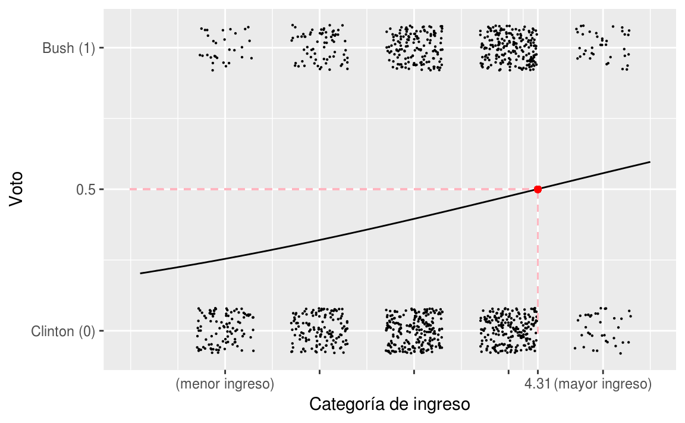
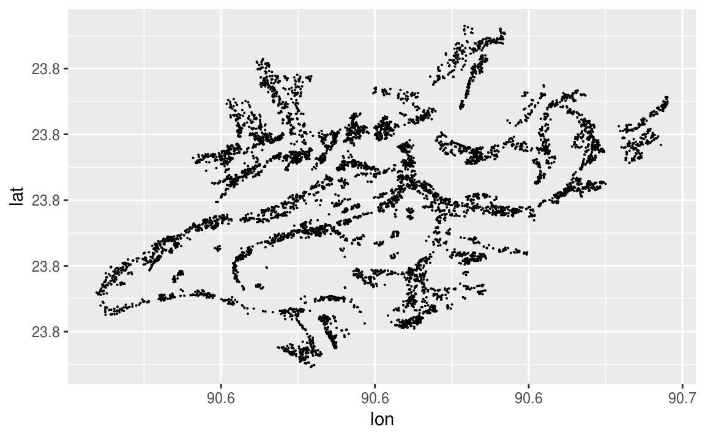
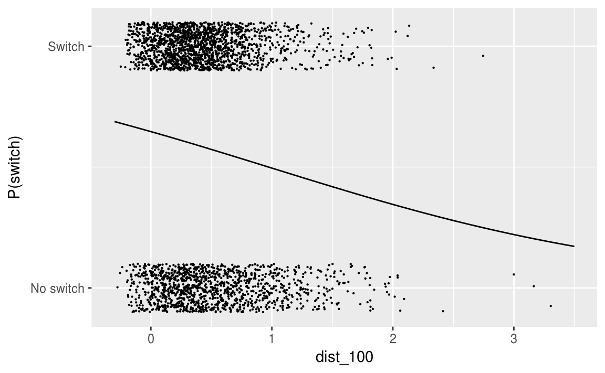
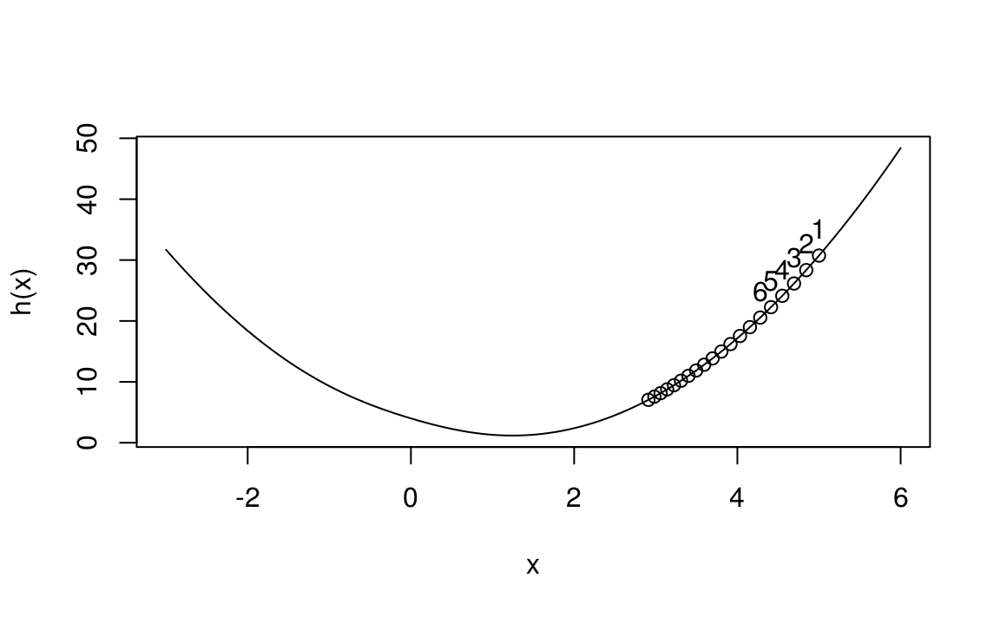
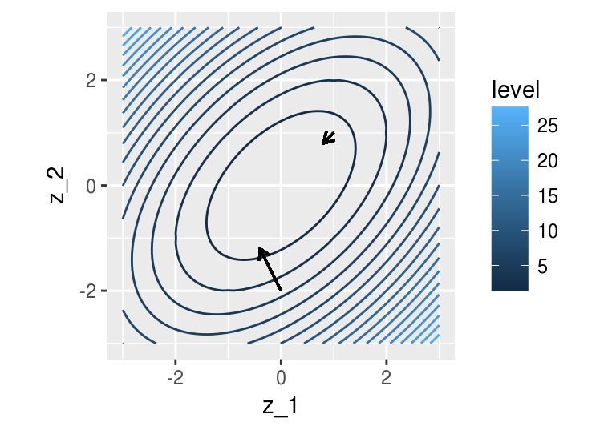
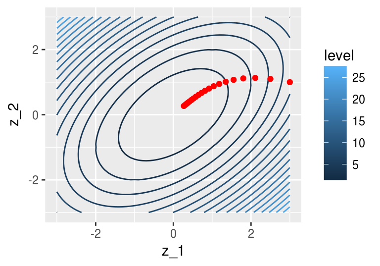
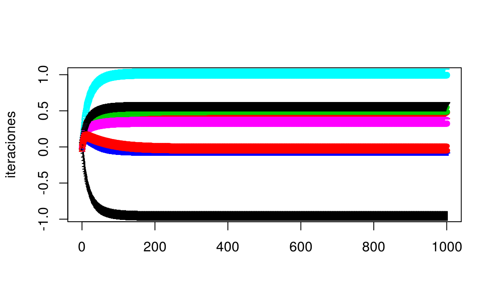

# Regresión logística 2

<style>
  .espacio {
     margin-bottom: 1cm;
  }
</style>

<style>
  .espacio3 {
     margin-bottom: 3cm;
  }
</style>


## Incertidumbre en la estimación

Podemos ajustar varios modelos para mostrar que hay incertidumbre en el ajuste del modelo. En el rango de los datos, la línea sólida muestra el mejor ajuste para una regresión logística, y las líneas de color gris clarito muestran la incertidumbre en el ajuste.


```r
invlogit <- function(x){
  exp(x)/(1+exp(x))
}

M <- 50
N <- nrow(datos_2)

fit.1 <- glm(vote ~ income, data = datos_2, family=binomial(link="logit"))

modelos <- 1:M %>%
  map(~glm(vote ~ income, data = sample_n(tbl = datos_2, size = N, replace = T),
           family=binomial(link="logit"))) %>%
  map(summary) %>% 
  map("coefficients") %>%
  map_df(function(x){data_frame(intercept=x[1,1], income=x[2,1])})

x <- seq(0.5,5.5, length.out = 100)

graf_data <- lapply(1:M, function(i){
  invlogit(modelos$intercept[i] + modelos$income[i]*x)
})
graf_data <- as.data.frame(Reduce(f = cbind, x = graf_data))
colnames(graf_data) <- paste0('V',1:M)
graf_data$x <- x
graf_data$y <- invlogit(fit.1$coef[1] + fit.1$coef[2]*x)

g <- ggplot(graf_data, aes(x=x))
for(i in 1:M){
  g <- g + geom_line(data = graf_data, aes_string(y = paste0('V',i)), colour = 'grey', size=0.2) 
}
g <- g + geom_line(data = graf_data, aes(y = y), colour = 'black', size=1) 

g + xlab("x") + ylab("p(y=1|x)")
```


A este método en estadística se le conoce como _bootstrap_ porque consiste en tomar muestras con reemplazo del mismo tamaño de los datos. Es __muy__ útil para estimar errores estándar.

## Función logística

\BeginKnitrBlock{information}<div class="information">**Recordemos:** $\mbox{logit}^{-1}$ es la función de  transformación de los predictores lineales a las probabilidades que se utilizan en la regresión logística.

$$
\mbox{logit}^{-1}(x) = \mbox{log}\left(\dfrac{x}{1-x}\right)
$$</div>\EndKnitrBlock{information}


```r
ggplot(data.frame(x=seq(-5,5,by=0.05)), aes(x=x)) +
  stat_function(fun = invlogit, xlim = c(-5,5), size=1)
```


Regresemos al ejemplo del ajuste de regresión logística y los coeficientes:


```r
fit.1 <- glm(vote ~ income, data = datos_2, family=binomial(link="logit"))
fit.1$coefficients
#> (Intercept)      income 
#>      -1.402       0.326
```


Podemos ver la probabilidades que predice el modelo graficando la función con sus respectivos coeficientes:


```r
ggplot(datos_2, aes(x = income, y = vote)) +
  geom_jitter(width = 0.3, height = 0.08, size = 0.1) +
  stat_function(fun=function(x){invlogit(fit.1$coef[1]+fit.1$coef[2]*x)}, xlim=c(0.1,5.5), size=0.5) +
  geom_segment(aes(x=-0.01, y=0.5, xend=4.31, yend=0.5), linetype = 2, color = 'lightpink') + 
  geom_segment(aes(x=4.31, y=-0.01, xend=4.31, yend=0.5), linetype=2, color = 'lightpink') + 
  geom_point(aes(x=4.31, y=0.5), color = 'red') + 
  scale_x_continuous(breaks=c(1,2,3,4,4.31,5),
        labels=c("(menor ingreso)", "", "", "", "4.31", "(mayor ingreso)")) +
  scale_y_continuous(breaks=c(0,0.5,1), labels=c("Clinton (0)", "0.5", "Bush (1)")) +
  xlab("Categoría de ingreso") + ylab("Voto")
```



$$
\mbox{logistic regression model: }\; y = \mbox{logit}^{−1} (−1.40 + 0.33x)
$$

<br>

La probabilidad de predicción es $0.5$ cuando $−1.40 + 0.33x = 0$, que es $x = 1.40/0.33 = 4.31$. La pendiente de la curva de regresión logística es mayor en este punto intermedio.

La función $\mbox{logit}^{-1}(x)=\dfrac{e^x}{1+e^x}$ transforma valores continuos en $(0,1)$, lo cual es necesario, ya que las probabilidades deben estar entre $0$ y $1$.

El modelo 

$$
P(y_i=1)=\mbox{logit}^{-1}(X_i\beta),
$$

se puede expresar como

$$
\begin{eqnarray*}
P(y_i=1) &=& p_i\\
\mbox{logit}(p_i) &=& X_i\beta.
\end{eqnarray*}
$$

Vamos a invertir la función $\mbox{logit}^{-1}$:

$$
\begin{eqnarray*}
f(x) = \dfrac{e^x}{1+e^x} &=& y\\
e^x &=& y (1+e^x)\\
e^x (1-y)&=&y\\
e^x &=& \dfrac{y}{1-y}\\
x &=& \mbox{log}\left(\dfrac{y}{1-y}\right)
\end{eqnarray*}
$$

Preferimos trabajar con $\mbox{logit}^{-1}$ porque es más natural pensar en la transformación del predictor lineal a las probabilidades, que al revés.

Como la función logística inversa _no es lineal_, entonces la diferencia esperada en $y$ correspondiente a una diferencia fija en $x$ no es constante:

* $\mbox{logit}(0.5) = 0$, y $\mbox{logit}(0.6) = 0.4$. Agregar $0.4$ en la escala de logit corresponde a un cambio de 50% a 60% en la escala de probabilidad. 

* $\mbox{logit}(0.9) =2.2$, y $\mbox{logit}(0.93) = 2.6$. Agregar $0.4$ en la escala logit corresponde a un cambio de sólo 90% a 93%.

* $\mbox{logit}(0.953) = 3$. Agregar $0.4$ más corresponde a un incremento en la probabilida de 93% a 95.3%.


En general, los cambios de probabilidad se comprimen en los extremos de la escala de logit, y esto es necesario para mantener las probabilidades entre 0 y 1. 


## Interpretación de los coeficientes

Debido a esta no linealidad, los coeficientes de regresión logística pueden ser difíciles de interpretar. Vamos a utilizar resúmenes numéricos para hacer las interpretaciones.

### Evaluar en (o alrededor de) la media

La curva de la función logística requiere que elijamos dónde evaluar los cambios, si queremos interpretar en la escala de probabilidad. Podemos comenzar evaluando en la media de los datos de entrada.

* Como en regresión lineal, el intercepto se puede interpretar suponiendo valores de $0$ para los otros predictores. Cuando la interpretación de $0$ en los demás valores no es interesante, o bien, $0$ no está en el rango de las variables (como en el ejemplo de votaciones, donde el ingreso está en una escala del 1-5), se puede evaluar el intercepto en otro punto. Por ejemplo, podemos evaluar la probabilidad de voto por Bush en la categoría central de del ingreso y obtener $$\mbox{logit}^{−1}(−1.40 + 0.33 \cdot 3) = 0.40.$$

  O podemos evaluar la probabilidad del voto por Bush $P(y_i=1)$ en la media del ingreso de los encuestados, $$\mbox{logit}^{-1}(-1.4+0.33\cdot \bar{x}).$$


```r
invlogit(coef(fit.1)[1] + coef(fit.1)[2]*mean(datos_2$income))
#> (Intercept) 
#>       0.401
```

En este ejemplo, $\bar{x} = 3.1$, que da como resultado $P(\mbox{vota Bush}) = 0.40$ en la media de $x$.


* Una diferencia de $1$ (1 más en la escala de ingreso de $1$ a $5$) corresponde a una diferencia positiva de $0.33$ en la probabilidad (logit) de voto por Bush. Hay dos maneras convenientes de
resumir esto directamente en términos de probabilidades:

    + Podemos evaluar cómo cambia la probabilidad (logit) ante un cambio unitario con respecto a la media de $x$. Como $\bar{x}=3.1$, entonces podemos evaluar la función de regresión logísta en $x=3$ y $x=2$. La difrerencia en $P(y=1)$ que corresponde a agregar $1$ a $x$ es: $$ \mbox{logit}^{−1}(−1.40+0.33·3)−\mbox{logit}^{−1}(−1.40+0.33·2) = 0.08.$$ Una diferencia de 1 en la categoría de ingresos corresponde a una diferencia positiva del 8% en la probabilidad de apoyar a Bush.
    
    + En vez de considerar un cambio discreto en $x$ podemos calcular la derivada de la curva logística en algún valor central, en este caso la media $\bar{x}=3.1$. Diferenciando la función $$\mbox{logit}^{−1}(\alpha + \beta x)$$ con respecto a $x$ resulta en $$\beta e^{\alpha+\beta x}/(1 + e^{\alpha +\beta x})^2$$. El valor del predictor lineal en el valor central de $\bar{x}=3.1$ es $$−1.40+0.33·3.1 = −0.39,$$ y la pendiente de la curva, el "cambio" en $P(y = 1)$ por unidad pequeña de "cambio" en x, en este punto es $$0.33\cdot e^{-0.39}/(1 + e^{-0.39})^2 = 0.13.$$
    
    + Para este ejemplo, la diferencia en la escala de probabilidad es el mismo valor de 0.13 (con un lugar decimal); esto es típico, pero en algunos casos donde una diferencia de unidad es grande, la diferenciación y la derivada pueden dar respuestas ligeramente diferentes. Sin embargo, siempre serán el mismo signo.
    
    + Podemos comparar la diferencia en la escala de probabilidad (0.08) con la derivada (0.13). Estas generalmente son similares, pero pueden no serlo cuando la diferencia de una unidad es grande.

### La regla de "dividir entre 4"

La curva logística tiene mayor inclinación en el centro, en el punto en el cual $$\alpha + \beta x = 0,$$ de tal forma que $$\mbox{logit}^{-1}(\alpha + \beta x) = 0.5.$$ La pendiente de la curva, o sea la derivada de la función logística, es máxima en este punto y su valor máximo es $\beta/4$.

Como una regla general, se puede tomar cualquier coeficiente de la regresión logística (que no sea el constante o intercepto) y dividirlos entre 4 para obtener una cota superior de la diferencia en probabilidad cuando se varía $x$ _en una unidad_. 

Este límite superior es una aproximación razonable alrededor del punto medio de la curva logística, es decir, donde las probabilidades son cercanas a 0.5.
  
En el ejemplo anterior, el modelo

$$
P(\mbox{vota por Bush}) = \mbox{logit}^{-1}(-1.4 + 0.33\;\cdot \;\mbox{ingreso}),
$$

y podemos dividir $\beta/4$:

$$
\dfrac{\beta}{4}=\dfrac{0.33}{4}\approx 0.0825.
$$

Este número ya lo habíamos obtenido antes analizando diferencias. Una diferencia de $1$ en la categoría de ingreso corresponde a no más de un 8% de diferencia en la probabilidad de voto por Bush. Como los datos en este caso están cerca del punto del 50%, esta aproximación de 0.08 es cercana a 0.13, el valor de la derivada evaluada en la media (_el punto medio en los datos_), que puede no ser el punto medio en la curva.

### Interpretación de los coeficientes como cocientes de momios

Otra forma de interpretar los coeficientes de la regresión logística es en términos de _cocientes de momios_.

\BeginKnitrBlock{comentario}<div class="comentario">Recordemos:
  
<br>

* Si dos resultados tienen probabilidades $(p,1-p)$, entonces $p/(1-p)$ se llaman los _momios_.

* Un momio de 1 es equivalente a una probabilidad de $1/2$, es decir, ambos resultados (éxito y fracaso) son equiprobables.

* Momios de 0.5 y 2 representan probabilidades de 1/3 y 2/3, respectivamente.

* La _razón de momios_ es un cociente de momios: $$\dfrac{p_1/(1-p_1)}{p_2/(1-p_2)}.$$
  
* Una razón de momios de 2 corresponde a un cambio de $p= 0.33$ a $p = 0.5$ o un cambio de $p = 0.5$ a $p = 0.67$.

* Una ventaja de trabajar con razones de momios (en lugar de probabilidades) es que es posible escalar cocientes de momios indefinidamente sin los límites de (0,1) de las probabilidades. Por ejemplo, el cociente de momios de 2 a 4 incrementa la probabilidad de $2/3$ a $4/5$, si se duplican de nuevo los momios a 8, la probabilidad ahora es $8/9$, y así sucesivamente.</div>\EndKnitrBlock{comentario}

Los coeficientes de regresión logística (exponenciados) se pueden interpretar como cocientes de momios. Por simplicidad, vamos a verlo con un modelo de un predictor, pero esta técnica (igual que las anteriores son útiles para _cualquier predictor_ cuando se tienen _varias variables_). 

El modelo es
$$
\begin{eqnarray*}
P(y_i=1|x) &=& \mbox{logit}^{-1}(\alpha+\beta x)\\
&=& \dfrac{e^{\alpha+\beta x}}{1+e^{\alpha+\beta x}}.
\end{eqnarray*}
$$

Además tenemos que

$$
P(y_i=0|x) = \dfrac{1}{e^{\alpha+\beta x}}.
$$

Por lo tanto,

$$
\begin{eqnarray*}
\dfrac{P(y_i=1|x)}{P(y_i=0|x)} &=& e^{\alpha + \beta x},\\
\mbox{log}\left[\dfrac{P(y_i=1|x)}{P(y_i=0|x)} \right] &=& \alpha + \beta x.
\end{eqnarray*}
$$

Sumar 1 a la variable $x$ es equivalente a sumar $\beta$ en ambos lados de la ecuación. Exponenciando nuevamente ambos lados, el cociente de momios se multiplica por $e^\beta$.

Por ejemplo, si $\beta=0.2$, entonces una diferencia unitaria en $x$ corresponde a un cambio multiplicativo de $e^{0.2}=1.22$ en los momios de éxito (con respecto a los chances de un fracaso).

\BeginKnitrBlock{information}<div class="information">**Nota:** El concepto de los momios puede ser un poco difícil de entender y comunicar, y razones de momios aún más. Sin embargo, los momios son útiles para conferirle al modelo una interpretación, para explicar cómo ciertos valores pueden aumentar los chances de éxito utilizando la exponencial de algun coeficiente $e^{\beta_i}$.</div>\EndKnitrBlock{information}

## Ejemplo: pozos en Bangladesh

Vamos a ver cómo utilizar un modelo logístico para poder tomar la decisión a nivel hogar en Bangladesh de si cambiar o no su fuente de agua potable.

### Descripción del problema

Muchos de los pozos utilizados para el agua potable en Bangladesh y otros países del sur de Asia están contaminados con arsénico natural, afectando a aproximadamente 100 millones de personas. 

El arsénico es un veneno acumulativo y la exposición aumenta el riesgo de cáncer y otras enfermedades, y se estima que los riesgos son proporcionales a la exposición.

<p class="espacio">
</p>


<p class="espacio">
</p>


```r
wells_all <- read_csv("datos/wells_all.csv")
```


```r
ggplot(wells_all, aes(x = lon, y = lat)) +
  geom_point(size = 0.05)
```




En esta gráfica podemos ver los pozos en un área de **Araihazar upazila, Bangladesh**. Los puntos representan pozos con arsénico mayor o menor que el estándar de seguridad de 0.5 (en unidades de cientos de microgramos por litro). 

Los pozos están ubicados donde viven las personas. Las áreas vacías entre los pozos son principalmente tierras de cultivo. 

**Tanto pozos seguros como inseguros están mezclados en la mayor parte del área, lo que sugiere que los usuarios de pozos inseguros pueden recurrir a algún pozo seguro cercano.**


```r
library(ggmap)
left <- min(wells_all$lon)
bottom <- min(wells_all$lat)
right <- max(wells_all$lon)
top <- max(wells_all$lat)
araihazar <- get_map(location = c(left,bottom,right,top), zoom = 13)
ggmap(araihazar) +
  geom_point(data = wells_all, aes(x = lon, y = lat, color = switch), size = 0.03, alpha = 0.2) +
  scale_color_manual(values = c("navyblue", "red"))
```


En este artículo reciente se discuten posibles soluciones que hagan uso de tecnologías desarrolladas recientemente: [Win, T. L. (2017, August 28). Can technology help Bangladesh end mass arsenic poisoning?](https://www.reuters.com/article/us-bangladesh-pollution-water-health/can-technology-help-bangladesh-end-mass-arsenic-poisoning-idUSKCN1B80GP)

<br>

Pueden leer también este boletín de la Organización Mundial de la Salud [WHO](http://www.who.int/bulletin/archives/78(9)1093.pdf).

<br>

### Antecedentes del problema

Muchos de los pozos utilizados para el agua potable en Bangladesh y otros países del sur de Asia están contaminados con arsénico natural, afectando a aproximadamente 100 millones de personas. El arsénico es un veneno acumulativo y la exposición aumenta el riesgo de cáncer y otras enfermedades, y se estima que los riesgos son proporcionales a la exposición.

__Causa del problema__

La crisis de arsénico de Bangladesh se remonta a la década de 1970 cuando, en un esfuerzo por mejorar la calidad del agua potable y la lucha contra la diarrea, que era uno de los mayores asesinos de niños en el país, hubo inversiones internacionales a gran escala en la construcción de pozos tubulares. Se creía que los pozos proporcionarían suministros seguros para las familias, de lo contrario dependían del agua superficial sucia que mataba hasta 250,000 niños al año. El agua superficial puede contener microbios, es por esto que era preferible el consumo de agua de pozos profundos.

Cualquier localidad puede incluir pozos con arsénico, como se puede ver en la gráfica de arriba. La mala noticia es que incluso si el pozo de tu vecino es seguro, eso no significa que el tuyo esté a salvo. Sin embargo, la buena noticia es que si tu pozo tiene un nivel alto de arsénico, entonces probablemente puedas encontrar un pozo seguro cerca (si es que estás dispuesto a caminar y tu vecino está dispuesto a compartir 😅). La cantidad de agua necesaria para beber es lo suficientemente baja como para suponer que más personas pueden ocupar el pozo sin agotar su capacidad.

### Metodología para abordar el problema

Un equipo de investigación de los Estados Unidos y Bangladesh midió todos los pozos y los etiquetó con su nivel de arsénico, así como una caracterización: 

* "seguro" (por debajo de 0.5 en unidades de cientos de microgramos por litro, un estándar para el arsénico en el agua potable), o 

* "inseguro" (por encima de 0.5). 

Las personas con pozos inseguros fueron alentados a cambiar a pozos privados o comunitarios cercanos o a nuevos pozos de su propia construcción.

Unos años más tarde, los investigadores volvieron para averiguar qué vecinos habían cambiado de pozo. Hagamos un análisis de regresión logística para comprender los factores predictivos del cambio de pozo entre los usuarios de pozos no seguros. 

Nuestra variable de respuesta es

$$
y_{i} = \left\{ \begin{array}{cl}
1 & \text{si la }\; i\text{-esima casa cambió}\,\,\, \text{de pozo},\\
0 & \text{en otro caso.}
\end{array}\right.
$$

Consideramos las siguientes entradas:

* Un término constante

* La distancia (en metros) al pozo seguro conocido más cercano

* El nivel de arsénico del pozo del encuestado

* Si algún miembro del hogar está activo en organizaciones comunitarias.

* El nivel de educación del jefe del hogar.

Primero ajustaremos el modelo usando la distancia al pozo más cercano y luego colocaremos la concentración de arsénico, la membresía organizacional y la educación.

### Ajuste y resultados del modelo

Ajustamos la regresión logística con sólo un predictor:


```r
wells <- read_csv("datos/wells.csv")
fit.1 <- glm(switch ~ dist, data = wells, family=binomial(link="logit"))
fit.1
#> 
#> Call:  glm(formula = switch ~ dist, family = binomial(link = "logit"), 
#>     data = wells)
#> 
#> Coefficients:
#> (Intercept)         dist  
#>     0.60596     -0.00622  
#> 
#> Degrees of Freedom: 3019 Total (i.e. Null);  3018 Residual
#> Null Deviance:	    4120 
#> Residual Deviance: 4080 	AIC: 4080
```

El coeficiente para dist es -0.0062, que parece bajo, pero esto es engañoso ya que la distancia se mide en metros, por lo que este coeficiente corresponde a la diferencia entre, por ejemplo, una casa que está a 90 metros del pozo seguro más cercano y una casa que está a 91 metros de distancia.

Veamos la distribución de la distancia en los datos:


```r
ggplot(wells, aes(x=dist)) + 
  geom_histogram(binwidth = 5)
```


Parece razonable escalar la distancia en unidades de 100 metros:


```r
wells <- wells %>%
  mutate(dist_100 = dist/100)
```

Volvemos a ajustar el modelo:


```r
fit.2 <- glm(switch ~ dist_100, data = wells, family=binomial(link="logit"))
fit.2
#> 
#> Call:  glm(formula = switch ~ dist_100, family = binomial(link = "logit"), 
#>     data = wells)
#> 
#> Coefficients:
#> (Intercept)     dist_100  
#>       0.606       -0.622  
#> 
#> Degrees of Freedom: 3019 Total (i.e. Null);  3018 Residual
#> Null Deviance:	    4120 
#> Residual Deviance: 4080 	AIC: 4080
```

Podemos ver gráficamente la regresión logística ajustada,
$$
P(\mbox{cambie pozo}) = \mbox{logit}^{-1}(0.61 - 0.62 \cdot \mbox{dist_100}),
$$

con los datos (jitter) superpuestos.


```r
ggplot(wells, aes(x = dist_100, y = switch)) +
  geom_jitter(width = 0.308, height = 0.1, size = 0.1) +
  stat_function(fun = function(x){invlogit(fit.2$coef[1] + fit.2$coef[2]*x)}, xlim = c(-0.3,3.5)) +
  scale_y_continuous(breaks = c(0,1), labels=c("No switch","Switch")) +
  ylab("P(switch)")
```



La probabilidad de cambio es aproximadamente del 60% para las personas que viven cerca de un pozo seguro, disminuyendo a un 20% para las personas que viven a más de 300 metros de cualquier pozo seguro. Esto tiene sentido: la probabilidad de cambio es mayor para las personas que viven más cerca de un pozo seguro.

### Interpretación de los coeficientes

1. El término constante se puede interpretar cuando $\mbox{dist_100 = 0}$, en cuyo caso la probabilidad de cambio es $\mbox{logit}^{-1}(0.61) = 0.65$. Por lo tanto, el modelo estima un 65% de probabilidades de cambio si vives junto a un pozo seguro existente.

2. Podemos evaluar la "__diferencia predictiva__" con respecto a $\mbox{dist_100}$ calculando la derivada en la media de $\mbox{dist_100}$, que es 0.48 (es decir, 48 metros). El valor del predictor lineal aquí es $$0.61 - 0.62 \cdot 0.48 = 0.31,$$ y entonces la pendiente de la curva en este punto es $$\dfrac{-0.62 \cdot e^{0.31}}{(1 + e^{0.31})^2} = -0.15.$$ Por lo tanto, agregar 1 a $\mbox{dist_100}$, es decir, sumar 100 metros a la distancia al pozo seguro más cercano, representa una diferencia en la probabilidad de 15% _menos_.

3. La "regla de dividir entre 4" nos da $$\dfrac{\beta}{4}=\dfrac{-0.62}{4} = -0.15.$$ El resultado es el mismo al que se calculó usando la derivada porque la curva pasa aproximadamente por el punto del 50% de probabilidad (en realidad es 57%).

4. Además de interpretar su magnitud, podemos estudiar la distribución del error estándar del coeficiente de distancia.

Utilizamos el procedimiento visto al principio:


```r
set.seed(110265)
M <- 500
N <- nrow(wells)

modelos_wells <- 1:M %>%
  map(~glm(switch ~ dist_100, data = sample_n(tbl = wells, size = N, replace = T),
           family=binomial(link="logit"))) %>%
  map(summary) %>% 
  map("coefficients") %>%
  map_df(function(x){data_frame(intercept=x[1,1], dist_100=x[2,1])})
```

Vemos el resumen para la distancia:


```r
summary(modelos_wells$dist_100)
#>    Min. 1st Qu.  Median    Mean 3rd Qu.    Max. 
#>  -0.928  -0.687  -0.621  -0.624  -0.556  -0.333
```

Con cuantiles:


```r
quantile(modelos_wells$dist_100, 0.025)
#>   2.5% 
#> -0.839
quantile(modelos_wells$dist_100, 0.975)
#>  97.5% 
#> -0.448
```


La pendiente se estima bien, con un error estándar de sólo $0.10$, que es muy pequeño en comparación con la estimación del coeficiente de $-0.62$. El intervalo aproximado de 95% es $[-0.83, -0.44]$, que es claramente estadísticamente diferente de cero.


### Agregamos una segunda variable de entrada

Ahora ampliamos el ejemplo de cambio de pozo al agregar el nivel de arsénico del pozo existente como una entrada de regresión. Con los niveles presentes de arsénico en el agua potable de Bangladesh, los riesgos para la salud son proporcionales a su exposición, por lo que podemos esperar que el cambio de pozo sea más probable cuando el nivel de arsénico es alto.

Veamos un histograma de niveles de arnésico:


```r
ggplot(wells, aes(x=arsenic)) +
  geom_histogram(binwidth = 0.1)
```


Hacemos la regresión logística añadiendo esta variable:


```r
fit.3 <- glm(switch ~ dist_100 + arsenic, data = wells, family=binomial(link="logit"))
fit.3
#> 
#> Call:  glm(formula = switch ~ dist_100 + arsenic, family = binomial(link = "logit"), 
#>     data = wells)
#> 
#> Coefficients:
#> (Intercept)     dist_100      arsenic  
#>     0.00275     -0.89664      0.46077  
#> 
#> Degrees of Freedom: 3019 Total (i.e. Null);  3017 Residual
#> Null Deviance:	    4120 
#> Residual Deviance: 3930 	AIC: 3940
```

Observaciones:

* Por lo tanto, comparando dos pozos _con el mismo nivel de arsénico_ cada 100 metros de distancia al pozo más cercano que sea seguro, corresponde a una diferencia _negativa_ de aproximadamente $90\%$ en la probabilidad logit de cambio. 

* Utilizando la interpretación de momios, comparando dos pozos _con el mismo nivel de arsénico_ si incrementamos la distancia del pozo seguro más cercano en 100 metros, entonces los chances de cambio de pozo son de $e^{-0.9}=0.407$ a favor de no cambiar de pozo.

* De manera similar una diferencia de 1 en niveles de arsénico corresponden a una diferencia _positiva_ de 0.46 en la probabilidad logit de cambiar de pozo.

* Ambos coeficientes son estadísticamente significativos, cada uno con errores estándar que justifican ser significativamente distintos de cero.

* Una interpretación rápida la podemos obtener dividiendo los coeficientes entre 4:

    - 100 metros más de distancia corresponden aproximadamente a $0.89/4=22\%$ menos _probabilidad_ de cambio, y
    
    - 1 unidad más de concentración de arsénico corresponden a aproximadamente $0.46/4 = 11\%$ de una diferencia positiva de probabilidad de cambio.


* Si comparamos estos dos coeficientes podría parecer que la distancia es un factor más importante que el nivel de arsénico para determinar la probabilidad de cambio. Este argumento es engañoso porque en los datos la distancia tienen _menor variación_ que los niveles de arsénico:

    - la desviación estándar de la distancia es 0.38 (en unidades de 100 metros), mientras que
    
    - la desviación estándar de los niveles de arsénico es de 1.10.
    
* Comparando con los coeficientes de los predictores: $-0.90\cdot 0.38 = -0.342$ para distancia y $0.46*1.10=0.51$ para niveles de arsénico. Usando la regla de la división por 4, las diferencias en la probabilidad de cambio entre arsénico y distancia son de 13% y 8% respectivamente.


### Comparación de coeficientes cuando añades un predictor 

El coeficiente de distancia cambio de $-0.62$ en el modelo original a $0.90$ cuando el nivel de arsénico se añade al modelo. Este cambio ocurre porque los pozos que están lejos del pozo seguro más cercano probablemente tienen niveles altos de arsénico.

### Graficar el modelo ajustado con dos predictores

La forma de ver esta relación entre los predictores y $P(y=1)$ como una función en una superficie de 3 dimensiones donde los dos predictores se ponen en los ejes horizontales. Estas gráficas suelen ser difíciles de leer por lo cual se hacen generalmente gráficas separadas:

  stat_function(fun = function(x){invlogit(fit.3$coef[1] + fit.3$coef[2]*x + 0.5}, xlim = c(-0.3,3.5)) +


```r
ggplot(wells, aes(x = dist_100, y = switch)) +
  geom_jitter(width = 0.308, height = 0.1, size = 0.1) +
  stat_function(fun = function(x){invlogit(fit.3$coef[1] + fit.3$coef[2]*x + 0.5)}, xlim = c(-0.3,3.5)) +
  stat_function(fun = function(x){invlogit(fit.3$coef[1] + fit.3$coef[2]*x + 1)}, xlim = c(-0.3,3.5)) +
  annotate("text", x = 0.50, y = 0.45, label = "As=0.5", size = 4) +
  annotate("text", x = 0.75, y = 0.65, label = "As=1.0", size = 4)
```


Escogemos niveles de arsénico de 0.5 y 1.0 porque 0.5 es el valor mínimo de la concentración de arsénico (porque estamos estudiando únicamente pozos peligrosos), y una diferencia de 0.5 representa una comparación razonable, dada la distribución de los niveles de arsénico.


```r
ggplot(wells, aes(x = arsenic, y = switch)) +
  geom_jitter(width = 0.308, height = 0.1, size = 0.1) +
  stat_function(fun = function(x){invlogit(fit.3$coef[1] + 0 + fit.3$coef[3]*x)}, xlim = c(-0.3,10)) +
  stat_function(fun = function(x){invlogit(fit.3$coef[1] + 0.5 + fit.3$coef[3]*x)}, xlim = c(-0.3,10)) +
  annotate("text", x = 0.7, y = 0.80, label = "dist=0", size = 4) +
  annotate("text", x = 2.0, y = 0.65, label = "dist=50", size = 4)
```


La distancia de 0 representa la distancia mínima de un pozo seguro a un pozo posiblemente seguro. Dada la distribución de la distancia, una diferencia de 50 metros representa en si misma un diferencia sustancial en la probabilidad de cambiar de pozo.

## Ajuste de coeficientes para regresión logística (binomial).

Ahora escribimos el modelo cuando tenemos más de una entrada. La idea es la misma:
primero combinamos las variables linealmente usando pesos $\beta$, y despúes
comprimimos a $[0,1]$ usando la función logística:

\BeginKnitrBlock{comentario}<div class="comentario">El modelo de regresión logística está dado por
$$p_1(x)=p_1(x;\beta)= h(\beta_0+\beta_1x_1 + \beta_2x_2 +\cdots + \beta_p x_p),$$
y $$p_0(x)=p_0(x;\beta)=1-p_1(x;\beta),$$
donde $\beta=(\beta_0,\beta_1, \ldots, \beta_p)$.</div>\EndKnitrBlock{comentario}

Escribimos


$$p_1(x)=p_1(x;\beta)= h(\beta_0+\beta_1x_1 + \beta_2x_2 +\cdots + \beta_p x_p),$$

y definimos la **_devianza_** como

$$D(\beta) = -2\sum_{i=1}^N \log(p_{y^{(i)}} (x^{(i)})).$$ 


\BeginKnitrBlock{nota}<div class="nota">En regresión logística y otros modelos de datos discretos, no tiene sentido calcular la desviación estándar residual y $R^2$, por más o menos la misma razón por la que los modelos no se ajustan simplemente por mínimos cuadrados: el error cuadrado no es la medida matemáticamente óptima del error del modelo. En cambio, es estándar usar la **_devianza_**, un resumen estadístico del ajuste del modelo, definido para la regresión logística y otros modelos lineales generalizados para ser una analogía con la desviación estándar residual.

Por ahora, consideremos las siguientes propiedades de la desvianza:
  
* La devianza es una medida del error, menor devianza significa mejor ajuste de los datos.

* Si un predictor que es únicamente ruido aleatorio se agrega al modelo, esperaríamos que la devianza disminuyera en 1, en promedio.

* Si se añade al modelo un predictor informativo, se espera que la devianza disminuya en más de 1 en promedio. Cuando $k$ predictores se añaden al modelo, esperamos que la devianza disminuya en más de $k$.

Los **coeficientes estimados por regresión logística** están dados por
$$\hat{\beta} = \arg\min_\beta D(\beta).$$</div>\EndKnitrBlock{nota}

<p class="espacio">
</p>

\BeginKnitrBlock{information}<div class="information">- El nombre de devianza se utiliza de manera diferente en distintos lugares (pero para cosas similares). 

- Usamos el factor 2 por razones históricas (la medida de devianza
definida en estadística tiene un 2, para usar más fácilmente en 
pruebas de hipótesis relacionadas con comparaciones de modelos).

- No es fácil interpretar la devianza, pero es útil para comparar modelos. </div>\EndKnitrBlock{information}

<br>

<br>

## Descenso en gradiente

Aunque el problema de mínimos cuadrados se puede resolver analíticamente, proponemos
un método numérico básico que es efectivo y puede escalarse a problemas grandes
de manera relativamente simple: descenso en gradiente, o descenso máximo.

Supongamos que una función $h(x)$ es convexa y tiene un mínimo. La idea
de descenso en gradiente es comenzar con un candidato inicial $z_0$ y calcular
la derivada en $z^{(0)}$. Si $h'(z^{(0)})>0$, la función es creciente en $z^{(0)}$ y nos
movemos ligeramente 
a la izquierda para obtener un nuevo candidato $z^{(1)}$. si $h'(z^{(0)})<0$, la
función es decreciente en $z^{(0)}$ y nos
movemos ligeramente a la derecha  para obtener un nuevo candidato $z^{(1)}$. Iteramos este
proceso hasta que la derivada es cercana a cero (estamos cerca del óptimo).

Si $\eta>0$ es una cantidad chica, podemos escribir

$$z^{(1)} = z^{(0)} - \eta \,h'(z^{(0)}).$$

Nótese que cuando la derivada tiene magnitud alta, el movimiento de $z^{(0)}$ a $z^{(1)}$
es más grande, y siempre nos movemos una fracción de la derivada. En general hacemos
$$z^{(j+1)} = z^{(j)} - \eta\,h'(z^{(j)})$$
para obtener una sucesión $z^{(0)},z^{(1)},\ldots$. Esperamos a que $z^{(j)}$ converja
para terminar la iteración.


#### Ejemplo

Si tenemos

```r
h <- function(x) x^2 + (x - 2)^2 - log(x^2 + 1)
```

Calculamos (a mano):

```r
h_deriv <- function(x) 2 * x + 2 * (x - 2) - 2*x/(x^2 + 1)
```

Ahora iteramos con $\eta = 0.4$ y valor inicial $z_0=5$

```r
z_0 <- 5
eta <- 0.4
descenso <- function(n, z_0, eta, h_deriv){
  z <- matrix(0,n, length(z_0))
  z[1, ] <- z_0
  for(i in 1:(n-1)){
    z[i+1, ] <- z[i, ] - eta * h_deriv(z[i, ])
  }
  z
}
z <- descenso(20, 5, 0.1, h_deriv)
z
#>       [,1]
#>  [1,] 5.00
#>  [2,] 3.44
#>  [3,] 2.52
#>  [4,] 1.98
#>  [5,] 1.67
#>  [6,] 1.49
#>  [7,] 1.39
#>  [8,] 1.33
#>  [9,] 1.29
#> [10,] 1.27
#> [11,] 1.26
#> [12,] 1.25
#> [13,] 1.25
#> [14,] 1.25
#> [15,] 1.25
#> [16,] 1.25
#> [17,] 1.24
#> [18,] 1.24
#> [19,] 1.24
#> [20,] 1.24
```

Y vemos que estamos cerca de la convergencia.


```r
curve(h, -3, 6)
points(z[,1], h(z))
text(z[1:6], h(z[1:6]), pos = 3)
```


### Selección de tamaño de paso $\eta$

Si hacemos $\eta$ muy chico, el algoritmo puede tardar mucho en
converger:

```r
z <- descenso(20, 5, 0.01, h_deriv)
curve(h, -3, 6)
points(z, h(z))
text(z[1:6], h(z[1:6]), pos = 3)
```



Si hacemos $\eta$ muy grande, el algoritmo puede divergir:


```r
z <- descenso(20, 5, 1.5, h_deriv)
z
#>            [,1]
#>  [1,]  5.00e+00
#>  [2,] -1.84e+01
#>  [3,]  9.80e+01
#>  [4,] -4.84e+02
#>  [5,]  2.42e+03
#>  [6,] -1.21e+04
#>  [7,]  6.06e+04
#>  [8,] -3.03e+05
#>  [9,]  1.51e+06
#> [10,] -7.57e+06
#> [11,]  3.79e+07
#> [12,] -1.89e+08
#> [13,]  9.47e+08
#> [14,] -4.73e+09
#> [15,]  2.37e+10
#> [16,] -1.18e+11
#> [17,]  5.92e+11
#> [18,] -2.96e+12
#> [19,]  1.48e+13
#> [20,] -7.40e+13
```

<div class="comentario">
<p>Es necesario ajustar el tamaño de paso para cada problema particular. Si la convergencia es muy lenta, podemos incrementarlo. Si las iteraciones divergen, podemos disminuirlo.</p>
</div>

### Funciones de varias variables

Si ahora $h(z)$ es una función de $p$ variables, podemos intentar
la misma idea usando el gradiente. Por cálculo sabemos que el gradiente
apunta en la dirección de máximo crecimiento local. El gradiente es
el vector columna con las derivadas parciales de $h$:

$$\nabla h(z) = \left( \frac{\partial h}{\partial z_1}, \frac{\partial h}{\partial z_2}, \ldots,    \frac{\partial h}{\partial z_p} \right)^t$$
Y el paso de iteración, dado un valor inicial $z_0$ y un tamaño de paso
$\eta >0$ es

$$z^{(i+1)} = z^{(i)} - \eta \nabla h(z^{(i)})$$

Las mismas consideraciones acerca del tamaño de paso $\eta$ aplican en
el problema multivariado.


```r
h <- function(z) {
  z[1]^2 + z[2]^2 - z[1] * z[2]
}
h_gr <- function(z_1,z_2) apply(cbind(z_1, z_2), 1, h)
grid_graf <- expand.grid(z_1 = seq(-3, 3, 0.1), z_2 = seq(-3, 3, 0.1))
grid_graf <- grid_graf %>%  mutate( val = apply(cbind(z_1,z_2), 1, h))
gr_contour <- ggplot(grid_graf, aes(x = z_1, y = z_2, z = val)) + 
  geom_contour(binwidth = 1.5, aes(colour = ..level..))
gr_contour
```


El gradiente está dado por


```r
h_grad <- function(z){
  c(2*z[1] - z[2], 2*z[2] - z[1])
}
```

Podemos graficar la dirección de máximo descenso para diversos puntos. Estas
direcciones son ortogonales a la curva de nivel que pasa por cada uno de los
puntos:


```r
grad_1 <- h_grad(c(0,-2))
grad_2 <- h_grad(c(1,1))
eta <- 0.2
gr_contour +
  geom_segment(aes(x=0.0, xend=0.0-eta*grad_1[1], y=-2,
     yend=-2-eta*grad_1[2]),
    arrow = arrow(length = unit(0.2,"cm")))+ 
  geom_segment(aes(x=1, xend=1-eta*grad_2[1], y=1,
     yend=1-eta*grad_2[2]),
    arrow = arrow(length = unit(0.2,"cm")))+ coord_fixed(ratio = 1)
```



Y aplicamos descenso en gradiente:


```r
inicial <- c(3, 1)
iteraciones <- descenso(20, inicial , 0.1, h_grad)
iteraciones
#>        [,1]  [,2]
#>  [1,] 3.000 1.000
#>  [2,] 2.500 1.100
#>  [3,] 2.110 1.130
#>  [4,] 1.801 1.115
#>  [5,] 1.552 1.072
#>  [6,] 1.349 1.013
#>  [7,] 1.181 0.945
#>  [8,] 1.039 0.874
#>  [9,] 0.919 0.803
#> [10,] 0.815 0.734
#> [11,] 0.726 0.669
#> [12,] 0.647 0.608
#> [13,] 0.579 0.551
#> [14,] 0.518 0.499
#> [15,] 0.464 0.451
#> [16,] 0.417 0.407
#> [17,] 0.374 0.367
#> [18,] 0.336 0.331
#> [19,] 0.302 0.299
#> [20,] 0.271 0.269
 ggplot(data= grid_graf) + 
  geom_contour(binwidth = 1.5, aes(x = z_1, y = z_2, z = val, colour = ..level..)) + 
   geom_point(data = data.frame(iteraciones), aes(x=X1, y=X2), colour = 'red')
```




Para minimizar utilizaremos descenso en gradiente (aunque hay más opciones).

La última expresión para $D(\beta)$ puede ser difícil de operar, pero podemos reescribir como:
$$D(\beta) = -2\sum_{i=1}^N y^{(i)} \log(p_{1} (x^{(i)})) + (1-y^{(i)}) \log(p_{0} (x^{(i)})).$$ 


Para hacer descenso en gradiente, necesitamos encontrar $\frac{\partial D}{\beta_j}$
para $j=1,2,\ldots,p$.

Comenzamos por calcular la derivada de un término:

$$D^{(i)} (\beta) = y^{(i)} \log(p_{1} (x^{(i)})) + (1-y^{(i)}) \log(1-p_{1} (x^{(i)}))$$


Calculamos primero las derivadas de $p_1 (x^{(i)};\beta)$ (demostrar la siguiente ecuación):
$$\frac{\partial  p_1}{\partial \beta_0} = {p_1(x^{(i)})(1-p_1(x^{(i)}))},$$
y 
$$\frac{\partial  p_1}{\partial \beta_j} = p_1(x^{(i)})(1-p_1(x^{(i)}))x_j^{(i)},$$

Así que
\begin{align*}
\frac{\partial D^{(i)}}{\partial \beta_j} &= \frac{y^{(i)}}{(p_1(x^{(i)}))}\frac{\partial  p_1}{\partial \beta_j} -
\frac{1- y^{(i)}}{(1-p_1(x^{(i)}))}\frac{\partial  p_1}{\partial \beta_j} \\
 &= \left( \frac{y^{(i)} - p_1(x^{(i)})}{(p_1(x^{(i)}))(1-p_1(x^{(i)}))}  \right )\frac{\partial  p_1}{\partial \beta_j} \\
 & = \left ( y^{(i)} - p_1(x^{(i)}) \right ) x_j^{(i)} \\ 
\end{align*}

para $j=0,1,\ldots,p$, usando la convención de $x_0^{(i)}=1$. Podemos sumar
ahora sobre la muestra de entrenamiento para obtener


$$ \frac{\partial D}{\partial\beta_j} = - 2\sum_{i=1}^N  (y^{(i)}-p(x^{(i)}))x_j^{(i)}$$

De modo que, 

\BeginKnitrBlock{comentario}<div class="comentario">Para un paso $\eta>0$ fijo, la iteración de descenso para regresión logística para
el coeficiente $\beta_j$ es:
$$\beta_{j}^{(k+1)} = \beta_j^{(k)} + {2\eta} \sum_{i=1}^N (y^{(i)}-p(x^{(i)}))x_j^{(i)}$$
para 
$j=0,1,\ldots, p$, donde fijamos $x_0^{(i)}=1$.</div>\EndKnitrBlock{comentario}

---

<br>

Podríamos usar las siguientes implementaciones:


```r
devianza_calc <- function(x, y){
  dev_fun <- function(beta){
    p_beta <- h(as.matrix(cbind(1, x)) %*% beta) 
   -2*sum(y*log(p_beta) + (1-y)*log(1-p_beta))
  }
  dev_fun
}

grad_calc <- function(x, y){
  salida_grad <- function(beta){
    p_beta <- h(as.matrix(cbind(1, x)) %*% beta) 
    e <- y - p_beta
    grad_out <- -2*as.numeric(t(cbind(1,x)) %*% e)
    names(grad_out) <- c('Intercept', colnames(x))
    grad_out
  }
  salida_grad
}
descenso <- function(n, z_0, eta, h_deriv){
  z <- matrix(0,n, length(z_0))
  z[1, ] <- z_0
  for(i in 1:(n-1)){
    z[i+1, ] <- z[i, ] - eta * h_deriv(z[i, ])
  }
  z
}
```

#### Ejemplo: crédito máximo {-}
Probemos nuestros cálculos con el ejemplo de 1 entrada de tarjetas de crédito.


```r
p_1 <- function(x){
  ifelse(x < 15, 0.95, 0.95 - 0.007 * (x - 15))
}
curve(p_1, 0,100, xlab = 'Porcentaje de crédito máximo', ylab = 'p_1(x)',
  ylim = c(0,1))
```


```r
x <- pmin(rexp(500,1/30),100)
probs <- p_1(x)
y <- ifelse(rbinom(length(x), 1, probs)==1 ,1, 2)
datos <- data_frame(x = x, p_1 = probs, y = factor(y))
datos %>% select(x, y) 
#> # A tibble: 500 x 2
#>       x y    
#>   <dbl> <fct>
#> 1  4.74 1    
#> 2 60.1  2    
#> 3 20.6  1    
#> 4 62.6  1    
#> 5 15.0  1    
#> 6 63.7  1    
#> # ... with 494 more rows
```


```r
datos$y <- as.numeric(datos$y==1)
datos <- datos %>% ungroup %>% mutate(x_s = (x - mean(x))/sd(x))
devianza <- devianza_calc(datos[, 'x_s', drop = FALSE], datos$y)
grad <- grad_calc(datos[, 'x_s', drop = FALSE], datos$y)
h <- function(x){exp(x)/(1+exp(x)) }
grad(c(0,1))
#> Intercept       x_s 
#>      -376       359
grad(c(0.5,-0.1))
#> Intercept       x_s 
#>      -238       137
```

Verificamos cálculo de gradiente:


```r
(devianza(c(0.5+0.0001,-0.1)) - devianza(c(0.5,-0.1)))/0.0001
#> [1] -238
(devianza(c(0.5,-0.1+0.0001)) - devianza(c(0.5,-0.1)))/0.0001
#> [1] 137
```

Y hacemos descenso:


```r
iteraciones <- descenso(200, z_0=c(0,0), eta = 0.001, h_deriv = grad)
tail(iteraciones, 20)
#>        [,1]  [,2]
#> [181,] 2.25 -1.12
#> [182,] 2.25 -1.12
#> [183,] 2.25 -1.12
#> [184,] 2.25 -1.12
#> [185,] 2.25 -1.12
#> [186,] 2.25 -1.12
#> [187,] 2.25 -1.12
#> [188,] 2.25 -1.12
#> [189,] 2.25 -1.12
#> [190,] 2.25 -1.12
#> [191,] 2.25 -1.12
#> [192,] 2.25 -1.12
#> [193,] 2.25 -1.12
#> [194,] 2.25 -1.12
#> [195,] 2.25 -1.12
#> [196,] 2.25 -1.12
#> [197,] 2.25 -1.12
#> [198,] 2.25 -1.12
#> [199,] 2.25 -1.12
#> [200,] 2.25 -1.12
plot(apply(iteraciones, 1, devianza))
matplot(iteraciones)
```


Comparamos con glm:


```r
mod_1 <- glm(y~x_s, data=datos, family = 'binomial') 
coef(mod_1)
#> (Intercept)         x_s 
#>        2.25       -1.12
mod_1$deviance
#> [1] 315
devianza(iteraciones[200,])
#> [1] 315
```

Nótese que esta devianza está calculada sin dividir intre entre el número de casos. Podemos calcular la devianza promedio de entrenamiento haciendo:


```r
devianza(iteraciones[200,])/nrow(datos)
#> [1] 0.629
```

## Ejemplo: diabetes

Consideremos los datos `Pima.tr` del paqute `MASS`:


```r
diabetes <- MASS::Pima.tr
diabetes %>% sample_n(10) %>% knitr::kable()
```

       npreg   glu   bp   skin    bmi     ped   age  type 
----  ------  ----  ---  -----  -----  ------  ----  -----
133        6    80   66     30   26.2   0.313    41  No   
16         4    99   76     15   23.2   0.223    21  No   
41         8   176   90     34   33.7   0.467    58  Yes  
175        0    95   85     25   37.4   0.247    24  Yes  
37         1    79   80     25   25.4   0.583    22  No   
102        4   117   62     12   29.7   0.380    30  Yes  
26         9   164   84     21   30.8   0.831    32  Yes  
145        3   120   70     30   42.9   0.452    30  No   
69         0   131   66     40   34.3   0.196    22  Yes  
51         3   116   74     15   26.3   0.107    24  No   

Se trata de una población de 200 mujeres de al menos 21 años de edad, con un ancestro de los indios Pima, que viven alrededor de Phoenix, Arizona. A los individuos se les midió el nivel de glucosa y otras características para investigar si tenían diabetes de acuerdo con el US National Institute of Diabetes and Digestive and Kidney Diseases. 

Estos datos tiene las siguientes columnas:

* npreg: número de embarazos.

* glu: concentración de glucosa medida mediante un test oral de tolerancia 

* bp: presión arterial diastólica (mmHg)

* skin: grosor de piel en triceps (mm)

* bmi: índice de masa corporal (peso en kg/(estatura en m)^2)

* ped: función diabetes pedigree

* age: edad en años

* type: Yes o No, diagnóstico de diabetes


Normalizamos:


```r
diabetes$id <- 1:nrow(diabetes)
datos_norm <- diabetes %>% 
  gather(variable, valor, npreg:age) %>%
  group_by(variable) %>%
  summarise(media = mean(valor), de = sd(valor))

normalizar <- function(datos, datos_norm){
  datos %>% 
    gather(variable, valor, npreg:age) %>%
    left_join(datos_norm) %>%
    mutate(valor_s = (valor  - media)/de) %>%
    select(id, type, variable, valor_s) %>%
    spread(variable, valor_s)
}

diabetes_s <- normalizar(diabetes, datos_norm)
```


```r
x <- diabetes_s %>% select(age:skin) %>% as.matrix
p <- ncol(x)
y <- diabetes_s$type == 'Yes'
grad <- grad_calc(x, y)
iteraciones <- descenso(1000, rep(0,p+1), 0.001, h_deriv = grad)
matplot(iteraciones)
```




```r
diabetes_coef <- data_frame(variable = c('Intercept',colnames(x)), coef = iteraciones[1000,])
diabetes_coef
#> # A tibble: 8 x 2
#>   variable     coef
#>   <chr>       <dbl>
#> 1 Intercept -0.956 
#> 2 age        0.452 
#> 3 bmi        0.513 
#> 4 bp        -0.0547
#> 5 glu        1.02  
#> 6 npreg      0.347 
#> # ... with 2 more rows
```

## Observaciones adicionales

#### Máxima verosimilitud {-}

Es fácil ver que este método de estimación de los coeficientes (minimizando la
devianza de entrenamiento) es el método de máxima verosimilitud.  La verosimilitud
de la muestra de entrenamiento está dada por:

 $$L(\beta) =\prod_{i=1}^N p_{y^{(i)}} (x^{(i)})$$
Y la log verosimilitud es

 $$l(\beta) =\sum_{i=1}^N \log(p_{y^{(i)}} (x^{(i)})).$$

Así que ajustar el modelo minimizando la devianza
 s losmismo que hacer máxima verosimilitud (condicional a los valores de $x$).


#### Normalización {-}
Igual que en regresión lineal, en regresión logística conviene normalizar
las entradas antes de ajustar el modelo.

## Regresión logística para problemas de más de 2 clases

Consideramos ahora un problema con más de dos clases, de manera que $Y ∈ {1,2,...,K}$
($K$ clases), y tenemos $X = (X_1,\ldots,X_p)$ entradas.
¿Cómo generalizar el modelo de regresión logística a este problema?
Una estrategia es la de uno contra todos:

En clasificación uno contra todos, hacemos

1. Para cada clase $y\in\{1,\ldots,K\}$ entrenamos un modelo de regresión
logística (binaria) $\hat{p}^{(y)}(x)$, tomando como positivos a los casos de 1
clase $g$, y como negativos a todo el resto. Esto lo hacemos como en las secciones anteriores, y de manera independiente para cada clase.

2. Para clasificar un nuevo caso $x$, 
calculamos 
$$\hat{p}^{(1)}, \hat{p}^{(2)},\ldots, \hat{p}^{(K)}$$

y clasificamos a la clase de máxima probabilidad
$$\hat{Y}(x) = \arg\max_y \hat{p}^{(y)}(x)$$
Nótese que no hay ninguna garantía de que las probabilidades de clase
sumen 1, pues se trata de estimaciones independientes de cada clase. En este sentido, produce estimaciones que en realidad no satisfacen las propiedades del modelo de probabilidad establecido. Sin embargo, esta estrategia es simple y en 
muchos casos funciona bien.

## Regresión logística multinomial

Si queremos obtener estimaciones de las probabilidades de clase que sumen uno, entonces tenemos que contruir las estimaciones de cada clase de manera conjunta.

Tenemos que estimar, para cada $x$ y $y\in\{1,\ldots, K\}$, las probabilidades condicionales de clase:
$$p_y(x) = P(Y = y|X = x).$$

Consideremos primero cómo funciona el modelo de regresión logística (2 clases)

Tenemos que
$$p_1(x) = h(\beta_0 + \beta_1x_1 + \ldots + \beta_p x_p) =
\exp(\beta_0 + \beta_1x_1 + \ldots + \beta_p x_p)/Z
$$
y
$$p_2 (x) = 1/Z$$
donde $Z = 1 + \exp(\beta_0 + \beta_1x_1 + \ldots + \beta_p x_p)$.

Podemos generalizar para más de 2 clases usando una idea similar:

$$p_1(x) =  \exp(\beta_{0,1} + \beta_{1,1}x_1 + \ldots + \beta_{p,1} x_p)/Z$$

$$p_2(x) =  \exp(\beta_{0,2} + \beta_{1,2}x_2 + \ldots + \beta_{p.2} x_p)/Z$$
hasta
$$p_{K-1}(x) =  \exp(\beta_{0,{K-1}} + \beta_{1,{K-1}}x_2 + \ldots + \beta_{p,{K-1}} x_p)/Z$$
y 
$$p_K(x) = 1/Z$$

En este caso, para que las probabilidades sumen 1, necesitamos que
$$Z = 1 + \sum_{j=1}^{K-1}\exp(\beta_0^j + \beta_1^jx_2 + \ldots + \beta_p^j x_p)$$

Para ajustar coeficientes, usamos el mismo criterio de maximizar la log verosimilitud.

Buscamos maximizar:
$$l(\beta)= \sum_{i=1}^N p_{g^{(i)}}(x^{(i)}),$$
donde $\beta$ contiene todos los coeficientes organizados en un vector
de tamaño $(p+1)(K+1)$:
$$\beta = ( \beta_0^1, \beta_1^1, \ldots , \beta_p^1,  \beta_0^2, \beta_1^2, \ldots , \beta_p^2, \ldots \beta_0^{K-1}, \beta_1^{K-1}, \ldots , \beta_p^{K-1} )$$

Y ahora podemos usar algún método númerico para maximizar la log verosimilitud (por ejemplo, descenso en gradiente).  Cuando es muy importante tener probabilidades bien calibradas, el enfoque multinomial
es más apropiado, pero muchas veces, especialmente si sólo nos interesa clasificar, los
dos métodos dan resultados similares.

<p class="espacio">
</p>

\BeginKnitrBlock{information}<div class="information">Utilizando la función `multinom` del paquete `nnet` se puede hacer regresión logística multinomial. La función `glm` no tiene la familia multinomial.</div>\EndKnitrBlock{information}

<br>

<br>


## Identificabilidad y separación

Hay dos razones por las cuales una regresión logística puede estar no identificada (esto es, tener parámetros que no se pueden estimar con los datos disponibles y el modelo):

1. Como con regresión lineal, si los predictores son colineales, entonces la estimación del predictor lineal, $X\beta$, no permite una estimación separable de los parámetros individuales $\beta$.

2. Un problema diferente de identificabilidad, llamado _separación_ puede surgir cuando se tienen datos discretos.

    * Si un predictor $x_j$ está completamente alineado con el resultado, de tal forma que $y = 1$ para todos los casos tales que $x_j$ exceda un umbral $T$, y $y=0$ para todos los casos donde $x_j<T$, entonces el mejor coeficiente para $\beta_j$ es $\infty$.
    
    * A la inversa, si $y=1$ para todos los casos cuando $x_j<T$, y $y=0$ para todos los casos cuando $x_j > T$, entonces $\hat{\beta}_j$ sería $-\infty$.
    
    * Más generalmente, este problema ocurre si cualquier combinación lineal de predictores se alinea perfectamente con el resultado.

## Tarea

Los datos `nes` (de la encuesta _National Election Study_) contienen datos de la preferencia presidencial y el ingreso de los votantes durante las elecciones de 1992. Los datos, junto con otras variables que incluyen _sex_, _ethnicity_, _education_, _party identification_, y _political ideology_.

1. Ajusta varios modelos de regresión logística del apoyo a Bush dadas estas entradas incluyendo como predictores el ingreso y las variables antes mencionadas. Considera incluir algunas o todas las variables en el modelo.

2. Evalúa y compara los diferentes modelos que ajustaste. Considera los coeficientes estimados y sus errores estándar. ¿Son significativos? 

3. Elige el mejor modelo e interprétalo. Compara la importancia de cada variable de entrada en la predicción.

4. Ajusta el modelo `vote ~ income + female + black` para los años 1960, 1964, 1968, y 1972. ¿Qué sucedió con el coeficiente de `black` de 1964? Ve los datos e investiga por qué se obtuvo esta estimación extrema. ¿Qué se podría hacer para ajustar el modelo en 1964?
