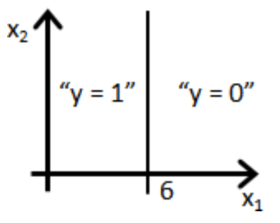
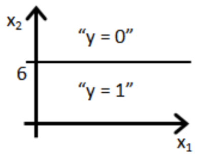

# Regresión logística 3

<style>
  .espacio {
     margin-bottom: 1cm;
  }
</style>

<style>
  .espacio3 {
     margin-bottom: 3cm;
  }
</style>

```{r message=FALSE, warning=FALSE}
library(tidyverse)
```

## Ejemplo óscares

Algunas de los factores citados usualmente por las personas como importantes para que una película gane un Óscar son:

1. Estar nominada a Mejor Director.

2. Haber ganado un premio en los Director’s Guild Awards.

3. Tener más nominaciones a la Academia.

4. Ganó mejor película en Golden Globe Awards.

5. La calificación en IMdb.

6. El score de Metacritic

7. El gusto de las personas por la película.

8. El score en RT de los críticos más destacados.

9. Las recaudaciones en taquilla dométicas.

10. Las recaudaciones en taquilla generales.

11. El presupuesto con el que se realizó la película.

12. La duración de la película.

13. El número de estrellas "conocidas"


Contamos con datos que provienen de varias fuentes y se tienen las siguientes variables disponibles:

| Variable    | Descripción| Fuente   |
| -------- |-------------------|----------|
| film | Nombre de la película nominada   |
| year | Año de nominación de la película|   |
| release_date | Fecha de lanzamiento | IMdb |
| mpaa | Clasificación | IMdb |
| imdb_score | Rating de IMdb | IMdb |
| metacritic_score | Score de Metacritic | IMdb |
| rt_audience_score | % de personas que la favorecen| Rotten Tomatoes |
| rt_critic_score | Score de "Top critics" | Rotten Tomatoes |
| bo | Recaudado en taquilla | Box Office Mojo |
| budget | Estimated budget | Wikipedia |
| running_time | Duración (en minutos) | Wikipedia
| stars_count | \# de actores mostrados en el recuadro | Wikipedia
| aabd | Nominación a mejor director Óscar| Wikipedia
| dga | Ganadora del Director's Guild | Wikipedia
| noms | Número de nominaciones al Óscar | Wikipedia
| ggbp | Ganadora en los Globos | Wikipedia
| winner | Ganó Óscar | Wikipedia


```{r message=FALSE, warning=FALSE}
oscars <- read_csv("datos/oscars.csv")
glimpse(oscars)
```

Ajustamos un modelo de regresión logística para "winner" utilizando como predictores "imdb_score + metacritic_score + rt_audience_score + rt_critic_score + bo + budget + running_time + stars_count + aabd + dga + noms + ggbp":

```{r}
oscars_2 <- oscars %>%
  mutate(imdb_score = imdb_score/10,
         metacritic_score = metacritic_score/100,
         rt_audience_score = rt_audience_score/100,
         bo = log(bo),
         budget = log(budget),
         running_time = log(running_time),
         stars_count = log(stars_count)) %>%
  filter(year < 2017)
fit.1 <- glm(formula = winner ~ imdb_score + rt_critic_score + bo + budget + 
               running_time + stars_count + aabd + dga + noms + ggbp, 
             family = binomial(link = "logit"), 
             data = oscars_2)
fit.1
```

```{r}
mean(oscars$dga)
```


Podemos ver las probabilidades $p_1({x^{(i)}})$, $i=1,\ldots,N$, que _predice_ el modelo utilizando la función `predict`:

```{r}
predict(fit.1, type="response")
```

<br>

**Responde las siguientes preguntas:**

 
<div class="centered">
<p class="espacio">
</p>
La variable que tiene más impacto en la probabilidad de ganar un Óscar...

(a) Ganó un premio en el Director's Guild.  

(b) Número de nominaciones a los Óscares. 

(c) Crítica de Rotten Tomatoes (Top critics).

(d) Presupuesto de la película.

<p class="espacio3">
</p>
</div>
<br>

 
<div class="centered">
<p class="espacio">
</p>
Si la película ganó un premio en los Director's Guild, entonces 

(a) la probabilidad logit de ganar un Óscar aumenta en 3.67. 

(b) los momios de ganar un Óscar son $0.92$.

(c) la probabilidad de ganar un Óscar aumenta en $0.92$.

(d) los momios de ganar un Óscar aumentan en $e^{3.67}$.

<p class="espacio3">
</p>
</div>
<br>

Correspondientes al 2017 estas películas fueron nominadas al premio de la academia:

```{r}
oscars %>% 
  filter(year == 2017) %>% 
  select(film,year,release_date, mpaa, imdb_score,rt_critic_score) %>% 
  knitr::kable()
```

Veamos qué predicciones obtenemos para el 2017:

```{r}
oscars_3 <- oscars %>%
  mutate(imdb_score = imdb_score/10,
         metacritic_score = metacritic_score/100,
         rt_audience_score = rt_audience_score/100,
         bo = log(bo),
         budget = log(budget),
         running_time = log(running_time),
         stars_count = log(stars_count)) %>%
  filter(year == 2017) %>% 
  select(imdb_score,rt_critic_score,bo,budget,running_time,stars_count,aabd,dga,noms,ggbp)
predict(fit.1, type="response", newdata = oscars_3)
```

La probabilidad de predicción más alta es 0.76347 que corresponde a _The Shape Of Water_.

---

<br>

## Repaso de regresión logística

En un problema de clasificación donde las $y_i$'s son binarias, desearíamos tener un modelo de la forma:
$$
\pi_i = x_i^\prime \beta
$$
donde $\beta$ es un vector de coeficientes. 

<p class="espacio">
</p>

El problema es que el componente lineal puede tomar cualquier valor _real_, mientras que $\pi_i$ sólo puede tomar valores entre $0$ y $1$.

Una alternativa es utilizar los momios:

$$
\Omega_i = \dfrac{\pi_i}{1-\pi_i},
$$
el cociente de la probabilidad y su complemento, la razón de exitosos por fracasados.

<p class="espacio">
</p>

```{block2, type = "information"}
**Nota:** 

<p class="espacio">
</p>

* Si la probabilidad de un evento es $1/2$, entonces los momios son _uno a uno_ o _justos_.

* Si la probabilidad es $1/3$, entonces los momios son uno a dos.
```

<br>

Los momios toman valores entre $0$ e $\infty$, lo cual no los hace del todo útiles para especificar nuestro modelo. Por lo tanto lo planteamos de la forma:

$$
\mbox{logit}(\pi_i) = x_i^\prime\beta
$$

La trasformación logit es _uno a uno_. La función logit inversa $\mbox{logit}^{-1}$ nos permite regresar de probabilidades logits a probabilidades usuales.

Podemos ver gráficamente la transformación logit:

```{r, out.width='100%'}
logit <- function(x){log((x/((1-x))))}
graf_data <- data_frame(x = seq(0, 1, length.out = 100), logit = logit(x))
ggplot(graf_data, aes(x = x)) + 
  geom_line(aes(y = logit), colour = 'lightpink', size=1.2)
```

Despejando para $\pi_i$ obtenemos 

$$
\pi_i = \mbox{logit}^{-1}(\eta_i)=\mbox{logit}^{-1}(x_i^\prime\beta)=\dfrac{e^{x_i^\prime\beta}}{1+e^{x_i^\prime\beta}}
$$

donde $\eta_i=x_i^\prime\beta$.

Cada variable aleatoria $y_i$ puede tomar valor de $0$ o $1$, fracaso o éxito, respectivamente. Por lo tanto, $y_i$ tiene una distribución Bernoulli con probabilidad de éxito $\pi_i$. Y se tiene que
$$
p_1(x_i) = \pi_i = \mbox{logit}^{-1}(x_i^\prime\beta).
$$


**Recordemos las interpretaciones de los coeficientes:**

1. Evaluar en o alrededor de la media: $$\mbox{logit}^{-1}(\beta_0+\beta_j\cdot \bar{x}_j).$$

2. Interpretar como un cambio en la probabilidad ante un cambio unitario en $x$ alrededor de la media: $$\mbox{logit}^{-1}(\beta_0+\beta_j\cdot \bar{x}_j) - \mbox{logit}^{-1}(\beta_0+\beta_j\cdot (\bar{x}_j-1)).$$

3. Calcular la derivada de la curva logística en la media: $$\dfrac{\beta_j\, e^{\beta_0+\beta_j \bar{x}_j}}{(1 + e^{\beta_0 +\beta_j \bar{x}_j})^2}.$$

4. Dividir entre 4: $$\dfrac{\beta_j}{4}.$$ Se interpreta como la diferencia en la probabilidad ante un cambio unitario en $x_j$ alrededor de la media (aproximadamente).

5. Calcular el cociente de momios: $$\mbox{log}\left[\dfrac{P(y_i=1|x)}{P(y_i=0|x)} \right] = \alpha + \beta x.$$ Sumar 1 a la variable $x$ es equivalente a sumar $\beta$ en ambos lados de la ecuación. Exponenciando nuevamente ambos lados, el cociente de momios se multiplica por $e^\beta$.

<br>

**Estimación de los parámetros $\beta$:**

Se utiliza descenso en gradiente para estimar los coeficientes $\beta_j$ minimizando la devianza:
$$
D(\beta) = -2\sum_{i=1}^N \log(p_{y^{(i)}} (x^{(i)})).
$$ 

**Responde las siguientes preguntas:**

 
<div class="centered">
<p class="espacio">
</p>
Supongamos que se ajustan los coeficientes de un modelo lineal logístico y una _nueva observación_ $x$ es tal que su predicción es $h(x^\prime \beta)=0.7$. Esto significa que (selecciona una o más):

(a) Nuestra estimación de $P(y=0|x;\beta)$ es 0.7.

(b) Nuestra estimación de $P(y=1|x;\beta)$ es 0.7.

(c) Nuestra estimación de $P(y=0|x;\beta)$ es 0.3.

(d) Nuestra estimación de $P(y=1|x;\beta)$ es 0.3.

<p class="espacio3">
</p>
</div>
<br>

 
<div class="centered">
<p class="espacio">
</p>
Supongamos que se ajusta un modelo logístico $p_1(x_i)=h(\beta_0+\beta_1x_1^{(i)}+\beta_2 x_2^{(i)})$. Supongamos que $\beta_0=6, \;\beta_1=-1,\; \beta_2=0$. ¿Cuál de las siguientes figuras puede servir como una regla de decisión para este modelo?

(a) 

&nbsp; {width=20%}

(b) 

&nbsp; {width=20%}

(c) 

&nbsp; {width=20%}

(d) 

&nbsp; {width=20%}

<p class="espacio3">
</p>
</div>

<br>

---

<br>

## Regresión logística con interacciones

Recordemos el modelo de pozos en Bangladesh:

```{r message=FALSE, warning=FALSE, results='hide'}
wells <- read_csv("datos/wells.csv")
wells <- wells %>% mutate(dist_100 = dist/100)
fit.2 <- glm(switch ~ dist_100, data = wells, family=binomial(link="logit"))
fit.2
```

Posteriormente añadimos una segunda variable:

```{r}
fit.3 <- glm(switch ~ dist_100 + arsenic, data = wells, family=binomial(link="logit"))
fit.3
```

Añadimos una interacción entre estos dos términos:

```{r}
fit.4 <- glm(switch ~ dist_100 + arsenic + dist_100:arsenic, 
             data = wells,
             family=binomial(link="logit"))
fit.4
```

Para entender los números en la tabla, usamos los siguientes trucos:

* Evaluar predicciones e interacciones en la media de los datos, que tienen valores promedio de 0.48 para distancia y 1.66 para arsénico (es decir, una distancia media de 48 metros al pozo seguro más cercano, y un nivel promedio de arsénico de 1.66 entre los pozos inseguros).

* Dividir entre 4 para obtener diferencias predictivas aproximadas en la escala de probabilidad.

Intrepretamos los coeficientes:

1. El término constante no tiene interpretación: $\mbox{logit}^{-1}(-0.15) = 0.47$ es la probabilidad estimada de cambio, si la distancia al pozo seguro más cercano es $0$ y el nivel de arsénico del pozo actual es 0. Esto es imposible porque la distribución de arsénico en pozos inseguros comienza en $0.5$.

    En cambio, podemos evaluar la predicción en los valores promedio de $\mbox{dist_100} = 0.48$ y $\mbox{arsénico} = 1.66$,  la probabilidad de cambiar de pozo es $\mbox{logit}^1(-0.15 - 0.58 \cdot 0.48 + 0.56 \cdot 1.66 - 0.18 \cdot 0.48 \cdot 1.66) = 0.59$.

2. Coeficiente de distancia: esto corresponde a la comparación de dos pozos que difieren en 1 en dist_100, si el nivel de arsénico es 0 para ambos pozos. Una vez más, no debemos tratar de interpretarlo.

    En cambio, podemos ver el valor promedio, arsénico = 1.66, donde la distancia tiene un coeficiente de $-0.58 - 0.18 · 1.66 = -0.88$ en la escala logit. Para interpretar esto rápidamente en la escala de probabilidad, lo dividimos por 4: $-0.88 / 4 = -0.22$. Por lo tanto, al nivel medio de arsénico en los datos, a cada 100 metros de distancia le corresponden a una diferencia negativa aproximada del 22% en la probabilidad de cambio.

3. Coeficiente para arsénico: esto equivale a comparar dos pozos que difieren en 1 en arsénico, si la distancia al pozo seguro más cercano es 0 para ambos.

    Evaluamos la comparación en el valor promedio para la distancia, $\mbox{dist_100} = 0.48$, donde el arsénico tiene un coeficiente de $0.56 - 0.18 · 0.48 = 0.47$ en la escala logit. Para interpretar esto rápidamente en la escala de probabilidad, _lo dividimos entre $4$_: $0.47 / 4 = 0.12$. Por lo tanto, en el nivel medio de distancia en los datos, cada unidad adicional de arsénico corresponde a una diferencia positiva aproximada del 12% en la probabilidad de cambio.

4. _Coeficiente para el término de interacción_: se puede interpretar de dos maneras:
    + por cada unidad adicional de arsénico, el valor $-0.18$ se agrega al coeficiente de distancia. Ya hemos visto que el coeficiente de distancia es $-0.88$ en el nivel promedio de arsénico, por lo que podemos entender la interacción diciendo que la importancia de la distancia como predictor aumenta para los hogares con niveles más altos de arsénico.
    + por cada $100$ metros adicionales de distancia al pozo más cercano, se agrega el valor $-0.18$ al coeficiente de arsénico. Ya hemos visto que el coeficiente de distancia es $0.47$ a la distancia promedio al pozo seguro más cercano, y así podemos entender la interacción diciendo que la importancia del arsénico como predictor disminuye para los hogares que están más lejos de los pozos seguros existentes. 
    
#### Centrando las variables {-}

Como se discutió anteriormente en el contexto de la regresión lineal, antes de ajustar las interacciones tiene sentido centrar las variables de entrada para que podamos interpretar los coeficientes más fácilmente. Las entradas centradas son:

```{r}
wells <- wells %>% 
  mutate(dist_100_c = dist_100 - mean(dist_100),
         arsenic_c = arsenic - mean(arsenic))
```

Podemos reajustar el modelo usando las variables de entrada centradas, lo que hará que los coeficientes sean mucho más fáciles de interpretar:

```{r}
fit.5 <- glm(switch ~ dist_100_c + arsenic_c + dist_100_c:arsenic_c, data = wells,
  family=binomial(link="logit"))
fit.5
```

Centramos las entradas, no los predictores. Por lo tanto, no centramos la interacción ($\mbox{dist_100} * \mbox{arsénico}$); más bien, incluimos la interacción de las dos variables de entrada centradas. 


Interpretamos los coeficientes en esta nueva escala:

1. Término constante: $\mbox{logit}^{-1}(0.35) = 0.59$ es la probabilidad estimada cambiar de pozo, si $\mbox{dist_100_c} = \mbox{arsenic_c} = 0$, es decir, en las medias de la distancia al pozo seguro más cercano y el nivel de arsénico. (Obtuvimos este mismo cálculo, pero con más esfuerzo, con nuestro modelo anterior con datos no centrados).

2. Coeficiente de distancia: éste es el coeficiente de distancia (en la escala logit) si el nivel de arsénico está en su valor promedio. Para interpretar esto rápidamente en la escala de probabilidad, lo dividimos por 4: $-0.88 / 4 = -0.22$. Por lo tanto, al nivel medio de arsénico en los datos, cada 100 metros de distancia corresponde a una diferencia negativa aproximada del 22% en la probabilidad de cambio.

3. Coeficiente para arsénico: este es el coeficiente para el nivel de arsénico si la distancia al pozo seguro más cercano está en su valor promedio. Para interpretar esto rápidamente en la escala de probabilidad, lo dividimos por 4: $0.47 / 4 = 0.12$. Por lo tanto, en el nivel medio de distancia en los datos, cada unidad adicional de arsénico corresponde a una diferencia positiva aproximada del $12\%$ en la probabilidad de cambio.

4. Coeficiente para el término de interacción: esto no se modifica al centrarse y tiene la misma interpretación que antes.

Las predicciones para nuevas observaciones no se modifican. Centrar los predictores cambia las interpretaciones de los coeficientes pero no cambia el modelo subyacente.

 Estima el error estándar del coeficiente de interacción usando la técnica de _bootsrap_. ¿Es significativo dicho coeficiente?

<p class="espacio">
</p>
<br>

```{r}
summary(fit.5)
```

## Gráficas del modelo con interacciones

La forma más clara de visualizar el modelo de interacción es graficar la función de la curva de regresión para cada posible escenario.

```{r}
invlogit <- function(x){
  exp(x)/(1+exp(x))
}
ggplot(wells, aes(x = dist_100, y = switch)) +
  geom_jitter(width = 0.308, height = 0.1, size = 0.1) +
  stat_function(fun = function(x){
    invlogit(fit.5$coef[1] + fit.5$coef[2]*x + 0.5 + fit.5$coef[4]*0.5*x)}, xlim = c(-0.3,3.5)) +
  stat_function(fun = function(x){
    invlogit(fit.5$coef[1] + fit.5$coef[2]*x + 1 + fit.5$coef[4]*1*x)}, xlim = c(-0.3,3.5)) +
  annotate("text", x = 0.50, y = 0.45, label = "As=0.5", size = 4) +
  annotate("text", x = 0.75, y = 0.65, label = "As=1.0", size = 4)
```

```{r}
ggplot(wells, aes(x = arsenic, y = switch)) +
  geom_jitter(width = 0.308, height = 0.1, size = 0.1) +
  stat_function(fun = function(x){
    invlogit(fit.5$coef[1] + 0 + fit.5$coef[3]*x + fit.5$coef[4]*0*x)}, xlim = c(-0.3,10)) +
  stat_function(fun = function(x){
    invlogit(fit.5$coef[1] + fit.5$coef[2]*0.5 + fit.5$coef[3]*x + fit.5$coef[4]*0.5*x)}, xlim = c(-0.3,10)) +
  annotate("text", x = 0.7, y = 0.80, label = "dist=0", size = 4) +
  annotate("text", x = 2.0, y = 0.65, label = "dist=50", size = 4)
```

La interacción no es grande en el rango de la mayoría de los datos. En la gráfica de arriba vemos que las líneas se empiezan a juntar a los $300$ metros de distancia. 

Las diferencias en el cambio asociadas con las diferencias en el nivel de arsénico son grandes si se está cerca de un pozo seguro, pero el efecto disminuye si se está lejos de un pozo seguro. Esta interacción tiene algún sentido; sin embargo, hay cierta incertidumbre en el tamaño de la interacción (de la tabla de regresión anterior, una estimación de $-0.18$ con un error estándar de $0.10$). Solo hay unos pocos datos en el área donde la interacción hace alguna diferencia.

## Agregar más predictores

¿Son más propensos los usuarios a cambiar de pozo si pertenecen a alguna asociación en su comunidad o si tienen mayor educación? Para ver, agregamos dos entradas:

* assoc = 1 si un miembro del hogar pertenece a alguna organización comunitaria

* educ = años de educación del usuario del pozo.

En realidad, trabajamos con $\mbox{educ4} = \mbox{educ} / 4$, por las razones habituales de hacer que su coeficiente de regresión sea más interpretable: ahora representa la diferencia predictiva de agregar cuatro años de educación.

```{r}
wells <- wells %>% mutate(educ4 = educ / 4)
fit.6 <- glm(switch ~ dist_100_c + 
               arsenic_c + dist_100_c:arsenic_c +
               assoc + educ4, 
             data = wells,
             family=binomial(link="logit"))
fit.6
```

Nota:

* Para los hogares con pozos inseguros, pertenecer a una asociación comunitaria sorprendentemente no es predictivo de cambio de pozo, después de controlar los otros factores en el modelo. 

* Sin embargo, las personas con educación superior tienen más probabilidades de cambiar: la diferencia estimada bruta es $0.17 / 4 = 0.04$, o una diferencia positiva de $4\%$ en la probabilidad de cambio cuando se comparan hogares que difieren en 4 años de educación.


El coeficiente para la educación tiene sentido y es estadísticamente significativo, por lo que lo mantenemos en el modelo. El coeficiente de asociación comunitaria no tiene sentido y no es estadísticamente significativo, por lo que lo eliminamos.


```{r}
fit.7 <- glm (switch ~ dist_100_c + arsenic_c + dist_100_c:arsenic_c + educ4,
              data = wells,
              family = binomial(link="logit"))
fit.7
```

Añadimos otras interacciones (centrando la variable de educación):

```{r}
wells <- wells %>% mutate(educ4_c = educ4 - mean(educ4))
fit.8 <- glm(switch ~ dist_100_c + arsenic_c + educ4_c + dist_100_c:arsenic_c +
               dist_100_c:educ4_c + arsenic_c:educ4_c, 
             data = wells,
             family = binomial(link="logit"))
summary(fit.8)
```

Podemos interpretar estas nuevas interacciones entendiendo cómo la educación modifica la diferencia predictiva correspondiente a la distancia y el arsénico.

* _Interacción de distancia y educación_: una diferencia de 4 años de educación corresponde a una diferencia de $0.32$ en el coeficiente para $\mbox{dist_100}$. Como ya hemos visto, $\mbox{dist_100}$ tiene un coeficiente negativo en promedio; por lo tanto, los cambios positivos en la educación reducen la asociación negativa de la distancia. Esto tiene sentido: las personas con más educación probablemente tengan otros recursos, por lo que andar una distancia extra para obtener agua no es una carga tan pesada.

* _Interacción de arsénico y educación_: una diferencia de 4 años de educación corresponde a una diferencia de $0.07$ en el coeficiente de arsénico. Como ya hemos visto, el arsénico tiene un coeficiente positivo en promedio; por lo tanto, aumentar la educación aumenta la asociación positiva del arsénico. Esto tiene sentido: las personas con más educación podrían estar más informadas sobre los riesgos del arsénico y, por lo tanto, ser más sensibles al aumento de los niveles de arsénico (o, a la inversa, tener menos prisa para cambiar de pozos con niveles de arsénico relativamente bajos).


**Estandarizar los predictores**

Deberíamos considerar seriamente la posibilidad de estandarizar todos los predictores como una opción predeterminada para ajustar modelos con interacciones. Las dificultades con $\mbox{dist_100}$ y $\mbox{educ4}$ en este ejemplo sugieren que la estandarización, restar la media de cada una de las variables de entrada y dividir entre 2 desviaciones estándar.


## Evaluación de modelos de regresión logística

Podemos definir residuales en regresión logística como
$$
\mbox{residual}_i = y_i − E(y_i|X_i) = y_i − \mbox{logit}^{-1}(X_i\beta).
$$
Los datos $y_i$ son discretos y también los residuales. Por ejemplo, si $\mbox{logit}^{-1} (X_i\beta) = 0.7$, entonces $\mbox{residual}_i = -0.7$ o $+0.3$, dependiendo de si $y_i = 0$ o $1$. 

Graficamos los residuales de la regresión logística: 

```{r}
fit.8 <- glm(switch ~ dist_100_c + arsenic_c + educ4_c + dist_100_c:arsenic_c +
               dist_100_c:educ4_c + arsenic_c:educ4_c,
             data = wells,
             family=binomial(link="logit"))

# Probabilidades de predicción
wells$pred.8 <- fit.8$fitted.values

ggplot(wells, aes(x=pred.8, y=switch-pred.8)) +
  geom_point(size=1) +
  geom_abline(slope = 0, intercept = 0) +
  xlab("P(switch) de predicción") +
  ylab("Observado - estimado")
```

Vemos que esto no es útil. En la gráfica se ve un patrón fuerte en los residuales debido a que las observaciones de $y_i$ son _discretas_. Esto nos sugiere hacer una gráfica de residuales agrupados.


Para calcular los residuales agrupados dividimos los datos en clases (cubetas) en función de sus valores ajustados. Luego graficamos el residual promedio contra el valor promedio ajustado para cada cubeta. 

Calculamos la agrupación de los residuales con la siguiente función:

```{r}
binned_residuals <- function(x, y, nclass=sqrt(length(x))){
  breaks.index <- floor(length(x)*(1:(nclass-1))/nclass)
  breaks <- c (-Inf, sort(x)[breaks.index], Inf)
  output <- NULL
  xbreaks <- NULL
  x.binned <- as.numeric (cut (x, breaks))
  for (i in 1:nclass){
    items <- (1:length(x))[x.binned==i]
    x.range <- range(x[items])
    xbar <- mean(x[items])
    ybar <- mean(y[items])
    n <- length(items)
    sdev <- sd(y[items])
    output <- rbind(output, c(xbar, ybar, n, x.range, 2*sdev/sqrt(n)))
  }
  colnames(output) <- c ("xbar", "ybar", "n", "x.lo", "x.hi", "2se")
  return (list(binned=output, xbreaks=xbreaks))
}
```

 La función *binned_residuals* recibe como entrada un vector $x$. ¿Es significativo dicho coeficiente?

<p class="espacio">
</p>
<br>

Veamos la gráfica:

```{r}
br.8 <- binned_residuals(wells$pred.8, wells$switch-wells$pred.8, nclass=40) %>% 
  .$binned %>%
  as.data.frame()

ggplot(br.8, aes(xbar, ybar)) +
  geom_point() +
  geom_line(aes(x=xbar, y=`2se`), color="grey60") +
  geom_line(aes(x=xbar, y=-`2se`), color="grey60") +
  geom_abline(intercept = 0, slope = 0) +
  xlab("P(switch) de predicción") +
  ylab("Residual promedio")
```

Lo que observamos es los datos divididos en 40 cubetas de igual tamaño. Las líneas de color gris (calculadas como $2p (1 - p) / n$, donde $n$ es el número de puntos por cubeta, $3020/40 = 75$ en este caso) indican $\pm 2$ errores estándar, dentro de los cuales uno esperaría que caigan aproximadamente el 95% de los residuales agrupados, si el modelo fuera realmente verdadero.

_Sólo uno_ de los $40$ residuales agrupados caen fuera de los límites, lo cual no nos sorprende después de nuestro análisis previo, y tampoco vemos un patrón dramático en los residuales.

---

<br>

