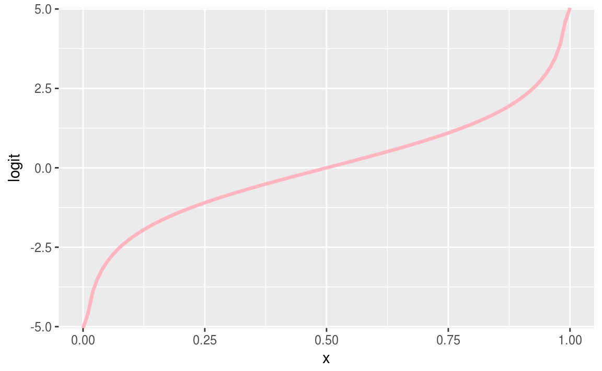

# Regresión logística 3

<style>
  .espacio {
     margin-bottom: 1cm;
  }
</style>

<style>
  .espacio3 {
     margin-bottom: 3cm;
  }
</style>

## Regresión logística con interacciones


```r
library(tidyverse)
```


Recordemos el modelo de pozos en Bangladesh:


```r
wells <- read_csv("datos/wells.csv")
wells <- wells %>% mutate(dist_100 = dist/100)
fit.2 <- glm(switch ~ dist_100, data = wells, family=binomial(link="logit"))
fit.2
```

Posteriormente añadimos una segunda variable:


```r
fit.3 <- glm(switch ~ dist_100 + arsenic, data = wells, family=binomial(link="logit"))
fit.3
#> 
#> Call:  glm(formula = switch ~ dist_100 + arsenic, family = binomial(link = "logit"), 
#>     data = wells)
#> 
#> Coefficients:
#> (Intercept)     dist_100      arsenic  
#>     0.00275     -0.89664      0.46077  
#> 
#> Degrees of Freedom: 3019 Total (i.e. Null);  3017 Residual
#> Null Deviance:	    4120 
#> Residual Deviance: 3930 	AIC: 3940
```

Añadimos una interacción entre estos dos términos:


```r
fit.4 <- glm(switch ~ dist_100 + arsenic + dist_100:arsenic, data = wells,
  family=binomial(link="logit"))
fit.4
#> 
#> Call:  glm(formula = switch ~ dist_100 + arsenic + dist_100:arsenic, 
#>     family = binomial(link = "logit"), data = wells)
#> 
#> Coefficients:
#>      (Intercept)          dist_100           arsenic  dist_100:arsenic  
#>           -0.148            -0.577             0.556            -0.179  
#> 
#> Degrees of Freedom: 3019 Total (i.e. Null);  3016 Residual
#> Null Deviance:	    4120 
#> Residual Deviance: 3930 	AIC: 3940
```

Para entender los números en la tabla, usamos los siguientes trucos:

* Evaluar predicciones e interacciones en la media de los datos, que tienen valores promedio de 0.48 para distancia y 1.66 para arsénico (es decir, una distancia media de 48 metros al pozo seguro más cercano, y un nivel promedio de arsénico de 1.66 entre los pozos inseguros).

* Dividir entre 4 para obtener diferencias predictivas aproximadas en la escala de probabilidad.

Intrepretamos los coeficientes:

1. El término constante no tiene interpretación: $\mbox{logit}^{-1}(-0.15) = 0.47$ es la probabilidad estimada de cambio, si la distancia al pozo seguro más cercano es 0 y el nivel de arsénico del pozo actual es 0. Esto es imposible porque la distribución de arsénico en pozos inseguros comienza en 0.5.

En cambio, podemos evaluar la predicción en los valores promedio de dist_100 = 0.48 y arsénico = 1.66,  la probabilidad de cambiar de pozo es $\mbox{logit}^1(-0.15 - 0.58 · 0.48 + 0.56 · 1.66 - 0.18 · 0.48 · 1.66) = 0.59$.

2. Coeficiente de distancia: esto corresponde a la comparación de dos pozos que difieren en 1 en dist100, si el nivel de arsénico es 0 para ambos pozos. Una vez más, no debemos tratar de interpretarlo.

En cambio, podemos ver el valor promedio, arsénico = 1.66, donde la distancia tiene un coeficiente de $-0.58 - 0.18 · 1.66 = -0.88$ en la escala logit. Para interpretar esto rápidamente en la escala de probabilidad, lo dividimos por 4: $-0.88 / 4 = -0.22$. Por lo tanto, al nivel medio de arsénico en los datos, a cada 100 metros de distancia le corresponden a una diferencia negativa aproximada del 22% en la probabilidad de cambio.

3. Coeficiente para arsénico: esto equivale a comparar dos pozos que difieren en 1 en arsénico, si la distancia al pozo seguro más cercano es 0 para ambos.

Evaluamos la comparación en el valor promedio para la distancia, dist100 = 0.48, donde el arsénico tiene un coeficiente de $0.56 - 0.18 · 0.48 = 0.47$ en la escala logit. Para interpretar esto rápidamente en la escala de probabilidad, lo dividimos entre 4: $0.47 / 4 = 0.12$. Por lo tanto, en el nivel medio de distancia en los datos, cada unidad adicional de arsénico corresponde a una diferencia positiva aproximada del 12% en la probabilidad de cambio.

4. _Coeficiente para el término de interacción_: se puede interpretar de dos maneras:

        * por cada unidad adicional de arsénico, el valor -0.18 se agrega al coeficiente de distancia. Ya hemos visto que el coeficiente de distancia es -0.88 en el nivel promedio de arsénico, por lo que podemos entender la interacción diciendo que la importancia de la distancia como predictor aumenta para los hogares con niveles más altos de arsénico.
        
        * por cada 100 metros adicionales de distancia al pozo más cercano, se agrega el valor -0.18 al coeficiente de arsénico. Ya hemos visto que el coeficiente de distancia es 0.47 a la distancia promedio al pozo seguro más cercano, y así podemos entender la interacción diciendo que la importancia del arsénico como predictor disminuye para los hogares que están más lejos de los pozos seguros existentes.


### Centrando las variables

Como se discutió anteriormente en el contexto de la regresión lineal, antes de ajustar las interacciones tiene sentido centrar las variables de entrada para que podamos interpretar los coeficientes más fácilmente. Las entradas centradas son:


```r
wells <- wells %>% 
  mutate(dist_100_c = dist_100 - mean(dist_100),
         arsenic_c = arsenic - mean(arsenic))
```

Podemos reajustar el modelo usando las variables de entrada centradas, lo que hará que los coeficientes sean mucho más fáciles de interpretar:


```r
fit.5 <- glm(switch ~ dist_100_c + arsenic_c + dist_100_c:arsenic_c, data = wells,
  family=binomial(link="logit"))
fit.5
#> 
#> Call:  glm(formula = switch ~ dist_100_c + arsenic_c + dist_100_c:arsenic_c, 
#>     family = binomial(link = "logit"), data = wells)
#> 
#> Coefficients:
#>          (Intercept)            dist_100_c             arsenic_c  
#>                0.351                -0.874                 0.470  
#> dist_100_c:arsenic_c  
#>               -0.179  
#> 
#> Degrees of Freedom: 3019 Total (i.e. Null);  3016 Residual
#> Null Deviance:	    4120 
#> Residual Deviance: 3930 	AIC: 3940
```

Centramos las entradas, no los predictores. Por lo tanto, no centramos la interacción (dist_100 * arsénico); más bien, incluimos la interacción de las dos variables de entrada centradas. 


Interpretamos los coeficientes en esta nueva escala:

1. Término constante: $\mbox{logit}^{-1}(0.35) = 0.59$ es la probabilidad estimada cambiar de pozo, si dist_100_c = arsenic_c = 0, es decir, en las medias de la distancia al pozo seguro más cercano y el nivel de arsénico. (Obtuvimos este mismo cálculo, pero con más esfuerzo, con nuestro modelo anterior con datos no centrados).

2. Coeficiente de distancia: éste es el coeficiente de distancia (en la escala logit) si el nivel de arsénico está en su valor promedio. Para interpretar esto rápidamente en la escala de probabilidad, lo dividimos por 4: $-0.88 / 4 = -0.22$. Por lo tanto, al nivel medio de arsénico en los datos, cada 100 metros de distancia corresponde a una diferencia negativa aproximada del 22% en la probabilidad de cambio.

3. Coeficiente para arsénico: este es el coeficiente para el nivel de arsénico si la distancia al pozo seguro más cercano está en su valor promedio. Para interpretar esto rápidamente en la escala de probabilidad, lo dividimos por 4: $0.47 / 4 = 0.12$. Por lo tanto, en el nivel medio de distancia en los datos, cada unidad adicional de arsénico corresponde a una diferencia positiva aproximada del 12% en la probabilidad de cambio.

4. Coeficiente para el término de interacción: esto no se modifica al centrarse y tiene la misma interpretación que antes.


Las predicciones para nuevas observaciones no se modifican. El centrado lineal de los predictores cambia las interpretaciones de los coeficientes pero no cambia el modelo subyacente.


```r
str(fit.5)
#> List of 30
#>  $ coefficients     : Named num [1:4] 0.351 -0.874 0.47 -0.179
#>   ..- attr(*, "names")= chr [1:4] "(Intercept)" "dist_100_c" "arsenic_c" "dist_100_c:arsenic_c"
#>  $ residuals        : Named num [1:3020] 1.37 2.09 -3.24 1.72 1.86 ...
#>   ..- attr(*, "names")= chr [1:3020] "1" "2" "3" "4" ...
#>  $ fitted.values    : Named num [1:3020] 0.73 0.478 0.691 0.58 0.537 ...
#>   ..- attr(*, "names")= chr [1:3020] "1" "2" "3" "4" ...
#>  $ effects          : Named num [1:3020] -7.033 -5.805 -11.023 1.748 0.903 ...
#>   ..- attr(*, "names")= chr [1:3020] "(Intercept)" "dist_100_c" "arsenic_c" "dist_100_c:arsenic_c" ...
#>  $ R                : num [1:4, 1:4] -26.3509 0 0 0 -0.0976 ...
#>   ..- attr(*, "dimnames")=List of 2
#>   .. ..$ : chr [1:4] "(Intercept)" "dist_100_c" "arsenic_c" "dist_100_c:arsenic_c"
#>   .. ..$ : chr [1:4] "(Intercept)" "dist_100_c" "arsenic_c" "dist_100_c:arsenic_c"
#>  $ rank             : int 4
#>  $ qr               :List of 5
#>   ..$ qr   : num [1:3020, 1:4] -26.3509 0.019 0.0175 0.0187 0.0189 ...
#>   .. ..- attr(*, "dimnames")=List of 2
#>   .. .. ..$ : chr [1:3020] "1" "2" "3" "4" ...
#>   .. .. ..$ : chr [1:4] "(Intercept)" "dist_100_c" "arsenic_c" "dist_100_c:arsenic_c"
#>   ..$ rank : int 4
#>   ..$ qraux: num [1:4] 1.02 1 1.01 1
#>   ..$ pivot: int [1:4] 1 2 3 4
#>   ..$ tol  : num 1e-11
#>   ..- attr(*, "class")= chr "qr"
#>  $ family           :List of 12
#>   ..$ family    : chr "binomial"
#>   ..$ link      : chr "logit"
#>   ..$ linkfun   :function (mu)  
#>   ..$ linkinv   :function (eta)  
#>   ..$ variance  :function (mu)  
#>   ..$ dev.resids:function (y, mu, wt)  
#>   ..$ aic       :function (y, n, mu, wt, dev)  
#>   ..$ mu.eta    :function (eta)  
#>   ..$ initialize:  expression({  if (NCOL(y) == 1) {  if (is.factor(y))  y <- y != levels(y)[1L]  n <- rep.int(1, nobs)  y[weights =| __truncated__
#>   ..$ validmu   :function (mu)  
#>   ..$ valideta  :function (eta)  
#>   ..$ simulate  :function (object, nsim)  
#>   ..- attr(*, "class")= chr "family"
#>  $ linear.predictors: Named num [1:3020] 0.9961 -0.0864 0.8043 0.3233 0.1473 ...
#>   ..- attr(*, "names")= chr [1:3020] "1" "2" "3" "4" ...
#>  $ deviance         : num 3928
#>  $ aic              : num 3936
#>  $ null.deviance    : num 4118
#>  $ iter             : int 4
#>  $ weights          : Named num [1:3020] 0.197 0.25 0.214 0.244 0.249 ...
#>   ..- attr(*, "names")= chr [1:3020] "1" "2" "3" "4" ...
#>  $ prior.weights    : Named num [1:3020] 1 1 1 1 1 1 1 1 1 1 ...
#>   ..- attr(*, "names")= chr [1:3020] "1" "2" "3" "4" ...
#>  $ df.residual      : int 3016
#>  $ df.null          : int 3019
#>  $ y                : Named num [1:3020] 1 1 0 1 1 1 1 1 1 1 ...
#>   ..- attr(*, "names")= chr [1:3020] "1" "2" "3" "4" ...
#>  $ converged        : logi TRUE
#>  $ boundary         : logi FALSE
#>  $ model            :'data.frame':	3020 obs. of  3 variables:
#>   ..$ switch    : int [1:3020] 1 1 0 1 1 1 1 1 1 1 ...
#>   ..$ dist_100_c: num [1:3020] -0.3151 -0.0101 -0.2736 -0.2685 -0.0746 ...
#>   ..$ arsenic_c : num [1:3020] 0.703 -0.947 0.413 -0.507 -0.557 ...
#>   ..- attr(*, "terms")=Classes 'terms', 'formula'  language switch ~ dist_100_c + arsenic_c + dist_100_c:arsenic_c
#>   .. .. ..- attr(*, "variables")= language list(switch, dist_100_c, arsenic_c)
#>   .. .. ..- attr(*, "factors")= int [1:3, 1:3] 0 1 0 0 0 1 0 1 1
#>   .. .. .. ..- attr(*, "dimnames")=List of 2
#>   .. .. .. .. ..$ : chr [1:3] "switch" "dist_100_c" "arsenic_c"
#>   .. .. .. .. ..$ : chr [1:3] "dist_100_c" "arsenic_c" "dist_100_c:arsenic_c"
#>   .. .. ..- attr(*, "term.labels")= chr [1:3] "dist_100_c" "arsenic_c" "dist_100_c:arsenic_c"
#>   .. .. ..- attr(*, "order")= int [1:3] 1 1 2
#>   .. .. ..- attr(*, "intercept")= int 1
#>   .. .. ..- attr(*, "response")= int 1
#>   .. .. ..- attr(*, ".Environment")=<environment: R_GlobalEnv> 
#>   .. .. ..- attr(*, "predvars")= language list(switch, dist_100_c, arsenic_c)
#>   .. .. ..- attr(*, "dataClasses")= Named chr [1:3] "numeric" "numeric" "numeric"
#>   .. .. .. ..- attr(*, "names")= chr [1:3] "switch" "dist_100_c" "arsenic_c"
#>  $ call             : language glm(formula = switch ~ dist_100_c + arsenic_c + dist_100_c:arsenic_c,      family = binomial(link = "logit"), data = wells)
#>  $ formula          :Class 'formula'  language switch ~ dist_100_c + arsenic_c + dist_100_c:arsenic_c
#>   .. ..- attr(*, ".Environment")=<environment: R_GlobalEnv> 
#>  $ terms            :Classes 'terms', 'formula'  language switch ~ dist_100_c + arsenic_c + dist_100_c:arsenic_c
#>   .. ..- attr(*, "variables")= language list(switch, dist_100_c, arsenic_c)
#>   .. ..- attr(*, "factors")= int [1:3, 1:3] 0 1 0 0 0 1 0 1 1
#>   .. .. ..- attr(*, "dimnames")=List of 2
#>   .. .. .. ..$ : chr [1:3] "switch" "dist_100_c" "arsenic_c"
#>   .. .. .. ..$ : chr [1:3] "dist_100_c" "arsenic_c" "dist_100_c:arsenic_c"
#>   .. ..- attr(*, "term.labels")= chr [1:3] "dist_100_c" "arsenic_c" "dist_100_c:arsenic_c"
#>   .. ..- attr(*, "order")= int [1:3] 1 1 2
#>   .. ..- attr(*, "intercept")= int 1
#>   .. ..- attr(*, "response")= int 1
#>   .. ..- attr(*, ".Environment")=<environment: R_GlobalEnv> 
#>   .. ..- attr(*, "predvars")= language list(switch, dist_100_c, arsenic_c)
#>   .. ..- attr(*, "dataClasses")= Named chr [1:3] "numeric" "numeric" "numeric"
#>   .. .. ..- attr(*, "names")= chr [1:3] "switch" "dist_100_c" "arsenic_c"
#>  $ data             :Classes 'tbl_df', 'tbl' and 'data.frame':	3020 obs. of  8 variables:
#>   ..$ switch    : int [1:3020] 1 1 0 1 1 1 1 1 1 1 ...
#>   ..$ arsenic   : num [1:3020] 2.36 0.71 2.07 1.15 1.1 3.9 2.97 3.24 3.28 2.52 ...
#>   ..$ dist      : num [1:3020] 16.8 47.3 21 21.5 40.9 ...
#>   ..$ assoc     : int [1:3020] 0 0 0 0 1 1 1 0 1 1 ...
#>   ..$ educ      : int [1:3020] 0 0 10 12 14 9 4 10 0 0 ...
#>   ..$ dist_100  : num [1:3020] 0.168 0.473 0.21 0.215 0.409 ...
#>   ..$ dist_100_c: num [1:3020] -0.3151 -0.0101 -0.2736 -0.2685 -0.0746 ...
#>   ..$ arsenic_c : num [1:3020] 0.703 -0.947 0.413 -0.507 -0.557 ...
#>  $ offset           : NULL
#>  $ control          :List of 3
#>   ..$ epsilon: num 1e-08
#>   ..$ maxit  : num 25
#>   ..$ trace  : logi FALSE
#>  $ method           : chr "glm.fit"
#>  $ contrasts        : NULL
#>  $ xlevels          : Named list()
#>  - attr(*, "class")= chr [1:2] "glm" "lm"
```


 Estima el error estándar del coeficiente de interacción usando la técnica de _bootsrap_. ¿Es significativo dicho coeficiente?

<p class="espacio">
</p>
<br>


```r
summary(fit.5)
#> 
#> Call:
#> glm(formula = switch ~ dist_100_c + arsenic_c + dist_100_c:arsenic_c, 
#>     family = binomial(link = "logit"), data = wells)
#> 
#> Deviance Residuals: 
#>    Min      1Q  Median      3Q     Max  
#>  -2.78   -1.20    0.77    1.08    1.85  
#> 
#> Coefficients:
#>                      Estimate Std. Error z value Pr(>|z|)    
#> (Intercept)            0.3511     0.0399    8.81   <2e-16 ***
#> dist_100_c            -0.8737     0.1048   -8.34   <2e-16 ***
#> arsenic_c              0.4695     0.0421   11.16   <2e-16 ***
#> dist_100_c:arsenic_c  -0.1789     0.1023   -1.75     0.08 .  
#> ---
#> Signif. codes:  0 '***' 0.001 '**' 0.01 '*' 0.05 '.' 0.1 ' ' 1
#> 
#> (Dispersion parameter for binomial family taken to be 1)
#> 
#>     Null deviance: 4118.1  on 3019  degrees of freedom
#> Residual deviance: 3927.6  on 3016  degrees of freedom
#> AIC: 3936
#> 
#> Number of Fisher Scoring iterations: 4
```

### Gráficas del modelo con interacciones

La forma más clara de visualizar el modelo de interacción es graficar la función de la curva de regresión para cada posible escenario.


```r
invlogit <- function(x){
  exp(x)/(1+exp(x))
}
ggplot(wells, aes(x = dist_100, y = switch)) +
  geom_jitter(width = 0.308, height = 0.1, size = 0.1) +
  stat_function(fun = function(x){
    invlogit(fit.5$coef[1] + fit.5$coef[2]*x + 0.5 + fit.5$coef[4]*0.5*x)}, xlim = c(-0.3,3.5)) +
  stat_function(fun = function(x){
    invlogit(fit.5$coef[1] + fit.5$coef[2]*x + 1 + fit.5$coef[4]*1*x)}, xlim = c(-0.3,3.5)) +
  annotate("text", x = 0.50, y = 0.45, label = "As=0.5", size = 4) +
  annotate("text", x = 0.75, y = 0.65, label = "As=1.0", size = 4)
```




```r
ggplot(wells, aes(x = arsenic, y = switch)) +
  geom_jitter(width = 0.308, height = 0.1, size = 0.1) +
  stat_function(fun = function(x){
    invlogit(fit.5$coef[1] + 0 + fit.5$coef[3]*x + fit.5$coef[4]*0*x)}, xlim = c(-0.3,10)) +
  stat_function(fun = function(x){
    invlogit(fit.5$coef[1] + fit.5$coef[2]*0.5 + fit.5$coef[3]*x + fit.5$coef[4]*0.5*x)}, xlim = c(-0.3,10)) +
  annotate("text", x = 0.7, y = 0.80, label = "dist=0", size = 4) +
  annotate("text", x = 2.0, y = 0.65, label = "dist=50", size = 4)
```


La interacción no es grande en el rango de la mayoría de los datos. En la gráfica de arriba vemos que las líneas se empiezan a juntar a los 300 metros de distancia. 

Las diferencias en el cambio asociadas con las diferencias en el nivel de arsénico son grandes si se está cerca de un pozo seguro, pero el efecto disminuye si se está lejos de un pozo seguro. Esta interacción tiene algún sentido; sin embargo, hay cierta incertidumbre en el tamaño de la interacción (de la tabla de regresión anterior, una estimación de -0.18 con un error estándar de 0.10). Solo hay unos pocos datos en el área donde la interacción hace alguna diferencia.

La interacción también aparece en la figura 5.12b, esta vez en una gráfica de probabilidad de cambio en función de la concentración de arsénico, en dos niveles de distancia diferentes.

### Otros predictores

¿Son más propensos los usuarios a cambiar de pozo si tienen asociaciones con su comunidad o mayor educación? Para ver, agregamos dos entradas:

* assoc = 1 si un miembro del hogar pertenece a alguna organización comunitaria

* educ = años de educación del usuario del pozo.

En realidad, trabajamos con educ4 = educ / 4, por las razones habituales de hacer que su coeficiente de regresión sea más interpretable: ahora representa la diferencia predictiva de agregar cuatro años de educación.


```r
wells <- wells %>% mutate(educ4 = educ / 4)
fit.6 <- glm(switch ~ dist_100_c + 
               arsenic_c + dist_100_c:arsenic_c +
               assoc + educ4, 
             data = wells,
             family=binomial(link="logit"))
fit.6
#> 
#> Call:  glm(formula = switch ~ dist_100_c + arsenic_c + dist_100_c:arsenic_c + 
#>     assoc + educ4, family = binomial(link = "logit"), data = wells)
#> 
#> Coefficients:
#>          (Intercept)            dist_100_c             arsenic_c  
#>                0.203                -0.875                 0.475  
#>                assoc                 educ4  dist_100_c:arsenic_c  
#>               -0.123                 0.168                -0.161  
#> 
#> Degrees of Freedom: 3019 Total (i.e. Null);  3014 Residual
#> Null Deviance:	    4120 
#> Residual Deviance: 3910 	AIC: 3920
```

* Para los hogares con pozos inseguros, pertenecer a una asociación comunitaria sorprendentemente no es predictivo de cambio de pozo, después de controlar los otros factores en el modelo. 

* Sin embargo, las personas con educación superior tienen más probabilidades de cambiar: la diferencia estimada bruta es $0.17 / 4 = 0.04$, o una diferencia positiva de 4% en la probabilidad de cambio cuando se comparan hogares que difieren en 4 años de educación.


El coeficiente para la educación tiene sentido y es estadísticamente significativo, por lo que lo mantenemos en el modelo. El coeficiente de asociación comunitaria no tiene sentido y no es estadísticamente significativo, por lo que lo eliminamos.


```r
fit.7 <- glm (switch ~ dist_100_c + arsenic_c + dist_100_c:arsenic_c + educ4,
              data = wells,
              family=binomial(link="logit"))
fit.7
#> 
#> Call:  glm(formula = switch ~ dist_100_c + arsenic_c + dist_100_c:arsenic_c + 
#>     educ4, family = binomial(link = "logit"), data = wells)
#> 
#> Coefficients:
#>          (Intercept)            dist_100_c             arsenic_c  
#>                0.148                -0.875                 0.477  
#>                educ4  dist_100_c:arsenic_c  
#>                0.169                -0.163  
#> 
#> Degrees of Freedom: 3019 Total (i.e. Null);  3015 Residual
#> Null Deviance:	    4120 
#> Residual Deviance: 3910 	AIC: 3920
```

Añadimos otras interacciones (centrando la variable de educación):


```r
wells <- wells %>% mutate(educ4_c = educ4 - mean(educ4))
fit.8 <- glm(switch ~ dist_100_c + arsenic_c + educ4_c + dist_100_c:arsenic_c +
               dist_100_c:educ4_c + arsenic_c:educ4_c, 
             data = wells,
             family=binomial(link="logit"))
summary(fit.8)
#> 
#> Call:
#> glm(formula = switch ~ dist_100_c + arsenic_c + educ4_c + dist_100_c:arsenic_c + 
#>     dist_100_c:educ4_c + arsenic_c:educ4_c, family = binomial(link = "logit"), 
#>     data = wells)
#> 
#> Deviance Residuals: 
#>    Min      1Q  Median      3Q     Max  
#> -2.571  -1.196   0.731   1.072   1.871  
#> 
#> Coefficients:
#>                      Estimate Std. Error z value Pr(>|z|)    
#> (Intercept)            0.3563     0.0403    8.84  < 2e-16 ***
#> dist_100_c            -0.9029     0.1073   -8.41  < 2e-16 ***
#> arsenic_c              0.4950     0.0431   11.50  < 2e-16 ***
#> educ4_c                0.1850     0.0392    4.72  2.4e-06 ***
#> dist_100_c:arsenic_c  -0.1177     0.1035   -1.14   0.2557    
#> dist_100_c:educ4_c     0.3227     0.1066    3.03   0.0025 ** 
#> arsenic_c:educ4_c      0.0722     0.0439    1.65   0.0996 .  
#> ---
#> Signif. codes:  0 '***' 0.001 '**' 0.01 '*' 0.05 '.' 0.1 ' ' 1
#> 
#> (Dispersion parameter for binomial family taken to be 1)
#> 
#>     Null deviance: 4118.1  on 3019  degrees of freedom
#> Residual deviance: 3891.7  on 3013  degrees of freedom
#> AIC: 3906
#> 
#> Number of Fisher Scoring iterations: 4
```

Podemos interpretar estas nuevas interacciones entendiendo cómo la educación modifica la diferencia predictiva correspondiente a la distancia y el arsénico.

* _Interacción de distancia y educación_: una diferencia de 4 años de educación corresponde a una diferencia de 0.32 en el coeficiente para dist100. Como ya hemos visto, dist_100 tiene un coeficiente negativo en promedio; por lo tanto, los cambios positivos en la educación reducen la asociación negativa de la distancia. Esto tiene sentido: las personas con más educación probablemente tengan otros recursos, por lo que andar una distancia extra para obtener agua no es una carga tan pesada.

* _Interacción de arsénico y educación_: una diferencia de 4 años de educación corresponde a una diferencia de 0.07 en el coeficiente de arsénico. Como ya hemos visto, el arsénico tiene un coeficiente positivo en promedio; por lo tanto, aumentar la educación aumenta la asociación positiva del arsénico. Esto tiene sentido: las personas con más educación podrían estar más informadas sobre los riesgos del arsénico y, por lo tanto, ser más sensibles al aumento de los niveles de arsénico (o, a la inversa, tener menos prisa para cambiar de pozos con niveles de arsénico relativamente bajos).


**Estandarizar los predictores**

Deberíamos considerar seriamente la posibilidad de estandarizar todos los predictores como una opción predeterminada para ajustar modelos con interacciones. Las dificultades con dist100 y educ4 en este ejemplo sugieren que la estandarización, restar la media de cada una de las variables de entrada  y dividir entre 2 desviaciones estándar.

## Ejemplo óscares

Algunas de los factores citados usualmente por las personas como importantes para que una película gane un Óscar son:

1. Estar nominada a Mejor Director.

2. Haber ganado un premio en los Director’s Guild Awards.

3. Tener más nominaciones a la Academia.

4. Ganó mejor película en Golden Globe Awards.

5. La calificación en IMdb.

6. El score de Metacritic

7. El gusto de las personas por la película.

8. El score en RT de los críticos más destacados.

9. Las recaudaciones en taquilla dométicas.

10. Las recaudaciones en taquilla generales.

11. El presupuesto con el que se realizó la película.

12. La duración de la película.

13. El número de estrellas "conocidas"


Contamos con datos que provienen de varias fuentes y se tienen las siguientes variables disponibles:

| Variable    | Descripción| Fuente   |
| -------- |-------------------|----------|
| film | Nombre de la película nominada   |
| year | Año de nominación de la película|   |
| release_date | Fecha de lanzamiento | IMdb |
| mpaa | Clasificación | IMdb |
| imdb_score | Rating de IMdb | IMdb |
| metacritic_score | Score de Metacritic | IMdb |
| rt_audience_score | % de personas que la favorecen| Rotten Tomatoes |
| rt_critic_score | Score de "Top critics" | Rotten Tomatoes |
| bo | Recaudado en taquilla | Box Office Mojo |
| budget | Estimated budget | Wikipedia |
| running_time | Duración (en minutos) | Wikipedia
| stars_count | \# de actores mostrados en el recuadro | Wikipedia
| aabd | Nominación a mejor director Óscar| Wikipedia
| dga | Ganadora del Director's Guild | Wikipedia
| noms | Número de nominaciones al Óscar | Wikipedia
| ggbp | Ganadora en los Globos | Wikipedia
| winner | Ganó Óscar | Wikipedia


```r
oscars <- read_csv("datos/oscars.csv")
glimpse(oscars)
#> Observations: 156
#> Variables: 17
#> $ film              <chr> "Forrest Gump", "Four Weddings and a Funeral...
#> $ year              <int> 1994, 1994, 1994, 1994, 1994, 1995, 1995, 19...
#> $ release_date      <date> 1994-07-06, 1994-04-15, 1994-10-14, 1994-10...
#> $ mpaa              <chr> "PG-13", "R", "R", "PG-13", "R", "PG", "G", ...
#> $ imdb_score        <dbl> 8.8, 7.1, 8.9, 7.5, 9.3, 7.6, 6.8, 8.4, 7.7,...
#> $ metacritic_score  <int> 82, 81, 94, 88, 80, 77, 83, 68, 84, 81, 85, ...
#> $ rt_audience_score <int> 95, 74, 96, 87, 98, 87, 67, 85, 90, 94, 92, ...
#> $ rt_critic_score   <int> 72, 95, 94, 96, 91, 95, 97, 77, 98, 93, 93, ...
#> $ bo                <dbl> 677.90, 245.70, 213.90, 24.80, 58.30, 355.20...
#> $ budget            <dbl> 55.0, 2.8, 88.5, 31.0, 25.0, 52.0, 30.0, 65....
#> $ running_time      <int> 142, 117, 154, 133, 142, 140, 92, 178, 136, ...
#> $ stars_count       <int> 5, 10, 12, 5, 7, 6, 2, 4, 4, 3, 5, 7, 12, 5,...
#> $ aabd              <int> 1, 0, 1, 1, 0, 0, 1, 1, 0, 0, 1, 0, 1, 1, 1,...
#> $ dga               <int> 1, 0, 0, 0, 0, 1, 0, 0, 0, 0, 0, 0, 0, 0, 1,...
#> $ noms              <int> 19, 12, 17, 11, 7, 7, 6, 6, 17, 1, 12, 7, 12...
#> $ ggbp              <int> 1, 0, 0, 0, 0, 0, 1, 0, 1, 0, 0, 0, 0, 0, 1,...
#> $ winner            <int> 1, 0, 0, 0, 0, 0, 0, 1, 0, 0, 0, 0, 0, 0, 1,...
```


Ajustamos un modelo de regresión logística para "winner" utilizando como predictores "imdb_score + metacritic_score + rt_audience_score + rt_critic_score + bo + budget + running_time + stars_count + aabd + dga + noms + ggbp":


```r
oscars_2 <- oscars %>%
  mutate(imdb_score = imdb_score/10,
         metacritic_score = metacritic_score/100,
         rt_audience_score = rt_audience_score/100,
         bo = log(bo),
         budget = log(budget),
         running_time = log(running_time),
         stars_count = log(stars_count))
fit.1 <- glm(formula = winner ~ imdb_score + rt_critic_score + bo + budget + 
               running_time + stars_count + aabd + dga + noms + ggbp, 
             family = binomial(link = "logit"), 
             data = oscars_2)
fit.1
#> 
#> Call:  glm(formula = winner ~ imdb_score + rt_critic_score + bo + budget + 
#>     running_time + stars_count + aabd + dga + noms + ggbp, family = binomial(link = "logit"), 
#>     data = oscars_2)
#> 
#> Coefficients:
#>     (Intercept)       imdb_score  rt_critic_score               bo  
#>        -14.7473          11.0596          -0.0426           0.1991  
#>          budget     running_time      stars_count             aabd  
#>         -0.7994           0.9864           0.6808           0.6482  
#>             dga             noms             ggbp  
#>          3.6727           0.1642           0.4169  
#> 
#> Degrees of Freedom: 146 Total (i.e. Null);  136 Residual
#>   (9 observations deleted due to missingness)
#> Null Deviance:	    128 
#> Residual Deviance: 65.7 	AIC: 87.7
```


 
<div class="centered">
<p class="espacio">
</p>
La variable que tiene más impacto en la probabilidad de ganar un Óscar...

(a) Ganó un premio en el Director's Guild.  

(b) Número de nominaciones a los Óscares. 

(c) Crítica de Rotting Tomatoes (Top critics).

(d) Presupuesto

<p class="espacio3">
</p>
</div>
<br>

 
<div class="centered">
<p class="espacio">
</p>
Si la película ganó un premio en los Director's Guild, entonces la probabilidad de ganar un Óscar

(a) la probabilidad de ganar un Óscar aumenta en 3.67.

(b) la probabilidad logit de ganar un Óscar aumenta en 3.67. 

(c) los momios de ganar un Óscar son 3.67.

(d) los momios de ganr un Óscar aumentan en $e^{3.67}$.

<p class="espacio3">
</p>
</div>
<br>

