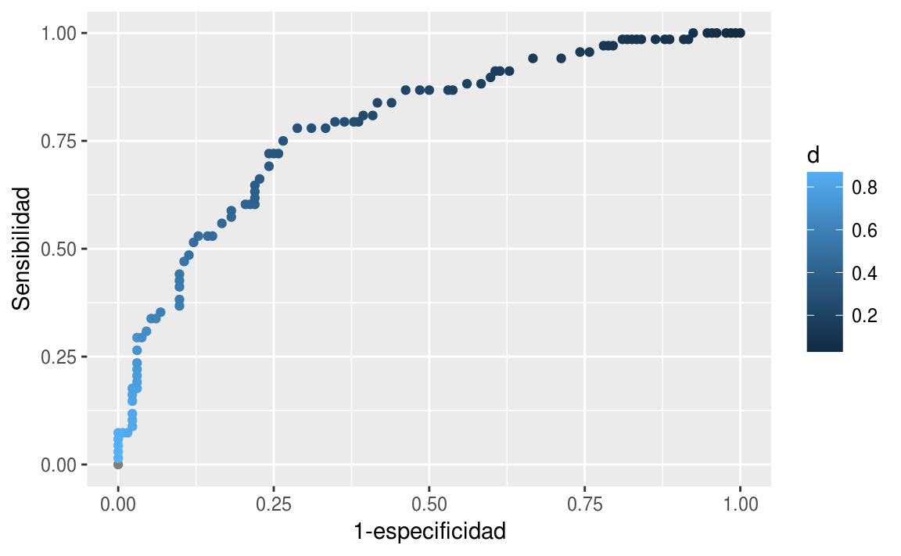
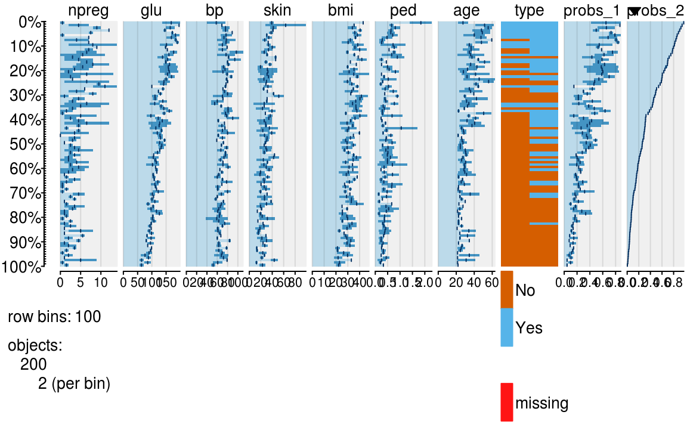
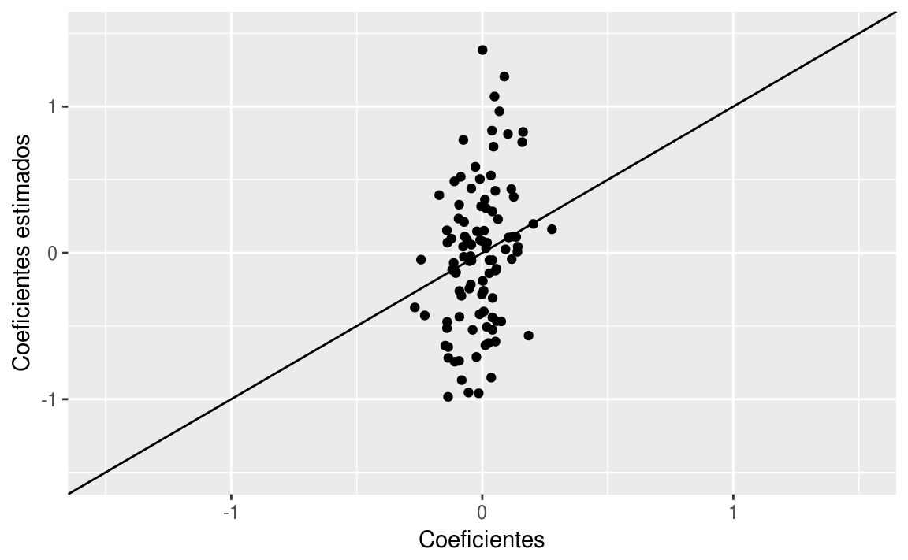
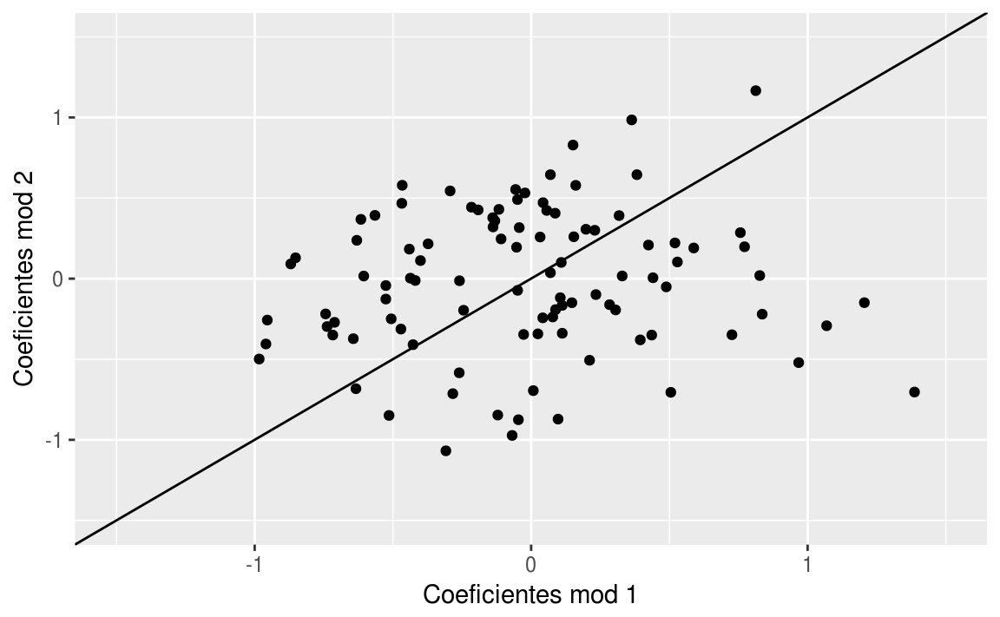
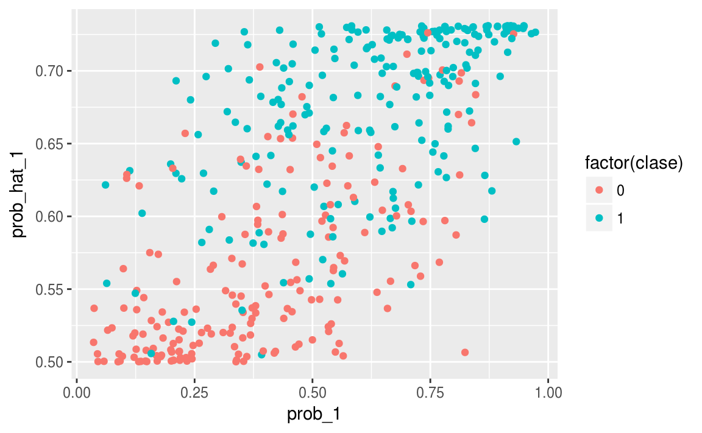
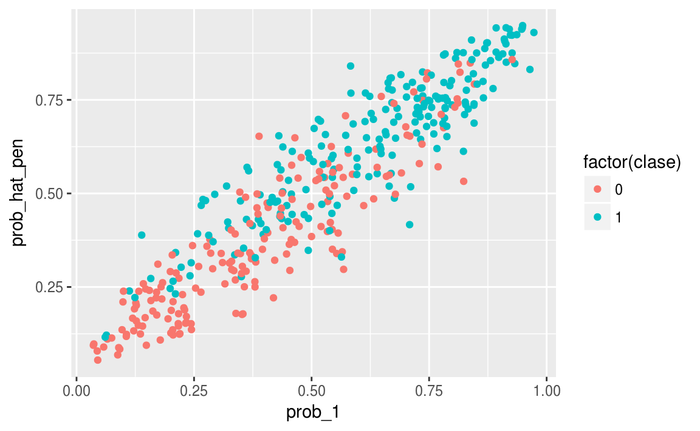

# Regularización

<style>
  .espacio {
    margin-bottom: 1cm;
  }
</style>
  
  <style>
  .espacio3 {
    margin-bottom: 3cm;
  }
</style>

<p class="espacio">
</p>


```r
library(tidyverse)
```

## Repaso

\BeginKnitrBlock{information}<div class="information">La __tasa de error__ se define como la proporción de casos para los cuáles la predicción de $y_i$ a partir de la probabilidad estimada
$$
\pi_i=p_1(x_i)=\mbox{logit}^{-1}(X_i\beta)
$$
es incorrecta.

Para hacer la predicción para cada $y_i$ es necesario definir un **punto de corte**, en principio se utiliza el $0.5$ de la forma que la predicción de $y_i$, denotada por $\hat{y}_i$, es
$$
\hat{y}_{i} = \left\{ \begin{array}{cl}
1 & \text{si }\;\mbox{logit}^{-1}(X_i\beta) > 0.5,\\
0 & \text{en otro caso.}
\end{array}\right.
$$
  
<p class="espacio3">
</p>

Definimos la **_devianza_** como
$$
D(\beta) = -2\sum_{i=1}^N \log(p_{y^{(i)}} (x^{(i)})),
$$
y utilizamos descenso en gradiente paera minimizar $D(\beta$ con respecto a $\beta$.  

Es fácil ver que este método de estimación de los coeficientes (minimizando la
devianza) es el método de máxima verosimilitud.  La verosimilitud está dada por:

$$
L(\beta) =\prod_{i=1}^N p_{y^{(i)}} (x^{(i)}),
$$
y la log verosimilitud es
$$
l(\beta) =\sum_{i=1}^N \log(p_{y^{(i)}} (x^{(i)})).
$$
  
Usamos el factor $2$ en la medida de devianza para usarla más fácilmente en pruebas de hipótesis relacionadas con comparaciones entre modelos.</div>\EndKnitrBlock{information}

<br>

<br>

Después de estudiar la tasa de error y la tasa de error del modelo nulo, presentamos técnicas adicionales para evaluar el desempeño de un modelo.

Veamos primero las ventajas y desventajas de estas dos medidas:

<p class="espacio3">
</p>


|               | Ventajas                                                                                           | Desventajas                                                                                   |
|---------------|----------------------------------------------------------------------------------------------------|-----------------------------------------------------------------------------------------------|
| Devianza      | - es una buena medida para ajustar y evaluar el desempeño de un modelo        - permite comparar modelos  | - es una medida dificil de interpretar en cuanto a los errores que podemos esperar del modelo |
| Tasa de error | - puede interpretarse con facilidad                                                                 | - no puede representar errores de clasificación que son cualitativamente diferentes           |

<p class="espacio3">
</p>

## Otras medidas de clasificación

¿Por qué son importantes otras medidas de clasificación?

- Diagnosticar a alguien con una enfermedad cuando no la tiene
tiene consecuencias distintas a diagnosticar como libre de enfermedad a alguien
que la tiene. 

- Estas consecuencias dependen de cómo son los tratamientos y de qué tan peligrosa es la enfermedad.

- Cuando usamos un buscador como Google, es cualitativamente diferente que el
buscador omita resultados relevantes a que nos presente resultados irrelevantes.

- ¿Otros ejemplos?
  
En general, los costos de los distintos errores son distintos, y en muchos
problemas quiséramos entenderlos y controlarlos individualmente. Aunque en teoría
podríamos asignar costos a los errores y definir una _función de pérdida_ apropiada,
en la práctica esto muchas veces no es tan fácil o deseable. Una función de pérdida se utiliza para la estimación de parámetros, y es tal que le asocia a cada observación un valor que representa un costo asociado a la clasificación, generalmente es la diferencia entre los valores estimados y los observados para cada observación en los datos. 

Podemos, sin embargo, reportar el tipo de errores que ocurren:

\BeginKnitrBlock{comentario}<div class="comentario">**Matriz de confusión**
  
<p class="espacio3">
</p>

La matriz de confusión $C$ está dada por

$$
C_{i,j}=\mbox{Nú}\;\,\mbox{mero de casos de la clase verdadera j que son clasificados como clase i}
$$</div>\EndKnitrBlock{comentario}

#### Ejemplo {-} 

En un ejemplo de tres clases, podríamos obtener la matriz de confusión:
  

           A     B    C
-------  ---  ----  ---
A.pred    50     2    0
B.pred    20   105   10
C.pred    20    10   30

Esto quiere decir que de 90 casos de clase $A$, sólo clasificamos a 50 en la clase correcta, de 117 casos de clase $B$, acertamos en 105, etcétera.

Podemos ver esta tabla de distintas formas, por ejemplo, usando porcentajes por columna, nos dice cómo se distribuyen los casos de cada clase:
  

```r
knitr::kable(round(prop.table(tabla_1, 2),2))
```

             A      B      C
-------  -----  -----  -----
A.pred    0.56   0.02   0.00
B.pred    0.22   0.90   0.25
C.pred    0.22   0.09   0.75

Mientras que una tabla de porcentajes por renglón nos muestra qué pasa cada vez que hacemos una predicción dada:
  

```r
knitr::kable(round(prop.table(tabla_1, 1),2))
```

             A      B      C
-------  -----  -----  -----
A.pred    0.96   0.04   0.00
B.pred    0.15   0.78   0.07
C.pred    0.33   0.17   0.50

Ahora pensemos cómo podría sernos de utilidad esta tabla. Pensemos qué implicaciones tendría esta tabla de confusión, si la clasificación fuera respecto a:

+ la severidad de emergencias en un hospital, donde A=requiere atención inmediata B=urgente C=puede posponerse, entonces qué implicación tendría cada uno de los números de la tabla.

+ tipos de cliente de un negocio, por ejemplo, A = cliente de gasto potencial alto, B=cliente medio, C=abandonador. Imagínate que tiene un costo intentar conservar a un abandonador, y hay una inversión alta para tratar a los clientes A.

La tasa de incorrectos es la misma en los dos ejemplos, pero la adecuación del modelo es muy diferente.

## Análisis de error en clasificación binaria

Cuando la variable a predecir es binaria (dos clases), podemos etiquetar una clase como *positivo* y otra como *negativo*. En el fondo no importa cómo catalogemos cada clase, pero para problemas particulares una asignación puede ser más natural. Por ejemplo, en diagnóstico de enfermedades, positivo=tiene la enfermedad, en análisis de crédito, positivo=cae en impago, en sistemas de recomendacion, positivo = le gusta el producto X, en recuperación de textos, positivo=el documento es relevante a la búsqueda, etc.

\BeginKnitrBlock{comentario}<div class="comentario">Hay dos tipos de errores en un modelo logístico binario (positivo - negativo):
  
+ Falsos positivos (fp): clasificar como positivo a un caso negativo.

+ Falsos negativos (fn): clasificar como negativo a un caso positivo.

A los casos clasificados correctamente les llamamos positivos verdaderos (pv) y negativos verdaderos (nv).</div>\EndKnitrBlock{comentario}

La matriz de confusion es entonces

|                     | positivos | negativos | total    |
|---------------------|-----------|-----------|----------|
| predicción posiriva | pv        | fp        | pred.pos |
| predicción negativa | fn        | nv        | pred.neg |
| total               | pos       | neg       |          |


Nótese que un modelo bueno, en general, es uno que tiene la mayor parte de los casos en la diagonal de la matriz de confusión.

Podemos estudiar nuestro modelo en términos de las proporciones de casos que caen en cada celda, que dependen del desempeño del modelo en cuanto a casos positivos y negativos. La nomenclatura es confusa, pues en distintas áreas se usan distintos nombres para estas proporciones:
  
  - Tasa de falsos positivos

$$
\frac{\mbox{fp}}{\mbox{fp}+\mbox{nv}}=\frac{\mbox{fp}}{\mbox{neg}}
$$
  
  - Tasa de falsos negativos

$$
\frac{\mbox{fn}}{\mbox{pv}+\mbox{fn}}=\frac{\mbox{fn}}{\mbox{pos}}
$$
  
  - Especificidad

$$
\frac{\mbox{nv}}{\mbox{fp}+\mbox{nv}}=\frac{\mbox{nv}}{\mbox{neg}}
$$

  - Sensibilidad
  
$$
\frac{\mbox{pv}}{\mbox{pv}+\mbox{fn}}=\frac{\mbox{pv}}{\mbox{pos}}
$$ 
  
Y también otras que tienen como base las predicciones:
  
  - Valor predictivo positivo o Precisión
  
$$
\frac{\mbox{vp}}{\mbox{vp}+\mbox{fp}}=\frac{\mbox{vp}}{\mbox{pred.pos}}
$$
  
  - Valor predictivo negativo
  
$$
\frac{\mbox{vn}}{\mbox{fn}+\mbox{vn}}=\frac{\mbox{vn}}{\mbox{pred.neg}}
$$
  
Dependiendo de el tema y el objetivo hay medidas más naturales que otras:
  
  + En pruebas clínicas, se usa típicamente sensibilidad y especificidad (proporción de positivos que detectamos y proporción de negativos que descartamos).

  + En búsqueda y recuperación de documentos (positivo=el documento es relevante, negativo=el documento no es relevante), se usa precisión y sensibilidad (precisión=de los documentos que entregamos (predicción positiva), cuáles son realmente positivos/relevantes, y sensibilidad=de todos los documentos relevantes, cuáles devolvemos). Aquí la tasa de falsos positivos (de todos los negativos, cuáles se predicen positivos), por ejemplo, no es de ayuda pues generalmente son bajas y no discriminan el desempeño de los modelos. La razón es que típicamente hay una gran cantidad de negativos, y se devuelven relativamente pocos documentos, de forma que la tasa de falsos positivos generalmente es muy pequeña.

#### Ejercicio {-}

¿Qué relaciones hay entre las cantidades mostradas arriba? 

1. Escribe la tasa de clasificación incorrecta en términos de especificidad y sensibilidad.

2. También intenta escribir valor predictivo positivo y valor predictivo negativo en términos de sensibilidad y especificidad.


\BeginKnitrBlock{comentario}<div class="comentario">Cada modelo tiene un balance distinto especificidad-sensibliidad. Muchas veces no escogemos modelos por la tasa de error solamente, sino que intentamos buscar un balance adecuado entre el comportamiento de clasificación para positivos y para negativos.</div>\EndKnitrBlock{comentario}

#### Ejercicio {-}

Consideremos los datos `Pima.tr` del paqute `MASS`:


```r
diabetes <- MASS::Pima.tr
diabetes %>% sample_n(10) %>% knitr::kable()
```

       npreg   glu   bp   skin    bmi     ped   age  type 
----  ------  ----  ---  -----  -----  ------  ----  -----
17         1   109   60      8   25.4   0.947    21  No   
167        0   151   90     46   42.1   0.371    21  Yes  
119        1   136   74     50   37.4   0.399    24  No   
31         1    79   60     42   43.5   0.678    23  No   
2          7   195   70     33   25.1   0.163    55  Yes  
91         1    79   75     30   32.0   0.396    22  No   
97         4   110   76     20   28.4   0.118    27  No   
56         4   127   88     11   34.5   0.598    28  No   
141        1   167   74     17   23.4   0.447    33  Yes  
148        0   177   60     29   34.6   1.072    21  Yes  

Calcula la matriz de confusión para el modelo logístico de diabetes en términos de glucosa.  Calcula especificidad, sensibilidad, y precisión.


```r
mod_1 <- glm(type ~ glu, data = diabetes, family = 'binomial')
preds <- mod_1$fitted.values
```

---

<br>

### Punto de corte para un clasificador binario

¿Qué sucede cuando el perfil de sensibilidad y especificidad de unmodelo logístivco no es apropiado para nuestros fines?

Recordemos que una vez que hemos estimado con $\hat{p}_1(x)$, nuestra regla de clasificación es:
  
1. Predecir positivo si $\hat{p}_1(x) > 0.5$,

2. Predecir negativo si $\hat{p}_1(x) \leq 0.5.$
  

Esto sugiere una regla alternativa:
  
Para $0 < d < 1$, podemos utilizar nuestras estimaciones $\hat{p}_1(x)$ para construir un modelo alternativo poniendo:
  
1. Predecir positivo si $\hat{p}_1(x) > d$, 

2. Predecir negativo si $\hat{p}_1(x) \leq d$.  

Distintos valores de $d$ dan distintos perfiles de sensibilidad-especificidad para una misma estimación de las probabilidades condicionales de clase:

* Para minimizar la tasa de incorrectos conviene poner $d = 0.5$. Sin embargo, en ocasiones no es esto lo que se busca de un modelo de clasificación binaria.

* Cuando incrementamos d, quiere decir que exigimos estar más seguros de que un caso es positivo para clasificarlo como positivo. Eso quiere decir que la especifidad va a ser más grande (entre los negativos verdaderos va a haber menos falsos positivos). Sin embargo, la sensibilidad va a ser más chica pues captamos menos de los verdaderos positivos.

#### Ejemplo {-}

Por ejemplo, si en el caso de diabetes incrementamos el punto de corte a $0.7$:


```r
table(preds > 0.7, diabetes$type)
#>        
#>          No Yes
#>   FALSE 128  52
#>   TRUE    4  16
tab <- prop.table(table(preds > 0.7, diabetes$type),2)
tab
#>        
#>             No    Yes
#>   FALSE 0.9697 0.7647
#>   TRUE  0.0303 0.2353
```

La especificidad ahora es 0.97, muy alta (descartamos muy bien casos negativos), pero la sensibilidad se deteriora a 0.24.


* Cuando hacemos más chica $d$, entonces exigimos estar más seguros de que un caso es negativo para clasificarlo como negativo. Esto aumenta la sensibilidad, pero la especificidad baja.

Por ejemplo, si en el caso de diabetes ponemos el punto de corte en 0.3:


```r
table(preds > 0.3, diabetes$type)
#>        
#>         No Yes
#>   FALSE 94  15
#>   TRUE  38  53
tab <- prop.table(table(preds > 0.3, diabetes$type),2)
tab
#>        
#>            No   Yes
#>   FALSE 0.712 0.221
#>   TRUE  0.288 0.779
```

## Curvas ROC

### Espacio ROC 

Podemos visualizar el desempeño de cada uno de estos modelos con punto de corte mapeándolos a las coordenadas de tasa de falsos positivos (1-especificidad) y sensibilidad:
  

```r
clasif_1 <- data.frame(
  corte = c('0.3','0.5','0.7','perfecto','azar'),
  tasa_falsos_pos=c(0.24,0.08,0.02,0,0.7),
  sensibilidad =c(0.66, 0.46,0.19,1,0.7))
ggplot(clasif_1, aes(x=tasa_falsos_pos, y=sensibilidad,
                     label=corte)) + geom_point() + 
  geom_abline(intercept=0, slope=1) +
  xlim(c(0,1)) +ylim(c(0,1)) + geom_text(hjust=-0.3, col='red')+
  xlab('1-especificidad (tasa falsos pos)')
```


<br>

\BeginKnitrBlock{nota}<div class="nota">1. Nótese que agregamos otros dos modelos de clasificación, uno perfecto, que tiene tasa de falsos positivos igual a 0 y sensibilidad igual a 1.

2. En esta gráfica, un modelo que esté _más arriba a la izquierda_ domina a otro que esté más abajo a la derecha porque tiene mejor especificidad y mejor sensibilidad. Entre los puntos de corte $0.3$, $0.5$ y $0.7$ de la gráfica, no hay ninguno que domine a otro.
  
3. Todos los modelos en la diagonal son equivalentes a clasificar las observaciones _al azar_. ¿Por qué? La razón es que si cada vez que vemos un nuevo caso lo clasificamos como positivo con probabilidad $p$ fija y arbitraria. Esto implica que cuando veamos un caso positivo, la probabilidad de 'atinarle' es de $p$ (sensibilidad), y cuando vemos un negativo, la probabilidad de equivocarnos también es de $p$ (tasa de falsos positivos). De modo que este modelo al azar está en la diagonal.

4. ¿Qué podemos decir acerca de los modelos que caen por debajo de la diagonal? Estos son particularmente malos, pues existen los modelos al azar que tienen mayor sensibilidad y especificidad. Sin embargo, se puede construir un mejor modelo volteando las predicciones, lo que cambia sensibilidad por tasa de falsos positivos.

5. ¿Cuál de los tres modelos es el mejor? En términos de la tasa de incorrectos, el de corte 0.5. Sin embargo, para otros propósitos puede ser razonable escoger alguno de los otros.</div>\EndKnitrBlock{nota}


En lugar de examinar cada punto de corte por separado, podemos hacer el análisis de todos los posibles puntos de corte mediante la curva ROC (receiver operating characteristic, de ingeniería).

\BeginKnitrBlock{comentario}<div class="comentario">Para un problema de clasificación binaria, dadas estimaciones $\hat{p}(x)$, 
la curva ROC grafica todos los pares de (1-especificidad, sensibilidad) para cada posible punto de corte $\hat{p}(x) > d$.</div>\EndKnitrBlock{comentario}

#### Ejemplo {-}

Recordemos los datos de diabéticos. Modelamos el tipo de diabetes tomando como predictor el nivel de glucosa. Con el paquete `tabplot` podemos obtener la gráfica de abajo.


```r
library(tabplot)
mod_1 <- glm(type ~ glu, diabetes, family = 'binomial')
diabetes$probs_1 <- predict(mod_1, newdata = diabetes, type = "response") 
head(arrange(diabetes, desc(probs_1)))
#>   npreg glu bp skin  bmi   ped age type probs_1
#> 1     1 199 76   43 42.9 1.394  22  Yes   0.882
#> 2     0 198 66   32 41.3 0.502  28  Yes   0.878
#> 3     2 197 70   99 34.7 0.575  62  Yes   0.874
#> 4     7 195 70   33 25.1 0.163  55  Yes   0.866
#> 5     7 194 68   28 35.9 0.745  41  Yes   0.861
#> 6     1 193 50   16 25.9 0.655  24   No   0.857
tableplot(diabetes, sortCol = probs_1)
```


La columna de probabilidad de la derecha nos dice en qué valores podemos cortar para obtener distintos modelos. Nótese que si cortamos más arriba, se nos escapan más positivos verdaderos que clasificamos como negativos, pero clasificamos a más negativos verdaderos como negativos. Lo opuesto ocurre cuando cortamos más abajo.

Vamos a graficar todos los pares (1-especificidad, sensibilidad) para cada punto de corte $d$ de estas probabilidades.


```r
library(ROCR)
pred_rocr <- prediction(diabetes$probs_1, diabetes$type) 
perf <- performance(pred_rocr, measure = "sens", x.measure = "fpr") 
graf_roc_1 <- data_frame(tfp = perf@x.values[[1]], sens = perf@y.values[[1]], 
                         d = perf@alpha.values[[1]])

ggplot(graf_roc_1, aes(x = tfp, y = sens, colour=d)) + geom_point() +
  xlab('1-especificidad') + ylab('Sensibilidad') 
```



En esta gráfica podemos ver todos los modelos posibles basados
en las probabilidades de clase. Dejamos para más tarde la selección del punto de
corte.

También podemos definir una medida resumen del desempeño de un modelo según
esta curva:
  
\BeginKnitrBlock{comentario}<div class="comentario">La medida AUC (area under the curve) para un modelo es el área 
bajo la curva generada por los pares (sensibilidad, 1-especificidad) de la curva ROC.</div>\EndKnitrBlock{comentario}


```r
auc_1 <- performance(pred_rocr, measure = 'auc')@y.values
auc_1
#> [[1]]
#> [1] 0.789
```

También es útil para comparar modelos. Consideremos el modelo de los datos de diabetes que incluyen todas las variables:


```r
mod_2 <- glm(type ~ ., diabetes, family = 'binomial')
diabetes$probs_2 <- predict(mod_2, newdata = diabetes, type = "response") 
head(arrange(diabetes, desc(probs_2)))
#>   npreg glu bp skin  bmi   ped age type probs_1 probs_2
#> 1     0 137 40   35 43.1 2.288  33  Yes   0.419   0.976
#> 2     1 199 76   43 42.9 1.394  22  Yes   0.882   0.972
#> 3     7 194 68   28 35.9 0.745  41  Yes   0.861   0.948
#> 4     2 197 70   99 34.7 0.575  62  Yes   0.874   0.944
#> 5    10 148 84   48 37.6 1.001  51  Yes   0.522   0.932
#> 6     8 181 68   36 30.1 0.615  60  Yes   0.792   0.918
tableplot(diabetes, sortCol = probs_2)
```




Y graficamos juntas:
  

```r
library(ROCR)
pred_rocr <- prediction(diabetes$probs_2, diabetes$type) 
perf <- performance(pred_rocr, measure = "sens", x.measure = "fpr") 
auc_2 <- performance(pred_rocr, measure = "auc")@y.values
graf_roc_2 <- data_frame(tfp = perf@x.values[[1]], sens = perf@y.values[[1]], 
                         d = perf@alpha.values[[1]])

graf_roc_2$modelo <- 'Todas las variables'
graf_roc_1$modelo <- 'Solo glucosa'
graf_roc <- bind_rows(graf_roc_1, graf_roc_2)

ggplot(graf_roc, aes(x = tfp, y = sens, colour = modelo)) + geom_point() +
  xlab('1-especificidad') + ylab('Sensibilidad') 
```


Comparación auc:
  

```r
auc_1
#> [[1]]
#> [1] 0.789
auc_2
#> [[1]]
#> [1] 0.851
```

En este ejemplo, vemos que casi no importa que perfil de especificidad y sensibilidad busquemos: el modelo que usa todas las variables domina casi siempre al modelo que sólo utiliza las variables de glucosa.

La razón es que para cualquier punto de corte (con sensibilidad menor a 0.4) en el modelo de una variable, existe otro modelo en la curva roja (todas las variable), que domina al primero.

---
  
<br>

<br>

## Regularización

En primer lugar, supondremos que 
tenemos un problema con $n=400$ y $p=100$, y tomamos como modelo para los datos (sin 
ordenada al origen):

$$
p_1(x)=h\left(\sum_{j=1}^{100} \beta_j x_j\right ),
$$


donde $h$ es la función logística.

Nótese que este es el *verdadero modelo para los datos*. Para simular datos, primero generamos las betas fijas, y después, utilizando estas betas, generamos 400 observaciones.

Generamos las betas:


```r
h <- function(x){ 1 / (1 + exp(-x))}
set.seed(2805)
beta <- rnorm(100,0,0.1)
names(beta) <- paste0('V', 1:length(beta))
head(beta)
#>       V1       V2       V3       V4       V5       V6 
#> -0.11988  0.03463 -0.08182  0.01492  0.04016  0.00204
```

Con esta función simulamos 400 observaciones.


```r
sim_datos <- function(n, m, beta){
  p <- length(beta)
  #n = observaciones, p=num variables
  mat <- matrix(rnorm(n*p, 0, 0.5), n, p) + rnorm(n) 
  prob <- h(mat %*% beta) 
  y <- rbinom(n, 1, prob)
  dat <- as.data.frame(mat)
  dat$y <- y
  dat
}
set.seed(9921)
datos <- sim_datos(n = 400, beta = beta)
```

Y ahora ajustamos el modelo de regresión logística:


```r
mod_1 <- glm(y ~ -1 + ., datos, family = 'binomial')
```

¿Qué tan buenas fueron nuestras estimaciones?


```r
qplot(beta, mod_1$coefficients) + 
  xlab('Coeficientes') + 
  ylab('Coeficientes estimados') +
  geom_abline(intercept=0, slope =1) +
  xlim(c(-1.5,1.5))+ ylim(c(-1.5,1.5))
```



Y notamos que las estimaciones no son muy buenas. Podemos hacer otra simulación para confirmar que el problema es que las estimaciones son muy variables.

Con otra muestra, vemos que las estimaciones tienen varianza alta.


```r
datos_2 <- sim_datos(n = 400, beta = beta)
mod_2 <- glm(y ~ -1 + ., datos_2, family = 'binomial')
qplot(mod_1$coefficients, mod_2$coefficients) + xlab('Coeficientes mod 1') + 
  ylab('Coeficientes mod 2') +
  geom_abline(intercept=0, slope =1) +
  xlim(c(-1.5,1.5))+ ylim(c(-1.5,1.5))
```



Si repetimos varias veces:

```r
dat_sim <- map_df(.x = 1:50, .f = function(i, beta){
  salida <- sim_datos(n=400, beta=beta)
  mod <- glm(y ~ -1 + ., salida, family = "binomial")
  tibble(rep = i, vars = names(coef(mod)), coefs = coef(mod))
}, beta = beta)
head(dat_sim)
#> # A tibble: 6 x 3
#>     rep vars    coefs
#>   <int> <chr>   <dbl>
#> 1     1 V1    -0.0789
#> 2     1 V2     0.142 
#> 3     1 V3     0.109 
#> 4     1 V4     0.140 
#> 5     1 V5     0.926 
#> 6     1 V6     0.120
```

Vemos que hay mucha variabilidad en la estimación de los coeficientes
 (en rojo están los verdaderos):


```r
dat_sim <- dat_sim %>% mutate(vars = reorder(vars, coefs, mean))
ggplot(dat_sim, aes(x=vars, y=coefs)) + geom_boxplot() +
  geom_line(data=data_frame(coefs=beta, vars=names(beta)), 
    aes(y=beta, group=1), col='red',size=1.1) + coord_flip()
```


En la práctica, nosotros tenemos una sola muestra de entrenamiento.
Así que, con una muestra de tamaño $n=500$ como en este ejemplo,
obtendremos típicamente resultados no muy buenos. **Estos
coeficientes ruidosos afectan nuestras predicciones**.

Vemos ahora lo que pasa con nuestra $\hat{p}_1(x)$ estimadas, comparándolas
con $p_1(x)$, para la primera simulación:


```r
x <- datos %>% select(-y) %>% as.matrix
ps <- data_frame(prob_hat_1 = h(mod_1$fitted.values), 
                        prob_1 = as.numeric(h(x%*% beta)),
                        clase = datos$y)
head(ps)
#> # A tibble: 6 x 3
#>   prob_hat_1 prob_1 clase
#>        <dbl>  <dbl> <int>
#> 1      0.530  0.372     0
#> 2      0.524  0.170     0
#> 3      0.545  0.349     0
#> 4      0.534  0.380     0
#> 5      0.653  0.432     0
#> 6      0.727  0.913     1
```


```r
ggplot(ps, aes(x=prob_1, y=prob_hat_1, colour=factor(clase))) + geom_point()
```



Si la estimación fuera perfecta, esta gráfica sería una diagonal. Vemos entonces
que cometemos errores grandes. El problema no es que nuestro modelo no sea apropiado
(logístico), pues ése es el modelo real. El problema es la variabilidad en la estimación
de los coeficientes que notamos arriba.

### Reduciendo varianza de los coeficientes

Como el problema es la varianza, podemos atacar este problema
poniendo restricciones a los coeficientes, de manera que caigan en rangos 
más aceptables.  Una manera de hacer esto es sustituir el problema de minimización
de regresión logística, que es minimizar la devianza:

$$
\min_{\beta} D(\beta)
$$

con un problema penalizado

$$
\min_{\beta} D(\beta) + \lambda\sum_{i=1}^p \beta_j^2
$$

escogiendo un valor apropiado de $\lambda$. También es posible poner restricciones
sobre el tamaño de $\sum_{i=1}^p \beta_j^2$, lo cual es equivalente al problema
de penalización.

En este caso obtenemos (veremos más del paquete *glmnet*):


```r
library(glmnet)
mod_restringido <- glmnet(x = x, y = datos$y, 
  alpha = 0,
  family='binomial', intercept = F, 
  lambda = 0.1)
beta_penalizado <- coef(mod_restringido)[-1] # quitar intercept
```

Y podemos ver que el tamaño de los coeficientes se redujo considerablemente:


```r
sum(beta_penalizado^2)
#> [1] 0.465
sum(coef(mod_1)^2)
#> [1] 24.5
```

Los nuevos coeficientes estimados:


```r
qplot(beta, beta_penalizado) + 
  xlab('Coeficientes') + 
  ylab('Coeficientes estimados') +
  geom_abline(xintercept=0, slope =1) +
  xlim(c(-0.5,0.5))+ ylim(c(-0.5,0.5))
#> Warning: Ignoring unknown parameters: xintercept
```


```r
ps$prob_hat_pen <- h(x %*% as.numeric(beta_penalizado))
```


```r
ggplot(ps, aes(x=prob_1, y=prob_hat_pen, colour=factor(clase))) + geom_point()
```




```r
tab <- table(ps$prob_hat_pen > 0.5, ps$clase)
prop.table(tab, margin=2)
#>        
#>             0     1
#>   FALSE 0.731 0.262
#>   TRUE  0.269 0.738
```

Comparamos con la tabla de confusión _sin penalizar_:


```r
tab <- table(ps$prob_hat_1 > 0.5, ps$clase)
tab
#>       
#>          0   1
#>   TRUE 186 214
```

## Regularización Ridge

Arriba vimos un ejemplo de regresión penalizada tipo **Ridge**. Recordemos
que  en regresión logística buscamos minimizar,
$$
D(\beta)=-2\sum_{i=1}^n y_i \log\left(h(x_i^\prime \beta)\right) + (1-y_i) \log\left(1-h(x_i^\prime \beta)\right).
$$

\BeginKnitrBlock{comentario}<div class="comentario">En regresión **ridge**, para $\lambda>0$ fija minimizamos
$$D_{\lambda}^{ridge} (\beta)=D(\beta)  + \lambda\sum_{i=1}^p \beta_j^2$$,
donde suponemos que las entradas están estandarizadas (centradas y escaladas por
la desviación estándar).</div>\EndKnitrBlock{comentario}

#### Observaciones {-}

- La idea de regresión penalizada consiste en estabilizar la estimación de los
coeficientes, especialmente en casos donde tenemos muchas variables en relación
al número de observaciones. La penalización no permite que varíen tan fuertemente
los coeficientes.

- Cuando $\lambda$ es mas grande, los coeficientes se encogen más fuertemente
hacia cero con respecto al problema no regularizado. En este caso, estamos
**reduciendo la varianza** pero potencialmente **incrementando el sesgo**.

- Cuando $\lambda$ es mas chico, los coeficientes se encogen menos fuertemente
hacia cero, y quedan más cercanos a los coeficientes de mínimos cuadrados/máxima verosimilitud. 
En este caso, estamos **reduciendo el sesgo** pero **incrementando la varianza**.

- Nótese que no penalizamos $\beta_0$. Es posible hacerlo, pero típicamente
no lo hacemos. Recordemos que en regresión logística, la probabilidad ajustada cuando las entradas toman su valor en la media es igual a $h(\beta_0)$.

- Que las variables estén estandarizadas es importante para que tenga
sentido la penalización. Si las variables $x_j$ están en distintas escalas (por ejemplo
pesos y dólares), entonces también los coeficientes $\beta_j$ están en distintas escalas,
y una penalización fija no afecta de la misma forma a cada coeficiente.


Resolver este problema por descenso en gradiente no tiene dificultad, pues:

\BeginKnitrBlock{comentario}<div class="comentario">$$
\frac{\partial D_{\lambda}^{ridge} (\beta)}{\partial\beta_j} = \frac{\partial D(\beta)}{\beta_j} + 2\lambda\beta_j
$$
para $j=1,\ldots, p$, y 
$$
\frac{\partial D_{\lambda}^{ridge} (\beta)}{\partial\beta_0} = \frac{\partial D(\beta)}{\beta_0}.
$$</div>\EndKnitrBlock{comentario}

De forma que sólo hay que hacer una modificaciónmínima al algoritmo de descenso en gradiente
para el caso no regularizado.

### Selección de coeficiente de regularización

Seleccionamos $\lambda$ para minimizar el error de predicción,
es decir, para mejorar nuestro modelo ajustado en cuanto a sus 
predicciones.

- No tiene sentido intentar escoger $\lambda>0$ usando la tasa de error. La razón es que siempre que aumentamos $\lambda$, obtenemos un valor mayor de la devianza del modelo, pues $\lambda$ más grande implica que pesa menos la minimización de la devianza en el problema de la minimización. En otras palabras, los coeficientes tienen una penalización más fuerte, de modo que el mínimo que se alcanza es mayor en términos de devianza.

- Intentamos escoger $\lambda$ de forma que se minimice el error de predicción.


## Regularización Lasso

Otra forma de regularización es **Lasso**, que en lugar de penalizar
con la suma de cuadrados en los coeficientes, penaliza por la suma
de su valor absoluto.

\BeginKnitrBlock{comentario}<div class="comentario">En regresión **Lasso** para $\lambda>0$ fija minimizamos
$$
D_{\lambda}^2 (\beta)=D(\beta)  + \lambda\sum_{i=1}^p |\beta_j|,
$$
donde suponemos que las entradas están estandarizadas (centradas y escaladas por
la desviación estándar).</div>\EndKnitrBlock{comentario}

El problema de minimización de ridge y de Lasso se pueden reescribir como
problemas de restricción:


\BeginKnitrBlock{comentario}<div class="comentario">En regresión **Lasso**  para $s>0$ fija minimizamos
$$D(\beta),$$
sujeto a
$$\sum_{i=1}^p |\beta_j|< s$$
donde suponemos que las entradas están estandarizadas (centradas y escaladas por
la desviación estándar).</div>\EndKnitrBlock{comentario}

\BeginKnitrBlock{comentario}<div class="comentario">En regresión **ridge** para $t>0$ fija minimizamos
$$D(\beta),$$
sujeto a
$$\sum_{i=1}^p \beta_j^2 < t$$
donde suponemos que las entradas están estandarizadas (centradas y escaladas por
la desviación estándar).</div>\EndKnitrBlock{comentario}
$s$ y $t$ chicas corresponden a valores de penalización $\lambda$ grandes.


En un principio, puede parecer que ridge y Lasso deben dar resultados
muy similares, pues en ambos casos penalizamos por el tamaño de los coeficientes.
Sin embargo, son distintos de una manera muy importante.

En la siguiente gráfica regresentamos las curvas de nivel de $D(\beta)$. 
Recordemos que en regresión logística intentamos minimizar
esta cantidad sin restricciones, y este mínimo se encuentra en el centro 
de estas curvas de nivel. Para el problema restringido, buscamos más
bien la curva de nivel más baja que intersecta la restricción:


```r
knitr::include_graphics('./figuras/ridge_lasso.png')
```


<br>

Y obsérvese ahora que la solución de Lasso *puede hacer algunos coeficientes
igual a 0*. Es decir,

\BeginKnitrBlock{comentario}<div class="comentario">En regresión ridge, los coeficientes se encogen gradualmente desde la solución
no restringida hasta el origen. Ridge es un método de **encogimiento de coeficientes.**

En regresión Lasso, los coeficientes se encogen gradualmente, pero también
se excluyen variables del modelo. Por eso Lasso es un método de
*encogimiento y selección de variables*.</div>\EndKnitrBlock{comentario}

\BeginKnitrBlock{comentario}<div class="comentario">- Regresión ridge es especialmente útil cuando tenemos varias variables de entrada
fuertemente correlacionadas. Regresión ridge intenta encoger juntos coeficientes de variables
correlacionadas para reducir varianza en las predicciones.

- Lasso encoge igualmente coeficientes para reducir varianza, pero también comparte
similitudes con *regresión de mejor subconjunto*, en donde para cada número de variables $l$
buscamos escoger las $l$ variables que den el mejor modelo. Sin embargo, el enfoque
de Lasso es más escalable y puede calcularse de manera más simple.

- Descenso en gradiente no es apropiado para regresión Lasso (ver documentación de
glmnet para ver cómo se hace en este paquete). El problema es que los coeficientes
nunca se hacen exactamente cero, pues la restricción no es diferenciable en el origen 
(coeficientes igual a cero).</div>\EndKnitrBlock{comentario}

## Tarea

Consideramos datos para detección de spam en e-mail de  [spambase](https://archive.ics.uci.edu/ml/datasets/spambase).


```r
library(tidyverse)
spam <- read_csv('datos/spam.csv')
```

Las variables de entrada son extraídas de emails (los textos de 
emails fueron procesados para obtener estas entradas). Son frecuencias
de ocurrencia de palabras (por ejemplo, wffree, wfremove, wfmail son frecuencias
de las palabras free, remove, mail, etc.), y otras entradas cuentan
aparición de ciertos caracteres (cfdollar, cfexc son frecuencias de caracteres
signo de dólar y signo de exclamación).

Queremos predecir con estas entradas si un mail es spam o no


```r
table(spam$spam)
#> 
#>    0    1 
#> 2788 1813
```

Utiliza el método de regresión logística para hacer la estimación.

1. Construye un modelo solamente usando las variables de caracteres (cfsc, cfpar, etc). 
Calcula la curva ROC. 

2. Construye un modelo utilizando todas las variables. Calcula la curva ROC. 

3. Haz gráficas de las curvas ROC de los dos modelos anteriores. ¿Qué modelo es superior?

4. Discute un punto de corte apropiado para hacer un filtro de spam. 
¿Escogerías especificidad más alta o sensibilidad más alta? Explica discutiendo
los costos de cada tipo de error (falso positivo o falso negativo). Escoge el punto
de corte y muestra la matriz de confusión correspondiente.

5. Repite el ejercicio de spam (con todas las variables), y utiliza regresión logística ridge (glmnet). Escoge un parámetro de regularización y recalcula la matriz de confusión. ¿Obtuviste ganancias en clasificación? Checa los nuevos coeficientes y compara con los que obtuviste usando regresión logística sin regularización. 

**Nota**: para obtener coeficientes estandarizados con glmnet debes
estandarizar los datos a mano antes de correr glmnet.
