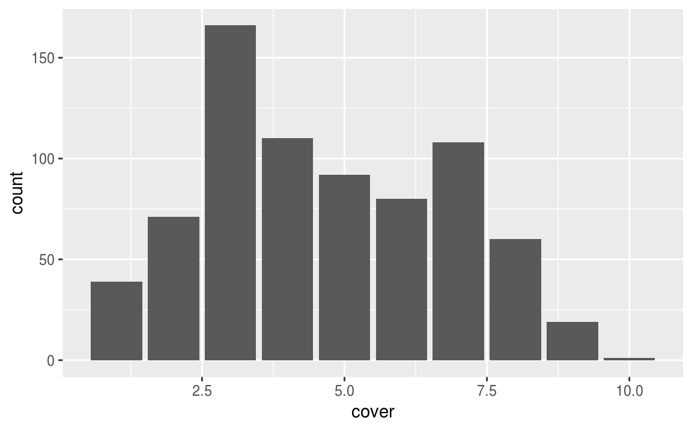
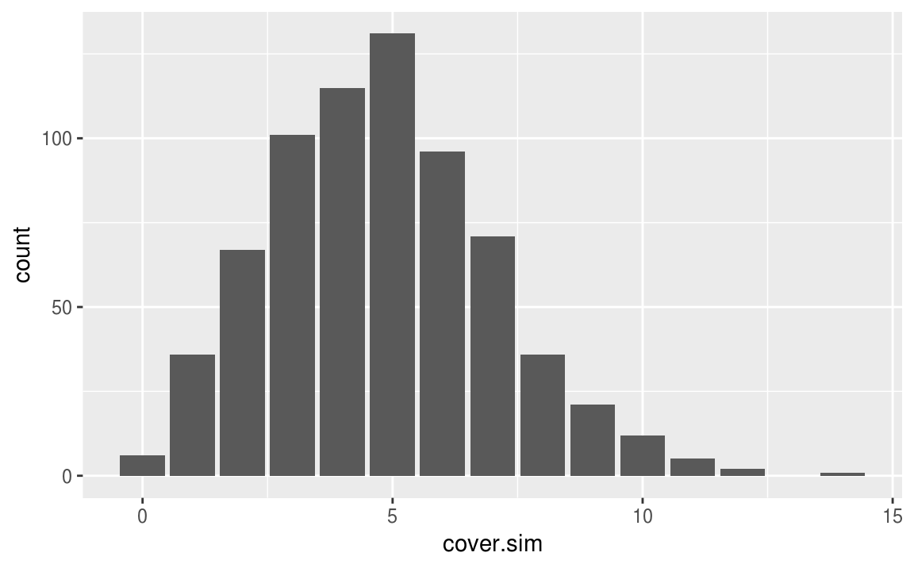
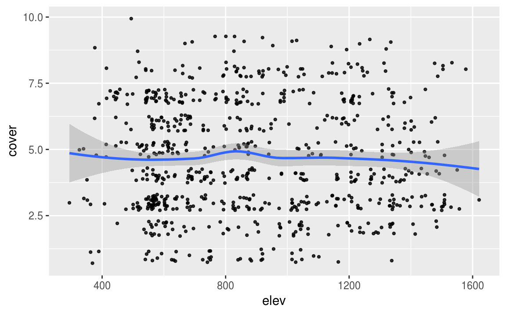

# Modelos lineales generalizados

<style>
  .espacio {
    margin-bottom: 1cm;
  }
</style>
  
  <style>
  .espacio3 {
    margin-bottom: 3cm;
  }
</style>

<p class="espacio">
</p>


```r
library(tidyverse)
```

## Regresión lineal y logística

Los modelos lineales generalizados son una familia de modelos para el análisis estadístico. Incluye la regresión lineal y logística como casos especiales.

La regresión lineal predice directamente datos continuos $y$ de un _predictor lineal_ $X\beta = \beta_0 + X_1\beta_1 + \cdots + X_k\beta_k.$

La regresión logística predice $P(y=1)$ para datos binarios a partir de un predictor lineal transformado por la función logística inversa.

Un modelo lineal generalizado consiste de:

1. Un vector de datos $y=(y_1,\ldots,y_n)$

2. Predictores $X$ y coeficientes $\beta$ para construir un predictor lineal $X\beta$.

3. Una _función liga_ $g$ que da como resultado datos transformados $$\hat{y}=g^{-1}(X\beta)$$ que son usados para modelar los datos.

4. Una distribución para los datos $p(y|\hat{y})$.

5. Posiblemente otros parámetros, como varianza, o puntos de corte,
involucrados en los predictores, o bien, la función liga o la distribución de los datos.

<p class="espacio3">
</p>

 
<div class="centered">
<p class="espacio">
</p>

¿Qué función liga se utiliza en regresión lineal?

(a) $g(x) = X\beta$.

(b) $g(x)=\alpha + \beta x$.

(c) $g(x)=\dfrac{1}{\sqrt{2\pi\sigma^2}}\,e^{-\frac{1}{2\sigma^2}(x-\mu)^2}$.

(d) $g(x)=x$.

<p class="espacio3">
</p>
</div>
<br>

<p class="espacio3">
</p>

 
<div class="centered">
<p class="espacio">
</p>

¿Qué función liga se utiliza en regresión logística?

(a) $g(x) = \dfrac{e^x}{1-e^x}$.

(b) $g(x)= \mbox{logit}^{-1}(x)$.

(c) $g(x)=\left(\dfrac{1}{1+e^{-x}}\right)^{-1}$.

(d) $g(x)=x$.

<p class="espacio3">
</p>
</div>
<br>

---

## Otros modelos

Otros modelos que vamos a ver después son:

1. El _modelo Poisson_ se utiliza para datos de _conteos_; es decir, donde cada dato observado $y_i$ puede ser igual a $0, 1, 2,\dots$. La función liga que se utiliza habitualmente $g$ es logarítmica, de modo que $g(x) = \mbox{exp}(x)$ transforma un predictor lineal continuo $X_i\beta$ en un $y_i$ positivo. La distribución de datos es Poisson. A veces es buena idea agregar un parámetro a este modelo para capturar la **sobredispersión**, es decir, la variación en los datos más allá de la que captura el modelo.

2. El modelo _logístico-binomial_ se utiliza en casos cuando los datos observados $y_i$ representan el número de éxitos en $n_i$ ensayos independientes. En este modelo la función liga es $\mbox{logit}$ y la distribución de los datos es binomial. Al igual que con la regresión Poisson, el modelo binomial típicamente se puede mejorar agregando un parámetro de sobredispersión.

3. El modelo _probit_ es igual que regresión logística pero se reemplaza la función liga por la _distribución normal acumulada_. Se puede pensar como usar la distribución normal en los errores estimados del modelo.


<p class="espacio">
</p>

\BeginKnitrBlock{information}<div class="information">**Nota:** Podemos usar `glm()` directamente para ajustar regresiones logísticas-binomiales, probit y Poisson, entre otras, y para corregir la sobredispersión cuando sea necesario.</div>\EndKnitrBlock{information}

<br>

<br>

## Ejemplo: accidentes de tráfico

En el modelo de Poisson, cada observación $i$ corresponde a una situación (típicamente una ubicación espacial o un intervalo de tiempo) en la que se observan eventos $y_i$. Por ejemplo, con $i$ se puede representar esquinas de calles en una ciudad y $y_i$ podría ser el número de accidentes de tráfico en la $i$-ésima esquina en un año determinado.

Al igual que con la regresión lineal y logística, la variación en $y$ puede explicarse con predictores lineales $X$. En el ejemplo de accidentes de tráfico, estos predictores podrían incluir: un término constante, una medida de la velocidad promedio del tráfico cerca de la esquina y un indicador para si la esquina tiene una señal de tráfico. El modelo básico de regresión de Poisson tiene la forma

$$
y_i \sim \mbox{Poisson}(\theta_i).
$$

El parámetro $\theta_i$ debe ser positivo, por lo que tiene sentido ajustar un predictor lineal en una escala logarítmica:

$$
\theta_i = \exp(X_i\beta).
$$

## Interpretación de coeficientes Poisson

Los coeficientes $\beta$ pueden exponenciarse y tratarse como efectos multiplicativos. Por ejemplo, supongamos que el modelo de accidentes de tráfico es

$$
y_i ∼ \mbox{Poisson}(\exp(2.8 + 0.012X_{i1} − 0.20X_{i2})),
$$
donde $X_{i1}$ es la velocidad promedio (en millas por hora) en las calles cercanas y $X_{i2} = 1$ si la esquina (o intersección) tiene una señal de tráfico y $0$ en caso contrario. 

<p class="espacio">
</p>

Entonces podemos interpretar cada coeficiente de la siguiente manera:

+ El término constante es el intercepto, es decir, la predicción de si $X_{i1} = 0$ y $X_{i2} = 0$. Como esto no es posible (ninguna calle tendrá una velocidad promedio de 0), entonces no intentaremos interpretar el término constante.

+ El coeficiente de $X_{i1}$ es la diferencia esperada en $y$ (en la escala logarítmica) para cada milla por hora adicional de velocidad de tráfico. Por lo tanto, el aumento multiplicativo esperado es $e^{0.012} = 1.012$, o una diferencia positiva de 1.2% en la tasa de accidentes de tráfico por milla por hora. Dado que la velocidad del tráfico varía en decenas de milla por hora, en realidad tendría sentido definir $X_{i1}$ como velocidad en decenas de milla por hora, en cuyo caso su coeficiente sería 0.12, que corresponde a un aumento del 12% (más precisamente, $e^{0.12} = 1.127$: a 12.7% de aumento) en la tasa de accidentes por diez milla por hora.

+ El coeficiente de $X_{i2}$ nos dice que la diferencia predictiva de tener una señal de tráfico se puede encontrar multiplicando la tasa de accidentes por $\exp(-0.20) = 0.82$ produciendo una reducción del 18%.

Al igual que con los modelos de regresión en general, cada coeficiente se interpreta como una comparación en el que un predictor difiere en una unidad, mientras que todos los demás predictores permanecen constantes, lo cual no es necesariamente el supuesto más apropiado. Por ejemplo, no se debería esperar necesariamente que la instalación de señales de tráfico en todas las esquinas de la ciudad reduzca los accidentes en un 18%.

## Diferencias entre el modelo binomial y Poisson

El modelo de Poisson es similar al modelo binomial para conteos pero se aplica en situaciones ligeramente diferentes:

* Si cada observación $y_i$ se puede interpretar como el número de "éxitos" de $n_i$ experimentos aleatorios, entonces es común usar el modelo Binomial-logístico.

* Si cada observación $y_i$ no tiene un límite superior natural (no se basa en un número determinado de ensayos independientes) entonces es común usar el modelo Poisson-logarítmico.

---

<br>

## Ejemplo: fertilidad en Fiji

La siguiente tabla adaptada de Little (1978) [@rj1978generalized]:, proviene de la Encuesta de Fertilidad de Fiji, publicada en los informes de World Fertility Survey. La tabla muestra datos sobre el número de hijos nacidos de mujeres casadas de raza de indios nativos clasificados por duración desde su primer matrimonio (agrupados en seis categorías), tipo de lugar de residencia (Suva, otro urbano y rural) y nivel educativo (cuatro categorías: ninguno, primaria inferior, primaria superior y secundaria o superior). Cada casilla de la tabla muestra la media, la varianza y el número de observaciones.

<p class="espacio3">
</p>

<font size="1" face="Times New Roman">
<table class='tex-table' width="80%">
<tr class='bt'><td class='ar'>Marr.</td><td colspan='4' align='center'>Suva</td><td colspan='4' align='center'>Otro urbano</td><td colspan='4' align='center'>Rural</td></tr>
<tr class='bb'><td class='ar'>Dur.</td><td class='ar'>N</td><td class='ar'>LP</td><td class='ar'>UP</td><td class='ar'>S\(+\)</td><td class='ar'>N</td><td class='ar'>LP</td><td class='ar'>UP</td><td class='ar'>S\(+\)</td><td class='ar'>N</td><td class='ar'>LP</td><td class='ar'>UP</td><td class='ar'>S\(+\)</td></tr>
<tr class='bt'><td class='ar'>0&ndash;4</td><td class='ar'>0.50</td><td class='ar'>1.14</td><td class='ar'>0.90</td><td class='ar'>0.73</td><td class='ar'>1.17</td><td class='ar'>0.85</td><td class='ar'>1.05</td><td class='ar'>0.69</td><td class='ar'>0.97</td><td class='ar'>0.96</td><td class='ar'>0.97</td><td class='ar'>0.74</td></tr>
<tr><td class='ar'></td><td class='ar'>1.14</td><td class='ar'>0.73</td><td class='ar'>0.67</td><td class='ar'>0.48</td><td class='ar'>1.06</td><td class='ar'>1.59</td><td class='ar'>0.73</td><td class='ar'>0.54</td><td class='ar'>0.88</td><td class='ar'>0.81</td><td class='ar'>0.80</td><td class='ar'>0.59</td></tr>
<tr><td class='ar'></td><td class='ar'>8</td><td class='ar'>21</td><td class='ar'>42</td><td class='ar'>51</td><td class='ar'>12</td><td class='ar'>27</td><td class='ar'>39</td><td class='ar'>51</td><td class='ar'>62</td><td class='ar'>102</td><td class='ar'>107</td><td class='ar'>47</td></tr>
<tr><td class='ar'>5&ndash;9</td><td class='ar'>3.10</td><td class='ar'>2.67</td><td class='ar'>2.04</td><td class='ar'>1.73</td><td class='ar'>4.54</td><td class='ar'>2.65</td><td class='ar'>2.68</td><td class='ar'>2.29</td><td class='ar'>2.44</td><td class='ar'>2.71</td><td class='ar'>2.47</td><td class='ar'>2.24</td></tr>
<tr><td class='ar'></td><td class='ar'>1.66</td><td class='ar'>0.99</td><td class='ar'>1.87</td><td class='ar'>0.68</td><td class='ar'>3.44</td><td class='ar'>1.51</td><td class='ar'>0.97</td><td class='ar'>0.81</td><td class='ar'>1.93</td><td class='ar'>1.36</td><td class='ar'>1.30</td><td class='ar'>1.19</td></tr>
<tr><td class='ar'></td><td class='ar'>10</td><td class='ar'>30</td><td class='ar'>24</td><td class='ar'>22</td><td class='ar'>13</td><td class='ar'>37</td><td class='ar'>44</td><td class='ar'>21</td><td class='ar'>70</td><td class='ar'>117</td><td class='ar'>81</td><td class='ar'>21</td></tr>
<tr><td class='ar'>10&ndash;14</td><td class='ar'>4.08</td><td class='ar'>3.67</td><td class='ar'>2.90</td><td class='ar'>2.00</td><td class='ar'>4.17</td><td class='ar'>3.33</td><td class='ar'>3.62</td><td class='ar'>3.33</td><td class='ar'>4.14</td><td class='ar'>4.14</td><td class='ar'>3.94</td><td class='ar'>3.33</td></tr>
<tr><td class='ar'></td><td class='ar'>1.72</td><td class='ar'>2.31</td><td class='ar'>1.57</td><td class='ar'>1.82</td><td class='ar'>2.97</td><td class='ar'>2.99</td><td class='ar'>1.96</td><td class='ar'>1.52</td><td class='ar'>3.52</td><td class='ar'>3.31</td><td class='ar'>3.28</td><td class='ar'>2.50</td></tr>
<tr><td class='ar'></td><td class='ar'>12</td><td class='ar'>27</td><td class='ar'>20</td><td class='ar'>12</td><td class='ar'>18</td><td class='ar'>43</td><td class='ar'>29</td><td class='ar'>15</td><td class='ar'>88</td><td class='ar'>132</td><td class='ar'>50</td><td class='ar'>9</td></tr>
<tr><td class='ar'>15&ndash;19</td><td class='ar'>4.21</td><td class='ar'>4.94</td><td class='ar'>3.15</td><td class='ar'>2.75</td><td class='ar'>4.70</td><td class='ar'>5.36</td><td class='ar'>4.60</td><td class='ar'>3.80</td><td class='ar'>5.06</td><td class='ar'>5.59</td><td class='ar'>4.50</td><td class='ar'>2.00</td></tr>
<tr><td class='ar'></td><td class='ar'>2.03</td><td class='ar'>1.46</td><td class='ar'>0.81</td><td class='ar'>0.92</td><td class='ar'>7.40</td><td class='ar'>2.97</td><td class='ar'>3.83</td><td class='ar'>0.70</td><td class='ar'>4.91</td><td class='ar'>3.23</td><td class='ar'>3.29</td><td class='ar'>&ndash;</td></tr>
<tr><td class='ar'></td><td class='ar'>14</td><td class='ar'>31</td><td class='ar'>13</td><td class='ar'>4</td><td class='ar'>23</td><td class='ar'>42</td><td class='ar'>20</td><td class='ar'>5</td><td class='ar'>114</td><td class='ar'>86</td><td class='ar'>30</td><td class='ar'>1</td></tr>
<tr><td class='ar'>20&ndash;24</td><td class='ar'>5.62</td><td class='ar'>5.06</td><td class='ar'>3.92</td><td class='ar'>2.60</td><td class='ar'>5.36</td><td class='ar'>5.88</td><td class='ar'>5.00</td><td class='ar'>5.33</td><td class='ar'>6.46</td><td class='ar'>6.34</td><td class='ar'>5.74</td><td class='ar'>2.50</td></tr>
<tr><td class='ar'></td><td class='ar'>4.15</td><td class='ar'>4.64</td><td class='ar'>4.08</td><td class='ar'>4.30</td><td class='ar'>7.19</td><td class='ar'>4.44</td><td class='ar'>4.33</td><td class='ar'>0.33</td><td class='ar'>8.20</td><td class='ar'>5.72</td><td class='ar'>5.20</td><td class='ar'>0.50</td></tr>
<tr><td class='ar'></td><td class='ar'>21</td><td class='ar'>18</td><td class='ar'>12</td><td class='ar'>5</td><td class='ar'>22</td><td class='ar'>25</td><td class='ar'>13</td><td class='ar'>3</td><td class='ar'>117</td><td class='ar'>68</td><td class='ar'>23</td><td class='ar'>2</td></tr>
<tr><td class='ar'>25&ndash;29</td><td class='ar'>6.60</td><td class='ar'>6.74</td><td class='ar'>5.38</td><td class='ar'>2.00</td><td class='ar'>6.52</td><td class='ar'>7.51</td><td class='ar'>7.54</td><td class='ar'>&ndash;</td><td class='ar'>7.48</td><td class='ar'>7.81</td><td class='ar'>5.80</td><td class='ar'>&ndash;</td></tr>
<tr><td class='ar'></td><td class='ar'>12.40</td><td class='ar'>11.66</td><td class='ar'>4.27</td><td class='ar'>&ndash;</td><td class='ar'>11.45</td><td class='ar'>10.53</td><td class='ar'>12.60</td><td class='ar'>&ndash;</td><td class='ar'>11.34</td><td class='ar'>7.57</td><td class='ar'>7.07</td><td class='ar'>&ndash;</td></tr>
<tr class='bb'><td class='ar'></td><td class='ar'>47</td><td class='ar'>27</td><td class='ar'>8</td><td class='ar'>1</td><td class='ar'>46</td><td class='ar'>45</td><td class='ar'>13</td><td class='ar'>&ndash;</td><td class='ar'>195</td><td class='ar'>59</td><td class='ar'>10</td><td class='ar'>&ndash;</td></tr>
</table>
</font>

<p class="espacio3">
</p>

En nuestro análisis, trataremos el número de hijos nacidos de cada mujer como la variable respuesta, y la duración de su matrimonio, el tipo de lugar de residencia y el nivel educativo como predictores.

Consideremos:

+ Las unidades $i$ son mujeres en un lugar de residencia, para un nivel educativo, y una duración de matrimonio dados

+ La respuesta $y_i$ es el número de nacimientos de mujeres en dicho grupo

+ Los predictores son la duración de su matrimonio, el tipo de lugar de residencia y el nivel educativo.

Ajustamos el modelo únicamente con el intercepto:


```r
library(tidyverse)
ceb <- read_csv("datos/ceb.csv")
ceb$educ <- ordered(ceb$educ, levels=c("none","lower","sec+","upper"))
ceb$dur <- ordered(ceb$dur, 
                   levels=c("0-4","9-May","14-Oct","15-19","20-24","25-29"), 
                   labels=c("0-4", "5-9", "10-14","15-19","20-24","25-29"))
ceb$res <- ordered(ceb$res, levels=c("rural", "urban", "Suva"))
mod_1 <- glm(formula = n ~ 1, family=poisson, data = ceb)
summary(mod_1)
#> 
#> Call:
#> glm(formula = n ~ 1, family = poisson, data = ceb)
#> 
#> Deviance Residuals: 
#>    Min      1Q  Median      3Q     Max  
#>  -8.20   -4.74   -2.38    1.37   17.94  
#> 
#> Coefficients:
#>             Estimate Std. Error z value Pr(>|z|)    
#> (Intercept)   3.6440     0.0193     189   <2e-16 ***
#> ---
#> Signif. codes:  0 '***' 0.001 '**' 0.01 '*' 0.05 '.' 0.1 ' ' 1
#> 
#> (Dispersion parameter for poisson family taken to be 1)
#> 
#>     Null deviance: 2059.5  on 69  degrees of freedom
#> Residual deviance: 2059.5  on 69  degrees of freedom
#> AIC: 2414
#> 
#> Number of Fisher Scoring iterations: 5
```


```r
mod_11 <- glm(formula = n ~ res + educ + dur, family=poisson, data = ceb)
summary(mod_11)
#> 
#> Call:
#> glm(formula = n ~ res + educ + dur, family = poisson, data = ceb)
#> 
#> Deviance Residuals: 
#>    Min      1Q  Median      3Q     Max  
#> -8.332  -2.688  -0.175   1.429   8.685  
#> 
#> Coefficients:
#>             Estimate Std. Error z value Pr(>|z|)    
#> (Intercept)  3.38686    0.02442  138.70  < 2e-16 ***
#> res.L       -0.86262    0.03684  -23.41  < 2e-16 ***
#> res.Q        0.29008    0.03940    7.36  1.8e-13 ***
#> educ.L      -0.53272    0.03905  -13.64  < 2e-16 ***
#> educ.Q       0.27420    0.04382    6.26  3.9e-10 ***
#> educ.C       0.62796    0.04813   13.05  < 2e-16 ***
#> dur.L       -0.24192    0.04642   -5.21  1.9e-07 ***
#> dur.Q        0.27477    0.04659    5.90  3.7e-09 ***
#> dur.C        0.21025    0.04866    4.32  1.6e-05 ***
#> dur^4        0.13639    0.04963    2.75    0.006 ** 
#> dur^5        0.00868    0.04928    0.18    0.860    
#> ---
#> Signif. codes:  0 '***' 0.001 '**' 0.01 '*' 0.05 '.' 0.1 ' ' 1
#> 
#> (Dispersion parameter for poisson family taken to be 1)
#> 
#>     Null deviance: 2059.53  on 69  degrees of freedom
#> Residual deviance:  787.98  on 59  degrees of freedom
#> AIC: 1162
#> 
#> Number of Fisher Scoring iterations: 5
```


Ahora agregamos primero la variable de lugar de residencia:


```r
ceb$res <- C(ceb$res, treatment) # modelo con grupo control
mod_2 <- glm(formula = n ~ res, family=poisson, data = ceb, contrasts = NULL)
summary(mod_2)
#> 
#> Call:
#> glm(formula = n ~ res, family = poisson, data = ceb, contrasts = NULL)
#> 
#> Deviance Residuals: 
#>    Min      1Q  Median      3Q     Max  
#> -11.31   -2.87   -0.36    2.25   12.35  
#> 
#> Coefficients:
#>             Estimate Std. Error z value Pr(>|z|)    
#> (Intercept)   4.2366     0.0251   169.0   <2e-16 ***
#> resurban     -0.9652     0.0477   -20.2   <2e-16 ***
#> resSuva      -1.2409     0.0521   -23.8   <2e-16 ***
#> ---
#> Signif. codes:  0 '***' 0.001 '**' 0.01 '*' 0.05 '.' 0.1 ' ' 1
#> 
#> (Dispersion parameter for poisson family taken to be 1)
#> 
#>     Null deviance: 2059.5  on 69  degrees of freedom
#> Residual deviance: 1247.5  on 67  degrees of freedom
#> AIC: 1605
#> 
#> Number of Fisher Scoring iterations: 5
```

Vemos que la devianza disminuye significativamente. Ahora agregamos los otros predictores y evaluamos el modelo nuevamente:


```r
ceb$dur <- forcats::fct_rev(ceb$dur)
ceb$dur <- C(ceb$dur,treatment)
ceb$educ <- C(ceb$educ,treatment)
mod_3 <- glm(formula = n ~ res + dur + educ, family=poisson, data = ceb)
summary(mod_3)
#> 
#> Call:
#> glm(formula = n ~ res + dur + educ, family = poisson, data = ceb)
#> 
#> Deviance Residuals: 
#>    Min      1Q  Median      3Q     Max  
#> -8.332  -2.688  -0.175   1.429   8.685  
#> 
#> Coefficients:
#>             Estimate Std. Error z value Pr(>|z|)    
#> (Intercept)   4.5793     0.0565   81.03  < 2e-16 ***
#> resurban     -0.9652     0.0477  -20.22  < 2e-16 ***
#> resSuva      -1.2199     0.0521  -23.41  < 2e-16 ***
#> dur20-24     -0.4165     0.0728   -5.72  1.0e-08 ***
#> dur15-19     -0.2645     0.0698   -3.79  0.00015 ***
#> dur10-14     -0.0922     0.0667   -1.38  0.16689    
#> dur5-9       -0.0181     0.0655   -0.28  0.78204    
#> dur0-4        0.1313     0.0633    2.07  0.03814 *  
#> educlower     0.0492     0.0468    1.05  0.29275    
#> educsec+     -1.0315     0.0699  -14.76  < 2e-16 ***
#> educupper    -0.4339     0.0534   -8.13  4.4e-16 ***
#> ---
#> Signif. codes:  0 '***' 0.001 '**' 0.01 '*' 0.05 '.' 0.1 ' ' 1
#> 
#> (Dispersion parameter for poisson family taken to be 1)
#> 
#>     Null deviance: 2059.53  on 69  degrees of freedom
#> Residual deviance:  787.98  on 59  degrees of freedom
#> AIC: 1162
#> 
#> Number of Fisher Scoring iterations: 5
```

La devianza disminuyó significativamente.

Vemos cómo se comportan las predicciones:


```r
preds <- predict(mod_3, ceb)
#> Warning: contrasts dropped from factor res
#> Warning: contrasts dropped from factor dur
#> Warning: contrasts dropped from factor educ
ceb$pred <- preds
ceb_larga <- ceb %>% gather(clase, valor, n, pred)
ggplot(ceb_larga, aes(x = dur, y = valor/sum(ceb$n), colour = clase)) + 
  geom_point() + 
  facet_grid(educ ~ res) +
  theme(axis.text.x = element_text(angle = 25))
```


## Variable de expuestos (offset)

En la mayoría de las aplicaciones de regresión de Poisson, los conteos pueden interpretarse relativos a un número, por ejemplo, el número de vehículos que cruzan la esquina. En el modelo general de regresión de Poisson, pensamos en $y_i$ como el número de casos en un proceso con tasa $\theta_i$ y expuestos $u_i$:

$$
y_i \sim \mbox{Poisson}(u_i\theta_i),
$$
donde, como antes, $\theta_i = \exp(X_i\beta)$. El logaritmo de expuestos, $\log(u_i)$, se denomina _offset_ (o desplazamiento) en la terminología del modelo lineal generalizado.

Observaciones:

* Los coeficientes de regresión $\beta$ resumen las asociaciones entre los predictores y $θ_i$ (en nuestro ejemplo, la tasa de accidentes de tráfico por vehículo).

* Poner el logaritmo de expuestos en el modelo es equivalente a incluirlo como un predictor de regresión, pero con coeficiente fijado en $1$. Otra opción es incluirlo como un predictor y permitir que su coeficiente sea estimado a partir de los datos, pero a veces es más simple mantenerlo como un desplazamiento para que la tasa estimada $\theta$ tenga una interpretación más directa.

## Ejemplos: seguros

Los datos `Insurance` en el paquete `MASS` consisten del número de asegurados de una compañía de seguros de autos que estuvieron expuestos a riesgo por accidente y el número de reclamos realizados por los asegurados en el tercer trimestre de 1973.


```r
library(MASS)
data(Insurance)
Insurance %>% head %>% knitr::kable()
```


District   Group    Age      Holders   Claims
---------  -------  ------  --------  -------
1          <1l      <25          197       38
1          <1l      25-29        264       35
1          <1l      30-35        246       20
1          <1l      >35         1680      156
1          1-1.5l   <25          284       63
1          1-1.5l   25-29        536       84

Las variables son:

1. Distrito. residencia del que tiene la póliza 1 a 4 (ciudades importantes)

2. Grupo. tipo de coche: <1 litro, 1-1.5 litros, 1.5-2 litros, >2 litros

3. Edad. grupo de edad: <25, 25-29, 30-35, >35.

4. Holders. número de asegurados.

5. Reclamos. número de reclamos.

Esta vez tenemos:

+ cada observación $i$ corresponde a un grupo de asegurados de acuerdo a su distrito, tipo de coche, y edad.

+ el resultado $y_i$ es el número de reclamos en dicho grupo

+ los expuestos $u_i$ son el número de asegurados

+ las entradas son los índices de precinto y etnicidad

+ los predictores son: distrito, grupo y edad

Ilustramos el ajuste del modelo en tres pasos. Primero, ajustamos un modelo con los expuestos y un término constante solo:


```r
mod_1 <- glm(formula = Claims ~ 1, family=poisson, offset=log(Holders), data = Insurance)
summary(mod_1)
#> 
#> Call:
#> glm(formula = Claims ~ 1, family = poisson, data = Insurance, 
#>     offset = log(Holders))
#> 
#> Deviance Residuals: 
#>    Min      1Q  Median      3Q     Max  
#> -4.973  -0.325   0.790   1.976   4.073  
#> 
#> Coefficients:
#>             Estimate Std. Error z value Pr(>|z|)    
#> (Intercept)  -2.0033     0.0178    -112   <2e-16 ***
#> ---
#> Signif. codes:  0 '***' 0.001 '**' 0.01 '*' 0.05 '.' 0.1 ' ' 1
#> 
#> (Dispersion parameter for poisson family taken to be 1)
#> 
#>     Null deviance: 236.26  on 63  degrees of freedom
#> Residual deviance: 236.26  on 63  degrees of freedom
#> AIC: 555.6
#> 
#> Number of Fisher Scoring iterations: 4
```

Ahora agregamos el predictor de distrito:


```r
mod_2 <- glm(formula = Claims ~ District, family=poisson, offset=log(Holders), data = Insurance)
summary(mod_2)
#> 
#> Call:
#> glm(formula = Claims ~ District, family = poisson, data = Insurance, 
#>     offset = log(Holders))
#> 
#> Deviance Residuals: 
#>    Min      1Q  Median      3Q     Max  
#> -4.556  -0.486   0.847   1.703   4.112  
#> 
#> Coefficients:
#>             Estimate Std. Error z value Pr(>|z|)    
#> (Intercept)  -2.0328     0.0269  -75.54  < 2e-16 ***
#> District2     0.0224     0.0430    0.52  0.60273    
#> District3     0.0133     0.0503    0.26  0.79232    
#> District4     0.2218     0.0616    3.60  0.00031 ***
#> ---
#> Signif. codes:  0 '***' 0.001 '**' 0.01 '*' 0.05 '.' 0.1 ' ' 1
#> 
#> (Dispersion parameter for poisson family taken to be 1)
#> 
#>     Null deviance: 236.26  on 63  degrees of freedom
#> Residual deviance: 223.53  on 60  degrees of freedom
#> AIC: 548.9
#> 
#> Number of Fisher Scoring iterations: 4
```

Nota:

1. El AIC disminuye de 555.58 a 548.85. 

2. Se puede ver que solamente District4 tiene un coeficiente significativo. Se puede interpretar como que aquellos que son del Distrito 4 tiene 22% más reclamos comparado con el Distrito control, el Distrito 1.


Ahora agregamos el predictor de edad:


```r
Insurance$Age <- C(Insurance$Age,treatment)
mod_3 <- glm(formula = Claims ~ District + Age, 
             family=poisson, 
             offset=log(Holders), 
             data = Insurance)
summary(mod_3)
#> 
#> Call:
#> glm(formula = Claims ~ District + Age, family = poisson, data = Insurance, 
#>     offset = log(Holders))
#> 
#> Deviance Residuals: 
#>    Min      1Q  Median      3Q     Max  
#> -3.024  -0.988  -0.126   1.227   3.403  
#> 
#> Coefficients:
#>             Estimate Std. Error z value Pr(>|z|)    
#> (Intercept)  -1.6351     0.0681  -24.00  < 2e-16 ***
#> District2     0.0345     0.0430    0.80  0.42278    
#> District3     0.0468     0.0505    0.93  0.35381    
#> District4     0.2470     0.0617    4.01  6.2e-05 ***
#> Age25-29     -0.1563     0.0828   -1.89  0.05890 .  
#> Age30-35     -0.2986     0.0812   -3.68  0.00023 ***
#> Age>35       -0.5089     0.0698   -7.29  3.2e-13 ***
#> ---
#> Signif. codes:  0 '***' 0.001 '**' 0.01 '*' 0.05 '.' 0.1 ' ' 1
#> 
#> (Dispersion parameter for poisson family taken to be 1)
#> 
#>     Null deviance: 236.26  on 63  degrees of freedom
#> Residual deviance: 140.09  on 57  degrees of freedom
#> AIC: 471.4
#> 
#> Number of Fisher Scoring iterations: 4
```

Notamos que:

1. El AIC disminuye nuevamente de 548.85 a 471.41, una reducción mucho más significativa. Esto nos dice que la variable de edad mejora considerablemente el ajuste del modelo.

2. El coeficiente de Distrito 4 aumentó de 22% a 24% cuando controlamos por el grupo de edad. Comparando con el grupo base (grupo control) Distrito 1, el número de reclamos es $\exp(0.22)=1.24$ veces más en el Distrito 4.

3. El grupo de edad L (25-29) tiene un coeficiente significativo de -0.37 que podemos interpretar como que pertenecer a ese grupo de edad tiene 37% menos reclamos comparado con el grupo de edad control (<25).


Por último incluyendo todos los predictores el modelo ajustado es:


```r
Insurance$Group <- C(Insurance$Group, treatment)
mod_4 <- glm(formula = Claims ~ District + Age + Group, 
             family=poisson, 
             offset=log(Holders), 
             data = Insurance)
summary(mod_4)
#> 
#> Call:
#> glm(formula = Claims ~ District + Age + Group, family = poisson, 
#>     data = Insurance, offset = log(Holders))
#> 
#> Deviance Residuals: 
#>    Min      1Q  Median      3Q     Max  
#> -2.466  -0.508  -0.032   0.556   1.940  
#> 
#> Coefficients:
#>             Estimate Std. Error z value Pr(>|z|)    
#> (Intercept)  -1.8217     0.0768  -23.72  < 2e-16 ***
#> District2     0.0259     0.0430    0.60  0.54760    
#> District3     0.0385     0.0505    0.76  0.44566    
#> District4     0.2342     0.0617    3.80  0.00015 ***
#> Age25-29     -0.1910     0.0829   -2.31  0.02115 *  
#> Age30-35     -0.3450     0.0814   -4.24  2.2e-05 ***
#> Age>35       -0.5367     0.0700   -7.67  1.7e-14 ***
#> Group1-1.5l   0.1613     0.0505    3.19  0.00141 ** 
#> Group1.5-2l   0.3928     0.0550    7.14  9.2e-13 ***
#> Group>2l      0.5634     0.0723    7.79  6.6e-15 ***
#> ---
#> Signif. codes:  0 '***' 0.001 '**' 0.01 '*' 0.05 '.' 0.1 ' ' 1
#> 
#> (Dispersion parameter for poisson family taken to be 1)
#> 
#>     Null deviance: 236.26  on 63  degrees of freedom
#> Residual deviance:  51.42  on 54  degrees of freedom
#> AIC: 388.7
#> 
#> Number of Fisher Scoring iterations: 4
```

Observamos que controlando por el grupo de auto los coeficientes de las otras variables no cambian mucho. 

### Número de expuestos (interpretación) {-}

Interpretamos que los asegurados con coches de 1-1.5 litros tienen 16.1% más reclamos que los asegurados con autos de <1 litro. Además, veamos que en este ejemplo el número de reclamos se compara con el número de asegurados, de modo que como el coeficiente para el indicador de edad entre 25 y 29 es menor que 1, entonces las personas de este grupo de edad tienen un número desproporcionadamente menor en sus tasas de reclamos, en comparación con las personas del grupo de edad menor a 25 años.

## Ejemplo: árboles

Veamos un ejemplo con datos de árboles. 


```r
dat <- read_csv("datos/treedata.csv")
dat %>% head %>% knitr::kable()
```


plotID         date          plotsize  spcode    species          cover     utme      utmn   elev    tci   streamdist  disturb    beers
-------------  -----------  ---------  --------  --------------  ------  -------  --------  -----  -----  -----------  --------  ------
ATBN-01-0403   08-28-2001        1000  ABIEFRA   Abies fraseri        1   275736   3942439   1660   5.70          491  CORPLOG    0.224
ATBN-01-0532   07-24-2002        1000  ABIEFRA   Abies fraseri        8   302847   3942772   1712   3.82          454  VIRGIN     0.834
ATBN-01-0533   07-24-2002        1000  ABIEFRA   Abies fraseri        3   303037   3943039   1722   3.89          453  LT-SEL     1.333
ATBN-01-0536   07-25-2002        1000  ABIEFRA   Abies fraseri        3   273927   3935488   1754   3.15          492  SETTLE     1.471
ATBP-01-0001   05-11-1999       10000  ABIEFRA   Abies fraseri        8   273857   3937870   1945   5.68          492  VIRGIN     1.644
ATBP-01-0005   08-25-1999       10000  ABIEFRA   Abies fraseri        4   273876   3935462   1751   5.42          546  SETTLE     0.000

La variable `cover` de cobertura es un número entero entre mayor o igual a 1 y representa la presencia de árboles de determinada especie en una parcela.

Las variables en los datos son:

* __plotID__: unique code for each spatial unit (note some sampled more than once) 

* __date__: when species occurrence recorded plotsize: size of quadrat in m2 

* __spcode__: unique 7-letter code for each species species: species name 

* __cover__: local abundance measured as estimated horizontal cover (ie, relative area of shadow if sun is directly above) classes 1-10 are: 1=trace, 2=0-1%, 3=1-2%, 4=2-5%, 5=5-10%, 6=10-25%, 7=25-50%, 8=50-75%, 9=75-95%, 10=95-100% 

* __utme__: plot UTM Easting, zone 17 (NAD27 Datum) utmn: plot UTM Northing, zone 17 (NAD27 Datum) elev: elevation in meters from a digital elevation model (10 m res) 

* __tci__: topographic convergence index, or site "water potential"; measured as the upslope contributing area divided by the tangent of the slope angle (Beven and Kirkby 1979) streamdist: distance of plot from the nearest permanent stream (meters) 

* __disturb__: plot disturbance history (from a Park report); CORPLOG=corporate logging; SETTLE=concentrated settlement, VIRGIN="high in virgin attributes", LT-SEL=light or selective logging 

* __beers__: transformed slope aspect ('heat load index'); 0 is SW (hottest), 2 is NE (coolest)

Cumple dos criterios comunes:

1. la variable respuesta es discreta y entera

2. tiene una variación que generalmente aumenta con la media (se puede considerar esto desde los primeros principios: si una especie tiene una abundancia media alrededor de 1, la varianza tiene que ser baja porque no se puede obtener más baja que esto dados nuestros datos, una media de 5, sin embargo, podría tener una gran varianza).

Tomemos como ejemplo primero el _abeto oriental_:


```r
dat_2 <- dat %>% filter(species == "Tsuga canadensis")
```

Veamos media y varianza:


```r
mean(dat_2$cover)
#> [1] 4.66
```


```r
var(dat_2$cover)
#> [1] 4.47
```

Veamos la distribución:


```r
ggplot(dat_2, aes(x=cover)) +
  geom_bar(stat='count')
```



Si los datos tuvieran una distribución Poisson:


```r
dat_sim <- data.frame(cover.sim= rpois(700,4.66))
ggplot(dat_sim, aes(x=cover.sim)) + geom_bar(stat='count')
```



Ajustamos primero el modelo únicamente con el intercepto:


```r
mod_1 <- glm(cover~1,data=dat_2,family=poisson)
summary(mod_1)
#> 
#> Call:
#> glm(formula = cover ~ 1, family = poisson, data = dat_2)
#> 
#> Deviance Residuals: 
#>    Min      1Q  Median      3Q     Max  
#> -2.059  -0.823  -0.313   1.008   2.143  
#> 
#> Coefficients:
#>             Estimate Std. Error z value Pr(>|z|)    
#> (Intercept)    1.539      0.017    90.7   <2e-16 ***
#> ---
#> Signif. codes:  0 '***' 0.001 '**' 0.01 '*' 0.05 '.' 0.1 ' ' 1
#> 
#> (Dispersion parameter for poisson family taken to be 1)
#> 
#>     Null deviance: 749.25  on 745  degrees of freedom
#> Residual deviance: 749.25  on 745  degrees of freedom
#> AIC: 3212
#> 
#> Number of Fisher Scoring iterations: 4
```

La salida es similar a la salida de `lm`. Una diferencia importante es cómo se ajustan los coeficientes: esperábamos una media de 4.66, pero en lugar de eso obtuvimos 1.54. 

\BeginKnitrBlock{information}<div class="information">**Nota:** Aquí y en todos los demás casos donde la función liga no es la identidad, los coeficientes ajustados están en la escala de la función liga, no en la escala de los datos originales. Para recuperar el coeficiente apropiadamente escalado aplicamos la inversa de la función liga.</div>\EndKnitrBlock{information}

Aplicamos la función exponencial:


```r
exp(coefficients(mod_1))
#> (Intercept) 
#>        4.66
```

Agregamos un predictor continuo `elev` de elevación:


```r
ggplot(dat_2, aes(x=elev,y=cover)) +
  geom_jitter(width = 0, height = 0.3, size=0.8, alpha = 0.8) +
  geom_smooth()
#> `geom_smooth()` using method = 'loess'
```




```r
mod_2 <- glm(cover~tci+elev+beers+streamdist,data=dat_2,family=poisson)
summary(mod_2)
#> 
#> Call:
#> glm(formula = cover ~ tci + elev + beers + streamdist, family = poisson, 
#>     data = dat_2)
#> 
#> Deviance Residuals: 
#>     Min       1Q   Median       3Q      Max  
#> -2.3035  -0.7929  -0.0869   0.6952   2.6517  
#> 
#> Coefficients:
#>              Estimate Std. Error z value Pr(>|z|)    
#> (Intercept)  1.45e+00   7.99e-02   18.16  < 2e-16 ***
#> tci          1.49e-02   6.90e-03    2.16    0.031 *  
#> elev         8.97e-05   5.71e-05    1.57    0.116    
#> beers        6.21e-02   2.48e-02    2.51    0.012 *  
#> streamdist  -8.14e-04   1.21e-04   -6.73  1.7e-11 ***
#> ---
#> Signif. codes:  0 '***' 0.001 '**' 0.01 '*' 0.05 '.' 0.1 ' ' 1
#> 
#> (Dispersion parameter for poisson family taken to be 1)
#> 
#>     Null deviance: 748.23  on 744  degrees of freedom
#> Residual deviance: 677.39  on 740  degrees of freedom
#>   (1 observation deleted due to missingness)
#> AIC: 3145
#> 
#> Number of Fisher Scoring iterations: 4
```

Nota:

* la prueba de $\chi^2$ generalmente se "recomienda" para los modelos con "varianza conocida" (Poisson y Binomial). 

* el modelo con elevación no le añade al modelo ningún poder explicativo

Usamos ahora la variable `disturb` de _disturbance_ (o perturbación), que es un cambio temporal en las condiciones ambientales que puede causar un cambio pronunciado en un ecosistema. 

Ajustamos el modelo:


```r
mod_3 <- glm(cover~tci+elev+beers+disturb+streamdist,data=dat_2,family=poisson)
summary(mod_3)
#> 
#> Call:
#> glm(formula = cover ~ tci + elev + beers + disturb + streamdist, 
#>     family = poisson, data = dat_2)
#> 
#> Deviance Residuals: 
#>    Min      1Q  Median      3Q     Max  
#> -2.187  -0.776  -0.105   0.721   2.500  
#> 
#> Coefficients:
#>                Estimate Std. Error z value Pr(>|z|)    
#> (Intercept)    1.39e+00   1.07e-01   13.02  < 2e-16 ***
#> tci            1.57e-02   6.91e-03    2.28   0.0228 *  
#> elev           6.77e-05   7.45e-05    0.91   0.3638    
#> beers          6.44e-02   2.51e-02    2.56   0.0103 *  
#> disturbLT-SEL  5.66e-02   5.26e-02    1.07   0.2824    
#> disturbSETTLE  7.99e-02   6.34e-02    1.26   0.2079    
#> disturbVIRGIN  1.52e-01   5.32e-02    2.85   0.0044 ** 
#> streamdist    -8.18e-04   1.22e-04   -6.72  1.8e-11 ***
#> ---
#> Signif. codes:  0 '***' 0.001 '**' 0.01 '*' 0.05 '.' 0.1 ' ' 1
#> 
#> (Dispersion parameter for poisson family taken to be 1)
#> 
#>     Null deviance: 748.23  on 744  degrees of freedom
#> Residual deviance: 668.92  on 737  degrees of freedom
#>   (1 observation deleted due to missingness)
#> AIC: 3142
#> 
#> Number of Fisher Scoring iterations: 4
```

Parece haber relación con que el bosque sea "virgen", pero el modelo realmente no es muy bueno (el AIC es similar). 


```r
AIC(mod_1, mod_2, mod_3)
#> Warning in AIC.default(mod_1, mod_2, mod_3): models are not all fitted to
#> the same number of observations
#>       df  AIC
#> mod_1  1 3212
#> mod_2  5 3145
#> mod_3  8 3142
```

La función `step` nos dice qué variables disminuyen mayor el AIC.


```r
step(mod_3)
#> Start:  AIC=3142
#> cover ~ tci + elev + beers + disturb + streamdist
#> 
#>              Df Deviance  AIC
#> - elev        1      670 3141
#> <none>               669 3142
#> - disturb     3      677 3145
#> - tci         1      674 3145
#> - beers       1      676 3147
#> - streamdist  1      716 3187
#> 
#> Step:  AIC=3141
#> cover ~ tci + beers + disturb + streamdist
#> 
#>              Df Deviance  AIC
#> <none>               670 3141
#> - tci         1      674 3144
#> - disturb     3      680 3145
#> - beers       1      677 3146
#> - streamdist  1      716 3185
#> 
#> Call:  glm(formula = cover ~ tci + beers + disturb + streamdist, family = poisson, 
#>     data = dat_2)
#> 
#> Coefficients:
#>   (Intercept)            tci          beers  disturbLT-SEL  disturbSETTLE  
#>      1.464757       0.015326       0.065147       0.035010       0.052524  
#> disturbVIRGIN     streamdist  
#>      0.156454      -0.000799  
#> 
#> Degrees of Freedom: 744 Total (i.e. Null);  738 Residual
#>   (1 observation deleted due to missingness)
#> Null Deviance:	    748 
#> Residual Deviance: 670 	AIC: 3140
```

Tomemos en cuenta el modelo con una interacción entre `streamdist` y `disturb`:


```r
mod_4 = glm(cover~disturb*streamdist,data=dat_2,family=poisson)
summary(mod_4)
#> 
#> Call:
#> glm(formula = cover ~ disturb * streamdist, family = poisson, 
#>     data = dat_2)
#> 
#> Deviance Residuals: 
#>     Min       1Q   Median       3Q      Max  
#> -2.4084  -0.7680  -0.0713   0.6472   2.3969  
#> 
#> Coefficients:
#>                           Estimate Std. Error z value Pr(>|z|)    
#> (Intercept)               1.515210   0.062617   24.20  < 2e-16 ***
#> disturbLT-SEL             0.257633   0.074157    3.47  0.00051 ***
#> disturbSETTLE             0.097346   0.083845    1.16  0.24563    
#> disturbVIRGIN             0.262322   0.088359    2.97  0.00299 ** 
#> streamdist               -0.000165   0.000262   -0.63  0.52771    
#> disturbLT-SEL:streamdist -0.001261   0.000317   -3.98  6.8e-05 ***
#> disturbSETTLE:streamdist -0.000132   0.000402   -0.33  0.74289    
#> disturbVIRGIN:streamdist -0.000630   0.000358   -1.76  0.07883 .  
#> ---
#> Signif. codes:  0 '***' 0.001 '**' 0.01 '*' 0.05 '.' 0.1 ' ' 1
#> 
#> (Dispersion parameter for poisson family taken to be 1)
#> 
#>     Null deviance: 748.23  on 744  degrees of freedom
#> Residual deviance: 659.54  on 737  degrees of freedom
#>   (1 observation deleted due to missingness)
#> AIC: 3133
#> 
#> Number of Fisher Scoring iterations: 4
```

<br>

  ¿Cómo interpretarías los coeficientes del término de interacción? Veamos la distribución de `streamdist`.


```r
ggplot(data = dat_2, aes(x = streamdist)) +
    geom_histogram(binwidth = 20)
```


<p class="espacio">
</p>
<br>

<p class="espacio3">
</p>

 
<div class="centered">
<p class="espacio">
</p>

El modelo de regresión anterior

(a) presenta sobredispersión.

(b) $g(x)=\alpha + \beta x$.

(c) $g(x)=\dfrac{1}{\sqrt{2\pi\sigma^2}}\,e^{-\frac{1}{2\sigma^2}(x-\mu)^2}$.

(d) $g(x)=x$.

<p class="espacio3">
</p>
</div>
<br>

---

## Sobredispersión

Sobredispersión: Una peculiaridad de la distribución de Poisson es que su media es igual a su varianza. Sin embargo, en ciertos conjuntos de datos se observa una varianza superior a la esperada. El fenómeno se conoce como sobredispersión e indica que el modelo no es adecuado. Un motivo frecuente es la omisión de alguna variable relevante. En algunos casos se aconseja recurrir a la distribución binomial negativa.

En el modelo

$$
E(y_i)=u_i \theta_i,\qquad \sqrt{V(y_i)} = \sqrt{u_i \theta_i}
$$

Definimos los residuales estandarizados como

$$
\begin{eqnarray*}
z_i &=& \dfrac{y_i -\hat{y}_i}{\sqrt{V(\hat{y}_i)} } \\
&=& \dfrac{y_i - u_i\hat{\theta}_i}{\sqrt{u_i \hat{\theta}_i}}
\end{eqnarray*}
$$

donde

$$
\hat{\theta}_i = e^{X_i\hat{\beta}}
$$

Si el modelo de Poisson es verdadero, entonces las $z_i$'s deben ser aproximadamente independientes (no exactamente independiente, ya que se utiliza la misma estimación $\beta$ para calcularlos todos), cada uno con media 0 y desviación estándar 1. Sin embargo, si hay sobredispersión, esperaríamos que las $z_i$'s fueran más grandes, en valor absoluto, reflejando la variación adicional más allá de lo que predice el modelo.

Podemos probar la sobredispersión en una regresión Poisson calculando la suma de cuadrados de los $n$ residuos estandarizados

$$
\sum_{i=1}^n{z_i^2}
$$

y comparando esta cantidad con la distribución $\chi^2_{n-k}$, que es lo que esperaríamos bajo el modelo (usando $n-k$ en lugar de $n$ grados de libertad para explicar la estimación de $k$ coeficientes en la regresión).

La distribución de una $\chi^2_{n-k}$ tiene media $n-k$, por lo que se define la sobredispersión como

$$
\mbox{sobredispersión estimada} = \dfrac{1}{n-k}\sum_{i=1}^n{z_i^2}.
$$

## Ejemplo: número de publicaciones

Usamos datos de Long (1990) sobre la cantidad de publicaciones producidas por Ph.D. bioquímicos para ilustrar la aplicación de Poisson con sobredispersión [@long2001predicted].

Las variables en el conjunto de datos son:

* __art__: articles in last three years of Ph.D.
* __fem__: coded one for females
* __mar__: coded one if married
* __kid5__: number of children under age six
* __phd__: prestige of Ph.D. program
* __ment__: articles by mentor in last three years


```r
library(foreign)
ab <- read.dta("http://www.stata-press.com/data/lf2/couart2.dta")
ab %>% head %>% knitr::kable()
```


 art  fem     mar        kid5    phd   ment
----  ------  --------  -----  -----  -----
   0  Men     Married       0   2.52      7
   0  Women   Single        0   2.05      6
   0  Women   Single        0   3.75      6
   0  Men     Married       1   1.18      3
   0  Women   Single        0   3.75     26
   0  Women   Married       2   3.59      2


```r
r <- c(mean(ab$art), var(ab$art))
c(mean=r[1], var=r[2], r[2]/r[1])
#> mean  var      
#> 1.69 3.71 2.19
```

La cantidad media de artículos es 1.69 y la varianza es 3.71, un poco más que el doble de la media. Los datos están muy dispersos, pero por supuesto no hemos considerado ninguna covariable todavía.

Vamos a ajustar el modelo utilizado por Long y Freese (2001), un modelo aditivo simple que utiliza los cinco predictores.


```r
mp <- glm(art~fem+mar+kid5+phd+ment, family=poisson, data=ab)
summary(mp)
#> 
#> Call:
#> glm(formula = art ~ fem + mar + kid5 + phd + ment, family = poisson, 
#>     data = ab)
#> 
#> Deviance Residuals: 
#>    Min      1Q  Median      3Q     Max  
#> -3.567  -1.540  -0.366   0.572   5.447  
#> 
#> Coefficients:
#>             Estimate Std. Error z value Pr(>|z|)    
#> (Intercept)  0.30462    0.10298    2.96   0.0031 ** 
#> femWomen    -0.22459    0.05461   -4.11  3.9e-05 ***
#> marMarried   0.15524    0.06137    2.53   0.0114 *  
#> kid5        -0.18488    0.04013   -4.61  4.1e-06 ***
#> phd          0.01282    0.02640    0.49   0.6271    
#> ment         0.02554    0.00201   12.73  < 2e-16 ***
#> ---
#> Signif. codes:  0 '***' 0.001 '**' 0.01 '*' 0.05 '.' 0.1 ' ' 1
#> 
#> (Dispersion parameter for poisson family taken to be 1)
#> 
#>     Null deviance: 1817.4  on 914  degrees of freedom
#> Residual deviance: 1634.4  on 909  degrees of freedom
#> AIC: 3314
#> 
#> Number of Fisher Scoring iterations: 5
```

Vemos que el modelo obviamente no se ajusta a los datos.

Calculamos la sobredispersión estimada:


```r
yhat <- predict(mp, type="response")
z <- (ab$art-yhat)/sqrt(yhat)
k <- length(mp$coefficients)
n <- nrow(ab)
cat("la sobredispersión estimada es ", sum(z^2)/(n-k), "\n")
#> la sobredispersión estimada es  1.83
cat("valor p de la prueba de sobredispersión", pchisq(sum(z^2), n-k), "\n")
#> valor p de la prueba de sobredispersión 1
```

El valor p es 1, lo que indica que la probabilidad  de que una variable aleatoria con distribución $\chi^2_{909}$ tome un valor tan grande como 1662.547 es esencialmente cero.

También podemos hacer una gráfica de residuales estandarizados vs ajustados:


```r
ab$ajustados <- predict(mp, type="response")
ab$residuales <- (ab$art-ab$ajustados)
ab$residuales_est <- (ab$art-ab$ajustados)/sqrt(ab$ajustados)
ggplot(ab, aes(x=ajustados, y=residuales_est)) +
  geom_jitter(width = .5, height = .5, alpha = 0.3) +
  geom_abline(slope = 0, intercept = 0, color ='red') +
  geom_abline(slope = 0, intercept = 2, color ='navyblue') +
  geom_abline(slope = 0, intercept = -2, color ='navyblue')
```


La gráfica de residuales vs ajustados:


```r
ggplot(ab, aes(x=ajustados, y=residuales)) +
  geom_jitter(width = 1, height = 1) +
  geom_abline(slope = 0, intercept = 0, color ='red')
```


Para ajustar la inferencia por sobredispersión en `glm` utilizamos la familia `quasipoisson`:


```r
mq <- glm(art~fem+mar+kid5+phd+ment, family=quasipoisson, data=ab)
summary(mq)
#> 
#> Call:
#> glm(formula = art ~ fem + mar + kid5 + phd + ment, family = quasipoisson, 
#>     data = ab)
#> 
#> Deviance Residuals: 
#>    Min      1Q  Median      3Q     Max  
#> -3.567  -1.540  -0.366   0.572   5.447  
#> 
#> Coefficients:
#>             Estimate Std. Error t value Pr(>|t|)    
#> (Intercept)  0.30462    0.13927    2.19  0.02898 *  
#> femWomen    -0.22459    0.07386   -3.04  0.00243 ** 
#> marMarried   0.15524    0.08300    1.87  0.06176 .  
#> kid5        -0.18488    0.05427   -3.41  0.00069 ***
#> phd          0.01282    0.03570    0.36  0.71954    
#> ment         0.02554    0.00271    9.41  < 2e-16 ***
#> ---
#> Signif. codes:  0 '***' 0.001 '**' 0.01 '*' 0.05 '.' 0.1 ' ' 1
#> 
#> (Dispersion parameter for quasipoisson family taken to be 1.83)
#> 
#>     Null deviance: 1817.4  on 914  degrees of freedom
#> Residual deviance: 1634.4  on 909  degrees of freedom
#> AIC: NA
#> 
#> Number of Fisher Scoring iterations: 5
```

Escribimos este modelo como

$$
y_i \sim \mbox{Poisson sobredispersado }(u_i \exp(X_i\beta), \omega),
$$
donde $\omega$ es el parámetro de sobredispersión. Estrictamente hablando, "Poisson sobredispersado" no es un modelo único, sino que describe cualquier modelo de recuento de datos para el cual la varianza de los datos es $\omega$ veces la media, reduciéndose al Poisson si $\omega = 1$.


Un modelo específico común mente utilizado en este escenario es la distribución llamada binomial negativa:
$$
y_i \sim \mbox{Negativo-binomial} (\mbox{media} = u_i \exp (X_i\beta), \mbox{sobredispersión} = \omega).
$$

Ahora ajustamos un modelo binomial negativo con los mismos predictores. Para hacer esto, necesitamos la función `glm.nb()` del paquete `MASS`.


```r
library(MASS)
mnb <- glm.nb(art ~ fem + kid5 + ment, data = ab)
summary(mnb)
#> 
#> Call:
#> glm.nb(formula = art ~ fem + kid5 + ment, data = ab, init.theta = 2.240577103, 
#>     link = log)
#> 
#> Deviance Residuals: 
#>    Min      1Q  Median      3Q     Max  
#> -2.174  -1.377  -0.284   0.422   3.449  
#> 
#> Coefficients:
#>             Estimate Std. Error z value Pr(>|z|)    
#> (Intercept)  0.39102    0.06453    6.06  1.4e-09 ***
#> femWomen    -0.23270    0.07218   -3.22   0.0013 ** 
#> kid5        -0.13775    0.04815   -2.86   0.0042 ** 
#> ment         0.02937    0.00312    9.42  < 2e-16 ***
#> ---
#> Signif. codes:  0 '***' 0.001 '**' 0.01 '*' 0.05 '.' 0.1 ' ' 1
#> 
#> (Dispersion parameter for Negative Binomial(2.24) family taken to be 1)
#> 
#>     Null deviance: 1105.0  on 914  degrees of freedom
#> Residual deviance: 1004.2  on 911  degrees of freedom
#> AIC: 3135
#> 
#> Number of Fisher Scoring iterations: 1
#> 
#> 
#>               Theta:  2.241 
#>           Std. Err.:  0.267 
#> 
#>  2 x log-likelihood:  -3125.329
```


Podemos ver el parámetro $1/\omega$, que interpretamos como la varianza estimada:


```r
mnb$theta
#> [1] 2.24
```

Se puede ajustar el modelo usando `glm` indicando que se trata de una familia binomial negativa usando el mismo parámetro de sobredispersión utilizando únicamente los 3 predictores más explicativos:


```r
mnbg <- glm(art ~ fem + kid5 + ment,
            family=negative.binomial(mnb$theta), data = ab)
summary(mnbg)
#> 
#> Call:
#> glm(formula = art ~ fem + kid5 + ment, family = negative.binomial(mnb$theta), 
#>     data = ab)
#> 
#> Deviance Residuals: 
#>    Min      1Q  Median      3Q     Max  
#> -2.174  -1.377  -0.284   0.422   3.449  
#> 
#> Coefficients:
#>             Estimate Std. Error t value Pr(>|t|)    
#> (Intercept)  0.39103    0.06562    5.96  3.6e-09 ***
#> femWomen    -0.23270    0.07340   -3.17   0.0016 ** 
#> kid5        -0.13776    0.04897   -2.81   0.0050 ** 
#> ment         0.02937    0.00317    9.27  < 2e-16 ***
#> ---
#> Signif. codes:  0 '***' 0.001 '**' 0.01 '*' 0.05 '.' 0.1 ' ' 1
#> 
#> (Dispersion parameter for Negative Binomial(2.24) family taken to be 1.03)
#> 
#>     Null deviance: 1105.0  on 914  degrees of freedom
#> Residual deviance: 1004.2  on 911  degrees of freedom
#> AIC: 3133
#> 
#> Number of Fisher Scoring iterations: 6
```

El ajuste del modelo es similar. Sin embargo, la varianza es varias veces la media en
este modelo, y dado que los errores estándar se basan en el supuesto 
de que la varianza es igual a la media, esto crea un problema esn las estimaciones. 
La varianza real es varias veces más de lo que debería
ser, y los errores estándar estimados con el modelo Poisson estaban claramente
subestimados. 

## Tarea

Se tienen datos de una prueba controlada aleatorizada (en inglés se la llama RCT por randomized controlled trial) dirigida a parejas con alto riesgo de infección por VIH. La intervención brindó sesiones de asesoramiento sobre prácticas que podrían reducir la probabilidad de contraer el VIH. Las parejas se asignaron al azar a un grupo control (en el que solo participó la mujer) o un grupo en el que participaron los dos miembros de la pareja. Después de tres meses se registró como resultado el "número de actos sexuales sin protección".


```r
risky_behaviors <- read_csv("datos/risky_behaviors.csv")
risky_behaviors %>% sample_n(10) %>% knitr::kable()
```


sex      couples   women_alone  bs_hiv      bupacts   fupacts
------  --------  ------------  ---------  --------  --------
woman          0             1  negative         28         0
woman          0             1  negative          9         4
man            0             1  negative          3         0
woman          0             1  negative          3         3
man            0             0  negative         87         6
man            0             1  negative         30         3
man            0             1  positive         50        28
man            1             0  negative         16         8
man            1             0  positive         20         5
woman          0             1  negative          5        25


a. Modela este resultado (`fupacts`) como una función de la asignación del tratamiento (`women_alone`) usando una regresión Poisson. ¿El modelo se ajusta bien? ¿Hay evidencia de sobredispersión?

b. A continuación, añade al modelo las variables restantes. ¿El modelo se ajusta mejor? ¿Hay evidencia de sobredispersión? Compara el AIC con el del inciso anterior.

c. Ajusta un modelo Poisson sobredispersado. ¿Qué puedes concluir con respecto a la efectividad de la intervención?

d. Estos datos incluyen respuestas tanto de hombrescomo de mujeres de las parejas participantes. ¿Esto nos dice algo con respecto a los supuestos del modelado?

