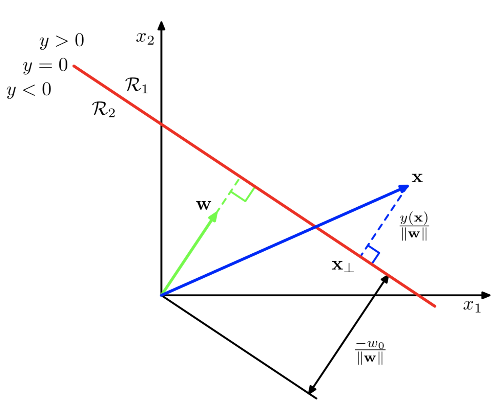
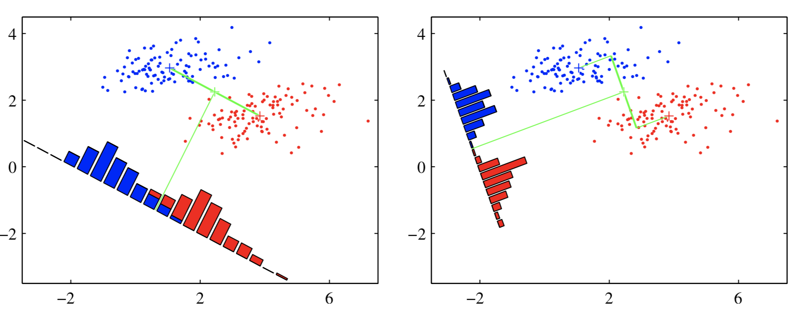

# Análisis de Discriminante Lineal 1

<style>
  .espacio {
    margin-bottom: 1cm;
  }
</style>
  
  <style>
  .espacio3 {
    margin-bottom: 3cm;
  }
</style>

<p class="espacio">
</p>

```{r message=FALSE, warning=FALSE}
library(tidyverse)
```

## Problemas de clasificación

En los problemas de clasificación deseamos predecir categorías de clase discretas, o más generalmente las probabilidades, que se encuentran entre 0 y 1. 

Para lograr predecir probabilidades, consideramos una generalización del modelo linea en el cual
transformamos la función lineal de $\beta$ usando una función no lineal $g^{-1}$ tal que
$$
y_i = g^{-1}(x_i^T\beta).
$$

A $g$ la conocemos como función liga. 

Para clasificar utilizamos las _superficies de decisión_ que corresponden a 
$$
y_i(\beta) = \mbox{constante},
$$
de modo que 
$$
x_i^T\beta = \mbox{constante}
$$
y, por lo tanto, las superficies de decisión son funciones lineales de $x$, incluso si la función $g$ no es lineal. Por esta razón, los modelos descritos se llaman modelos lineales generalizados.

## Funciones de discriminante

Definimos un discriminante (clasificador) lineal así:

$$
y_i = x_i^T\beta
$$
lo denotaremos por
$$
y(x) = w^T x+ w_0
$$
porque vemos $w_0$ como el umbral de tal forma que un vector de entrada $x$ se asigna a la clase 1 cuando $y(x)>0$ y a la clase 2 en otro caso.

<p class="espacio">
</p>

```{block2, type = "information"}
La _superficie de decisión_ está definida, por lo tanto, por la ecuación $y(x) = 0$, que corresponde a un hiperplano de $D-1$ dimensiones dentro del conjunto de entrada de $D$ dimensiones.
```

<br>

Consideremos dos puntos $x_A$ y $x_B$ en la superficie de decisión. 

Como
$$
y(x_A) = y(x_B) = 0, 
$$
entonces
$$
w^T(x_A −x_B) = 0.
$$
Por lo tanto, el vector $w$ es ortogonal a todo vector en la superficie de decisión, y así $w$ determina la orientación de la superficie.

Similarmente, si $x$ está en la superficie de decisión, entonces $y(x)=0$, y entonces, la distancia del origen a la superficie de decisión es:

$$
\dfrac{w^Tx}{\|{w}\|} = -\dfrac{w_0}{\|{w}\|}.
$$

```{r, echo = F, fig.align='center', dpi=300}

```

## Regresión lineal en una matriz indicadora

Supongamos que $Y$ es una matriz indicadora donde $Y_{ij}$ es $1$ si la $i$-ésima obsevación pertenece a la categoría $j$ y $0$ en otro caso.

$$
\hat{W} = (X^TX)^{−1}X^TY.
$$

Si $\tilde{x}$ es un vector de entradas, entonces 
$$
y(x) = \hat{W}^T\tilde{x}
$$

```{r message=FALSE, warning=FALSE}
library(tidyverse)
library(matlib)

set.seed(186923)
n <- 300

x1 <- c(rnorm(n/3,-5), rnorm(n/3, 0, 1.5), rnorm(n/3, 5))
x2 <- x1 + rnorm(n, sd = 2) + c(rep(-5, n/3), rep(0, n/3), rep(5, n/3))
y <- c(rep("a",n/3),rep("b",n/3),rep("c",n/3))
df <- data.frame(x1, x2, y)

Y <- matrix(nrow = n, ncol = 3)
Y[,1] <- c(rep(1,n/3),rep(0,2*n/3))
Y[,2] <- c(rep(0,n/3),rep(1,n/3),rep(0,n/3))
Y[,3] <- 1 - Y[,1] - Y[,2]
df$y1 <- Y[,1]
df$y2 <- Y[,2]
df$y3 <- Y[,3]

X <- as.matrix(df[,c(1,2)])
p <- X %*% inv(t(X) %*% X) %*% t(X) %*% Y
df$p1 <- p[,1]
df$p2 <- p[,2]
df$p3 <- p[,3]

ggplot(df, aes(x = x1, y = x2))+
  geom_point(aes(color = y)) +
  geom_line(aes(y = p1), color = 'red') +
  geom_line(aes(y = p2), color = 'green') +
  geom_line(aes(y = p3), color = 'blue')
```

Hay un problema serio con el enfoque de regresión cuando el número de clases $K \geq3$, y en especial si $K$ es grande. Debido a la naturaleza rígida del modelo de regresión, unas clases pueden enmascarar a otras. Esto lo vemos en la gráfica de arriba con $K = 3$. Las tres clases están perfectamente separadas por límites de decisión lineales, sin embargo, la regresión lineal pierde por completo a la clase de en medio.

```{r}
lm_1 <- lm(y1 ~ x1 + x2, data = df)
lm_2 <- lm(y2 ~ x1 + x2, data = df)
df$pred_1 <- predict(lm_1)
df$pred_2 <- predict(lm_2)
df$pred_3 <- 1 - df$pred_1 - df$pred_2
```

Obtenemos la predicción tomando el máximo de cada renglón:

```{r}
df$pred <- ifelse(df$pred_1 > df$pred_2 & df$pred_1 > df$pred_3, 'a', 
                  ifelse(df$pred_2 > df$pred_1 & df$pred_2 > df$pred_3, 'b', 'c'))
```

Podemos hacer una gráfica de las predicciones en este caso de $x_1$ contra los ajustados por el modelo lineal:

```{r}
ggplot(df, aes(x=x1, y = pred_1)) +
  geom_point(color = 'red') +
  geom_point(aes(x=x1, y = pred_2), color = 'green') +
  geom_point(aes(x=x1, y = pred_3), color = 'blue')
```

Comparamos contra los observados y calculamos el error:

```{r}
1 - mean(df$pred == df$y)
```

<br>


Si utilizamos un modelo lineal con términos cuadráticos entonces el ajuste lo haríamos de esta manera:

```{r}
lm_1_q <- lm(y1 ~ poly(x1 + x2, 2), data = df)
lm_2_q <- lm(y2 ~ poly(x1 + x2, 2), data = df)
lm_3_q <- lm(y3 ~ poly(x1 + x2, 2), data = df)
df$pred_1_q <- predict(lm_1_q)
df$pred_2_q <- predict(lm_2_q)
df$pred_3_q <- predict(lm_3_q)
```

Obtenemos nuevamente la predicción tomando el máximo de cada renglón:

```{r}
df$pred_q <- ifelse(df$pred_1_q > df$pred_2_q & df$pred_1_q > df$pred_3_q, 'a', 
                  ifelse(df$pred_2_q > df$pred_1_q & df$pred_2_q > df$pred_3_q, 'b', 'c'))
```

```{r}
ggplot(df, aes(x=x2, y = pred_1_q)) +
  geom_point(color = 'red') +
  geom_point(aes(x=x2, y = pred_2_q), color = 'green') +
  geom_point(aes(x=x2, y = pred_3_q), color = 'blue')
```

Comparamos contra los observados y calculamos el error:

```{r}
1 - mean(df$pred_q == df$y)
```

<br>

Repetimos una tercera vez pero ahora utilizando regresión logística:

```{r}
glm_1 <- glm(I(y=='a') ~ x1 + x2, family = binomial, data = df)
glm_2 <- glm(I(y=='b') ~ x1 + x2, family = binomial, data = df)
glm_3 <- glm(I(y=='c') ~ x1 + x2, family = binomial, data = df)
df$pred1_glm <- predict(glm_1, type = 'response')
df$pred2_glm <- predict(glm_2, type = 'response')
df$pred3_glm <- predict(glm_3, type = 'response')
```

Calculamos las predicciones de acuerdo a este modelo logístico:

```{r}
df$pred_glm <- ifelse(df$pred1_glm > df$pred2_glm & df$pred1_glm > df$pred3_glm, 'a', 
                  ifelse(df$pred2_glm > df$pred1_glm & df$pred2_glm > df$pred3_glm, 'b', 'c'))
```

Calculamos el error:

```{r}
1 - mean(df$pred_glm == df$y)
```

## Discriminante lineal de Fisher

Una forma de ver un modelo de clasificación lineal es en términos de _reducción de dimensionalidad_. Esto se refiere a la extracción de características de los datos que los transforma de un espacio de dimensión alta a un espacio de dimensión baja, usualmente $2$ ó $3$.

Consideremos primero el caso de dos clases, y supongamos que tomamos un vector de predictores de dimensión $D$ y lo proyectamos en una dimensión usando la misma función:
$$
y = w^Tx.
$$

Si colocamos un umbral y clasificamos como clase 1 si $y\geq-w_0$, y clase 2 en otro caso,  entonces obtenemos nuestro clasificador lineal estándar ya visto antes. En general, la proyección en una dimensión conduce a una pérdida considerable de información, y las clases que están bien separadas en el espacio original de dimensión $D$ pueden superponerse fuertemente en una dimensión.

Sin embargo, ajustando los componentes de $w$, podemos seleccionar una proyección que maximiza la separación entre clases. Para empezar, consideremos un problema de dos clases en el que hay $N_1$ puntos en la clase 1 y $N_2$ puntos en la clase 2, de modo que los vectores de medias de las dos clases están dados por
$$
m_1 = \dfrac{1}{N_1}\sum_{i\in C_1}x_i,\qquad m_2=\dfrac{1}{N_2}\sum_{i\in C_2}x_i.
$$

Podríamos elegir $w$ para maximizar la _separación entre clases_:
$$
w^T(m_2 − m_1)
$$

Sin embargo, esta expresión se puede hacer arbitrariamente grande simplemente aumentando la magnitud de $w$, entonces se utiliza la restricción
$$
\sum_i{w_i^2}=1
$$

Resolvemos usando multiplicadores de Lagrange. Vemos que $w$ es proporcional a $m_2 - m_1$.


Sin embargo, todavía hay un problema con este enfoque. Esto muestra 

```{r, echo = F, fig.align='center', dpi=350}

```

Las dos clases de arriba que están bien separadas en el espacio bidimensional original $(x_1, x_2)$ pero se sobrelapan considerablemente cuando se proyectan sobre la línea que une sus medios. 

Esta dificultad surge por las covarianzas de las distribuciones de clase no son diagonales. La idea propuesta por Fisher es maximizar una función que:

* separe las observaciones por las medios de clase proyectadas, y al mismo tiempo

* dé una variación pequeña dentro de cada clase.

La varianza _dentro_ de la clase de los datos transformados de la clase $C_k$ está dada por

$$
s_k = \sum_{i\in C_k}{(y_i - w^Tm_k)^2}.
$$
donde $y_i = w^Tx_i$.

Para el caso de $K=2$ clases, la varianza total dentro de las clases se define como $s_1^2 + s_2^2$. Se define una cantidad llamada "criterio de Fisher" $J(w)$ que se desea maximizar

$$
\begin{eqnarray*}
J(w) &=& \dfrac{m_2-m_1}{s_1^2+s_2^2} \\
&=& \dfrac{w^TS_Ww}{w^TS_Bw}
\end{eqnarray*}
$$
donde $S_B$ es la matriz de covarianzas _entre_ clases 
$$
S_B = (m_2 - m_1)(m_2-m_1)^T
$$
y $S_W$ es la matriz de covarianzas _dentro_ de las clases
$$
S_W = \sum_{i \in C_1}{(x_i - m_1)(x_i-m_1)^T} + \sum_{i \in C_2}{(x_i - m_2)(x_i-m_2)^T}.
$$

Buscamos maximizar $J(w)$ con respecto a $w$ para encontrar los pesos $w$ para el discriminador lineal $y(x)=w^Tx$. 

```{block2, type = "nota"}
**Notas:**
  
<p class="espacio3">
</p>
  
* Este se conoce como _discriminante lineal de Fisher_, aunque estrictamente no es un discriminante, sino más bien una elección de dirección específica para la proyección de los datos en una dimensión. 

* Sin embargo, los datos proyectados pueden usarse posteriormente para construir un discriminante, eligiendo un umbral $y_0$ para que clasifiquemos un nuevo punto como clase 1 si $y(x)\geq y_0$ y como clase 2 en caso contrario. 

* Podemos modelar las densidades condicionales de clase $p(y|C_k)$ usando distribuciones normales y estimar parámetros por máxima verosimilitud. El supuesto de normalidad se justifica por el teorema del límite central porque $y = w^Tx$ es una suma ponderada de variables aleatorias.
```

<br>

---

### Ejemplo: separación entre clases

Regresamos al ejemplo de arriba pero ahora hacemos el ajuste con discriminante lineal:

```{r message=FALSE, warning=FALSE}
library(MASS)
lda_1 <- lda(y ~ x1 + x2, data = df)
df$pred_lda <- predict(lda_1)$class
```

Vemos nuevamente el error:

```{r}
1 - mean(df$pred_lda == df$y)
```


### Ejemplo: iris de Fisher

El estadístico y biólogo británico Ronald Fisher publicó su artículo de 1936 "El uso de mediciones múltiples en problemas taxonómicos como un ejemplo de análisis discriminante lineal".

El conjunto de datos consiste de 50 observaciones de _cada_ una de las tres especies de Iris (Iris setosa, Iris virginica e Iris versicolor). Se midieron cuatro características de cada muestra: la longitud y el ancho de los sépalos y pétalos, en centímetros.

```{r}
iris %>% sample_n(10) %>% knitr::kable()
```


```{r}
ggplot(iris, aes(Sepal.Length, Sepal.Width, color = Species)) +
  geom_point(aes(shape = Species), size = 3)
```

```{r}
ggplot(iris, aes(Petal.Length, Petal.Width, color = Species)) +
  geom_point(aes(shape = Species), size = 3)
```

En resumen tenemos 4 variables y todas están relacionadas con la especie a la cual pertenece (hay 3 especies):

```{r message=FALSE, warning=FALSE, results='hide', out.width='100%'}
library(GGally)
ggpairs(iris, columns = 1:ncol(iris), title = "",  
  axisLabels = "show", columnLabels = colnames(iris))
```


```{r}
require(MASS)
iris.lda<-lda(Species ~ Sepal.Length + Sepal.Width + Petal.Length + Petal.Width, data =    iris)
datPred<-data.frame(Species=predict(iris.lda)$class,predict(iris.lda)$x) #create data.frame
```

Creamos las superficies de decisión y las probabilidades de clase:

```{r}
iris.lda2 <- lda(datPred[,2:3], datPred[,1])
x <- seq(min(datPred[,2]), max(datPred[,2]), length.out=30)
y <- seq(min(datPred[,3]), max(datPred[,3]), length.out=30)
Xcon <- matrix(c(rep(x,length(y)),rep(y, rep(length(x), length(y)))), ncol = 2)
iris.pr1 <- predict(iris.lda2, Xcon)$post[, c("setosa","versicolor")] %*% c(1,1)
iris.pr2 <- predict(iris.lda2, Xcon)$post[, c("virginica","setosa")] %*% c(1,1)
```

Graficamos las superficies (rectas) de decisión sobre los ajustados por el modelo por especie de flor:

```{r}
pr<-data.frame(x=rep(x, length(y)), y=rep(y, each=length(x)), 
    z1=as.vector(iris.pr1), z2=as.vector(iris.pr2))
ggplot(datPred, aes(x=LD1, y=LD2) ) + 
    geom_point(size = 3, aes(pch = Species,  col=Species)) + 
    geom_contour(data=pr, aes(x=x, y=y, z=z1), breaks=c(0,.5)) + 
    geom_contour(data=pr, aes(x=x, y=y, z=z2), breaks=c(0,.5))
```


## Tarea

1. Para comparar regresión lineal, análisis de discriminante lineal y regresión logística con dos clases utiliza el siguiente código para responder los incisos siguientes. Utiliza tu clave única como semilla.

```{r}
clave_unica <- 123456
set.seed(clave_unica)
n <- 300
x1 <- c(rnorm(n/3,-5), rnorm(n/3, 0, 1.5), rnorm(n/3, 5)) 
x2 <- -12*c(rep(0,n/2),rep(1,n/2)) + x1 + rnorm(n, sd = 2) + c(rep(-5, n/2), rep(0, n/2)) 
out <- sample((n/2):n, size = n/10)
x1[out] <- rnorm(n/10, 5, sd = 0.5) + 10
x2[out] <- -12 + x1[out] + rnorm(n/10, sd = 0.5) - 15

y <- c(rep('a', n/2), rep('b', n/2))
df <- data.frame(x1, x2, y)
ggplot(df, aes(x = x1, y = x2, color = y)) +
  geom_point()
```

a. Haz una gráfica de las superficies de decisión (rectas que separan las dos clases) utilizando el modelo simple de regresión lineal con predictores lineales. Calcula el error de predicción. 

b. ¿Habrá alguna diferencia entre el error utilizando regresión lineal con términos de polinomios cuadráticos y el error calculado en el inciso anterior?

c. Repite el inciso _a._ utilizando regresión logística. ¿Por qué la regresión logística es más consistente en la presencia de datos atípicos?

d. Repite el inciso _a._ utilizando análisis de discriminante lineal y compara con el error obtenido en los incisos anteriores.

2. Demuestra que, en regresión lineal, si cada vector objetivo $y_i$ satisface una restricción lineal
$$
a^T y_i + b = 0
$$
para algunas constantes $a$ y $b$, entonces la predicción del modelo para cualquier valor de $x$ satisface la misma restricción, de modo que
$$
a^T y(x) + b = 0.
$$
Por lo tanto, utilizando la codificación 1-a-K indicadoras para las $K$ clases, entonces las predicciones que produce el modelo tendrán la propiedad de que los elementos de $y(x)$ sumarán a 1 para cualquier valor de $x$. Aunque no necesariamente están en el intervalo $(0,1)$.

