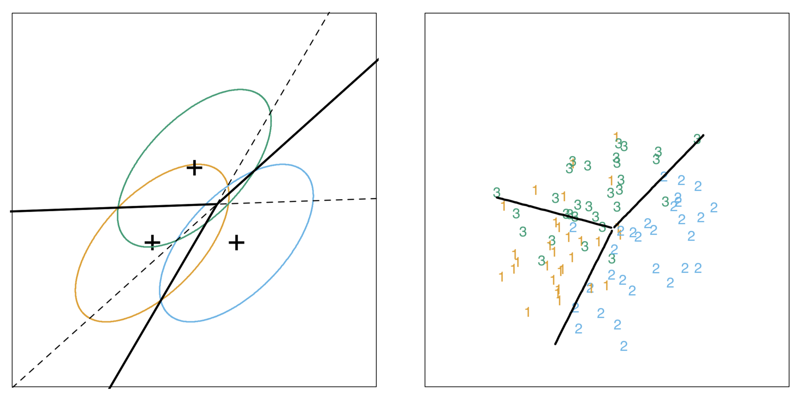

# Discriminante Lineal (LDA) 2

<style>
  .espacio {
    margin-bottom: 1cm;
  }
</style>
  
  <style>
  .espacio3 {
    margin-bottom: 3cm;
  }
</style>

<p class="espacio">
</p>

```{r message=FALSE, warning=FALSE}
library(tidyverse)
```

## Aplicaciones

El análisis discriminante lineal (LDA) de Fisher es un método utilizado en estadística, reconocimiento de patrones y aprendizaje estadístico para encontrar una combinación lineal de variables que caracteriza o separa dos o más clases de objetos o eventos.

La combinación lineal resultante se puede utilizar como un clasificador lineal o, más comúnmente, para la reducción de dimensionalidad antes de usar otro método de clasificación.

El análisis de discriminante lineal tiene entre sus posibles aplicaciones:

1. Predicción de bancarrota: la predicción de bancarrota se basa en datos de en indicadores contables y otras variables financieras. El análisis discriminante lineal fue el primer método estadístico aplicado para explicar sistemáticamente qué empresas entraron en bancarrota vs. cuáles sobrevivieron.

2. Marketing: el análisis discriminante solía utilizarse para determinar los factores que distinguen diferentes tipos de clientes y/o productos utilizando datos provenientes de encuestas u otras fuentes de datos.

3. Estudios biomédicos: la principal aplicación del análisis discriminante en medicina es la evaluación del estado de gravedad de un paciente y el pronóstico del desenlace de la enfermedad. Por ejemplo, en un análisis retrospectivo, los pacientes se dividen en grupos según la gravedad de la enfermedad: leve, moderada y grave. Luego, se estudian los resultados de los análisis clínicos y de laboratorio para ver qué variables son toman valores diferentes entre los grupos estudiados. Usando estas variables, se construyen funciones discriminantes que ayudan a clasificar objetivamente la enfermedad en un futuro paciente en leve, moderada o severa.

El análisis de discriminante lineal también se conoce como "análisis discriminante canónico", o simplemente "análisis discriminante".

## Ejemplo: vinos

Tenemos 13 concentraciones químicas que describen muestras de vino de tres cultivares.

```{r message=FALSE, warning=FALSE}
wine <- read_csv("datos/wine.csv")
wine %>% head %>% knitr::kable()
```


```{r message=FALSE, warning=FALSE, results='hide', out.width='100%'}
library(GGally)
ggpairs(wine[2:6], columns = 1:5, title = "",  
  axisLabels = "show", columnLabels = colnames(wine[2:6]))
```

El propósito del análisis de discriminante lineal (LDA) en este ejemplo es encontrar las combinaciones lineales de las variables originales (las 13 concentraciones químicas) que proporcionen _la mejor separación_ posible entre los grupos (variedades de vino) en nuestro conjunto de datos. 

Supongamos entonces que queremos separar los vinos por cultivar. Los vinos provienen de tres cultivares diferentes, por lo que el número de clases es $K = 3$ y el número de variables predictoras es 13 (concentraciones de 13 componentes químicos, $p = 13$). 

El número máximo de funciones discriminantes útiles que pueden separar los vinos por cultivar es el mínimo entre $K-1$ y $p$, por lo que en este caso es el número de superficies de decisión es 2. 

Por lo tanto, podemos encontrar como máximo 2 funciones discriminantes útiles para separar los vinos por cultivar, utilizando las 13 variables de concentraciones químicas.

Ajustamos el modelo de discriminante lineal:

```{r message=FALSE, warning=FALSE}
library(MASS)
wine_lda <- lda(Type ~ ., data = wine)
```

Para obtener los valores de los pesos de las funciones discriminantes, podemos escribir:

```{r}
wine_lda
```

Esto significa que la primera función discriminante es una combinación lineal de las variables: 
$$
-0.403 \cdot \mbox{Alcohol} + 0.165 \cdot \mbox{Malic} \;+\cdots+\; -0.003 \cdot \mbox{Proline}. 
$$

Por conveniencia, el valor de cada función discriminante (por ejemplo, la primera función discriminante) se escala de modo que su media sea cero y su varianza sea uno.

La "proporción de traza" que se imprime al final es una medida de la separación porcentual lograda por cada función discriminante. Por ejemplo, para estos datos de vinos obtenemos los mismos valores que acabamos de calcular (68.75% y 31.25%).

Una buena forma de mostrar los resultados de un análisis de discriminante lineal es hacer un histograma apilado de los valores de la función discriminante para las diferentes clases.

Podemos hacer esto usando la función `ldahist()`. Por ejemplo, para hacer un histograma apilado de los valores de la primera función discriminante:

```{r, out.width='100%'}
wine_pred <- predict(wine_lda)
ldahist(data = wine_pred$x[,1], g=wine$Type)
```

Por lo tanto, investigamos si la segunda función discriminante separa esos cultivares, al hacer un histograma apilado de los valores de la segunda función discriminante:

```{r, out.width='100%'}
ldahist(data = wine_pred$x[,2], g=wine$Type)
```

Concluimos que la segunda función discriminante distingue los vinos del Tipo 2 de los vinos de Tipo 1 y 3.

Podemos obtener un diagrama de dispersión de las funciones discriminantes, etiquetando los puntos por clase:

```{r}
wine$LD1 <- wine_pred$x[,1]
wine$LD2 <- wine_pred$x[,2]
wine$Type <- as.factor(wine$Type)
ggplot(wine, aes(x = LD1, y = LD2, color = Type, pch = Type)) +
  geom_point()
``` 

<p class="espacio">
</p>

Notas:

* En el diagrama de dispersión de las dos primeras funciones discriminantes, podemos ver que los vinos de los tres cultivares están bien separados. 

* La primera función discriminante (eje x) separa muy bien los cultivares 1 y 3, pero no separa perfectamente los cultivares 1 y 3, ni los cultivares 2 y 3.

* La segunda función discriminante (eje y) logra una separación bastante buena de los cultivares 1 y 3, y los cultivares 2 y 3, aunque no es totalmente perfecto.

* Para lograr una muy buena separación de los tres cultivares, sería mejor usar juntas la primera y la segunda función discriminante, ya que la primera función discriminante puede separar los cultivares 1 y 3 muy bien, y la segunda función discriminante puede separar los cultivares 1 y 2, y los cultivares 2 y 3, razonablemente bien.


## Ejemplo: admisiones al MBA

Se tienen datos de admisión para los solicitantes a las escuelas de posgrado en administración de negocios. El objetivo es usar los puntajes de GPA y GMAT para predecir la probabilidad de admisión (admitido, no admitido y en el límite).

```{r}
url <- 'http://www.biz.uiowa.edu/faculty/jledolter/DataMining/admission.csv'
mba <- read_csv(url)
mba %>% sample_n(10) %>% knitr::kable()
```

Primero veamos un diagrama de dispersión de los datos:

```{r}
ggplot(mba, aes(x=GPA, y = GMAT, color = De)) +
  geom_point()
```


Comencemos haciendo el análisis de discriminante lineal, observemos que en este caso tenemos 3 clases:

```{r}
m1 <- lda(De ~ ., mba)
m1
```

Para analizar podemos hacer una predicción para una nueva observación en específico:

```{r}
predict(m1, newdata = data.frame(GPA = 3.21, GMAT = 497))
```

La predicción es muy ambigua. La razón es que con una sola función de discriminante no es posible separar los datos. La razón es que no se cumple el supuesto

$$
\Sigma_k = \Sigma\quad \mbox{para toda } k.
$$

Usamos análisis discriminante cuadrático:

```{r}
m2 <- qda(De ~ ., mba)
m2
```

Repetimos la predicción para el mismo punto:

```{r}
predict(m2, newdata = data.frame(GPA = 3.21, GMAT = 497))
```

¿Qué modelo es el mejor? Para responder a esta pregunta, evaluamos el análisis de discriminante lineal seleccionando aleatoriamente 60 de 85 estudiantes, estimando los parámetros en los datos y clasificando a los 25 estudiantes restantes de la muestra retenida. 

Repetimos esto 100 veces primero con LDA:

```{r}
n <- 85
nt <- 60
neval <- n - nt
rep <- 100

set.seed(123456)
calcula_error <- function(i){
  muestra <- sample(1:n, nt)
  m1 <- lda(De ~ ., mba[muestra,])
  tablin <- table(mba$De[-muestra],predict(m1,mba[-muestra,])$class)
  return((neval-sum(diag(tablin)))/neval)
}

merrlin <- map_dbl(.x = 1:rep, .f = calcula_error)
mean(merrlin)
```

Ahora con QDA:

```{r}
calcula_error_Q <- function(i){
  muestra <- sample(1:n, nt)
  m1 <- qda(De ~ ., mba[muestra,])
  tablin <- table(mba$De[-muestra],predict(m1,mba[-muestra,])$class)
  return((neval-sum(diag(tablin)))/neval)
}

qerrlin <- map_dbl(.x = 1:rep, .f = calcula_error_Q)
mean(qerrlin)
```


Logramos una tasa de clasificación errónea del 9% en LDA y aproximadamente del 6% en QDA. En este caso ambos métodos funcionan bien porque las dimensiones del problema son más menores: $p$, $n$, y $K$ chicas. 


R también nos da algunas herramientas de visualización. Por ejemplo el paquete `klaR`:

```{r}
library(klaR)
mba$De <- as.factor(mba$De)
partimat(formula = De ~ GMAT + GPA, data = mba, method = "lda") 
```

```{r}
partimat(formula = De ~ GMAT + GPA, data = mba, method = "qda") 
```

## Repaso 

Se tienen datos $x_1, x_2, \ldots, x_n \in \mathbb{R}^p$ y $y_1,\ldots,y_n\in \{1,2,\ldots,K\}$ donde

$$
\begin{eqnarray*}
n &=& \mbox{# observaciones} \\
p &=& \mbox{# de covariables o predictores} \\
k &=& \mbox{# clases que dividen a todos los datos.}
\end{eqnarray*}
$$

Definimos

$$
m_k = \dfrac{1}{N_k}\sum_{i\in C_k}x_i
$$
donde $N_k=\mbox{# de observaciones de la }k\mbox{-ésima clase y}C_k\mbox{ es el conjunto de índices de las observaciones de la }k\mbox{-ésima clase.}

Una medida de la variabilidad dentro de cada clase es

$$
s_k^2 = \sum_{i\in C_k}{(y_i - w^T x_i)^2}
$$
porque el modelo está determinado por la ecuación $y(x)=w^Tx$.

### Caso $k=2$ {-}

El vector $w$ lo interpretamos como el vector de pesos que determinan el discriminante lineal.

La clasificación subsecuente se hace de tal forma que si $y(x)>y_0$ se clasifica a la observación como perteneciente a la clase 1 y en otro caso a la clase 2.


Definimos el criterio de Fisher como

$$
J(w)  = \dfrac{w^T(m_2 - m_1)}{s_1^2 + s_2^2}.
$$

Buscamos 
$$
\begin{eqnarray*}
\mbox{max} && J(w) \\
\mbox{s.a.} &\;& \| w \| = 1.
\end{eqnarray*}
$$

**Idea:** En general, necesitamos encontrar la dirección de $w$ y pensar en que luego es posible normalizar.

Definimos las matrices

$$
S_W = \sum_{i\in C_k}(x_i - m_1)(x_i-m_1)^T + \sum_{i\in C_k}(x_i - m_2)(x_i - m_2)^T
$$
y

$$
S_B = (m_2 - m_1)(m_2 - m_1)^T
$$

Se puede ver que

$$
J(w) = \dfrac{w^T S_B w}{w^T S_W w}.
$$

<p class="espacio">
</p>

```{block2, type = "information"}
Si $x$ es un vector y $A$ es una matriz, entonces el gradiente de una forma cuadrática
$$
\dfrac{1}{2}x^T A x + b^T x + c
$$
es
$$
Ax + b.
$$
```

<br>

<br>

Por lo tanto,

$$
\nabla J(w) = w^T S_B w \cdot \nabla_w(w^T S_W w) - w^T S_W w \cdot \nabla_w(w^T S_B w),
$$
por lo que $J(w)$ se maximiza cuando

$$
\begin{eqnarray*}
(w^T S_B w) S_W w &=& (w^T S_W w)S_B w \\
S_W w&=& \left(\dfrac{w^T S_W w}{w^T S_B w}\right) S_B w \\
&=& \dfrac{w^T S_W w}{w^T S_B w} (m_2-m_1)(m_2 - m_1)^T w\\
&=& \left\{\left(\dfrac{w^T S_W w}{w^T S_B w}\right)(m_2 - m_1)^T w\right\}(m_2-m_1).
\end{eqnarray*}
$$

Por lo tanto, $w$ es tal que

$$
w = c \cdot S_W ^{-1}(m_2 - m_1)
$$
donde $c$ es una constante tal que $\|w\|_2^2=1$.

## Supuestos probabilísticos

Definimos como $\pi_k$ la probabilidad inicial de la pertenencia a la clase $k$, es decir,

$$
\pi_k = P(y_i = k).
$$

En la literatura las $\pi_i$'s se conocen como _probabilidades a priori_. Además podemos definir una dsitribución de probabilidad para $x$ para cada clase $k$

$$
f_k(x) = P(x|k).
$$

Por el teorema de Bayes

$$
p(k|x) = \dfrac{f_k(x)\pi_k}{\sum_{l=1}^K f_l(x)\pi_l}.
$$

A las probabilidades finales de cada clase $k$ dada una observación $x$ se les conoce comúnmente como _probabilidades posteriores_.

En el análisis de discriminante lineal suponemos que $p(x|k)$ es la densidad normal

$$
f_k(x) = \dfrac{1}{(2\pi)^{p/2}|\Sigma_k|^{1/2}}\exp\left(-\dfrac{1}{2}(x-\mu_k)^T\Sigma_k ^{-1} (x-\mu_k)\right).
$$

En LDA suponemos que $\Sigma_k = \Sigma$ para toda $k$. A este supuesto le llamamos _supuesto de homogeneidad_.

Para comparar la pertenencia de clases podemos ver el logaritmo del cociente entre las clases $k$ y $l$:

$$
\begin{eqnarray*}
\log\dfrac{p(k|x)}{p(j|x)} &=& \log\dfrac{f_k(x)}{f_l(x)} + \log\left(\dfrac{\pi_k}{\pi_l}\right)\\
&=& \log\left(\dfrac{\pi_k}{\pi_l}\right) -\dfrac{1}{2}(\mu_k - \mu_l)^T\Sigma^{-1}(\mu_k - \mu_l) + x^T\Sigma^{-1}(\mu_k - \mu_l).
\end{eqnarray*}
$$

Ésta es una ecuación lineal en $x$. Esto implica que la superficie de decisión (que separa a las clases) es un hiperplano de dimensión $p$.

Si dividimos $\mathbb{R}^p$ entre regiones que separan las clases $1,2,\ldots,K$, estas regiones están determinadas por hiperplanos. 

```{r, echo = F, fig.align='center', dpi=400}

```

<br>
<br>

Definimos las funciones de discriminante lineal como

$$
f_k(x) = x^T \Sigma ^{-1} \mu_k -\dfrac{1}{2}\mu_k^T \Sigma^{-1}\mu_k + \log(\pi_k).
$$

Estos los estimamos por máxima verosimilitud y es equivalente a la vista antes

$$
\hat{\pi}_k= \dfrac{N_k{}}N
$$

$$
\hat{\mu}_k = \dfrac{1}{N_k}\sum_{i\in C_k}x_i
$$

$$
\hat{\Sigma} = \dfrac{1}{N-K} \sum_{k=1}^{K}\sum_{i\in C_k}(x_i-\hat{\mu}_k)(x_i-\hat{\mu}_k)^T
$$


Si $\Sigma_k$ no es igual a $\Sigma$ para todas las clases entonces definimos las _funciones de discriminante cuadráticas_ (QDA) como

$$
f_k(x) = -\dfrac{1}{2}\log|\Sigma_k| - \dfrac{1}{2}(x-\mu_k)^T\Sigma_k^{-1}(x-\mu_k) + \log(\pi_k).
$$

Las superficies de decisión son ecuaciones cuadráticas en $\mathbb{R}^p$.

```{block2, type = "nota"}
**Nota**
  
<p class="espacio3">
</p>
  
1. Las estimaciones se hacen de manera similar que para LDA excepto que en este caso se deben estimar todas las $\Sigma_k$`s por separado.

2. El número de parámetros puede aumentar sustancialmente.

```

## Relación con mínimos cuadrados

Vimos cómo utilizar regresión lineal para encontrar regiones de discriminante lineal. Codificamos $Y$ de la siguiente forma:

$$
y_i=(0,\ldots,0,N/N_1,0,\ldots,0)
$$

donde la posición distinta de $0$ es la $i$-ésima posición correspondiente a la observación cuando está en la clase 1, y cuando está en la clase 2 es

$$
y_i=(0,\ldots,0,-N/N_2,0,\ldots,0).
$$

El error como suma de cuadrados es:

$$
\dfrac{1}{2}\sum_{i=1}^n{(w^Tx_i+w_0-y_i)^2}.
$$

Derivando con respecto a $w_0$ y $w$ obtenemos:

$$
\begin{eqnarray*}
\sum_{i=1}^n{(w^Tx_i+w_0-y_i)} &=& 0\\
\sum_{i=1}^n{(w^Tx_i+w_0-y_i)\cdot x_i} &=& 0
\end{eqnarray*}
$$

Sustituyendo las $y_i$`s obtenemos que

$$
w_0 = -w^Tm
$$

donde

$$
\sum_{i=1}^n{y_i} = N_1\dfrac{N}{N_1} - N_2\dfrac{N}{N_2},
$$

y $m$ es la media del conjunto de datos y está dado por

$$
m = \dfrac{1}{N}\sum_{i=1}^N x_i = \dfrac{1}{N}(N_1 m_1 + N_2 m_2).
$$

Se puede demostrar (tarea) que:

$$
\left(S_W + \dfrac{N_1N_2}{N}S_B\right)w=N(m_1 - m_2).
$$

Notemos que $S_B w$ está en la dirección de $m_2-m_1$ porque

$$
S_B = (m_2 - m_1)(m_2 - m_1)^T,
$$

y entonces $w$ es proporcional a $S_W^{-1}(m_2 - m_1)$.

Por lo tanto, el resultado obtenido por mínimos cuadrados es equivalente a la dirección de discriminante lineal, ignorando factores escalares que no son relevantes. Por lo tanto, el vector de pesos coincide con el encontrado mediante el criterio de Fisher.

El umbral $w_0$ es tal que si $y(x) = w^T(x-m)> 0$, entonces se clasifica en la clase 1, y en otro caso, se clasifica en la clase 2.

```{block2, type = "information"}
**Nota:** La extensión para múltiples clases es análoga a lo que ya hemos visto.
```

<br>

## Tarea 

Utilizando las definiciones de las matrices de covarianza _intraclase_ $S_W$ e _interclase_ $S_B$ y que 

$$
w_0 = -w^tm,
$$
donde
$$
m = \dfrac{1}{N}\sum_{i=1}^N x_i = \dfrac{1}{N}(N_1 m_1 + N_2 m_2),
$$
demuestra que

$$
\sum_{i=1}^n{(w^Tx_i+w_0-y_i)\cdot x_i}= 0
$$

se puede escribir de la forma

$$
\left(S_W + \dfrac{N_1N_2}{N}S_B\right)w=N(m_1 - m_2).
$$
