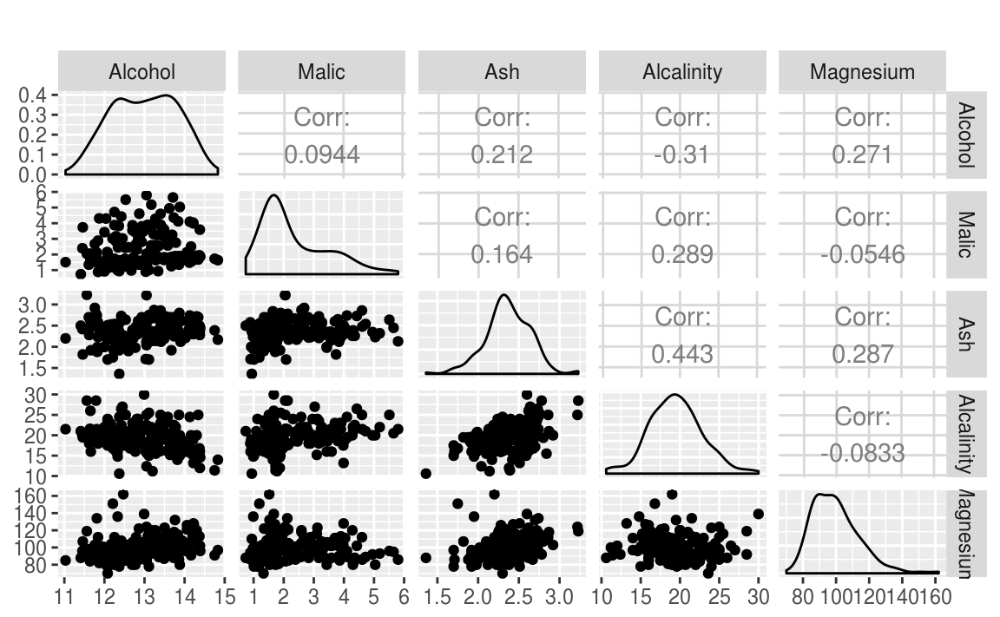
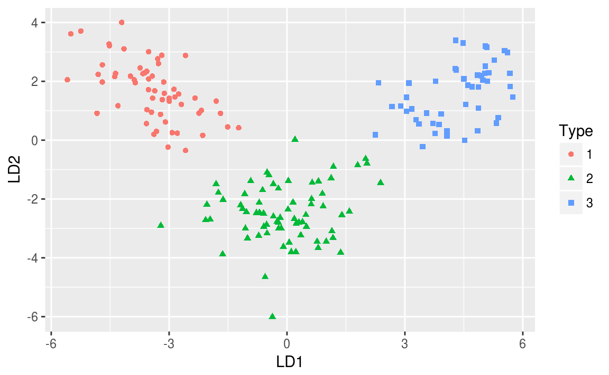
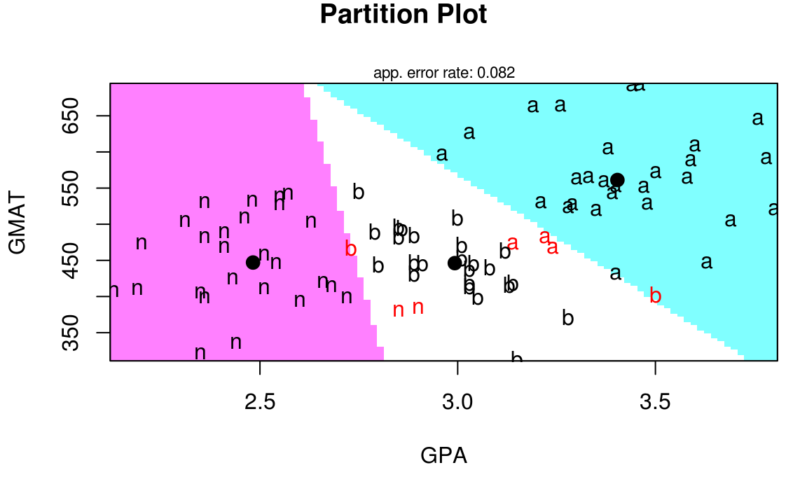
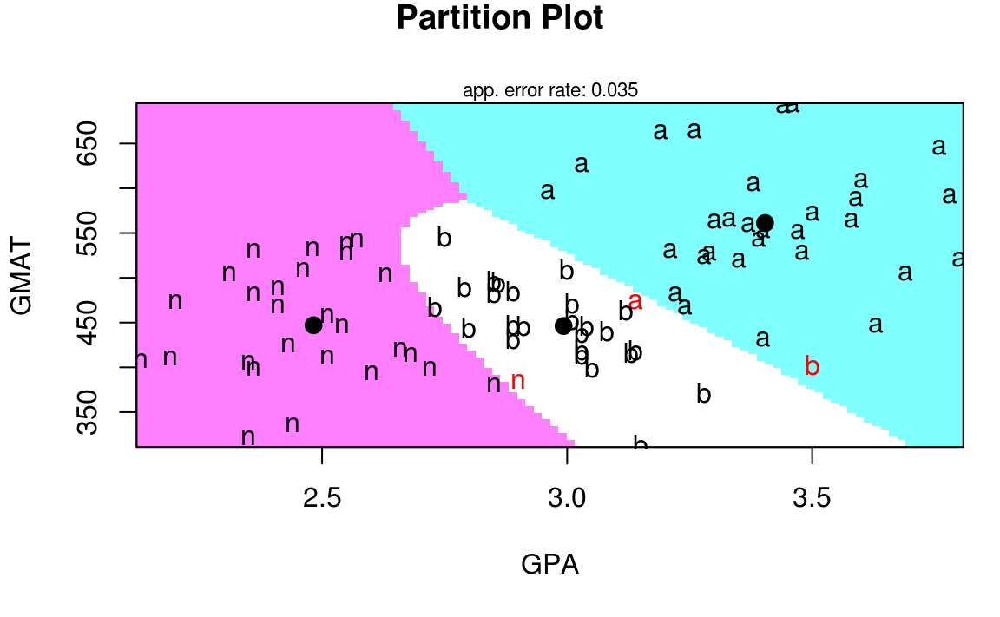

# Análisis de Discriminante Lineal 2

<style>
  .espacio {
    margin-bottom: 1cm;
  }
</style>
  
  <style>
  .espacio3 {
    margin-bottom: 3cm;
  }
</style>

<p class="espacio">
</p>


```r
library(tidyverse)
```

## Aplicaciones

El análisis discriminante lineal (LDA) de Fisher es un método utilizado en estadística, reconocimiento de patrones y aprendizaje estadístico para encontrar una combinación lineal de variables que caracteriza o separa dos o más clases de objetos o eventos.

La combinación lineal resultante se puede utilizar como un clasificador lineal o, más comúnmente, para la reducción de dimensionalidad antes de usar otro método de clasificación.

El análisis de discriminante lineal tiene entre sus posibles aplicaciones:

1. Predicción de bancarrota: la predicción de bancarrota se basa en datos de en indicadores contables y otras variables financieras. El análisis discriminante lineal fue el primer método estadístico aplicado para explicar sistemáticamente qué empresas entraron en bancarrota vs. cuáles sobrevivieron.

2. Marketing: el análisis discriminante solía utilizarse para determinar los factores que distinguen diferentes tipos de clientes y/o productos utilizando datos provenientes de encuestas u otras fuentes de datos.

3. Estudios biomédicos: la principal aplicación del análisis discriminante en medicina es la evaluación del estado de gravedad de un paciente y el pronóstico del desenlace de la enfermedad. Por ejemplo, en un análisis retrospectivo, los pacientes se dividen en grupos según la gravedad de la enfermedad: leve, moderada y grave. Luego, se estudian los resultados de los análisis clínicos y de laboratorio para ver qué variables son toman valores diferentes entre los grupos estudiados. Usando estas variables, se construyen funciones discriminantes que ayudan a clasificar objetivamente la enfermedad en un futuro paciente en leve, moderada o severa.

El análisis de discriminante lineal también se conoce como "análisis discriminante canónico", o simplemente "análisis discriminante".

## Ejemplo: vinos

Tenemos 13 concentraciones químicas que describen muestras de vino de tres cultivares.


```r
wine <- read_csv("datos/wine.csv")
wine %>% head %>% knitr::kable()
```


 Type   Alcohol   Malic    Ash   Alcalinity   Magnesium   Phenols   Flavanoids   Nonflavanoids   Proanthocyanins   Color    Hue   Dilution   Proline
-----  --------  ------  -----  -----------  ----------  --------  -----------  --------------  ----------------  ------  -----  ---------  --------
    1      14.2    1.71   2.43         15.6         127      2.80         3.06            0.28              2.29    5.64   1.04       3.92      1065
    1      13.2    1.78   2.14         11.2         100      2.65         2.76            0.26              1.28    4.38   1.05       3.40      1050
    1      13.2    2.36   2.67         18.6         101      2.80         3.24            0.30              2.81    5.68   1.03       3.17      1185
    1      14.4    1.95   2.50         16.8         113      3.85         3.49            0.24              2.18    7.80   0.86       3.45      1480
    1      13.2    2.59   2.87         21.0         118      2.80         2.69            0.39              1.82    4.32   1.04       2.93       735
    1      14.2    1.76   2.45         15.2         112      3.27         3.39            0.34              1.97    6.75   1.05       2.85      1450


```r
library(GGally)
ggpairs(wine[2:6], columns = 1:5, title = "",  
  axisLabels = "show", columnLabels = colnames(wine[2:6]))
```



El propósito del análisis de discriminante lineal (LDA) en este ejemplo es encontrar las combinaciones lineales de las variables originales (las 13 concentraciones químicas) que proporcionen _la mejor separación_ posible entre los grupos (variedades de vino) en nuestro conjunto de datos. 

Supongamos entonces que queremos separar los vinos por cultivar. Los vinos provienen de tres cultivares diferentes, por lo que el número de clases es $K = 3$ y el número de variables predictoras es 13 (concentraciones de 13 componentes químicos, $p = 13$). 

El número máximo de funciones discriminantes útiles que pueden separar los vinos por cultivar es el mínimo entre $K-1$ y $p$, por lo que en este caso es el número de superficies de decisión es 2. 

Por lo tanto, podemos encontrar como máximo 2 funciones discriminantes útiles para separar los vinos por cultivar, utilizando las 13 variables de concentraciones químicas.

Ajustamos el modelo de discriminante lineal:


```r
library(MASS)
wine_lda <- lda(Type ~ ., data = wine)
```

Para obtener los valores de los pesos de las funciones discriminantes, podemos escribir:


```r
wine_lda
#> Call:
#> lda(Type ~ ., data = wine)
#> 
#> Prior probabilities of groups:
#>     1     2     3 
#> 0.331 0.399 0.270 
#> 
#> Group means:
#>   Alcohol Malic  Ash Alcalinity Magnesium Phenols Flavanoids Nonflavanoids
#> 1    13.7  2.01 2.46       17.0     106.3    2.84      2.982         0.290
#> 2    12.3  1.93 2.24       20.2      94.5    2.26      2.081         0.364
#> 3    13.2  3.33 2.44       21.4      99.3    1.68      0.781         0.448
#>   Proanthocyanins Color   Hue Dilution Proline
#> 1            1.90  5.53 1.062     3.16    1116
#> 2            1.63  3.09 1.056     2.79     520
#> 3            1.15  7.40 0.683     1.68     630
#> 
#> Coefficients of linear discriminants:
#>                      LD1       LD2
#> Alcohol         -0.40340  0.871793
#> Malic            0.16525  0.305380
#> Ash             -0.36908  2.345850
#> Alcalinity       0.15480 -0.146381
#> Magnesium       -0.00216 -0.000463
#> Phenols          0.61805 -0.032213
#> Flavanoids      -1.66119 -0.491998
#> Nonflavanoids   -1.49582 -1.630954
#> Proanthocyanins  0.13409 -0.307088
#> Color            0.35506  0.253231
#> Hue             -0.81804 -1.515634
#> Dilution        -1.15756  0.051184
#> Proline         -0.00269  0.002853
#> 
#> Proportion of trace:
#>   LD1   LD2 
#> 0.688 0.312
```

Esto significa que la primera función discriminante es una combinación lineal de las variables: 
$$
-0.403 \cdot \mbox{Alcohol} + 0.165 \cdot \mbox{Malic} \;+\cdots+\; -0.003 \cdot \mbox{Proline}. 
$$

Por conveniencia, el valor de cada función discriminante (por ejemplo, la primera función discriminante) se escala de modo que su media sea cero y su varianza sea uno.

La "proporción de traza" que se imprime al final es una medida de la separación porcentual lograda por cada función discriminante. Por ejemplo, para estos datos de vinos obtenemos los mismos valores que acabamos de calcular (68.75% y 31.25%).

Una buena forma de mostrar los resultados de un análisis de discriminante lineal es hacer un histograma apilado de los valores de la función discriminante para las diferentes clases.

Podemos hacer esto usando la función `ldahist()`. Por ejemplo, para hacer un histograma apilado de los valores de la primera función discriminante:


```r
wine_pred <- predict(wine_lda)
ldahist(data = wine_pred$x[,1], g=wine$Type)
```


Por lo tanto, investigamos si la segunda función discriminante separa esos cultivares, al hacer un histograma apilado de los valores de la segunda función discriminante:


```r
ldahist(data = wine_pred$x[,2], g=wine$Type)
```


Concluimos que la segunda función discriminante distingue los vinos del Tipo 2 de los vinos de Tipo 1 y 3.

Podemos obtener un diagrama de dispersión de las funciones discriminantes, etiquetando los puntos por clase:


```r
wine$LD1 <- wine_pred$x[,1]
wine$LD2 <- wine_pred$x[,2]
wine$Type <- as.factor(wine$Type)
ggplot(wine, aes(x = LD1, y = LD2, color = Type, pch = Type)) +
  geom_point()
```



<p class="espacio">
</p>

Notas:

* En el diagrama de dispersión de las dos primeras funciones discriminantes, podemos ver que los vinos de los tres cultivares están bien separados. 

* La primera función discriminante (eje x) separa muy bien los cultivares 1 y 3, pero no separa perfectamente los cultivares 1 y 3, ni los cultivares 2 y 3.

* La segunda función discriminante (eje y) logra una separación bastante buena de los cultivares 1 y 3, y los cultivares 2 y 3, aunque no es totalmente perfecto.

* Para lograr una muy buena separación de los tres cultivares, sería mejor usar juntas la primera y la segunda función discriminante, ya que la primera función discriminante puede separar los cultivares 1 y 3 muy bien, y la segunda función discriminante puede separar los cultivares 1 y 2, y los cultivares 2 y 3, razonablemente bien.


# Ejemplo: admisiones al MBA

Se tienen datos de admisión para los solicitantes a las escuelas de posgrado en administración de negocios. El objetivo es usar los puntajes de GPA y GMAT para predecir la probabilidad de admisión (admitido, no admitido y en el límite).


```r
url <- 'http://www.biz.uiowa.edu/faculty/jledolter/DataMining/admission.csv'
mba <- read_csv(url)
#> Parsed with column specification:
#> cols(
#>   GPA = col_double(),
#>   GMAT = col_integer(),
#>   De = col_character()
#> )
mba %>% sample_n(10) %>% knitr::kable()
```


  GPA   GMAT  De       
-----  -----  ---------
 3.26    664  admit    
 2.35    321  notadmit 
 2.36    399  notadmit 
 2.57    542  notadmit 
 2.85    381  notadmit 
 3.12    463  border   
 3.44    692  admit    
 3.47    552  admit    
 2.19    411  notadmit 
 2.51    412  notadmit 

Primero veamos un diagrama de dispersión de los datos:


```r
ggplot(mba, aes(x=GPA, y = GMAT, color = De)) +
  geom_point()
```


Comencemos haciendo el análisis de discriminante lineal, observemos que en este caso tenemos 3 clases:


```r
m1 <- lda(De ~ ., mba)
m1
#> Call:
#> lda(De ~ ., data = mba)
#> 
#> Prior probabilities of groups:
#>    admit   border notadmit 
#>    0.365    0.306    0.329 
#> 
#> Group means:
#>           GPA GMAT
#> admit    3.40  561
#> border   2.99  446
#> notadmit 2.48  447
#> 
#> Coefficients of linear discriminants:
#>          LD1     LD2
#> GPA  5.00877  1.8767
#> GMAT 0.00857 -0.0145
#> 
#> Proportion of trace:
#>    LD1    LD2 
#> 0.9673 0.0327
```

Para analizar podemos hacer una predicción para una nueva observación en específico:


```r
predict(m1, newdata = data.frame(GPA = 3.21, GMAT = 497))
#> $class
#> [1] admit
#> Levels: admit border notadmit
#> 
#> $posterior
#>   admit border notadmit
#> 1 0.518  0.482 0.000356
#> 
#> $x
#>    LD1   LD2
#> 1 1.25 0.318
```

La predicción es muy ambigua. La razón es que con una sola función de discriminante no es posible separar los datos. La razón es que no se cumple el supuesto

$$
\Sigma_k = \Sigma\quad \mbox{para toda } k.
$$

Usamos análisis discriminante cuadrático:


```r
m2 <- qda(De ~ ., mba)
m2
#> Call:
#> qda(De ~ ., data = mba)
#> 
#> Prior probabilities of groups:
#>    admit   border notadmit 
#>    0.365    0.306    0.329 
#> 
#> Group means:
#>           GPA GMAT
#> admit    3.40  561
#> border   2.99  446
#> notadmit 2.48  447
```

Repetimos la predicción para el mismo punto:


```r
predict(m2, newdata = data.frame(GPA = 3.21, GMAT = 497))
#> $class
#> [1] admit
#> Levels: admit border notadmit
#> 
#> $posterior
#>   admit border notadmit
#> 1 0.923 0.0769 0.000454
```

¿Qué modelo es el mejor? Para responder a esta pregunta, evaluamos el análisis de discriminante lineal seleccionando aleatoriamente 60 de 85 estudiantes, estimando los parámetros en los datos y clasificando a los 25 estudiantes restantes de la muestra retenida. 

Repetimos esto 100 veces primero con LDA:


```r
n <- 85
nt <- 60
neval <- n - nt
rep <- 100

set.seed(123456)
calcula_error <- function(i){
  muestra <- sample(1:n, nt)
  m1 <- lda(De ~ ., mba[muestra,])
  tablin <- table(mba$De[-muestra],predict(m1,mba[-muestra,])$class)
  return((neval-sum(diag(tablin)))/neval)
}

merrlin <- map_dbl(.x = 1:rep, .f = calcula_error)
mean(merrlin)
#> [1] 0.0964
```

Ahora con QDA:


```r
calcula_error_Q <- function(i){
  muestra <- sample(1:n, nt)
  m1 <- qda(De ~ ., mba[muestra,])
  tablin <- table(mba$De[-muestra],predict(m1,mba[-muestra,])$class)
  return((neval-sum(diag(tablin)))/neval)
}

qerrlin <- map_dbl(.x = 1:rep, .f = calcula_error_Q)
mean(qerrlin)
#> [1] 0.0588
```


Logramos una tasa de clasificación errónea del 9% en LDA y aproximadamente del 6% en QDA. En este caso ambos métodos funcionan bien porque las dimensiones del problema son más menores: $p$, $n$, y $K$ chicas. 


R también nos da algunas herramientas de visualización. Por ejemplo el paquete `klaR`:


```r
library(klaR)
mba$De <- as.factor(mba$De)
partimat(formula = De ~ GMAT + GPA, data = mba, method = "lda") 
```




```r
partimat(formula = De ~ GMAT + GPA, data = mba, method = "qda") 
```




## Tarea 


