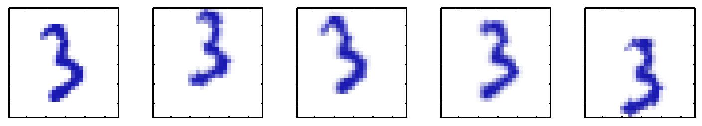

# Componentes Principales 1

<style>
  .espacio {
    margin-bottom: 1cm;
  }
</style>
  
  <style>
  .espacio3 {
    margin-bottom: 3cm;
  }
</style>

<p class="espacio">
</p>

```{r message=FALSE, warning=FALSE}
library(tidyverse)
library(RColorBrewer)
```


## Motivación

Muchos conjuntos de datos tienen la propiedad que los puntos caen en un 
variedad de dimensión mucho menor a la dimensión original de los datos.

Para entender esta idea consideremos una base de datos consrtuida con uno de 
los dígitos de la base de datos [mnist](http://yann.lecun.com/exdb/mnist/), 
esta imagen esta representada por una matriz de $64 \times 64$ pixeles, ahora
insertamos este dígito en una matriz más grande de $100 \times 100$ agregando
espacio en blanco y variamos de manera aleatoria la orientación y ubicación 
del dígito.

```{r, echo = F, fig.align='center', dpi=85}

```

Cada una de las imágenes resultantes está representada por un punto en el 
espacio de dimensión $100 \times 100 = 10,000$; sin embargo, en una base
de datos construida de esta manera solamente hay 3 grados de libertad de 
variabilidad, estas corresponden a las rotaciones, trasalación vertical y 
traslación horizontal. 

Para datos reales habrá más grados de libertad debido por una parte a
escalamiento y por otra habrá múltiples grados adicionales debidas a 
deformaciones debidas a la variabilidad en la escritura de un individuo y entre
individuos. Aún así, la la dimensionalidad de los grados de libertad es mucho
menor que la de los datos completos.

```{r message=FALSE, warning=FALSE, out.width='100%'}
if(!file.exists("datos/mnist/train-images-idx3-ubyte")){
  mnistR::downloadMNIST(dest = "datos/mnist/")
}
mnist <- mnistR::loadMNIST(dest = "datos/mnist/")[["train"]]

data_tres <- mnist %>%
  filter(y == 3) %>%
  select(-y)

par(mfrow=c(1,5))

imageD <- function(vec, main = NULL){
  mat_digit <- matrix(vec, nrow = 28)[, 28:1]
  mat <- matrix(unlist(mat_digit), nrow = 28)
  image(mat, col = brewer.pal(5, "GnBu"), xaxt = "n", yaxt = "n", 
    bty = "n", asp = 1, main = main)
}

for(i in sample(1:nrow(data_tres), 5)){
  imageD(data_tres[i, ])
}
```


El análisis de componentes principales (PCA) es una técnica que se utiliza 
con distintos objetivos:

1. Reducción de dimensionalidad.

2. Compresión de información con pérdida (_lossy_).

3. Extracción de características o (_features_).

4. Visualización de datos.


```{block2, type = "nota"}
Podemos ver PCA desde dos puntos de vista que nos llevan al mismo resultado:
  
* PCA se puede definir como una proyección de los datos en un
espacio de dimensión menor (conocido como subespacio principal), tal que 
la varianza de los datos proyectados es máxima.

* PCA se puede definir como la proyección lineal que minimiza el costo medio 
de proyección, donde el costo promedio es la distancia media al cuadrado
entre los puntos y sus proyecciones. 
```

## Formulación de máxima varianza

Consideremos un vector de observaciones $(y^1,...,y^n)$ donde $y_i$ es de 
dimensión $d$. Nuestro objetivo es proyectar los datos en un espacio de 
dimensión $M<D$ maximizando la varianza de la proyección.

Comencemos considerando la proyección en un espacio de dimensión uno, denotamos
la dirección de este espacio por $u_1$ y por conveniencia usamos un vector 
unitario ($u_1^Tu_1=1$). La proyección de cada punto $y_i$ es un escalar (pues
$M=1$) cuyo valor es $u_1^Ty_i$. La media de los datos proyectados es 
$u_1^T\bar{y}$ donde 

$$
\bar{y}=\frac{1}{N}\sum_{i=1}^N y_i
$$
por tanto la varianza de los datos proyectados es
$$
\frac{1}{N}\sum_{i=1}^N (u_1^Ty_i-u_1^T\bar{y})^2=u_1^TSu_1
$$
donde S es la matriz de covarianzas de los datos:
$$
S=\frac{1}{N}\sum_{i=1}^N (y_i-\bar{y})(y_i-\bar{y})^T.
$$

Ahora maximizamamos la varianza de la proyección respecto a $u_1$:
$$
\mbox{argmax}_{u_1}u_1^TSu_1 + \lambda_1(1-u_1^Tu_1)
$$
Derivando encontramos un punto estacionario en 
$$
Su_1=\lambda_1u_1
$$
por lo que $u_1$ debe ser un eigenvector de S, notamos también que la varianza 
esta dada por:
$$
u_1^TSu_1=\lambda_1,
$$
y por tanto, la varianza será máxima si igualamos $u_1$ con el mayor 
eigenvector de $S$, que llamamos primer componente principal.

Si elegimos $M>1$, definimos los componentes de manera incremental, en cada 
paso seleccionamos una nueva dirección eligiendo cada nueva dirección como 
aquella que maximiza la varianza de la proyección sujeta a ser ortogonal a las
direcciones (componentes) ya elegidos. Esto resulta en que la proyección lineal
óptima para la cual la varianza de los datos proyectados es máxima esta
definida por el conjunto de $M$ eigenvectores $u_1,...,u_M$ de la matriz de 
covarianzas $S$.

## Formulación de error mínimo

Ahora discutimos el segundo punto de vista de PCA. Sea $(u_1,...,u_D)$ una 
base ortonormal de vectores, esto es $u_i^Tu_j = 0$ para toda $i$ distinta de 
$j$ y $u_i^Tu_i = 1$.

Como esta es una base de $R^D$ podemos expresar los datos observados como

$$
y_i=\sum_{j=1}^D \alpha_{ij}u_j
$$

Esto corresponde a una rotación en el sistema de coordenadas. Utilizando la 
propiedad ortonormal obtenemos $\alpha_{ij}={y_i} ^Tu_j$, por tanto:

$$
y_i=\sum_{j=1}^D ({y_i} ^Tu_j) u_j
$$

Ahora, como buscamos aproximar este punto ($y_i$) usando una representación 
que involucre un número de variables $M<D$, la subespacio de dimensión $M$
se puede representar usando los primeros $M$ vectores de la base, de tal manera 
que podemos aproximar cada punto como:

$$
\hat{y}_i=\sum_{j=1}^M x_{ij}{u_j} + \sum_{j=M+1}^D b_j u_j
$$

donde los valores $x_{ij}$ dependen del dato que estamos proyectando y las $b_j$
son constantes para todos los datos. Buscamos $(u_1,...,u_D)$, $x_{ij}$ y $b_j$
tal que se minimice la distorsión introducida por la reducción de dimensión, 
donde definimos la distorsión como la distancia al cuadrado entre el punto
original $y_i$ y la aproximación $\hat{y}_i$ promediada sore todos los puntos
de la base de datos:

$$
J=\frac{1}{N}\sum_{j=1}^N(y_j-\hat{y}_j)^T(y_j-\hat{y}_j)
$$

La minimización (derivar e igualar a cero) nos lleva a:

* $x_{ij}=y_i^Tu_j$, con $j=1,...,M$

* $b_{j}=\bar{y}^Tu_j$, con $j=M+1,...,D$

Sustituyendo $x_{ij}$ y $b_j$ en $y_i=\sum_{j=1}^D ({y_i} ^Tu_j) u_j$ llegamos a
$$
y_i-\hat{y}_i=\sum_{j=M+1}^D [(y_n-\bar{y})^Tu_j]u_j
$$

y vemos que el error mínimo ocurre en la proyección ortogonal sobre el 
subespacio generado por $\{u1,...,u_M\}$.

Usando lo anterior obtenemos

$$
J=\frac{1}{N}\sum_{j=1}^N \sum_{i=M+1}^D [(y_n-\bar{y})^Tu_j]^T[(y_n-\bar{y})^Tu_j]
$$
$$
J=\frac{1}{D}\sum_{j=1}^D u_i^TSu_i
$$

Aún falta minimizar $J$ respecto a $u_i$, esta es una minimización con la 
restricción $u_i^Tu_i=1$, si derivamos respecto a $u_i$ obtenemos

$$
Su_i=\lambda_i u_i
$$

por lo que cualquier eigenvector de S corresponde a un punto crítico. Si todos
corresponden a un punto crítico ¿cómo elegimos? Notemos que si sustituimos la
solución de $u_i$ en J obtenemos

$$
J=\sum_{j=M+1}^D \lambda_j
$$

por lo que para obtener el mínimo valor de $J$ hay que seleccionar los $D-M$
eigenvectores corresponidientes a los menores eigenvalores y por tanto los 
eigenvectores que definen el subespacio principal corresponden a los $M$ 
eigenvectores mayores.

## Aplicaciones de PCA
Veamos un par de aplicaciones de PCA, comenzaremos con compresión de imágenes
y luego examinaremos PCA como preprocesamiento.

### Compresión de datos

Veamos un ejemplo de PCA para compresión de información usando la base de 
datos de mnist, en particular veamos los dígitos tres.

```{r}
dim(data_tres)
```

Como cada eigenvector es un vector en el espcio original de $D$ dimensiones 
podemos representarlos como imágenes.

```{r, out.width='100%'}
tres_mean <- apply(data_tres, 2, mean)

S <- cov(data_tres)
eigen_S <- eigen(S)
lambda <- eigen_S$values
u <- eigen_S$vectors

par(mfrow=c(1,5))
imageD(tres_mean)
for(i in 1: 4){
  imageD(u[, i])  
}
```


Podemos ver el resto de los eigenvalores en la gráfica de abajo. Graficamos 
también la medida de distorsión $J$ asociada a la elección del número de 
componentes $M$ (dada por la suma de los eigenvalores $M+1$ a $D$).

```{r, out.width=6, fig.height=4}
D <- length(lambda)
J <- sapply(1:D, function(i){sum(lambda[i:D])})
par(mfrow=c(1,2))
plot(lambda, type = "l")
plot(J, type = "l")
```

Si vemos las fórmulas de arriba podemos escribir el vector de aproximación 
correspondiente a una observación.

$$
\begin{eqnarray*}
\hat{y}_i&=&\sum_{j=1}^M x_{ij}{u_j} + \sum_{j=M+1}^D b_j u_j\\
&=&\sum_{j=1}^M y_i^Tu_j{u_j} + \sum_{j=M+1}^D \bar{y}^Tu_j u_j\\
&=&\bar{x} + \sum_{j=1}^M (y_i^Tu_j-\bar{x}^Tu_j)u_j
\end{eqnarray*}
$$

donde usamos:

$$
\bar{x}=\sum_{j=1}^D (\bar{x}^Tu_j)u_j.
$$

La compresión está en que reemplazamos cada vector de observaciones de dimensión 
$D$ ($y_i$) por un vector de dimensión $M$.

La siguiente figura muestra la compresión para distintos valores de $M$ del
primer dígito de la base de datos. 

```{r, fig.width=9.4, fig.height=2.5, eval = FALSE}
tres_1 <- data_tres[3, ]
par(mfrow=c(1,5))
imageD(tres_1)
for(M in c(1, 10, 50, 300)){
  u_M <- u[, 1:M]
  y_M <- as.numeric(tres_1) %*% u_M
  y_approx <- tres_mean + y_M %*% t(u_M)
  imageD(y_approx)
}
```


### Ejemplo: compresión de una imagen

```{r, eval=FALSE, echo=FALSE}
## load image
library(bmp)
library(pixmap)
library(jpeg)

grey <- readJPEG("figuras/perrito.jpg", native = FALSE)[,,1]

pr <- pixmapGrey(grey,cellres=1)
plot(pr)

size <- dim(grey)

k <- 50 #was calculated with sum(s$d[1:285])/sum(s$d) = 0.9919 -> covers 99% of the data

## calculate mean
columnMeans <- colMeans(grey)

## subtract mean
greyNoMean = t(apply(grey,1,columnMeans,FUN="-"))

s <- svd(greyNoMean)

u_M <- s$v[,1:k]

y_M <- greyNoMean %*% u_M

y_approx <- y_M %*% t(u_M)

pr <- pixmapGrey(y_approx,cellres=1)
plot(pr)
## add mean
y_mean = t(apply(y_approx,1,columnMeans,FUN="+"))
pr <- pixmapGrey(y_mean,cellres=1)
plot(pr)
```


#### Preprocesamiento

Otra aplicación de componentes principales es preprocesamento, en este caso
el objetivo no es reducción de dimensión sino la transformación de un conjunto
de daros con el fin de estandarizar algunas de sus propiedades. Esto puede ser
importante para el correcto funcionamiento de algoritmos o métodos que se desean 
usar después.

Veamos los datos _faithful_ de erupciones del volcán Old Faithful.

```{r}
head(faithful) %>% knitr::kable()
```

Notamos que el tiempo entre erupciones es de un orden de magnitud mayor que la duración de 
la erupción. Por ejemplo, si quisiéramos hacer k-medias (siguiente tema) sería natural 
estandarizar los datos. Sin embargo, con PCA podemos normalizar los datos 
para tener cero media y covarianza unitaria, de tal manera que la correlación 
entre distintas variables es cero.

Para hacer esto escribimos la ecuación de eigenvectores como 

$$
SU=UL
$$

donde $L$ es una matriz diagonal con los elementos $\lambda_i$ y $U$ es una 
matriz ortogonal cuyas columnas son los vectores $u_i$. Entonces, para cada
observación $y_i$ definimos su valor transformado 

$$
z_i=L^{-1/2}U^T(y_i-\bar{y})
$$

es claro que el conjunto $(z_1,...,z_N)$ tiene media cero, veamos ahora la 
covarianza:

$$
\frac{1}{N}\sum_{j=1}^Nz_jz_j^T=\frac{1}{N}\sum_{j=1}^NL^{-1/2}U^T(y_j-\bar{y})(y_j-\bar{y})^TUL^{-1/2}
$$

$$
=L^{-1/2}U^TSUL^{-1/2}=L{-1/2}LL^{-1/2}=I
$$

Esta operación se conoce como _whitening_ o _sphereing_.

<br>

## Tarea

1. Comprime una imagen utilizando análisis de componentes principales. Para esto haz lo siguiente:

a. Descarga una imagen en formato `jpg` o `jpeg` y lee la imagen en `R` utilizando el siguiente código:

```{r, eval=FALSE}
library(jpeg)
library(pixmap)
nick <- readJPEG("figura.jpg", native = FALSE)[,,1]
pr <- pixmapGrey(nick)
plot(pr)
```

b. Haz una gráfica de los primeros 100 eigenvalores de la matriz de varianzas y covarianzas. ¿Cuántas componentes

c. Completa el siguiente código para comprimir la imagen con $M=1, 5, 10, 40, 50$ componentes principales.

$$
S = X^TX = P DP^T
$$

$$
\Sigma = D^{1/2}
$$

$$
X = U \Sigma V^T
$$

```{r, eval=FALSE}
S <-  %*% 
eigen_S <- eigen(S)
P <- eigen_S$vectors
lambda <- eigen_S$values
sqrt_lambda <- sqrt(lambda)
sigma <- diag(sqrt_lambda, nrow=, ncol = )
V = P
sigma_1 <- solve(sigma)
U =  %*% V %*% 
X = U %*% sigma %*% t(V)
for(M in c(1, 5, 10, 40, 50)){
  sigma_M <- sigma[1:M,1:M]
  sigma_Mk <- diag(0,,)
  sigma_Mk[1:M,1:M] <- sigma_M
  approx <- U %*%  %*% t(V)
  pr <- pixmapGrey(approx)
  plot(pr)
}
```

2. Considera los datos de erupciones de volcanes.

```{r message=FALSE, warning=FALSE}
library(tidyverse)

ggplot(faithful, aes(x = eruptions, y = waiting)) +
  geom_point()

faith_pca <- prcomp(faithful, scale. = TRUE)

faithful$pc1 <- faith_pca$x[, 1]
faithful$pc2 <- faith_pca$x[, 2]
ggplot(faithful, aes(x = pc1, y = pc2)) +
  geom_point()
```

b. Implementa _whitening_ en los datos faithful. 

c. Compara las gráficas de los datos crudos y preprocesados.
