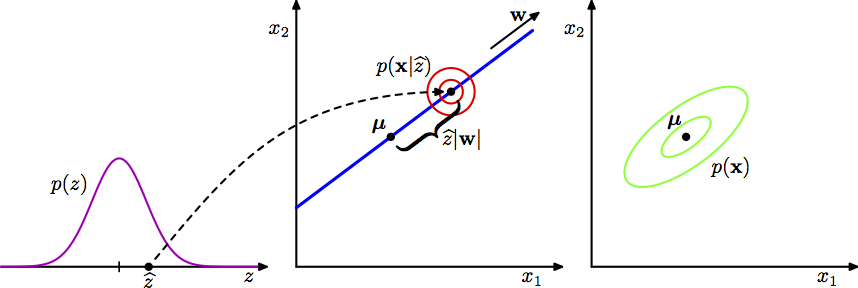
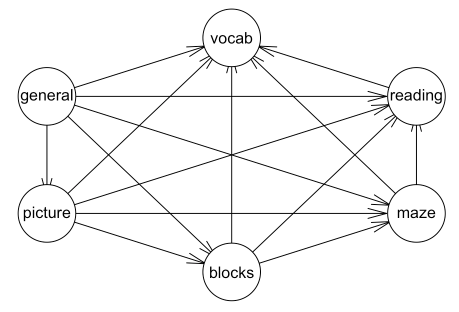
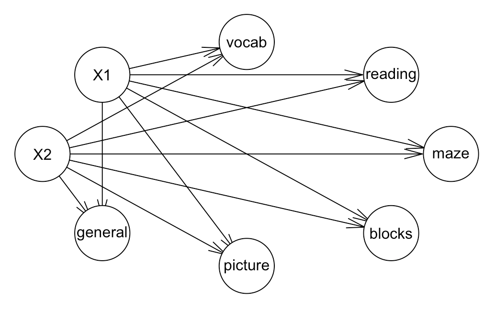
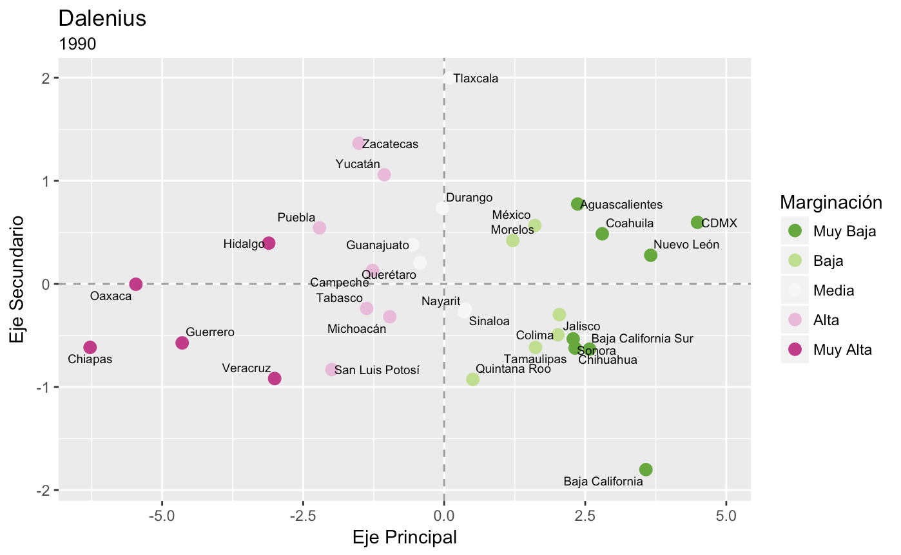
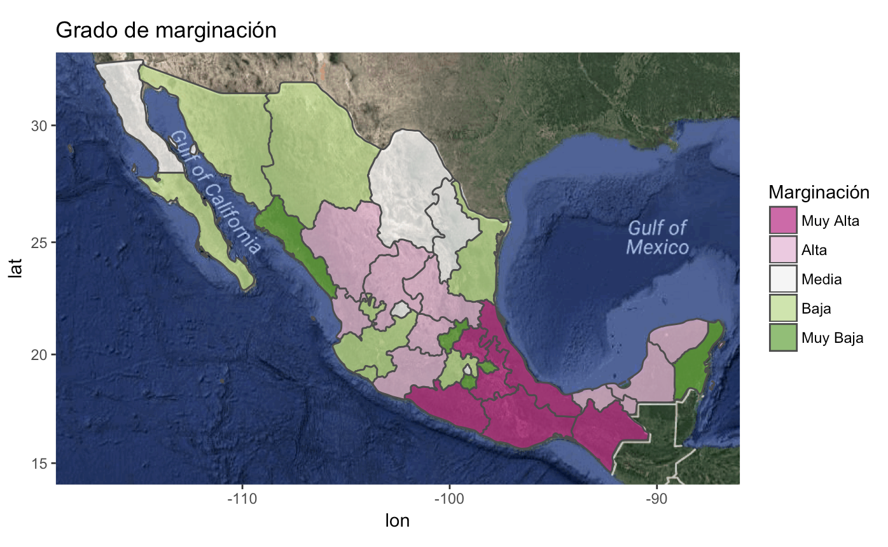

# Componentes Principales 2

<style>
  .espacio {
    margin-bottom: 1cm;
  }
</style>
  
  <style>
  .espacio3 {
    margin-bottom: 3cm;
  }
</style>

<p class="espacio">
</p>

```{r message=FALSE, warning=FALSE}
library(tidyverse)
```


## PCA probabilístico y Análisis de Factores

La formulación de PCA esta fundadda en una proyección lineal de los datos sobre
un subespacio de dimensión menor. En esta sección veremos que PCA también se 
puede expresar como la solución de máxima verosimilitud de en un modelo 
probabilístico de variable latente.

El PCA probabilístico y el análisis de factores tienen las siguientes 
propiedades deseables:

* Representan una distribución Gaussiana con restricciones en el que el número 
de parámetros se puede restringir, mientras que podemos capturar las 
correlaciones dominantes de los datos. En general una distribución Gaussiana 
multivariada tiene $p(p+1)/2$ parámetros
independientes en la matriz de covarianzas por lo que el número de parámetros 
crece de manera cuadrática con $p$. Por otra parte si restringimos a una matriz 
de covarianzas diagonal tenemos solamente $p$ parámetros pero no podemos 
entender las correlaciones. PCA probabilístico (y AF) es un punto medio en el 
que las $q$ correlaciones más fuertes se pueden capturar mientras que el número 
de parámetros crece de manera lineal con $p$. En el caso de CPP con $q$ 
componentes: $p\cdot q + 1 - q\cdot(q-1)/2$.

* Podemos derivar un algoritmo EM para CPP que es eficente computacionalmente en
situaciones en los que nos interesa calcular pocas componentes.

* La combinación de un modelo probabilísitico y el algoritmo EM nos permite 
tratar con datos faltantes en la base de datos.

* La existencia de la verosimilitud nos permite comparar modelos. Por ejemplo 
podemos hacer validación cruzada para elegir el número de componentes/factores 
que ajustan mejor a los datos.

* Podemos utilizar el modelo para generar muestras de la distribución.

Para formular PCA probabilístico introducimos una variable latente $X$ que
corresponde al subespacio de componentes principales, suponemos $X\sim N(0, I)$.
Por otra parte, la distribución de la variable aleatoria observada $Y$ 
condicional a la variable latente $X$ es $Y|X\sim N(Wx+\mu, \sigma^2I$

Veremos que las columnas de $W$ (dimensión $D\times M$) generan un subsepacio 
que correponde al subespacio de componentes principales.

El siguiente esquema explica el modelo PCA probabilístico desde el punto de
vista generativo.

```{r, echo = F, fig.align='center', dpi=150}

```

Desde este enfoque vemos que primero selecciona aleatoriamente un valor de la 
variable latente ($x$) y después muestreamos el valor observado condicional
a la variable latente, en particular la variable obsevada (de dimensión $D$)
se define usando una transformación lineal del espacio latente mas ruido 
Gaussiano aleatorio:

$$y=Wx + \mu + \epsilon$$

donde $x\sim N(0, I)$ de dimensión $M$ y $\epsilon \sim N(0, \sigma^2I)$ de 
dimensión $D$.

Ahora, si queremos usar máxima verosimilitud para estimar $W$, $\mu$ y 
$\sigma^2$, necesitamos una expresión para la distribución marginal de la 
variable observada:

$$p(y)=\int p(y|x)p(x)dx$$

dado que este corresponde a un modelo Gaussiano lineal su distribución marginal
es nuevamente Gaussiana con media $\mu$ y matriz de covarianzas 
$C=WW^T+\sigma^2I.$

Entonces, la distribución $p(y)$ depende de los parámetros $W$, $\mu$ y 
$\sigma^2$; sin embargo hay una redundancia en la parametrización que 
corresponde a rotaciones en el espacio de coordenadas de las variables latentes.
Para ver esto consideremos $Q$ una matriz ortonormal de dimensión $D \times D$ 
($Q$ es una matriz de rotación),
$$Q^T Q = Q Q^T = I$$
Al observar la igualdad $C=WW^T+\sigma^2I$, notamos que no existe una única $W$ 
que la satisfaga pues si definimos $\tilde{W}=WQ$ tenemos que
$$\tilde{W}\tilde{W}^T=WQQ^TW^T=WW^T$$
y por tanto $C=\tilde{W}{W}^T+\sigma^2I$. Este es un aspecto que consideraremos
más a fondo en la parte de estimación.

#### Máxima verosimilitud

Consideramos la determinación de los parámetros usando máxima verosimilitud:
$$
\begin{aligned}
\log p(y)&=\sum_{i=1}^N\log p(y_j)\\
&=-\frac{ND}{2}-\frac{N}{2}\log(2\pi)\log|C| -\frac{1}{2}\sum_{j=1}^N(y_j-\mu)^TC^{-1}(y_j-\mu)
\end{aligned}
$$

Derivando e igualando a cero obtenemos $\hat{\mu}=\bar{y}$, la maximización 
con respecto a $W$ y $\sigma^2$ es más difícil pero tiene forma cerrada ([Tipping y Bishop 1999](http://research.microsoft.com/pubs/67218/bishop-ppca-jrss.pdf)). 

$$\hat{W}=U_{M}(L_M-\sigma^2I)^{1/2}R$$

donde $U_{M}$ es una matriz de dimensión $D \times M$ cuyas columnas 
corresponden a los $M$ eigenvectores asociados a los mayores eigenvalores de la 
matriz de covarianzas $S$. La matriz $L$ de dimensión $M \times M$ esta 
conformada por los eigenvalores correspondientes. Por último, R res cualquier
matriz ortonormal de dimensión $M \times M$.

Suponemos que los eigenvectores están ordenados en orden decreciente de 
acuerdo a sus eigenvalores correspondientes $u_1,...,u_M$, en este caso las 
columnas de $W$ definen el subespacio de PCA estándar. Por su parte, la solución
de máxima verosimilitud para $\sigma^2$ es:

$$\hat{\sigma^2}=\frac{1}{D-M}\sum_{j=M+1}^D \lambda_j$$

notemos que $\hat{\sigma}^2$ es la varianza promedio asociada a las dimensiones
que no incluimos.

Ahora, como R es ortogonal se puede interpretar como una matriz de rotación en
el espacio de variables latentes. Por ahora, pensemos $R=I$ notamos que las
columnas de $W$ son los vectores de componentes principales escalados por los
parámetros de varianza $\lambda_i-\sigma^2$, para ver la interpretación 
notemos que en la suma de Gaussianas independientes las varianzas son aditivas.
Por tanto, la varianza $\lambda_i$ en la dirección de un eigenvector $u_i$ se 
compone de la contribución $(\lambda_i-\sigma^2)$ de la proyección del espacio 
latente (varianza 1) al espacio de los datos a través de la columna 
correspondiente de $W$ mas la contribución del ruido con varianza isotrópica 
$\sigma^2$.

#### Observaciones
* El método convencional de PCA se suele describir como una proyección de los 
puntos en un espacio de dimensión $D$ en un subespacio de dimensión $M$.

* PCA probabilístco se expresa de manera más natural como un mapeo del espacio
latente al espacio de los datos observados.

* Una función importante de PCA probabilítico es definir una distribución 
Gaussiana multivariada en donde el número de grados de libertad se puede 
controlar al mismo tiempo que podemos capturar las correlaciones más importantes
de los datos.

* PCA convencional corrresponde al límite $\sigma^2 \to 0$

* PCA probabilístico se puede escribir en términos de un espacio latente por lo 
que la implementación del algoritmo EM es una opción natural. En casos donde
$M<<D$ la estimación mediante EM puede ser más eficiente. 

* Debido a que tenemos un modelo probabilitico para PCA podemos trabajar con 
faltantes (MCAR y MAR) marginalizando sobre la distribución de los no observados.
El manejo de faltantes es otra ventaja de la implementación EM.

* El algoritmo EM se puede extender al caso de Análisis de factores para el 
cuál no hay una solución cerrada.

### Análisis de factores

El análisis de factores es muy similar a PCA probabilístico, la diferencia 
radica en que en la distribución condicional de $Y|X$ la matriz de covarianza se 
supone diagonal en lugar de isotrópica:

$$Y|X \sim N(Wx + \mu, \Psi)$$

donde $\Psi$ es una matriz diagonal de dimensión $D \times D$. Al igual que en
PCA probabilístico, el modelo de FA supone que las variables observadas son 
independientes dado las latentes. En escencia el análisis de factores está 
explicando la estructura de covarianza observada representando la varianza  
independiente asociada a cada variable en la matriz $W$ y capturando la varianza 
compartda en $W$.

La distribución marginal de las variables observadas es $X\sim N(\mu, C)$
donde 
$$C=WW^T+\Psi.$$

De manera similar a PCA probabilístico el modelo es invariante a rotaciones en 
el espacio latente.


## Análisis de factores (descripción tradicional)

Trataremos ahora con análisis de factores, los modelos que veremos se enfocan en
variables observadas y latentes continuas. La idea esencial del análisis de 
factores es describir las relaciones entre varias variables observadas 
($Y=Y_1,...,Y_p$) a través de variables latentes ($X_1,...,X_q$) donde $q < p$.
Como ejemplo consideremos una encuesta de consumo de hogares, donde observamos
el nivel de consumo de $p$ productos diferentes. Las variaciones de los 
componentes de $Y$ quizá se puedan explicar por 2 o 3 factores de conducta del
hogar, estos podrían ser un deseo básico de comfort, o el deseo de alcanzar 
cierto nivel social u otros conceptos sociales. Es común que estos factores 
no observados sean de mayor interés que las observaciones en si mismas.

En la gráfica inferior vemos un ejemplo en educación donde las variables 
_vocab, reading, maze,..._ corresponden a las variables observadas mientras que 
$X_1$ y $X_2$ son las variables latentes. Observamos que añadir _estructura_ al
problema resulta en una simplificación del modelo. 

```{r, warning=FALSE,message=FALSE, echo=FALSE, out.width='100%',eval=FALSE}
library(igraph)
library(bnlearn) 
areas <- colnames(ability.cov$cov)
ug <- empty.graph(areas)
arcs(ug, check.cycles = TRUE) = matrix(c("general", "picture", "general", 
  "blocks", "general", "maze", "general", "reading", "general", "vocab", 
  "picture", "blocks", "picture", "maze", "picture", "reading", "picture", 
  "vocab", "blocks", "maze", "blocks", "reading", "blocks", "vocab", 
  "maze", "reading", "maze", "vocab", "reading", "vocab"), ncol = 2, 
  byrow = TRUE, dimnames = list(c(), c("from", "to")))
plot(ug)
```

```{r, echo = F, fig.align='center', dpi=150}

```

```{r echo=FALSE, message=FALSE, warning=FALSE, out.width='100%', eval=FALSE}
ug <- empty.graph(c("X1", "X2", areas))
arcs(ug, check.cycles = TRUE) = matrix(c("X1", "general","X1", "picture", "X1", 
  "blocks", "X1", "maze", "X1", "reading", "X1", "vocab", "X2", "general", "X2",   
  "picture", "X2", "blocks", "X2", "maze", "X2", "reading", "X2", "vocab"), 
  ncol = 2, 
  byrow = TRUE, dimnames = list(c(), c("from", "to")))
plot(ug)
```

```{r, echo = F, fig.align='center', dpi=150}

```

En ocasiones, el análisis de factores se utiliza como una técnica de reducción 
de dimensión que esta basada en un modelo. Idealmente, toda la información en 
la base de datos se puede reproducir por un número menor de factores.

### El modelo
Sea $Y = (Y_1,...,Y_p)^T$ un vector de variables aleatorias observables donde
todas las variables son cuantitativas. Supongamos que cada $Y_j$ en $Y$ ($j=1,...,p$) satisface: 
$$Y_j = \sum_{k=1}^K \lambda_{jk} X_k + u_j$$
donde
* $X_k$ son los factores comunes (variables aleatorias continuas no observables).

* $u_j$ son errores (aleatorios).

* $\lambda_{jk}$ son las _cargas_ de la variable $j$ en el factor $k$, 
(parámetros).

En notación matricial el modelo se escribe:
$$Y_{p\times 1} = \Lambda_{p\times K} X_{K\times 1} + U_{p\times 1}$$
donde $\Lambda, X$ y $U$ no son observadas, únicamente observamos $Y$.

Adicionalmente, tenemos los siguientes supuestos:

* $X \perp U$, esto es, los errores y los factores son independientes.

* $E(X)=E(U)=0$.

* $Cov(X) = I_k$ (modelo ortogonal de factores) ésto se ve en la  gráfica pues 
no hay arcos que unan a $X_1$ y $X_2$.

* $Cov(U) = \Psi$, donde $\Psi$ es una matriz diagonal ($p \times p$).

Típicamente, se asume que $U$ y $X$ son Normales multivariadas. ¿Cómo vemos
que $Y_i \perp Y_j|X$

Lo que buscamos es explicar la relación entre las variables observadas a través 
de las variables latentes, las relaciones que buscamos explicar están resumidas 
en la matriz de varianzas y covarianzas. En nuestro ejemplo la matriz es la 
siguiente:

```{r}
ability.cov$cov
```

y la matriz de correlaciones es:

```{r}
cov2cor(ability.cov$cov)
```

Entonces, volviendo al modelo examinemos que implicaciones tiene en la matriz de
varianzas y covarianzas de las variables aleatorias observables. Denotemos la 
matriz de varianzas y covarianzas por $\Sigma = Var(Y)$ y la expresaremos en 
términos de los parámetros del modelo. 

$$\Sigma = \Lambda \Lambda^T + \Psi$$

Los términos en la diagonal de $\Sigma$ (varianzas de cada variable observada) 
son:

$$Var(Y_j) = \sum_{k= 1}^K \lambda_{jk}^2 + \Psi_{jj}$$
$$= comunalidad + unicidad$$

La __comunalidad__ de la variable $Y_j$ dada por $\sum_{k= 1}^K \Lambda^2(j,k)$ 
es la varianza que comparte esta variable con 
otras variables por medio de los factores, mientras que la __unicidad__ 
$\Psi(j,j)$ es la varianza de la variable $j$ que no comparte con el resto.
Un buen análisis de factores tiene comunalidades altas y unicidades bajas 
(relativamente).

Los términos fuera de la diagonal están dados por:

$$Cov(Y_j, Y_i)= \sum_{k=1}^K\lambda_{jk}\lambda_{ik}$$

  Sea 
$X \sim N(0, 1), u_1 \sim N(0,1),u_2 \sim N(0,2)$. Definimos 
$$Y_1 = X + u_1$$
$$Y_2 = -X+u_2$$

* Comunalidades:

* Unicidades:

* Descomposición de la matriz de varianzas y covarianzas:

**Ejemplo:** Pruebas de habilidad.
```{r}
ability_fa <- factanal(factors = 2, covmat = ability.cov, rotation = "none")
ability_fa
```


### Estimación del modelo
Antes de adentrarnos en la estimación vale la pena considerar dos aspectos:

1.  **Rotaciones**: Al observar la igualdad $\Sigma = \Lambda\Lambda^T + \Psi$, 
notamos que no existe una única $\Lambda$ que la satisfaga. Sea $Q$ una matriz
ortonormal de dimensión $K \times K$ ($Q$ es una matriz de rotación),
$$Q^T Q = Q Q^T = I$$ 
Si $\Lambda$ es tal que $Y = \Lambda X + U$ y $\Sigma = \Lambda\Lambda^T + \Psi$ entonces,
$$Y=(\Lambda Q)(Q^TX) + U$$
$$\Sigma = (\Lambda Q) (\Lambda Q)^T + \Psi =  \Lambda\Lambda^T + \Psi$$
por lo tanto, $\Lambda_1 = (\Lambda Q)$ y $X_1 = Q^TX$ también son una solución 
para el modelo. Esto nos dice, que cualquier rotación de las cargas nos da una 
solución.
Hay amplia literatura en este tema, típicamente la elección de una rotación 
busca mejorar la interpretación.

2. **¿Cuántos factores?:** No hay una respuesta directa a la pregunta pero para 
aspirar a contestarla respondamos primero: ¿Cuántos factores puedo estimar? 
Contemos el número de parámetros que vamos a estimar y veamos los grados de 
libertad:  
+ Parámetros en $\Sigma:p(p+1)/2$  
+ Parámetros en $\Lambda$ y $\Psi:pK + p$  
+ Restricciones necesarias para fijar la rotación: $K(K-1)/2$  
+ Grados de libertad: $d = p(p+1)/2 - (pK + p - K(K-1)/2)$  
Si $d < 0$, no podemos estimar el modelo, por lo tanto el mayor número de 
factores que puedo estimar depende del número de variables observadas. Por 
ejemplo si $p = 5$, únicamente podemos estimar modelos con 1 ó 2 factores.  
Volviendo a la pregunta original: ¿Cuántos factores debo modelar? La respuesta 
depende del objetivo del análisis de factores, en ocasiones se desea utilizar 
las variables latentes como un _resumen__ de las variables observadas e 
incorporarlas a ánalisis posteriores, en este caso es conveniente analizar el 
porcentaje de la varianza en las variables observadas que se puede explicar con 
los factores, por ejemplo si el tercer factor no contribuye de manera importante 
a explicar la variabilidad observada, el modelo con dos factores sería 
preferible. Por otra parte, si asumimos normalidad 
($X\sim N(0, I), U\sim N(0, \Psi)$) podemos comparar la verosimilitud (o AIC, 
BIC) de los modelos con distinto número de factores y elegir de acuerdo a este 
criterio.

Una vez que fijamos el número de factores, hay varios métodos de estimación, el 
más popular implementa el algoritmo __EM__, sin embargo este método requiere 
supuestos de normalidad. Dentro de los métodos que no requieren supuestos 
adicionales está el método de __factores principales__. 

#### Método del factor principal
En adelante utilzamos la matriz de covarianzas muestral,
$$S = \frac{1}{N} \sum_{n = 1}^N(X_n-\bar{X})(X_n-\bar{X})^T$$
como la estimación de la matriz de covarianzas poblacional $\Sigma$.
Usualmente no es posible encontrar matrices $\hat{\Lambda},\hat{\Psi}$ tales que la igualdad $S = \hat{\Lambda}\hat{\Lambda}^T+\hat{\Psi}$ se cumpla de manera exacta. Por tanto el objetivo es encontrar matrices tales que se minimice $traza(S-\hat{S})^T(S-\hat{S})$ donde $\hat{S} = \hat{\delta}\hat{\delta}^T+\hat{Psi}$.
El algoritmo del método del factor principal funciona de la siguiente manera:

1. Inicializa $\hat{\Psi}$ (cualquier valor)

2. $\hat{\Psi}=$ los $K$ mayores eigenvectores de la matriz 
$$(\hat{S} - \hat{\Psi})$$ Nos fijamos en esta diferencia porque nos interesa
explicar las covarianzas a través de los factores comunes.

3. $\hat{\Psi} = \mbox{diag}(S-\hat{\Lambda}\hat{\Lambda}^T)$

Los pasos 2 y 3 se repiten hasta alcanzar convergencia. Este algoritmo no es muy
popular debido a que la convergencia no está asegurada, se considera lento y los
valores iniciales de $\Psi$ suelen influenciar la solución final.

### Análisis de factores de máxima verosimilitud
Supongamos ahora que,
$$X \sim N(0, I)$$
$$U \sim N(0,\Psi)$$
Entonces la distribución del vector de variables aleatorias observables $Y$ es
$$Y \sim N(\mu + \Lambda x, \Sigma)$$
donde $\Sigma = \Lambda \Lambda^T + \Psi$ (igual que antes).
Es fácil ver que la distribución condicional de $Y$ es:
$$Y|X \sim N(\mu + \Lambda x, \Psi)$$
por tanto, se cumple las independencias condicionales que leemos en la gráfica.
Ahora, la log verosimilitud es:
$$\log L(\Sigma) = - \frac{np}{2} \log(2\pi) - \frac{n}{2}\log \det(\Sigma) - \frac{n}{2}\mbox{tr}(\Sigma^{-1}S)$$
buscamos parámetros$\hat{\Lambda}$ y $\hat{Psi}$ que maximizen esta log-verosimilitud, sin embargo, estos parámetros no se pueden separar facilmente (es decir maximizar individualmente) ya que están relacionados a través de $det(\Sigma)$ y $\Sigma^{-1}$. No hay una forma cerrada para encontrar los parámetros de máxima verosimilitud de la expresión anterior. Recurrimos entonces al algoritmo __EM__, donde en el paso __E__ _rellanamos_ los valores de $X$ y en el paso __M__ estimamos $\Lambda$ y $\Psi$ utilizando que éstos parámetros se pueden separar si conozco $X$.

### Evaluación del modelo
Volviendo al número de factores, una vez que hacemos supuestos de normalidad podemos calcular la devianza del modelo:
$$D = n*(tr(\hat{\Sigma}^{-1}S) - log det(\hat{\Sigma}^{-1}S) - p)$$ 
y el BIC. Por tanto, podemos comparar modelos con distintos factores utilizando este criterio.
$$d = p - {1}{2}((p-q)^2 - (p+q))$$
y por tanto $BIC = D + d log N$.

```{r}
library(psych)
dev <- function(fit){
  S <- fit$correlation
  n <- fit$n.obs
  p <- nrow(S)
  Sigma <- (fit$loadings) %*% t(fit$loadings) + diag(fit$uniqueness)
  mat.aux <- solve(Sigma) %*% S
  D <- n * (tr(mat.aux) - log(det(mat.aux)) - p)
  return(D)
}
BIC <- function(fit){
  p <- nrow(fit$loadings)
  q <- ncol(fit$loadings)
  v <- p - 1/2 * ((p - q) ^ 2 - (p + q))
  D <- dev(fit)
  BIC <- D + v * log(fit$n.obs) / 2
  return(BIC)
}
ability.fa.1 <- factanal(factors = 1, covmat = ability.cov, 
  rotation = "none")
ability.fa.2 <- factanal(factors = 2, covmat = ability.cov, 
  rotation = "none")
ability.fa.3 <- factanal(factors = 3, covmat = ability.cov, 
  rotation = "none")
BIC(ability.fa.1)
BIC(ability.fa.2)
BIC(ability.fa.3)
```


Veamos también el porcentaje de la varianza observada que se puede explicar con los distintos modelos.

```{r}
ability.fa.1
ability.fa.2 
ability.fa.3
```


Finalmente, volvamos a las rotaciones. La interpretación de los factores se 
facilita cuando cada variable observada _carga_ principalmente en un factor, 
por ello, muchos de los métodos de rotación buscan acentuar esta característica:

* Rotación __varimax__: Resulta en algunas cargas altas y otras bajas para cada 
factor, de manera que las cargas bajas se puedan ignorar en la interpretación.

* Rotación __promax__: Esta es una rotación _oblicua_, lo que implica que se 
pierde la ortogonalidad de los factores. El resultado de esta rotación es que 
usualmente las cargas se vuelven incluso más extremas que con la rotación 
varimax.

```{r}
ability.varimax <- factanal(factors = 2, covmat = ability.cov, 
  rotation = "varimax")
ability.promax <- factanal(factors = 2, covmat = ability.cov, 
  rotation = "promax")
cbind(ability.varimax$loadings, ability.promax$loadings) # cutoff = 0.1
```

### Visualización

Cuando realizamos componentes principales es común querer proyectar los datos en las componentes. En el caso de AF no es tan sencillo porque los factores son aleatorios, pero hay métodos para calcular puntajes (scores).

* Método de Bartlett. Supongamos que conocemos $\Lambda$ y $\Psi$, denotemos los puntajes del individuo $i$ en los factores por $x_i$, entonces si $y_i$ es el vector de variables observables del i-ésimo individuo, tenemos que $y_i$ dada $x_i$ se distribuye $N(\Lambda x_i, \Psi)$, por lo que la log-verosimilitud de la observación $y_i$ esta dada por
$$-\frac{1}{2} log|2\pi\Psi| - \frac{1}{2}(y_i- \Lambda f_i)^T \Psi^{-1}(y_i - \Lambda x_i)$$
Derivando e igualando a cero se obtiene: 
$$\hat{x}_i = (\Lambda^T\Psi^{-1}\Lambda)\Lambda^T\Psi^{-1}y_i$$

* Método de Thompson. Consideramos $x_i$ aleatorio, i.e. $X\sim N(0,I)$, entonces $f|y$ se distribuye $N(\Lambda^T\Psi^{-1}y, I-\Lambda^T \Psi^{-1}\Lambda)$ por lo que un estimador natural para $x_i$ es
$$\hat{x}_i = \Lambda^T\Psi^{-1}y_i$$


**Ejemplo.** La base de datos wine contiene medidas en 13 atributos diferentes de 180 vinos.

```{r, message=FALSE, warning=FALSE}
library(gridExtra)
wine <- read_csv("datos/wine.csv")
head(wine) %>% knitr::kable()
```

```{r}
pc.wine.1 <- princomp(wine, scores = TRUE)

fa.wine <- factanal(wine, factors = 2, scores = "Bartlett")
fa.pc.wine <- data.frame(fa1 = fa.wine$scores[, 1], pc1 = pc.wine.1$scores[, 1], 
  fa2 = fa.wine$scores[, 2], pc2 = pc.wine.1$scores[, 2])
```


```{r}
comp_1 <- ggplot(fa.pc.wine, aes(x = fa1, y = pc1)) + 
  geom_point()
comp_2 <- ggplot(fa.pc.wine, aes(x = fa1, y = pc2)) + 
  geom_point()
grid.arrange(comp_1, comp_2, ncol = 2)
```

```{r}
pc.wine.2 <- princomp(wine, scores = T, cor = T)

fa.pc.wine <- data.frame(fa1 = fa.wine$scores[, 1], pc1 = pc.wine.2$scores[, 1], 
  fa2 = fa.wine$scores[, 2], pc2 = pc.wine.2$scores[, 2])
```

```{r, out.width='100%'}
comp_1 <- ggplot(fa.pc.wine, aes(x = fa1, y = pc1)) + 
  geom_point()
comp_2 <- ggplot(fa.pc.wine, aes(x = fa2, y = pc2)) + 
  geom_point()

grid.arrange(comp_1, comp_2, ncol = 2)
```


```{r message=FALSE, warning=FALSE, out.width='100%'}
par(mfrow=c(1,2))
biplot(pc.wine.1)
biplot(pc.wine.2)
```


```{r}
# Ejemplo simulación
x1 <- rnorm(1000)
x2 <- x1 + 0.001 * rnorm(1000)
x3 <- 10 * rnorm(1000) 

x <- data.frame(x1, x2, x3)

fact.x <- fa(x, factors = 1, covar = TRUE, fm ="ml")
pc.x <- princomp(x)
fact.x$loadings
pc.x$loadings

y <- scale(x)

fact.y <- fa(y, factors = 1, fm ="ml")
pc.y <- princomp(y)
fact.y$loadings
pc.y$loadings
fact.y
```


En el ejemplo de simulación vemos que el análisis de componentes principales se alinea con la dirección de máxima varianza $X_3$ mientras que el análisis de factores ignora el componente no correlacionado y captura el componente correlacionado $X_2 + X_1$. Debido a que en FA modelamos diferentes _unicidades_ $u_j$ para cada $Y_j$ el análisis de factores puede verse como un modelo para la estructura de correlación de $Y_j$ en lugar de la estructura de covarianzas.

## Tarea

El grado de marginación fue definido por CONAPO en 1990:

* tiene como misión incluir a la población en los programas de desarrollo económico y social que se formulen dentro del sector gubernamental y vincular sus objetivos a las necesidades que plantean los fenómenos demográficos;

* permite diferenciar municipios según el impacto global de carencias que padece la población como resultado de la falta de acceso a la educación, la residencia en viviendas inadecuadas, la percepción de ingresos monetarios insuficientes y las relacionadas con la residencia en localidades pequeñas;

* contribuye a identificar las disparidades territoriales que existen entre los municipios;

* ha sido utilizado como criterio de las reglas de operación de diversos programas, lo que es un indicativo de su aceptación y uso cada vez más generalizado; y

* define 4 dimensiones de la marginación: educación, vivienda, distribución de la población, ingresos monetarios.

```{r message=FALSE, warning=FALSE}
library(tidyverse)
base_estados <- read_csv("datos/base_estados.csv")
base_estados %>% head(10) %>% select(NOM_ENT, ANALF:PO2SM, ANIO) %>% knitr::kable()
```

1. Aplica el método de componentes principales (utiliza la función `princomp` como en los ejemplos de arriba.) Las variables para obtener las componentes son: `ANALF`, `SPRIM`, `OVSEE`, `OVSDE`, `OVSAE`, `VHAC`, `OVPT`, `PL<5000`, `PO2SM`. Haz una gráfica para 1990 de las componentes principales donde el eje principal esté en el eje horizontal y el eje secundario en el eje vertical. Sustituye los espacios que digan `<rellenar>`.

```{r, eval=FALSE}
datos <- base_estados %>% 
  select(CVE_ENT, NOM_ENT, ANIO, ANALF, SPRIM, OVSDE, OVSEE, 
         OVSAE, VHAC, OVPT, `PL<5000`, PO2SM) %>%
  mutate_at(.funs = ~as.numeric(.), vars(-NOM_ENT)) %>%
  group_by(<rellenar>) %>%
  mutate_at(.funs = funs((. - mean(.))/sd(.)), vars(-<rellenar>, -<rellenar>)) %>%
  ungroup() %>% as_tibble()
  
indice <- datos %>% filter(<rellenar> == 1990)

indice_pca <- princomp(x = <rellenar>, scores = <rellenar>, cor = <rellenar>)
indice$comp1 <- indice_pca$scores[,1]
indice$comp2 <- indice_pca$scores[,2]

ggplot(data = indice, aes(x=<rellenar>, y=<rellenar>)) +
  geom_point()
```

2. Haz una gráfica de la medida de distorsión $J$ asociada a la elección del número de 
componentes $M$ (dada por la suma de los eigenvalores $M+1$ a $D$).

3. Utiliza la siguiente función para clasificar los componentes principales con el _método de Dalenius_. La tabla resultado debe tener las siguientes columnas: `anio` ,`cve_ent`, `nom_ent`, `eje1`, `eje2`, `dal`, y `GM`. No olvides que se debe hacer componentes principales para _cada año_.

```{r}
library(stratification)
clasif_dalenius = function(x, n = NULL, Ls = 5, add = 5, labels = NULL){
  
  x_1 = x + add
  
  if(is.null(n)){
    n <- length(x)
  }
        
  dalenius = strata.cumrootf(x_1, n = n, Ls = Ls, model = 'none')
  boundaries = dalenius$bh - add
  cluster = cut(x, c(-Inf, boundaries, Inf), labels = labels)
  
  return(cluster)
}
```


Completa el código sustituyendo donde diga `<rellenar>`:

```{r eval=FALSE, message=FALSE, warning=FALSE}
options(warn=-1)
anios <- unique(datos$ANIO)

calcula_gm <- function(anio){
  indice <- datos %>% filter(ANIO == anio)
  cve_ent <- indice$CVE_ENT
  nom_ent <- indice$NOM_ENT
  x = <rellenar>
  indice_pca <- princomp(x, scores = <rellenar>, cor = <rellenar>)
  eje1 <- indice_pca$scores[,1]
  eje2 <- indice_pca$scores[,2]
  dal <- clasif_dalenius(x = <rellenar>, add = <rellenar>, n = <rellenar>)
  GM <- ordered(dal, labels = c('Muy Baja', 'Baja', 'Media', 'Alta', 'Muy Alta'))
  
  tibble(anio, cve_ent, nom_ent, eje1, eje2, dal, GM)
}

df <- map_df(.x = anios, .f = calcula_gm)
```


4. Haz una gráfica de los dos componentes como la que se muestra abajo.

```{r, echo = F, dpi=270}

```

Utiliza el siguiente código para producir la gráfica. Sustituye los espacios que digan `<rellenar>`:

```{r, eval=FALSE}
library(maptools)
etiquetar <- function(df, x, y, etiq = "etiq", size = 3.5){
  df <- as.data.frame(df)
  plot(df[, x], df[, y])
  orden <- pointLabel(df[, x], df[, y], df[, etiq], doPlot = TRUE,
    cex = 0.5 * size, xpd = TRUE)
  dev.off()
  df$a <- orden$x
  df$b <- orden$y
  df
}
```

```{r, eval=FALSE}
library(RColorBrewer)
set.seed(110265)
df_etiq <- etiquetar(df, "eje1", "eje2", etiq = "nom_ent", size = 1.5)

df_etiq %>%
  filter(<rellenar>) %>%
  ggplot(<rellenar>) +
    geom_vline(xintercept = 0, linetype = 'dashed', color = 'gray60') +
    geom_hline(yintercept = 0, linetype = 'dashed', color = 'gray60') +
    geom_point(aes(<rellenar>), size = 3, show.legend = T) +
    labs(title = 'Dalenius',
         subtitle = 1990,
         x = 'Eje Principal',
         y = 'Eje Secundario') +
    geom_text(aes(x = a, y = b, label = nom_ent), size = 2.5) +
    scale_colour_manual(labels = c('Muy Baja', 'Baja', 'Media', 'Alta', 'Muy Alta'),
                        values = rev(brewer.pal(n = 5, name = "PiYG")), 
                        name = "Marginación")
```


5. Haz una gráfica como ésta que muestre en un mapa tus resultados:

```{r, echo = F, dpi=200}

```

Para hacer la gráfica usa este código:

```{r, eval=FALSE}
library(scales)
library(rgdal)
library(ggmap)

# Leer geometrías del mapa
edo_shp <- readOGR("datos/estados_ligero", layer = "estados_ligero")
edo_shp@data$id <- c(1:4,7,8,5,6,9:32)
edo_shp@data$CVE_ENT  <- edo_shp@data$id
edo_df <- fortify(edo_shp, region = "CVE_ENT")

# Añadir variables al mapa
df_2010 <- df %>% filter(anio == 2010)

# Añadimos las variables de interés a la base de datos mun_df
edo_ind <- edo_df %>%
  mutate(CVE_ENT = as.integer(id)) %>%
  left_join(df_2010, by = c('CVE_ENT'='cve_ent'))

# Obtenemos el mapa de Google
mapa <- get_googlemap(c(lon = -102, lat = 24), zoom = 4, maptype = "hybrid",
                      style = 'feature:administrative.country|element:labels|visibility:off')

ggmap(mapa) + 
  geom_polygon(data = edo_ind, aes(long, lat, group = group, fill = GM),
               color = "gray30", size = 0.5, alpha = 0.7) +
  labs(title = "Grado de marginación en 2010") +
  scale_x_continuous(limits = c(-119, -86), expand = c(0, 0)) +
  scale_y_continuous(limits = c(14, 33), expand = c(0, 0)) +
  scale_fill_manual(values = rev(brewer.pal(n = 5, name = "PiYG")),
                    name= "Marginación", guide = guide_legend(reverse = T))
```

