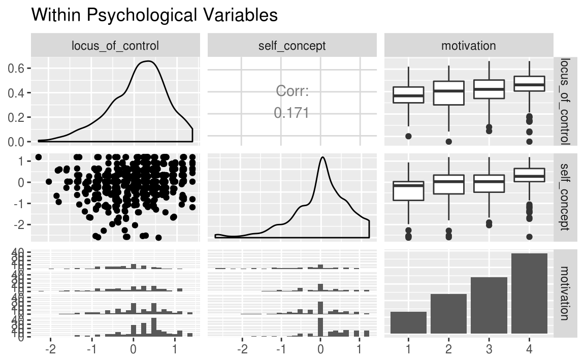
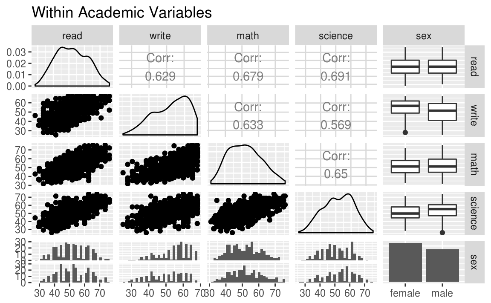
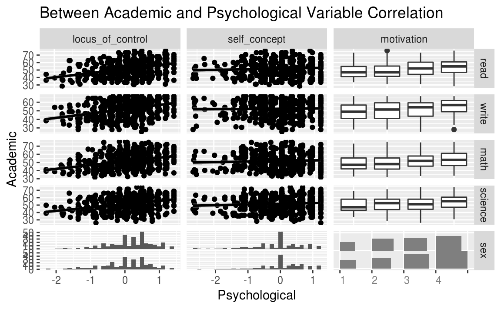

# Correlación Canónica (CCA)

<style>
  .espacio {
    margin-bottom: 1cm;
  }
</style>
  
  <style>
  .espacio3 {
    margin-bottom: 3cm;
  }
</style>

<p class="espacio">
</p>


## CCA vs PCA

<p class="espacio3">
</p>

\BeginKnitrBlock{nota}<div class="nota">* Anteriormente, estudiamos los métodos analíticos de factores como un enfoque para comprender las fuentes clave de variación _dentro_ de conjuntos de variables.

* Hay situaciones en las que tenemos varios conjuntos de variables, y buscamos una comprensión de las dimensiones clave que se correlacionan _entre_ conjuntos.

* El análisis de correlación canónica es uno de los métodos más antiguos y mejor conocidos para descubrir y explorar dimensiones que están correlacionadas _entre_ conjuntos, pero no están correlacionadas _dentro_ del conjunto.</div>\EndKnitrBlock{nota}

<p class="espacio3">
</p>


El análisis de correlación canónica se concentra en la correlación entre una _combinación lineal_ de variables en un conjunto y la _combinación lineal_ de variables en otro conjunto. La idea es determinar primero el par de combinaciones lineales que tienen la combinación lineal más grande. Después, el par de combinaciones lineales que tienen correlación más grande entre todos los pares que no están correlacionados con el primero, y así sucesivamente.

A los pares de combinaciones lineales se les llama _variables canónicas_ y a sus correlaciones se les llama _correlaciones canónicas_.

Las correlaciones canónicas miden qué tan fuerte es la asociación entre dos conjuntos de variables. 

## Variables y correlaciones canónicas

Nos interesa medir la asociación entre _dos_ grupos de variables:

* El primer grupo (de $p$ variables) está representado por vector aleatorio $X^{(1)}$

* El segundo grupo (de $q$ variables) está representado por otro vector aleatorio $X^{(2)}$

Suponemos en lo que sigue que $p \leq q$.

Para los vectores aleatorios $X^{(1)}$ y $X^{(2)}$ sea

$$
E(X^{(1)}) = \mu^{(1)},\qquad \mbox{Var}(X^{(1)}) = \Sigma_{11}
$$

$$
E(X^{(2)}) = \mu^{(2)},\qquad \mbox{Var}(X^{(2)}) = \Sigma_{22}
$$

$$
\mbox{Cov}\left(X^{(1)},X^{(2)}\right) = \Sigma_{12} = \Sigma_{21}
$$

Ponemos

$$
X = \left(X^{(1)}, X^{(2)}\right)
$$

con vector de media

$$
\mu = (\mu^{(1)},\mu^{(2)})
$$

y matriz de covarianzas

$$
\Sigma = \left[
\begin{array}{c|c}
\Sigma_{11} & \Sigma_{12} \\
\hline
\Sigma_{21} & \Sigma_{22}
\end{array}
\right]
$$

<p class="espacio">
</p>

\BeginKnitrBlock{nota}<div class="nota">Observaciones:

* Las correlaciones entre pares de variables, una de $X^{(1)}$ y la otra de $X^{(2)}$ está contenidas en la matriz $\Sigma_{12}$.

* $\Sigma_{12}$ es de dimensión $pq$. Si $p$ y $q$ son grandes, la interpretación de $\Sigma_{12}$ puede ser muy complicada. En este caso, es usual interpretar más fácilmente combinaciones lineales de las variables de cada grupo.

* La tarea principal del _análisis canónico_ es resumir la asociación entre $X^{(1)}$ y $X^{(2)}$.</div>\EndKnitrBlock{nota}

<p class="espacio">
</p>

### Combinaciones lineaes de factores

Las combinaciones lineales proveen de interpretación a conjuntos de variables. Sea

$$
\begin{eqnarray*}
U &=& a^T X^{(1)} \\
V &=& b^T X^{(2)}
\end{eqnarray*}
$$

para un par de vectores $a$ y $b$. Por lo tanto,

$$
\mbox{Var}(U) = a^T \mbox{Var}(X^{(1)}) a = a^T\Sigma_{11}a
$$

$$
\mbox{Var}(V) = b^T \mbox{Var}(X^{(2)}) b = b^T\Sigma_{22}b
$$

$$
\mbox{Cov}(U,V) = a^T \mbox{Cov}\left(X^{(1)},X^{(2)}\right) b = a^T\Sigma_{12}b.
$$

Buscamos coeficientes de los vectores $a$ y $b$ tales que:

$$
\mbox{Corr}(U,V) = \dfrac{a^T\Sigma_{12}b}{\sqrt{a^T\Sigma_{11}a}\sqrt{b^T\Sigma_{22}b}}.
$$

Sea $k$ entre $1$ y $p\leq q$, entonces al $k$-ésimo par de combinaciones lineales $U_k$ y $V_kl$ con varianzas unitarias y que maximizan la correlación entre las opciones que no estén correlacionadas con las anteriores, se les llama _$k$-ésimo par de variables canónicas_.

<p class="espacio3">
</p>

\BeginKnitrBlock{nota}<div class="nota">Suponemos que $\Sigma_{12}$ es de rango completo, entonces

$$
\max_{u,v}\mbox{Corr}(U,V) = \rho_1^*,
$$

se alcanza en las combinaciones lineales (primer par canónico):

$$
U_{1}=\underbrace{e_{1}^{T}\Sigma_{11}^{-1}}_{a_{1}^{T}}X^{(1)}, \qquad \mbox{ y } \qquad V_{1}=\underbrace{f_{1}^{T}\Sigma_{22}^{-1}}_{b_{1}^{T}}X^{(2)} 
$$

donde $\mbox{Var}\left(X_i^{(1)}\right) = \sigma_{ii}$ para $i=1,2,\ldots,p$.

El $k$-ésimo par de variables canónicas $k=2,3,\ldots,p$,

$$
U_k = e_k^T\Sigma_{11}^{-1/2}X^{(1)},\qquad V_k = f_k^T\Sigma_{22}^{-1/2}X^{(2)}
$$

maximiza 

$$
\mbox{Corr}(U_k,V_k)=\rho_k^*
$$

entre las combinaciones lineales que no están correlacionadas con las variables canónicas precedentes de $1,2,\ldots,k-1$.</div>\EndKnitrBlock{nota}

<p class="espacio3">
</p>

Aquí ${\rho_1^*}^2 \geq {\rho_2^*}^2 \geq \cdots \geq {\rho_p^*}^2$ son los eigenvalores de 

$$
\Sigma_{11}^{-1/2} \Sigma_{12} \Sigma_{22}^{-1} \Sigma_{21} \Sigma_{11}^{-1/2},
$$

y $e_1,e_2,\ldots,e_p$ son los eigenvectores asociados.

De la misma forma ${\rho_1^*}^2,{\rho_2^*}^2,\ldots,{\rho_p^*}^2$ son los eigenvalores asociados a los $p$ eigenvectores de dimensión $q$, $f_1,f_2,\ldots,f_p$, de la matriz 

$$
\Sigma_{22}^{-1/2} \Sigma_{21} \Sigma_{11}^{-1} \Sigma_{12} \Sigma_{22}^{-1/2}.
$$

<p class="espacio">
</p>

\BeginKnitrBlock{information}<div class="information">**Propiedades:** Para $k,\,l = 1,2,\ldots,p$:
  
<p class="espacio">
</p>
  
  
* $\mbox{Var}(U_k) = \mbox{Var}(V_k)$ = 1
  
* $\mbox{Cov}(U_k,U_l) = \mbox{Corr}(U_k,U_l) = 0 \quad k\neq l$
  
* $\mbox{Cov}(V_k,V_l) = \mbox{Corr}(V_k,V_l) = 0 \quad k\neq l$
  
* $\mbox{Cov}(U_k,V_l) = \mbox{Corr}(U_k,V_l) = 0 \quad k\neq l$</div>\EndKnitrBlock{information}

<br>

Si las variables originales están estandarizadas $Z^{(1)}=\left(Z^{(1)}_1,\ldots,Z^{(1)}_p\right)$ entonces

$$
U_k = a_k^T Z^{(1)} = e_k^T \rho_{11}^{-1} Z^{(1)}
$$
$$
V_k = b_k^T Z^{(2)} = f_k^T \rho_{22}^{-1} Z^{(2)}
$$

Aquí sucede que $\mbox{Cov}(Z^{(1)}) = \rho_{11}$, es decir, la covarianza de $Z^{(1)}$ la representamos como matriz de correlaciones utilizando la letra $\rho$, y de forma similar, $\mbox{Cov}(Z^{(2)}) = \rho_{22}$.

Además se puede ver que:

$$
\mbox{Corr}(U_k,V_k) = \rho_k^*, \quad k=1,2,\ldots,p
$$

donde ${\rho_1^*}^2\geq{\rho_2^*}^2\geq\ldots\geq{\rho_p^*}^2$ son los eigenvalores de la matriz

$$
\rho_{11}^{-1/2}\rho_{12}\rho_{22}^{-1}\rho_{21}\rho_{11}^{-1/2}
$$

<br>

---

Notemos que:

$$
\begin{eqnarray*}
a_k^T(X^{(1)}-\mu^{(1)}) &=& a_{k1}(X_1^{(1)}-\mu_1^{(1)}) + \cdots+a_{kp}(X_p^{(1)}-\mu_p^{(1)})\\
&=& a_{k1}\sqrt{\sigma_{11}}\dfrac{(X_1^{(1)}-\mu_1^{(1)})}{\sqrt{\sigma_{11}}} + \cdots+a_{kp}\sqrt{\sigma_{pp}}\dfrac{(X_p^{(1)}-\mu_p^{(1)})}{\sqrt{\sigma_{pp}}}.
\end{eqnarray*}
$$

Por lo tanto, los coeficientes canónicos de las variables estandarizadas

$$
Z_i ^{(1)} = \dfrac{X_i^{(1)}- \mu_i^{(1)}}{\sqrt{\sigma_{ii}}}
$$

están relacionados simplemente con los coeficientes canónicos de la variable original $X_i^{(1)}$. Más específicamente, si $a_k$ es el vector de coeficientes de la $k$-ésima variable canónica $U_k$, entonces

$$
a_k^TV_{11}^{1/2}
$$

es el vector de coeficientes de la $k$-ésima variable canónica de las variables estandarizadas $Z^{(1)}$. Aquí $V_{11}^{1/2}$ es la matriz diagonal con $i$-ésimo elemento $\sqrt{\sigma_{ii}}$.

<p class="espacio3">
</p>
</div>
<br>

 
<div class="centered">
<p class="espacio">
</p>

Al estandarizar las variables $X^{(1)}$ y $X^{(2)}$ y realizar análisis de correlación canónica sobre $Z^{(1)}$ y $Z^{(2)}$, las correlaciones canónicas

(a) Se multiplican por un factor de $\sqrt{\sigma_{ii}}$.

(b) No cambian.

(c) Deben sumar $1$.

(d) Ninguna de las anteriores.

<p class="espacio3">
</p>
</div>
<br>

---


### Ejemplo simple

$$
X=\begin{pmatrix}
1 & 1 & 3 \\
2 & 3 & 2 \\
1 & 1 & 1 \\
1 & 1 & 2 \\
2 & 2 & 3 \\
3 & 3 & 2 \\
1 & 3 & 2 \\
4 & 3 & 5 \\
5 & 5 & 5 
\end{pmatrix}, \qquad Y= \left(\begin{array}{rrr}
4 & 4 & −1.07846 \\
3 & 3 & 1.214359 \\
2 & 2 & 0.307180 \\
2 & 3 & −0.385641 \\
2 & 1 & −0.078461 \\
1 & 1 & 1.61436 \\
1 & 2 & 0.814359 \\
2 & 1 & -0.0641016 \\
1 & 2 & 1.5359 \\
\end{array}\right)
$$

En este ejemplo, construimos la tercera columna de $Y$ de las columnas de $X$ con los pesos lineales $a$ = $(0.4, 0.6, -\sqrt{0.48})$.

Algunas preguntas:

* ¿Cuál debería ser el primer vector de pesos canónicos para las variables $Y$?

* ¿Cuál debería ser la primera correlación canónica?

Respuestas:

* El propósito del análisis de correlación canónica es (a) buscar y (b) caracterizar la redundancia lineal entre ambos conjuntos de variables.

* En nuestro ejemplo simple, una de las variables en $Y$ se puede reproducir exactamente como una combinación lineal de las tres variables en X.

* El análisis de correlación canónica (si funciona correctamente) simplemente seleccionará
$y_3$ como la primera variable canónica en el conjunto $Y$, con pesos canónicos
$b = (0,0,1)$, y recupera la combinación lineal de las variables del primer
grupo utilizada para generar $y_3$, generando $a = (0.4, 0.6, -\sqrt{0.48})$ como los pesos canónicos para el conjunto $X$.

* La primera correlación canónica será, por supuesto, 1.


```r
X <- matrix(c( 1,1,3,2,3,2,1,1,1,
    1,1,2,2,2,3,3,3,2,1,3,2,
    4,3,5,5,5,5),9,3,byrow=T)

Y <- matrix(c( 4,4,-1.07846,
               3,3,1.214359,
               2,2,0.307180,
               2,3,-0.385641,
               2,1,-0.078461,
               1,1,1.61436,
               1,2,0.814359,
               2,1,-0.0641016,
       1,2,1.535900),9,3,byrow=T)
```

Para calcular los pesos completamente, necesitamos las matrices de varianzas y covarianzas para $X$ e $Y$, así como las matrices de covarianza cruzada.


```r
S_xy <- cov(X, Y)
S_xx <- var(X)
S_yx <- cov(Y, X)
S_yy <- var(Y)
S_xy
#>        [,1]   [,2]     [,3]
#> [1,] -0.625 -0.778  0.69679
#> [2,] -0.750 -0.556  0.95242
#> [3,] -0.125 -0.347 -0.00826
```

Ahora que tenemos estas matrices, es fácil calcular los pesos canónicos y las correlaciones canónicas:


```r
A <- eigen(solve(S_xx) %*% S_xy %*% solve(S_yy) %*% S_yx)$vectors
B <- eigen(solve(S_yy) %*% S_yx %*% solve(S_xx) %*% S_xy)$vectors
R <- sqrt(eigen(solve(S_yy) %*% S_yx %*% solve(S_xx) %*% S_xy)$values)
```


```r
A
#>        [,1]   [,2]   [,3]
#> [1,]  0.400  0.796 -0.578
#> [2,]  0.600 -0.584  0.429
#> [3,] -0.693 -0.160  0.695
```


```r
B
#>           [,1]    [,2]   [,3]
#> [1,]  1.94e-07 -0.5365 -0.835
#> [2,] -4.34e-07  0.8438  0.139
#> [3,]  1.00e+00  0.0136 -0.533
```


```r
R
#> [1] 1.000 0.519 0.091
```


## Ejemplo: test psicológico

Supongamos que se desea investigar asociaciones entre mediciones psicológicas y 
medidas de desempeño académico y contamos con datos con 600 observaciones de ocho 
variables. Las variables psicológicas son `locus_of_control`, `self_concept` y `motivation`. 
Las variables académicas son pruebas estandarizadas en lectura (`read`), redacción (`write`),
matemáticas (`math`) y ciencia (`science`). Además, la variable `female` es una variable 
indicadora de que una estudiante es mujer.


```r
library(ggplot2)
library(GGally)
library(CCA)

psychademic %>% head %>% knitr::kable()
```


 locus_of_control   self_concept  motivation    read   write   math   science  sex    
-----------------  -------------  -----------  -----  ------  -----  --------  -------
            -0.84          -0.24  4             54.8    64.5   44.5      52.6  female 
            -0.38          -0.47  3             62.7    43.7   44.7      52.6  female 
             0.89           0.59  3             60.6    56.7   70.5      58.0  male   
             0.71           0.28  3             62.7    56.7   54.7      58.0  male   
            -0.64           0.03  4             41.6    46.3   38.4      36.3  female 
             1.11           0.90  2             62.7    64.5   61.4      58.0  female 

Las variables psicológicas son:


```r
(psych_variables <- attr(psychademic, "psychology"))
#> [1] "locus_of_control" "self_concept"     "motivation"
```

Las variables académicas son:


```r
(academic_variables <- attr(psychademic, "academic"))
#> [1] "read"    "write"   "math"    "science" "sex"
```

Veamos las correlaciones entre las variables psicológicas:


```r
ggpairs(psychademic, psych_variables, title = "Within Psychological Variables")
```



Y entre las académicas:


```r
ggpairs(psychademic, academic_variables, title = "Within Academic Variables")
```



Veamos las correlaciones entre pares de ambos grupos de variables:


```r
ggduo(
  psychademic, psych_variables, academic_variables,
  types = list(continuous = "smooth_lm"),
  title = "Between Academic and Psychological Variable Correlation",
  xlab = "Psychological",
  ylab = "Academic"
)
```



También podemos analizar las correlaciones numéricamente:


```r
datos <- psychademic %>%
  mutate_at(.funs = as.numeric, .vars = vars(-sex)) %>%
  mutate(sex = ifelse(sex == 'female', 1, 0))
matcor(datos[,psych_variables], datos[,academic_variables])
#> $Xcor
#>                  locus_of_control self_concept motivation
#> locus_of_control            1.000        0.171      0.245
#> self_concept                0.171        1.000      0.289
#> motivation                  0.245        0.289      1.000
#> 
#> $Ycor
#>            read write    math science     sex
#> read     1.0000 0.629  0.6793   0.691 -0.0417
#> write    0.6286 1.000  0.6327   0.569  0.2443
#> math     0.6793 0.633  1.0000   0.650 -0.0482
#> science  0.6907 0.569  0.6495   1.000 -0.1382
#> sex     -0.0417 0.244 -0.0482  -0.138  1.0000
#> 
#> $XYcor
#>                  locus_of_control self_concept motivation    read  write
#> locus_of_control            1.000       0.1712     0.2450  0.3736 0.3589
#> self_concept                0.171       1.0000     0.2890  0.0607 0.0194
#> motivation                  0.245       0.2890     1.0000  0.2105 0.2541
#> read                        0.374       0.0607     0.2105  1.0000 0.6286
#> write                       0.359       0.0194     0.2541  0.6286 1.0000
#> math                        0.337       0.0536     0.1949  0.6793 0.6327
#> science                     0.325       0.0698     0.1159  0.6907 0.5691
#> sex                         0.113      -0.1260     0.0979 -0.0417 0.2443
#>                     math science     sex
#> locus_of_control  0.3373  0.3246  0.1134
#> self_concept      0.0536  0.0698 -0.1260
#> motivation        0.1949  0.1159  0.0979
#> read              0.6793  0.6907 -0.0417
#> write             0.6327  0.5691  0.2443
#> math              1.0000  0.6495 -0.0482
#> science           0.6495  1.0000 -0.1382
#> sex              -0.0482 -0.1382  1.0000
```

LLevamos a cabo CCA:


```r
cc1 <- cc(datos[,psych_variables], datos[,academic_variables])

# correlaciones canónicas
cc1$cor
#> [1] 0.464 0.167 0.104
```

Coeficientes canónicos:


```r
cc1[3:4]
#> $xcoef
#>                    [,1]   [,2]   [,3]
#> locus_of_control -1.254 -0.619 -0.663
#> self_concept      0.351 -1.191  0.823
#> motivation       -0.421  0.675  0.670
#> 
#> $ycoef
#>            [,1]     [,2]     [,3]
#> read    -0.0446 -0.00504  0.02123
#> write   -0.0359  0.04198  0.09164
#> math    -0.0234  0.00410  0.00923
#> science -0.0051 -0.08479 -0.10992
#> sex     -0.6321  1.08910 -1.79242
```

<p class="espacio">
</p>

\BeginKnitrBlock{information}<div class="information">**Nota:** 
  
<p class="espacio">
</p>
  
* Las correlaciones anteriores son entre las variables observadas y las variables canónicas, a estas se les conoce como _cargas canónicas_. 

* Las variables canónicas son en realidad un tipo de variable latente.

* En general, el número de dimensiones canónicas es igual al número de variables en el conjunto más pequeño; sin embargo, la cantidad de dimensiones significativas puede ser aún menor. Las dimensiones canónicas, también conocidas como variables canónicas, son variables latentes que son análogas a los factores obtenidos en el análisis de factores. </div>\EndKnitrBlock{information}

<br>

En este ejemplo particular, hay tres dimensiones canónicas, de las cuales solo las dos primeras son estadísticamente significativas.


```r
ev <- (1 - cc1$cor^2)

n <- dim(datos)[1]
p <- length(datos[,psych_variables])
q <- length(datos[,academic_variables])
k <- min(p, q)
m <- n - 3/2 - (p + q)/2

w <- rev(cumprod(rev(ev)))

d1 <- d2 <- f <- vector("numeric", k)

for (i in 1:k) {
    s <- sqrt((p^2 * q^2 - 4)/(p^2 + q^2 - 5))
    si <- 1/s
    d1[i] <- p * q
    d2[i] <- m * s - p * q/2 + 1
    r <- (1 - w[i]^si)/w[i]^si
    f[i] <- r * d2[i]/d1[i]
    p <- p - 1
    q <- q - 1
}

pv <- pf(f, d1, d2, lower.tail = FALSE)
(dmat <- cbind(WilksL = w, F = f, df1 = d1, df2 = d2, p = pv))
#>      WilksL     F df1  df2        p
#> [1,]  0.754 11.71  15 1635 7.79e-28
#> [2,]  0.962  2.94   8 1186 2.97e-03
#> [3,]  0.989  2.16   3  594 9.19e-02
```

Cuando las variables en el modelo tienen desviaciones estándar muy diferentes, los coeficientes estandarizados permiten una comparación más fácil entre las variables. 

Coeficientes canónicos estandarizados para variables psicológicas:


```r
s1 <- diag(sqrt(diag(cov(datos[,psych_variables]))))
s1 %*% cc1$xcoef
#>        [,1]   [,2]   [,3]
#> [1,] -0.841 -0.415 -0.444
#> [2,]  0.248 -0.840  0.581
#> [3,] -0.432  0.693  0.688
```

Coeficientes canónicos estandarizados para variables académicas:


```r
s2 <- diag(sqrt(diag(cov(datos[,academic_variables]))))
s2 %*% cc1$ycoef
#>         [,1]    [,2]    [,3]
#> [1,] -0.4506 -0.0509  0.2145
#> [2,] -0.3489  0.4083  0.8914
#> [3,] -0.2202  0.0386  0.0869
#> [4,] -0.0495 -0.8229 -1.0669
#> [5,] -0.3150  0.5428 -0.8933
```

Los coeficientes canónicos estandarizados se interpretan de manera análoga a la interpretación de los coeficientes de regresión estandarizados. Por ejemplo, para la variable de lectura, un aumento de la desviación estándar en lectura se refleja en una disminución de 0.45 desviaciones estándar de en la primera variable canónica del conjunto 2 cuando las otras variables en el modelo se mantienen constantes.


## Tarea

Como parte de un estudio más amplio de los efectos de la estructura organizacional en la "satisfacción laboral", Dunham\ investigó en qué medida las medidas de satisfacción laboral están relacionadas con las características del trabajo. Utilizando un instrumento de encuesta, Dunham obtuvo medidas de $p = 5$ características del trabajo y $q = 7$ variables de satisfacción laboral para $n = 784$ ejecutivos de la rama corporativa de una gran corporación comercial minorista. ¿Las medidas de satisfacción laboral están asociadas con las características del trabajo? La respuesta puede tener implicaciones para el diseño del trabajo.


```r
library(tidyverse)
worksat <- read_csv("datos/worksat.csv")
worksat %>% str() 
#> Classes 'tbl_df', 'tbl' and 'data.frame':	784 obs. of  13 variables:
#>  $ ID                          : int  1 2 3 4 5 6 7 8 9 10 ...
#>  $ SupervisorSatisfaction(Y1)  : num  -0.1529 -1.2486 0.8356 0.0264 0.4826 ...
#>  $ CareerFutureSatisfaction(Y2): num  -2.04 -1.083 1.439 0.441 0.652 ...
#>  $ FinancialSatisfaction(Y3)   : num  -2.083 -1.295 0.392 -0.591 0.872 ...
#>  $ WorkloadSatisfaction(Y4)    : num  -0.553 -0.633 0.488 0.986 -1.424 ...
#>  $ CompanyIdentification(Y5)   : num  -1.7599 0.0725 0.4898 -0.0888 -0.7677 ...
#>  $ WorkTypeSatisfaction(Y6)    : num  -2.027 -0.38 -1.992 1.477 -0.404 ...
#>  $ GeneralSatisfaction(Y7)     : num  -2.304 1.19 1.591 0.793 -0.772 ...
#>  $ FeedbackQuality(X1)         : num  -0.347 -0.737 -0.382 0.432 -1.029 ...
#>  $ TaskSignificance(X2)        : num  -0.75 -1.038 -1.557 0.187 -0.627 ...
#>  $ TaskVariety(X3)             : num  -1.33 0.626 0.604 0.833 0.229 ...
#>  $ TaskIdentity(X4)            : num  -2.706 0.2 -1.308 1.335 0.177 ...
#>  $ Autonomy(X5)                : num  -1.815 0.673 -0.994 0.138 -0.508 ...
#>  - attr(*, "spec")=List of 2
#>   ..$ cols   :List of 13
#>   .. ..$ ID                          : list()
#>   .. .. ..- attr(*, "class")= chr  "collector_integer" "collector"
#>   .. ..$ SupervisorSatisfaction(Y1)  : list()
#>   .. .. ..- attr(*, "class")= chr  "collector_double" "collector"
#>   .. ..$ CareerFutureSatisfaction(Y2): list()
#>   .. .. ..- attr(*, "class")= chr  "collector_double" "collector"
#>   .. ..$ FinancialSatisfaction(Y3)   : list()
#>   .. .. ..- attr(*, "class")= chr  "collector_double" "collector"
#>   .. ..$ WorkloadSatisfaction(Y4)    : list()
#>   .. .. ..- attr(*, "class")= chr  "collector_double" "collector"
#>   .. ..$ CompanyIdentification(Y5)   : list()
#>   .. .. ..- attr(*, "class")= chr  "collector_double" "collector"
#>   .. ..$ WorkTypeSatisfaction(Y6)    : list()
#>   .. .. ..- attr(*, "class")= chr  "collector_double" "collector"
#>   .. ..$ GeneralSatisfaction(Y7)     : list()
#>   .. .. ..- attr(*, "class")= chr  "collector_double" "collector"
#>   .. ..$ FeedbackQuality(X1)         : list()
#>   .. .. ..- attr(*, "class")= chr  "collector_double" "collector"
#>   .. ..$ TaskSignificance(X2)        : list()
#>   .. .. ..- attr(*, "class")= chr  "collector_double" "collector"
#>   .. ..$ TaskVariety(X3)             : list()
#>   .. .. ..- attr(*, "class")= chr  "collector_double" "collector"
#>   .. ..$ TaskIdentity(X4)            : list()
#>   .. .. ..- attr(*, "class")= chr  "collector_double" "collector"
#>   .. ..$ Autonomy(X5)                : list()
#>   .. .. ..- attr(*, "class")= chr  "collector_double" "collector"
#>   ..$ default: list()
#>   .. ..- attr(*, "class")= chr  "collector_guess" "collector"
#>   ..- attr(*, "class")= chr "col_spec"
```

1. Calcula la matriz de correlaciones muestrales basada en las 784 observaciones.

2. Encuentra los eigenvalores de $\Sigma_{11}^{-1/2} \Sigma_{12} \Sigma_{22}^{-1} \Sigma_{21} \Sigma_{11}^{-1/2}$ y verifica que estos eigenvalores son los mismos eigenvalores de $\Sigma_{22}^{-1/2} \Sigma_{21} \Sigma_{11}^{-1} \Sigma_{12} \Sigma_{22}^{-1/2}$.

3. Calcula todas las correlaciones canónicas y las variables canónicas. 

4. Reporta los coeficientes de las variables canónicas e interpreta el primer par de variables canónicas. Primero analiza qué variables contribuyen más a cada variable canónica. Para proporcionar interpretaciones de $U_1$ y $V_1$, calcula las correlaciones muestrales entre $U_1$ y las variables que la componen y entre $V_1$ y sus variables respectivas. Además, haz una tabla que muestre las correlaciones entre las variables de un conjunto y la primera variable canónica del otro conjunto.

5. Sean $Z^{(l)}$ y $Z^{(2)}$ las variables estandarizadas correspondientes a $X^{(1)}$ y $X^{(2)}$,
respectivamente. ¿Qué proporción de la varianza muestral total de $Z^{(1)}$ se explica por la variable canónica $U_1$? ¿Qué proporción de la varianza muestral total de $Z^{(2)}$ se explica por la variable canónica $V_1$? Discute tus respuestas.

#### Referencias {-}+

* Dunham, R. B. (1977). Reactions to job characteristics: Moderating effects of the organization. Academy of Management Journal, 20(1), 42-65.
