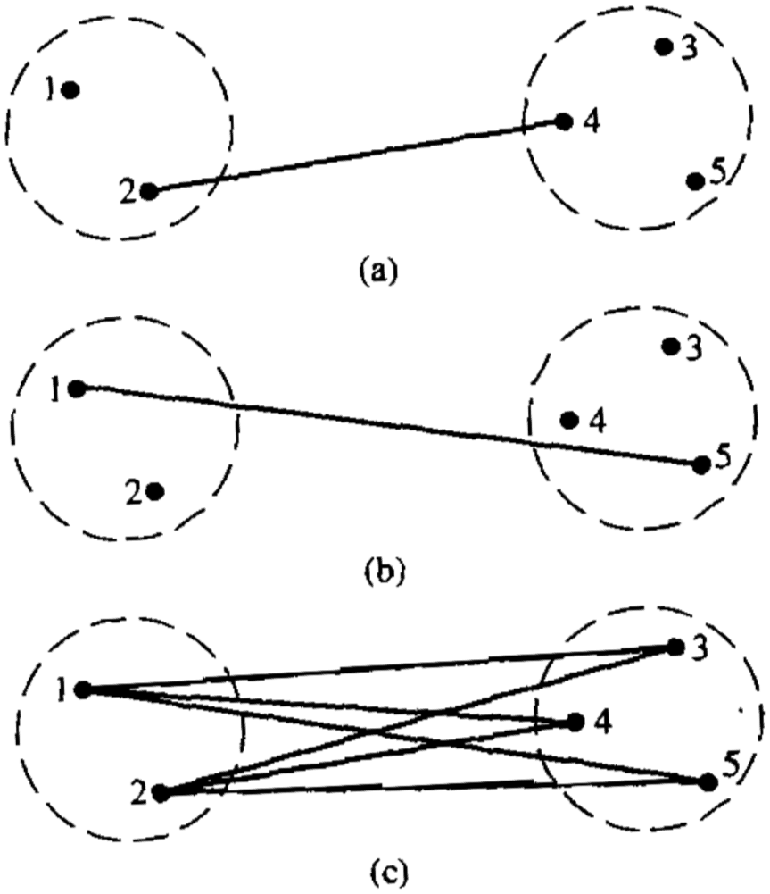
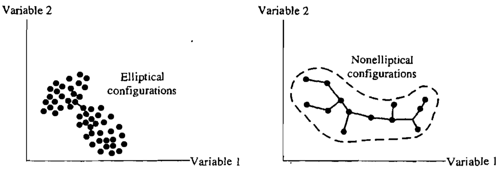
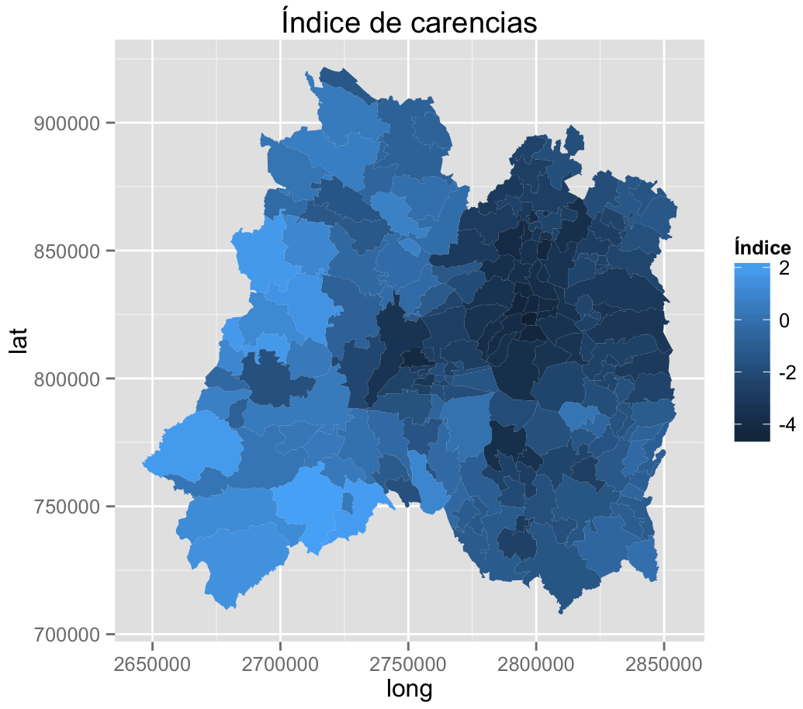
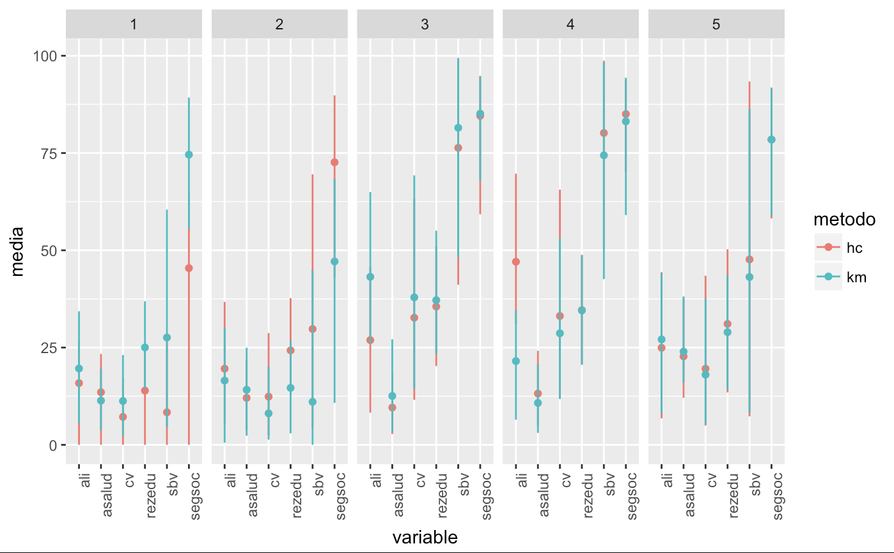

# Conglomerados (clustering) 2

<style>
  .espacio {
    margin-bottom: 1cm;
  }
</style>
  
  <style>
  .espacio3 {
    margin-bottom: 3cm;
  }
</style>

<p class="espacio">
</p>

```{r message=FALSE, warning=FALSE}
library(tidyverse)
```

## Clustering jerárquico

El clustering jerárquico es un algoritmo de agrupamiento _aglomerativo_. Cada muestra se asigna a su propio grupo y luego el algoritmo continúa iterativamente, uniendo los dos grupos más similares en cada paso y continuando hasta que solo haya un grupo. 

Así pues, en el clustering aglomerativo, se comienza con los objetos individuales. Por lo que, inicialmente se tienen tantos clusters como objetos. Nos referimos a _objetos_ porque los _métodos de enlace_ se pueden aplicar tanto a observaciones como a variables en los datos.

Los pares de objetos más similares se agrupan primero, y posteriormente estos grupos se mezclan sucesivamente de acuerdo con sus similitudes.

## Métodos de enlace (Cluster Linkage)

Los métodos de enlace son útiles para agrupar observaciones y variables. Vamos a ver:

* Enlace simple: mínima distancia o vecino más cercano

* Enlace completo: máxima distancia o vecino más lejano

* Enlace promedio: distancia promedio

La mezcla de clusters bajo los tres criterios de enlace la podemos ver en el siguiente diagrama:

```{r, echo = F, fig.align='center', dpi=150}

```

a. enlace simple: $d_{24}$

b. enlace completo: $d_{15}$

c. enlace promedio: $\dfrac{d_{13}+d_{14}+d_{15}+d_{23}+d_{24}+d_{25}}{6}$


El enlace simple hace que los grupos se fusionen de acuerdo con la distancia entre sus miembros más cercanos. En el enlace completo los grupos se fusionan de acuerdo con la distancia entre sus miembros más lejanos. Y en el enlace promedio los grupos se fusionan de acuerdo con la distancia promedio entre todos los pares de miembros en los respectivos grupos.

Los siguientes son los pasos para hacer clustering jerárquico para $N$ objetos (observaciones o variables):

1. Comienza con $N$ clusters, cada uno con un solo elemento y una matriz de $N\times N$ de distancias (o similitudes) $D=\{d_{jk}\}$.

2. Busca la matriz de distancias el par de elementos más cercanos (más similares). Sea $d_{UV}$ la distancia entre el par de clusters "más similares" $U$ y $V$.

3. Une los clusters $U$ y $V$. Nombra el nuevo cluster como $(UV)$. Actualiza las entradas en la matriz de distancias:

  (a) eliminar filas y columnas correspondientes to $U$ y $V$ y
  
  (b) agregar una fila y columna con las distancias de $(UV)$ a los demás grupos.
  
4. Repetir los pasos $2$ y $3$ $N-1$ veces. Todos los objetos al final pertenecerán al mismo cluster. Se debe registrar qué elementos se unen en cada iteración y la distancias mínimas en las cuáles se hacen los agrupamientos.

### Enlace simple

Los grupos se forman uniendo _vecinos más cercanos_:

* Se calcula la matriz $D=\{d_{jk}\}$ y se unen clusters con mínima distancia $d_{UV}$

$$
d_{(UV)W} = \min{\{d_{UW},d_{VW}\}}
$$
donde $d_{UW},d_{VW}$ son las distancias de los vecinos más cercanos de $U$ y $W$, y $V$ y $W$, respectivamente.

#### Ejemplo {-}

Aquí hay un ejemplo simple que demuestra cómo funciona la agrupación jerárquica. Primero simularemos algunos datos en tres clústeres separados.

```{r}
set.seed(1234)
x <- rnorm(12, rep(1:3,each=4), 0.2)
y <- rnorm(12, rep(c(1,2,1),each=4), 0.2)
plot(x,y,col="blue",pch=19,cex=2)
text(x+0.05,y+0.05,labels=as.character(1:12))
```

El primer paso en el enfoque de agrupamiento básico es calcular la distancia entre cada punto con cada otro punto. El resultado es una matriz de distancias, que se puede calcular con la función `dist()` en R.

Aquí hay solo una parte de la matriz de distancias asociada con la figura de arriba.

```{r}
dataFrame <- data.frame(x=x, y=y)
dist(dataFrame)
```

La métrica de distancia predeterminada utilizada por la función `dist()` es la distancia euclidiana.

Generalmente no tenemos que calcular explícitamente la matriz de distancias (a menos que esté inventando su propio método de agrupamiento). 

En primer lugar, el enfoque aglomerativo intenta encontrar los dos puntos más cercanos entre sí. En otras palabras, queremos encontrar la entrada más pequeña que no sea cero en la matriz de distancias.

```{r}
rdistxy <- as.matrix(dist(dataFrame))

## Quitar la diagonal para calcular mínima distancia
diag(rdistxy) <- diag(rdistxy) + 1e5

# Índice de la mínima distancia
ind <- which(rdistxy == min(rdistxy),arr.ind=TRUE)
ind
```

Ahora podemos trazar los puntos y mostrar qué dos puntos están más cerca entre sí de acuerdo con nuestra métrica de distancia.

```{r}
plot(x,y,col="blue",pch=19,cex=2)
text(x+0.05,y+0.05,labels=as.character(1:12))
points(x[ind[1,]],y[ind[1,]],col="orange",pch=19,cex=2)
```

El siguiente paso para el algoritmo es comenzar a dibujar el árbol, el primer paso sería "fusionar" estos dos puntos.

```{r}
par(mfrow = c(1, 2))
plot(x,y,col="blue",pch=19,cex=2, main = "Data")
text(x+0.05,y+0.05,labels=as.character(1:12))
points(x[ind[1,]],y[ind[1,]],col="orange",pch=19,cex=2)

hcluster <- dist(dataFrame) %>% hclust
dendro <- as.dendrogram(hcluster)
cutDendro <- cut(dendro,h=(hcluster$height[1]+0.00001) )
plot(cutDendro$lower[[11]],yaxt="n",main="Comenzar árbol")
```

Ahora que hemos combinado las dos primeras "hojas" de este árbol, podemos activar el algoritmo y continuar construyendo el árbol. Ahora, los dos puntos que identificamos en la iteración anterior se "fusionarán" en un solo punto, como se muestra a continuación.

```{r}
rdistxy <- dist(dataFrame) %>% as.matrix
diag(rdistxy) <- diag(rdistxy) + 1e5

# Encontrar índice de mínima distancia
ind <- which(rdistxy == min(rdistxy),arr.ind=TRUE)

# Graficamos
plot(x,y,col="blue",pch=19,cex=2)
text(x+0.05,y+0.05,labels=as.character(1:12))
points(x[ind[1,]],y[ind[1,]],col="orange",pch=19,cex=2)
points(mean(x[ind[1,]]),mean(y[ind[1,]]),col="black",cex=3,lwd=3,pch=3)
points(mean(x[ind[1,]]),mean(y[ind[1,]]),col="orange",cex=5,lwd=3,pch=1)
```

Necesitamos buscar en la matriz de distancias los próximos dos puntos más cercanos, ignorando los primeros dos que ya fusionamos.

```{r}
nextmin <- rdistxy[order(rdistxy)][3]
ind <- which(rdistxy == nextmin,arr.ind=TRUE)
ind
```

Ahora podemos trazar los datos con este próximo par de puntos y la hojas del árbol fusionado.

```{r, out.width='100%'}
par(mfrow=c(1,3))
plot(x,y,col="blue",pch=19,cex=2)
text(x+0.05,y+0.05,labels=as.character(1:12))
points(x[c(5,6)],y[c(5,6)],col="orange",pch=19,cex=2)
points(x[ind[1,]],y[ind[1,]],col="red",pch=19,cex=2)

# Gráfica del dendrograma
distxy <- dist(dataFrame)
hcluster <- hclust(distxy)
dendro <- as.dendrogram(hcluster)
cutDendro <- cut(dendro,h=(hcluster$height[2]) )
plot(cutDendro$lower[[10]],yaxt="n")
plot(cutDendro$lower[[5]],yaxt="n")
```

En la siguiente iteración se deberá unir

Y así sucesivamente. Si tuviéramos que continuar de esta manera, identificando los dos puntos más cercanos y fusionándolos, terminaríamos con un dendrograma que se parece a este. Aquí, llamamos a `hclust()` para ejecutar el algoritmo de agrupamiento.

```{r}
hClustering <- data.frame(x=x,y=y) %>% dist %>% hclust
plot(hClustering)
```

Los resultados del procedimiento anterior se pueden representar gráficamente en la forma de un diagrama de árbol conocido como _dendrograma_. Las ramas representan clusters y las ramas se juntan en la unión de dos grupos en el nivel de la distancia mínima que se indica claramente con respecto a un eje de la gráfica.  

Del dendrograma anterior está claro que hay tres clusters, cada uno con cuatro puntos.


El enlace simple junta clusters basándose en la distanccia más corta entre ellos, por lo que la técnica no puede diferenciar entre clusters no muy bien diferenciados. 

Por otro lado, es uno de los pocos métodos que puede delinear clusters no elipsoidales. Esta tendencia a elegir clusters largos encadenados se conoce como _encadenamiento_ (o chaining). El encadenamiento puede ser confuso si los elementos de un extremo de la cadena son muy diferentes a los elementos del otro extremo.

```{r, echo = F, fig.align='center', dpi=130}

```


### Enlace completo

El algoritmo de nuevo comienza enocntrando el elemento mínimo en $D=\{d_{jk}\}$ y uniendo los objetos correspondientes, tales como $U$ y $V$, para obtener el cluster $(UV)$. En el paso 3 del algoritmo se calcula la distancia entre $(UV)$ y un un cluster $W$ como

$$
d_{(UV)W} = \max\{d_{UW},d_{VW}\}
$$

### Enlace promedio

En el enlace promedio la distancia entre clusters se calcula como el _promedio_ de las distancias entre pares de elementos en donde un miembro del para pertenece a cada cluster.

```{r}
dataFrame <- data.frame(x=x,y=y)
plot(x,y,col="blue",pch=19,cex=2)
points(mean(x[1:4]),mean(y[1:4]),col="orange",pch=3,lwd=3,cex=3)
points(mean(x[5:8]),mean(y[5:8]),col="orange",pch=3,lwd=3,cex=3)
segments(mean(x[1:4]),mean(y[1:4]),mean(x[5:8]),mean(y[5:8]),lwd=3,col="orange")
```

De nuevo, la entrada de cada grupo son observaciones o variables. El algoritmo calcula la distancia entre un cluster $(UV)$ y un cluster $W$ como

$$
d_{(UV)W} = \dfrac{\sum_i\sum_k d_{ik}}{N_{(UV)}N_W}
$$

donde $d_{ik}$ es la distancia entre el objeto $i$ del cluster $(UV)$ y el objeto $k$ del cluster $W$, y $N_{(UV)}$ y $N_W$ son el número de elementos en los clusters $(UV)$ y $W$, respectivamente.

## Ejemplo: genes de tejidos

Veremos los conceptos y el código necesarios para realizar el análisis de clustering con los datos de expresión genética del tejido:

```{r message=FALSE, warning=FALSE}
tissues <- read_csv("datos/tissuesGeneExpression.csv")
dim(tissues)
```

Sabemos que en general son tejidos _diferentes_, pero pretendemos que no sabemos para ver los resultados del clustering jerárquico. El primer paso es calcular la distancia entre cada observación:

```{r}
e <- tissues %>% select(starts_with('X')) %>% as.matrix
d <- dist(e)
str(d)
```

Este es de tamaño:

$$
\dfrac{N(N-1)}{2}=\dfrac{189\times188}{2} = 17766.
$$

Con la distancia entre cada par de muestras calculadas, necesitamos algoritmos de agrupamiento para unirlos en grupos. La agrupación jerárquica es uno de los muchos algoritmos de agrupamiento disponibles para hacer esto. Cada muestra se asigna a su propio grupo y luego el algoritmo continúa iterativamente, uniendo los dos grupos más similares en cada paso y continuando hasta que solo haya un grupo. Si bien hemos definido las distancias entre las muestras, aún no hemos definido las distancias entre los grupos. Se pueden hacer varias cosas de este modo y todas dependen de las distancias pares individuales. El archivo de ayuda para `hclust` incluye información detallada.

Podemos realizar una agrupación jerárquica basada en las distancias definidas anteriormente utilizando la función `hclust`. Esta función devuelve un objeto `hclust` que describe las agrupaciones que se crearon utilizando el algoritmo descrito anteriormente.

```{r, out.width='100%'}
hc <- hclust(d)
plot(hc,labels=tissues$Tissue,cex=0.5)
```

¿Esta técnica "descubre" los grupos definidos por los diferentes tejidos? En esta gráfica, no es fácil ver los diferentes tejidos, así que agregamos colores usando la función `myplclust` del paquete `rafalib`.

```{r, out.width='100%'}
library(rafalib)
myplclust(hc, labels=tissues$Tissue, lab.col=as.fumeric(tissues$Tissue), cex=0.5)
```

Otra forma de calcular el dendrograma cuando no se tienen tantas observaciones es con la función `fviz_dend` del paquete `factoextra`.

```{r, out.width='100%'}
res.hc <- tissues %>% 
  select(starts_with('X')) %>% 
  as.matrix %>%
  dist(method = "euclidean") %>% # Calcula matriz de disimilitudes
  hclust(method = "average")     # Calcula clustering jerárquico

# Corta en 4 grupos y colorea por grupo
library(factoextra)
fviz_dend(res.hc, k = 6, 
          cex = 0.5, 
          color_labels_by_k = TRUE, # color de etiquetas por grupo
          rect = TRUE # Agrega rectángulo en cada grupo
          )
```

Visualmente, parece que la técnica de agrupamiento ha descubierto los tejidos. Sin embargo, la agrupación jerárquica no define clústeres específicos, sino que define el dendrograma anterior. Desde el dendrograma podemos descifrar la distancia entre dos grupos observando la altura a la cual los dos grupos se dividen en dos. Para definir clusters, necesitamos "cortar el árbol" a cierta distancia y agrupar todas las muestras que están dentro de esa distancia en grupos a continuación. Para visualizar esto, dibujamos una línea horizontal a la altura que queremos cortar y esto define esa línea. Usamos 120 como ejemplo:

```{r, out.width='100%'}
myplclust(hc, labels=tissues$Tissue, lab.col=as.fumeric(tissues$Tissue),cex=0.5)
abline(h = 120)
```

Si usamos la línea de arriba para cortar el árbol en grupos, entonces podemos examinar cómo los grupos se superponen con los tejidos reales. Para esto utilizamos la función `cutree`.

```{r}
hclusters <- cutree(hc, h=120)
table(true=tissues$Tissue, cluster=hclusters)
```

También podemos pedirle a `cutree` que nos devuelva un número determinado de clusters. La función entonces automáticamente encuentra la altura que resulta en el número solicitado de clusters:

```{r}
hclusters <- cutree(hc, k=8)
table(true=tissues$Tissue, cluster=hclusters)
```

En ambos casos, vemos que, con algunas excepciones, cada tejido está representado de manera única por uno de los grupos. En algunos casos, el único tejido se extiende a través de dos tejidos, lo cual se debe a la selección de demasiados grupos. La selección de la cantidad de clusters generalmente es un paso desafiante en la práctica y un área activa de investigación.

## Mapas de calor

Los _mapas de calor_ son diagramas muy útiles para visualizar las observaciones. Se agregan dendogramas en la parte superior y en el lado que se crea con la agrupación jerárquica.

Utilizamos la función `heatmap.2` del paquete `gplots` y las primeras _cinco_ componentes principales:

```{r, message=FALSE}
library(gmodels)
pc.res <- tissues %>% 
  select(starts_with('X')) %>% 
  fast.prcomp()
```

Vemos una gráfica de los eigenvalores calculado en componentes principales:

```{r}
fviz_eig(pc.res, geom = 'line', ncp = 30)
```

Por lo tanto, consideramos que sólo sería necesario usar las primeras 8 componentes principales para explicar la mayoría de la variación en los datos.

```{r, message=FALSE}
PCA <- pc.res$x[,1:8]
colnames_PCA <- paste0('PC',1:8)

tissues_pca <- PCA %>%
  as.tibble()

colnames(tissues_pca) <- colnames_PCA
```

Hacemos el clustering jerárquico utilizando el método de enlace completo:

```{r}
pca.hc <- tissues_pca %>% 
  as.matrix %>%
  dist(method = "euclidean") %>%
  hclust(method = "complete")
```

Veamos el mapa de calor con dendrogramas. Primero hacemos el truncamiento del árbol:

```{r, warning=FALSE, message=FALSE}
# Truncamiento del árbol
mycl <- cutree(pca.hc, h = max(pca.hc$height)/1.5)
```

Obtenemos los colores de arcoiris :) 🌈

```{r}
x = as.matrix(tissues_pca)
rc <- rainbow(nrow(x), start=0, end=.3)
cc <- rainbow(ncol(x), start=0, end=.3)
```

Graficamos el mapa de calor:

```{r}
library(gplots)
par(mar=c(0.1,0.1,0.1,0.1))
heatmap.2(x = x, 
          hclustfun = hclust,
          keysize = 3,
          scale = 'row',
          col = cm.colors(255),
          reorderfun = function(d, w) reorder(d, w, agglo.FUN = mean),
          dendrogram = 'both', 
          density = "density",
          RowSideColors = rc, 
          ColSideColors = cc,
          tracecol = "olivedrab1"
  )
```

## Método de Ward

Ward [@ward1963hierarchical] consideró el procedimiento de clustering jerárquico pero basándose mejor en minimizar la "pérdida de información" de unir dos grupos. 

<p class="espacio">
</p>

```{block2, type = "information"}
En la _teoría de la información_, la **entropía de Shannon** es una medida de la incertidumbre asociada a una variable aleatoria. En otras palabras, cuantifica el contenido de información promedio que un receptor pierde cuando no conoce el valor de la variable aleatoria.
```

<br>

Ward calculó la _pérdida de información_ como el incremento en un criterio de error de suma de cuadrados $\mbox{ESS}$. Primero, dado un cluster $k$, definimos $\mbox{ESS}_k$ como la suma de las desviaciones al cuadrado de cada observación en el cluster a su respectivo centroide (la media del clúster). 

Si se tienen $K$ clusters, definimos $\mbox{ESS}$ como

$$
\mbox{ESS} = \mbox{ESS}_1 + \mbox{ESS}_2 + \cdots + \mbox{ESS}_K.
$$

En cada paso del análisis, se considera la unión de cada posible par de clusters, y los dos clusters cuya unión resulte en un menor incremento del $\mbox{ESS}$ (mínima pérdida de información) se combinan.

Inicialmente, cada cluster consiste de un solo elemento, y si hay $N$ elementos, $\mbox{ESS}_k=0,\, k=1,2,\ldots,N$, por lo que $\mbox{ESS}=0$. En el otro extremo, cuando todas las observaciones se combinan en un mismo cluster de $N$ elementos, el valor de $\mbox{ESS}$ está dado por

$$
\mbox{ESS} = \sum_{j=1}^N{(x_j - \bar{x})^T(x_j - \bar{x})}
$$

donde $x_j$ es el vector asociado a la $j$-ésima observación y $\bar{x}$ es la media de _todas las observaciones_.

## Tarea

Sustituye los espacios que digan `<rellenar>`.

1. Utiliza la función `fviz_nbclust` del paquete `factoextra` para producir una gráfica de

$$W(C) = \sum_{k=1}^K W(C_k),$$

es decir, las distancias **dentro de cada grupo** (within groups), que también llamamos la _suma total de cuadrados _intracluster_, para cada tamaño de cluster $k=1,2,\ldots,12$ utilizando el método de _k-medias_.

```{r message=FALSE, warning=FALSE, paged.print=TRUE}
library(tidyverse)
library(factoextra)

coneval <- read_csv("datos/carencias_coneval.csv") 

coneval %>% head()
```

```{r, eval=FALSE}
coneval %>% 
  select(-cve_muni, -entidad, -municipio) %>% 
  fviz_nbclust(kmeans, method = <rellenar>, k.max = <rellenar>)
```

2. Determina cuál debe ser el número óptimo de clusters $k$ y explica por qué.

3. Utiliza la función `fviz_cluster` para hacer una gráfica con las dos primeras componentes principales y con las observaciones representadas como _puntos_ y colores conforme a cada grupo
utilizando el método de clustering de `k-medias` con 100 puntos de inicio aleatorios.

```{r message=FALSE, warning=FALSE, eval=FALSE}
coneval_escalado <- coneval %>% 
  select(-cve_muni, -entidad, -municipio) %>%
  mutate_all(funs(scale))

set.seed(123456)
km.res <- kmeans(<rellenar>, centers = <rellenar>, nstart = <rellenar>)

# Gráfica de componentes principales y clusters
fviz_cluster(km.res, 
             geom = "point",
             ellipse.type = "euclid",
             data = coneval[, -c(1,2,3)],
             palette = "Set2", 
             ggtheme = theme_minimal())
```

4. Ahora realiza clustering jerárquico con los datos de carencias utilizando el método de Ward. Para esto usa la función `hcut` del paquete `factoextra`.

```{r message=FALSE, warning=FALSE, eval=FALSE}
hc.cut <- hcut(coneval_escalado, 
               k = <rellenar>, 
               hc_func = "hclust",
               hc_method = "ward.D2", 
               hc_metric = "euclidean")

library(rafalib)
myplclust(hc.cut, labels=1:2457, lab.col=as.character(hc.cut$cluster), cex=0.5)
```

Podríamos hacer también un dendrograma circular:

```{r message=FALSE, warning=FALSE, out.width='100%', eval=FALSE}
library(ape)
colors = c("#2E9FDF", "#FF00FF", "#00AFBB", "#D8BFD8", "#FC4E07")
clus4 = cutree(hc.cut, 5)
par(mar=c(0.1,0.1,0.1,0.1))
plot(as.phylo(hc.cut), type = "fan", tip.color = colors[clus4],
     label.offset = 1, cex = 0.7)
```

5. Haz una gráfica de componentes utilizando clustering jerárquico con el método de Ward. ¿Cómo se compara con la clasificación obtenida con el método de k-medias?

```{r, eval=FALSE, echo=FALSE}
fviz_cluster(hc.cut, 
             hc_func = "hclust",
             hc_method = "ward.D2",  
             hc_metric = "euclidean",
             ellipse.type = "euclid",
             geom = "point",
             palette = "Set2", 
             ggtheme = theme_minimal()
             )
```

6. Haz un mapa a nivel municipio utilizando la clasificación de clustering jerárquico con el método de Ward y $k = 5$ clusters.

```{r message=FALSE, warning=FALSE, out.width='100%', eval=FALSE}
# Clustering jerárquico 
coneval$cluster_hc <- coneval_escalado %>% 
  hcut(k = <rellenar>, hc_func = <rellenar>, hc_method = <rellenar>, hc_metric = <rellenar>) %>%
  .$cluster

coneval <- coneval %>% mutate(cluster_hc = as.factor(cluster_hc))

library(rgdal)
library(rgeos)
library(ggmap)

# Leer geometrías del mapa de municipios
mun_shp <- readOGR("datos/municipios_ligero/", layer = "municipios_ligero")
mun_df <- fortify(mun_shp, region = 'id')
dat_shp <- mun_shp@data %>% mutate(cve_muni = paste0(CVE_ENT,CVE_MUN)) %>% select(id, cve_muni)

# Leer geometrías del mapa de municipios
edo_shp <- readOGR("datos/estados_ligero", layer = "estados_ligero")
edo_shp@data$id <- c(1:4,7,8,5,6,9:32)
edo_shp@data$CVE_ENT  <- edo_shp@data$id
edo_df <- fortify(edo_shp, region = "CVE_ENT")

# Añadimos las variables de interés a la base de datos mun_df
mun_ind <- mun_df %>%
  left_join(<rellenar>, by = 'id') %>%
  left_join(coneval, by = <rellenar>)

paleta <- RColorBrewer::brewer.pal(5, "Blues")
ggplot(mun_ind) + 
  geom_polygon(data = mun_ind, aes(long, lat, group = group, fill = cluster_hc)) +
  geom_polygon(data = edo_df, aes(x = long, y = lat, group = group),
    fill = NA, color = "darkgray", size = 0.25) +
  theme_nothing(legend = TRUE) + #fondo blanco
  guides(fill = guide_legend(reverse = TRUE)) +
  scale_fill_manual(values = <rellenar>) + #paleta 
  coord_map()
```

7. Elige una entidad del país que empiece con la primera letra de alguno de tus nombres o apellidos y haz un mapa de la primera componente principal. Se le conoce como _Índice de carencias_. Nota que la escala de colores es _continua_.

```{r, echo = F, fig.align='center', dpi=270}

```

8. Haz una gráfica que compare las medias de las carencias por k-medias y clustering jerárquico incluyendo intervalos de cuantiles del $2.5\%$ y del $97.5\%$.

```{r, eval=FALSE}
# Clustering por k-medias
coneval$cluster_km <- coneval_escalado %>% 
  kmeans(centers = <rellenar>, nstart = <rellenar>) %>%
  .$cluster

coneval <- coneval %>% mutate(cluster_km = as.factor(cluster_km))

# Pasamos a forma larga
coneval_larga <- coneval %>%
  gather(key = variable, value = valor, matches('porcentaje')) %>%
  gather(key = metodo, value = cluster, matches('cluster')) %>%
  group_by(<rellenar>) %>%
  summarise(media = mean(<rellenar>), 
            q1 = quantile(<rellenar>, 0.025), 
            q3 = quantile(<rellenar>, 0.975)) %>%
  ungroup() %>%
  mutate(variable = str_replace(variable, pattern = "_porcentaje", ""),
         variable = str_replace(variable, pattern = "ic_", ""),
         metodo = str_replace(metodo, pattern = "cluster_", ""))

# Graficamos
ggplot(coneval_larga, aes(x = <rellenar>, xend = <rellenar>, color = <rellenar>)) +
  geom_point(aes(y = <rellenar>)) +
  geom_segment(aes(y = <rellenar>, yend = <rellenar>)) +
  facet_grid(. ~ <rellenar>) + 
  theme(axis.text.x = element_text(angle = 90, hjust = 1))
```

```{r, echo = F, fig.align='center', dpi=280}

```
